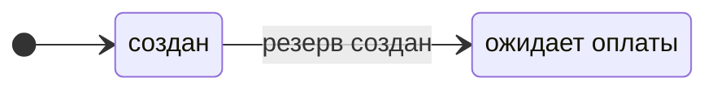

# Ф1. Аналитика: пошаговая инструкция

**Для кого:** системный аналитик, который ведёт проект. Окружение из Ф0 готово, репозиторий лежит в `C:\dev\digital-goods-marketplace`.
**Время:** 25–35 часов, недели 1–3 плана.
**Результат:** веха M1. Аналитическая база релиза R1: видение, процессы, статусные модели, user stories, use cases, доменная модель, методика проверки NFR и матрица трассировки.

Фаза Ф1 заканчивается до первой строки кода: из этих документов потом выводятся архитектура, контракты API и тесты. Порядок шагов важен, каждый следующий артефакт опирается на предыдущие. Идите сверху вниз. Если на шаге обнаружилось расхождение в требованиях, не правьте его молча, а действуйте по разделу «Если нашли расхождение».

**Что делаем детально, а что укрупнённо.** Релиз R1 прорабатывается полностью. Артефакты R2 и R3 (процессы BPMN-05…07, статусные модели SM-09…SM-11, эпики историй 9–12) делаются укрупнённо: основной путь и два-три исключения. Детали добавим перед соответствующей фазой.

## Время по шагам

| Шаг | Что делаем | Часы | Неделя плана |
| --- | --- | --- | --- |
| 1 | Видение, стейкхолдеры, глоссарий | 2–3 | 1 |
| 2 | Бизнес-процессы BPMN-01…07 | 7–9 | 1–2 |
| 3 | Статусные модели SM-01…11 | 4–6 | 2 |
| 4 | User stories | 5–7 | 2 |
| 5 | Use cases UC-01…05 | 2–3 | 3 |
| 6 | Доменная модель, bounded contexts, ER | 3–4 | 3 |
| 7 | Методика проверки NFR, матрица трассировки v1 | 2–4 | 3 |

---

## Общие правила

### Рабочий цикл для каждого артефакта

Он повторяется на каждом шаге.

1. Положите файл в нужную папку репозитория: `C:\dev\digital-goods-marketplace\docs\...`. Файлы, скачанные браузером, попадают в «Загрузки», а GitHub Desktop видит только то, что лежит внутри папки репозитория.
2. Откройте папку проекта в VS Code (File → Open Folder) и откройте файл. Предпросмотр: `Ctrl + Shift + V`. Диаграммы Mermaid рисуются прямо в нём.
3. Проверьте артефакт по вопросам из блока «Что проверить» в нужном шаге.
4. Исправьте то, что нашли.
5. В GitHub Desktop впишите подпись в поле **Summary**, нажмите **Commit to main**, затем **Push origin**. Один артефакт или одна связанная группа артефактов дают один commit.

### Где что лежит

Имена файлов латиницей, строчными буквами, слова через дефис: `BPMN-01-purchase.bpmn`. Кириллица и пробелы в именах создают проблемы в ссылках и командах.

| Артефакт | Папка | Имя файла |
| --- | --- | --- |
| Видение, стейкхолдеры, глоссарий | `docs/01-vision/` | `vision.md`, `stakeholders.md`, `glossary.md` |
| Бизнес-процесс | `docs/03-processes/` | `BPMN-NN-name.bpmn`, `BPMN-NN-name.svg`, `BPMN-NN-name.md` |
| Статусная модель | `docs/03-processes/` | `SM-NN-name.md` |
| User stories | `docs/02-requirements/` | `US-NN-epic.md` (один файл на эпик, NN номер эпика) |
| Use case | `docs/02-requirements/` | `UC-NN-name.md` |
| Домен и данные | `docs/04-domain/` | `domain-model.md`, `bounded-contexts.md`, `logical-er.md` |
| Методика проверки NFR | `docs/08-testing/` | `nfr-methodology.md` |
| Матрица трассировки | `docs/08-testing/` | `traceability.md` |

### Идентификаторы

| Что | Формат | Пример |
| --- | --- | --- |
| Бизнес-цель | BG-NN | BG-01 |
| Функциональное требование | FT-группа.номер | FT-6.5 |
| Нефункциональное требование | NFT-группа.номер | NFT-2.4 |
| User story | US-эпик.номер | US-5.2 |
| Use case | UC-NN | UC-05 |
| Бизнес-процесс | BPMN-NN | BPMN-01 |
| Статусная модель | SM-NN | SM-01 |

Все идентификаторы FT и NFT берутся из [требований v1.5](02-requirements/requirements_v1.5.md). Придумывать новые нельзя: если требования не хватает, действуйте по разделу ниже.

### Если нашли расхождение

При проработке процессов и статусов вы обязательно найдёте места, где требования противоречат друг другу или чего-то не хватает. Это нормально, ради этого фаза Ф1 и существует.

1. Запишите вопрос в документе, над которым работаете, в раздел «Решения и открытые вопросы». К моменту сдачи процесса вопрос должен быть решён: в разделе остаётся строка «Открытых вопросов по процессу нет».
2. Решите, меняет ли ответ требования.
   - **Не меняет** (уточнение внутри существующего требования): зафиксируйте решение в документе и идите дальше.
   - **Меняет** (новое требование, другой срок, другой статус): выпускается новая версия требований. Файл следующей версии (после v1.5 это `requirements_v1.6.md`) кладётся рядом с предыдущей, в приложение D добавляется строка с описанием изменений, закрытые вопросы убираются из приложения C, ссылки в документах переключаются на новую версию.
3. Не правьте утверждённую версию на месте (сейчас это v1.5): версия, на которую ссылаются документы, не должна меняться незаметно.

---

## Шаг 1. Видение, стейкхолдеры, глоссарий

**Папка:** `docs/01-vision/`. **Файлы:** `vision.md`, `stakeholders.md`, `glossary.md`. README в папке уже есть.

**1.1. Положите файлы в папку** и откройте их в предпросмотре VS Code.

**1.2. Прочитайте все три документа** и проверьте.

*Что проверить:*

- Цели BG-01…BG-06 в видении совпадают с разделом 1.1 требований. У каждой цели есть измеримый показатель и способ измерения.
- Границы «входит» и «не входит» не противоречат разделу 1.3 требований.
- В карте стейкхолдеров нет забытой стороны. Спросите себя: кто ещё влияет на систему или зависит от неё?
- Конфликты интересов в стейкхолдерах описаны так, что решение каждого можно найти в требованиях.
- Каждый термин в глоссарии имеет одно значение. Особенно внимательно прочитайте «выдан» и «доставлен»: от этой разницы зависит цель BG-01.
- Все ссылки на FT и NFT существуют в требованиях.

**1.3. Commit.** Подпись: `docs: видение, стейкхолдеры и глоссарий`.

*Что уметь объяснить:*

- Чем видение отличается от требований: видение отвечает на вопросы «зачем» и «для кого», требования на вопрос «что система должна делать».
- Что такое карта стейкхолдеров «влияние и интерес» и как она меняет способ работы с каждой стороной.
- Зачем нужен глоссарий: без него аналитик, разработчик и тестировщик по-разному понимают слово «выдан».

---

## Шаг 2. Бизнес-процессы (BPMN)

BPMN показывает, как работают участники и системы: кто что делает, где процесс ветвится и что происходит при сбое. Для каждого процесса в папке `docs/03-processes/` лежат три файла:

- `BPMN-NN-name.bpmn`: сама диаграмма, открывается в редакторе bpmn.io;
- `BPMN-NN-name.svg`: картинка, которую GitHub показывает прямо в описании;
- `BPMN-NN-name.md`: описание процесса. Поля: релиз, участники, триггер, реализуемые требования, связанные статусные модели. Разделы: диаграмма, основной путь, исключения и альтернативы, решения и открытые вопросы.

### 2.0. Как открыть и править диаграмму в bpmn.io

1. Откройте https://demo.bpmn.io и перетащите файл `.bpmn` в окно браузера.
2. Чтобы переименовать элемент, дважды щёлкните по нему. Новые элементы берутся из палитры слева или из меню, которое появляется рядом с выделенным элементом.
3. Внизу справа две кнопки скачивания: диаграмма BPMN и картинка SVG. Скачайте оба файла.
4. Файлы окажутся в «Загрузках». Переименуйте их по правилу из раздела «Где что лежит», положите в `docs/03-processes/` с заменой старых и сделайте commit.

Редактор нужен и для проверки черновика, и для собственных правок. Положение элементов на схеме не влияет на смысл процесса, влияет только смысл связей и подписей.

**Какие элементы BPMN нам понадобятся:**

| Элемент | Что обозначает в нашем проекте |
| --- | --- |
| Пул | Участник процесса целиком: Покупатель, Платформа, Платёжный шлюз, E-mail-провайдер |
| Дорожка | Роль или сервис внутри платформы: Заказы, Платежи, Выдача, Модератор |
| Стартовое событие | Что запускает процесс: покупатель нажал «Купить», продавец подал заявку |
| Пользовательская задача | Шаг, который выполняет человек |
| Сервисная задача | Шаг, который выполняет система: зарезервировать ключ, отправить письмо |
| Исключающий шлюз (XOR) | Выбор одного пути: «платёж подтверждён?» Каждый выход подписывается |
| Граничное событие таймера | «Что, если время вышло»: резерв 15 минут, платёжная сессия 12 минут, ответ API продавца 10 минут |
| Событие получения сообщения | Ожидание уведомления извне: подтверждение платежа от шлюза, статус письма |
| Конечное событие | Результат процесса. Несколько концов означают несколько исходов: выдан, отменён, возвращён |

### 2.1. Критерии качества процесса

- Показан основной путь и пути исключений: отказ, тайм-аут, сбой внешней системы.
- У каждой ветки есть конец. Нет «висящих» стрелок.
- Выходы каждого шлюза подписаны условиями.
- Внешние системы (шлюз, почта, SMS) показаны отдельными участниками, а не задачами внутри платформы.
- Сроки названы так же, как параметры в требованиях (резерв, платёжная сессия), числа совпадают с ними.
- В описании `.md` перечислены реализуемые требования (FT и NFT).
- Названия задач имеют вид «глагол + объект»: «Зарезервировать ключи», «Отправить письмо».

### 2.2. Процессы и что в них обязательно показать

| Процесс | Релиз | Требования | Что обязательно показать |
| --- | --- | --- | --- |
| **BPMN-01 Покупка**, `BPMN-01-purchase` | R1 | FT-1.5, FT-5.0 … FT-5.4, FT-6.0 … FT-6.5, FT-7.0, FT-7.1, FT-7.3, NFT-2.0, NFT-2.1 | Подтверждение телефона перед первой покупкой без потери выбранного товара. Резерв 15 минут и платёжная сессия 12 минут. Успешная оплата, привязка ключа, отправка письма, доставка. Отказ в оплате (резерв снимается сразу). Истечение сессии без оплаты. **Поздняя оплата**: попытка перерезервирования, при успехе заказ из «отменён» становится «оплачен», при неудаче автовозврат и статус «возвращён». Повторное уведомление шлюза без дублей. Сбой письма: повторы, затем передача в поддержку. Автовозврат не удался: очередь администратора и ручная отметка возврата. Частичной выдачи нет: заказ выдаётся или возвращается целиком |
| **BPMN-02 Подключение продавца**, `BPMN-02-seller-onboarding` | R1 | FT-1.3, FT-2.0 … FT-2.2, FT-2.4 | Подача анкеты с документами. Три решения модератора: одобрить, отклонить с причиной, вернуть на доработку. Повторная подача после доработки. Срок рассмотрения 3 суток. Уведомление заявителя. Новая заявка после отказа не раньше чем через 24 часа. Двухфакторная аутентификация продавца |
| **BPMN-03 Модерация товара**, `BPMN-03-product-moderation` | R1 | FT-3.0 … FT-3.2, FT-4.1, FT-4.4, FT-11.4 | Создание товара и загрузка пула ключей. Отправка на модерацию, решение, причина отклонения. Правка названия, описания или типа опубликованного товара возвращает его на модерацию. На витрине только опубликованные товары. Письмо продавцу о решении |
| **BPMN-04 Обращение в поддержку**, `BPMN-04-support-request` | R1 | FT-1.7, FT-7.2, FT-7.3, FT-7.5, FT-1.5, FT-11.2, NFT-2.4, NFT-3.7 | Обращение в течение 72 часов после выдачи. Очередь поддержки, в которую попадают и обращения покупателей, и заказы, автоматически переданные системой. Повторная отправка (снимок адреса в заказе обновляется). Смена e-mail: оператор меняет адрес, а код из SMS вводит сам покупатель, оператор видит только результат проверки. Адрес меняется после двух кодов: на телефон и на новый e-mail. Вход по коду из SMS для покупателя без доступа к e-mail. Код одноразовый, 5 минут, 5 попыток. Запись в журнал аудита |
| **BPMN-05 Спор**, `BPMN-05-dispute` | R2 | FT-8.0 … FT-8.6, FT-9.2, FT-9.5 | Открытие в течение 72 часов, один спор на заказ. Ответ продавца без срока. Решение модератора за 24 часа: возврат, отказ или замена ключа. Деньги заморожены, пока спор открыт. Возврат через шлюз тем же механизмом, что автовозврат, комиссия при возврате не взимается. Замена ключа из пула или по API продавца, при отсутствии ключа спор возвращается модератору |
| **BPMN-06 Вывод средств**, `BPMN-06-withdrawal` | R2 | FT-2.3, FT-9.2 … FT-9.4, FT-11.4 | Начисление, удержание 7 дней, заявка от 1 000 ₽, проверка суммы и блокировки продавца, резерв, ручная выплата администратором со сроком обработки 3 суток, письмо продавцу, записи в неизменяемый журнал |
| **BPMN-07 Смена номера телефона**, `BPMN-07-phone-change` | R2 | FT-1.5, FT-1.6, FT-11.0, FT-11.2, NFT-3.5, NFT-3.7 | Код на e-mail учётной записи, проверка уникальности номера, затем код SMS на новый номер. Ограничения кода. Запись в журнал аудита. Уведомление о смене |

Для R2-процессов (05–07) достаточно основного пути и двух-трёх исключений.

**Порядок работы:** BPMN-01 самый длинный (около 3 часов), поэтому начните с него. Остальные идут по номерам. Процессы 05–07 занимают около часа каждый.

### 2.3. Три вопроса из приложения C закрыты (BPMN-04, требования v1.5)

При проработке процесса поддержки принимаются три решения:

1. Как покупателю попасть в личный кабинет и создать обращение, если он потерял доступ к e-mail и не помнит пароль, а вход через VK ID не подключён.
2. Нужно ли подтверждать новый e-mail при смене через поддержку (защита от опечатки, из-за которой ключ уйдёт на чужой адрес).
3. Что делать, если утрачены сразу e-mail и телефон.

Для каждого вопроса в `BPMN-04-support-request.md` в разделе «Решения и открытые вопросы» записаны варианты, плюсы и минусы, выбранное решение и причина. Решения: вход по коду из SMS с ограниченной сессией (FT-1.7), второй код на новый e-mail (FT-7.5), утрата обоих каналов вне MVP (раздел 1.3). Они вошли в `requirements_v1.5.md`, там же закрыты остальные вопросы по BPMN-01…07. В каждом `.md` процесса раздел «Решения и открытые вопросы» содержит строку «Открытых вопросов по процессу нет».

**Commit** для каждого процесса отдельно: `docs: BPMN-01 покупка`, `docs: BPMN-02 подключение продавца` и так далее.

*Что уметь объяснить:*

- Чем BPMN отличается от обычной блок-схемы: участники, сообщения между ними, события времени и ошибок.
- Где в процессе покупки Saga и что в ней компенсация (автовозврат, снятие резерва).
- Зачем в процессе граничные события таймера и откуда берутся числа 15, 12 и 10 минут.
- Почему внешние системы показываются отдельными участниками: мы не управляем их поведением и должны заложить их сбои.

---

## Шаг 3. Статусные модели

Статусная модель описывает жизненный цикл одной сущности: какие у неё бывают состояния и когда допустим каждый переход. Для денег и заказов это главный инструмент против ошибок вроде двойной выдачи ключа.

**Файлы:** `docs/03-processes/SM-NN-name.md`. Каждый документ состоит из пяти частей:

1. Сущность и ссылка на её описание в разделе 6.1 требований.
2. Диаграмма состояний в Mermaid.
3. **Матрица переходов:** из → в → условие → кто или что инициирует.
4. Недопустимые переходы с причинами.
5. Связанные требования и процессы.

### 3.1. Как рисовать диаграмму

В VS Code пишите диаграмму прямо в Markdown-файле. Русские названия состояний задаются через псевдоним (латинский идентификатор плюс подпись), иначе Mermaid не принимает пробелы:

````

````

Пример строки матрицы:

| Из | В | Условие | Кто или что инициирует |
| --- | --- | --- | --- |
| создан | ожидает оплаты | резерв ключей создан, платёжная сессия открыта | Система (сервис заказов) |

### 3.2. Модели и их особенности

| Модель | Файл | Статусы (раздел 6.1 требований) | На что обратить внимание |
| --- | --- | --- | --- |
| SM-01 Заказ | `SM-01-order.md` | создан, ожидает оплаты, оплачен, выдан, отменён, возвращён | Переход «отменён → оплачен» при успешном перерезервировании. Все пути в «возвращён»: поздняя оплата (R1), тайм-аут API продавца и решение спора (R2). Частичной выдачи нет: при нехватке ключей заказ возвращается целиком (FT-6.5) |
| SM-02 Платёж | `SM-02-payment.md` | создан, подтверждён, отклонён, возвращён | Повторное уведомление шлюза не меняет статус (идемпотентность). Подтверждение после отмены заказа |
| SM-03 Ключ | `SM-03-key.md` | свободен, зарезервирован, выдан, аннулирован | Возврат «зарезервирован → свободен» при снятии резерва. Почему из «выдан» нельзя вернуться в «свободен» (FT-7.1) |
| SM-04 Товар | `SM-04-product.md` | черновик, на модерации, опубликован, отклонён, заблокирован, архив | Правка опубликованного товара возвращает его на модерацию. Переход «отклонён → на модерации» после правки продавцом. Блокировка продавца блокирует товары |
| SM-05 Профиль продавца | `SM-05-seller-profile.md` | черновик, на проверке, на доработке, одобрен, отклонён, заблокирован | Цикл «на проверке ↔ на доработке» без автозакрытия. Переход «отклонён → черновик» не раньше чем через 24 часа после отказа (FT-2.4). Блокировка и снятие блокировки (FT-2.3) |
| SM-06 Выдача | `SM-06-delivery.md` | в очереди, отправлено, доставлено, ошибка | Связь с заказом: статус «выдан» наступает при «отправлено». Повторные попытки. Первичная и повторная выдача |
| SM-07 Обращение | `SM-07-support-ticket.md` | создано, в работе, решено | Кто и когда переводит обращение |
| SM-08 Резерв | `SM-08-reservation.md` | активен, использован, снят (сущность «Резерв» добавлена в раздел 6.1 требований v1.5) | Снятие по сроку и по отказу в оплате, использование при оплате, перерезервирование при поздней оплате (FT-6.5). Причина снятия хранится атрибутом |
| SM-09 Спор (R2) | `SM-09-dispute.md` | открыт, ожидает решения, решён | Связь с заморозкой денег. Один спор на заказ (FT-8.5). Возврат спора модератору при отсутствии ключа, срок 24 часа заново (FT-8.6) |
| SM-10 Заявка на вывод (R2) | `SM-10-withdrawal.md` | создана, на проверке, выплачена, отклонена | Минимальная сумма 1 000 ₽. Причина отказа, снимок реквизитов, срок обработки 3 суток. Резерв суммы при создании заявки |
| SM-11 Операция по балансу (R2) | `SM-11-balance-operation.md` | заморожена, доступна, выплачена, сторнирована | Причина заморозки (удержание, спор, резерв под вывод). Таблица переходов уже есть в `BPMN-06-withdrawal.md`, перенесите её и добавьте недопустимые переходы. Правило доступного остатка. Сторно при возврате (FT-9.5) |

**Порядок:** сначала цепочка покупки (SM-01, SM-02, SM-03, SM-08, SM-06), потом SM-04, SM-05, SM-07, затем R2 (SM-09, SM-10, SM-11).

### 3.3. Сквозная проверка согласованности

Когда готовы модели цепочки покупки, в конец `SM-01-order.md` добавьте таблицу: для каждого статуса заказа указано, в каких статусах при этом находятся платёж, ключи, резерв и выдача.

| Статус заказа | Платёж | Ключ | Резерв | Выдача |
| --- | --- | --- | --- | --- |
| ожидает оплаты | создан | зарезервирован | активен | нет записи |

Строки, которые не получается заполнить однозначно, это дыры в логике. Особенно проверьте строки «отменён» (в том числе после поздней оплаты) и «возвращён».

### 3.4. Что проверить

- В каждой модели есть матрица «из → в → условие → инициатор».
- Недопустимые переходы перечислены явно, у каждого указана причина.
- Каждый статус достижим, и у каждого нефинального статуса есть выход.
- Названия статусов совпадают с требованиями (раздел 6.1) и с глоссарием.
- Все переходы из процессов BPMN отражены в моделях, и наоборот.

**Commit:** группами, например `docs: статусные модели заказа, платежа, ключа, резерва и выдачи`.

*Что уметь объяснить:*

- Зачем описывать жизненный цикл сущности как конечный автомат и как недопустимые переходы превращаются в проверки в коде и ограничения в базе.
- Чем статус заказа отличается от статуса платежа и статуса выдачи, и почему «выдан» и «доставлен» разведены.

---

## Шаг 4. User stories

User story описывает ценность для роли и критерии, по которым принимается результат. В отличие от требования, она привязана к человеку и проверяется сценарием.

**Файлы:** `docs/02-requirements/US-NN-epic.md`, один файл на эпик. Внутри каждого файла несколько историй по шаблону [`_template-user-story.md`](02-requirements/_template-user-story.md): таблица полей (ID, релиз, требования, процесс или use case), текст «Как… я хочу… чтобы…», критерии «Дано / Когда / Тогда», примечания.

### 4.1. Эпики

| № | Эпик | Файл | Требования | Релиз |
| --- | --- | --- | --- | --- |
| 1 | Учётные записи | `US-01-accounts.md` | FT-1.0 … FT-1.3, FT-1.5, FT-1.6 | R1 (FT-1.6 R2) |
| 2 | Продавцы | `US-02-sellers.md` | FT-2.0 … FT-2.3 | R1 (FT-2.3 R2) |
| 3 | Каталог | `US-03-catalog.md` | FT-3.0 … FT-3.4 | R1 |
| 4 | Ключи и остатки | `US-04-keys.md` | FT-4.0 … FT-4.4 | R1 (выдача по API R2) |
| 5 | Заказ и оплата | `US-05-order-payment.md` | FT-5.0 … FT-5.4, FT-6.0 … FT-6.5 | R1 |
| 6 | Выдача и доставка | `US-06-delivery.md` | FT-7.0, FT-7.1, FT-7.3, FT-7.4 | R1 (FT-7.4 R2) |
| 7 | Поддержка | `US-07-support.md` | FT-7.2, FT-7.5 | R1 |
| 8 | Администрирование и аудит | `US-08-admin-audit.md` | FT-1.4, FT-9.0, FT-11.0 … FT-11.2 | R1 |
| 9 | Споры и возвраты | `US-09-disputes.md` | FT-8.0 … FT-8.4 | R2 |
| 10 | Финансы продавца | `US-10-finance.md` | FT-9.2 … FT-9.4 | R2 |
| 11 | API продавца | `US-11-seller-api.md` | FT-10.0 … FT-10.3 | R2 |
| 12 | Комиссия и отчёты | `US-12-commission-reports.md` | FT-9.1, FT-11.3 | R3 |

Релиз каждой истории берётся из таблицы требований, а не из эпика.

### 4.2. Как писать

- **Роль** берётся из раздела 3 требований (гость, покупатель, продавец, модератор, оператор поддержки, администратор) или «Система» для автоматических действий.
- **Одна история, один результат.** Если в истории слово «и» соединяет два разных результата, разделите её. Ориентир: одна история на одно-два требования, в R1 получится около 40 историй.
- **Критерии приёмки** в формате «Дано / Когда / Тогда». В каждой истории R1 минимум два сценария: основной и исключение.
- **Числа берутся из требований:** 15 минут, 72 часа, 3 суток, 5 попыток. Критерий без проверяемого условия («работает быстро») не годится.
- **Нефункциональные требования** подключайте к историям, в чьи критерии они входят (например, NFT-2.1 в историю о доставке письма).
- **R2 и R3:** текст истории и ссылка на требование, один сценарий только там, где поведение неочевидно.

### 4.3. Что проверить

- Каждое требование FT релиза R1 покрыто хотя бы одной историей.
- Каждая история ссылается хотя бы на одно требование. Историй «из головы» без требований быть не должно.
- В R1 у каждой истории есть сценарий исключения.
- Критерии можно превратить в тест: понятно, что подать на вход и что проверить на выходе.
- Роли в историях совпадают с ролевой моделью и учитывают, кому какие действия доступны.

**Commit:** по эпику или по группе эпиков, например `docs: user stories эпика «Заказ и оплата»`.

*Что уметь объяснить:*

- Чем user story отличается от требования и от use case.
- Принцип INVEST (независимая, обсуждаемая, ценная, оцениваемая, небольшая, проверяемая) и как вы его применяли.
- Как критерии «Дано / Когда / Тогда» становятся тест-кейсами в Ф4.

---

## Шаг 5. Use cases

Use case описывает диалог актора с системой на одном сценарии: что делает актор, что отвечает система, что бывает при ошибке. История отвечает на вопрос «зачем», use case на вопрос «как шаг за шагом».

**Файлы:** `docs/02-requirements/UC-NN-name.md` по шаблону [`_template-use-case.md`](02-requirements/_template-use-case.md).

| UC | Файл | Актор | Процесс | Требования |
| --- | --- | --- | --- | --- |
| UC-01 Покупка цифрового товара | `UC-01-purchase.md` | Покупатель | BPMN-01 | FT-5.0 … FT-5.3, FT-6.0 … FT-6.3 |
| UC-02 Подача заявки продавца и модерация | `UC-02-seller-application.md` | Продавец, модератор | BPMN-02 | FT-2.0 … FT-2.2 |
| UC-03 Выдача ключа и гарантированная доставка | `UC-03-key-issuance.md` | Система | BPMN-01 (выдача), SM-06 | FT-7.0, FT-7.1, FT-7.3 |
| UC-04 Обращение в поддержку, повторная отправка, смена e-mail | `UC-04-support-request.md` | Покупатель, оператор поддержки | BPMN-04 | FT-7.2, FT-7.5, FT-1.5 |
| UC-05 Поздняя оплата и автовозврат | `UC-05-late-payment.md` | Система | BPMN-01 (поздняя оплата) | FT-6.4, FT-6.5 |

Для UC-03 и UC-05 актором выступает «Система»: сценарий запускает событие (оплата, истечение срока), а не человек. Это нормально для системных сценариев.

*Что проверить:*

- Шаги сценария совпадают с процессом BPMN. В use case нет шага, которого нет в диаграмме, и наоборот.
- Предусловия и постусловия записаны в статусах из моделей SM, например «заказ в статусе „ожидает оплаты“».
- Альтернативные сценарии (нумерация 2a, 3b) и исключения (нумерация 3x) покрывают все ветки диаграммы.
- Нефункциональные ограничения содержат конкретные числа из NFT.

**Commit:** `docs: use cases UC-01…UC-05`.

*Что уметь объяснить:*

- Как связаны между собой история, use case и BPMN и зачем нужны все три.
- Что такое основной, альтернативный и исключительный сценарий.

---

## Шаг 6. Домен и данные

**Папка:** `docs/04-domain/`.

**6.1. Доменная модель** (`domain-model.md`). Сущности из раздела 6.1 требований, в том числе «Резерв» (добавлена в v1.5 по итогам BPMN-01). Для каждой сущности: назначение, ключевые атрибуты, связи, статусы (ссылка на SM), владелец данных. Отдельным списком инварианты, которые всегда должны быть верны, например:

- один ключ принадлежит не более чем одному заказу;
- количество в заказе от 1 до 10;
- платёжная сессия короче резерва;
- сумма заказа равна цене, умноженной на количество.

**6.2. Bounded contexts** (`bounded-contexts.md`). За основу берётся логическая декомпозиция на сервисы (раздел 8.1 требований). Для каждого контекста: ответственность, сущности, которыми он владеет, что он отдаёт и принимает. Плюс карта отношений контекстов (диаграмма Mermaid `flowchart`): кто от кого зависит, какие связи синхронные, какие через события, где стоит «переводчик» для внешней системы.

**6.3. Логическая ER-диаграмма** (`logical-er.md`). Диаграмма Mermaid `erDiagram`: сущности, ключевые атрибуты, связи с кратностью. Типы данных, индексы и таблицы под реализацию сюда не входят, они появятся в Ф2 в `docs/07-data/`.

*Что проверить:*

- У каждой сущности ровно один контекст-владелец. Два контекста, которые меняют одну сущность, означают, что границы проведены неверно.
- Между контекстами сущности связаны только по идентификатору, без «общих таблиц».
- Все сущности раздела 6.1 есть на диаграмме. Статусы совпадают с моделями SM.
- Инварианты не противоречат требованиям и процессам.

**Commit:** `docs: доменная модель и bounded contexts`, `docs: логическая ER-диаграмма`.

*Что уметь объяснить:*

- Что такое bounded context и почему граница контекста становится границей микросервиса и отдельной базы данных.
- Чем логическая модель отличается от физической.
- Почему в микросервисах нельзя делать JOIN между базами разных сервисов и чем его заменяют (события, копии нужных данных, запросы по API).

---

## Шаг 7. Контроль качества требований

### 7.1. Методика проверки NFR

**Файл:** `docs/08-testing/nfr-methodology.md`. Нефункциональное требование без способа проверки остаётся пожеланием. Для каждого NFT заполните строку:

| Поле | Что записать |
| --- | --- |
| Требование | ID и формулировка |
| Что измеряем | Конкретная метрика: «время от подтверждения оплаты до приёма письма провайдером» |
| Как измеряем | Инструмент или запрос: нагрузочный тест, метрика Prometheus, SQL-запрос, ревью |
| Условия | Нагрузка, объём данных, окружение |
| Порог | Число из требования и перцентиль, если есть |
| Когда и где проверяем | Фаза (Ф4, Ф5, Ф6), локально или на сервере |

Два примера для ориентира:

- **NFT-2.0** (письмо передано провайдеру за 60 секунд): метрика «время от события подтверждения оплаты до события приёма письма провайдером», считается по меткам времени событий, порог 60 секунд на 95-м перцентиле, проверка на тестовой нагрузке в Ф4.
- **NFT-2.2** (ноль дублей ключей): тест на конкуренцию, где параллельные заказы борются за последние ключи пула, затем SQL-проверка, что ни один ключ не привязан к двум заказам. Порог: ноль случаев.

Часть требований нельзя проверить на учебном демо в полном виде: доступность 99,5% в месяц, RPO и RTO, хранение в РФ. Для них в графе «Как измеряем» честно запишите замену: расчёт, проверка процедуры восстановления, ревью конфигурации. Так вы покажете, что понимаете границы проверки.

**Commit:** `docs: методика проверки NFR`.

### 7.2. Матрица трассировки v1

**Файл:** `docs/08-testing/traceability.md`. Колонки: BG, требование, user story, процесс / UC / SM, API / событие, тест-кейс, код. После Ф1 заполняются первые четыре, остальные дополняются в Ф2 (API и события) и Ф4 (тесты и код).

**Как заполнять:**

1. Строка на каждое требование релиза R1 (FT и NFT). Цель BG берётся из приложения B требований.
2. В колонке «User story» идентификаторы историй, которые это требование реализуют. Для NFT указывается история, в чьи критерии входит это свойство. Если такой нет (например, доступность), ставится прочерк и ссылка на строку в методике проверки.
3. В колонке «Процесс / UC / SM» идентификаторы BPMN, UC и SM, где требование реализуется.
4. Клетки, которые заполнятся позже (API, тест-кейс, код), оставляйте пустыми.

**Что проверить:** для R1 в первых четырёх колонках нет пустых клеток. Пустая клетка здесь не ошибка заполнения, а находка: требование без истории или процесса, либо история без требования.

**Commit:** `docs: матрица трассировки v1`.

*Что уметь объяснить:*

- Зачем нужна трассировка: показать, что каждое требование реализовано и проверено, и что нет работ «просто так».
- Как по матрице оценить влияние изменения требования (какие истории, процессы и тесты затронуты).
- Как проверить нефункциональное требование и как измерить, а не декларировать.

---

## Контрольный список (веха M1)

- [ ] `docs/01-vision/`: видение, стейкхолдеры, глоссарий
- [ ] BPMN-01…07: у каждого три файла (`.bpmn`, `.svg`, `.md`), R1-процессы проработаны полностью, R2-процессы укрупнённо
- [x] Три вопроса из приложения C закрыты, решения записаны в `BPMN-04-support-request.md`, выпущена `requirements_v1.5.md`
- [ ] В каждом `.md` процесса нет открытых вопросов, раздел «Решения и открытые вопросы» заканчивается строкой «Открытых вопросов по процессу нет»
- [ ] SM-01…11: матрицы переходов и списки недопустимых переходов
- [ ] Сквозная таблица согласованности статусов в SM-01 заполнена без неоднозначных строк
- [ ] User stories по 12 эпикам: R1 с критериями «Дано / Когда / Тогда», R2 и R3 укрупнённо
- [ ] Каждое FT релиза R1 покрыто хотя бы одной историей
- [ ] UC-01…UC-05 согласованы с процессами
- [ ] Доменная модель, bounded contexts, логическая ER-диаграмма
- [ ] Методика проверки NFR покрывает все NFT
- [ ] Матрица трассировки v1: для R1 нет пустых клеток в первых четырёх колонках
- [ ] Ссылки между документами открываются (в предпросмотре VS Code `Ctrl + клик` по ссылке)
- [ ] README в папках `docs/` обновлены: перечислены все новые документы
- [ ] Всё отправлено на GitHub, на github.com отображаются диаграммы Mermaid и картинки SVG

## Если что-то пошло не так

| Проблема | Что делать |
| --- | --- |
| GitHub Desktop не видит новый файл | Файл лежит не в папке репозитория (чаще всего остался в «Загрузках»). Переместите его в нужную подпапку `C:\dev\digital-goods-marketplace\docs\...` |
| Скачанный файл называется `vision (1).md` | Браузер добавил номер, потому что файл с таким именем уже есть. Удалите старый, а новый переименуйте |
| Commit не выполняется | Подпись пишется в поле **Summary**, а не в **Description**. Если вставили в Description, вырежьте текст и вставьте в Summary |
| Диаграмма Mermaid не рисуется в предпросмотре | Проверьте, что блок начинается с ` ```mermaid ` и закрыт ` ``` `. Русские названия состояний задавайте через псевдоним (`id: текст`). Проверьте расширение Markdown Preview Mermaid Support и перезапустите VS Code |
| Таблица Markdown превратилась в строку текста | Перед таблицей нужна пустая строка, во всех строках одинаковое число колонок. Вертикальную черту внутри ячейки нужно экранировать обратной косой чертой |
| bpmn.io не открывает файл | Проверьте, что файл скачался целиком и имеет расширение `.bpmn`, а не `.xml` или `.txt`. Скачайте файл заново |
| Элементы BPMN наложились друг на друга | Перетащите их мышью. Положение влияет только на читаемость |
| Картинка SVG не отображается на GitHub | Проверьте имя файла и путь. Windows не различает регистр букв, GitHub различает: `BPMN-01-Purchase.svg` и `BPMN-01-purchase.svg` для него разные файлы |
| Ссылка между документами не открывается | Проверьте относительный путь. Например, из `docs/03-processes/` на требования ведёт `../02-requirements/requirements_v1.5.md`. Проверьте дефисы и регистр |
| В матрице трассировки остаются пустые клетки | Это находка, а не сбой. Либо у требования нет истории или процесса (допишите), либо есть артефакт без требования (найдите требование или уберите лишнее) |
| Часы вышли за пределы 35 | Сократите R2 и R3: для BPMN-05…07, SM-09…SM-11 и историй эпиков 9–12 достаточно основного пути. R1 не сокращайте |
| Нашли ошибку в уже отправленном документе | Исправьте файл и сделайте новый commit, например `docs: исправлен статус в SM-01`. Историю переписывать не нужно |
