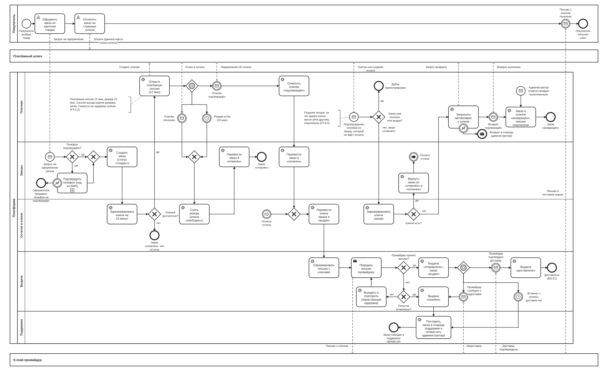

# BPMN-01. Покупка цифрового товара

| Поле | Содержание |
| --- | --- |
| ID | BPMN-01 |
| Релиз | R1 |
| Участники | Покупатель. Платформа (дорожки: Платежи, Заказы, Остатки и ключи, Выдача, Поддержка). Внешние системы: платёжный шлюз, e-mail-провайдер |
| Триггер | Покупатель нажимает «Оформить заказ» в карточке товара |
| Результат | Ключи доставлены на e-mail покупателя (заказ «выдан», выдача «доставлено»). Либо заказ отменён, возвращён или передан в поддержку |
| Требования | FT-1.5, FT-4.4, FT-5.0, FT-5.1, FT-5.2, FT-5.3, FT-6.0, FT-6.1, FT-6.2, FT-6.3, FT-6.4, FT-6.5, FT-7.0, FT-7.1, FT-7.3, FT-11.0, NFT-2.0, NFT-2.1, NFT-2.2, NFT-2.3, NFT-2.4, NFT-3.7, NFT-4.3, NFT-5.1 |
| Статусные модели | SM-01 Заказ, SM-02 Платёж, SM-03 Ключ, SM-06 Выдача, SM-08 Резерв |
| Связанные артефакты | UC-01, UC-03, UC-05, BPMN-04 (дальше идёт передача заказа в поддержку) |

Процесс описывает сквозной сценарий покупки: резерв, оплата, выдача ключа и гарантированная доставка. Поздняя оплата и автовозврат нарисованы в нём же, потому что они начинаются с того же платежа и заканчиваются теми же статусами заказа.

## Диаграмма

Диаграмма большая. Для чтения откройте [картинку](BPMN-01-purchase.svg) целиком или файл [BPMN-01-purchase.bpmn](BPMN-01-purchase.bpmn) в редакторе bpmn.io.

**Как читать.**

- Дорожки платформы соответствуют логическим сервисам из раздела 8.1 требований.
- Платёжный шлюз и e-mail-провайдер показаны отдельными участниками: мы не управляем их поведением, поэтому сбои и задержки заложены в сам процесс.
- Пунктир показывает сообщения между участниками, сплошные стрелки показывают порядок шагов.
- Ромб с пятиугольником (событийный шлюз) значит «ждём, какое из событий наступит раньше».
- Круг со стрелкой «Оплата учтена» соединяет ветку поздней оплаты с общим путём выдачи без длинной линии через всю схему.
- Круг с конвертом над задачей «Заказ и платёж «возвращён», письмо покупателю» это отметка администратора о ручном возврате (путь E8). Администратор работает вне диаграммы: платформа получает от него только это сообщение.
- Числа 15, 12 и 30 минут на диаграмме совпадают с параметрами и требованиями.

## Основной путь

1. Покупатель выбирает товар и количество от 1 до 10 и оформляет заказ (FT-5.0, FT-5.1). Запрос получает сервис заказов.
2. Сервис проверяет, подтверждён ли телефон. Если нет, покупатель вводит код из SMS, выбранный товар и количество сохраняются (FT-1.5). Подтверждение выполняется один раз.
3. Создаётся заказ со статусом «создан». В заказ записывается снимок e-mail покупателя.
4. Остатки и ключи резервируют ключи на 15 минут. Строки блокируются с пропуском занятых, поэтому один ключ не достаётся двум заказам (FT-5.2, FT-7.1, NFT-2.2).
5. Платежи создают платёж у шлюза и открывают платёжную сессию на 12 минут. Заказ получает статус «ожидает оплаты».
6. Покупатель оплачивает на странице шлюза. Данные карты на платформу не попадают (FT-6.0, NFT-5.1).
7. Шлюз присылает подтверждение. Платежи отмечают платёж «подтверждён», обработка идемпотентна (FT-6.2). Заказ переходит в «оплачен».
8. Ключи заказа переходят в «выдан» (SM-03).
9. Выдача формирует письмо (выдача «в очереди») и передаёт его провайдеру. На это отводится не более 60 секунд для 95% заказов (NFT-2.0).
10. Провайдер принимает письмо. Выдача получает статус «отправлено», заказ получает статус «выдан». С этого момента открываются окно обращения в поддержку (72 часа, FT-7.2), окно спора (72 часа, FT-8.0) и срок удержания средств (7 дней, FT-9.2).
11. Провайдер подтверждает доставку. Выдача получает статус «доставлено», покупатель получает письмо с ключом. По этому статусу измеряется цель BG-01 (NFT-2.1).

## Исключения и альтернативы

| № | Ситуация | Что делает система | Результат | Требования |
| --- | --- | --- | --- | --- |
| E1 | Телефон не подтверждён: код неверный, истёк, исчерпаны 5 попыток или номер уже привязан к другой учётной записи | Оформление прерывается. Если номер занят, покупатель видит нейтральное сообщение без указания причины | Заказ не создаётся | FT-1.5, NFT-3.7 |
| E2 | Ключей недостаточно | Резерв не создаётся, покупателю показывается сообщение об остатке | Заказ: «создан» → «отменён» | FT-4.4, FT-5.2 |
| E3 | Шлюз отклонил платёж | Резерв снимается сразу | Ключи «свободны», заказ «отменён» | FT-6.3 |
| E4 | Платёжная сессия истекла без оплаты | Резерв снимается по истечении 15 минут | Ключи «свободны», заказ «отменён» | FT-5.2, FT-6.3 |
| E5 | Шлюз повторно прислал подтверждение, заказ уже «оплачен» или «выдан» | Уведомление игнорируется | Дублей оплаты и выдачи нет | FT-6.2, NFT-2.3 |
| E6 | Поздняя оплата: подтверждение пришло после снятия резерва, ключи удалось зарезервировать заново | Платёж «подтверждён», выдача идёт как в основном пути с шага 8 | Заказ: «отменён» → «оплачен» | FT-6.5 |
| E7 | Поздняя оплата, ключей для повторного резерва нет или их меньше, чем заказано | Частичной выдачи нет: заказ выдаётся целиком либо возвращается целиком. Автовозврат всей суммы через шлюз, письмо покупателю | Платёж «возвращён», заказ «возвращён» | FT-6.4, FT-6.5, FT-11.0 |
| E8 | Автовозврат не удался: сбой шлюза, попытки исчерпаны | Возврат передаётся в очередь администратора. Администратор возвращает деньги вручную в кабинете шлюза и отмечает возврат выполненным в платформе. Дальше как после подтверждения шлюза: платёж и заказ «возвращён», письмо покупателю | Заказ остаётся «отменён» до отметки администратора, затем «возвращён» | FT-6.4, FT-11.0 |
| E9 | Провайдер не принял письмо | Повторы с нарастающей задержкой. Когда попытки исчерпаны: выдача «ошибка», заказ в очередь поддержки, оповещение администратора | Заказ остаётся в «оплачен» | FT-7.3, NFT-4.3 |
| E10 | Провайдер сообщил о недоставке: отказ или неверный адрес | Выдача «ошибка», заказ в очередь поддержки | Заказ «выдан», выдача «ошибка» | FT-7.3 |
| E11 | Подтверждения доставки нет 30 минут | Заказ в очередь поддержки, оповещение администратора | Заказ «выдан», выдача «отправлено» | FT-7.3, NFT-2.4 |
| E12 | Шлюз не открыл платёжную сессию: недоступен или не ответил после повторных попыток, хотя резерв уже создан | Резерв снимается, платёж не создаётся. Покупатель видит, что оплату открыть не удалось, и может оформить заказ заново | Ключи «свободны», заказ «отменён» | FT-5.2, NFT-4.3 |

Заказы из очереди поддержки (E9, E10, E11) дальше обрабатываются по BPMN-04: повторная отправка ключа или смена e-mail.

## Сроки и таймеры

| Срок | Значение | Где на диаграмме | Источник |
| --- | --- | --- | --- |
| Резерв ключей | 15 минут, параметр платформы | Таймер «Резерв истёк» | FT-5.2 |
| Платёжная сессия | 12 минут, параметр платформы, всегда короче резерва | Задача «Открыть платёжную сессию» | FT-5.2 |
| Передача письма провайдеру | Не более 60 секунд для 95% заказов | Задача «Передать письмо провайдеру» | NFT-2.0 |
| Доставка письма | Не более 30 минут для 95% заказов | Таймер «30 минут с оплаты» | FT-7.0, NFT-2.1 |
| Контроль зависшей выдачи | Через 30 минут заказ попадает в очередь поддержки | Таймер «30 минут с оплаты» | FT-7.3, NFT-2.4 |
| Одноразовый код | 5 минут, 5 попыток | Подпроцесс «Подтвердить телефон» | NFT-3.7 |

## Решения и открытые вопросы

**Приняты при моделировании:**

1. **Один вход для уведомлений шлюза.** Пока заказ ждёт оплаты, подтверждение получает основной поток (событийный шлюз). Подтверждение, которое пришло, когда заказ уже не ждёт оплаты (отменён, оплачен, выдан), запускает отдельный поток внизу диаграммы. В реализации это одно место приёма уведомлений шлюза и решение по статусу заказа.
2. **Таймер 30 минут.** На диаграмме он стоит в точке ожидания доставки. В реализации отсчёт идёт от момента оплаты (NFT-2.4), поэтому часть срока могли уже занять повторы отправки.
3. **Подтверждение телефона свёрнуто в подпроцесс.** Детализация (кто и где проверяет код) делается на sequence-диаграмме в Ф2 вместе с решением ADR-010.
4. **Количество попыток и задержки повторов** (отправка письма, возврат) это параметры платформы (FT-11.1). Конкретные значения подбираются в Ф2 в бюджетах времени и на бизнес-логику процесса не влияют.
5. **Выдача по API продавца** (FT-4.0, FT-7.4) в R1 не нужна и не нарисована. В R2 она появится ветвлением после «оплачен»: запрос ключа у продавца, тайм-аут 10 минут, отмена и возврат.
6. **Уведомления покупателю** (FT-11.0: заказ создан, оплачен, ключ выдан, возврат) на диаграмме не расписаны, чтобы её не перегружать. Их отправляет сервис «Уведомления» при каждой смене статуса заказа, точки отправки будут перечислены в SM-01.
7. **Сбой при открытии платёжной сессии (E12).** Путь не нарисован, потому что относится к реализации саги с компенсациями, а не к бизнес-логике: если шлюз не открыл платёжную сессию после повторных попыток, сервис заказов откатывает заказ. Резерв снимается с причиной «заказ отменён» (SM-08/T6), заказ получает статус «отменён» (SM-01/T12), письма «Заказ создан» нет. Платёж создаётся у шлюза с ключом идемпотентности, равным ID заказа, поэтому потерянный ответ не приводит ко второму платежу.

**Решения по ранее открытым вопросам** (внесены в требования v1.5):

1. **Частичного остатка при поздней оплате не бывает.** Если для повторного резерва свободно меньше ключей, чем заказано (нужно 3, свободен 1), частичная выдача не выполняется: заказ либо выдаётся целиком, либо возвращается целиком. Частичная выдача усложнила бы возврат части суммы, расчёт комиссии и статусы заказа, а покупатель покупал комплект. Правило записано в FT-6.5 и войдёт в SM-01 и UC-05.
2. **Номер телефона уникален.** Один номер привязан к одной учётной записи (FT-1.5). Иначе один человек мог бы создавать десятки учётных записей на один номер, а SMS-подтверждение перестало бы быть защитой. Проверка стоит внутри подпроцесса «Подтвердить телефон», отдельным исключением на диаграмме она не показана: при занятом номере подпроцесс завершается ошибкой, как при неверном коде (E1).
3. **Что делает администратор, когда автовозврат не удался.** Администратор возвращает деньги вручную в кабинете шлюза, отмечает возврат выполненным в платформе, и дальше процесс идёт как после обычного подтверждения шлюза (E8). Для заглушки шлюза это та же отметка. Правило записано в FT-6.4.
4. **Сущность «Резерв».** В разделе 6.1 требований v1.4 такой сущности не было, хотя резерв ключей на 15 минут участвует в FT-5.2, FT-6.3 и FT-6.5, а на диаграмме и в SM-08 у резерва есть статусы. В v1.5 сущность добавлена: «Резерв» со статусами «активен», «использован», «снят» и причиной снятия (срок истёк, отказ в оплате, заказ отменён).

**Открытых вопросов по процессу нет.**

## Покрытие требований

| Требование | Где реализуется на диаграмме |
| --- | --- |
| FT-1.5 | Подпроцесс «Подтвердить телефон» (в том числе проверка уникальности номера), путь E1 |
| FT-4.4 | Шлюз «Ключей достаточно?», путь E2 |
| FT-5.0, FT-5.1 | Задача покупателя «Оформить заказ…» и стартовое событие заказа |
| FT-5.2 | Резерв 15 минут, платёжная сессия 12 минут, таймер «Резерв истёк» |
| FT-5.3 | Статусы заказа в названиях задач и конечных событий |
| FT-6.0, NFT-5.1 | Оплата на странице шлюза, данные карты только шлюзу |
| FT-6.1 | Одна платёжная сессия и один платёж на заказ: задача «Открыть платёжную сессию» |
| FT-6.2, NFT-2.3 | Поток «Подтверждение платежа по заказу, который не ждёт оплаты», путь E5 |
| FT-6.3 | Пути E3 и E4 |
| FT-6.4 | Задача «Запросить автовозврат у шлюза», пути E7 и E8, поток «Администратор отметил возврат выполненным» |
| FT-6.5 | Пути E6 и E7 (в том числе правило «выдаётся целиком или возвращается целиком») |
| FT-7.0, NFT-2.1 | Выдача «доставлено» по подтверждению провайдера |
| FT-7.1, NFT-2.2 | Задача «Зарезервировать ключи…» и «Перевести ключи заказа в «выдан»» |
| FT-7.3, NFT-2.4, NFT-4.3 | Повторы отправки, пути E9, E10, E11 |
| NFT-2.0 | Задача «Передать письмо провайдеру» |
| NFT-3.7 | Подпроцесс «Подтвердить телефон» |
| FT-11.0 | Письмо покупателю в пути E7 и письмо с ключом, остальные уведомления по пункту 6 выше |

## Связанные документы

- [Требования v1.6](../02-requirements/requirements_v1.6.md), разделы 4.1, 4.5, 4.6, 4.7
- [Глоссарий](../01-vision/glossary.md): резерв, платёжная сессия, поздняя оплата, снимок адреса
- [Видение](../01-vision/vision.md): цели BG-01 и BG-06
