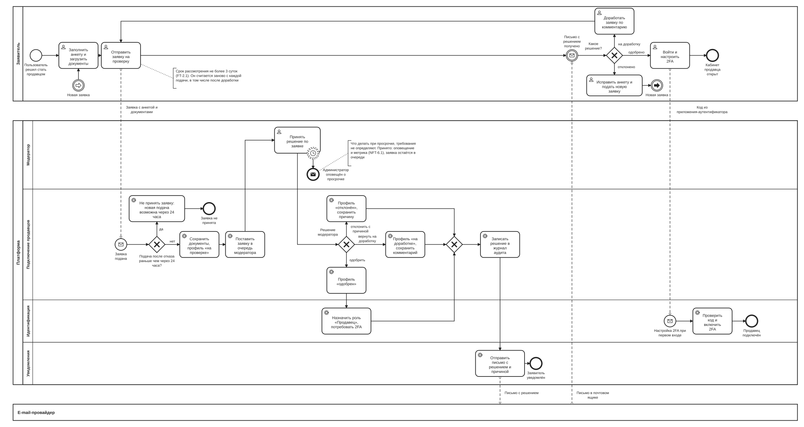

# BPMN-02. Подключение продавца

| Поле | Содержание |
| --- | --- |
| ID | BPMN-02 |
| Релиз | R1 |
| Участники | Заявитель (зарегистрированный пользователь). Платформа (дорожки: Модератор, Подключение продавцов, Идентификация, Уведомления). Внешняя система: e-mail-провайдер |
| Триггер | Пользователь решает стать продавцом и заполняет анкету |
| Результат | Заявка одобрена, продавец настроил 2FA и получил доступ к кабинету продавца. Либо заявка отклонена, и заявитель через 24 часа может исправить анкету и подать новую заявку. Либо возвращена на доработку и подана повторно |
| Требования | FT-1.3, FT-2.0, FT-2.1, FT-2.2, FT-2.4, FT-11.1, FT-11.2, NFT-3.0, NFT-5.3, NFT-6.1 |
| Статусные модели | SM-05 Профиль продавца |
| Связанные артефакты | UC-02, BPMN-03 (после подключения продавец создаёт товары) |

Процесс описывает путь от заявки до рабочего кабинета продавца. Модерация обязательна для каждого продавца: пока заявка не одобрена, роль «Продавец» не выдаётся и товары создавать нельзя (BG-05). Отказ не окончательный: после паузы заявитель может исправить анкету и подать заявку заново (FT-2.4).

## Диаграмма

Для чтения откройте [картинку](BPMN-02-seller-onboarding.svg) целиком или файл [BPMN-02-seller-onboarding.bpmn](BPMN-02-seller-onboarding.bpmn) в редакторе bpmn.io.

**Как читать.**

- Верхний пул это заявитель, нижний большой пул это платформа. Дорожки платформы соответствуют логическим сервисам из раздела 8.1 требований, кроме дорожки «Модератор»: там задачи, которые выполняет человек.
- E-mail-провайдер показан отдельным участником: мы передаём ему письмо и не управляем доставкой.
- Пунктир показывает сообщения между участниками, сплошные стрелки показывают порядок шагов.
- Пунктирный круг с часами на задаче модератора это таймер, который **не прерывает** задачу: по истечении 3 суток уходит оповещение, а заявка остаётся в работе.
- Ромб с крестом после трёх профилей это слияние: все три решения приводят к одной общей цепочке «журнал аудита, письмо заявителю».
- Заявитель после письма сам решает по тексту решения, куда идти дальше. Это ромб «Какое решение?» на стороне заявителя.
- Круги со стрелкой «Новая заявка» (один на стороне заявителя, второй рядом с началом) это ссылка без длинной линии: после отказа заявитель возвращается к заполнению анкеты. Ромб «Подача после отказа раньше чем через 24 часа?» на стороне платформы защищает очередь модератора от повторов.

## Основной путь

1. Пользователь заполняет анкету: тип (ИП, самозанятый, юрлицо), наименование, реквизиты, описание ассортимента, документы (FT-2.0). Профиль хранится в статусе «черновик».
2. Пользователь отправляет заявку. Сервис подключения продавцов сохраняет документы в S3-совместимом хранилище в РФ и переводит профиль в «на проверке» (SM-05).
3. Заявка попадает в очередь модератора. С этого момента идёт срок рассмотрения не более 3 суток (FT-2.1).
4. Модератор рассматривает анкету и документы и принимает одно из трёх решений: одобрить, отклонить с причиной, вернуть на доработку (FT-2.1).
5. Решение записывается в журнал аудита без персональных данных в открытом виде (FT-11.2, NFT-5.3).
6. При одобрении профиль получает статус «одобрен», сервис идентификации назначает роль «Продавец» и требует настроить 2FA.
7. Сервис уведомлений отправляет заявителю письмо с решением (FT-2.2).
8. Заявитель получает письмо, входит в систему и при первом входе настраивает второй фактор. Сервис идентификации проверяет код из приложения-аутентификатора и включает 2FA (FT-1.3, NFT-3.0).
9. Кабинет продавца открыт. Дальше продавец создаёт товары и загружает ключи (BPMN-03).

## Исключения и альтернативы

| № | Ситуация | Что делает система | Результат | Требования |
| --- | --- | --- | --- | --- |
| E1 | Модератор отклонил заявку | Причина обязательна. Профиль «отклонён», причина сохраняется, заявителю уходит письмо с причиной | Заявка закрыта, роль «Продавец» не выдаётся. Новая заявка возможна по E4 | FT-2.1, FT-2.2 |
| E2 | Модератор вернул заявку на доработку | Профиль «на доработке», комментарий сохраняется, заявителю уходит письмо. Заявитель дорабатывает анкету и документы и отправляет заявку повторно | Профиль снова «на проверке», срок 3 суток отсчитывается заново | FT-2.1, FT-2.2 |
| E3 | За 3 суток решения нет | Администратор получает оповещение, в метрику сроков модерации записывается просрочка. Заявка остаётся в очереди | Заявка ждёт решения, автоматического одобрения или отказа нет | FT-2.1, NFT-6.1 |
| E4 | После отказа заявитель исправил анкету и подаёт новую заявку | Когда заявитель начинает исправлять анкету, профиль возвращается из «отклонён» в «черновик», история решений остаётся в журнале аудита. Дальше обычный путь: анкета, отправка, «на проверке», срок 3 суток отсчитывается с новой подачи | Заявка рассматривается заново | FT-2.4 |
| E5 | Новая заявка подана раньше чем через 24 часа после отказа | Заявка не принимается, заявитель видит, когда можно подать новую | Профиль остаётся «черновик» с исправленной анкетой, в очередь модератора заявка не попадает. Отправить её можно после паузы | FT-2.4, FT-11.1 |

## Сроки и таймеры

| Срок | Значение | Где на диаграмме | Источник |
| --- | --- | --- | --- |
| Срок рассмотрения заявки | Не более 3 суток, отсчёт с каждой подачи | Таймер на задаче «Принять решение по заявке» | FT-2.1, раздел 2.2 «Модерация» |
| Пауза после отказа | 24 часа с момента отказа, параметр платформы | Ромб «Подача после отказа раньше чем через 24 часа?» | FT-2.4, FT-11.1 |
| Срок доработки заявителем | Не ограничен: заявка остаётся «на доработке», пока заявитель не отправит её повторно | Не нарисован, таймера нет | FT-2.4 |

## Решения и открытые вопросы

**Приняты при моделировании:**

1. **Срок рассмотрения считается с каждой подачи.** После доработки модератору снова отводится 3 суток. Иначе срок, который начался при первой подаче, мог бы истечь пока заявитель дорабатывает.
2. **Просрочка срока.** Требования не говорят, что делать, если модератор не успел. Принято: оповещение администратора и метрика (NFT-6.1), заявка остаётся в очереди. Автоматическое решение при просрочке не принимается, потому что BG-05 требует, чтобы каждого продавца проверил человек.
3. **Одно письмо на все решения.** Сервис уведомлений отправляет одно письмо, текст зависит от решения. Поэтому три профильные задачи сходятся в слияние перед журналом аудита и письмом.
4. **Роль и 2FA.** Роль «Продавец» назначается сразу при одобрении, а второй фактор настраивается при первом входе. Кабинет продавца открывается только после включения 2FA. Как это сделано в Keycloak (обязательное действие при входе или собственный поток), решается в Ф2.
5. **Полнота анкеты проверяется формой.** Обязательные поля и типы файлов проверяет интерфейс при отправке. Отдельным шагом процесса это не показано.
6. **Блокировка продавца** (FT-2.3) относится к R2 и на диаграмме не показана.
7. **Ошибки кода 2FA** (неверный код, лимит попыток, NFT-3.5) детализируются на sequence-диаграмме в Ф2.

**Решения по ранее открытым вопросам** (внесены в требования v1.5):

1. **Новая заявка после отказа возможна** (вариант Б). Отказ не делает заявителя «потерянным»: добросовестный продавец, ошибившийся в документах, возвращается через новую подачу (BG-02). В SM-05 добавляется переход «отклонён» → «черновик». Чтобы очередь модератора не забивали повторами, новая подача возможна не раньше чем через 24 часа после отказа. Значение 24 часа это параметр платформы (FT-11.1). Правило записано как FT-2.4.
2. **Срок на доработку не ограничен.** Заявка в статусе «на доработке» не закрывается автоматически. Модератор ничего не ждёт: срок рассмотрения 3 суток начинается только с повторной подачи. Заявитель сам решает, когда вернуться. Нагрузки на очередь это не создаёт, потому что заявка в «на доработке» в очереди модератора не стоит.

**Открытых вопросов по процессу нет.**

## Покрытие требований

| Требование | Где реализуется на диаграмме |
| --- | --- |
| FT-1.3, NFT-3.0 | Задачи «Назначить роль «Продавец», потребовать 2FA», «Войти и настроить 2FA», «Проверить код и включить 2FA» |
| FT-2.0 | Задачи «Заполнить анкету и загрузить документы», «Отправить заявку на проверку», «Сохранить документы, профиль «на проверке»» |
| FT-2.1 | Задача «Принять решение по заявке», шлюз «Решение модератора», таймер 3 суток, пути E1, E2, E3 |
| FT-2.2 | Задача «Отправить письмо с решением и причиной» |
| FT-2.4, FT-11.1 | Задача «Исправить анкету и подать новую заявку», ссылка «Новая заявка», ромб «Подача после отказа раньше чем через 24 часа?», пути E4, E5 |
| FT-11.2, NFT-5.3 | Задача «Записать решение в журнал аудита» |
| NFT-6.1 | Таймер просрочки и оповещение администратора (путь E3) |
| BG-05 | Решение модератора обязательно до выдачи роли «Продавец» |

## Связанные документы

- [Требования v1.6](../02-requirements/requirements_v1.6.md), разделы 4.1, 4.2
- [Глоссарий](../01-vision/glossary.md)
- [Видение](../01-vision/vision.md): цели BG-02 и BG-05
