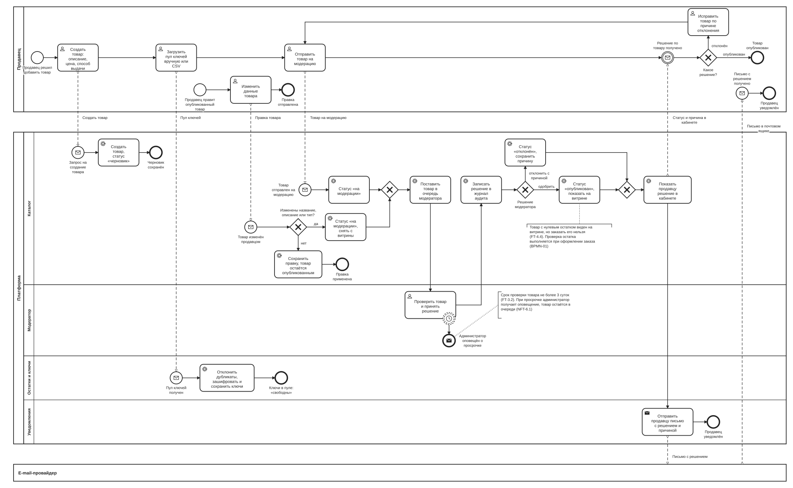

# BPMN-03. Модерация товара

| Поле | Содержание |
| --- | --- |
| ID | BPMN-03 |
| Релиз | R1 |
| Участники | Продавец (одобренный, с ролью «Продавец»). Платформа (дорожки: Каталог, Модератор, Остатки и ключи, Уведомления). Внешняя система: e-mail-провайдер |
| Триггер | Продавец создаёт товар или правит опубликованный товар |
| Результат | Товар опубликован и виден на витрине. Либо отклонён с причиной. Либо правка применена без модерации |
| Требования | FT-3.0, FT-3.1, FT-3.2, FT-4.1, FT-4.2, FT-4.3, FT-4.4, FT-11.2, FT-11.4, NFT-3.2, NFT-5.3, NFT-6.1 |
| Статусные модели | SM-04 Товар, SM-03 Ключ |
| Связанные артефакты | BPMN-02 (продавец уже подключён), BPMN-01 (покупка опубликованного товара) |

Процесс гарантирует цель BG-05: на витрину попадает только товар, который проверил модератор. Правка названия, описания или типа возвращает товар на проверку, поэтому после публикации нельзя подменить описание и обойти модерацию.

## Диаграмма

Для чтения откройте [картинку](BPMN-03-product-moderation.svg) целиком или файл [BPMN-03-product-moderation.bpmn](BPMN-03-product-moderation.bpmn) в редакторе bpmn.io.

**Как читать.**

- Верхний пул это продавец, нижний большой пул это платформа. Дорожки соответствуют логическим сервисам из раздела 8.1 требований, кроме дорожки «Модератор» (задачи человека).
- Продавец работает в кабинете, и каждое его действие приходит на платформу отдельным сообщением. Поэтому у платформы несколько стартовых событий: создание, отправка на модерацию, правка, загрузка ключей. Они независимы друг от друга и могут происходить в разное время.
- Нижний ряд пула продавца это самостоятельный поток: правка уже опубликованного товара. Справа в том же ряду второй самостоятельный поток: продавец получает письмо о решении.
- E-mail-провайдер показан отдельным участником: мы передаём ему письмо и не управляем доставкой.
- Пунктирный круг с часами на задаче модератора это таймер, который не прерывает задачу: через 3 суток уходит оповещение, а товар остаётся в очереди.
- Два ромба с крестом справа от очереди это слияния: в очередь модератора товар попадает и после отправки продавцом, и после правки опубликованного товара.

## Основной путь

1. Продавец создаёт товар: название, описание, тип, платформа, регион активации, цена, способ выдачи (FT-3.0). Каталог сохраняет товар в статусе «черновик» (SM-04, FT-3.1).
2. Продавец загружает пул ключей вручную или файлом CSV (FT-4.1). Сервис остатков и ключей отклоняет дубликаты внутри товара (сравнение по HMAC с секретом сервера), шифрует остальные ключи (AES-256) и сохраняет их в статусе «свободен». Остаток товара растёт (FT-4.2, FT-4.3, NFT-3.2).
3. Продавец отправляет товар на модерацию. Каталог переводит товар в «на модерации».
4. Товар попадает в очередь модератора. С этого момента идёт срок проверки не более 3 суток (FT-3.2).
5. Модератор проверяет товар и принимает решение: одобрить или отклонить с указанием причины (FT-3.2).
6. Решение записывается в журнал аудита без персональных данных в открытом виде (FT-11.2, NFT-5.3).
7. При одобрении товар получает статус «опубликован» и появляется на витрине. На витрине показываются только опубликованные товары (FT-3.1).
8. Продавец видит решение и причину в кабинете (FT-3.2).
9. Сервис уведомлений отправляет продавцу письмо с решением и, при отказе, с причиной (FT-11.4). Письмо передаётся e-mail-провайдеру.

## Исключения и альтернативы

| № | Ситуация | Что делает система | Результат | Требования |
| --- | --- | --- | --- | --- |
| E1 | Модератор отклонил товар | Причина обязательна. Товар «отклонён», причина сохраняется, показывается продавцу в кабинете и уходит ему письмом. Продавец исправляет товар и отправляет его на модерацию повторно | Товар не на витрине. После повторной отправки статус «на модерации» | FT-3.1, FT-3.2 |
| E2 | Продавец изменил название, описание или тип опубликованного товара | Товар сразу снимается с витрины и переходит в «на модерации», дальше процесс идёт с шага 4 | Товар скрыт до решения модератора | FT-3.2 |
| E3 | Продавец изменил цену, платформу, регион или способ выдачи опубликованного товара | Правка сохраняется, товар остаётся опубликованным | Модерация не запускается | FT-3.2 |
| E4 | В загруженном пуле есть дубликаты | Дубликаты внутри товара отклоняются, остальные ключи сохраняются. В разных товарах одинаковые значения допустимы | Остаток растёт только на принятые ключи | FT-4.1 |
| E5 | Модератор не принял решение за 3 суток | Администратор получает оповещение, в метрику сроков модерации записывается просрочка. Товар остаётся в очереди | Автоматического одобрения или отказа нет | FT-3.2, NFT-6.1 |
| E6 | У опубликованного товара остаток равен нулю | Товар виден на витрине, но оформить заказ нельзя. Проверку делает сервис заказов при оформлении (E2 в BPMN-01) | Заказ не создаётся | FT-4.4 |

## Сроки и таймеры

| Срок | Значение | Где на диаграмме | Источник |
| --- | --- | --- | --- |
| Срок проверки товара | Не более 3 суток, отсчёт с постановки в очередь, в том числе после повторной отправки и после правки опубликованного товара | Таймер на задаче «Проверить товар и принять решение» | FT-3.2, раздел 2.2 «Модерация» |

## Решения и открытые вопросы

**Приняты при моделировании:**

1. **Загрузка ключей не привязана к модерации.** На диаграмме ключи загружаются до отправки на проверку, но FT-4.1 не запрещает догружать их позже, в том числе у опубликованного товара. Остаток растёт сразу, модерация для этого не нужна, потому что ключи не показываются на витрине.
2. **Товар без ключей можно отправить на модерацию.** Требования этого не запрещают, а нулевой остаток уже обрабатывается правилом FT-4.4.
3. **Правка названия, описания или типа снимает товар с витрины сразу**, не дожидаясь решения. Заказы, которые были оформлены раньше, доводятся до выдачи по BPMN-01.
4. **Повторная отправка после отказа делается продавцом вручную.** Автоматически после правки товар на модерацию не уходит. SM-04 получит переход «отклонён» → «на модерации».
5. **Просрочка срока проверки.** При просрочке администратор получает оповещение, в метрики идёт просрочка (NFT-6.1), товар остаётся в очереди. Автоматического решения нет, потому что BG-05 требует проверки человеком. Правило записано в FT-3.2 версии v1.5, так же как для заявок продавцов (FT-2.1).
6. **Блокировка товара и архив** (статусы «заблокирован» и «архив» из FT-3.1) связаны с блокировкой продавца (FT-2.3, R2) и с жизненным циклом товара и на диаграмме не показаны. Они появятся в SM-04.
7. **Выдача по API** (FT-4.0, R2) не нарисована: в R1 способ выдачи только «пул ключей».

**Решения по ранее открытым вопросам** (внесены в требования v1.5):

1. **Продавец получает письмо о решении по товару** (вариант Б). Решение и причина видны в кабинете, и то же самое приходит письмом: продавец быстрее исправляет товар и быстрее выходит на витрину, а срок проверки до 3 суток слишком велик, чтобы ждать, пока продавец зайдёт в кабинет сам. Одно дополнительное письмо стоит дёшево, потому что сервис уведомлений уже отправляет письма заявителю (FT-2.2). Правило записано как FT-11.4 и распространяется на все решения платформы для продавца: заявка на подключение, товар, заявка на вывод (BPMN-06).

**Открытых вопросов по процессу нет.**

## Покрытие требований

| Требование | Где реализуется на диаграмме |
| --- | --- |
| FT-3.0 | Задача продавца «Создать товар: описание, цена, способ выдачи» |
| FT-3.1 | Статусы в названиях задач: «черновик», «на модерации», «опубликован», «отклонён». Публикация на витрине в задаче «Статус «опубликован», показать на витрине» |
| FT-3.2 | Задача «Проверить товар и принять решение», таймер 3 суток, шлюз «Какое решение?», поток правки опубликованного товара (E2, E3) |
| FT-4.1, FT-4.2, NFT-3.2 | Задача «Отклонить дубликаты, зашифровать и сохранить ключи», путь E4 |
| FT-4.3 | Конечное событие «Ключи в пуле: «свободны»» (остаток растёт) |
| FT-4.4 | Примечание у задачи публикации, путь E6 |
| FT-11.2, NFT-5.3 | Задача «Записать решение в журнал аудита» |
| FT-11.4 | Задача «Отправить продавцу письмо с решением и причиной», поток «Письмо с решением получено» |
| NFT-6.1 | Таймер просрочки и оповещение администратора (E5) |
| BG-05 | Решение модератора обязательно до публикации и после правки названия, описания или типа |

## Связанные документы

- [Требования v1.5](../02-requirements/requirements_v1.5.md), разделы 4.3, 4.4, 4.11
- [Глоссарий](../01-vision/glossary.md)
- [Видение](../01-vision/vision.md): цель BG-05
