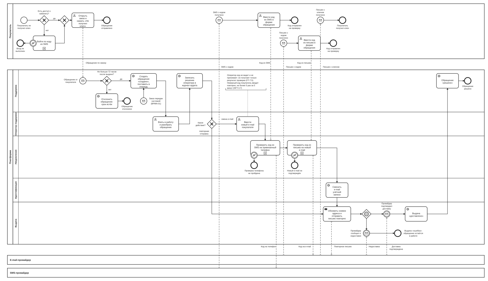

# BPMN-04. Обращение в поддержку

| Поле | Содержание |
| --- | --- |
| ID | BPMN-04 |
| Релиз | R1 |
| Участники | Покупатель. Платформа (дорожки: Поддержка, Оператор поддержки, Уведомления, Идентификация, Выдача). Внешние системы: e-mail-провайдер, SMS-провайдер |
| Триггер | Покупатель нажимает «Не получил ключ» в карточке заказа. Либо заказ автоматически передан в поддержку системой (BPMN-01) |
| Результат | Ключ повторно отправлен и доставлен, обращение «решено». Либо e-mail покупателя сменён и ключ отправлен на новый адрес. Либо обращение отклонено, или проверка кода не пройдена и обращение осталось «в работе» |
| Требования | FT-1.5, FT-1.7, FT-5.4, FT-7.2, FT-7.3, FT-7.5, FT-11.2, NFT-2.4, NFT-3.5, NFT-3.7, NFT-5.3 |
| Статусные модели | SM-07 Обращение, SM-06 Выдача |
| Связанные артефакты | UC-04, BPMN-01 (отсюда приходят заказы, переданные системой), BPMN-07 (смена номера телефона, R2) |

Процесс закрывает случай, когда автоматическая доставка не сработала или покупатель не получил письмо. Здесь же закрыты три вопроса из приложения C требований v1.4: как покупателю войти в кабинет без доступа к e-mail (FT-1.7), нужно ли подтверждать новый e-mail при смене через поддержку (FT-7.5) и что делать, если утрачены сразу e-mail и телефон (вне MVP). Решения описаны в разделе «Решения и открытые вопросы».

## Диаграмма

Диаграмма большая. Для чтения откройте [картинку](BPMN-04-support-request.svg) целиком или файл [BPMN-04-support-request.bpmn](BPMN-04-support-request.bpmn) в редакторе bpmn.io.

**Как читать.**

- Верхний пул это покупатель. У него несколько независимых потоков: создание обращения (слева), ввод кода из SMS и ввод кода из письма (в середине), получение письма с ключом (справа). Каждый запускается сообщением от платформы или провайдера.
- Платформа показана пятью дорожками. «Оператор поддержки» это задачи человека, остальные дорожки соответствуют сервисам из раздела 8.1 требований.
- Внешние системы внизу: e-mail-провайдер и SMS-провайдер. Мы передаём им сообщение и получаем статус, но не управляем доставкой.
- Прямоугольники со знаком «плюс» (задачи «Войти по коду из SMS», «Проверить код из SMS…», «Проверить код из письма…») это свёрнутые подпроцессы. Их содержимое (генерация кода, срок жизни, счётчик попыток) показывается на sequence-диаграмме в Ф2 вместе с решением ADR-010. Круг с молнией на границе подпроцесса означает ошибку: код не подтверждён.
- Покупатель вводит коды сам: пунктирные стрелки идут от его задач прямо в проверку. Оператор кода не видит, он получает только результат (FT-7.5).
- Окно 72 часа проверяется только для обращений покупателей. Заказ, переданный системой, попадает в ту же очередь без этой проверки (стартовое событие «Заказ передан системой»).

## Основной путь

1. Покупатель не получил ключ в течение 72 часов после выдачи. Если доступа к кабинету нет (потерян e-mail или пароль, вход через VK ID не подключён), он входит по одноразовому коду из SMS на подтверждённый телефон (FT-1.7, FT-1.5, NFT-3.7).
2. Покупатель открывает заказ и нажимает «Не получил ключ». Платформа получает обращение (FT-7.2).
3. Сервис поддержки проверяет, что с первичного перехода заказа в «выдан» прошло не более 72 часов (FT-7.2).
4. Обращение создаётся в статусе «создано» и встаёт в очередь поддержки (SM-07). В ту же очередь попадают заказы, которые система передала автоматически (FT-7.3, NFT-2.4).
5. Оператор берёт обращение в работу (SM-07: «в работе») и разбирает его. Ключ оператору не показывается (FT-7.5).
6. Решение оператора записывается в журнал аудита без персональных данных в открытом виде (FT-11.2, NFT-5.3).
7. При повторной отправке сервис заказов по команде поддержки обновляет снимок адреса доставки в заказе, сервис выдачи создаёт выдачу типа «повторная» и передаёт письмо провайдеру (FT-7.5, SM-06). На схеме это одна задача, разделение по сервисам описано в [границах контекстов](../04-domain/bounded-contexts.md).
8. Провайдер подтверждает доставку, выдача получает статус «доставлено», обращение становится «решено» (SM-07). Покупатель получает письмо с ключом.

**Смена e-mail (альтернативный путь с шага 5).** Если покупатель потерял доступ к почте:

1. Оператор вводит новый e-mail.
2. Сервис отправляет код на телефон из учётной записи. Покупатель вводит код сам в форме обращения. Оператор видит только результат проверки (FT-7.5, NFT-3.7).
3. Сервис отправляет код на новый e-mail. Покупатель вводит его в той же форме (FT-7.5).
4. Сервис идентификации меняет e-mail учётной записи. В журнал аудита попадают имя поля и HMAC-хеши значений до и после (NFT-5.3).
5. Дальше ключ отправляется повторно по шагам 7 и 8 основного пути: уже на новый адрес.

## Исключения и альтернативы

| № | Ситуация | Что делает система | Результат | Требования |
| --- | --- | --- | --- | --- |
| E1 | С первичной выдачи прошло больше 72 часов | Обращение покупателя отклоняется | Обращение не создаётся | FT-7.2 |
| E2 | Вход по коду из SMS не удался: код неверный, истёк или исчерпаны 5 попыток | Вход не выполняется | Покупатель в кабинет не попал, обращение не создано | NFT-3.7, NFT-3.5 |
| E3 | Заказ передан системой: недоставка, исчерпание попыток отправки или 30 минут без доставки | Обращение создаётся сразу, окно 72 часа не проверяется | Заказ в очереди поддержки | FT-7.2, FT-7.3, NFT-2.4 |
| E4 | При смене e-mail код из SMS не подтверждён | Адрес не меняется. Оператор видит результат «проверка не пройдена» | Обращение остаётся «в работе» | FT-7.5, NFT-3.7 |
| E5 | При смене e-mail новый адрес не подтверждён кодом | Адрес в учётной записи не меняется | Обращение остаётся «в работе» | NFT-3.7 |
| E6 | Повторное письмо не доставлено: отказ провайдера или неверный адрес | Выдача получает статус «ошибка» | Обращение остаётся «в работе», оператор может повторить отправку или сменить e-mail | FT-7.3, SM-06 |
| E7 | При смене e-mail новый адрес уже привязан к другой учётной записи | Код на этот адрес не отправляется. Покупатель и оператор видят нейтральное сообщение «Адрес использовать нельзя» без указания причины | Адрес не меняется, обращение остаётся «в работе» | FT-7.5, FT-1.5 |

## Сроки и таймеры

| Срок | Значение | Где на диаграмме | Источник |
| --- | --- | --- | --- |
| Окно обращения | 72 часа после первичного перехода заказа в «выдан», параметр платформы. Повторная отправка срок не сдвигает | Шлюз «Не больше 72 часов после выдачи?» | FT-7.2, раздел «Ключевые определения» |
| Одноразовый код | 5 минут, 5 попыток, одинаково для кода из SMS и из письма | Подпроцессы проверки кода и вход по SMS | NFT-3.7 |
| Ограничение частоты | Входы, обращения, отправка и ввод кодов ограничены | Подпроцессы кодов и создание обращения | NFT-3.5 |
| Недоставленные заказы из BPMN-01 | 30 минут после оплаты, затем очередь поддержки и оповещение администратора | Стартовое событие «Заказ передан системой» | NFT-2.4 |

## Решения и открытые вопросы

**Приняты при моделировании:**

1. **Одна очередь для двух источников.** Обращения покупателей и заказы, переданные системой, обрабатываются одинаково. Различие одно: окно 72 часа проверяется только у обращений покупателей, потому что автоматическая передача по FT-7.3 этим сроком не ограничена.
2. **Журнал аудита пишется до действия.** Оператор принял решение, система записала его, и только потом выполняется повторная отправка или смена e-mail. Факт смены e-mail дополнительно фиксируется самой задачей смены (имя поля и HMAC-хеши до и после).
3. **Любая смена e-mail заканчивается повторной отправкой.** Иначе смена адреса не решала бы исходную проблему: ключ остался бы недоставленным.
4. **Где проверяется код.** На диаграмме проверка стоит в дорожке «Уведомления», потому что раздел 8.2 требований говорит, что код отправляет сервис уведомлений. Выбор между собственным модулем и расширением Keycloak фиксируется в ADR-010 в Ф2.
5. **Попытки ввода кода.** Неверный код покупатель вводит повторно внутри подпроцесса (до 5 раз за 5 минут). Диаграмма показывает только итог проверки: «подтверждён» или «не пройдена».
6. **Ожидание статуса повторного письма не ограничено таймером.** Если провайдер не отвечает, обращение остаётся «в работе» и видно оператору в очереди.
7. **Кнопка «Не получил ключ» доступна только у заказов со статусом «выдан».** Пока заказ «оплачен», выдачу ведёт и контролирует система (BPMN-01).
8. **Новый e-mail, уже занятый другой учётной записью (E7).** Проверка уникальности стоит внутри подпроцесса «Проверить код из письма на новый адрес» и отдельным исключением на диаграмме не показана: она идёт до отправки кода, так что код не уходит на чужой адрес. Покупатель и оператор видят то же нейтральное сообщение, что и при занятом номере телефона, чтобы по ответу нельзя было узнать, есть ли у адреса учётная запись.
8. **У оператора два действия:** повторная отправка и смена e-mail (FT-7.5). Других действий в R1 нет.

### Вопрос 1 из приложения C v1.4: как покупателю попасть в кабинет без доступа к e-mail

Покупатель потерял e-mail, не помнит пароль, а вход через VK ID не подключён. Без входа он не может создать обращение (FT-7.2), а восстановление пароля по e-mail (FT-1.2) ему недоступно.

| Вариант | Плюсы | Минусы |
| --- | --- | --- |
| А. Вход по одноразовому коду из SMS на подтверждённый телефон | Телефон подтверждён ещё до первой покупки (FT-1.5), поэтому вариант доступен каждому, кто покупал. Тот же механизм кодов, что и в смене e-mail | Риск подмены SIM-карты. Нужна ограниченная сессия и ограничение частоты запросов |
| Б. Обращение без входа: заказ плюс код из SMS на телефон заказа | Не нужен вход в кабинет | Вторая точка входа и вторая форма обращения. Противоречит FT-7.2 («из личного кабинета») |
| В. Не поддерживать, пока покупатель не восстановит почту | Не меняются требования | Покупатель не получает оплаченный товар. Противоречит BG-01 и BG-06 |

**Принято: вариант А.** Вход по коду из SMS нарисован на диаграмме как свёрнутый подпроцесс «Войти по коду из SMS».

**Почему.** Вариант А использует уже подтверждённый телефон и единый механизм одноразовых кодов, поэтому он дешевле всех остальных. Риск подмены SIM-карты ограничивается тремя мерами:

- сессия, открытая по SMS, даёт доступ только к разделам «Заказы» и «Обращения», менять пароль и данные учётной записи по ней нельзя;
- ключи в кабинете не показываются (FT-5.4), поэтому украсть из кабинета нечего;
- действуют ограничение частоты (NFT-3.5) и лимит попыток (NFT-3.7).

Остаточный риск: злоумышленник с чужой SIM-картой может добраться до смены e-mail. Это следствие уже принятого FT-7.5 (подтверждение телефоном) и для MVP принимается. Фиксируем в модели угроз (Ф2).

**Влияние на требования.** В раздел 4.1 добавлен пункт **FT-1.7** (R1): «Покупатель, потерявший доступ к e-mail, но сохранивший доступ к подтверждённому телефону, должен иметь возможность войти по одноразовому коду из SMS. Сессия, открытая таким входом, даёт доступ только к заказам и обращениям». Правка вошла в требования v1.5.

### Вопрос 2 из приложения C v1.4: подтверждать ли новый e-mail при смене через поддержку

Оператор вводит новый адрес. Опечатка отправит ключ постороннему человеку, а покупатель так и не получит товар.

| Вариант | Плюсы | Минусы |
| --- | --- | --- |
| А. Не подтверждать | Меньше шагов для покупателя, требования не меняются | Опечатка или чужой адрес: ключ уходит постороннему, нарушается BG-06 |
| Б. Подтверждать кодом, отправленным на новый e-mail, код вводит покупатель | Защита от опечатки, заодно проверка, что на этот адрес доходят письма. Тот же механизм кодов (NFT-3.7) | Один дополнительный шаг. Покупатель должен успеть ввести код за 5 минут |
| В. Оператор вводит адрес дважды | Защита от опечатки оператора | Не защищает от ошибки покупателя при диктовке и не проверяет, что письма доходят |

**Принято: вариант Б.** На диаграмме это подпроцесс «Проверить код из письма на новый e-mail» после проверки телефона.

**Почему.** Смена e-mail через поддержку нужна затем, чтобы ключ дошёл. Поэтому доставка на новый адрес должна быть проверена до того, как адрес станет адресом доставки. Вариант Б единственный проверяет и опечатку, и работоспособность адреса. Дополнительный шаг стоит один код и не добавляет новых систем.

**Влияние на требования.** FT-7.5 дополнен: «Смена e-mail выполняется после двух подтверждений: кодом на привязанный телефон и кодом на новый адрес». Правка вошла в требования v1.5.

### Вопрос 3 из приложения C v1.4: утрачены одновременно e-mail и телефон

**Принято: в MVP не поддерживается.** Автоматического пути для такого покупателя нет, потому что и e-mail, и телефон служат подтверждением личности (FT-1.6, FT-7.5), а третьего подтверждённого канала в системе нет. Ограничение записано в разделе 1.3 «Не входит в проект» ещё в v1.4, в v1.5 вопрос снят из приложения C как закрытый. Ручная проверка личности по документам может появиться в следующих версиях как отдельная функция.

**Открытых вопросов по процессу нет.** Все три вопроса приложения C v1.4 закрыты, приложение C в v1.5 пустое.

## Покрытие требований

| Требование | Где реализуется на диаграмме |
| --- | --- |
| FT-1.5 | Подтверждённый телефон используется для входа по SMS и для проверки при смене e-mail |
| FT-1.7 | Подпроцесс «Войти по коду из SMS», путь E2 |
| FT-5.4 | Ключ оператору и в кабинете не показывается, покупатель получает его только письмом |
| FT-7.2 | Задача «Открыть заказ и нажать «Не получил ключ»», шлюз окна 72 часа, путь E1 |
| FT-7.3 | Стартовое событие «Заказ передан системой», путь E3 и путь E6 |
| FT-7.5 | Задачи оператора, подпроцессы проверки кодов, задача «Сменить e-mail учётной записи», задача «Обновить снимок адреса и отправить письмо повторно» |
| FT-11.2, NFT-5.3 | Задача «Записать решение оператора в журнал аудита», запись смены e-mail в задаче «Сменить e-mail учётной записи» |
| NFT-2.4 | Заказы, переданные системой по таймеру 30 минут из BPMN-01, попадают в ту же очередь |
| NFT-3.5, NFT-3.7 | Подпроцессы «Войти по коду из SMS» и проверки кодов, пути E2, E4, E5 |
| BG-01 | Любой исход процесса ведёт либо к доставке ключа, либо к понятному статусу обращения |

## Связанные документы

- [Требования v1.6](../02-requirements/requirements_v1.6.md), разделы 1.3, 4.1, 4.7, 5.3 и приложение C
- [BPMN-01. Покупка](BPMN-01-purchase.md): отсюда приходят заказы, переданные системой
- [Глоссарий](../01-vision/glossary.md): адрес доставки, выдан, доставлен
- [Видение](../01-vision/vision.md): цели BG-01 и BG-06
