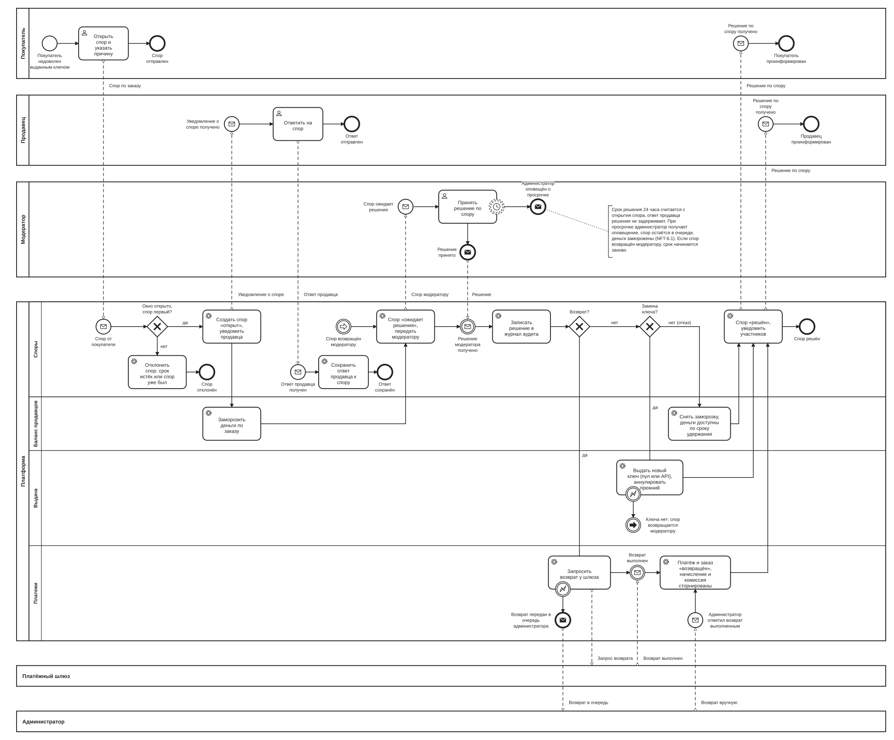

# BPMN-05. Спор по заказу

| Поле | Содержание |
| --- | --- |
| ID | BPMN-05 |
| Релиз | R2 |
| Участники | Покупатель, продавец, модератор. Платформа (дорожки: Споры, Баланс продавцов, Выдача, Платежи). Внешняя система: платёжный шлюз. Администратор (ручной возврат, если автоматический не удался) |
| Триггер | Покупатель нажимает «Открыть спор» в карточке выданного заказа |
| Результат | Спор «решён»: возврат покупателю, отказ в возврате или замена ключа. Либо спор отклонён сразу, потому что окно 72 часа закрыто или спор по заказу уже был |
| Требования | FT-6.4, FT-7.4, FT-8.0, FT-8.1, FT-8.2, FT-8.3, FT-8.4, FT-8.5, FT-8.6, FT-9.2, FT-9.4, FT-9.5, FT-10.3, FT-11.0, FT-11.2, NFT-5.3, NFT-6.1 |
| Статусные модели | SM-09 Спор, SM-01 Заказ, SM-02 Платёж, SM-03 Ключ, SM-06 Выдача, SM-11 Операция по балансу |
| Связанные артефакты | BPMN-01 (откуда приходит выданный заказ), BPMN-06 (вывод средств: заморозка влияет на доступный остаток) |

Процесс описывает спор от открытия до решения модератора и исполнение решения. Это процесс релиза R2, поэтому он нарисован укрупнённо: основной путь и пять исключений. Детальные статусы и переходы будут в SM-09.

## Диаграмма

Для чтения откройте [картинку](BPMN-05-dispute.svg) целиком или файл [BPMN-05-dispute.bpmn](BPMN-05-dispute.bpmn) в редакторе bpmn.io.

**Как читать.**

- Сверху вниз: покупатель, продавец, модератор, платформа и платёжный шлюз. Пунктир это сообщения между участниками, сплошные стрелки это порядок шагов.
- Платформа показана четырьмя дорожками. Дорожки соответствуют сервисам из раздела 8.1 требований: «Споры», «Баланс продавцов», «Выдача» и «Платежи».
- Ответ продавца идёт отдельным коротким потоком в дорожке «Споры» (слева внизу). Он ничего не блокирует: модератор решает независимо от ответа.
- Круг с часами на задаче модератора это таймер 24 часа без прерывания задачи. Пунктирная рамка означает, что задача продолжается.
- Круг с молнией на границе задачи означает ошибку исполнения: нет ключа для замены или сбой возврата.
- Круги со стрелкой «Повторное решение» (в дорожках «Выдача» и «Споры») это ссылка без длинной линии: когда ключа для замены нет, спор возвращается модератору на новое решение.
- Внизу, под платёжным шлюзом, пул администратора. Он нужен только для случая, когда автоматический возврат не удался: платформа передаёт возврат администратору, а тот сообщает, что вернул деньги вручную.

## Основной путь

1. Покупатель открывает спор по заказу и указывает причину (FT-8.0). Запрос получает сервис споров.
2. Сервис проверяет, что с первичного перехода заказа в «выдан» прошло не более 72 часов (FT-8.0).
3. Создаётся спор со статусом «открыт» (SM-09). На заказ можно открыть только один спор (FT-8.5). Продавец получает уведомление, при подключённом webhook ещё и webhook (FT-8.1, FT-10.3).
4. Сервис баланса замораживает деньги по заказу: операция по балансу получает статус «заморожена» с причиной «спор» и не становится доступной к выводу (FT-8.3, SM-11).
5. Спор получает статус «ожидает решения» и попадает в очередь модератора. Срок решения 24 часа с открытия спора (FT-8.2).
6. Продавец может ответить на спор в любой момент, пока спор не решён. Срока ответа нет. Ответ сохраняется в споре и виден модератору, а если продавец не ответил, модератор решает без ответа (FT-8.1).
7. Модератор принимает решение: возврат, отказ в возврате или замена ключа (FT-8.2). Решение записывается в журнал аудита без персональных данных в открытом виде (FT-11.2, NFT-5.3).
8. Платформа исполняет решение (ветки ниже) и переводит спор в «решён». Покупатель получает письмо о статусе спора, продавец получает уведомление (FT-11.0, FT-10.3).

**Ветки исполнения решения.**

| Решение | Что происходит | Итог |
| --- | --- | --- |
| Возврат | Сервис платежей запрашивает возврат у шлюза тем же механизмом, что автовозврат (FT-8.4, FT-6.4). После подтверждения шлюза платёж и заказ получают статус «возвращён». Начисление продавцу и комиссия платформы сторнируются целиком: при возврате комиссия не взимается (FT-9.5, SM-11, FT-9.4). Возврат всегда полный | Деньги у покупателя, продавец и платформа ничего не получают |
| Замена ключа | Для товара с пулом новый ключ берётся из пула, для товара с выдачей по API запрашивается у продавца тем же механизмом, что в FT-7.4 (ответ ждём 10 минут) (FT-8.6). Прежний ключ получает статус «аннулирован», сервис выдачи отправляет новый ключ (SM-03). Выдача получает тип «повторная» (SM-06). Сроки окон обращения, спора и удержания не сдвигаются | Покупатель получил новый ключ, заказ остаётся «выдан», деньги по обычному сроку удержания |
| Отказ в возврате | Заморозка по причине «спор» снимается. Если 7 дней удержания уже прошли, деньги сразу становятся «доступна». Если нет, они остаются «заморожена» с причиной «удержание» и становятся доступными по таймеру из BPMN-06 (FT-9.2, SM-11) | Деньги продавца |

## Исключения и альтернативы

| № | Ситуация | Что делает система | Результат | Требования |
| --- | --- | --- | --- | --- |
| E1 | С первичной выдачи прошло больше 72 часов, или спор по этому заказу уже открывался | Спор отклоняется сразу, покупатель видит причину | Спор не создаётся, деньги не замораживаются | FT-8.0, FT-8.5 |
| E2 | Для замены ключа нет свободного ключа: пул пуст, либо продавец с выдачей по API не ответил за 10 минут или вернул ошибку | Выдача возвращает ошибку, спор возвращается модератору на новое решение (например, на возврат). Срок 24 часа начинается заново. Автоматического возврата нет | Спор остаётся «ожидает решения» | FT-8.2, FT-8.6, FT-7.4 |
| E3 | Возврат не удался: сбой шлюза, попытки исчерпаны | Возврат повторяется, а после исчерпания попыток передаётся в очередь администратора. Решение модератора обязательно к исполнению: администратор возвращает деньги вручную в кабинете шлюза и отмечает возврат выполненным. Дальше как после подтверждения шлюза | Спор остаётся «ожидает решения», деньги заморожены, пока администратор не отметит возврат. Затем платёж и заказ «возвращены», спор «решён» | FT-8.4, FT-6.4 |
| E4 | Модератор не решил спор за 24 часа | Администратор получает оповещение, в метрики идёт просрочка. Спор остаётся в очереди, деньги заморожены, автоматического решения нет | Спор «ожидает решения» | FT-8.2, FT-8.3, NFT-6.1 |
| E5 | Продавец не ответил на спор | Ничего не происходит: срока ответа нет, модератор решает без ответа | Спор рассматривается в обычный срок | FT-8.1, FT-8.2 |

## Сроки и таймеры

| Срок | Значение | Где на диаграмме | Источник |
| --- | --- | --- | --- |
| Окно спора | 72 часа после первичного перехода заказа в «выдан» | Шлюз «Не больше 72 часов после выдачи?» | FT-8.0 |
| Решение модератора | 24 часа с открытия спора. Если спор вернулся модератору (E2), срок начинается заново | Таймер на задаче «Принять решение по спору» | FT-8.2 |
| Ответ продавца | Срока нет, ответ возможен, пока спор не решён | Поток «Ответ продавца получен» | FT-8.1 |
| Ответ API продавца на запрос ключа для замены | 10 минут | Граница задачи «Выдать новый ключ…» | FT-8.6, FT-7.4 |
| Удержание средств | 7 дней после первичной выдачи | Задача «Снять заморозку, деньги доступны по сроку удержания» | FT-9.2 |

Окно спора (72 часа) и срок решения (24 часа) в сумме дают 4 дня. Это меньше срока удержания в 7 дней, поэтому при своевременном решении заморозка не выходит за срок удержания. Задержка модератора или возврат спора модератору (E2) удлиняют заморозку за пределами этой гарантии: деньги остаются замороженными, пока спор открыт (FT-8.3), а после решения становятся доступными сразу, если 7 дней уже прошли.

## Решения и открытые вопросы

**Приняты при моделировании:**

1. **24 часа считаются с открытия спора.** С открытия проще измерять и объяснить продавцу. Ответ продавца срок не сдвигает. Если спор вернулся модератору из-за отсутствия ключа для замены (E2), срок начинается заново: модератору нужно время принять новое решение.
2. **Срока ответа у продавца нет.** Продавец может ответить в любой момент, пока спор не решён. Если не ответил, модератор решает без ответа. Срок ответа затянул бы споры, а решение модератора ограничено 24 часами.
3. **Просрочка модератора.** Администратор получает оповещение, в метрики идёт просрочка (NFT-6.1). Спор не закрывается автоматически, деньги остаются замороженными: любое автоматическое решение отдавало бы деньги одной из сторон без проверки.
4. **Один спор на заказ.** Повторный спор по тому же заказу не открывается, в том числе после решения. Если заменённый ключ тоже не работает, покупатель может обратиться в поддержку, пока открыто окно 72 часа (BPMN-04).
5. **Нет ключа для замены.** Спор возвращается модератору на новое решение, автоматического возврата нет. Это решение принимает человек.
6. **Возврат по спору полный.** Частичных возвратов в требованиях нет.
7. **Статус «заморожена» в балансе.** Деньги заморожены по трём причинам: срок удержания, открытый спор, резерв под заявку на вывод (BPMN-06). Причина хранится атрибутом операции (SM-11).

**Решения по ранее открытым вопросам** (внесены в требования v1.5):

1. **Комиссия при возврате не взимается.** При возврате по спору начисление продавцу и комиссия платформы сторнируются целиком, платформа на возврате не зарабатывает. Правило одинаково для автовозврата и возврата по спору. Записано как FT-9.5.
2. **Срок ответа продавца и повторный спор.** Срока ответа нет (FT-8.1), на заказ открывается один спор (FT-8.5).
3. **Замена ключа для товара с выдачей по API.** Новый ключ запрашивается у продавца тем же механизмом, что при первичной выдаче (FT-7.4): ответа нет 10 минут, значит ключа для замены нет и спор возвращается модератору. Записано как FT-8.6.
4. **Что происходит, когда возврат по спору не удался.** Повтор, затем очередь администратора, ручной возврат и отметка в платформе. Правило то же, что для автовозврата (FT-6.4, BPMN-01, путь E8).

**Открытых вопросов по процессу нет.**

## Покрытие требований

| Требование | Где реализуется на диаграмме |
| --- | --- |
| FT-8.0, FT-8.5 | Задача покупателя «Открыть спор…», шлюз «Окно открыто, спор первый?», путь E1 |
| FT-8.1 | Уведомление продавцу, поток «Ответ продавца получен», путь E5 |
| FT-8.2 | Задача модератора «Принять решение по спору», таймер 24 часа, ссылка «Повторное решение», пути E2, E4 |
| FT-8.6, FT-7.4 | Задача «Выдать новый ключ (пул или API), аннулировать прежний», путь E2 |
| FT-8.3 | Задача «Заморозить деньги по заказу» |
| FT-8.4, FT-6.4 | Задача «Запросить возврат у шлюза», путь E3, поток «Администратор отметил возврат выполненным» |
| FT-9.2 | Задача «Снять заморозку, деньги доступны по сроку удержания» |
| FT-9.4, FT-9.5 | Задача «Платёж и заказ «возвращён», начисление и комиссия сторнированы» |
| FT-10.3 | Уведомление продавцу о споре и о решении |
| FT-11.0 | Письмо покупателю о решении по спору |
| FT-11.2, NFT-5.3 | Задача «Записать решение в журнал аудита» |
| NFT-6.1 | Оповещение о просрочке решения |

## Связанные документы

- [Требования v1.6](../02-requirements/requirements_v1.6.md), разделы 4.4, 4.6, 4.8 и 4.9
- [Глоссарий](../01-vision/glossary.md): спор, удержание, автовозврат, баланс продавца
- [BPMN-01. Покупка](BPMN-01-purchase.md): откуда приходит выданный заказ
- [BPMN-06. Вывод средств](BPMN-06-withdrawal.md): как замороженные и разблокированные деньги попадают в вывод
