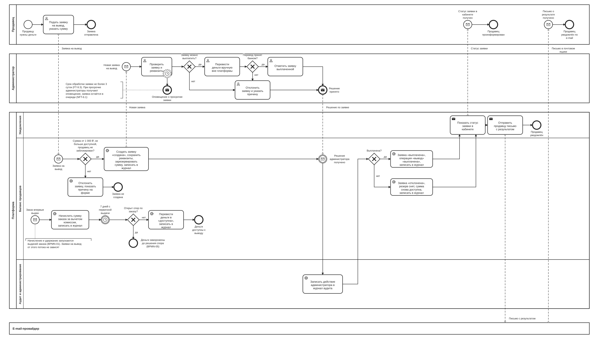

# BPMN-06. Вывод средств продавца

| Поле | Содержание |
| --- | --- |
| ID | BPMN-06 |
| Релиз | R2 |
| Участники | Продавец, администратор. Платформа (дорожки: Уведомления, Баланс продавцов, Аудит и администрирование). Внешняя система: e-mail-провайдер |
| Триггер | Начисление: заказ впервые переведён в «выдан» (BPMN-01). Вывод: продавец подаёт заявку на вывод |
| Результат | Деньги начислены и по сроку удержания доступны к выводу. Заявка на вывод «выплачена» администратором вручную либо «отклонена» с возвратом суммы в доступный остаток. Продавец узнаёт результат из кабинета и из письма |
| Требования | FT-2.3, FT-8.3, FT-9.0, FT-9.2, FT-9.3, FT-9.4, FT-11.1, FT-11.2, FT-11.4, NFT-5.3, NFT-6.1 |
| Статусные модели | SM-10 Заявка на вывод, SM-11 Операция по балансу |
| Связанные артефакты | BPMN-01 (откуда приходит выданный заказ), BPMN-05 (заморозка денег при споре, сторно при возврате), BPMN-03 (то же правило письма продавцу, FT-11.4) |

Процесс состоит из двух независимых потоков в одной дорожке «Баланс продавцов». Верхний поток это вывод средств: проверка суммы и продавца, резерв, ручная выплата администратором. Нижний поток это начисление и удержание 7 дней: он запускается выдачей заказа и готовит деньги к выводу. Релиз R2, поэтому процесс нарисован укрупнённо: основной путь и исключения.

## Диаграмма

Диаграмма широкая. Для чтения откройте [картинку](BPMN-06-withdrawal.svg) целиком или файл [BPMN-06-withdrawal.bpmn](BPMN-06-withdrawal.bpmn) в редакторе bpmn.io.

**Как читать.**

- Сверху вниз: продавец, администратор, платформа, e-mail-провайдер. Пунктир это сообщения между участниками, сплошные стрелки это порядок шагов.
- Платформа не переводит деньги сама. Выплата идёт вручную вне платформы, поэтому задачи «Перевести деньги вручную вне платформы» и «Отметить заявку выплаченной» стоят в пуле администратора.
- Ромб «Перевод принят банком?» отделяет удачный перевод от неудачного: при неудаче заявка отклоняется с причиной, платформа в перевод не вмешивается.
- Пунктирный круг с часами на задаче «Проверить заявку и реквизиты» это таймер, который **не прерывает** задачу: через 3 суток уходит оповещение, а заявка остаётся в очереди.
- Круг с часами «7 дней с первичной выдачи» в нижнем потоке это таймер удержания.
- Слова «записать в журнал» в задачах означают запись движения по балансу в неизменяемый журнал (FT-9.4). Запись в журнал не меняет прежних записей: ошибка исправляется новой записью.
- Журнал аудита (FT-11.2) отдельная задача в нижней дорожке: туда попадает действие администратора.
- Результат заявки продавец получает дважды: статус в кабинете (первая задача в дорожке «Уведомления») и письмо через e-mail-провайдера (вторая задача).

## Статусы операции по балансу (SM-11)

Операция по балансу это запись о движении денег: начисление, комиссия, вывод. Статусов четыре. Статус «заморожена» всегда сопровождается причиной.

| Статус | Что значит |
| --- | --- |
| заморожена | Деньги нельзя выводить. Причина: «удержание» (7 дней после первичной выдачи), «спор» (открыт спор по заказу), «резерв под вывод» (сумма зарезервирована заявкой) |
| доступна | Деньги можно включать в заявку на вывод |
| выплачена | Администратор перевёл деньги продавцу |
| сторнирована | Операция отменена встречной записью: при возврате покупателю (начисление и комиссия, BPMN-05) или при отказе по заявке (резерв под вывод) |

Переходы:

| Откуда | Куда | Условие | Где |
| --- | --- | --- | --- |
| (создание) | заморожена, причина «удержание» | Заказ впервые «выдан»: создаются «начисление» и «комиссия» | BPMN-06, нижний поток |
| заморожена, «удержание» | доступна | Прошло 7 дней, спора по заказу нет | BPMN-06, нижний поток |
| заморожена, «удержание» | заморожена, «спор» | Открыт спор | BPMN-05 |
| заморожена, «спор» | заморожена, «удержание» | Спор решён отказом или заменой ключа, 7 дней ещё не прошли | BPMN-05 |
| заморожена, «спор» | доступна | Спор решён отказом или заменой ключа, 7 дней уже прошли | BPMN-05 |
| заморожена, «спор» | сторнирована | Спор решён возвратом: начисление и комиссия сторнируются целиком | BPMN-05 |
| (создание) | заморожена, «резерв под вывод» | Создана заявка на вывод, операция «вывод» | BPMN-06, верхний поток |
| заморожена, «резерв под вывод» | выплачена | Администратор отметил заявку выплаченной | BPMN-06, верхний поток |
| заморожена, «резерв под вывод» | сторнирована | Заявка отклонена | BPMN-06, верхний поток |

Доступный остаток продавца равен сумме операций «начисление» и «комиссия» в статусе «доступна» минус сумма операций «вывод» в статусах «заморожена» и «выплачена». Так одни и те же деньги нельзя запросить дважды.

## Основной путь

**Начисление и удержание (нижний поток).**

1. Заказ впервые переходит в «выдан». Сервис баланса начисляет продавцу сумму заказа за вычетом комиссии платформы (по умолчанию 2%, FT-9.0). Создаются операции «начисление» и «комиссия» в статусе «заморожена» с причиной «удержание», дата «доступна с» равна дате выдачи плюс 7 дней (FT-9.2). Движение пишется в журнал (FT-9.4).
2. Проходит 7 дней с первичной выдачи (FT-9.2). Повторная отправка ключа этот срок не сдвигает.
3. Сервис проверяет, нет ли открытого спора по заказу (FT-8.3). Если спора нет, операция переходит в «доступна», деньги можно выводить.

**Вывод (верхний поток).**

1. Продавец указывает сумму и подаёт заявку. Реквизиты берутся из профиля продавца (FT-9.3).
2. Сервис баланса проверяет заявку: сумма от 1 000 ₽ и не больше доступного остатка, продавец не заблокирован (FT-9.3, FT-2.3).
3. Создаётся заявка «создана» (SM-10). В заявке сохраняется снимок реквизитов: если продавец позже изменит профиль, деньги пойдут по тем реквизитам, которые были при подаче. Сумма резервируется: создаётся операция «вывод» в статусе «заморожена» с причиной «резерв под вывод», доступный остаток уменьшается. Движение пишется в журнал (FT-9.4).
4. Администратор получает заявку, берёт её в работу (SM-10: «на проверке») и проверяет заявку и реквизиты (FT-9.3). На обработку отведено не более 3 суток.
5. Если заявку можно выплатить, администратор переводит деньги продавцу вручную вне платформы по реквизитам из заявки. Повторные попытки перевода он делает внутри этой задачи.
6. Если банк принял перевод, администратор отмечает заявку выплаченной.
7. Действие администратора записывается в журнал аудита без персональных данных в открытом виде (FT-11.2, NFT-5.3).
8. Заявка становится «выплачена» (SM-10), операция «вывод» получает статус «выплачена», движение пишется в журнал (FT-9.4).
9. Продавец видит новый статус в кабинете и получает письмо о результате (FT-11.4).

## Исключения и альтернативы

| № | Ситуация | Что делает система | Результат | Требования |
| --- | --- | --- | --- | --- |
| E1 | Сумма меньше 1 000 ₽ или больше доступного остатка | Заявка отклоняется сразу, продавец видит причину на форме, резерв не создаётся | Заявка не создана | FT-9.3 |
| E2 | Продавец заблокирован | Заявка отклоняется сразу, продавец видит причину на форме. Начисление и удержание идут как обычно, деньги копятся на балансе. Уже созданные заявки обрабатываются в обычном порядке | Заявка не создана. Вывод возможен после снятия блокировки модератором | FT-2.3, FT-9.3 |
| E3 | Администратор отклоняет заявку: неверные реквизиты, перевод не принят банком или иная причина | Причина обязательна. Заявка «отклонена», причина сохраняется, операция «вывод» «сторнирована», сумма снова доступна, в журнале новая запись. Результат уходит продавцу в кабинете и письмом | Продавец видит причину отказа и может подать новую заявку | FT-9.3, FT-9.4, FT-11.4 |
| E4 | Банк не принял перевод | Администратор повторяет перевод внутри задачи. Если банк так и не принял, администратор отклоняет заявку с причиной «перевод не принят банком» (E3). Платформа в перевод не вмешивается | Заявка «отклонена», сумма возвращена в доступный остаток | FT-9.3 |
| E5 | Администратор не обработал заявку за 3 суток | Администраторы получают оповещение, в метрики идёт просрочка. Заявка остаётся в очереди, резерв сохраняется, автоматического решения нет | Заявка ждёт решения в статусе «на проверке» (или «создана») | FT-9.3, NFT-6.1 |
| E6 | В конце срока удержания по заказу открыт спор | Операция остаётся «заморожена» с причиной «спор». Процесс BPMN-05 после решения по спору размораживает деньги или возвращает их покупателю | Деньги недоступны к выводу до решения спора | FT-8.3, FT-9.2 |

## Сроки и параметры

| Срок или параметр | Значение | Где на диаграмме | Источник |
| --- | --- | --- | --- |
| Удержание | 7 дней после первичной выдачи | Таймер «7 дней с первичной выдачи» | FT-9.2 |
| Минимальная сумма заявки | 1 000 ₽, параметр платформы | Ромб «Сумма от 1 000 ₽, не больше доступной, продавец не заблокирован?» | FT-9.3, FT-11.1 |
| Комиссия по умолчанию | 2%, настраивается администратором | Задача «Начислить сумму заказа за вычетом комиссии…» | FT-9.0 |
| Срок обработки заявки | Не более 3 суток, параметр платформы, отсчёт с создания заявки | Таймер на задаче «Проверить заявку и реквизиты» | FT-9.3, FT-11.1 |

## Решения и открытые вопросы

**Приняты при моделировании:**

1. **Резерв суммы при создании заявки.** Без резерва продавец успел бы подать две заявки на одни и те же деньги. Сумма резервируется (операция «вывод» «заморожена», причина «резерв под вывод»), при отказе резерв снимается новой записью в журнале.
2. **Несколько заявок.** Продавец может иметь несколько открытых заявок, пока хватает доступного остатка.
3. **Статус «на проверке».** Заявка переходит в него, когда администратор берёт её в работу. На диаграмме это внутри задачи «Проверить заявку и реквизиты», отдельным шагом платформы не показано.
4. **Минимальная сумма.** Значение 1 000 ₽ записано в FT-9.3 и хранится как параметр платформы (FT-11.1), а не зашито в код.
5. **Реквизиты в заявке сохраняются снимком.** Правка профиля после подачи заявки не меняет получателя денег. Это защита от подмены реквизитов между подачей заявки и выплатой.
6. **Продавец видит результат дважды:** статус в кабинете и письмо (FT-11.4). Письмо особенно важно при отказе: продавцу нужно быстро узнать причину.

**Решения по ранее открытым вопросам** (внесены в требования v1.5):

1. **Статусы операции по балансу.** Добавлена статусная модель SM-11 с четырьмя статусами (заморожена, доступна, выплачена, сторнирована) и атрибутом «причина заморозки» (удержание, спор, резерв под вывод). Причина нужна, чтобы различать три разных случая «деньги нельзя выводить» и чтобы BPMN-05 знал, что делать с деньгами после решения по спору. Статус «сторнирована» нужен для возврата покупателю и для снятия резерва.
2. **Причина отказа по заявке.** В сущность «Заявка на вывод» добавлены атрибуты «причина отказа», «реквизиты (снимок)» и «срок обработки».
3. **Письмо продавцу о результате.** Продавец получает письма о решениях платформы: по заявке на подключение (FT-2.2), по товару (BPMN-03) и по заявке на вывод. Правило записано как FT-11.4.
4. **Срок обработки заявки.** Не более 3 суток, как у модерации (FT-2.1, FT-3.2). При просрочке администраторы получают оповещение, заявка остаётся в очереди (FT-9.3, NFT-6.1).
5. **Сбой ручного перевода.** Администратор повторяет перевод внутри задачи, а если банк так и не принял перевод, отклоняет заявку с причиной. Платформа в перевод не вмешивается.
6. **Заблокированный продавец.** Заявки на вывод от заблокированного продавца не принимаются, начисления продолжаются, деньги копятся до снятия блокировки. Уже созданные заявки обрабатываются в обычном порядке. Модератор может снять блокировку (FT-2.3).

**Открытых вопросов по процессу нет.**

## Покрытие требований

| Требование | Где реализуется на диаграмме |
| --- | --- |
| FT-2.3 | Ромб «Сумма от 1 000 ₽, не больше доступной, продавец не заблокирован?», путь E2 |
| FT-8.3 | Ромб «Открыт спор по заказу?», конечное событие «Деньги заморожены до решения спора» |
| FT-9.0 | Задача «Начислить сумму заказа за вычетом комиссии…» |
| FT-9.2 | Таймер «7 дней с первичной выдачи», задача «Перевести деньги в «доступна»…» |
| FT-9.3 | Ромб проверки суммы и продавца, заявка, ручная выплата администратором, ромб «Перевод принят банком?», статусы заявки, таймер 3 суток, пути E1 – E5 |
| FT-9.4 | Задачи с пометкой «записать в журнал» |
| FT-11.1 | Параметры: минимальная сумма, срок обработки заявки |
| FT-11.2, NFT-5.3 | Задача «Записать действие администратора в журнал аудита» |
| FT-11.4 | Задача «Показать статус заявки в кабинете», задача «Отправить продавцу письмо с результатом», поток «Письмо о результате получено» |
| NFT-6.1 | Таймер 3 суток и оповещение о просрочке заявки (E5) |

## Связанные документы

- [Требования v1.5](../02-requirements/requirements_v1.5.md), разделы 4.2, 4.9, 4.11 и 6.1
- [Глоссарий](../01-vision/glossary.md): баланс продавца, вывод средств, удержание, комиссия
- [BPMN-05. Спор по заказу](BPMN-05-dispute.md): заморозка и разморозка денег, сторно при возврате
- [BPMN-01. Покупка](BPMN-01-purchase.md): первичная выдача, с которой начинается начисление
- [BPMN-03. Модерация товара](BPMN-03-product-moderation.md): то же правило письма продавцу
