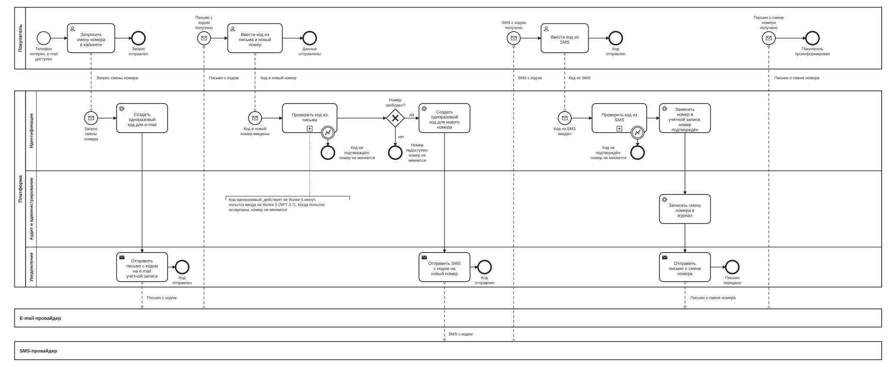

# BPMN-07. Смена номера телефона покупателя

| Поле | Содержание |
| --- | --- |
| ID | BPMN-07 |
| Релиз | R2 |
| Участники | Покупатель. Платформа (дорожки: Идентификация, Аудит и администрирование, Уведомления). Внешние системы: e-mail-провайдер, SMS-провайдер |
| Триггер | Покупатель, потерявший телефон, но сохранивший доступ к e-mail, нажимает «Сменить номер» в личном кабинете |
| Результат | Новый номер подтверждён и привязан к учётной записи, смена записана в журнал аудита, покупатель получил письмо. Либо номер не изменён: один из кодов не подтверждён или номер уже привязан к другой учётной записи |
| Требования | FT-1.5, FT-1.6, FT-11.0, FT-11.1, FT-11.2, NFT-3.5, NFT-3.7, NFT-5.3 |
| Статусные модели | Не применимо: у процесса нет сущности со своим жизненным циклом. Признак «телефон подтверждён» остаётся в учётной записи |
| Связанные артефакты | BPMN-01 (подтверждение телефона перед первой покупкой), BPMN-04 (вход по SMS и смена e-mail через поддержку) |

Процесс закрывает случай, когда покупатель потерял телефон и не может получить SMS на старый номер. Подтверждением личности служит доступ к e-mail учётной записи, а новый номер подтверждается кодом из SMS. Это процесс релиза R2, поэтому он нарисован укрупнённо: основной путь и три исключения.

## Диаграмма

Диаграмма широкая. Для чтения откройте [картинку](BPMN-07-phone-change.svg) целиком или файл [BPMN-07-phone-change.bpmn](BPMN-07-phone-change.bpmn) в редакторе bpmn.io.

**Как читать.**

- Верхний пул это покупатель. У него четыре независимых потока: запрос смены (слева), ввод кода из письма и нового номера, ввод кода из SMS, получение письма о смене (справа). Каждый поток после первого запускается сообщением от провайдера.
- Платформа показана тремя дорожками: «Идентификация» (сервис, отвечающий за подтверждение и смену номера, раздел 8.1), «Аудит и администрирование» и «Уведомления». У платформы тоже три независимых потока, каждый запускается сообщением покупателя.
- Внизу e-mail-провайдер и SMS-провайдер. Мы передаём им сообщение и не управляем доставкой.
- Прямоугольник со знаком «плюс» это свёрнутый подпроцесс проверки кода. Его содержимое (счётчик попыток, срок жизни кода) показывается на sequence-диаграмме в Ф2 вместе с решением ADR-010. Круг с молнией на границе означает, что код не подтверждён.
- Ромб «Номер свободен?» стоит после проверки кода из письма и до отправки SMS: так код не уходит на номер, который уже принадлежит другой учётной записи.
- Между потоками платформы состояние хранится в учётной записи: какой этап уже пройден. Без этого можно было бы пропустить проверку кода из письма.

## Основной путь

1. Покупатель входит в кабинет (e-mail и пароль или VK ID) и запрашивает смену номера (FT-1.6).
2. Сервис идентификации создаёт одноразовый код для e-mail. Код действует не более 5 минут, попыток ввода не более 5 (NFT-3.7). Запросов кода не более 3 за 10 минут и не более 10 за сутки (NFT-3.5, FT-11.1).
3. Сервис уведомлений отправляет письмо с кодом на e-mail учётной записи. Провайдер доставляет его покупателю.
4. Покупатель вводит код из письма и новый номер в одной форме.
5. Сервис идентификации проверяет код из письма. Если код верный, он проверяет, что новый номер не привязан к другой учётной записи (FT-1.5). Только после этого создаётся одноразовый код для нового номера. Порядок из FT-1.6 сохраняется: SMS на новый номер уходит только после проверки кода из письма.
6. Сервис уведомлений отправляет SMS с кодом на новый номер.
7. Покупатель вводит код из SMS.
8. Сервис идентификации проверяет код. Если он верный, номер в учётной записи заменяется на новый и считается подтверждённым (FT-1.5, FT-1.6).
9. Смена записывается в журнал аудита как действие самого покупателя. Для номера хранятся ID объекта, имя поля и HMAC-хеши значений до и после, сам номер в журнал в открытом виде не попадает (FT-1.6, FT-11.2, NFT-5.3).
10. Сервис уведомлений отправляет покупателю письмо о смене номера (FT-11.0).

## Исключения и альтернативы

| № | Ситуация | Что делает система | Результат | Требования |
| --- | --- | --- | --- | --- |
| E1 | Код из письма неверный, истёк или исчерпаны 5 попыток | Проверка завершается ошибкой, SMS на новый номер не отправляется | Номер не меняется | FT-1.6, NFT-3.7 |
| E2 | Код из SMS неверный, истёк или исчерпаны 5 попыток | Проверка завершается ошибкой, прежний номер остаётся в учётной записи | Номер не меняется | FT-1.6, NFT-3.7 |
| E3 | Новый номер уже привязан к другой учётной записи | SMS на этот номер не отправляется. Покупатель видит нейтральное сообщение «Номер использовать нельзя» без указания причины, чтобы по ответу нельзя было узнать, есть ли у номера учётная запись. Тот же результат, если номер заняли между проверкой и заменой (уникальный индекс в базе) | Номер не меняется | FT-1.5 |

Не нарисовано, потому что относится к реализации, а не к бизнес-логике: если провайдер не принял SMS или письмо, сервис уведомлений повторяет отправку (раздел 8.1). Если код не пришёл, покупатель может запросить новый в пределах лимита: 3 запроса за 10 минут и 10 за сутки (NFT-3.5).

## Сроки и параметры

| Срок или параметр | Значение | Где на диаграмме | Источник |
| --- | --- | --- | --- |
| Срок жизни кода | Не более 5 минут | Аннотация к проверке кода | NFT-3.7 |
| Число попыток ввода | 5 по умолчанию, настраивается | Аннотация к проверке кода | NFT-3.7 |
| Частота запросов кода | Не более 3 за 10 минут и не более 10 за сутки на учётную запись и на номер телефона, параметры платформы | Задача «Создать одноразовый код для e-mail» | NFT-3.5, FT-11.1 |

## Решения и открытые вопросы

**Приняты при моделировании:**

1. **Одна форма вместо двух шагов.** Код из письма и новый номер вводятся вместе. Сервер сначала проверяет код и только потом отправляет SMS, поэтому порядок из FT-1.6 («затем») соблюдён. Это удобнее для покупателя и не меняет требований.
2. **SMS на старый номер не отправляется.** Покупатель его потерял, поэтому подтверждением служит e-mail.
3. **Покупатель уже вошёл в кабинет.** FT-1.6 говорит «в личном кабинете». Случай, когда нет доступа ни к e-mail, ни к телефону, в этот процесс не входит.
4. **Письмо о смене номера уходит на e-mail учётной записи.** Старый номер недоступен, а письмо даёт владельцу почты шанс заметить чужую смену (FT-11.0).

**Решения по ранее открытым вопросам** (внесены в требования v1.5):

1. **Куда писать смену номера.** В журнал аудита по правилам NFT-5.3, как действие самого покупателя. Журнал уже неизменяемый, не содержит персональных данных в открытом виде и закрыт от правки, поэтому отдельный журнал для действий пользователей не нужен. FT-11.2 расширен: в журнал аудита пишутся также смена номера телефона и e-mail самим пользователем. Для действий пользователей IP в журнале хранится в виде HMAC-хеша (NFT-5.3).
2. **Номер уникален.** Один номер привязан к одной учётной записи (FT-1.5). При смене номера проверка стоит после кода из письма и до SMS (исключение E3). Покупателю показывается нейтральное сообщение: ответ «номер занят» раскрыл бы, что у номера есть учётная запись. Уникальность дополнительно гарантирует уникальный индекс в базе данных, потому что между проверкой и заменой номер могут занять.
3. **Ограничение запросов кода** (NFT-3.5): не более 3 запросов за 10 минут и не более 10 за сутки на учётную запись и на номер телефона. Значения настраиваются администратором (FT-11.1). Защита от перебора кода это отдельный лимит из NFT-3.7: 5 попыток на код.

**Открытых вопросов по процессу нет.**

## Покрытие требований

| Требование | Где реализуется на диаграмме |
| --- | --- |
| FT-1.5 | Задача «Заменить номер в учётной записи, номер подтверждён», ромб «Номер свободен?», путь E3 |
| FT-1.6 | Весь основной путь: код на e-mail, затем код из SMS на новый номер, запись в журнал |
| FT-11.0 | Задача «Отправить письмо о смене номера» и поток «Письмо о смене номера получено» |
| FT-11.1 | Параметры лимитов запросов кода и попыток |
| NFT-3.5 | Задача «Создать одноразовый код для e-mail» (ограничение частоты запросов) |
| NFT-3.7 | Аннотация и подпроцессы «Проверить код из письма», «Проверить код из SMS», пути E1 и E2 |
| FT-11.2, NFT-5.3 | Задача «Записать смену номера в журнал» |

## Связанные документы

- [Требования v1.6](../02-requirements/requirements_v1.6.md), разделы 4.1, 4.11 и 8.2
- [Глоссарий](../01-vision/glossary.md): одноразовый код, подтверждение телефона, журнал аудита
- [BPMN-01. Покупка](BPMN-01-purchase.md): подтверждение телефона перед первой покупкой
- [BPMN-04. Обращение в поддержку](BPMN-04-support-request.md): смена e-mail через поддержку
