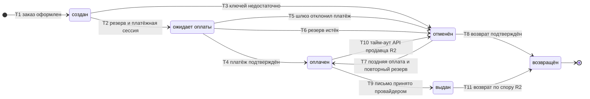

# SM-01. Заказ

| Поле | Содержание |
| --- | --- |
| ID | SM-01 |
| Сущность | Заказ ([раздел 6.1 требований](../02-requirements/requirements_v1.5.md)) |
| Релиз | R1. Переходы T10 и T11 относятся к R2 |
| Владелец данных | Сервис «Заказы» |
| Статусы | создан, ожидает оплаты, оплачен, выдан, отменён, возвращён |
| Начальный статус | создан |
| Конечные статусы | возвращён. «Отменён» конечный, если подтверждение оплаты не придёт. «Выдан» в R1 конечный, в R2 из него возможен возврат по спору (T11) |
| Процессы | [BPMN-01](BPMN-01-purchase.md), [BPMN-04](BPMN-04-support-request.md), [BPMN-05](BPMN-05-dispute.md) |
| Связанные модели | SM-02 Платёж, SM-03 Ключ, SM-06 Выдача, SM-08 Резерв |
| Требования | FT-1.5, FT-4.4, FT-5.0 … FT-5.4, FT-6.1 … FT-6.5, FT-7.0, FT-7.1, FT-7.3, FT-7.4, FT-8.4, FT-9.5, FT-11.0, NFT-2.3, NFT-2.4 |

## Сущность

Заказ это покупка одного товара одного продавца в количестве от 1 до 10 штук, оплачиваемая одним платежом (ADR-001, FT-5.1). Заказ хранит снимок e-mail покупателя, срок резерва и срок платёжной сессии. Статус заказа отвечает на вопрос «что с покупкой», а не «что с письмом» и не «что с деньгами»: за них отвечают статусы выдачи (SM-06) и платежа (SM-02).

Значение статуса «выдан» задано в определениях раздела 4 требований: ключ привязан к заказу, и письмо принято почтовым провайдером. Это не то же самое, что «доставлен»: доставка отслеживается в SM-06.

## Диаграмма

## Матрица переходов

| № | Из | В | Условие | Кто или что инициирует | Что происходит ещё | Источник |
| --- | --- | --- | --- | --- | --- | --- |
| T1 | (начало) | создан | Покупатель оформил заказ из карточки товара: товар опубликован, количество от 1 до 10, телефон подтверждён. В заказ записан снимок e-mail | Покупатель, сервис «Заказы» | Если телефон не подтверждён, заказ не создаётся (E1 в BPMN-01) | BPMN-01, FT-5.0, FT-5.1, FT-1.5 |
| T2 | создан | ожидает оплаты | Резерв создан (SM-08 «активен»), платёжная сессия открыта (SM-02 «создан») | Система («Заказы» по ответам «Остатков и ключей» и «Платежей») | Ключи «зарезервированы» (SM-03). Покупателю уходит письмо «Заказ создан» | BPMN-01, FT-5.2, FT-6.1, FT-11.0 |
| T3 | создан | отменён | Ключей меньше, чем заказано: резерв не создан | Система («Остатки и ключи» → «Заказы») | Платёж не создаётся. Покупатель видит остаток на экране | BPMN-01 E2, FT-4.4, FT-5.2 |
| T4 | ожидает оплаты | оплачен | Шлюз подтвердил платёж, пока резерв активен | Платёжный шлюз через сервис «Платежи» | Платёж «подтверждён», резерв «использован», ключи «выданы», создаётся выдача «в очереди». Запускается контроль 30 минут. Письмо «Заказ оплачен» | BPMN-01, FT-6.2, NFT-2.3, NFT-2.4, FT-11.0 |
| T5 | ожидает оплаты | отменён | Шлюз отклонил платёж | Платёжный шлюз через «Платежи» | Платёж «отклонён», резерв «снят» сразу (причина «отказ в оплате»), ключи «свободны» | BPMN-01 E3, FT-6.3 |
| T6 | ожидает оплаты | отменён | Платёжная сессия истекла без оплаты, резерв истёк (15 минут) | Система: таймер резерва, а при его потере сверяющая задача | Резерв «снят» (причина «срок истёк»), ключи «свободны». Платёж остаётся «создан» на случай поздней оплаты | BPMN-01 E4, FT-5.2, FT-6.3 |
| T7 | отменён | оплачен | Поздняя оплата: подтверждение пришло после отмены, ключей хватает на всё заказанное количество, повторный резерв создан | Платёжный шлюз, «Остатки и ключи» | Платёж «подтверждён», новый резерв сразу «использован», ключи «выданы», выдача «в очереди». Контроль 30 минут запускается заново | BPMN-01 E6, FT-6.5 |
| T8 | отменён | возвращён | Деньги вернулись покупателю. Случаи: автовозврат после поздней оплаты, если ключей нет или их меньше, чем заказано (R1), возврат после тайм-аута API продавца (R2). Возврат подтверждён шлюзом либо администратор отметил ручной возврат выполненным | Платёжный шлюз через «Платежи» или Администратор | Платёж «возвращён», письмо о возврате. Начислений продавцу не было, сторнировать нечего | BPMN-01 E7, E8, FT-6.4, FT-6.5, FT-7.4, FT-11.0 |
| T9 | оплачен | выдан | Ключи привязаны к заказу, и провайдер принял письмо (выдача «отправлено»). Первый такой переход один раз за жизнь заказа | Система (сервис «Выдача») | Открываются окно обращения 72 часа, окно спора 72 часа и удержание 7 дней. Создаются операции баланса (R2, SM-11) | BPMN-01, FT-7.0, FT-7.1, FT-7.3 |
| T10 | оплачен | отменён | R2. Для товара с выдачей по API продавец не ответил за 10 минут или вернул ошибку | Система («Выдача») | Остаток восстановлен, резерв «снят» (причина «заказ отменён»). Затем автовозврат, T8 | FT-7.4, FT-4.3 |
| T11 | выдан | возвращён | R2. Решение по спору «возврат», возврат подтверждён шлюзом либо отмечен администратором | Модератор (решение), шлюз или Администратор | Платёж «возвращён», начисление и комиссия сторнируются целиком (SM-11), письмо о возврате | BPMN-05, FT-8.4, FT-9.5, FT-11.0 |

Номера переходов используются в других документах и тест-кейсах в виде «SM-01/T4».

## Недопустимые переходы

| Из | В | Почему нельзя |
| --- | --- | --- |
| создан | оплачен | Платёж создаётся только после резерва (T2): оплата без платёжной сессии невозможна |
| создан, ожидает оплаты | выдан | Выдача идёт только после подтверждённой оплаты, через статус «оплачен» |
| ожидает оплаты, оплачен, выдан | создан | Статусы идут вперёд. Заказ не «перерезервируется» заново, для новой попытки покупатель оформляет новый заказ |
| оплачен | ожидает оплаты | Оплата уже подтверждена, повторно ждать её незачем |
| оплачен | возвращён | Возврат не обходит «отменён»: статус «отменён» всегда значит «товар не выдан», а «возвращён» фиксирует итог возврата. В R1 оплаченный заказ без выдачи ждёт выдачи или поддержки (T9, BPMN-04) |
| оплачен (R1) | отменён | Оплаченный заказ нельзя отменить без возврата денег. В R2 исключение одно: тайм-аут API продавца (T10) |
| выдан | отменён | Ключ уже передан покупателю, вернуть заказ «в не выдан» нельзя. Остаётся только возврат по спору (T11) |
| выдан | оплачен, ожидает оплаты | Откат выдачи запрещён (FT-7.1: выданный ключ нельзя выдать повторно другому заказу) |
| отменён | создан, ожидает оплаты | Отменённый заказ не возобновляется: резерв снят, ключи могли уйти другим покупателям. Единственное исключение: поздняя оплата (T7), которая идёт сразу в «оплачен» |
| отменён | выдан | Выдача возможна только после «оплачен» (сначала T7, затем T9) |
| возвращён | любой | Конечный статус. Повторная покупка это новый заказ |

Повторное уведомление шлюза, при котором статус уже тот, в который ведёт переход, не меняет заказ и не создаёт записей (FT-6.2, NFT-2.3). Это не переход, а событие, которое игнорируется.

## Согласованность статусов

Таблица показывает, в каких статусах при этом находятся связанные сущности. Строка заказа может встречаться несколько раз, если одному статусу соответствуют разные ситуации. Все строки заполнены однозначно.

| Статус заказа | Ситуация | Платёж (SM-02) | Ключи (SM-03) | Резерв (SM-08) | Выдача (SM-06) |
| --- | --- | --- | --- | --- | --- |
| создан | Резерв ещё создаётся | нет записи | «свободен» | нет записи | нет записи |
| ожидает оплаты | Покупатель платит | «создан» | «зарезервирован» | «активен» | нет записи |
| оплачен | Выдача ещё не принята провайдером | «подтверждён» | «выдан» (привязаны к заказу) | «использован» | «в очереди» или «ошибка» (E9 в BPMN-01) |
| выдан | Письмо принято | «подтверждён» | «выдан» | «использован» | «отправлено», «доставлено» или «ошибка» (E10, E11), плюс повторные выдачи в любом статусе |
| отменён | Оплаты не было: ключей не хватило | нет записи | «свободен» | нет записи | нет записи |
| отменён | Оплаты не было: отказ шлюза | «отклонён» | «свободен» | «снят» (отказ в оплате) | нет записи |
| отменён | Оплаты не было: срок истёк | «создан» | «свободен» | «снят» (срок истёк) | нет записи |
| отменён | Поздняя оплата, возврат ещё не завершён (ручной возврат ждёт администратора) | «подтверждён» | «свободен» | «снят» или нет записи, если повторный резерв не удался | нет записи |
| возвращён | Возврат после поздней оплаты | «возвращён» | «свободен» | «снят» или нет записи | нет записи |
| возвращён | R2. Возврат после тайм-аута API | «возвращён» | нет записей, ключ от продавца не получен | «снят» (заказ отменён) | нет записи |
| возвращён | R2. Возврат по решению спора | «возвращён» | «выдан» (ключ не возвращается в оборот) | «использован» | «доставлено», «отправлено» или «ошибка», есть записи выдач |

## Окна и таймеры, которые запускают переходы

| Момент | Что запускается | Значение | Источник |
| --- | --- | --- | --- |
| T2 | Резерв и платёжная сессия | 15 и 12 минут, параметры платформы | FT-5.2 |
| T4 и T7 | Контроль зависшей выдачи | 30 минут с оплаты, затем очередь поддержки и оповещение администратора | FT-7.3, NFT-2.4 |
| T9 | Окно обращения в поддержку | 72 часа | FT-7.2 |
| T9 | Окно спора | 72 часа | FT-8.0 |
| T9 | Удержание средств продавца | 7 дней | FT-9.2 |

Повторная отправка ключа по обращению (BPMN-04) и замена ключа по спору эти сроки не сдвигают: T9 происходит один раз.

## Уведомления покупателю (FT-11.0)

Письма отправляет сервис «Уведомления» по событиям, которые публикует сервис «Заказы» при смене статуса.

| Событие из FT-11.0 | Когда | Комментарий |
| --- | --- | --- |
| Заказ создан | T2 | Письмо уходит, когда заказ ожидает оплаты. При T3 заказа по сути нет, поэтому письма нет |
| Заказ оплачен | T4, T7 | |
| Ключ выдан | T9 | Само письмо с ключом, которое принял провайдер. Повторные отправки идут тем же письмом |
| Возврат | T8, T11 | |
| Статус спора | Переходы SM-09 | См. SM-09 |
| Смена номера телефона или e-mail | BPMN-07, BPMN-04 | Не связана со статусом заказа |

При отмене заказа по сроку или отказу письма нет: интерфейс объясняет причину сразу и предлагает повторить покупку (раздел 7 требований).

## Решения при моделировании

1. **T9 может запустить любая выдача.** Если первое письмо не принято (E9 в BPMN-01), заказ остаётся «оплачен», а оператор поддержки отправляет ключ повторно. Когда провайдер принял это письмо, заказ впервые становится «выдан» и открываются окна и удержание. Это следует из определения «выдан» (ключ привязан и письмо принято), поэтому требования не менялись.
2. **Возврат после тайм-аута API идёт через «отменён».** Заказ с выдачей по API не дошёл до «выдан», поэтому сначала он «отменён» (T10), а «возвращён» наступает после подтверждения возврата (T8). Так «отменён» везде значит «товар не выдан».
3. **Заказ без ключей получает «отменён» сразу (T3).** Покупателю не нужно ждать таймера, платёж не создаётся.
4. **Причина отмены.** В заказе нужен атрибут «причина отмены» (нет остатка, отказ в оплате, срок истёк, тайм-аут API продавца), чтобы интерфейс мог объяснить покупателю, что произошло (раздел 7 требований). Атрибут добавляется в доменную модель, на требования это не влияет.
5. **Платёж при истечении сессии остаётся «создан».** Отдельного статуса «истёк» в требованиях нет, а шлюз может подтвердить платёж позже (поздняя оплата). Срок сессии хранится в заказе.

## Связанные требования и процессы

- [BPMN-01. Покупка](BPMN-01-purchase.md): основной путь и исключения E1 … E11
- [BPMN-04. Обращение в поддержку](BPMN-04-support-request.md): заказы, переданные в очередь поддержки
- [BPMN-05. Спор](BPMN-05-dispute.md): возврат по решению спора
- [Требования v1.5](../02-requirements/requirements_v1.5.md): разделы 4.5, 4.6, 4.7, 6.1
- [Глоссарий](../01-vision/glossary.md): статусы заказа
