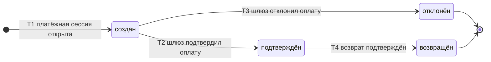

# SM-02. Платёж

| Поле | Содержание |
| --- | --- |
| ID | SM-02 |
| Сущность | Платёж ([раздел 6.1 требований](../02-requirements/requirements_v1.6.md)) |
| Релиз | R1. Причины возврата «тайм-аут API продавца» и «решение спора» относятся к R2 |
| Владелец данных | Сервис «Платежи» |
| Статусы | создан, подтверждён, отклонён, возвращён |
| Начальный статус | создан |
| Конечные статусы | отклонён, возвращён. «Подтверждён» конечный, если возврата не будет |
| Процессы | [BPMN-01](BPMN-01-purchase.md), [BPMN-05](BPMN-05-dispute.md) |
| Связанные модели | SM-01 Заказ, SM-08 Резерв |
| Требования | FT-5.2, FT-6.0 … FT-6.5, FT-8.4, NFT-2.3, NFT-4.3, NFT-5.1, NFT-6.1 |

## Сущность

Платёж это попытка оплаты одного заказа через внешний платёжный шлюз. Один заказ оплачивается одним платежом (FT-6.1). Данные банковских карт в платформе не хранятся: платформа знает только внешний ID платежа у шлюза, сумму и статус (FT-6.0, NFT-5.1).

Статус платежа отражает то, что подтвердил шлюз, а не то, что решила платформа. Платформа не меняет статус «по своему мнению»: переход происходит только по ответу или уведомлению шлюза либо по отметке администратора о ручном возврате.

## Диаграмма

## Матрица переходов

| № | Из | В | Условие | Кто или что инициирует | Что происходит ещё | Источник |
| --- | --- | --- | --- | --- | --- | --- |
| T1 | (начало) | создан | Сервис «Платежи» создал платёж у шлюза и открыл платёжную сессию (12 минут). Один платёж на заказ | Система (сервис «Платежи» по запросу «Заказов») | Заказ переходит в «ожидает оплаты» (SM-01/T2) | BPMN-01, FT-5.2, FT-6.1 |
| T2 | создан | подтверждён | Шлюз прислал подтверждение. Это возможно и после снятия резерва: поздняя оплата | Платёжный шлюз | Если заказ ждёт оплаты, он становится «оплачен» (SM-01/T4). Если заказ уже «отменён», действует правило поздней оплаты (SM-01/T7 или T8) | BPMN-01, FT-6.2, FT-6.5 |
| T3 | создан | отклонён | Шлюз сообщил об отказе в оплате | Платёжный шлюз | Резерв снимается сразу (SM-08), заказ «отменён» (SM-01/T5) | BPMN-01 E3, FT-6.3 |
| T4 | подтверждён | возвращён | Шлюз подтвердил возврат всей суммы либо администратор отметил ручной возврат выполненным. Причина возврата записывается в платёж: поздняя оплата без возможности выдачи (R1), тайм-аут API продавца (R2), решение спора (R2) | Платёжный шлюз или Администратор | Заказ «возвращён» (SM-01/T8 или T11). Покупателю уходит письмо | BPMN-01 E7, E8, BPMN-05, FT-6.4, FT-7.4, FT-8.4 |

Номера переходов используются в виде «SM-02/T2».

## Недопустимые переходы

| Из | В | Почему нельзя |
| --- | --- | --- |
| создан | возвращён | Возвращать можно только то, что оплачено. Незавершённый платёж либо подтверждается, либо отклоняется |
| отклонён | подтверждён | Отказ шлюза окончателен. Если шлюз всё же прислал подтверждение по отклонённому платежу, это аномалия: событие не меняет статус, попадает в метрику ошибок платежей (NFT-6.1) и разбирается администратором вручную |
| отклонён | возвращён, создан | Нечего возвращать, сессия закрыта. Для новой попытки создаётся новый заказ и новый платёж |
| подтверждён | создан, отклонён | Откат подтверждения запрещён: деньги уже получены |
| возвращён | любой | Конечный статус. Возврат всегда полный, частичных возвратов нет (FT-8.4) |
| любой | тот же | Повторное уведомление шлюза о том же состоянии игнорируется: ни дублирования оплаты, ни повторной выдачи (FT-6.2, NFT-2.3) |

## Что не является статусом

Требования задают четыре статуса. Следующие состояния не вводятся отдельными статусами, а хранятся атрибутами платежа:

| Состояние | Где хранится | Почему не статус |
| --- | --- | --- |
| Сессия истекла без оплаты | Срок сессии в заказе. Платёж остаётся «создан» | Шлюз может подтвердить платёж позже (поздняя оплата). Отдельный статус «истёк» закрыл бы эту возможность |
| Возврат запрошен, ответа шлюза ещё нет | Внешний ID возврата, число попыток, время следующей попытки | Для покупателя и заказа деньги ещё не возвращены. Платёж остаётся «подтверждён» до подтверждения возврата |
| Возврат ждёт администратора | Признак «в очереди администратора» | После исчерпания попыток возврат ждёт ручного исполнения (FT-6.4). Статус тот же: «подтверждён» |

## Идемпотентность и повторы

- Уведомления шлюза обрабатываются идемпотентно: по паре «внешний ID платежа и тип события» повторное событие распознаётся и игнорируется (FT-6.2, NFT-2.3).
- Возврат идемпотентен: у платежа один внешний ID возврата, повторный запрос к шлюзу с тем же ключом идемпотентности не создаёт второй возврат (FT-6.4).
- При сбое шлюза возврат повторяется с нарастающей задержкой, после исчерпания попыток уходит в очередь администратора. Число попыток и задержки задаются параметрами и уточняются в Ф2 (NFT-4.3).

## Решения при моделировании

1. **Четыре статуса из требований достаточны.** Дополнительные состояния (сессия истекла, возврат в обработке) вынесены в атрибуты. Это сохраняет простую диаграмму и не закрывает путь поздней оплаты.
2. **Подтверждение после отмены это допустимый переход T2.** Платёж, оставшийся «создан» после отмены заказа, может стать «подтверждён» (BPMN-01, E6 и E7). Дальнейшую судьбу решает заказ.
3. **Подтверждение по отклонённому платежу это аномалия, а не поздняя оплата.** Поздняя оплата относится к платежу, который шлюз не отклонял (FT-6.5).
4. **Возврат всегда полный.** Один платёж, один возврат, без частичных сумм (FT-8.4).

## Связанные требования и процессы

- [BPMN-01. Покупка](BPMN-01-purchase.md): платёж, поздняя оплата, автовозврат, ручной возврат
- [BPMN-05. Спор](BPMN-05-dispute.md): возврат по решению спора
- [SM-01. Заказ](SM-01-order.md): статусы заказа, которые меняются вместе с платежом
- [Требования v1.6](../02-requirements/requirements_v1.6.md): раздел 4.6, раздел 6.1
