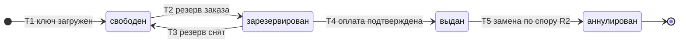

# SM-03. Ключ

| Поле | Содержание |
| --- | --- |
| ID | SM-03 |
| Сущность | Ключ ([раздел 6.1 требований](../02-requirements/requirements_v1.6.md)) |
| Релиз | R1. Переход T5 и ключи, полученные от продавца по API, относятся к R2 |
| Владелец данных | Сервис «Остатки и ключи» |
| Статусы | свободен, зарезервирован, выдан, аннулирован |
| Начальный статус | свободен |
| Конечные статусы | выдан (в R1), аннулирован |
| Процессы | [BPMN-01](BPMN-01-purchase.md), [BPMN-03](BPMN-03-product-moderation.md), [BPMN-05](BPMN-05-dispute.md) |
| Связанные модели | SM-01 Заказ, SM-06 Выдача, SM-08 Резерв |
| Требования | FT-4.1 … FT-4.4, FT-5.2, FT-6.3, FT-6.5, FT-7.1, FT-8.6, NFT-2.2, NFT-3.2 |

## Сущность

Ключ это единица товара: код активации, лицензия или код подарочной карты. Значение хранится в зашифрованном виде (AES-256), в интерфейсе после загрузки не показывается, в логи и ответы API не попадает (FT-4.2, NFT-3.2). Рядом с шифрованным значением хранится HMAC значения с секретом сервера: по паре «товар, HMAC» действует уникальный индекс, поэтому дубли внутри товара отклоняются без расшифровки (FT-4.1).

Главный инвариант модели: **один ключ принадлежит не более чем одному заказу** (FT-7.1, NFT-2.2). Он обеспечивается тремя вещами: блокировкой строки с пропуском занятых (`FOR UPDATE SKIP LOCKED`) при резервировании, привязкой ключа к одному заказу и тем, что статус «выдан» никогда не возвращается в «свободен».

## Диаграмма

## Матрица переходов

| № | Из | В | Условие | Кто или что инициирует | Что происходит ещё | Источник |
| --- | --- | --- | --- | --- | --- | --- |
| T1 | (начало) | свободен | Ключ загружен вручную или файлом CSV, не дубль внутри товара, зашифрован. В разных товарах одинаковые значения допустимы | Продавец, сервис «Остатки и ключи» | Остаток товара растёт на принятые ключи. Дубли отклоняются, остальные сохраняются | BPMN-03 E4, FT-4.1, FT-4.2, FT-4.3 |
| T2 | свободен | зарезервирован | Оформлен заказ, ключей достаточно. Для каждого заказанного ключа строка блокируется с пропуском занятых | Система («Остатки и ключи» по запросу «Заказов») | Создаётся резерв (SM-08 «активен»), ключи привязываются к заказу. Остаток уменьшается | BPMN-01, FT-5.2, FT-7.1, NFT-2.2 |
| T3 | зарезервирован | свободен | Резерв снят: истёк срок, шлюз отклонил платёж или заказ отменён. Привязка к заказу снимается | Система (таймер резерва, отказ шлюза, сверяющая задача) | Резерв «снят» (SM-08). Остаток растёт | BPMN-01 E3, E4, FT-5.2, FT-6.3 |
| T4 | зарезервирован | выдан | Платёж подтверждён, пока резерв активен, либо при поздней оплате повторный резерв создан и сразу использован. Ключ остаётся привязанным к заказу | Система («Остатки и ключи» по запросу «подтвердить резерв» от «Заказов» после подтверждения платежа) | Резерв «использован». Создаётся выдача «в очереди» (SM-06). Ключ не возвращается в оборот никогда | BPMN-01, FT-6.5, FT-7.1 |
| T5 | выдан | аннулирован | R2. Решение по спору «замена ключа»: новый ключ найден, прежний аннулируется | Система («Остатки и ключи» по решению модератора) | Новый ключ проходит путь T2 и T4 для того же заказа, выдача типа «повторная» (SM-06). Прежний ключ из оборота выводится | BPMN-05, FT-8.6 |

Номера переходов используются в виде «SM-03/T4».

## Недопустимые переходы

| Из | В | Почему нельзя |
| --- | --- | --- |
| выдан | свободен | Главная защита от двойной выдачи (FT-7.1, NFT-2.2): ключ, который покупатель мог получить, нельзя продать второй раз, даже если заказ возвращён |
| выдан | зарезервирован | Тот же запрет: из «выдан» возможен только выход в «аннулирован» |
| аннулирован | любой | Конечный статус. Аннулированный ключ не используется |
| свободен | выдан | Выдача возможна только по оплаченному заказу, через резерв (T2, T4) |
| свободен | аннулирован | В MVP продавец не может отозвать свободный ключ: такой функции в требованиях нет. Если понадобится, она появится отдельным требованием |
| зарезервирован | аннулирован | Резерв либо снимается (T3), либо используется (T4). Аннулирование нужно только для уже выданного ключа |
| зарезервирован | зарезервирован другим заказом | Один ключ не резервируется под два заказа одновременно: параллельные заказы получают разные ключи благодаря пропуску занятых строк |

## Конкуренция и повторы

- **Резерв.** Два параллельных заказа на последние ключи пула не получают один ключ: строки, занятые другой транзакцией, пропускаются. Если свободных ключей не хватило, резерв не создаётся вообще (частичного резерва нет), заказ «отменён» (SM-01/T3).
- **Оплата и истечение резерва одновременно.** Статус ключа меняет тот переход, который первым успел обновить запись в PostgreSQL. Если резерв уже снят, оплата превращается в позднюю (SM-01/T7 или T8). Таймер в Redis только запускает снятие, источник истины находится в базе (раздел 8.2 требований).
- **Повторный запрос.** Повторный запрос «подтвердить резерв» не берёт новых ключей и не меняет статусы: ключи заказа уже «выданы», сервис возвращает прежний результат (FT-6.2, NFT-2.3).

## Остаток товара

Остаток зависит от способа выдачи (FT-4.3).

| Способ выдачи | Остаток | Как меняется |
| --- | --- | --- |
| Пул ключей (R1) | Число ключей в статусе «свободен» | Растёт на T1 и T3, уменьшается на T2 |
| Запрос к API продавца (R2) | Число, которое задаёт продавец | Уменьшается при оформлении заказа, восстанавливается при отмене заказа или истечении резерва, продавец меняет его вручную с контролем версии записи |

Для товара с выдачей по API записи ключей в пуле нет: ключ приходит от продавца в ответ на запрос (FT-7.4, FT-10.2). Запись ключа создаётся в момент получения ответа сразу в статусе «выдан», зашифрованной, и дальше живёт по общим правилам (в том числе T5 при замене по спору). До ответа продавца резервирование выражается уменьшением остатка и записью резерва (SM-08).

## Решения при моделировании

1. **«Выдан» наступает при подтверждении оплаты, а не при отправке письма.** Привязка ключа к заказу фиксируется сразу после оплаты (BPMN-01, шаг 8), чтобы ключ уже нельзя было отдать другому, даже если письмо задержалось. Статус заказа «выдан» наступает позже, когда письмо принято провайдером (SM-01/T9).
2. **Возврат не возвращает ключ в «свободен».** Это следует из FT-7.1 и NFT-2.2: ключ мог дойти до покупателя. После возврата по спору ключ остаётся «выдан».
3. **Отзыв свободных ключей вне MVP.** Продавец может добавлять ключи, но не удалять. Ограничение зафиксировано как граница MVP и учтено в недопустимых переходах.
4. **Частичного резерва нет.** Заказ получает либо все ключи, либо отмену. Это согласуется с правилом «выдан целиком или возвращён целиком» (FT-6.5).
5. **Ключ от продавца по API создаётся сразу «выдан».** В пуле такого ключа нет, поэтому статусы «свободен» и «зарезервирован» для него не имеют смысла.

## Связанные требования и процессы

- [BPMN-01. Покупка](BPMN-01-purchase.md): резерв, выдача ключа, поздняя оплата
- [BPMN-03. Модерация товара](BPMN-03-product-moderation.md): загрузка пула и отклонение дублей
- [BPMN-05. Спор](BPMN-05-dispute.md): замена ключа
- [SM-01. Заказ](SM-01-order.md), [SM-02. Платёж](SM-02-payment.md): согласованность статусов
- [Требования v1.6](../02-requirements/requirements_v1.6.md): разделы 4.4, 4.5, 4.7, 5.3, 6.1
