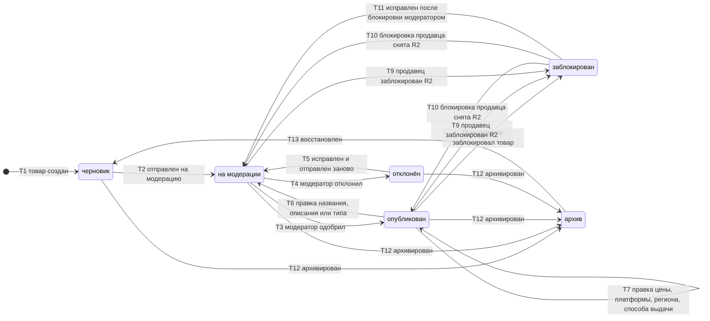

# SM-04. Товар

| Поле | Содержание |
| --- | --- |
| ID | SM-04 |
| Сущность | Товар ([раздел 6.1 требований](../02-requirements/requirements_v1.5.md)) |
| Релиз | R1. Переходы T9 и T10 (блокировка продавца) относятся к R2 |
| Владелец данных | Сервис «Каталог» |
| Статусы | черновик, на модерации, опубликован, отклонён, заблокирован, архив |
| Начальный статус | черновик |
| Конечные статусы | Нет: из любого статуса есть выход. «Архив» возвращается в «черновик» (T13) |
| Процессы | [BPMN-03](BPMN-03-product-moderation.md), [BPMN-02](BPMN-02-seller-onboarding.md) |
| Связанные модели | SM-05 Профиль продавца, SM-03 Ключ |
| Требования | FT-3.0, FT-3.1, FT-3.2, FT-3.3, FT-3.4, FT-4.4, FT-2.3, FT-11.4, NFT-6.1 |

## Сущность

Товар это предложение продавца: название, описание, тип (ключ игры, лицензия ПО, подарочная карта или пополнение, подписка), платформа, регион активации, цена, способ выдачи. На витрине показываются только опубликованные товары (FT-3.1). Решение модератора обязательно и до первой публикации, и после правки названия, описания или типа: так выполняется цель BG-05 (100% товаров проходят модерацию до витрины).

## Диаграмма

## Матрица переходов

| № | Из | В | Условие | Кто или что инициирует | Что происходит ещё | Источник |
| --- | --- | --- | --- | --- | --- | --- |
| T1 | (начало) | черновик | Продавец создал товар: название, описание, тип, платформа, регион, цена, способ выдачи. Профиль продавца «одобрен» | Продавец | Товар не виден на витрине | BPMN-03, FT-3.0, FT-3.1 |
| T2 | черновик | на модерации | Продавец отправил товар на модерацию, обязательные поля заполнены, продавец не заблокирован. Ключи в пуле не обязательны | Продавец | Товар встаёт в очередь модератора, начинается срок проверки 3 суток | BPMN-03, FT-3.2 |
| T3 | на модерации | опубликован | Модератор одобрил товар, продавец не заблокирован | Модератор | Товар появляется на витрине, решение в журнале аудита, продавцу письмо и запись в кабинете | BPMN-03, FT-3.1, FT-3.2, FT-11.2, FT-11.4 |
| T4 | на модерации | отклонён | Модератор отклонил товар. Причина обязательна, записывается в товар | Модератор | Продавец видит причину в кабинете и получает письмо, решение в журнале аудита | BPMN-03 E1, FT-3.2, FT-11.4 |
| T5 | отклонён | на модерации | Продавец исправил товар и отправил заново | Продавец | Новый срок проверки 3 суток. Автоматически после правки товар на модерацию не уходит | BPMN-03 E1, FT-3.2 |
| T6 | опубликован | на модерации | Продавец изменил название, описание или тип | Продавец | Товар сразу снимается с витрины. Срок проверки 3 суток отсчитывается заново. Заказы, оформленные раньше, доводятся до выдачи | BPMN-03 E2, FT-3.2 |
| T7 | опубликован | опубликован | Продавец изменил цену, платформу, регион активации или способ выдачи | Продавец | Статус не меняется, модерация не запускается. Заказы, созданные раньше, сохраняют прежнюю цену | BPMN-03 E3, FT-3.2 |
| T8 | опубликован | заблокирован | Модератор заблокировал товар. Причина обязательна. Причина блокировки: «решение модератора» | Модератор | Товар снимается с витрины, продавец получает письмо с причиной, решение в журнале аудита | Раздел 3, FT-3.1, FT-11.2, FT-11.4 |
| T9 | опубликован, на модерации | заблокирован | R2. Модератор заблокировал продавца. Причина блокировки: «блокировка продавца», запоминается статус до блокировки | Система по событию блокировки продавца (SM-05) | Товары «опубликован» скрываются с витрины. «На модерации» выходят из очереди модератора. Открытые заказы дорабатываются | FT-2.3 |
| T10 | заблокирован | опубликован или на модерации | R2. Блокировка продавца снята. Возвращаются только товары с причиной «блокировка продавца», каждый в запомненный статус | Система по событию снятия блокировки (SM-05) | Опубликованные снова на витрине. Возвращённые на модерацию получают срок 3 суток заново | FT-2.3 |
| T11 | заблокирован | на модерации | Товар был заблокирован модератором (T8), продавец исправил его и отправил заново | Продавец | Срок проверки 3 суток. Модератор принимает новое решение (T3 или T4) | Раздел 3, FT-3.2 |
| T12 | черновик, на модерации, опубликован, отклонён | архив | Продавец снял товар с продажи | Продавец | Товар не виден, остаётся в истории продавца. Из очереди модератора товар выходит. Открытые заказы доводятся до выдачи, резервы снимаются по сроку | FT-3.1 |
| T13 | архив | черновик | Продавец восстановил товар | Продавец | Дальше обычный путь с модерацией (T2). Пул ключей сохраняется | FT-3.1 |

Номера переходов используются в виде «SM-04/T3».

## Недопустимые переходы

| Из | В | Почему нельзя |
| --- | --- | --- |
| черновик, отклонён, архив | опубликован | Публикация возможна только после решения модератора (T3). Продавец сам товар не публикует (BG-05) |
| черновик | отклонён | Модератор решает только по товару, который ему отправили |
| на модерации | черновик, отклонён по таймеру | Просрочка срока не приводит к автоматическому решению: только оповещение администратора, товар остаётся в очереди (FT-3.2) |
| на модерации | опубликован без решения | Автоматического одобрения нет, потому что проверку выполняет человек (BG-05) |
| заблокирован (по решению модератора) | опубликован напрямую | Модератор не снимает блокировку товара кнопкой, такой функции в требованиях нет. Путь один: исправить товар и пройти модерацию снова (T11) |
| заблокирован | архив | Заблокированный товар нельзя убрать из-под блокировки: он должен остаться виден модератору |
| заблокирован (по причине «блокировка продавца») | на модерации по действию продавца | Заблокированный продавец не может менять и отправлять товары. Возврат только по снятию блокировки продавца (T10) |
| опубликован | отклонён | Отклонить можно только товар на модерации. Для уже опубликованного товара модератор применяет блокировку (T8) |
| архив | на модерации, опубликован | Из архива сначала восстановление в «черновик» (T13), потому что публикация это новое решение модератора |

## Что можно делать в каждом статусе

| Статус | Виден на витрине | Заказ можно оформить | Продавец может |
| --- | --- | --- | --- |
| черновик | нет | нет | Править всё, загружать ключи, отправить на модерацию, архивировать |
| на модерации | нет | нет | Загружать ключи, отозвать в архив. Править нельзя: модератор проверяет то, что отправлено |
| опубликован | да | да, пока остаток больше нуля (FT-4.4) | Править (T6, T7), загружать ключи, архивировать |
| отклонён | нет | нет | Править и отправить заново, загружать ключи, архивировать |
| заблокирован | нет | нет | При блокировке по решению модератора править и отправлять заново (T11). При блокировке продавца ничего |
| архив | нет | нет | Восстановить в «черновик» |

Товар с нулевым остатком остаётся «опубликован»: он виден, но оформить заказ нельзя (FT-4.4). Отдельного статуса «нет в наличии» нет, остаток вычисляется (SM-03).

## Решения при моделировании

1. **Блокировка продавца переводит его товары в «заблокирован».** Альтернатива, когда статусы товаров не меняются, а витрина проверяет статус продавца, сложнее: каталогу всё равно нужно знать статус продавца по событию, а возврат товаров на витрину потерял бы след, что было до блокировки. Поэтому у блокированного товара запоминается статус до блокировки и причина блокировки («решение модератора» или «блокировка продавца»). Это два дополнительных атрибута товара, они добавляются в доменную модель.
2. **Товары «на модерации» при блокировке продавца тоже блокируются.** Иначе модератору пришлось бы разбирать очередь товаров, которые нельзя опубликовать. После снятия блокировки они возвращаются на модерацию, срок 3 суток отсчитывается заново (T10).
3. **Блокировку товара модератором не снимают, товар исправляют и проверяют заново.** Раздел 3 требований даёт модератору «блокировку товаров», но не снятие. Чтобы не вводить новую функцию, путь назад идёт через исправление и повторную модерацию (T11).
4. **Правка в статусе «на модерации» запрещена.** Иначе модератор мог бы одобрить не то, что проверял. Для правки продавец отзывает товар в архив и восстанавливает его, либо дожидается решения.
5. **Архив это выход продавца из ситуации «снять с продажи».** FT-3.1 называет статус «архив», но не описывает переходы. Принято: архивировать можно из «черновик», «на модерации», «опубликован», «отклонён», восстановить можно только в «черновик» (T13).
6. **Продажа продолжается в уже оформленных заказах.** Если товар скрыт или заблокирован, оформленные заказы доводятся до выдачи: ключи для них уже зарезервированы или проданы.

## Связанные требования и процессы

- [BPMN-03. Модерация товара](BPMN-03-product-moderation.md): создание, модерация, правка опубликованного товара
- [BPMN-02. Подключение продавца](BPMN-02-seller-onboarding.md): профиль продавца, без которого товары не создаются
- [SM-03. Ключ](SM-03-key.md): остаток и пул ключей
- [Требования v1.5](../02-requirements/requirements_v1.5.md): разделы 3, 4.2, 4.3, 4.4, 6.1
- [Видение](../01-vision/vision.md): цель BG-05
