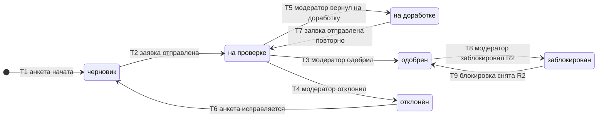

# SM-05. Профиль продавца

| Поле | Содержание |
| --- | --- |
| ID | SM-05 |
| Сущность | Профиль продавца ([раздел 6.1 требований](../02-requirements/requirements_v1.6.md)) |
| Релиз | R1. Переходы T8 и T9 (блокировка продавца) относятся к R2 |
| Владелец данных | Сервис «Подключение продавцов» |
| Статусы | черновик, на проверке, на доработке, одобрен, отклонён, заблокирован |
| Начальный статус | черновик |
| Конечные статусы | Нет: «одобрен» и «заблокирован» чередуются, «отклонён» возвращается в «черновик» (T6) |
| Процессы | [BPMN-02](BPMN-02-seller-onboarding.md) |
| Связанные модели | SM-04 Товар, SM-10 Заявка на вывод |
| Требования | FT-1.3, FT-2.0 … FT-2.4, FT-9.3, FT-11.1, FT-11.2, FT-11.4, NFT-3.0, NFT-6.1 |

## Сущность

Профиль продавца это анкета подключения: тип (ИП, самозанятый, юрлицо), наименование, реквизиты, ссылки на документы, описание ассортимента, причина решения и дата последнего отказа. Профиль принадлежит пользователю (UserID). Статус профиля определяет, может ли пользователь работать как продавец: до решения модератора роль «Продавец» не выдаётся (BG-05).

## Диаграмма

## Матрица переходов

| № | Из | В | Условие | Кто или что инициирует | Что происходит ещё | Источник |
| --- | --- | --- | --- | --- | --- | --- |
| T1 | (начало) | черновик | Пользователь начал заполнять анкету: тип, наименование, реквизиты, описание, документы | Пользователь | Профиль хранится, в очередь модератора не попадает | BPMN-02, FT-2.0 |
| T2 | черновик | на проверке | Заявка отправлена. Если профиль ранее был отклонён, прошло не менее 24 часов с отказа (параметр) | Пользователь | Документы сохраняются в S3-совместимом хранилище в РФ. Заявка встаёт в очередь модератора, начинается срок рассмотрения 3 суток. Если пауза не прошла, заявка не принимается, профиль остаётся «черновик», заявитель видит, когда можно подать | BPMN-02, BPMN-02 E5, FT-2.0, FT-2.1, FT-2.4, FT-11.1 |
| T3 | на проверке | одобрен | Модератор одобрил заявку | Модератор | Назначается роль «Продавец», требуется настроить 2FA. Решение в журнале аудита, заявителю письмо | BPMN-02, FT-2.1, FT-2.2, FT-1.3, FT-11.2 |
| T4 | на проверке | отклонён | Модератор отклонил заявку. Причина обязательна. Дата отказа записывается в профиль | Модератор | Роль не выдаётся. Заявителю письмо с причиной. Решение в журнале аудита | BPMN-02 E1, FT-2.1, FT-2.2, FT-11.2 |
| T5 | на проверке | на доработке | Модератор вернул заявку на доработку с комментарием | Модератор | Заявка выходит из очереди модератора. Заявителю письмо с комментарием. Срока на доработку нет | BPMN-02 E2, FT-2.1, FT-2.4 |
| T6 | отклонён | черновик | Заявитель начал исправлять анкету | Пользователь | История решений остаётся в журнале аудита, причина отказа остаётся в профиле до новой подачи | BPMN-02 E4, FT-2.4 |
| T7 | на доработке | на проверке | Заявитель доработал анкету и документы и отправил заявку повторно | Пользователь | Срок рассмотрения 3 суток отсчитывается заново | BPMN-02 E2, FT-2.1 |
| T8 | одобрен | заблокирован | R2. Модератор заблокировал продавца | Модератор | Товары продавца блокируются (SM-04/T9), заявки на вывод не принимаются, начисления и удержание продолжаются, открытые заказы и споры дорабатываются. Решение в журнале аудита | FT-2.3, FT-9.3, FT-11.2 |
| T9 | заблокирован | одобрен | R2. Модератор снял блокировку | Модератор | Товары возвращаются (SM-04/T10), вывод снова возможен | FT-2.3 |

Номера переходов используются в виде «SM-05/T3».

## Недопустимые переходы

| Из | В | Почему нельзя |
| --- | --- | --- |
| черновик | одобрен, отклонён, на доработке | Решение принимает модератор по отправленной заявке: без T2 заявки в очереди нет |
| на проверке | черновик | Заявку, которая находится у модератора, заявитель не забирает обратно. Для правок есть возврат на доработку (T5) |
| на проверке | одобрен, отклонён по таймеру | Просрочка срока не приводит к автоматическому решению: администратор получает оповещение, заявка остаётся в очереди (FT-2.1, BG-05) |
| на доработке | одобрен, отклонён | Решение возможно только по заявке, возвращённой в «на проверке» (T7) |
| на доработке | закрыта автоматически | Срок на доработку не ограничен, автоматического закрытия нет (FT-2.4) |
| отклонён | на проверке | Отправить исправленную анкету можно только через «черновик» (T6, T2), после паузы 24 часа (FT-2.4) |
| отклонён | одобрен | Отказ меняется только новой заявкой и новым решением |
| одобрен | черновик, на проверке, на доработке, отклонён | Одобренный профиль можно только заблокировать (T8). Отозвать одобрение по другой причине нельзя: такой функции в требованиях нет |
| на проверке, на доработке, отклонён, черновик | заблокирован | Блокировать можно только действующего продавца. Заявителя без одобрения достаточно не одобрить |
| заблокирован | любой, кроме «одобрен» | Блокировка снимается одним переходом (T9) |

## Что значит «заблокирован»

| Область | Правило | Источник |
| --- | --- | --- |
| Товары | Опубликованные и находящиеся на модерации товары блокируются, новые товары создавать и отправлять нельзя | FT-2.3, SM-04/T9 |
| Заказы и споры | Открытые заказы дорабатываются до выдачи, споры по заказам продавца решаются в обычном порядке, продавец может отвечать на споры | FT-2.3, FT-8.1 |
| Деньги | Начисления и удержание продолжаются, деньги копятся на балансе. Новые заявки на вывод не принимаются, уже созданные заявки обрабатываются в обычном порядке | FT-2.3, FT-9.3 |
| Вход и кабинет | Продавец входит в кабинет, видит заказы, споры и баланс, но не может создавать и менять товары и подавать заявки на вывод | FT-2.3 |
| Снятие | Модератор снимает блокировку одним действием, товары возвращаются в прежние статусы, вывод становится доступен | FT-2.3 |

## Срок рассмотрения и пауза после отказа

| Срок | Значение | Когда запускается | Источник |
| --- | --- | --- | --- |
| Рассмотрение заявки | Не более 3 суток, отсчёт с каждой подачи (T2, T7) | При постановке в очередь модератора | FT-2.1 |
| Просрочка рассмотрения | Оповещение администратора, метрика просрочки, статус не меняется | Через 3 суток | FT-2.1, NFT-6.1 |
| Пауза после отказа | 24 часа с отказа, параметр платформы (FT-11.1) | С перехода T4. Проверяется при T2 | FT-2.4 |
| Доработка заявителем | Срок не ограничен | С перехода T5 | FT-2.4 |

## Решения при моделировании

1. **Пауза проверяется при отправке, а не при исправлении.** Заявитель может сразу начать исправлять анкету (T6), но отправить её можно после паузы. Так он не теряет время на правки, а очередь модератора защищена от повторов.
2. **Одобренный профиль можно только заблокировать.** Других переходов из «одобрен» требования не дают. Это сознательное ограничение MVP.
3. **Блокировка действует только на одобренных.** Заявитель без одобрения продавцом ещё не является, ему достаточно отказа.
4. **Что может заблокированный продавец** определено из FT-2.3: открытые заказы и споры дорабатываются, поэтому вход и ответы на споры остаются, а создание и правка товаров и вывод закрыты.
5. **Роль и 2FA.** Назначение роли «Продавец» происходит в T3, настройка второго фактора при первом входе (FT-1.3, NFT-3.0). Признак 2FA хранится в учётной записи, а не в профиле, поэтому статуса «ожидает 2FA» у профиля нет.

## Связанные требования и процессы

- [BPMN-02. Подключение продавца](BPMN-02-seller-onboarding.md): основной путь, возврат на доработку, повторная заявка после отказа
- [SM-04. Товар](SM-04-product.md): блокировка товаров вместе с продавцом
- [Требования v1.6](../02-requirements/requirements_v1.6.md): разделы 3, 4.1, 4.2, 6.1
- [Видение](../01-vision/vision.md): цель BG-05
