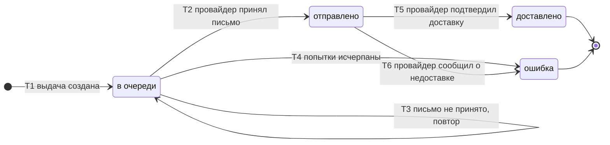

# SM-06. Выдача

| Поле | Содержание |
| --- | --- |
| ID | SM-06 |
| Сущность | Выдача ([раздел 6.1 требований](../02-requirements/requirements_v1.5.md)) |
| Релиз | R1. Выдача типа «повторная» по замене ключа относится к R2 |
| Владелец данных | Сервис «Выдача» |
| Статусы | в очереди, отправлено, доставлено, ошибка |
| Начальный статус | в очереди |
| Конечные статусы | доставлено, ошибка |
| Процессы | [BPMN-01](BPMN-01-purchase.md), [BPMN-04](BPMN-04-support-request.md), [BPMN-05](BPMN-05-dispute.md) |
| Связанные модели | SM-01 Заказ, SM-03 Ключ, SM-07 Обращение |
| Требования | FT-7.0, FT-7.1, FT-7.3, FT-7.5, FT-8.6, NFT-2.0, NFT-2.1, NFT-2.4, NFT-4.3, NFT-6.1, BG-01 |

## Сущность

Выдача это одна доставка ключей по заказу: письмо с ключом на адрес из снимка заказа. У выдачи есть тип («первичная» при оплате, «повторная» по обращению оператора или по замене ключа в споре), канал (в MVP только e-mail), адрес доставки (снимок), номер попытки и дата отправки. Один заказ может иметь несколько выдач.

Выдача отвечает на вопрос «где письмо», а не «что с покупкой»: покупка отражена статусом заказа (SM-01). Эти статусы нарочно разведены: заказ становится «выдан» при приёме письма провайдером («отправлено»), а цель BG-01 измеряется по «доставлено».

## Диаграмма

## Матрица переходов

| № | Из | В | Условие | Кто или что инициирует | Что происходит ещё | Источник |
| --- | --- | --- | --- | --- | --- | --- |
| T1 | (начало) | в очереди | Создана выдача. Первичная: заказ оплачен, ключи привязаны (SM-01/T4, T7). Повторная: оператор запросил повторную отправку (FT-7.5) или принято решение «замена ключа» (FT-8.6) | Система («Выдача» по событию «заказ оплачен»), Оператор поддержки, Система по решению модератора | У повторной выдачи в заказе обновляется снимок адреса (при повторной отправке по обращению). Письмо формируется, не более одной выдачи «в очереди» на заказ | BPMN-01, BPMN-04, BPMN-05, FT-7.0, FT-7.5, FT-8.6 |
| T2 | в очереди | отправлено | Провайдер принял письмо. Для 95% заказов не позднее 60 секунд после подтверждения оплаты | E-mail-провайдер | Если это первая принятая выдача заказа, заказ становится «выдан» (SM-01/T9). Номер попытки и дата отправки записываются | BPMN-01, FT-7.0, NFT-2.0 |
| T3 | в очереди | в очереди | Провайдер не принял письмо: сбой или отказ. Число попыток не исчерпано | Система («Выдача») | Номер попытки растёт, следующая попытка с нарастающей задержкой. Статус и состояние заказа не меняются | BPMN-01 E9, FT-7.3, NFT-4.3 |
| T4 | в очереди | ошибка | Попытки отправки исчерпаны | Система («Выдача») | Заказ в очередь поддержки (обращение «создано», SM-07/T1), оповещение администратора. Статус заказа остаётся «оплачен», если ни одна выдача не принята | BPMN-01 E9, FT-7.3, NFT-2.4 |
| T5 | отправлено | доставлено | Провайдер подтвердил доставку в почтовый ящик покупателя | E-mail-провайдер | Фиксируется время доставки (метрика BG-01). Открытое обращение по заказу становится «решено» (SM-07/T4) | BPMN-01, BPMN-04, FT-7.0, NFT-2.1, BG-01 |
| T6 | отправлено | ошибка | Провайдер сообщил, что письмо не доставлено: отказ или неверный адрес | E-mail-провайдер | Заказ в очередь поддержки, обращение «создано». Статус заказа остаётся «выдан». Оператор может повторить отправку или сменить e-mail | BPMN-01 E10, BPMN-04 E6, FT-7.3 |

Номера переходов используются в виде «SM-06/T2».

## Контроль 30 минут

Если с момента подтверждения оплаты (SM-01/T4 или T7) прошло 30 минут, а выдача не «доставлено», срабатывает контроль (E11 в BPMN-01, NFT-2.4):

| Что происходит | Что не происходит |
| --- | --- |
| Заказ попадает в очередь поддержки (обращение «создано»), администратор получает оповещение | Статус выдачи не меняется: она остаётся «в очереди» или «отправлено» |
| Если письмо потом всё же доставлено, выдача становится «доставлено» (T5), а обращение «решено» | Автоматического возврата денег нет: сначала поддержка |

Контроль это таймер, а не переход: статуса «просрочено» нет. Метрика BG-01 считает просрочкой любую первую выдачу, которая не стала «доставлено» за 30 минут.

## Недопустимые переходы

| Из | В | Почему нельзя |
| --- | --- | --- |
| в очереди | доставлено | Доставку подтверждает провайдер после приёма письма. Пропустить «отправлено» нельзя: статус «выдан» у заказа зависит от него |
| отправлено | в очереди | Принятое провайдером письмо не берётся обратно. Повторная отправка создаёт новую выдачу (T1) |
| отправлено | отправлено по повторному уведомлению | Повторное уведомление провайдера о том же статусе игнорируется, дублей нет (NFT-2.3) |
| доставлено | любой | Конечный статус |
| ошибка | любой | Конечный статус этой выдачи. Повтор после ошибки создаёт новую выдачу типа «повторная» (T1), а не «оживляет» старую |
| доставлено | ошибка | Подтверждённая доставка не отзывается. Если ключ потерян, покупатель обращается в поддержку и получает новую выдачу |

## Правила и ограничения

- **Одна выдача «в очереди» на заказ.** Пока есть выдача «в очереди», новую по тому же заказу создать нельзя, иначе письмо уйдёт дважды. Если выдача уже «отправлено», но подтверждения нет, оператор повторно отправить может.
- **Повторная отправка не сдвигает сроки.** Окна обращения, спора и удержание считаются с первого перехода заказа в «выдан», типа выдачи это не касается (раздел 4 требований, определение «выдан»).
- **Ключ оператору не показывается.** Оператор запускает повторную отправку, не видя ключа (FT-7.5). Письмо с ключом формирует сервис «Выдача».
- **Повторы.** Число попыток и задержки между ними параметры платформы и уточняются в Ф2 (бюджеты времени). Недоставленное сообщение после всех попыток уходит в очередь недоставленных сообщений (DLQ) и в поддержку.
- **Идемпотентность.** Повторное событие «заказ оплачен» не создаёт вторую первичную выдачу: по заказу ищется выдача типа «первичная» (FT-6.2, NFT-2.3).

## Решения при моделировании

1. **Каждая ручная повторная отправка это новая выдача.** Автоматические повторы внутри выдачи меняют только номер попытки, ручная отправка по обращению создаёт новую запись типа «повторная». Так история доставки по заказу хранится целиком, а старая «ошибка» остаётся видна.
2. **«Отправлено» после 30 минут остаётся «отправлено».** Контроль 30 минут не меняет статус выдачи, он создаёт обращение. Когда провайдер всё же подтвердит доставку, статус станет «доставлено».
3. **При ошибке повторы не меняют заказ.** Пока провайдер не принял письмо, заказ остаётся «оплачен», и это видно поддержке в очереди.
4. **«Доставлено» закрывает открытое обращение.** Шаг 8 в BPMN-04: подтверждение доставки переводит обращение в «решено». Это правило действует и для заказов, переданных системой по контролю 30 минут.

## Связанные требования и процессы

- [BPMN-01. Покупка](BPMN-01-purchase.md): первичная выдача, повторы, пути E9, E10, E11
- [BPMN-04. Обращение в поддержку](BPMN-04-support-request.md): повторная отправка, смена e-mail
- [BPMN-05. Спор](BPMN-05-dispute.md): повторная выдача нового ключа
- [SM-01. Заказ](SM-01-order.md), [SM-03. Ключ](SM-03-key.md): согласованность статусов
- [Требования v1.5](../02-requirements/requirements_v1.5.md): разделы 4.7, 5.2, 6.1
- [Видение](../01-vision/vision.md): цели BG-01 и BG-06
