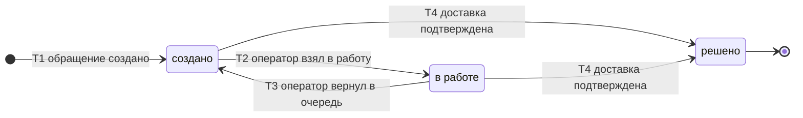

# SM-07. Обращение в поддержку

| Поле | Содержание |
| --- | --- |
| ID | SM-07 |
| Сущность | Обращение в поддержку ([раздел 6.1 требований](../02-requirements/requirements_v1.6.md)) |
| Релиз | R1 |
| Владелец данных | Сервис «Поддержка» |
| Статусы | создано, в работе, решено |
| Начальный статус | создано |
| Конечные статусы | решено |
| Процессы | [BPMN-04](BPMN-04-support-request.md), [BPMN-01](BPMN-01-purchase.md) |
| Связанные модели | SM-01 Заказ, SM-06 Выдача |
| Требования | FT-1.7, FT-7.2, FT-7.3, FT-7.5, FT-11.2, NFT-2.4, NFT-3.5, NFT-3.7, NFT-5.3, NFT-6.1 |

## Сущность

Обращение это задача поддержки по одному заказу: ключ не получен или не доставлен. У обращения есть источник, причина, оператор, действие оператора, результат проверки кода и даты. Обращения двух источников попадают в одну очередь поддержки и обрабатываются одинаково:

- **покупатель** нажал «Не получил ключ» в карточке заказа в течение 72 часов после первичной выдачи (FT-7.2);
- **система** передала заказ автоматически: недоставка, исчерпание попыток отправки или 30 минут без доставки (FT-7.3, NFT-2.4). Окно 72 часа в этом случае не проверяется.

Источник хранится в обращении как отдельный атрибут: по нему видно, применялось ли окно 72 часа. Он добавляется в доменную модель.

## Диаграмма

## Матрица переходов

| № | Из | В | Условие | Кто или что инициирует | Что происходит ещё | Источник |
| --- | --- | --- | --- | --- | --- | --- |
| T1 | (начало) | создано | Источник «покупатель»: заказ «выдан», с первичной выдачи прошло не более 72 часов, по заказу нет открытого обращения. Источник «система»: выдача «ошибка» (SM-06/T4, T6) или 30 минут без доставки | Покупатель или Система | Обращение встаёт в очередь поддержки. Если по заказу уже есть открытое обращение, новое не создаётся: данные добавляются в имеющееся. Для обращения покупателя действует ограничение частоты (NFT-3.5) | BPMN-04, BPMN-01 E9, E10, E11, FT-7.2, FT-7.3, NFT-2.4 |
| T2 | создано | в работе | Оператор взял обращение. В обращении записывается OperatorID | Оператор поддержки | Оператор видит заказ, статусы выдачи и результат проверки кодов, ключ ему не показывается | BPMN-04, FT-7.5 |
| T3 | в работе | создано | Оператор вернул обращение в очередь, например по окончании смены. OperatorID сбрасывается | Оператор поддержки | Обращение снова доступно всем операторам, дата создания не меняется | BPMN-04 |
| T4 | создано, в работе | решено | После создания обращения по заказу получена выдача «доставлено» (SM-06/T5): повторная отправка по обращению или первоначальное письмо, которое всё же дошло | Система («Поддержка» по событию «выдача доставлена») | Покупатель получает письмо с ключом (если отправка повторная). Обращение уходит из очереди | BPMN-04, FT-7.3, FT-7.5 |

Номера переходов используются в виде «SM-07/T2».

## Что делает оператор в статусе «в работе»

Действия оператора не меняют статус обращения, они записываются в обращение и в журнал аудита. Других действий в R1 нет (FT-7.5).

| Действие | Что происходит | Что видит оператор | Журнал аудита |
| --- | --- | --- | --- |
| Повторная отправка | Снимок адреса в заказе обновляется, создаётся выдача «повторная» (SM-06/T1), письмо уходит провайдеру | Статус выдачи, ключа не видит | Действие, обращение, объект, время (FT-11.2) |
| Смена e-mail | Покупатель сам вводит код из SMS на подтверждённый телефон и код из письма на новый адрес. Только после обоих подтверждений e-mail учётной записи меняется, затем идёт повторная отправка на новый адрес | Результат проверки каждого кода («пройдена» или «не пройдена»), кода не видит | Имя поля и HMAC-хеши значений до и после, без e-mail в открытом виде (NFT-5.3) |

Если проверка кода не пройдена, обращение остаётся «в работе», адрес не меняется (E4 и E5 в BPMN-04). Если новый адрес уже принадлежит другой учётной записи, код на него не отправляется, адрес не меняется, оба участника видят нейтральное сообщение «Адрес использовать нельзя» (E7 в BPMN-04). Оператор может повторить попытку: коды одноразовые, действуют 5 минут, попыток ввода 5 (NFT-3.7), запросы кодов ограничены (NFT-3.5).

## Недопустимые переходы

| Из | В | Почему нельзя |
| --- | --- | --- |
| создано | решено оператором без доставки | В MVP обращение закрывается только фактом доставки (T4). Ручного закрытия нет: у оператора два действия, и оба ведут к новой выдаче |
| в работе | решено оператором без доставки | То же правило |
| решено | создано, в работе | Решённое обращение не открывается заново. Если ключ снова не получен, покупатель создаёт новое обращение, пока открыто окно 72 часа (T1) |
| (начало) | создано, если заказ не «выдан» | Кнопка «Не получил ключ» доступна только для заказов в статусе «выдан». Пока заказ «оплачен», выдачу ведёт и контролирует система (BPMN-01). Если выдача уже «ошибка» или прошло 30 минут, обращение создаёт система |
| (начало) | создано, если прошло больше 72 часов (источник «покупатель») | Окно обращения закрыто, обращение не создаётся (E1 в BPMN-04). Автоматическая передача системой окном не ограничена |
| (начало) | второе открытое обращение по тому же заказу | По заказу не более одного обращения в статусах «создано» и «в работе»: данные добавляются в имеющееся |

## Сроки

| Срок | Значение | Источник |
| --- | --- | --- |
| Окно создания обращения покупателем | 72 часа после первичного перехода заказа в «выдан», параметр платформы. Повторная отправка срок не сдвигает. Проверяется только при T1 | FT-7.2 |
| Автоматическая передача | Через 30 минут после оплаты, если выдача не «доставлено», оповещение администратора | FT-7.3, NFT-2.4 |
| Срок жизни одноразового кода | 5 минут, 5 попыток | NFT-3.7 |
| Предельный срок заказа без обработки | Не более 1 часа: оплаченный заказ без выдачи и без возврата попадает в очередь поддержки уже с 30-й минуты | NFT-2.4, BG-06 |

Срока обработки обращения оператором в требованиях нет. Состояние очереди контролируется метрикой «число заказов в очереди поддержки» (NFT-6.1).

## Решения при моделировании

1. **Одно открытое обращение на заказ.** Иначе покупатель, нажимающий кнопку несколько раз, и система, передающая заказ по таймеру, создавали бы дубли в очереди.
2. **Закрывает обращение доставка, а не оператор.** Это соответствует BPMN-04, шаг 8: подтверждение доставки переводит обращение в «решено». У оператора нет действия «закрыть без отправки», потому что такое закрытие оставило бы покупателя без ключа и без следа в очереди (BG-06).
3. **Возврат в очередь (T3).** Без него обращение «в работе» привязано к оператору, который ушёл. Переход не меняет данных обращения кроме OperatorID.
4. **Граница MVP: недоставляемый заказ.** Если ключ невозможно доставить даже после поддержки (проверка кода не пройдена, у покупателя нет доступа ни к почте, ни к телефону), обращение остаётся открытым, оператор действий возврата не имеет. Автоматический возврат есть только при поздней оплате (FT-6.4), возврат по спору только для заказа «выдан» (FT-8.0). Случай с утраченными e-mail и телефоном заявлен как не поддерживаемый в MVP (раздел 1.3). Зависшие обращения видны администратору в очереди и в метрике (NFT-6.1).

## Связанные требования и процессы

- [BPMN-04. Обращение в поддержку](BPMN-04-support-request.md): создание, оператор, коды, повторная отправка
- [BPMN-01. Покупка](BPMN-01-purchase.md): заказы, переданные системой (E9, E10, E11)
- [SM-01. Заказ](SM-01-order.md), [SM-06. Выдача](SM-06-delivery.md): согласованность статусов
- [Требования v1.6](../02-requirements/requirements_v1.6.md): разделы 4.7, 5.2, 5.3, 6.1
