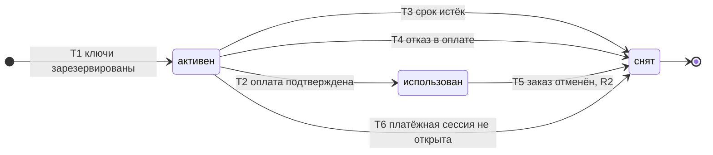

# SM-08. Резерв

| Поле | Содержание |
| --- | --- |
| ID | SM-08 |
| Сущность | Резерв ([раздел 6.1 требований](../02-requirements/requirements_v1.6.md), добавлена в версии 1.5) |
| Релиз | R1. Переход T5 (выдача по API) относится к R2 |
| Владелец данных | Сервис «Остатки и ключи» |
| Статусы | активен, использован, снят |
| Начальный статус | активен |
| Конечные статусы | снят. «Использован» конечный для товара с пулом |
| Процессы | [BPMN-01](BPMN-01-purchase.md) |
| Связанные модели | SM-01 Заказ, SM-02 Платёж, SM-03 Ключ |
| Требования | FT-4.3, FT-5.2, FT-6.3, FT-6.5, FT-7.1, FT-7.4, NFT-2.2, NFT-2.3, NFT-4.3 |

## Сущность

Резерв это временное закрепление ключей за заказом на время оплаты, чтобы их не получил другой покупатель. По умолчанию резерв живёт 15 минут (параметр платформы), платёжная сессия 12 минут и всегда короче: запас в 3 минуты покрывает задержку уведомления шлюза (FT-5.2). В резерве хранятся заказ, товар, количество, срок резерва и причина снятия.

Резерв вынесен в отдельную сущность, потому что у него свой жизненный цикл, не совпадающий с заказом: резерв заканчивается раньше заказа, а поздняя оплата создаёт новый резерв для того же заказа. Источник истины по резерву находится в PostgreSQL, Redis с временем жизни записи только запускает снятие (раздел 8.2 требований).

## Диаграмма

## Матрица переходов

| № | Из | В | Условие | Кто или что инициирует | Что происходит ещё | Источник |
| --- | --- | --- | --- | --- | --- | --- |
| T1 | (начало) | активен | Для заказа найдено достаточно свободных ключей (весь заказанный объём) либо остаток товара с выдачей по API не меньше количества. Срок резерва: сейчас плюс 15 минут. Для поздней оплаты тот же переход выполняется при повторном резервировании | Система («Остатки и ключи» по запросу «Заказов») | Ключи «зарезервированы» (SM-03/T2), остаток уменьшается. Запускается таймер в Redis | BPMN-01, FT-5.2, FT-6.5, FT-7.1 |
| T2 | активен | использован | Подтверждение платежа получено, пока резерв активен. Для поздней оплаты резерв создаётся и сразу переходит в «использован» в одной транзакции | Система («Остатки и ключи» по запросу «подтвердить резерв» от «Заказов» после подтверждения платежа) | Ключи «выданы» (SM-03/T4), создаётся выдача (SM-06/T1) | BPMN-01, FT-6.2, FT-6.5 |
| T3 | активен | снят | Срок резерва истёк. Причина: «срок истёк» | Система: таймер в Redis, а при его потере сверяющая задача, которая находит просроченные активные резервы | Ключи «свободны» (SM-03/T3), остаток растёт, заказ «отменён» (SM-01/T6) | BPMN-01 E4, FT-5.2, FT-6.3 |
| T4 | активен | снят | Шлюз отклонил платёж. Причина: «отказ в оплате». Резерв снимается сразу, не дожидаясь срока | Система («Платежи» → «Заказы» → «Остатки и ключи») | Ключи «свободны», заказ «отменён» (SM-01/T5) | BPMN-01 E3, FT-6.3 |
| T5 | использован | снят | R2. Только для товара с выдачей по API: продавец не ответил за 10 минут или вернул ошибку. Причина: «заказ отменён» | Система («Выдача» → «Остатки и ключи») | Остаток товара восстанавливается, заказ «отменён» (SM-01/T10), затем автовозврат | FT-7.4, FT-4.3 |
| T6 | активен | снят | Шлюз недоступен или не ответил на запрос открыть платёжную сессию после повторных попыток. Причина: «заказ отменён» | Система («Платежи» → «Заказы» → «Остатки и ключи») | Ключи «свободны» (SM-03/T3), остаток растёт, заказ «отменён» (SM-01/T12). Платёж не создаётся | BPMN-01 E12, FT-5.2, NFT-4.3 |

Номера переходов используются в виде «SM-08/T3».

## Недопустимые переходы

| Из | В | Почему нельзя |
| --- | --- | --- |
| снят | активен, использован | Снятый резерв не оживает. Ключи после снятия свободны и могли уйти другому заказу. Поздняя оплата создаёт новый резерв (новая запись), а не восстанавливает старый |
| использован | активен | Использованный резерв означает, что ключи привязаны к оплаченному заказу |
| использован | снят (товар с пулом) | Выданные ключи не возвращаются в оборот (FT-7.1, NFT-2.2). Переход T5 допустим только для товара с выдачей по API, где ключа в пуле нет |
| активен | активен с новым сроком | Продления резерва в MVP нет: платёжная сессия 12 минут короче резерва, покупатель успевает оплатить, а при неуспехе оформляет новый заказ |
| активен | использован без оплаты | Резерв используется только по подтверждённому платежу |
| (начало) | активен при нехватке ключей | Частичного резерва нет: если ключей меньше, чем заказано, резерв не создаётся, заказ «отменён» (SM-01/T3) |

## Гонки и повторы

- **Оплата и истечение срока одновременно.** Резерв меняет статус условным обновлением в PostgreSQL: «сделать использованным, если сейчас активен». Побеждает тот, кто первым выполнил обновление. Если резерв уже снят, подтверждение платежа обрабатывается как поздняя оплата (SM-01/T7 или T8).
- **Потеря таймера Redis.** Сверяющая задача периодически ищет активные резервы с истёкшим сроком и снимает их (T3). Потеря таймера не оставляет ключи замороженными навсегда.
- **Повторный запрос.** Повторный запрос «подтвердить резерв» не создаёт второй резерв и не меняет статус: резерв заказа уже «использован», сервис возвращает прежний результат (FT-6.2, NFT-2.3).
- **Повторное снятие.** Повторный сигнал таймера или сверяющей задачи по уже снятому резерву игнорируется.

## Причины снятия

| Причина | Когда | Переход |
| --- | --- | --- |
| срок истёк | Покупатель не оплатил за 15 минут | T3 |
| отказ в оплате | Шлюз отклонил платёж | T4 |
| заказ отменён | Платёжная сессия не открыта (R1, T6). Тайм-аут API продавца у оплаченного заказа (R2, T5) | T5, T6 |

## Решения при моделировании

1. **Резерв это сущность, а не флаг ключа.** В требованиях v1.4 в разделе 6.1 её не было, хотя статусы резерва требовались FT-5.2, FT-6.3 и FT-6.5. В версии 1.5 сущность добавлена, SM-08 описывает её жизненный цикл.
2. **Причина «заказ отменён» нужна уже в R1.** Резерв снимается по сроку (T3), по отказу в оплате (T4) и по откату заказа, когда шлюз не открыл платёжную сессию (T6, сага с компенсациями). В R2 к ним добавляется отмена оплаченного заказа с выдачей по API по тайм-ауту (T5): остаток возвращается в продажу.
3. **Поздняя оплата создаёт новый резерв.** Он проходит T1 и T2 в одной транзакции. Если ключей не хватило, запись резерва не создаётся (нет ничего, что можно «снять»), заказ возвращается целиком (SM-01/T8).
4. **Резерв товара с выдачей по API считает остаток.** Для такого товара резервирование выражается уменьшением остатка, заданного продавцом, и записью резерва. Ключей в пуле нет (SM-03).

## Связанные требования и процессы

- [BPMN-01. Покупка](BPMN-01-purchase.md): резерв 15 минут, платёжная сессия 12 минут, поздняя оплата
- [SM-01. Заказ](SM-01-order.md), [SM-02. Платёж](SM-02-payment.md), [SM-03. Ключ](SM-03-key.md): согласованность статусов
- [Требования v1.6](../02-requirements/requirements_v1.6.md): разделы 4.4, 4.5, 4.6, 6.1, 8.2
