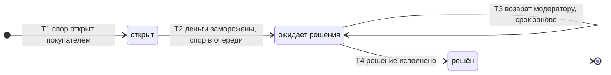

# SM-09. Спор

| Поле | Содержание |
| --- | --- |
| ID | SM-09 |
| Сущность | Спор ([раздел 6.1 требований](../02-requirements/requirements_v1.6.md)) |
| Релиз | R2 |
| Владелец данных | Сервис «Споры» |
| Статусы | открыт, ожидает решения, решён |
| Начальный статус | открыт |
| Конечные статусы | решён |
| Процессы | [BPMN-05](BPMN-05-dispute.md) |
| Связанные модели | SM-01 Заказ, SM-02 Платёж, SM-03 Ключ, SM-06 Выдача, SM-11 Операция по балансу |
| Требования | FT-8.0 … FT-8.6, FT-9.2, FT-9.5, FT-6.4, FT-7.4, FT-10.3, FT-11.0, FT-11.2, NFT-5.3, NFT-6.1 |

## Сущность

Спор это претензия покупателя по выданному заказу. Он хранит причину, ответ продавца, решение модератора (возврат, отказ в возврате, замена ключа), модератора и даты. Спор можно открыть в течение 72 часов после первичного перехода заказа в «выдан» (FT-8.0), по заказу один спор, в том числе после решения (FT-8.5).

Пока спор открыт, деньги по заказу заморожены и не становятся доступными к выводу (FT-8.3). Модератор принимает решение в течение 24 часов с открытия спора (FT-8.2). Продавец может ответить в любой момент, пока спор не решён, срока ответа нет, а без ответа модератор решает так же (FT-8.1).

## Диаграмма

## Матрица переходов

| № | Из | В | Условие | Кто или что инициирует | Что происходит ещё | Источник |
| --- | --- | --- | --- | --- | --- | --- |
| T1 | (начало) | открыт | Заказ «выдан», с первичной выдачи прошло не более 72 часов, по заказу ещё не было споров, причина указана | Покупатель | Продавец получает уведомление, при подключённом webhook ещё и webhook. Покупателю письмо «спор открыт». Если окно закрыто или спор по заказу уже был, спор не создаётся, покупатель видит причину | BPMN-05, BPMN-05 E1, FT-8.0, FT-8.1, FT-8.5, FT-10.3, FT-11.0 |
| T2 | открыт | ожидает решения | Деньги по заказу заморожены: операции баланса получают причину «спор» (SM-11). Спор попал в очередь модератора | Система («Споры» → «Баланс продавцов») | Срок решения 24 часа считается с открытия спора (момента T1) | BPMN-05, FT-8.2, FT-8.3 |
| T3 | ожидает решения | ожидает решения | Спор возвращён модератору: для замены ключа нет нового ключа (пул пуст, продавец с выдачей по API не ответил за 10 минут или вернул ошибку). Автоматического возврата нет | Система («Выдача» → «Споры») | Прежнее решение сбрасывается, срок 24 часа отсчитывается заново. Модератор принимает новое решение (например, возврат). Деньги остаются замороженными | BPMN-05 E2, FT-8.2, FT-8.6, FT-7.4 |
| T4 | ожидает решения | решён | Решение модератора исполнено. Возврат: шлюз подтвердил возврат либо администратор отметил ручной возврат выполненным. Замена: новый ключ выдан, прежний аннулирован. Отказ: заморозка по спору снята | Система, шлюз или Администратор (при ручном возврате) | Изменения у связанных сущностей зависят от решения, см. таблицу ниже. Участники получают уведомления: покупателю письмо, продавцу уведомление и webhook | BPMN-05, FT-8.2, FT-8.4, FT-8.6, FT-9.5, FT-10.3, FT-11.0 |

Номера переходов используются в виде «SM-09/T4».

## Решения и исполнение

Решение модератора не меняет статус спора, оно записывается в спор и в журнал аудита без персональных данных в открытом виде (FT-11.2, NFT-5.3). Статус «решён» наступает, когда решение исполнено.

| Решение | Что исполняется | Заказ (SM-01) | Платёж (SM-02) | Ключ и выдача | Деньги продавца (SM-11) |
| --- | --- | --- | --- | --- | --- |
| Возврат | Запрос возврата у шлюза, при исчерпании попыток ручной возврат через очередь администратора. Возврат всегда полный | «выдан» → «возвращён» (T11) | «подтверждён» → «возвращён» (T4) | Ключ остаётся «выдан», в оборот не возвращается | Начисление и комиссия «сторнирована» целиком, комиссия не взимается (FT-9.5) |
| Замена ключа | Новый ключ из пула или запросом к API продавца, прежний аннулируется, письмо с новым ключом | Остаётся «выдан» | Не меняется | Прежний «выдан» → «аннулирован» (SM-03/T5). Новая выдача типа «повторная» (SM-06/T1). Сроки окон не сдвигаются | «Спор» → «удержание», либо «доступна», если 7 дней уже прошли |
| Отказ в возврате | Заморозка по причине «спор» снимается | Остаётся «выдан» | Не меняется | Не меняются | «Спор» → «удержание», либо «доступна», если 7 дней уже прошли |

## Ответ продавца и сроки

| Что | Правило | Источник |
| --- | --- | --- |
| Ответ продавца | Продавец отвечает в любой момент, пока спор не «решён». Ответ сохраняется в споре и виден модератору. Статус не меняется. Если продавец не ответил, спор решается в обычный срок | FT-8.1 |
| Решение модератора | 24 часа с открытия спора (T1). При возврате модератору (T3) срок начинается заново. Срок прекращает идти в момент принятия решения: ожидание ручного возврата администратором в него не входит | FT-8.2 |
| Просрочка решения | Администратор получает оповещение, в метрику идёт просрочка. Статус не меняется, деньги заморожены, автоматического решения нет | FT-8.2, FT-8.3, NFT-6.1 |
| Ожидание нового ключа от API продавца | 10 минут на запрос | FT-8.6, FT-7.4 |

## Недопустимые переходы

| Из | В | Почему нельзя |
| --- | --- | --- |
| открыт | решён | Решение принимает модератор из очереди. Сначала заморозка денег и постановка в очередь (T2) |
| ожидает решения | открыт | Назад по статусам не идут. Возврат модератору (T3) остаётся в том же статусе |
| решён | любой | Конечный статус. Повторный спор по заказу не открывается (FT-8.5): покупатель обращается в поддержку (BPMN-04), пока открыто окно 72 часа |
| любой | закрыт покупателем или продавцом | Отзыва спора покупателем и закрытия продавцом в требованиях нет. Решение принимает только модератор |
| ожидает решения | решён по таймеру | Просрочка решения не закрывает спор автоматически: любое автоматическое решение отдавало бы деньги одной из сторон без проверки (FT-8.2) |
| (начало) | открыт для заказа не «выдан» | Спор возможен только по выданному заказу. Для оплаченного заказа без выдачи работает поддержка (SM-07) |
| (начало) | открыт после 72 часов | Окно спора закрыто (E1 в BPMN-05) |

## Решения при моделировании

1. **«Открыт» это короткое промежуточное состояние.** Между созданием спора и заморозкой денег. В нём спор не виден модератору, чтобы он не принимал решение по ещё не замороженным деньгам. Статус нужен как точка, в которой видно, что заморозка не удалась и её надо повторить.
2. **Срок 24 часа считается с T1 и прекращается при решении.** Так срок не «сгорает» из-за ручного возврата, который зависит от администратора и шлюза.
3. **Повторный спор запрещён даже после решения.** Если замена ключа не помогла, покупатель обращается в поддержку в окне 72 часа (BPMN-05, решение 4).
4. **Решение хранится атрибутом, а не статусом.** У спора три статуса из требований. Состояния «решение принято, возврат ещё не исполнен» хранятся парой «решение и признак исполнения».
5. **Возврат заказа полный** (FT-8.4): частичных возвратов нет, поэтому у спора нет суммы возврата, она равна сумме платежа.

## Связанные требования и процессы

- [BPMN-05. Спор](BPMN-05-dispute.md): открытие, ответ продавца, решение, исполнение
- [SM-01. Заказ](SM-01-order.md), [SM-02. Платёж](SM-02-payment.md), [SM-03. Ключ](SM-03-key.md), [SM-06. Выдача](SM-06-delivery.md): связанные статусы
- [Требования v1.6](../02-requirements/requirements_v1.6.md): раздел 4.8, 4.9, 6.1
