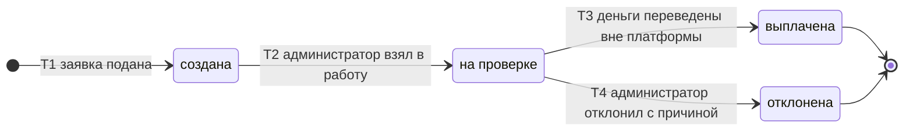

# SM-10. Заявка на вывод

| Поле | Содержание |
| --- | --- |
| ID | SM-10 |
| Сущность | Заявка на вывод ([раздел 6.1 требований](../02-requirements/requirements_v1.6.md)) |
| Релиз | R2 |
| Владелец данных | Сервис «Баланс продавцов» |
| Статусы | создана, на проверке, выплачена, отклонена |
| Начальный статус | создана |
| Конечные статусы | выплачена, отклонена |
| Процессы | [BPMN-06](BPMN-06-withdrawal.md) |
| Связанные модели | SM-11 Операция по балансу, SM-05 Профиль продавца |
| Требования | FT-2.3, FT-9.3, FT-9.4, FT-11.1, FT-11.2, FT-11.4, NFT-5.3, NFT-6.1 |

## Сущность

Заявка на вывод это просьба продавца перевести ему доступные деньги. Платформа деньги не переводит: администратор переводит их вручную вне платформы по реквизитам из заявки и отмечает заявку выплаченной (FT-9.3, граница с банком в разделе 1.3 требований). В заявке хранятся сумма, снимок реквизитов на момент подачи, администратор, причина отказа и даты.

Заявка и операция «вывод» в балансе живут парой: статус заявки определяет статус операции (SM-11), поэтому деньги нельзя запросить дважды.

## Диаграмма

## Матрица переходов

| № | Из | В | Условие | Кто или что инициирует | Что происходит ещё | Источник |
| --- | --- | --- | --- | --- | --- | --- |
| T1 | (начало) | создана | Сумма не меньше минимальной (1 000 ₽, параметр) и не больше доступного остатка, продавец не заблокирован. Реквизиты берутся из профиля | Продавец | Реквизиты сохраняются в заявке снимком. Сумма резервируется: создаётся операция «вывод» «заморожена» с причиной «резерв под вывод» (SM-11/T7). Запись в журнал баланса. Заявка встаёт в очередь администратора, начинается срок обработки 3 суток. Если условия не выполнены, заявка не создаётся, продавец видит причину на форме | BPMN-06, BPMN-06 E1, E2, FT-9.3, FT-2.3, FT-9.4, FT-11.1 |
| T2 | создана | на проверке | Администратор взял заявку в работу | Администратор | Администратор проверяет реквизиты и заявку. Срок обработки продолжает идти | BPMN-06, FT-9.3 |
| T3 | на проверке | выплачена | Администратор перевёл деньги продавцу вне платформы, банк принял перевод, администратор отметил заявку выплаченной | Администратор | Операция «вывод» → «выплачена» (SM-11/T8). Запись в журнал баланса и в журнал аудита без персональных данных в открытом виде. Продавец видит статус в кабинете и получает письмо | BPMN-06, FT-9.3, FT-9.4, FT-11.2, FT-11.4, NFT-5.3 |
| T4 | на проверке | отклонена | Администратор отклонил заявку. Причина обязательна: неверные реквизиты, перевод не принят банком или иная. Причина записывается в заявку | Администратор | Операция «вывод» → «сторнирована» (SM-11/T9), сумма снова доступна. Запись в журнал баланса и в журнал аудита. Продавец видит причину в кабинете и получает письмо, может подать новую заявку | BPMN-06 E3, E4, FT-9.3, FT-9.4, FT-11.2, FT-11.4 |

Номера переходов используются в виде «SM-10/T3».

## Недопустимые переходы

| Из | В | Почему нельзя |
| --- | --- | --- |
| создана | выплачена, отклонена | Решение принимается после проверки заявки и реквизитов, поэтому сначала «на проверке» (T2). Открытие заявки в кабинете администратора это и есть взятие в работу |
| на проверке | создана | Назад по статусам не идут. Заявка, которую взял один администратор, обрабатывается любым администратором: AdminID записывается при решении |
| выплачена | любой | Конечный статус. Выплата отменяется только новой заявкой и решением вне платформы: платформа денег назад не получает |
| отклонена | любой | Конечный статус. Новая подача это новая заявка с новой суммой и новым резервом |
| любой | изменена сумма или реквизиты | Заявка не редактируется после создания: реквизиты зафиксированы снимком, чтобы нельзя было подменить получателя между подачей и выплатой |
| создана, на проверке | отозвана продавцом | Отзыва заявки в требованиях нет. Продавец ждёт решения администратора до 3 суток |
| (начало) | создана для заблокированного продавца | Заявки заблокированного продавца не принимаются (FT-2.3). Созданные раньше заявки обрабатываются в обычном порядке |

## Сроки и параметры

| Срок или параметр | Значение | Источник |
| --- | --- | --- |
| Срок обработки | Не более 3 суток с создания заявки, параметр платформы. При просрочке администраторы получают оповещение, в метрику идёт просрочка. Статус не меняется, резерв сохраняется, автоматического решения нет | FT-9.3, FT-11.1, NFT-6.1 |
| Минимальная сумма | 1 000 ₽, параметр платформы | FT-9.3, FT-11.1 |
| Число заявок | Несколько открытых заявок допустимы, пока хватает доступного остатка | BPMN-06, решение 2 |

## Решения при моделировании

1. **Статус «на проверке» наступает, когда администратор взял заявку.** Это отдельный переход (T2), потому что очередь администратора должна отличать новые заявки от тех, которые уже кто-то обрабатывает. Взятие в работу не исключает того, что решение примет другой администратор.
2. **Перевод, не принятый банком, ведёт к отказу.** Администратор повторяет перевод внутри обработки. Если банк так и не принял перевод, заявка отклоняется с причиной «перевод не принят банком». Отдельного статуса «ошибка перевода» нет (T4).
3. **Заблокированный продавец.** Новая заявка не создаётся, существующие обрабатываются в обычном порядке. Деньги блокированного продавца копятся (SM-05).
4. **Снимок реквизитов неизменяем.** Это защита от подмены реквизитов между подачей и выплатой. Если реквизиты в профиле изменились, изменение действует для новых заявок.

## Связанные требования и процессы

- [BPMN-06. Вывод средств](BPMN-06-withdrawal.md): подача, проверка, ручная выплата, отказ
- [SM-11. Операция по балансу](SM-11-balance-operation.md): статус операции «вывод» и резерв
- [SM-05. Профиль продавца](SM-05-seller-profile.md): блокировка продавца
- [Требования v1.6](../02-requirements/requirements_v1.6.md): раздел 4.9, 6.1
