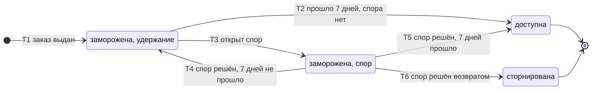
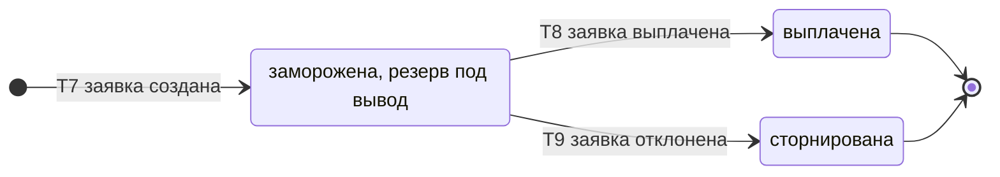

# SM-11. Операция по балансу

| Поле | Содержание |
| --- | --- |
| ID | SM-11 |
| Сущность | Операция по балансу ([раздел 6.1 требований](../02-requirements/requirements_v1.6.md)) |
| Релиз | R2 |
| Владелец данных | Сервис «Баланс продавцов» |
| Статусы | заморожена (причины: удержание, спор, резерв под вывод), доступна, выплачена, сторнирована |
| Начальный статус | заморожена |
| Конечные статусы | выплачена, сторнирована. «Доступна» конечная для начисления и комиссии |
| Процессы | [BPMN-06](BPMN-06-withdrawal.md), [BPMN-05](BPMN-05-dispute.md) |
| Связанные модели | SM-01 Заказ, SM-09 Спор, SM-10 Заявка на вывод |
| Требования | FT-8.3, FT-9.0, FT-9.2, FT-9.3, FT-9.4, FT-9.5, NFT-5.2, NFT-2.3 |

## Сущность

Операция по балансу это запись о движении денег продавца. Типов три:

| Тип | Знак суммы | Когда создаётся | Статусы, которые у неё бывают |
| --- | --- | --- | --- |
| начисление | плюс | Когда заказ впервые становится «выдан» (SM-01/T9): сумма заказа | заморожена, доступна, сторнирована |
| комиссия | минус | Одновременно с начислением: комиссия платформы с заказа (по умолчанию 2%, FT-9.0) | заморожена, доступна, сторнирована |
| вывод | минус | Когда продавец подаёт заявку на вывод (SM-10/T1): сумма заявки | заморожена, выплачена, сторнирована |

Начисление и комиссия по одному заказу всегда меняют статус вместе. Статус «выплачена» есть только у операции «вывод»: начисления остаются в балансе как источник, а выплата списывает деньги операцией «вывод».

**Неизменяемость.** Операции не удаляются и не правятся (FT-9.4, NFT-5.2). Каждое изменение статуса это новая запись в журнале баланса, исходные записи остаются. Ошибка исправляется встречной записью: сторнированием.

## Диаграммы

Начисление и комиссия:

Вывод:

## Матрица переходов

| № | Тип | Из | В | Условие | Кто или что инициирует | Что происходит ещё | Источник |
| --- | --- | --- | --- | --- | --- | --- | --- |
| T1 | начисление, комиссия | (начало) | заморожена, удержание | Заказ впервые «выдан». «Доступна с» равна дате первичной выдачи плюс 7 дней. Одна пара операций на заказ | Система («Баланс продавцов» по событию «заказ выдан») | Запись в журнал баланса. Начисление и комиссия создаются в одной транзакции | BPMN-06, FT-9.0, FT-9.2, FT-9.4 |
| T2 | начисление, комиссия | заморожена, удержание | доступна | Прошло 7 дней с первичной выдачи, по заказу нет открытого спора. Повторная отправка ключа срок не сдвигает | Система (таймер удержания) | Деньги входят в доступный остаток. Запись в журнал баланса | BPMN-06, FT-9.2, FT-8.3 |
| T3 | начисление, комиссия | заморожена, удержание | заморожена, спор | Открыт спор по заказу (SM-09/T2) | Система («Споры» → «Баланс продавцов») | Деньги недоступны к выводу, пока спор не решён | BPMN-05, FT-8.3 |
| T4 | начисление, комиссия | заморожена, спор | заморожена, удержание | Спор решён отказом или заменой ключа (SM-09/T4), «доступна с» ещё не наступила | Система | Деньги ждут конца удержания и становятся доступными по T2 | BPMN-05, FT-9.2 |
| T5 | начисление, комиссия | заморожена, спор | доступна | Спор решён отказом или заменой ключа, «доступна с» уже наступила | Система | Деньги входят в доступный остаток сразу | BPMN-05, FT-9.2 |
| T6 | начисление, комиссия | заморожена, спор | сторнирована | Спор решён возвратом, возврат подтверждён шлюзом или отмечен администратором (SM-09/T4, SM-01/T11). Начисление и комиссия сторнируются целиком | Система | Платформа не получает комиссию с возвращённого заказа, продавец не получает деньги. Встречные записи в журнале баланса | BPMN-05, FT-9.5, FT-9.4 |
| T7 | вывод | (начало) | заморожена, резерв под вывод | Заявка на вывод создана (SM-10/T1): сумма не меньше минимума и не больше доступного остатка | Система («Баланс продавцов» по заявке продавца) | Доступный остаток уменьшается на сумму заявки. Запись в журнал баланса | BPMN-06, FT-9.3, FT-9.4 |
| T8 | вывод | заморожена, резерв под вывод | выплачена | Администратор отметил заявку выплаченной (SM-10/T3) | Администратор | Запись в журнал баланса | BPMN-06, FT-9.3, FT-9.4 |
| T9 | вывод | заморожена, резерв под вывод | сторнирована | Заявка отклонена (SM-10/T4) | Администратор | Встречная запись в журнале баланса, сумма снова доступна | BPMN-06 E3, FT-9.3, FT-9.4 |

Номера переходов используются в виде «SM-11/T5».

## Доступный остаток

Доступный остаток продавца равен сумме операций «начисление» и «комиссия» в статусе «доступна» (комиссия входит со знаком минус) минус сумма операций «вывод» в статусах «заморожена» и «выплачена». Проверка при создании заявки выполняется внутри транзакции с блокировкой баланса продавца, поэтому два параллельных запроса не могут потратить одни и те же деньги. Заявки с суммой больше доступного остатка не создаются (E1 в BPMN-06).

Для остатка важно только состояние: сторнированные операции в расчёт не входят, заморозка по любой причине деньги из доступных исключает.

## Причины заморозки

| Причина | Когда возникает | Когда заканчивается |
| --- | --- | --- |
| удержание | При создании начисления и комиссии (T1), либо после спора, решённого отказом или заменой (T4) | Через 7 дней после первичной выдачи (T2) |
| спор | При открытии спора (T3) | При решении спора (T4, T5, T6) |
| резерв под вывод | При создании заявки на вывод (T7) | При выплате (T8) или отказе (T9) |

Если применимы удержание и спор, действует «спор»: он сильнее и заканчивается решением модератора.

## Недопустимые переходы

| Из | В | Почему нельзя |
| --- | --- | --- |
| заморожена, удержание | доступна до окончания срока | Удержание нельзя сократить: срок 7 дней (FT-9.2). Если срок изменят параметром, новое значение действует только для будущих начислений |
| заморожена, спор | доступна без решения спора | Деньги остаются недоступными, пока спор открыт, и при просрочке модератора тоже (FT-8.3, FT-8.2) |
| доступна | заморожена, сторнирована | Спор открывается, пока деньги заморожены: окно спора 72 часа и срок решения 24 часа короче удержания 7 дней, поэтому доступные деньги не оспариваются и не возвращаются |
| выплачена | любой | Выплата зафиксирована, деньги ушли вне платформы |
| сторнирована | любой | Сторнирование окончательно. Новое движение это новая операция |
| начисление, комиссия | выплачена | Деньги выплачиваются операцией «вывод», начисление остаётся историей |
| вывод | доступна | Операция «вывод» либо выплачивается, либо сторнируется. Деньги возвращаются в доступные сторнированием, а не изменением старой записи |
| любой | удалена или изменена | Журнал только на добавление (FT-9.4, NFT-5.2) |

## Решения при моделировании

1. **Комиссия это отдельная операция со знаком минус.** Начисление равно сумме заказа, комиссия равна доле платформы с него. Чистая выплата продавцу равна их сумме. Так при возврате обе записи сторнируются независимо и целиком (FT-9.5), а отчёты по комиссии (R3, FT-11.3) строятся прямо по операциям.
2. **Округление комиссии.** Комиссия считается в копейках и округляется математически (половина и больше вверх). Правило фиксируется здесь, потому что от него зависят сверки с отчётами.
3. **У заморозки всегда есть причина.** Статусов четыре, но «заморожена» без причины неоднозначна: после решения спора неясно, вернуть деньги в удержание или сделать доступными. Поэтому причина хранится атрибутом операции.
4. **Условие корректности параметров.** Окно спора плюс срок решения должны быть короче удержания, иначе спор мог бы открыться по уже доступным деньгам. Параметры сроков (FT-11.1) проверяются на это при сохранении. Значения по умолчанию (72 часа, 24 часа, 7 дней) условие выполняют.
5. **Блокировка продавца не меняет статусы операций.** Начисления и удержание продолжаются, новые заявки на вывод не принимаются (FT-2.3, SM-05).

## Связанные требования и процессы

- [BPMN-06. Вывод средств](BPMN-06-withdrawal.md): начисление, удержание, заявка, выплата, отказ
- [BPMN-05. Спор](BPMN-05-dispute.md): заморозка по спору, возврат, сторнирование
- [SM-10. Заявка на вывод](SM-10-withdrawal.md), [SM-09. Спор](SM-09-dispute.md), [SM-01. Заказ](SM-01-order.md): связанные статусы
- [Требования v1.6](../02-requirements/requirements_v1.6.md): раздел 4.9, 6.1, 8.2
