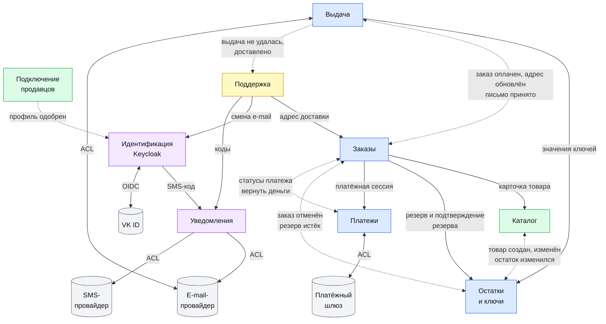
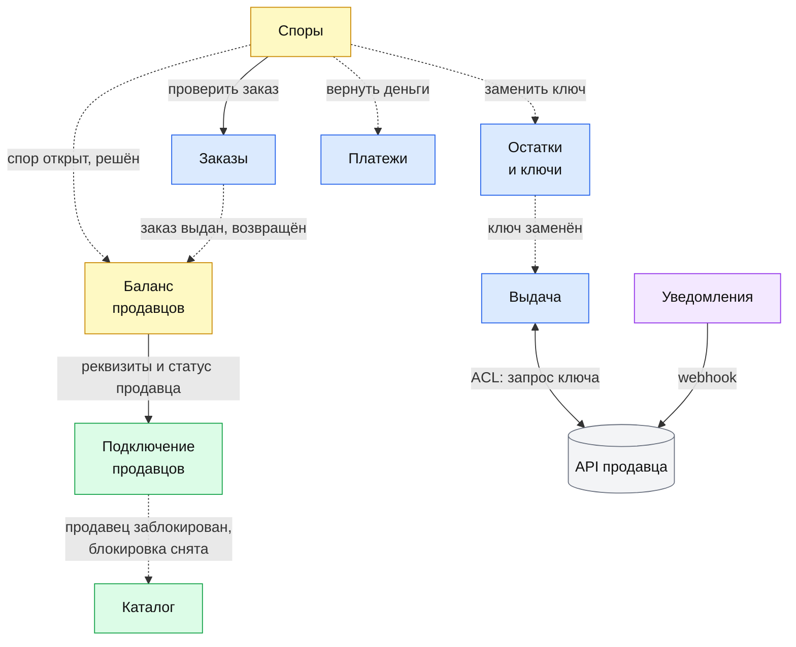
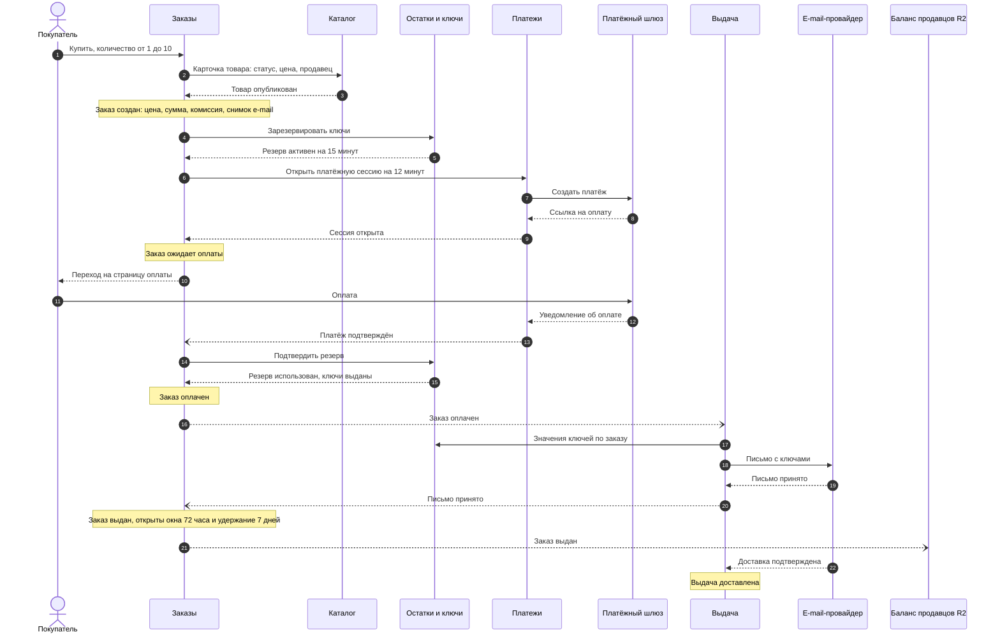

# Bounded contexts

| Поле | Содержание |
| --- | --- |
| Документ | Границы контекстов маркетплейса и отношения между ними |
| Источники | [Требования v1.5](../02-requirements/requirements_v1.5.md): раздел 8.1 (декомпозиция на сервисы), раздел 8.2 (ключевые решения). [Доменная модель](domain-model.md). Процессы BPMN-01 … BPMN-07, статусные модели SM-01 … SM-11 |
| Релиз | R1 полностью, контексты и связи R2 помечены |
| Связанные документы | [Доменная модель](domain-model.md), [Логическая ER-диаграмма](logical-er.md) |

## 1. Принципы границ

Bounded context это граница, внутри которой каждый термин имеет одно значение, а данные принадлежат одной команде и одной базе. Здесь контекст совпадает с сервисом из раздела 8.1 требований, а граница контекста становится границей микросервиса и отдельной схемы базы данных.

Правила, по которым проведены границы:

1. У каждой сущности один владелец. Только владелец меняет её, остальные просят об изменении командой или событием.
2. Контексты связаны только по идентификатору. Общих таблиц нет, чужие данные не читаются из чужой базы.
3. Синхронный вызов применяется там, где бизнес не может продолжить без ответа: резерв ключей, открытие платёжной сессии, карточка товара при оформлении, значения ключей для письма. Всё остальное идёт событиями через Kafka с публикацией через Outbox и идемпотентной обработкой у потребителя (FT-6.2, NFT-2.3).
4. Внешняя система не проникает в модель контекста. Между ними стоит «переводчик» (anti-corruption layer), который превращает чужие статусы и ошибки в статусы платформы.
5. В R1 допускается объединить часть сервисов в более крупные (раздел 8.1). Границы при этом сохраняются внутри кода, схемы данных остаются раздельными. Решение об объединении принимается в Ф2 отдельным ADR.

## 2. Карта контекстов

Карта показывает, кто от кого зависит и каким способом. Сплошная стрелка это синхронный вызов, она идёт от вызывающего к вызываемому. Пунктирная стрелка это события или команды через Kafka, она идёт от издателя к подписчику, двусторонняя означает события в обе стороны. ACL это «переводчик» для внешней системы. Подписи называют смысл связи, полный список событий каждого контекста дан в разделе 4. Цвета: синий это ядро покупки, зелёный предложение (продавцы и каталог), жёлтый сопровождение после покупки, фиолетовый платформенные сервисы, серый внешние системы.

### 2.1. Релиз R1

### 2.2. Что добавляет релиз R2

В R2 появляются «Споры» и «Баланс продавцов», выдача по API продавца и блокировка продавцов. Показаны только новые связи, связи R1 остаются.

На схемах не показаны две группы связей, чтобы они оставались читаемыми:

- **События аудита.** Каждый контекст публикует событие аудита для действий сотрудников и смены телефона и e-mail. «Аудит и администрирование» принимает их и пишет в журнал (INV-43).
- **Письма по событиям и параметры.** «Уведомления» подписаны на события заказов, подключения продавцов, каталога, споров и баланса и отправляют письма (FT-11.0, FT-11.4). «Аудит и администрирование» публикует событие «параметры изменены», на него подписаны потребители параметров: заказы, остатки и ключи, подключение продавцов, поддержка, споры, баланс, уведомления.

## 3. Сквозной путь покупки по контекстам

Диаграмма показывает успешный путь BPMN-01 по сервисам. Сплошная стрелка это вызов, пунктирная с закрашенным наконечником это ответ или уведомление внешней системы, пунктирная с открытым наконечником это событие через Kafka. Исключения (отказ, истечение резерва, поздняя оплата) используют те же связи, только в обратную сторону, их разбирают процессы BPMN-01 и use cases UC-01, UC-03, UC-05.

Уточнение Ф2 ([ADR-004](../05-architecture/adr/ADR-004-saga-purchase.md)): после подтверждения платежа «Заказы» не публикуют событие для «Остатков и ключей», а вызывают их синхронно («подтвердить резерв»). Иначе резерв мог бы истечь между оплатой и закреплением ключей, а перехода «оплачен» → «возвращён» в SM-01 нет. Событие «ключи заказа закреплены» не нужно: «Выдача» создаётся по событию «заказ оплачен», к этому моменту ключи уже закреплены.

## 4. Контексты

Для каждого контекста указаны ответственность, сущности, которыми он владеет, что он публикует и что принимает. События названы по смыслу, точные имена и схемы появятся в AsyncAPI в Ф2.

### 4.1. Идентификация

| Поле | Содержание |
| --- | --- |
| Ответственность | Регистрация, вход, 2FA, роли, подключение VK ID, подтверждение и смена номера телефона, смена e-mail по команде поддержки |
| Владеет | Пользователь |
| Публикует | «Пользователь зарегистрирован», «роль назначена», «e-mail изменён», «телефон подтверждён» и «телефон изменён», «пользователь деактивирован», события аудита |
| Принимает | Событие «профиль одобрен» (назначить роль «Продавец»). Команду «сменить e-mail» от «Поддержки» после проверки кодов. Параметры (лимиты запросов кодов) |
| Вызывает | «Уведомления»: отправить SMS-код |
| Внешние системы | VK ID через внешнего провайдера Keycloak (эмуляция в проекте) |
| Релиз | R1, смена номера телефона R2 |

### 4.2. Подключение продавцов

| Поле | Содержание |
| --- | --- |
| Ответственность | Заявки продавцов, документы в S3-совместимом хранилище в РФ, модерация заявок, блокировка продавцов (R2), выпуск и отзыв API-ключей (R2) |
| Владеет | Профиль продавца, API-ключ продавца |
| Публикует | «Профиль одобрен», «профиль отклонён», «профиль возвращён на доработку», «продавец заблокирован» и «блокировка снята» (R2), «API-ключ выпущен» и «API-ключ отозван» (R2), события аудита |
| Принимает | Решения модераторов через интерфейс. Параметры (пауза после отказа, срок рассмотрения) |
| Отдаёт синхронно | «Проверить API-ключ» для API Gateway (R2). «Реквизиты и статус продавца» для «Баланса продавцов» (R2) |
| Внешние системы | Хранилище документов (S3-совместимое, РФ) |
| Релиз | R1, блокировка и API-ключи R2 |

### 4.3. Каталог

| Поле | Содержание |
| --- | --- |
| Ответственность | Товары, модерация товаров, блокировка товаров, поиск и фильтры, витрина и карточка |
| Владеет | Товар |
| Публикует | «Товар создан», «товар изменён» (в том числе способ выдачи), «товар опубликован», «товар отклонён», «товар заблокирован», события аудита |
| Принимает | События «продавец заблокирован» и «блокировка снята» (R2): товары блокируются и возвращаются. «Остаток изменился» из «Остатков и ключей» для витрины. Параметры |
| Отдаёт синхронно | «Карточка товара» (статус, цена, продавец, способ выдачи) для «Заказов» при оформлении |
| Внешние системы | Нет. Поиск на полнотекстовом поиске PostgreSQL, кэш в Redis |
| Релиз | R1, блокировка продавца R2 |

### 4.4. Остатки и ключи

| Поле | Содержание |
| --- | --- |
| Ответственность | Пулы ключей, загрузка вручную и CSV, шифрование и защита от дублей, резервирование, остаток по API, аннулирование и замена ключа (R2) |
| Владеет | Ключ, Резерв, Остаток по API |
| Публикует | «Резерв истёк» (по таймеру и по сверке), «резерв снят», «остаток изменился», «ключ аннулирован» и «ключ заменён» (R2), события аудита |
| Принимает | Синхронные запросы от «Заказов»: «зарезервировать ключи» и «подтвердить резерв» (закрепить ключи за оплаченным заказом, а если резерв уже снят, попытаться зарезервировать заново). Событие «заказ отменён». Событие «товар создан, изменён» (копия идентификатора товара, продавца и способа выдачи для проверки прав при загрузке). Команду «заменить ключ» от «Споров» (R2) |
| Отдаёт синхронно | «Значения ключей по заказу» только «Выдаче», по mTLS, значения в логи не попадают (NFT-3.2) |
| Внешние системы | S3-совместимое хранилище (файлы с пулами), хранилище мастер-ключа шифрования вне базы данных |
| Релиз | R1, остаток по API и замена ключа R2 |

### 4.5. Заказы

| Поле | Содержание |
| --- | --- |
| Ответственность | Жизненный цикл заказа, оркестрация сценария покупки (сага с компенсациями), история заказов покупателя |
| Владеет | Заказ |
| Публикует | «Заказ создан», «заказ оплачен», «заказ отменён», «заказ выдан», «заказ возвращён», «адрес доставки обновлён», «вернуть деньги» (автовозврат), события аудита |
| Принимает | Оформление от покупателя. События «платёж подтверждён», «платёж отклонён», «платёж возвращён» от «Платежей». «Резерв истёк» от «Остатков и ключей». «Письмо принято» от «Выдачи». Команду «обновить адрес доставки» от «Поддержки». Параметры (время резерва, срок сессии, комиссия) |
| Вызывает синхронно | «Каталог» (карточка товара), «Остатки и ключи» (резерв и подтверждение резерва, в том числе при поздней оплате), «Платежи» (открыть сессию) |
| Внешние системы | Нет |
| Релиз | R1, переходы T10 и T11 R2 |

### 4.6. Платежи

| Поле | Содержание |
| --- | --- |
| Ответственность | Взаимодействие с платёжным шлюзом: платёж и сессия, уведомления шлюза, возвраты, идемпотентность, очередь ручных возвратов администратора |
| Владеет | Платёж |
| Публикует | «Платёж подтверждён», «платёж отклонён», «платёж возвращён», «возврат ждёт администратора», события аудита ручных возвратов |
| Принимает | Синхронный запрос «открыть платёжную сессию» от «Заказов». Команду «вернуть деньги» от «Заказов» и «Споров». Уведомления шлюза. Отметку администратора о ручном возврате |
| Внешние системы | Платёжный шлюз (эмуляция в проекте). Переводчик превращает ответы и ошибки шлюза в статусы платежа (SM-02) и не пускает внешнюю модель в платформу |
| Релиз | R1 |

### 4.7. Выдача

| Поле | Содержание |
| --- | --- |
| Ответственность | Письмо с ключом покупателю, повторы отправки, отслеживание статуса письма, контроль 30 минут, повторная выдача, запросы ключа у API продавца (R2) |
| Владеет | Выдача |
| Публикует | «Письмо принято» (заказ становится «выдан»), «выдача доставлена», «выдача не удалась» (попытки исчерпаны, провайдер сообщил о недоставке), «30 минут без доставки», «продавец не ответил» (R2) |
| Принимает | «Заказ оплачен» от «Заказов» (создать выдачу и запустить контроль 30 минут) и «ключ заменён» (R2) от «Остатков и ключей». «Адрес доставки обновлён» от «Заказов». Статусы письма от провайдера |
| Вызывает синхронно | «Остатки и ключи»: значения ключей заказа для письма |
| Внешние системы | E-mail-провайдер (эмуляция). API продавца (R2). Для обеих внешних систем свой переводчик |
| Релиз | R1, запросы к API продавца R2 |

### 4.8. Поддержка

| Поле | Содержание |
| --- | --- |
| Ответственность | Обращения покупателей и системы, очередь поддержки, повторная отправка ключа, смена e-mail по обращению с проверкой кодов. Упрощённая модель чтения очереди (CQRS) |
| Владеет | Обращение в поддержку |
| Публикует | «Обращение создано», «обращение решено» (метрики очереди), события аудита действий оператора |
| Принимает | «Выдача не удалась» и «30 минут без доставки» (создают обращение системы). «Выдача доставлена» (закрывает обращение). Параметры (окно 72 часа) |
| Вызывает синхронно | «Заказы»: обновить адрес доставки. «Идентификация»: сменить e-mail. «Уведомления»: отправить и проверить код |
| Внешние системы | Нет |
| Релиз | R1 |

### 4.9. Споры

| Поле | Содержание |
| --- | --- |
| Ответственность | Открытие спора покупателем, ответ продавца, решение модератора, исполнение решения: возврат, отказ, замена ключа |
| Владеет | Спор |
| Публикует | «Спор открыт», «спор решён» (с решением), «спор возвращён модератору», события аудита решений |
| Принимает | Результаты исполнения: «платёж возвращён», «ключ заменён» или «нового ключа нет». Параметры (окно спора, срок решения) |
| Вызывает | «Заказы»: проверить заказ и дату первичной выдачи (синхронно). «Платежи»: «вернуть деньги». «Остатки и ключи»: «заменить ключ» |
| Внешние системы | Нет |
| Релиз | R2 |

### 4.10. Баланс продавцов

| Поле | Содержание |
| --- | --- |
| Ответственность | Начисления и комиссия, удержание 7 дней, заморозка по спору, заявки на вывод, журнал баланса |
| Владеет | Операция по балансу (с записями журнала баланса), Заявка на вывод |
| Публикует | «Деньги доступны», «заявка на вывод создана», «заявка выплачена», «заявка отклонена», события аудита решений администратора |
| Принимает | «Заказ выдан» (начисление и комиссия), «заказ возвращён» (сторнирование), «спор открыт» и «спор решён» (заморозка и разморозка). Параметры (минимальная сумма, срок обработки) |
| Вызывает синхронно | «Подключение продавцов»: реквизиты и статус продавца при подаче заявки |
| Внешние системы | Банк вне платформы. Администратор переводит деньги вручную и отмечает заявку выплаченной, интеграции нет |
| Релиз | R2 |

### 4.11. Уведомления

| Поле | Содержание |
| --- | --- |
| Ответственность | Письма по событиям (FT-11.0, FT-11.4), SMS-коды, webhook продавцам (R2), повторные попытки и очередь недоставленных сообщений. Письма с ключами не проходят через этот контекст (решение 5) |
| Владеет | Служебные записи «Уведомление» и «Одноразовый код». Бизнес-сущностей нет |
| Публикует | «Письмо не доставлено» (метрика и оповещение) |
| Принимает | События заказов, подключения продавцов, каталога, споров и баланса. Команды «отправить код» и «проверить код» от «Идентификации» и «Поддержки». Параметры (лимиты запросов кодов) |
| Внешние системы | E-mail-провайдер, SMS-провайдер (эмуляция), webhook продавца (R2). Переводчик для каждого |
| Релиз | R1, webhook R2 |

### 4.12. Аудит и администрирование

| Поле | Содержание |
| --- | --- |
| Ответственность | Неизменяемый журнал аудита, параметры платформы, отчёты (R3) |
| Владеет | Параметры платформы, Журнал аудита |
| Публикует | «Параметры изменены» |
| Принимает | События аудита от всех контекстов |
| Внешние системы | Нет |
| Релиз | R1, отчёты R3 |

## 5. Отношения между контекстами

Таблица называет шаблон отношения (по терминам Domain-Driven Design) и объясняет выбор.

| Отношение | Шаблон | Комментарий |
| --- | --- | --- |
| «Платежи» и платёжный шлюз | Anti-corruption layer | Шлюз имеет свои статусы и ошибки. Переводчик приводит их к четырём статусам платежа и держит идемпотентность, поэтому смена шлюза не затрагивает остальные сервисы |
| «Выдача» и e-mail-провайдер, «Уведомления» и провайдеры | Anti-corruption layer | Статусы письма провайдера превращаются в статусы выдачи (SM-06). Адаптер один и подключается библиотекой в оба сервиса |
| «Выдача» и API продавца (R2) | Anti-corruption layer | Формат ответов продавца и его ошибки не попадают в модель выдачи, 10 минут ожидания ответа это правило платформы |
| «Идентификация» и VK ID | Conformist | Протокол и набор полей задаёт провайдер, платформа подстраивается через брокера Keycloak |
| Все сервисы и «Идентификация» | Conformist | Роли и признаки в токене (OAuth2, JWT) определяет Keycloak, сервисы их читают |
| «Заказы» и «Каталог», «Остатки и ключи», «Платежи» | Customer-Supplier | «Заказы» заказчик и задают требования к вызовам. Поставщики обязаны отвечать за время, которое укладывается в 1 секунду на создание заказа и резерв (NFT-1.2) |
| «Заказы» и «Выдача», «Баланс продавцов», «Поддержка» | Published Language | События с версионируемыми схемами (AsyncAPI). Потребитель не знает внутреннюю модель «Заказов» |
| Продавец и платформа (R2) | Open Host Service | API продавца предоставляется через API Gateway с контрактом OpenAPI и версиями. Платформа не подстраивается под каждого продавца |
| Все сервисы и «Аудит и администрирование» | Published Language | Единый формат события аудита без персональных данных в открытом виде (NFT-5.3) |

## 6. Особые случаи границ

Решения, которые нужно знать при чтении диаграмм и ER-модели.

1. **Роль «Продавец» назначает «Идентификация».** «Подключение продавцов» публикует «профиль одобрен», «Идентификация» выдаёт роль и включает требование настроить 2FA. Другой контекст пользователя не меняет.
2. **Остаток для выдачи по API принадлежит «Остаткам и ключам».** Каталог получает значение событием для витрины, но не меняет его.
3. **Адрес доставки при повторной отправке.** В BPMN-04 сказано, что снимок обновляет «сервис выдачи». В границах контекстов это делает владелец заказа: «Поддержка» командой просит «Заказы» обновить адрес из учётной записи, «Заказы» публикуют «адрес доставки обновлён», «Выдача» создаёт выдачу «повторная». Для пользователя поведение то же, процессы уточнены в BPMN-04, UC-04 и US-7.3.
4. **Поздняя оплата проходит через «Заказы».** «Платежи» сообщают о подтверждении платежа по отменённому заказу. «Заказы» просят «Остатки и ключи» зарезервировать ключи заново. Если ключей не хватает, «Заказы» публикуют «вернуть деньги», и «Платежи» запрашивают у шлюза полный возврат. Так оркестрация остаётся у владельца заказа, а «Платежи» не знают про ключи.
5. **Письмо с ключом идёт из «Выдачи» напрямую провайдеру.** Открытое значение ключа знает только «Выдача» и только в момент формирования письма. Через Kafka и «Уведомления» ключ не проходит (NFT-3.2).
6. **Одноразовые коды хранят «Уведомления».** Подтверждение телефона и вход по SMS в Keycloak требуют собственного расширения или модуля в «Уведомлениях» (раздел 8.2 требований). Выбор фиксируется в ADR в Ф2. Если победит расширение Keycloak, коды этого сценария будет хранить «Идентификация», остальные границы не меняются.
7. **Параметры раздаются событием.** Потребитель хранит копию значения, а «Заказы» при создании заказа фиксируют в нём действующие сроки и ставку комиссии.
8. **Решение об объединении сервисов откладывается.** Допустимые кандидаты для R1: «Подключение продавцов» с «Каталогом» и «Поддержка» с «Уведомлениями». Любое объединение сохраняет границы внутри кода и раздельные схемы данных.

## 7. Проверка границ

| Проверка | Результат |
| --- | --- |
| У каждой сущности один контекст-владелец | Выполнено: 16 сущностей распределены по 11 контекстам (таблица в разделе 2 доменной модели). «Уведомления» владеют только служебными записями |
| Два контекста не меняют одну сущность | Выполнено: места, где сущность меняет внешняя команда (роль «Продавец», адрес доставки, остаток по API), решены командой или событием владельцу (раздел 6) |
| Контексты связаны только по идентификатору | Выполнено: в ER-модели связи между контекстами это ссылки по ID, общих таблиц нет |
| Каждый сквозной сценарий имеет путь по событиям | Выполнено: покупка (раздел 3), поздняя оплата (раздел 6, пункт 4), выдача, поддержка, спор и вывод (раздел 4) |

## 8. Связанные документы

- [Доменная модель](domain-model.md): сущности, атрибуты, инварианты
- [Логическая ER-диаграмма](logical-er.md): связи и кратности
- [Требования v1.5](../02-requirements/requirements_v1.5.md): разделы 8.1 и 8.2
- [Процессы и статусные модели](../03-processes/README.md)
