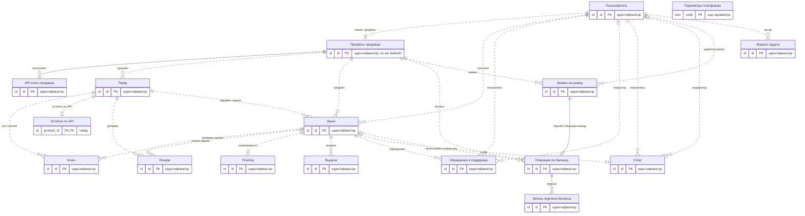
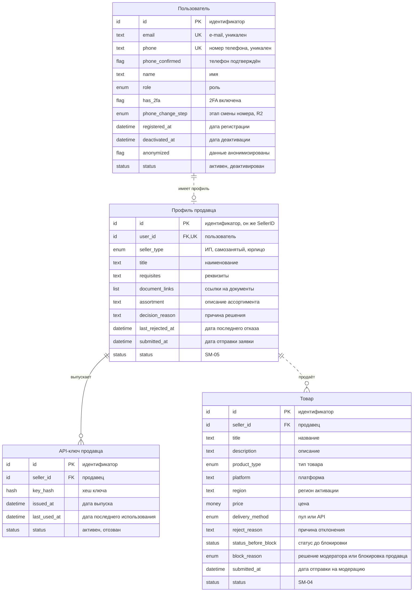
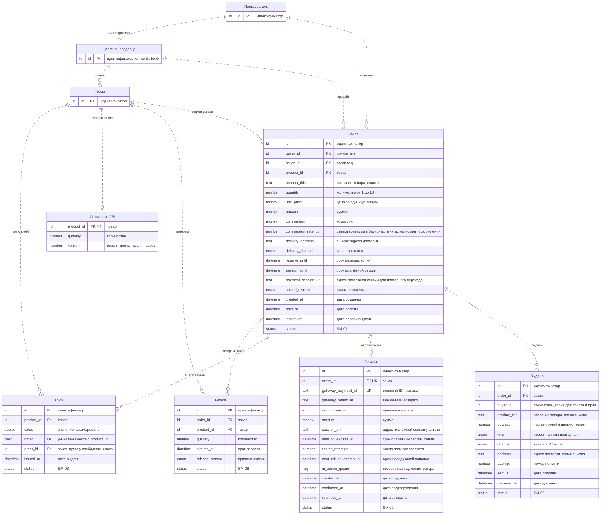
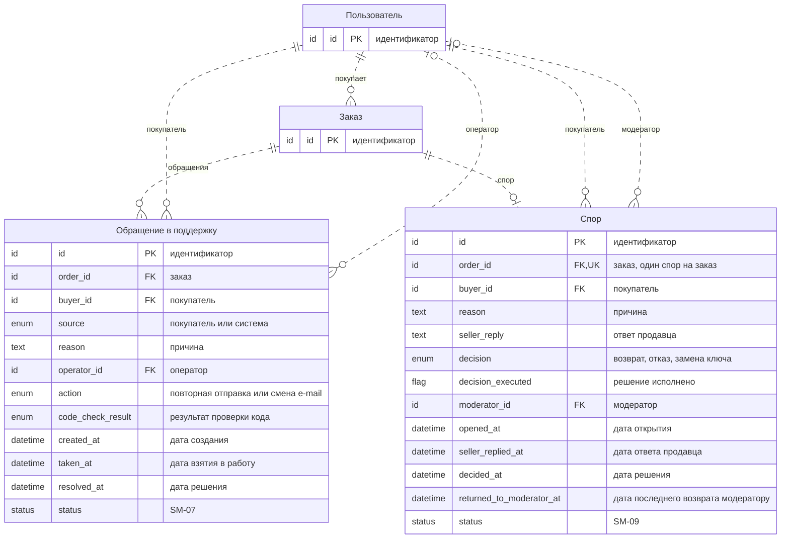
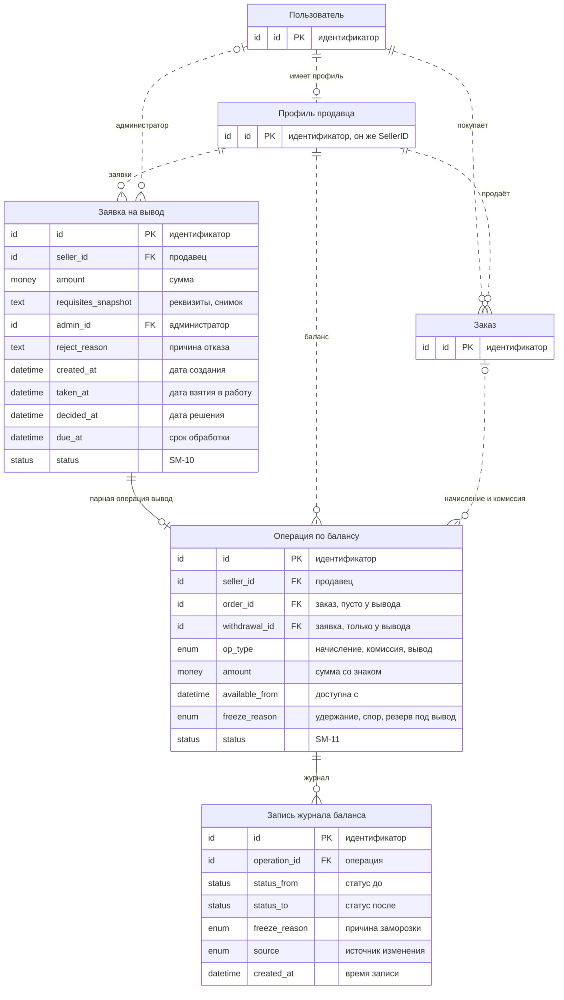
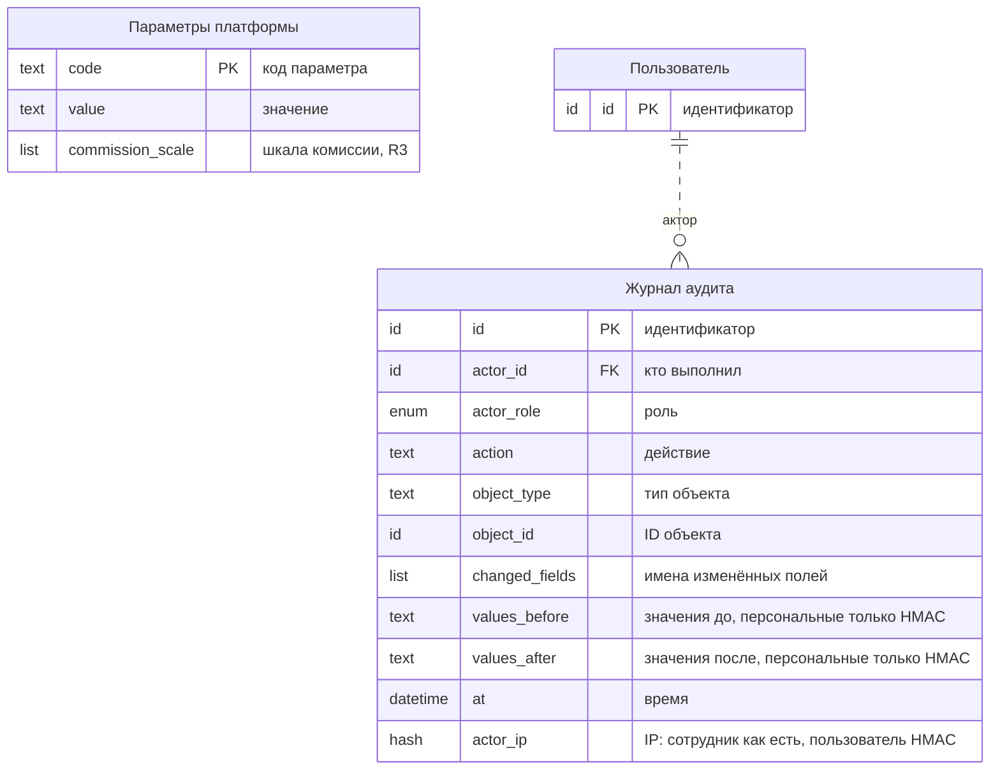

# Логическая ER-диаграмма

| Поле | Содержание |
| --- | --- |
| Документ | Логическая ER-диаграмма маркетплейса цифровых товаров |
| Источники | [Доменная модель](domain-model.md), раздел 6.1 [требований v1.5](../02-requirements/requirements_v1.5.md), статусные модели SM-01 … SM-11 |
| Релиз | R1 полностью, сущности R2 и R3 помечены в доменной модели |
| Связанные документы | [Bounded contexts](bounded-contexts.md), [Доменная модель](domain-model.md) |

## 1. Как читать диаграммы

Диаграммы показывают сущности, их ключевые атрибуты и связи с кратностью. Это логический уровень: типы данных, индексы и таблицы под реализацию сюда не входят, они появятся в Ф2 в `docs/07-data/`. Полный список атрибутов с правилами лежит в [доменной модели](domain-model.md), инварианты INV-NN там же.

Условные обозначения:

- **Имена атрибутов** написаны латиницей, чтобы в Ф2 они без переименования легли в физическую модель. Смысл по-русски дан в комментарии справа.
- **Ключи.** PK первичный ключ, FK ссылка на другую сущность по идентификатору, UK уникальное значение. Для FK, указывающих на сущность другого контекста, ограничение в базе не создаётся.
- **Сплошная линия** это связь внутри одного контекста. Здесь в базе может быть настоящий внешний ключ.
- **Пунктирная линия** это ссылка на сущность другого контекста только по ID. Внешнего ключа в базе нет, согласованность поддерживается событиями и проверками при вызове. Так выражено правило «между контекстами только по идентификатору».
- **Кратность** читается так: `||` ровно один, `|o` ноль или один, `o{` ноль или много. Например, «Заказ `|o` … `o{` Ключ» значит, что у ключа ноль или один заказ, а у заказа ноль или много ключей.
- **Статусы** хранятся одним атрибутом `status`. Допустимые значения и переходы описаны в статусных моделях, номер модели указан в комментарии.
- **Логические типы:** id идентификатор (UUID), text строка, number целое число, money сумма в копейках, flag признак да или нет, datetime дата и время, enum значение из списка, status статус из модели SM, hash хеш или HMAC, secret зашифрованное значение, list список значений.

## 2. Обзорная диаграмма

На обзорной диаграмме показаны все 17 сущностей только с первичным ключом и все связи. Подробные атрибуты находятся в разделе 3.

## 3. Подробные диаграммы по областям

Сущности разбиты на пять областей. Сущности другой области, на которые есть ссылки, показаны только ключевым полем.

### 3.1. Пользователи, продавцы и каталог

Полностью показаны: Пользователь, Профиль продавца, API-ключ продавца, Товар.

### 3.2. Ключи, заказ, оплата и выдача

Полностью показаны: Ключ, Резерв, Остаток по API, Заказ, Платёж, Выдача. Остальные сущности показаны только ключевым полем, чтобы была видна связь.

### 3.3. Поддержка и споры

Полностью показаны: Обращение в поддержку, Спор. Остальные сущности показаны только ключевым полем, чтобы была видна связь.

### 3.4. Деньги продавца

Полностью показаны: Операция по балансу, Запись журнала баланса, Заявка на вывод. Остальные сущности показаны только ключевым полем, чтобы была видна связь.

### 3.5. Параметры и аудит

Полностью показаны: Параметры платформы, Журнал аудита. Остальные сущности показаны только ключевым полем, чтобы была видна связь.

## 4. Сущности и владельцы данных

У каждой сущности ровно один контекст-владелец. Запись журнала баланса входит в агрегат «Операция по балансу».

| Имя на диаграмме | Сущность | Контекст-владелец |
| --- | --- | --- |
| USER | Пользователь | Идентификация |
| SELLER_PROFILE | Профиль продавца | Подключение продавцов |
| API_KEY | API-ключ продавца | Подключение продавцов |
| PRODUCT | Товар | Каталог |
| KEY | Ключ | Остатки и ключи |
| RESERVATION | Резерв | Остатки и ключи |
| API_STOCK | Остаток по API | Остатки и ключи |
| ORDER | Заказ | Заказы |
| PAYMENT | Платёж | Платежи |
| DELIVERY | Выдача | Выдача |
| TICKET | Обращение в поддержку | Поддержка |
| DISPUTE | Спор | Споры |
| BALANCE_OP | Операция по балансу | Баланс продавцов |
| BALANCE_LOG | Запись журнала баланса | Баланс продавцов |
| WITHDRAWAL | Заявка на вывод | Баланс продавцов |
| PLATFORM_PARAM | Параметры платформы | Аудит и администрирование |
| AUDIT | Журнал аудита | Аудит и администрирование |

## 5. Связи и кратности

| Связь | Подпись | Кратность | Тип | Правило |
| --- | --- | --- | --- | --- |
| Профиль продавца и API-ключ продавца | выпускает | 1 к 0..N | внутри контекста | Ключи выпускает и отзывает продавец в кабинете (FT-10.0) |
| Операция по балансу и Запись журнала баланса | журнал | 1 к 0..N | внутри контекста | Запись журнала на каждое изменение статуса, операция не правится (INV-28) |
| Заявка на вывод и Операция по балансу | парная операция вывод | 1 к 0..1 | внутри контекста | Заявка и операция «вывод» создаются и меняются вместе (INV-32) |
| Пользователь и Профиль продавца | имеет профиль | 1 к 0..1 | по ID между контекстами | Профиль один на пользователя, роль «Продавец» только при одобрении (INV-36, INV-39) |
| Профиль продавца и Товар | продаёт | 1 к 0..N | по ID между контекстами | Товар принадлежит одному продавцу |
| Товар и Ключ | пул ключей | 1 к 0..N | по ID между контекстами | Значения ключей уникальны в пределах товара (INV-03) |
| Товар и Остаток по API | остаток по API | 1 к 0..1 | по ID между контекстами | Только для товара со способом выдачи «API» (INV-08) |
| Товар и Резерв | резервы | 1 к 0..N | по ID между контекстами | Резерв закрепляет ключи или остаток товара |
| Пользователь и Заказ | покупает | 1 к 0..N | по ID между контекстами | Заказ создаёт только пользователь с подтверждённым телефоном (INV-35) |
| Профиль продавца и Заказ | продаёт | 1 к 0..N | по ID между контекстами | Заказ относится к одному продавцу (INV-11) |
| Товар и Заказ | предмет заказа | 1 к 0..N | по ID между контекстами | Заказ относится к одному товару (INV-11) |
| Заказ и Резерв | резервы заказа | 1 к 0..N | по ID между контекстами | За жизнь заказа резервов может быть несколько, активный не больше одного (INV-06) |
| Заказ и Ключ | ключи заказа | 0..1 к 0..N | по ID между контекстами | Ключ принадлежит не более чем одному заказу, у свободного ключа заказа нет (INV-01, INV-02) |
| Заказ и Платёж | оплачивается | 1 к 0..1 | по ID между контекстами | Один заказ оплачивается одним платежом (INV-11) |
| Заказ и Выдача | выдачи | 1 к 0..N | по ID между контекстами | Первичная выдача одна, повторных может быть несколько (INV-18) |
| Заказ и Обращение в поддержку | обращения | 1 к 0..N | по ID между контекстами | Открытое обращение по заказу не больше одного (INV-21) |
| Пользователь и Обращение в поддержку | покупатель | 1 к 0..N | по ID между контекстами | Обращение создано по заказу покупателя |
| Пользователь и Обращение в поддержку | оператор | 0..1 к 0..N | по ID между контекстами | У обращения «создано» оператора нет, после взятия в работу один |
| Заказ и Спор | спор | 1 к 0..1 | по ID между контекстами | Один спор на заказ навсегда (INV-24) |
| Пользователь и Спор | покупатель | 1 к 0..N | по ID между контекстами | Спор открывает покупатель заказа |
| Пользователь и Спор | модератор | 0..1 к 0..N | по ID между контекстами | Модератора у спора до решения нет |
| Профиль продавца и Операция по балансу | баланс | 1 к 0..N | по ID между контекстами | Операции принадлежат балансу одного продавца |
| Заказ и Операция по балансу | начисление и комиссия | 0..1 к 0..N | по ID между контекстами | Пара «начисление и комиссия» на заказ (INV-27), у операции «вывод» заказа нет |
| Профиль продавца и Заявка на вывод | заявки | 1 к 0..N | по ID между контекстами | Заявки подаёт продавец |
| Пользователь и Заявка на вывод | администратор | 0..1 к 0..N | по ID между контекстами | Решение по заявке принимает администратор, до решения его нет |
| Пользователь и Журнал аудита | актор | 1 к 0..N | по ID между контекстами | Автор действия и в журнале аудита хранится по ID (INV-42) |

Из 26 связей три идут внутри контекстов и 23 между контекстами. Это отражает границы: данные одного контекста сцеплены друг с другом, а между контекстами остаются только идентификаторы.

## 6. Что проверено

- Все сущности раздела 6.1 требований есть на диаграммах, к ним добавлены «Остаток по API» и «Запись журнала баланса» (решение 1 доменной модели).
- Статусы в комментариях совпадают с моделями SM-01 … SM-11. Для пользователя и API-ключа продавца отдельной статусной модели нет, значения указаны в комментарии.
- У каждой сущности один контекст-владелец, между контекстами только пунктирные связи по ID, общих таблиц нет.
- Все атрибуты диаграмм описаны в доменной модели, атрибуты, добавленные при проработке процессов, помечены там словом «добавлен».
- Кратности согласованы с инвариантами: один платёж и один спор на заказ, один профиль на пользователя, резервов и выдач у заказа несколько.

## 7. Связанные документы

- [Доменная модель](domain-model.md): атрибуты, инварианты, решения
- [Bounded contexts](bounded-contexts.md): границы, события, вызовы
- [Требования v1.5](../02-requirements/requirements_v1.5.md): раздел 6.1
- [Статусные модели](../03-processes/README.md)
