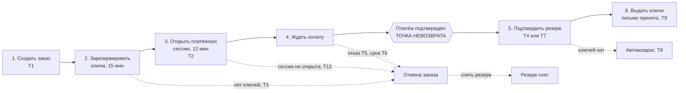

# ADR-004. Сага покупки: оркестрация в сервисе заказов

| Поле | Содержание |
| --- | --- |
| Статус | Принято |
| Дата | 2026-10-03 |
| Требования | FT-5.2, FT-6.3, FT-6.4, FT-6.5, FT-7.3, NFT-2.3, NFT-2.4, NFT-4.3, BG-06, раздел 8.2 требований |
| Связанные документы | [BPMN-01](../../03-processes/BPMN-01-purchase.md), [SM-01](../../03-processes/SM-01-order.md), [SM-02](../../03-processes/SM-02-payment.md), [SM-06](../../03-processes/SM-06-delivery.md), [SM-08](../../03-processes/SM-08-reservation.md) |
| Связанные ADR | [ADR-003](ADR-003-kafka-events.md), [ADR-005](ADR-005-transactional-outbox.md), [ADR-006](ADR-006-idempotency.md), [ADR-012](README.md), [ADR-013](README.md) |

## Контекст

Покупка затрагивает четыре сервиса с отдельными базами (заказы, остатки и ключи, платежи, выдача) и две внешние системы (платёжный шлюз и e-mail-провайдер). Общей транзакции нет и быть не может: шлюз нельзя «откатить» вместе с базой. При этом бизнес требует (BG-06, FT-5.2, FT-6.3 - FT-6.5): ключ не теряется и не выдаётся дважды, деньги не остаются у платформы без выдачи, а заказ не зависает.

BPMN-01 описывает основной путь и 12 исключений (E1 - E12), SM-01 задаёт 12 переходов заказа (T1 - T12, из них T10 и T11 относятся к R2). Нужно выбрать, кто управляет последовательностью шагов, как откатываются шаги, если дальше всё пошло не так, и где живут таймеры.

Ключевое наблюдение для проектирования: в сценарии есть **точка невозврата**, подтверждение платежа шлюзом. До неё всё компенсируется (резерв можно снять, платёжную сессию закрыть). После неё деньги уже у платформы, и шаги идут только вперёд (закрепить ключи, выдать) либо возвращаются деньги целиком (FT-6.5: частичной выдачи нет).

## Рассмотренные варианты

| Вариант | Плюсы | Минусы |
| --- | --- | --- |
| 1. Хореография: каждый сервис реагирует на события соседей, центра нет | Нет центрального координатора, слабая связность, нет единой точки отказа | Логика сценария размазана по четырём сервисам. Неясно, кто отвечает за таймаут и за отмену. 12 исключений BPMN-01 превращаются в цепочки реакций, которые трудно проверить целиком. Риск циклических зависимостей между сервисами. Трудно отвечать на вопрос «где сейчас заказ» |
| 2. Оркестратор в `order-service` (выбрано) | Весь сценарий и все компенсации в одном месте, он же владелец статуса заказа (SM-01). Таймауты и «зависшие» заказы ищутся одним запросом. Сценарий проверяется тестами на одном сервисе. Соответствует принципу «заказ ведёт покупку» из bounded-contexts | `order-service` знает порядок шагов других сервисов (связность по сценарию). Оркестратор это точка нагрузки и отказа, но заказы и так на критическом пути |
| 3. Движок процессов Camunda | Исполняет BPMN, есть готовые таймеры, повторы и интерфейс мониторинга | Camunda 8 требует отдельный брокер Zeebe и хранилище Elasticsearch или OpenSearch: несколько гигабайт памяти, не помещается в WSL на 3 ГБ. Camunda 7 как встроенная библиотека тянет движок и свои таблицы в базу заказов, привязывает код к API движка. Для одной саги с 6 шагами избыточно |
| 4. Temporal | Сценарий как код на Java, надёжные таймеры и повторы, история выполнения. Лучший вариант, если саг много | Нужны сервер Temporal, его хранилище (PostgreSQL или Cassandra) и интерфейс: ещё 2-3 контейнера и около 1,5 ГБ памяти. Требует детерминированного кода и отдельного изучения. Для одной саги не окупается |
| 5. Распределённая транзакция (2PC, XA) | Одна атомарная операция на все сервисы | Платёжный шлюз и e-mail-провайдер в транзакцию не входят. Блокировки держатся на время самого медленного участника. Kafka не поддерживает XA. Противоречит независимости сервисов |
| 6. Без компенсаций, исправляет поддержка вручную | Проще всего написать | Деньги и ключи зависают до обращения покупателя. Нарушает BG-06 и NFT-2.4 |

## Решение

Выбран вариант 2: **оркестрация в `order-service`**, без внешнего движка.

**Принципы**

1. Единственный, кто меняет статус заказа и решает, какой шаг следующий, это `order-service`. Остальные сервисы отвечают фактами (синхронным ответом или событием) и сами заказ не трогают.
2. Статус заказа по SM-01 и есть состояние саги. Отдельной таблицы «экземпляров процесса» нет: состояние выводится из статуса, причины отмены, сроков (`reserve_expires_at`, `payment_session_expires_at`, `paid_at`) и статусов связанных сущностей.
3. Переходы реализуются явным конечным автоматом в коде: перечисление статусов и таблица допустимых переходов из SM-01. Каждый переход, изменение данных и запись события в Outbox выполняются **одной локальной транзакцией** ([ADR-005](ADR-005-transactional-outbox.md)), строка заказа блокируется `SELECT ... FOR UPDATE` на время обработки.
4. Недопустимый переход (например, `оплачен` → `создан`) отвергается кодом, а повторное уведомление, ведущее в уже достигнутый статус, игнорируется ([ADR-006](ADR-006-idempotency.md)). Заказ «оплачен» только при платеже «подтверждён», «возвращён» только при платеже «возвращён» (INV-16), «выдан» один раз за жизнь заказа (INV-17).
5. Шаги **до** точки невозврата компенсируются отменой заказа и снятием резерва. Шаги **после** неё не откатываются: закрепление ключей и выдача повторяются до успеха ([ADR-011](ADR-011-guaranteed-delivery.md)), а при невозможности выдачи возвращаются деньги целиком.

**Шаги и компенсации**

| № | Шаг | Вид | Участник | Ключ идемпотентности | Срок и повторы | Успех | Сбой и компенсация |
| --- | --- | --- | --- | --- | --- | --- | --- |
| 1 | Создать заказ: проверка кода телефона, карточка товара, запись заказа | Локальный шаг и синхронный вызов `catalog-service` | `order-service` | `Idempotency-Key` запроса и покупатель | Вызов каталога 500 мс, один повтор | T1: заказ «создан» | Телефон не подтверждён (E1) или товар недоступен: заказ не создаётся, ответ 4xx. Каталог недоступен: ответ 503, заказ не создаётся |
| 2 | Зарезервировать ключи | Синхронный вызов `inventory-service` | `inventory-service` | Идентификатор заказа | 1 с на попытку, один повтор, вместе с шагом 1 укладывается в NFT-1.2 | Резерв «активен» до момента, который вернул сервис остатков | Ключей мало (E2): T3, компенсации нет. Нет ответа после повтора: T3 с причиной «системная ошибка» и событие «заказ отменён», сервис остатков снимет резерв, если он всё же был создан |
| 3 | Открыть платёжную сессию | Синхронный вызов `payment-service` | `payment-service`, шлюз | Идентификатор заказа (он же передаётся шлюзу) | Шлюз 2 с на попытку, до 3 попыток, общий срок шага 7 с | T2: заказ «ожидает оплаты», событие «заказ создан» | E12: T12 с причиной «платёжная сессия не открыта», событие «заказ отменён», сервис остатков снимает резерв. Второго платежа не будет: ключ идемпотентности шлюза равен идентификатору заказа |
| 4 | Ждать оплату | События `payment.confirmed`, `payment.rejected`, `reservation.expired` | `payment-service`, `inventory-service` | Идентификатор события | До истечения резерва, 15 мин | См. шаг 5 | Отказ шлюза (E3): T5 и событие «заказ отменён» с причиной «отказ в оплате». Резерв истёк (E4): T6 |
| 5 | Подтвердить резерв (точка невозврата пройдена) | Синхронный вызов `inventory-service` из обработчика события | `inventory-service` | Идентификатор заказа | 2 с на попытку, повторы идут вместе с повтором обработки события ([ADR-011](ADR-011-guaranteed-delivery.md)) | T4 (заказ ждал оплаты) или T7 (заказ уже отменён, повторный резерв удался, E6). Событие «заказ оплачен» | Ключей не хватает: для заказа, ожидавшего оплаты, T6, затем событие «вернуть деньги»; для уже отменённого заказа статус не меняется. В обоих случаях автовозврат целиком (E7), T8 после подтверждения возврата |
| 6 | Выдать ключи | События `order.paid`, `delivery.accepted` | `delivery-service`, e-mail-провайдер | Идентификатор заказа и тип выдачи | Повторы и контроль 30 минут по [ADR-011](ADR-011-guaranteed-delivery.md) | T9: «выдан» при приёме письма провайдером | Откат невозможен: ключи уже закреплены. Попытки исчерпаны или 30 минут без доставки: обращение в поддержку и оповещение администратора, заказ остаётся «оплачен» (E9, E10, E11) |
| 7 | Вернуть деньги | Событие-команда `order.refund-requested` | `payment-service`, шлюз | Идентификатор платежа | Пять попыток за 17,5 минут ([ADR-015](ADR-015-payment-gateway-integration.md)) | `payment.refunded`: T8, письмо о возврате | Попытки исчерпаны: возврат передаётся администратору (E8), заказ остаётся «отменён» до его отметки |

Подтверждение резерва (шаг 5) сделано **синхронным вызовом**, а не событием. Если бы заказ становился «оплачен», а ключи закреплялись отдельным событием, то между ними резерв мог бы истечь, и оплаченный заказ остался бы без ключей. В SM-01 нет перехода `оплачен` → `возвращён`, поэтому такую гонку нужно исключить, а не разбирать. Сервис остатков выполняет подтверждение атомарно (резерв «активен» → «использован», ключи «выданы»), а если резерв уже снят, пытается зарезервировать заново (подробно в [ADR-013](README.md)). Одна и та же операция обслуживает T4 и T7.

**Обработка событий оркестратором**

| Событие | Статус заказа | Действие |
| --- | --- | --- |
| `payment.confirmed` | «ожидает оплаты» или «отменён» | Шаг 5. Результат: T4, T7 или отмена с возвратом |
| `payment.confirmed` | «оплачен», «выдан» | Игнорировать (E5), метрика повторов |
| `payment.confirmed` | «создан» | Платёжная сессия открыта, а T2 ещё не зафиксирован (подтверждение обогнало ответ). Повторить обработку позже (заглушка отвечает мгновенно, в реальной системе случай редкий) |
| `payment.confirmed` | «возвращён» | Аномалия: событие не меняет заказ, пишется в метрику ошибок платежей и разбирается администратором |
| `payment.rejected` | «ожидает оплаты» | T5, событие «заказ отменён» |
| `reservation.expired` | «ожидает оплаты» | T6 |
| `reservation.expired` | другие | Игнорировать (резерв относится к уже завершённой попытке) |
| `payment.refunded` | «отменён» | T8, событие «заказ возвращён» |
| `delivery.accepted` | «оплачен» | T9, один раз за жизнь заказа |

**Таймеры оркестратора**

| Таймер | Значение | Что делает | Зачем |
| --- | --- | --- | --- |
| Резерв ключей | 15 мин, параметр платформы | Принадлежит `inventory-service` ([ADR-012](README.md)): снимает резерв и публикует `reservation.expired` | FT-5.2 |
| Платёжная сессия | 12 мин, параметр платформы, строго короче резерва (INV-07) | Закрывается на стороне шлюза, срок хранится в заказе. Заказ ждёт дальше до конца резерва: подтверждение может дойти с задержкой (3 минуты запаса между сессией и резервом) | FT-5.2 |
| Сверка зависших заказов | Каждую минуту | Заказ «создан» старше 60 с: отмена с причиной «системная ошибка» и событие «заказ отменён» (падение между шагами 1 и 3). Заказ «ожидает оплаты» с истёкшим резервом больше 5 минут без события: T6 | SM-01/T6 («при потере таймера сверяющая задача»), страховка от потерянного события |
| Контроль выдачи 30 минут | 30 мин от `paid_at` | Принадлежит `delivery-service` ([ADR-011](ADR-011-guaranteed-delivery.md)) | NFT-2.4 |

Параллельные события одного заказа (например, подтверждение платежа и истечение резерва в одну секунду) разрешает блокировка строки заказа: побеждает то, что зафиксировалось первым, второе событие находит статус, для которого оно уже не нужно, и либо игнорируется, либо идёт путём поздней оплаты.

## Последствия

**Плюсы:**

- Весь сценарий покупки и все компенсации читаются и тестируются в одном сервисе, а ответ на «где заказ и почему» даёт один статус.
- Нет внешнего движка и дополнительных контейнеров: экономия около 1,5-3 ГБ памяти.
- Понятная граница: до точки невозврата откатываем, после неё только вперёд или возврат целиком.
- Одна операция «подтвердить резерв» обслуживает обычную и позднюю оплату и исключает гонку между оплатой и истечением резерва.

**Минусы и риски:**

- Автомат, таймеры и повторы пишутся вручную. Риск ошибок в редких путях. Защита: переходы SM-01 как таблица кода, тесты на каждый переход и исключение (стратегия тестирования, шаг 13), интеграционные тесты с Testcontainers на сбои между шагами.
- `order-service` знает порядок шагов других сервисов. Смена сценария требует правки одного сервиса, но и согласования контрактов с остальными.
- Синхронные вызовы внутри обработчика события (шаг 5) продлевают обработку при медленном ответе сервиса остатков. Защита: тайм-аут 2 с, повтор события с задержкой ([ADR-011](ADR-011-guaranteed-delivery.md)), метрика задержки обработки.
- После выхода сообщения в DLQ (`payment.confirmed`) платёж подтверждён, а заказ ещё «ожидает оплаты». Защита: оповещение о событии в DLQ критической темы, команда повторной обработки из DLQ, сверка платежей ([ADR-015](ADR-015-payment-gateway-integration.md)).
- Сценарий R2 (выдача по API продавца с тайм-аутом 10 минут, T10) добавляет шаг и таймер. Он ложится на тот же автомат.

## Когда пересмотреть

- В R2 и R3 число сценариев с таймерами и компенсациями выросло до трёх и более (покупка, выдача по API продавца, споры, вывод средств): оценить Temporal и сравнить с затратами на собственный автомат.
- Команде нужен визуальный мониторинг процессов для бизнеса: рассмотреть Camunda 8 на сервере (не на ноутбуке).
- Замеры показали, что синхронное подтверждение резерва в обработчике события ухудшает задержку: перейти на событие `keys.assign-requested` с ответом, добавив допустимый переход «оплачен» → «возвращён» в SM-01.
