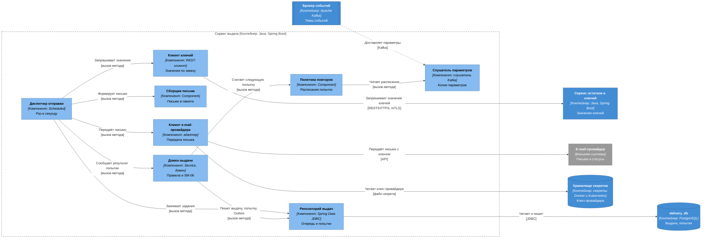

# C4, уровень 3: компоненты сервиса выдачи

| Поле | Содержание |
| --- | --- |
| Документ | C4 Component: устройство `delivery-service` |
| Фаза | Ф2, шаг 6 |
| Контейнер | `delivery-service`, Java, Spring Boot, база `delivery_db` ([c4-containers.md](c4-containers.md)) |
| Нотация | [c4-notation.md](c4-notation.md) |
| Основание | [ADR-011](adr/ADR-011-guaranteed-delivery.md) (очередь, повторы, контроль 30 минут, DLQ), [ADR-006](adr/ADR-006-idempotency.md) (идемпотентность), [ADR-009](adr/ADR-009-key-encryption-hmac.md) (ключи в памяти), [ADR-022](adr/ADR-022-internal-traffic-encryption.md) (mTLS), [SM-06](../03-processes/SM-06-delivery.md), [BPMN-01](../03-processes/BPMN-01-purchase.md) |
| Общие компоненты | [c4-components.md](c4-components.md): каркас `service-kit`, правила транзакций, соглашения об именах |
| Предыдущий уровень | [c4-containers.md](c4-containers.md) |

Сервис выдачи превращает оплаченный заказ в письмо с ключом и отвечает за то, чтобы письмо дошло: повторяет отправку, следит за статусом, передаёт зависший заказ в поддержку. Внутри у него очередь в базе данных, внешние медленные вызовы и два таймера. Ещё одно требование: открытое значение ключа живёт только в памяти на время одной попытки.

Компоненты показаны двумя диаграммами: «очередь, отправка и повторы» (раздел 2) и «статус письма, контроль 30 минут и события» (раздел 3).

## 1. Компоненты

Состав `delivery-service` (модуль `delivery`, один верхний пакет).

| Компонент | Алиас | Spring-слой | Ответственность | Вызывает | События |
| --- | --- | --- | --- | --- | --- |
| Диспетчер отправки | `delivery-dispatcher` | `@Scheduled`, раз в секунду | Занимает до 20 выдач `status = 'queued' AND next_attempt_at <= now()` коротким запросом `FOR UPDATE SKIP LOCKED` с арендой (`next_attempt_at` сдвигается на 2 минуты, чтобы упавший процесс не терял выдачу). Блокировка строки на время сетевых вызовов не держится. Выполняет попытку: ключи, письмо, передача провайдеру, затем сообщает результат домену | `delivery-repository`, `key-client`, `letter-builder`, `email-client`, `delivery-domain` | Нет |
| Клиент ключей | `key-client` | `@Component`, REST-клиент mTLS | «Значения ключей по заказу» у `inventory-service`. Тайм-аут 2 секунды. Возвращает значения как `SecretValue`, не кэширует, не логирует | `inventory-service` | Нет |
| Сборщик письма | `letter-builder` | `@Component` | Формирует тело письма в памяти из шаблона, названия товара и значений ключей. Проверяет, что значений ровно столько, сколько в заказе (INV-19). Адрес берёт только из снимка в выдаче. После отправки ссылки на значения не остаются | Нет | Нет |
| Клиент e-mail-провайдера | `email-client` | `@Component`, адаптер (anti-corruption layer) | «Передать письмо» (идентификатор сообщения у провайдера равен идентификатору выдачи, тайм-аут 5 секунд) и «статус письма» для опроса. Переводит ответы провайдера в исходы: принято, повторяемая ошибка (тайм-аут, 5xx, 429), окончательная ошибка (400, 422, отказ по адресу). Ключ доступа читает из секретов | `secret-store`, `email-provider` | Нет |
| Домен выдачи | `delivery-domain` | `@Service` доменного слоя, `@Transactional` | Переходы SM-06 (T1–T6), правила INV-17 (сторона выдачи), INV-18, INV-20. Создаёт первичную и повторную выдачу, записывает попытки без значений ключей, принимает статус письма, передаёт зависший заказ. Каждое изменение с записью в Outbox и `processed_event` одной транзакцией | `delivery-repository`, `retry-policy`, `config-listener` | Пишет в Outbox: `delivery.accepted`, `delivery.delivered`, `delivery.failed`, `delivery.overdue` |
| Политика повторов | `retry-policy` | `@Component` | По номеру попытки и классу ошибки выдаёт следующую попытку: паузы 10 с, 30 с, 2 мин, 5 мин, 10 мин с разбросом ±20%, всего 6 попыток. Окончательная ошибка повторов не получает | `config-listener` | Нет |
| Контроллер статусов писем | `webhook-controller` | `@RestController` | Принимает статусы писем от провайдера через `api-gateway` (без токена). Проверяет подпись и метку времени (не старше 5 минут), убирает дубли по паре «идентификатор сообщения, статус». Неверная подпись 401, повтор или неизвестное письмо 200 | `delivery-domain` | Нет |
| Опрос статусов | `status-poller` | `@Scheduled`, раз в 5 минут | Для выдач «отправлено» старше 5 минут, у которых нет статуса и ещё идёт контроль, спрашивает провайдера. Ответ применяется тем же путём, что вебхук. Нужен на случай потерянного вебхука | `delivery-repository`, `email-client`, `delivery-domain` | Нет |
| Контроль 30 минут | `delivery-watch-job` | `@Scheduled`, раз в 30 секунд | Берёт записи `delivery_watch` в состоянии «открыт» со сроком `paid_at + 30 минут` (`FOR UPDATE SKIP LOCKED`). Для просроченных просит у домена передачу | `delivery-repository`, `delivery-domain` | Нет |
| Потребитель событий | `event-consumer` | Слушатель Kafka из каркаса | Читает `order.events` (`order.paid`, `order.address-updated`) и `identity.events` (`user.anonymized`). Пропускает обработанные, повторы 1, 5, 25 с, DLQ. Вызывает домен | `delivery-domain`, `delivery-repository` | Читает: `order.paid`, `order.address-updated`, `user.anonymized` |
| Слушатель параметров | `config-listener` | Слушатель Kafka без группы | Читает `platform.config` с начала. Копия в памяти: расписание повторов, окно контроля (30 минут), опрос провайдера | Нет | Читает: `config.changed` |
| Публикатор Outbox | `outbox-relay` | `@Scheduled`, раз в 200 мс, из каркаса | Публикует записи Outbox в Kafka по правилам [ADR-005](adr/ADR-005-transactional-outbox.md) | `delivery-db`, `kafka` | Публикует записанное |
| Репозиторий выдач | `delivery-repository` | Spring Data JDBC | Единственный путь записи в таблицы `delivery`, `delivery_attempt`, `delivery_watch`, `outbox`, `processed_event`. Значений ключей в таблицах нет и быть не может | `delivery-db` | Нет |

Имена таблиц логические, физические фиксирует шаг 12.

## 2. Очередь, отправка и повторы

Отвечает на вопрос «как письмо с ключом уходит провайдеру и что происходит при сбое».

| № | От | К | Что передаётся | Способ | Связь контейнеров |
| --- | --- | --- | --- | --- | --- |
| 1 | `kafka` | `config-listener` | `config.changed` (`platform.config`) | Kafka | [c4-containers.md](c4-containers.md), раздел 8, «параметры изменены» |
| 2 | `delivery-dispatcher` | `delivery-repository` | Занять до 20 выдач, у которых подошёл срок | Вызов метода | Внутри сервиса |
| 3 | `delivery-dispatcher` | `key-client`, `letter-builder`, `email-client` | Шаги попытки: значения, письмо, передача | Вызов метода | Внутри сервиса |
| 4 | `delivery-dispatcher` | `delivery-domain` | Исход попытки: принято, повторяемая ошибка, окончательная ошибка | Вызов метода | Внутри сервиса |
| 5 | `delivery-domain` | `retry-policy` | Время следующей попытки по номеру и классу ошибки | Вызов метода | Внутри сервиса |
| 6 | `retry-policy` | `config-listener` | Расписание повторов | Вызов метода | Внутри сервиса |
| 7 | `delivery-domain` | `delivery-repository` | Статус выдачи, запись попытки, запись Outbox одной транзакцией | Вызов метода | Внутри сервиса |
| 8 | `key-client` | `inventory-service` | «Значения ключей по заказу» | REST/HTTPS, mTLS | раздел 3, связь 4 |
| 9 | `email-client` | `email-provider` | Письмо с ключом, напрямую, мимо Kafka и `platform-service` | API | раздел 4, связь 3 |
| 10 | `email-client` | `secret-store` | Ключ доступа к e-mail-провайдеру | Файл секрета | раздел 7.1, связь 3 |
| 11 | `delivery-repository` | `delivery-db` | Чтение и запись | JDBC | раздел 6 |

### 2.1. Одна попытка отправки

Попытка не держит ни транзакцию базы, ни блокировку строки на время внешних вызовов:

1. `delivery-dispatcher` короткой транзакцией занимает выдачи и сдвигает `next_attempt_at` на срок аренды (2 минуты).
2. Для каждой выдачи вне транзакции: `key-client` получает значения, `letter-builder` собирает письмо и проверяет число ключей, `email-client` передаёт письмо провайдеру.
3. `delivery-domain` записывает исход в новой транзакции: запись в `delivery_attempt` (время, результат, код ошибки, без значений и тела письма), статус выдачи по SM-06 и событие в Outbox.
4. Исходы: принято, T2 «отправлено» и `delivery.accepted`; повторяемая ошибка, T3 «в очереди» с новым `next_attempt_at` от `retry-policy`; окончательная ошибка или шестая неудача, T4 «ошибка» и `delivery.failed`.
5. Значения ключей и тело письма после шага 2 нигде не хранятся и в логи не попадают. После шага 4 в памяти остаются только идентификаторы.

Если процесс упал между шагами 2 и 3, аренда истечёт, выдача снова станет доступна и попытка повторится: провайдер удалит дубль по идентификатору сообщения (равен идентификатору выдачи). Первые три попытки укладываются в 60 секунд (NFT-2.0), шестая заканчивается на 18-й минуте (NFT-2.4).

## 3. Статус письма, контроль 30 минут и события

Отвечает на вопрос «как сервис узнаёт, что письмо дошло, и как не теряет заказ».

```mermaid
%%{init: {"theme":"base","themeVariables":{"edgeLabelBackground":"#ffffff","lineColor":"#444444"},"flowchart": {"nodeSpacing": 45, "rankSpacing": 190, "curve": "basis"}}}%%
flowchart LR
    api-gateway["<b>API Gateway</b><br/><i>[Контейнер: Spring Cloud Gateway]</i><br/>Передаёт вебхуки"]
    kafka[["<b>Брокер событий</b><br/><i>[Контейнер: Apache Kafka]</i><br/>Темы событий"]]

    subgraph delivery-service["Сервис выдачи [Контейнер: Java, Spring Boot]"]
        webhook-controller["<b>Контроллер статусов писем</b><br/><i>[Компонент: RestController]</i><br/>Проверка подписи"]
        status-poller["<b>Опрос статусов</b><br/><i>[Компонент: Scheduled]</i><br/>Раз в 5 минут"]
        delivery-watch-job["<b>Контроль 30 минут</b><br/><i>[Компонент: Scheduled]</i><br/>Раз в 30 секунд"]
        event-consumer["<b>Потребитель событий</b><br/><i>[Компонент: слушатель Kafka]</i><br/>Дедупликация, повторы"]
        config-listener["<b>Слушатель параметров</b><br/><i>[Компонент: слушатель Kafka]</i><br/>Копия параметров"]
        email-client["<b>Клиент e-mail-провайдера</b><br/><i>[Компонент: адаптер]</i><br/>Статус письма"]
        delivery-domain["<b>Домен выдачи</b><br/><i>[Компонент: Service, домен]</i><br/>Правила и SM-06"]
        delivery-repository["<b>Репозиторий выдач</b><br/><i>[Компонент: Spring Data JDBC]</i><br/>Выдачи и контроль"]
        outbox-relay["<b>Публикатор Outbox</b><br/><i>[Компонент: Scheduled]</i><br/>Раз в 200 мс"]
    end

    email-provider["<b>E-mail-провайдер</b><br/><i>[Внешняя система]</i><br/>Письма и статусы"]
    delivery-db[("<b>delivery_db</b><br/><i>[Контейнер: PostgreSQL]</i><br/>Выдачи, Outbox")]

    api-gateway -->|"Передаёт статусы писем<br/>[Webhook/HTTPS]"| webhook-controller
    kafka -.->|"Доставляет события заказа<br/>[Kafka]"| event-consumer
    kafka -.->|"Доставляет параметры<br/>[Kafka]"| config-listener
    webhook-controller -->|"Применяет статус письма<br/>[вызов метода]"| delivery-domain
    status-poller -->|"Ищет письма без статуса<br/>[вызов метода]"| delivery-repository
    status-poller -->|"Спрашивает статус<br/>[вызов метода]"| email-client
    status-poller -->|"Применяет статус письма<br/>[вызов метода]"| delivery-domain
    delivery-watch-job -->|"Ищет просроченные контроли<br/>[вызов метода]"| delivery-repository
    delivery-watch-job -->|"Передаёт просроченный заказ<br/>[вызов метода]"| delivery-domain
    event-consumer -->|"Создаёт выдачу, анонимизирует<br/>[вызов метода]"| delivery-domain
    event-consumer -->|"Пропускает обработанные<br/>[вызов метода]"| delivery-repository
    delivery-domain -->|"Читает окно контроля<br/>[вызов метода]"| config-listener
    delivery-domain -->|"Пишет выдачу, контроль, Outbox<br/>[вызов метода]"| delivery-repository
    email-client ---->|"Запрашивает статус письма<br/>[API]"| email-provider
    delivery-repository ---->|"Читает и пишет<br/>[JDBC]"| delivery-db
    outbox-relay ---->|"Читает и помечает Outbox<br/>[JDBC]"| delivery-db
    outbox-relay -.->|"Публикует события<br/>[Kafka]"| kafka

    classDef container fill:#438dd5,stroke:#2e6295,color:#ffffff
    classDef ext fill:#999999,stroke:#6b6b6b,color:#ffffff
    classDef component fill:#85bbf0,stroke:#5d82a8,color:#000000
    class api-gateway,kafka,delivery-db container
    class email-provider ext
    class webhook-controller,status-poller,delivery-watch-job,event-consumer,config-listener,email-client,delivery-domain,delivery-repository,outbox-relay component
    style delivery-service fill:none,stroke:#444444,stroke-dasharray:6 4,color:#444444
```

| № | От | К | Что передаётся | Способ | Связь контейнеров |
| --- | --- | --- | --- | --- | --- |
| 1 | `api-gateway` | `webhook-controller` | Статусы писем от e-mail-провайдера: принято, доставлено, отказ. Провайдер вызывает `api-gateway`, шлюз передаёт запрос без токена | Webhook/HTTPS | [c4-containers.md](c4-containers.md), раздел 2, связь 9, раздел 4, связь 4 |
| 2 | `kafka` | `event-consumer` | `order.paid`, `order.address-updated` (`order.events`), `user.anonymized` (`identity.events`) | Kafka | раздел 8 |
| 3 | `kafka` | `config-listener` | `config.changed` (`platform.config`) | Kafka | раздел 8, «параметры изменены» |
| 4 | `webhook-controller`, `status-poller` | `delivery-domain` | Статус письма: доставлено (T5), отказ (T6) | Вызов метода | Внутри сервиса |
| 5 | `status-poller` | `email-client` | Запрос статуса письма | Вызов метода | Внутри сервиса |
| 6 | `delivery-watch-job` | `delivery-domain` | Просроченный контроль: письмо не доставлено за 30 минут | Вызов метода | Внутри сервиса |
| 7 | `event-consumer` | `delivery-domain` | Создать первичную выдачу и контроль, создать повторную выдачу по новому адресу, очистить адрес при анонимизации | Вызов метода | Внутри сервиса |
| 8 | `delivery-domain` | `config-listener` | Окно контроля и параметры опроса | Вызов метода | Внутри сервиса |
| 9 | `email-client` | `email-provider` | Запрос статуса письма (опрос) | API | раздел 4, связь 3 |
| 10 | `outbox-relay` | `kafka` | `delivery.accepted`, `delivery.delivered`, `delivery.failed`, `delivery.overdue` | Kafka | раздел 8 |
| 11 | `delivery-repository`, `outbox-relay` | `delivery-db` | Чтение и запись | JDBC | раздел 6 |

### 3.1. Создание выдачи и контроль

Событие `order.paid` обрабатывается одной транзакцией: пометка `processed_event`, запись первичной выдачи «в очереди» (`next_attempt_at = now()`, уникальность по паре «заказ, тип», INV-18) и запись `delivery_watch` со сроком `paid_at + 30 минут`. Контроль стартует от `order.paid`, а не от закрепления ключей: цепочка работает, даже если ошибка случилась до отправки письма ([ADR-011](adr/ADR-011-guaranteed-delivery.md)). Для события `order.address-updated` создаётся повторная выдача по новому адресу, новая запись контроля не создаётся (окна считаются от первичной выдачи), а частичный уникальный индекс не допускает больше одной выдачи «в очереди» на заказ.

| Событие | Что делает `delivery-domain` |
| --- | --- |
| Выдача «доставлено» до срока | Запись контроля закрывается, ничего не публикуется кроме `delivery.delivered` |
| Срок контроля наступил, «доставлено» нет | Запись контроля «передан», событие `delivery.overdue`. Статус выдачи не меняется (SM-06, «Контроль 30 минут») |
| «Доставлено» после передачи | Запись контроля закрывается, `delivery.delivered` закрывает обращение системы (SM-07/T4) |
| «Отказ» после приёма письма (T6) | Статус «ошибка», `delivery.failed` с причиной «письмо не доставлено» |

## 4. Расширение релиза R2

Рисунок не добавляется (правило 8 нотации о несмешивании R1 и R2). Компоненты R2 в таблице.

| Компонент | Алиас | Spring-слой | Ответственность | События и вызовы |
| --- | --- | --- | --- | --- |
| Клиент API продавца | `seller-api-client` | `@Component`, адаптер | «Запросить ключ» у системы продавца, ответ ждём 10 минут (FT-7.4). Переводит статусы продавца в исходы попытки | Вызывает `seller-systems` |
| Контроллер ответа продавца | `seller-answer-controller` | `@RestController` | Принимает ответ продавца с ключом (FT-10.2), вызов приходит через `api-gateway` с проверкой API-ключа. Значение ключа живёт только в памяти до формирования письма | Нет |
| Тайм-аут продавца | `seller-timeout-job` | `@Scheduled` | Запросы без ответа 10 минут передаёт домену | Публикует `delivery.seller-timeout` через домен |
| Обработчик замены | `key-replacement-handler` | Метод `event-consumer` | По `key.replaced` создаёт повторную выдачу | Читает `key.replaced` |

Связи R2 на уровне контейнеров: [c4-containers.md](c4-containers.md), раздел 9.1.

## 5. Компонент → инварианты и требования

| Компонент | Инварианты | Требования и решения | Как обеспечивает |
| --- | --- | --- | --- |
| `delivery-dispatcher` | INV-20 (значения не остаются после попытки) | FT-7.0, NFT-2.0, NFT-4.3, [ADR-011](adr/ADR-011-guaranteed-delivery.md) | Аренда и `SKIP LOCKED`, нет блокировки на время вызовов |
| `key-client` | INV-20 | NFT-3.2, [ADR-022](adr/ADR-022-internal-traffic-encryption.md) | mTLS, `SecretValue`, без кэша и логов |
| `letter-builder` | INV-19 (ключей в письме столько, сколько в заказе, адрес из снимка), INV-20 | FT-7.0, FT-7.1 | Проверка числа значений, письмо только в памяти |
| `email-client` | | FT-7.0, FT-7.3, NFT-4.3, [ADR-006](adr/ADR-006-idempotency.md) | Идентификатор сообщения равен идентификатору выдачи, тайм-аут 5 с, классы ошибок |
| `delivery-domain` | INV-17 (сторона выдачи: событие `delivery.accepted` один раз), INV-18, INV-20, INV-23 (поддержка получает статусы, значения не передаются), INV-44 (снимок адреса) | FT-7.0, FT-7.3, FT-7.5, NFT-2.3, NFT-2.4, [SM-06](../03-processes/SM-06-delivery.md) | Таблица переходов SM-06, транзакция «изменение, Outbox, `processed_event`», уникальная первичная выдача |
| `retry-policy` | | FT-7.3, NFT-2.0, NFT-2.4, [ADR-011](adr/ADR-011-guaranteed-delivery.md) | Расписание 10 с, 30 с, 2 мин, 5 мин, 10 мин, до 6 попыток |
| `webhook-controller` | | FT-7.3, NFT-2.3, [ADR-006](adr/ADR-006-idempotency.md) | Подпись, метка времени, дедупликация статуса |
| `status-poller` | | FT-7.3, NFT-2.4 | Опрос провайдера раз в 5 минут при потерянном вебхуке |
| `delivery-watch-job` | | NFT-2.1, NFT-2.4, [ADR-011](adr/ADR-011-guaranteed-delivery.md) | Контроль 30 минут от `paid_at`, передача в пределах 30 с после срока |
| `event-consumer` | INV-18 (повторное `order.paid` не создаёт вторую выдачу), INV-44 | NFT-2.3, [ADR-003](adr/ADR-003-kafka-events.md), [ADR-006](adr/ADR-006-idempotency.md), [ADR-011](adr/ADR-011-guaranteed-delivery.md) | Пропуск обработанных, повторы 1, 5, 25 с, DLQ |
| `config-listener` | | FT-11.1 | Копия параметров |
| `outbox-relay` | | NFT-2.3, NFT-6.0, [ADR-005](adr/ADR-005-transactional-outbox.md) | Публикует записанное вместе с изменением |
| `delivery-repository` | INV-18 (уникальный индекс «заказ, тип»), INV-20 (в схеме нет колонок для значений) | NFT-3.2 | Условные обновления, `FOR UPDATE SKIP LOCKED`, доступ только к `delivery_db` |

Инварианты, которые относятся к `delivery-service` по [domain-model.md](../04-domain/domain-model.md), раздел 6: INV-17 (сторона выдачи), INV-18, INV-19, INV-20, INV-23 (сторона источника), INV-44. Все закреплены за компонентом.

## 6. Проверка

| Проверка | Результат |
| --- | --- |
| Каждый вызов контейнера из [c4-containers.md](c4-containers.md) раздела 3 и 4, относящийся к `delivery-service`, отображён на компонент | Выполнено: связь 4 раздела 3 (`key-client`), связи 3 и 4 раздела 4 (`email-client`, `webhook-controller`), связь 7.1.3 (секрет, `email-client`) |
| Каждое событие раздела 8 с участием `delivery-service` отображено на компонент | Выполнено: `order.paid`, `order.address-updated`, `user.anonymized`, параметры (`event-consumer`, `config-listener`), публикации четырёх событий (`outbox-relay`) |
| Значения ключей не попадают в базу, Kafka, логи | Выполнено: значения проходят `key-client`, `letter-builder`, `email-client` и нигде не сохраняются, в `delivery-repository` для них нет колонок |
| Таймеры отделены от обработки событий | Выполнено: `delivery-dispatcher`, `status-poller`, `delivery-watch-job` работают от базы, а не от Kafka |
| Компоненты не обращаются к таблицам других сервисов | Выполнено: один репозиторий, одна база |
| На диаграмме не больше 15 элементов | Выполнено: диаграмма отправки 13, диаграмма статусов 13 |

## 7. Решения

| № | Вопрос | Решение | Причина |
| --- | --- | --- | --- |
| 1 | Держать ли блокировку выдачи на время попытки | Нет. Короткая транзакция занимает выдачу с арендой 2 минуты, исход пишется второй транзакцией | Попытка включает два медленных сетевых вызова (2 и 5 секунд), блокировка и соединение с базой не должны ждать. Уточнение [ADR-011](adr/ADR-011-guaranteed-delivery.md): `SKIP LOCKED` применяется при занятии, аренда страхует падение процесса |
| 2 | Откуда выдача берёт данные для письма | Из события `order.paid`: адрес, название товара, количество, номер заказа | Синхронного вызова `order-service` нет в модели контейнеров. Состав полей фиксирует AsyncAPI (шаг 10) |
| 3 | Что публиковать при доставке | `delivery.delivered` при каждой доставке (T5) | Подписчик (поддержка) сам игнорирует событие, если открытого обращения нет, зато правило простое |
| 4 | Где живёт расписание повторов | В `retry-policy`, значения из параметров платформы | Правило «повторяемо или нет» и сам график меняются независимо от очереди |
| 5 | Кто ведёт контроль 30 минут | `delivery-service` по `order.paid` | [ADR-011](adr/ADR-011-guaranteed-delivery.md): контроль работает, даже если ошибка случилась до отправки письма |
