# C4, уровень 3: компоненты сервиса остатков и ключей

| Поле | Содержание |
| --- | --- |
| Документ | C4 Component: устройство `inventory-service` |
| Фаза | Ф2, шаг 6 |
| Контейнер | `inventory-service`, Java, Spring Boot, база `inventory_db` ([c4-containers.md](c4-containers.md)) |
| Нотация | [c4-notation.md](c4-notation.md) |
| Основание | [ADR-007](adr/ADR-007-double-issue-protection.md) (двойная выдача), [ADR-009](adr/ADR-009-key-encryption-hmac.md) (шифрование и HMAC), [ADR-012](adr/ADR-012-reservation-redis-timer.md) (таймер резерва), [ADR-013](adr/ADR-013-late-payment.md) (поздняя оплата), [ADR-022](adr/ADR-022-internal-traffic-encryption.md) (mTLS), [SM-03](../03-processes/SM-03-key.md), [SM-08](../03-processes/SM-08-reservation.md) |
| Общие компоненты | [c4-components.md](c4-components.md): каркас `service-kit`, правила транзакций, соглашения об именах |
| Предыдущий уровень | [c4-containers.md](c4-containers.md) |

Сервис остатков и ключей единственный держит значения ключей и единственный их расшифровывает (кроме мгновенной передачи `delivery-service`). Здесь сосредоточены самые строгие инварианты проекта: ключ не выдаётся дважды, не теряется и не виден в открытом виде нигде, кроме памяти двух сервисов. Поэтому внутреннее устройство нужно знать до первой строки кода.

Компоненты показаны двумя диаграммами: «как сервис отвечает на запросы» (раздел 2) и «как работает таймер резерва, события и Outbox» (раздел 3).

## 1. Компоненты

Состав `inventory-service` (модуль `inventory`, один верхний пакет).

| Компонент | Алиас | Spring-слой | Ответственность | Вызывает | События |
| --- | --- | --- | --- | --- | --- |
| Фильтр вызывающих | `caller-filter` | Фильтр Spring Security из каркаса | Берёт имя сервиса из сертификата mTLS и сверяет его со списком разрешённых вызывающих для маршрута (`x-allowed-callers`, [ADR-022](adr/ADR-022-internal-traffic-encryption.md)). Значения ключей разрешены только `delivery-service`, резерв и подтверждение только `order-service`. Остальным 403 до контроллера | `inventory-controller` | Нет |
| Контроллер остатков | `inventory-controller` | `@RestController` | Маршруты: загрузка пула продавцом (вручную и CSV потоком), статистика пула, «зарезервировать ключи», «подтвердить резерв», «значения ключей по заказу». Проверяет область токена продавца (`seller.keys`) и идентификатор заказа. Ответ со значениями с заголовком `Cache-Control: no-store`, тело не логируется | `reservation-service`, `key-pool-service`, `key-value-reader` | Нет |
| Резервирование | `reservation-service` | `@Service`, `@Transactional` | Резерв: выбор свободных ключей `FOR UPDATE SKIP LOCKED`, привязка к заказу, запись резерва, всё или ничего (INV-05). Подтверждение: условное «активен» → «использован», ключи «выданы», при снятом резерве повторный резерв (поздняя оплата). Снятие: по сроку, по отмене заказа, всегда условное «если сейчас активен». Срок резерва берёт из параметров | `inventory-repository`, `config-listener`, `redis` (постановка таймера после фиксации) | Пишет в Outbox: `reservation.expired`, `reservation.released`, `stock.changed` |
| Загрузка пулов | `key-pool-service` | `@Service` | Читает CSV потоком (до 2 МБ и 10 000 строк в файле, до 100 000 ключей в пуле), обрезает пробелы по краям, считает HMAC, шифрует, вставляет пачками, дубль внутри товара отвергает по уникальному индексу. Файл не сохраняется ни в каком виде. Ручная загрузка идёт тем же путём | `product-registry`, `key-crypto`, `inventory-repository` | Пишет в Outbox: `stock.changed` |
| Выдача значений | `key-value-reader` | `@Service` | Единственный путь, где значения ключей выходят из сервиса. Читает ключи заказа в статусе «выдан», проверяет, что их число равно количеству в заказе, расшифровывает и возвращает как `SecretValue`. Не кэширует, в логи и трассировку не пишет | `key-crypto`, `inventory-repository` | Нет |
| Шифрование | `key-crypto` | `@Component` | Конвертное шифрование: мастер-ключ (KEK) из файла секрета, версии ключа данных (DEK) в таблице `data_key`, AES-256-GCM с 96-битным одноразовым значением и привязкой к идентификатору ключа данных и товара. HMAC-SHA-256 отдельным секретом для проверки дублей. Тип `SecretValue` не печатается и не сериализуется | `secret-store`, `inventory-repository` | Нет |
| Реестр товаров | `product-registry` | `@Service` | Локальная копия данных товара (идентификатор, продавец, способ выдачи) из событий каталога. Отвечает на вопросы «этот товар принадлежит этому продавцу» и «у товара выдача из пула» | `inventory-repository` | Нет |
| Потребитель событий | `event-consumer` | Слушатель Kafka из каркаса | Читает `catalog.events` (`product.created`, `product.updated`) и `order.events` (`order.cancelled`). Пропускает уже обработанные, повторы 1, 5, 25 с, затем DLQ | `reservation-service`, `product-registry`, `inventory-repository` | Читает: `product.created`, `product.updated`, `order.cancelled` |
| Слушатель параметров | `config-listener` | Слушатель Kafka без группы | Читает `platform.config` с начала. Копия в памяти: срок резерва, лимиты загрузки. До первого чтения действуют значения из конфигурации | Нет | Читает: `config.changed` |
| Таймер резервов | `reservation-timer` | `@Scheduled`, раз в секунду | Берёт из Redis (`ZRANGEBYSCORE reservation:expiry`) до 100 наступивших сроков, для каждого вызывает снятие по сроку, затем `ZREM`. При старте записывает в Redis все активные резервы из базы | `reservation-service`, `inventory-repository`, `redis` | Нет |
| Сверка резервов | `reservation-reconciler` | `@Scheduled`, раз в минуту | Ищет активные резервы со сроком, прошедшим больше 30 с назад (`FOR UPDATE SKIP LOCKED`), для каждого вызывает то же снятие по сроку. Находка увеличивает метрику `reservation_reconciled_total` | `reservation-service`, `inventory-repository` | Нет |
| Публикатор Outbox | `outbox-relay` | `@Scheduled`, раз в 200 мс, из каркаса | Публикует записи Outbox в Kafka по правилам [ADR-005](adr/ADR-005-transactional-outbox.md) (устройство описано в [c4-components-order-service.md](c4-components-order-service.md), раздел 5) | `inventory-db`, `kafka` | Публикует записанное |
| Репозиторий остатков | `inventory-repository` | Spring Data JDBC | Единственный путь записи в таблицы `key`, `data_key`, `reservation`, `product_copy`, `outbox`, `processed_event`. Запросы выбора ключей и условные обновления. Роль базы без права `DELETE` на `key`. Триггер `BEFORE UPDATE` на `key` запрещает недопустимые переходы SM-03 | `inventory-db` | Нет |

Имена таблиц логические, физические фиксирует шаг 12.

## 2. Запросы, резерв и выдача значений

Отвечает на вопрос «как сервис отвечает на запросы и где ключ шифруется и расшифровывается».

```mermaid
%%{init: {"theme":"base","themeVariables":{"edgeLabelBackground":"#ffffff","lineColor":"#444444"},"flowchart": {"nodeSpacing": 40, "rankSpacing": 190, "curve": "basis"}}}%%
flowchart LR
    api-gateway["<b>API Gateway</b><br/><i>[Контейнер: Spring Cloud Gateway]</i><br/>Загрузка пулов"]
    order-service["<b>Сервис заказов</b><br/><i>[Контейнер: Java, Spring Boot]</i><br/>Резерв и подтверждение"]
    delivery-service["<b>Сервис выдачи</b><br/><i>[Контейнер: Java, Spring Boot]</i><br/>Письмо с ключом"]

    subgraph inventory-service["Сервис остатков и ключей [Контейнер: Java, Spring Boot]"]
        caller-filter["<b>Фильтр вызывающих</b><br/><i>[Компонент: фильтр mTLS]</i><br/>Список разрешённых"]
        inventory-controller["<b>Контроллер остатков</b><br/><i>[Компонент: RestController]</i><br/>Принимает запросы"]
        reservation-service["<b>Резервирование</b><br/><i>[Компонент: Service]</i><br/>Резерв, подтверждение"]
        key-pool-service["<b>Загрузка пулов</b><br/><i>[Компонент: Service]</i><br/>CSV потоком"]
        key-value-reader["<b>Выдача значений</b><br/><i>[Компонент: Service]</i><br/>Значения по заказу"]
        key-crypto["<b>Шифрование</b><br/><i>[Компонент: Component]</i><br/>AES-256-GCM, HMAC"]
        product-registry["<b>Реестр товаров</b><br/><i>[Компонент: Service]</i><br/>Копия данных товара"]
        inventory-repository["<b>Репозиторий остатков</b><br/><i>[Компонент: Spring Data JDBC]</i><br/>Ключи и резервы"]
    end

    secret-store[("<b>Хранилище секретов</b><br/><i>[Контейнер: секреты Docker и Kubernetes]</i><br/>Мастер-ключ, секрет HMAC")]
    inventory-db[("<b>inventory_db</b><br/><i>[Контейнер: PostgreSQL]</i><br/>Ключи, резервы")]

    api-gateway -->|"Передаёт загрузку пулов<br/>[REST/HTTPS, mTLS]"| caller-filter
    order-service -->|"Резервирует и подтверждает<br/>[REST/HTTPS, mTLS]"| caller-filter
    delivery-service -->|"Запрашивает значения ключей<br/>[REST/HTTPS, mTLS]"| caller-filter
    caller-filter -->|"Пропускает разрешённых<br/>[вызов метода]"| inventory-controller
    inventory-controller -->|"Резервирует и подтверждает<br/>[вызов метода]"| reservation-service
    inventory-controller -->|"Загружает пул<br/>[вызов метода]"| key-pool-service
    inventory-controller -->|"Запрашивает значения<br/>[вызов метода]"| key-value-reader
    key-pool-service -->|"Проверяет права на товар<br/>[вызов метода]"| product-registry
    key-pool-service -->|"Шифрует, считает HMAC<br/>[вызов метода]"| key-crypto
    key-value-reader -->|"Расшифровывает<br/>[вызов метода]"| key-crypto
    key-crypto ---->|"Читает мастер-ключ и секрет HMAC<br/>[файл секрета]"| secret-store
    reservation-service -->|"Выбирает и обновляет ключи<br/>[вызов метода]"| inventory-repository
    key-pool-service -->|"Вставляет ключи<br/>[вызов метода]"| inventory-repository
    key-value-reader -->|"Читает ключи заказа<br/>[вызов метода]"| inventory-repository
    key-crypto -->|"Читает версии ключа данных<br/>[вызов метода]"| inventory-repository
    product-registry -->|"Читает копию товара<br/>[вызов метода]"| inventory-repository
    inventory-repository ---->|"Читает и пишет<br/>[JDBC]"| inventory-db

    classDef container fill:#438dd5,stroke:#2e6295,color:#ffffff
    classDef component fill:#85bbf0,stroke:#5d82a8,color:#000000
    class api-gateway,order-service,delivery-service,secret-store,inventory-db container
    class caller-filter,inventory-controller,reservation-service,key-pool-service,key-value-reader,key-crypto,product-registry,inventory-repository component
    style inventory-service fill:none,stroke:#444444,stroke-dasharray:6 4,color:#444444
```

| № | От | К | Что передаётся | Способ | Связь контейнеров |
| --- | --- | --- | --- | --- | --- |
| 1 | `api-gateway` | `caller-filter` | Загрузка пулов ключей продавцом | REST/HTTPS, mTLS, JWT | [c4-containers.md](c4-containers.md), раздел 2, связь 6 |
| 2 | `order-service` | `caller-filter` | «Зарезервировать ключи», «подтвердить резерв» | REST/HTTPS, mTLS | раздел 3, связь 2 |
| 3 | `delivery-service` | `caller-filter` | «Значения ключей по заказу» | REST/HTTPS, mTLS | раздел 3, связь 4 |
| 4 | `caller-filter` | `inventory-controller` | Запрос, чей вызывающий входит в список разрешённых | Вызов метода | Внутри сервиса |
| 5 | `inventory-controller` | `reservation-service`, `key-pool-service`, `key-value-reader` | Команды по типу запроса | Вызов метода | Внутри сервиса |
| 6 | `key-pool-service` | `product-registry` | Проверка «товар принадлежит продавцу, выдача из пула» | Вызов метода | Внутри сервиса |
| 7 | `key-pool-service`, `key-value-reader` | `key-crypto` | Шифрование и HMAC при загрузке, расшифровка при выдаче | Вызов метода | Внутри сервиса |
| 8 | `key-crypto` | `secret-store` | Мастер-ключ AES-256 и секрет HMAC (читаются при старте и при обновлении файла) | Файл секрета | раздел 7.1, связь 1 |
| 9 | Четыре компонента | `inventory-repository` | Выбор и обновление ключей, вставка, чтение копии товара и версий ключа данных | Вызов метода | Внутри сервиса |
| 10 | `inventory-repository` | `inventory-db` | Чтение и запись | JDBC | раздел 6 |

### 2.1. Резерв и подтверждение

Запросы идут в `reservation-service`. Один вызов равен одной транзакции:

| Операция | Что делает компонент | Результат |
| --- | --- | --- |
| Зарезервировать | `SELECT ... FOR UPDATE SKIP LOCKED` по свободным ключам товара в порядке `id` (запрос из [ADR-007](adr/ADR-007-double-issue-protection.md)), привязка к заказу, запись резерва `expires_at = now() + срок`, запись `stock.changed` в Outbox. После фиксации ставит таймер в Redis | Резерв активен или «ключей не хватает» без частичного резерва |
| Подтвердить резерв | `UPDATE reservation SET status = 'used' WHERE order_id = :o AND status = 'active'`, затем ключи «зарезервирован» → «выдан» с проверкой числа строк | Закреплено. Если резерв уже снят: повторный резерв тем же запросом, при нехватке ответ «ключей не хватает» ([ADR-013](adr/ADR-013-late-payment.md)). Повторный вызов даёт тот же ответ |
| Снять по сроку | `UPDATE reservation SET status = 'released', release_reason = 'expired' WHERE id = :id AND status = 'active' AND expires_at <= now()`, ключи «свободен», запись `reservation.expired` | Ноль строк означает, что резерв использован, снят или срок не наступил: ничего не меняется ([ADR-012](adr/ADR-012-reservation-redis-timer.md)) |
| Снять по отмене заказа | То же условное снятие с причиной из `order.cancelled` (отказ в оплате, отмена, ошибка системы), запись `reservation.released` | Идемпотентно |

### 2.2. Значения ключей для выдачи

`key-value-reader` отвечает только на запрос `delivery-service` (проверяет `caller-filter`). Алгоритм: найти ключи заказа в статусе «выдан», убедиться, что их число равно количеству в заказе, расшифровать через `key-crypto`, вернуть в теле ответа с `Cache-Control: no-store`. Значения нигде не сохраняются, не записываются в логи, трассировку, метрики и события. Если ключей меньше, чем в заказе, ответ ошибкой и оповещение о нарушении согласованности.

## 3. Таймер резерва, события и Outbox

Отвечает на вопрос «как резерв снимается по сроку и как сервис общается событиями».

```mermaid
%%{init: {"theme":"base","themeVariables":{"edgeLabelBackground":"#ffffff","lineColor":"#444444"},"flowchart": {"nodeSpacing": 40, "rankSpacing": 190, "curve": "basis"}}}%%
flowchart LR
    kafka[["<b>Брокер событий</b><br/><i>[Контейнер: Apache Kafka]</i><br/>Темы событий"]]

    subgraph inventory-service["Сервис остатков и ключей [Контейнер: Java, Spring Boot]"]
        event-consumer["<b>Потребитель событий</b><br/><i>[Компонент: слушатель Kafka]</i><br/>Дедупликация, повторы"]
        config-listener["<b>Слушатель параметров</b><br/><i>[Компонент: слушатель Kafka]</i><br/>Копия параметров"]
        product-registry["<b>Реестр товаров</b><br/><i>[Компонент: Service]</i><br/>Копия данных товара"]
        reservation-service["<b>Резервирование</b><br/><i>[Компонент: Service]</i><br/>Резерв, подтверждение"]
        reservation-timer["<b>Таймер резервов</b><br/><i>[Компонент: Scheduled]</i><br/>Раз в секунду"]
        reservation-reconciler["<b>Сверка резервов</b><br/><i>[Компонент: Scheduled]</i><br/>Раз в минуту"]
        inventory-repository["<b>Репозиторий остатков</b><br/><i>[Компонент: Spring Data JDBC]</i><br/>Ключи и резервы"]
        outbox-relay["<b>Публикатор Outbox</b><br/><i>[Компонент: Scheduled]</i><br/>Раз в 200 мс"]
    end

    redis[("<b>Кэш и таймеры</b><br/><i>[Контейнер: Redis]</i><br/>Множество сроков резервов")]
    inventory-db[("<b>inventory_db</b><br/><i>[Контейнер: PostgreSQL]</i><br/>Ключи, резервы, Outbox")]

    kafka -.->|"Доставляет события<br/>товара и заказа<br/>[Kafka]"| event-consumer
    kafka -.->|"Доставляет параметры<br/>[Kafka]"| config-listener
    event-consumer -->|"Обновляет копию товара<br/>[вызов метода]"| product-registry
    event-consumer -->|"Снимает резерв по отмене<br/>[вызов метода]"| reservation-service
    event-consumer -->|"Пропускает обработанные<br/>[вызов метода]"| inventory-repository
    reservation-service -->|"Читает срок резерва<br/>[вызов метода]"| config-listener
    reservation-service -->|"Пишет ключи, резерв и Outbox<br/>[вызов метода]"| inventory-repository
    reservation-service ---->|"Ставит таймер<br/>[Redis]"| redis
    reservation-timer -->|"Снимает по сроку<br/>[вызов метода]"| reservation-service
    reservation-timer -->|"Читает наступившие сроки<br/>[Redis]"| redis
    reservation-timer -->|"Восстанавливает таймеры при старте<br/>[вызов метода]"| inventory-repository
    reservation-reconciler -->|"Снимает по сроку<br/>[вызов метода]"| reservation-service
    reservation-reconciler -->|"Ищет просроченные<br/>[вызов метода]"| inventory-repository
    inventory-repository ---->|"Читает и пишет<br/>[JDBC]"| inventory-db
    outbox-relay ---->|"Читает и помечает Outbox<br/>[JDBC]"| inventory-db
    outbox-relay -.->|"Публикует события<br/>[Kafka]"| kafka

    classDef container fill:#438dd5,stroke:#2e6295,color:#ffffff
    classDef component fill:#85bbf0,stroke:#5d82a8,color:#000000
    class kafka,redis,inventory-db container
    class event-consumer,config-listener,product-registry,reservation-service,reservation-timer,reservation-reconciler,inventory-repository,outbox-relay component
    style inventory-service fill:none,stroke:#444444,stroke-dasharray:6 4,color:#444444
```

| № | От | К | Что передаётся | Способ | Связь контейнеров |
| --- | --- | --- | --- | --- | --- |
| 1 | `kafka` | `event-consumer` | `product.created`, `product.updated` (`catalog.events`), `order.cancelled` (`order.events`) | Kafka | [c4-containers.md](c4-containers.md), раздел 8 |
| 2 | `kafka` | `config-listener` | `config.changed` (`platform.config`) | Kafka | раздел 8, «параметры изменены» |
| 3 | `event-consumer` | `product-registry`, `reservation-service` | Обновить копию товара, снять резерв по отмене | Вызов метода | Внутри сервиса |
| 4 | `event-consumer` | `inventory-repository` | Проверка `processed_event` до обработки. Отметка об обработке пишется той же транзакцией, что изменение | Вызов метода | Внутри сервиса |
| 5 | `reservation-service` | `config-listener` | Чтение срока резерва | Вызов метода | Внутри сервиса |
| 6 | `reservation-service` | `redis` | `ZADD reservation:expiry` после фиксации транзакции резерва. Сбой записи не отменяет резерв | Redis | раздел 7, связь 3 |
| 7 | `reservation-timer` | `reservation-service` | Снятие по сроку для каждого наступившего срока | Вызов метода | Внутри сервиса |
| 8 | `reservation-timer` | `redis` | Чтение наступивших сроков, `ZREM` после обработки | Redis | раздел 7, связь 3 |
| 9 | `reservation-timer`, `reservation-reconciler` | `inventory-repository` | Восстановление таймеров при старте, поиск просроченных | Вызов метода | Внутри сервиса |
| 10 | `reservation-reconciler` | `reservation-service` | Снятие по сроку по находке сверки | Вызов метода | Внутри сервиса |
| 11 | `outbox-relay` | `kafka` | `reservation.expired`, `reservation.released`, `stock.changed` | Kafka | раздел 8 |
| 12 | `inventory-repository`, `outbox-relay` | `inventory-db` | Чтение и запись | JDBC | раздел 6 |

Таймер и сверка вызывают **один и тот же** метод снятия по сроку в `reservation-service`, поэтому снятие идемпотентно и не зависит от того, кто успел раньше (два экземпляра сервиса, таймер вместе со сверкой). Время сравнивается по часам базы. Подробно [ADR-012](adr/ADR-012-reservation-redis-timer.md).

## 4. Расширение релиза R2

Рисунок не добавляется, потому что R1 и R2 не смешиваются на одной диаграмме (правило 8 нотации). Компоненты R2 в таблице.

| Компонент | Алиас | Spring-слой | Ответственность | События |
| --- | --- | --- | --- | --- |
| Остаток по API | `api-stock-service` | `@Service` | Атомарное уменьшение остатка при резерве, восстановление, правка продавцом с проверкой версии (`If-Match`, 412 `stale-version`) по [ADR-008](adr/ADR-008-api-stock-optimistic-lock.md). Использует `inventory-repository`, таблица `api_stock` | `stock.changed` |
| Обработчик замены ключа | `key-replacement-handler` | Метод `event-consumer` | По команде `dispute.key-replacement-requested` от `finance-service` переводит ключ в «аннулирован» (SM-03/T5), для пула берёт новый свободный ключ, для API запрашивает у `delivery-service` через событие | `key.voided`, `key.replaced`, `key.replacement-failed` |

Новые связи R2 на уровне контейнеров показаны в [c4-containers.md](c4-containers.md), раздел 9.

## 5. Компонент → инварианты и требования

| Компонент | Инварианты | Требования и решения | Как обеспечивает |
| --- | --- | --- | --- |
| `caller-filter` | INV-20 (значения не уходят постороннему вызывающему) | NFT-3.2, NFT-3.3, [ADR-022](adr/ADR-022-internal-traffic-encryption.md) | Список разрешённых вызывающих по сертификату, 403 остальным |
| `inventory-controller` | INV-20 | FT-4.1, FT-4.2, NFT-3.2 | Заголовки `no-store`, тела с ключами не логируются, DTO со `SecretValue` |
| `reservation-service` | INV-01, INV-02, INV-04, INV-05, INV-06, INV-09 | FT-5.2, FT-6.5, FT-7.1, NFT-1.2, NFT-2.2, [ADR-007](adr/ADR-007-double-issue-protection.md), [ADR-012](adr/ADR-012-reservation-redis-timer.md), [ADR-013](adr/ADR-013-late-payment.md) | `FOR UPDATE SKIP LOCKED`, одна транзакция «всё или ничего», условные обновления «если активен», один активный резерв на заказ |
| `key-pool-service` | INV-03, INV-20 | FT-4.0, FT-4.1, FT-4.2, NFT-3.2, [ADR-009](adr/ADR-009-key-encryption-hmac.md) | Уникальный индекс `(product_id, hmac)`, потоковое чтение, шифрование до записи, файл не хранится |
| `key-value-reader` | INV-19 (число значений равно количеству в заказе, сторона источника), INV-20, INV-23 (оператор значение не видит: путь только для `delivery-service`) | FT-7.0, FT-7.1, NFT-3.2 | Проверка числа ключей, `SecretValue`, без кэша и логов |
| `key-crypto` | INV-20 | FT-4.2, NFT-3.2, [ADR-009](adr/ADR-009-key-encryption-hmac.md) | Конвертное шифрование AES-256-GCM, мастер-ключ вне базы, ротация версий ключа данных |
| `product-registry` | INV-09 (товар без пула недоступен для загрузки и резерва) | FT-4.0 | Копия данных товара из событий каталога |
| `event-consumer` | INV-06 (повторная отмена не создаёт эффект) | NFT-2.3, [ADR-006](adr/ADR-006-idempotency.md), [ADR-011](adr/ADR-011-guaranteed-delivery.md) | `processed_event`, повторы, DLQ |
| `config-listener` | INV-07 (срок резерва из параметров, контроль соотношения со сроком сессии выполняет `platform-service` при сохранении) | FT-11.1 | Копия параметров |
| `reservation-timer` | INV-06 | FT-5.2, [ADR-012](adr/ADR-012-reservation-redis-timer.md) | Снятие по сроку, восстановление таймеров при старте |
| `reservation-reconciler` | INV-06 | FT-5.2, NFT-2.2, [ADR-012](adr/ADR-012-reservation-redis-timer.md) | Страховка от потери Redis, снятие не позднее 90 с после срока |
| `outbox-relay` | | NFT-2.3, NFT-6.0, [ADR-005](adr/ADR-005-transactional-outbox.md) | Публикует только то, что записано вместе с изменением ключей и резервов |
| `inventory-repository` | INV-01, INV-02, INV-03, INV-04, INV-05, INV-06, INV-08 (R2) | NFT-2.2, [ADR-007](adr/ADR-007-double-issue-protection.md), [ADR-008](adr/ADR-008-api-stock-optimistic-lock.md) | `CHECK` по статусу и `order_id`, триггер на переходы SM-03, уникальный индекс `(product_id, hmac)`, частичный уникальный индекс резерва, роль без `DELETE` |

Инварианты, которые относятся к `inventory-service` по [domain-model.md](../04-domain/domain-model.md), раздел 6: INV-01 – INV-06, INV-08, INV-09, INV-19 (источник данных), INV-20, INV-23 (путь значений). Все закреплены за компонентом. INV-07 проверяют `platform-service` при сохранении параметров и `order-service` при создании заказа, здесь используется только значение срока.

## 6. Проверка

| Проверка | Результат |
| --- | --- |
| Каждый вызов контейнера из [c4-containers.md](c4-containers.md), раздел 3, к `inventory-service`, отображён на компонент | Выполнено: связи 2 и 4 (`caller-filter`, дальше `reservation-service` и `key-value-reader`), связь 6 раздела 2 (`key-pool-service`) |
| Каждое событие раздела 8 с участием `inventory-service` отображено на компонент | Выполнено: `product.created`, `product.updated`, `order.cancelled`, параметры (`event-consumer`, `config-listener`), `reservation.expired`, `reservation.released`, `stock.changed` (`outbox-relay`) |
| Секреты читает один компонент | Выполнено: только `key-crypto` обращается к `secret-store` |
| Значения ключей выходят из сервиса одним путём | Выполнено: `key-value-reader` и только по запросу `delivery-service` |
| Компоненты не обращаются к таблицам других сервисов | Выполнено: один репозиторий, одна база |
| На диаграмме не больше 15 элементов | Выполнено: диаграмма запросов 13, диаграмма таймера 11 |

## 7. Решения

| № | Вопрос | Решение | Причина |
| --- | --- | --- | --- |
| 1 | Где проверяется вызывающий | В `caller-filter` перед контроллером, список в конфигурации маршрутов | Защита до бизнес-кода, значения ключей получает только `delivery-service` |
| 2 | Кто расшифровывает | Один компонент `key-crypto`, вызывается из двух мест: загрузка (шифрует) и `key-value-reader` (расшифровывает) | Одно место работы с мастер-ключом, проще проверить «канарейкой» ([ADR-009](adr/ADR-009-key-encryption-hmac.md)) |
| 3 | Таймер в одном компоненте или двух | Два (`reservation-timer`, `reservation-reconciler`) и общий метод снятия в `reservation-service` | Разные источники (Redis и база) и разный интервал, но одно условное обновление |
| 4 | Когда ставить таймер | После фиксации транзакции резерва | Резерв не должен исчезнуть из-за таймера отменённой транзакции |
| 5 | Как снять резерв при отмене заказа | По `order.cancelled` через тот же метод, причина из события | Сервис остатков не знает про платёж, он знает только состояние заказа |
| 6 | Кэш значений ключей | Нет, `no-store`, `SecretValue` | NFT-3.2: значение живёт только в памяти на время ответа |
