# C4, уровень 3: компоненты сервиса заказов

| Поле | Содержание |
| --- | --- |
| Документ | C4 Component: устройство `order-service` |
| Фаза | Ф2, шаг 6 |
| Контейнер | `order-service`, Java, Spring Boot, база `order_db` ([c4-containers.md](c4-containers.md)) |
| Нотация | [c4-notation.md](c4-notation.md) |
| Основание | [ADR-004](adr/ADR-004-saga-purchase.md) (сага), [ADR-005](adr/ADR-005-transactional-outbox.md) (Outbox), [ADR-006](adr/ADR-006-idempotency.md) (идемпотентность), [SM-01](../03-processes/SM-01-order.md), [BPMN-01](../03-processes/BPMN-01-purchase.md) |
| Общие компоненты | [c4-components.md](c4-components.md): каркас `service-kit`, правила транзакций, соглашения об именах |
| Предыдущий уровень | [c4-containers.md](c4-containers.md) |

Сервис заказов владеет заказом и ведёт покупку: он знает порядок шагов, вызывает соседей и единственный меняет статус заказа ([ADR-004](adr/ADR-004-saga-purchase.md)). Из-за этого внутри него нетривиальная логика: конечный автомат, таймеры, обработка событий в любом порядке и повторах. Поэтому для него нужен уровень компонентов.

Все компоненты сервиса показаны двумя диаграммами по двум вопросам: «как запрос покупателя превращается в шаги саги» (раздел 2) и «как сервис реагирует на события, таймеры и публикует свои» (раздел 3). Элементы, общие для обеих диаграмм, названы одинаково.

## 1. Компоненты

Состав сервиса `order-service` (модуль `orders`, один верхний пакет). Подробные правила общего каркаса в [c4-components.md](c4-components.md).

| Компонент | Алиас | Spring-слой | Ответственность | Вызывает | События |
| --- | --- | --- | --- | --- | --- |
| Контроллер заказов | `order-controller` | `@RestController` | Принимает запросы покупателя (оформить заказ, история, карточка заказа) и внутренний вызов «обновить адрес доставки». Проверяет область токена (`orders.create`, `orders.read`) и принадлежность заказа покупателю. Переводит DTO в команды | `idempotency-guard`, `saga-orchestrator`, `history-reader`, `order-domain` | Нет |
| Охранник идемпотентности | `idempotency-guard` | `HandlerInterceptor` из каркаса | Для `POST` с `Idempotency-Key` находит запись `idempotency_key` или создаёт её в состоянии «выполняется», повторный запрос с тем же телом возвращает сохранённый ответ. Коды: 400 `idempotency-key-required`, 409 `request-in-progress`, 422 `idempotency-key-reuse` ([ADR-006](adr/ADR-006-idempotency.md), уровень 1) | `order-repository` | Нет |
| Читатель истории | `history-reader` | Репозиторий чтения, Spring JDBC | Читает историю и карточку заказа покупателя, ничего не меняет. Ключи в ответе не возвращает (FT-5.4). Устройство модели чтения уточнит ADR-017 (Ф4), до него запрос идёт по индексу «покупатель, дата создания» | `order-db` | Нет |
| Оркестратор саги | `saga-orchestrator` | `@Service`, без транзакции | Знает порядок шагов 1–7 ([ADR-004](adr/ADR-004-saga-purchase.md)), вызывает соседей через клиентов, выбирает следующий шаг по ответу или событию. Правил предметной области не содержит, статус сам не меняет: каждый переход просит у `order-domain` | `catalog-client`, `inventory-client`, `payment-client`, `order-domain` | Нет (события пишет домен) |
| Домен заказа | `order-domain` | `@Service` доменного слоя, `@Transactional` | Бизнес-правила и конечный автомат SM-01. Таблица допустимых переходов T1–T12, проверки INV-10, INV-12, INV-13, INV-16, INV-17, INV-35, снимки цены, комиссии и e-mail. Каждый переход выполняется одной транзакцией: блокировка строки заказа, проверка статуса, изменение, запись в Outbox и в `processed_event` | `order-repository`, `config-listener` | Пишет в Outbox: `order.created`, `order.paid`, `order.cancelled`, `order.issued`, `order.refunded`, `order.address-updated`, `order.refund-requested`, `audit.recorded` |
| Клиент каталога | `catalog-client` | `@Component`, REST-клиент (адаптер) | «Карточка товара»: статус, цена, продавец, способ выдачи. Тайм-аут 500 мс, один повтор. Ошибки каталога переводит в понятные оркестратору исходы | `catalog-service` | Нет |
| Клиент остатков | `inventory-client` | `@Component`, REST-клиент (адаптер) | «Зарезервировать ключи» (1 с на попытку, один повтор) и «подтвердить резерв» (2 с). Ключ идемпотентности равен идентификатору заказа. mTLS | `inventory-service` | Нет |
| Клиент платежей | `payment-client` | `@Component`, REST-клиент (адаптер) | «Открыть платёжную сессию». Срок шага у `payment-service` 7 секунд ([ADR-015](adr/ADR-015-payment-gateway-integration.md)), поэтому тайм-аут вызова 8 секунд, повторов нет: повторы делает сервис платежей. mTLS | `payment-service` | Нет |
| Потребитель событий | `event-consumer` | Слушатель Kafka из каркаса | Читает `payment.events`, `inventory.events`, `delivery.events`, `identity.events`. До обработки пропускает уже обработанные (`processed_event`), после успеха подтверждает смещение. Повторы с паузами 1, 5, 25 секунд, затем DLQ ([ADR-011](adr/ADR-011-guaranteed-delivery.md)). Передаёт событие оркестратору, а `user.anonymized` напрямую домену | `saga-orchestrator`, `order-domain`, `order-repository` | Читает: `payment.confirmed`, `payment.rejected`, `payment.refunded`, `reservation.expired`, `delivery.accepted`, `user.anonymized` |
| Слушатель параметров | `config-listener` | Слушатель Kafka без группы | Читает сжатую тему `platform.config` с начала при старте и далее. Хранит копию параметров в памяти: срок платёжной сессии, ставка комиссии, пределы количества. Пока не прочитано, действуют значения из конфигурации | Нет | Читает: `config.changed` |
| Сторож заказов | `watchdog` | `@Scheduled`, раз в минуту | Ищет заказы, чьи события потерялись: «создан» старше 60 с и «ожидает оплаты» с резервом, истёкшим больше 5 минут назад. Передаёт оркестратору, тот просит у домена переход (отмена с причиной «системная ошибка» или T6) | `order-repository`, `saga-orchestrator` | Нет |
| Публикатор Outbox | `outbox-relay` | `@Scheduled`, раз в 200 мс, из каркаса | Читает из `outbox` неопубликованные записи, отправляет в Kafka, помечает опубликованными. Подробно в разделе 5 | `order-db`, `kafka` | Публикует то, что записал домен |
| Репозиторий заказов | `order-repository` | Spring Data JDBC | Единственный путь записи в таблицы `orders`, `outbox`, `processed_event`, `idempotency_key`. Запрос блокировки строки заказа `SELECT ... FOR UPDATE`. Чужих баз не знает | `order-db` | Нет |

Имена таблиц логические, физические фиксирует шаг 12. Таблица заказов названа `orders`, потому что `order` зарезервировано в SQL (исключение из правила единственного числа, [c4-components.md](c4-components.md)).

## 2. Запросы и синхронные вызовы

Отвечает на вопрос «как запрос покупателя превращается в шаги саги».

```mermaid
%%{init: {"theme":"base","themeVariables":{"edgeLabelBackground":"#ffffff","lineColor":"#444444"},"flowchart": {"nodeSpacing": 50, "rankSpacing": 200, "curve": "basis"}}}%%
flowchart LR
    api-gateway["<b>API Gateway</b><br/><i>[Контейнер: Spring Cloud Gateway]</i><br/>Передаёт запросы"]
    platform-service["<b>Служебный сервис</b><br/><i>[Контейнер: Java, Spring Boot]</i><br/>Поддержка, смена адреса"]

    subgraph order-service["Сервис заказов [Контейнер: Java, Spring Boot]"]
        order-controller["<b>Контроллер заказов</b><br/><i>[Компонент: RestController]</i><br/>Принимает запросы"]
        idempotency-guard["<b>Охранник идемпотентности</b><br/><i>[Компонент: HandlerInterceptor]</i><br/>Ключ запроса"]
        history-reader["<b>Читатель истории</b><br/><i>[Компонент: репозиторий чтения]</i><br/>Читает заказы"]
        saga-orchestrator["<b>Оркестратор саги</b><br/><i>[Компонент: Service]</i><br/>Порядок шагов"]
        order-domain["<b>Домен заказа</b><br/><i>[Компонент: Service, домен]</i><br/>Правила и SM-01"]
        order-repository["<b>Репозиторий заказов</b><br/><i>[Компонент: Spring Data JDBC]</i><br/>Заказ и Outbox"]
        catalog-client["<b>Клиент каталога</b><br/><i>[Компонент: REST-клиент]</i><br/>Карточка товара"]
        inventory-client["<b>Клиент остатков</b><br/><i>[Компонент: REST-клиент]</i><br/>Резерв ключей"]
        payment-client["<b>Клиент платежей</b><br/><i>[Компонент: REST-клиент]</i><br/>Платёжная сессия"]
    end

    catalog-service["<b>Сервис каталога</b><br/><i>[Контейнер: Java, Spring Boot]</i><br/>Товары, витрина"]
    inventory-service["<b>Сервис остатков и ключей</b><br/><i>[Контейнер: Java, Spring Boot]</i><br/>Ключи, резерв"]
    payment-service["<b>Сервис платежей</b><br/><i>[Контейнер: Java, Spring Boot]</i><br/>Платёж, возвраты"]
    order-db[("<b>order_db</b><br/><i>[Контейнер: PostgreSQL]</i><br/>Заказы")]

    api-gateway -->|"Передаёт запросы<br/>[REST/HTTPS]"| order-controller
    platform-service -->|"Обновляет адрес доставки<br/>[REST/HTTPS, mTLS]"| order-controller
    order-controller -->|"Проверяет ключ запроса<br/>[вызов метода]"| idempotency-guard
    order-controller -->|"Оформляет заказ<br/>[вызов метода]"| saga-orchestrator
    order-controller -->|"Читает историю<br/>[вызов метода]"| history-reader
    order-controller -->|"Меняет адрес доставки<br/>[вызов метода]"| order-domain
    saga-orchestrator -->|"Просит переход<br/>[вызов метода]"| order-domain
    saga-orchestrator -->|"Запрашивает карточку<br/>[вызов метода]"| catalog-client
    saga-orchestrator -->|"Резервирует ключи<br/>[вызов метода]"| inventory-client
    saga-orchestrator -->|"Открывает сессию<br/>[вызов метода]"| payment-client
    catalog-client ---->|"Запрашивает карточку товара<br/>[REST/HTTPS]"| catalog-service
    inventory-client ---->|"Резервирует ключи<br/>[REST/HTTPS, mTLS]"| inventory-service
    payment-client ---->|"Открывает платёжную сессию<br/>[REST/HTTPS, mTLS]"| payment-service
    idempotency-guard -->|"Хранит ответ<br/>[вызов метода]"| order-repository
    order-domain -->|"Пишет заказ и Outbox<br/>[вызов метода]"| order-repository
    order-repository -->|"Читает и пишет<br/>[JDBC]"| order-db
    history-reader -->|"Читает<br/>[JDBC]"| order-db

    classDef container fill:#438dd5,stroke:#2e6295,color:#ffffff
    classDef component fill:#85bbf0,stroke:#5d82a8,color:#000000
    class api-gateway,platform-service,catalog-service,inventory-service,payment-service,order-db container
    class order-controller,idempotency-guard,history-reader,saga-orchestrator,order-domain,order-repository,catalog-client,inventory-client,payment-client component
    style order-service fill:none,stroke:#444444,stroke-dasharray:6 4,color:#444444
```

| № | От | К | Что передаётся | Способ | Связь контейнеров |
| --- | --- | --- | --- | --- | --- |
| 1 | `api-gateway` | `order-controller` | Оформление заказа, история и карточка заказа с токеном | REST/HTTPS, JWT | [c4-containers.md](c4-containers.md), раздел 2, связь 7 |
| 2 | `platform-service` | `order-controller` | «Обновить адрес доставки» | REST/HTTPS, mTLS | раздел 3, связь 5 |
| 3 | `order-controller` | `idempotency-guard` | Проверка `Idempotency-Key` до выполнения, запись ответа после | Вызов метода | Внутри сервиса |
| 4 | `order-controller` | `saga-orchestrator` | Команда «оформить заказ» с данными запроса и признаками из токена (покупатель, телефон подтверждён, e-mail) | Вызов метода | Внутри сервиса |
| 5 | `order-controller` | `history-reader` | Запросы чтения | Вызов метода | Внутри сервиса |
| 6 | `order-controller` | `order-domain` | «Обновить адрес доставки»: правило и запись снимка. Саги здесь нет, статус заказа не меняется | Вызов метода | Внутри сервиса |
| 7 | `saga-orchestrator` | `order-domain` | Запросы переходов: создать заказ (T1), ожидает оплаты (T2), отмена (T3, T12) | Вызов метода | Внутри сервиса |
| 8 | `saga-orchestrator` | `catalog-client`, `inventory-client`, `payment-client` | Шаги 1–3 саги | Вызов метода | Внутри сервиса |
| 9 | `catalog-client` | `catalog-service` | «Карточка товара» | REST/HTTPS | раздел 3, связь 1 |
| 10 | `inventory-client` | `inventory-service` | «Зарезервировать ключи» | REST/HTTPS, mTLS | раздел 3, связь 2 |
| 11 | `payment-client` | `payment-service` | «Открыть платёжную сессию» | REST/HTTPS, mTLS | раздел 3, связь 3 |
| 12 | `idempotency-guard`, `order-domain` | `order-repository` | Запись ключа запроса, заказа и Outbox | Вызов метода | Внутри сервиса |
| 13 | `order-repository`, `history-reader` | `order-db` | Чтение и запись | JDBC | раздел 6 |

Порядок создания заказа (шаги 1–3 [ADR-004](adr/ADR-004-saga-purchase.md)): `saga-orchestrator` берёт карточку у `catalog-client`, просит `order-domain` создать заказ «создан» (проверки количества, телефона, цены, комиссии, срока сессии, T1), резервирует ключи через `inventory-client`, открывает сессию через `payment-client` и просит `order-domain` перевести заказ в «ожидает оплаты» (T2). Если резерв или сессия не удались, оркестратор просит отмену (T3 или T12). Транзакции базы коротки и не охватывают сетевые вызовы: сначала запись «создан», потом внешний вызов, потом переход.

## 3. События, таймеры и Outbox

Отвечает на вопрос «как сервис реагирует на события и таймеры и как публикует свои».

```mermaid
%%{init: {"theme":"base","themeVariables":{"edgeLabelBackground":"#ffffff","lineColor":"#444444"},"flowchart": {"nodeSpacing": 50, "rankSpacing": 200, "curve": "basis"}}}%%
flowchart LR
    kafka[["<b>Брокер событий</b><br/><i>[Контейнер: Apache Kafka]</i><br/>Темы событий"]]

    subgraph order-service["Сервис заказов [Контейнер: Java, Spring Boot]"]
        event-consumer["<b>Потребитель событий</b><br/><i>[Компонент: слушатель Kafka]</i><br/>Дедупликация, повторы"]
        config-listener["<b>Слушатель параметров</b><br/><i>[Компонент: слушатель Kafka]</i><br/>Копия параметров"]
        watchdog["<b>Сторож заказов</b><br/><i>[Компонент: Scheduled]</i><br/>Раз в минуту"]
        saga-orchestrator["<b>Оркестратор саги</b><br/><i>[Компонент: Service]</i><br/>Порядок шагов"]
        order-domain["<b>Домен заказа</b><br/><i>[Компонент: Service, домен]</i><br/>Правила и SM-01"]
        inventory-client["<b>Клиент остатков</b><br/><i>[Компонент: REST-клиент]</i><br/>Подтверждение резерва"]
        order-repository["<b>Репозиторий заказов</b><br/><i>[Компонент: Spring Data JDBC]</i><br/>Заказ и Outbox"]
        outbox-relay["<b>Публикатор Outbox</b><br/><i>[Компонент: Scheduled]</i><br/>Раз в 200 мс"]
    end

    inventory-service["<b>Сервис остатков и ключей</b><br/><i>[Контейнер: Java, Spring Boot]</i><br/>Ключи, резерв"]
    order-db[("<b>order_db</b><br/><i>[Контейнер: PostgreSQL]</i><br/>Заказы, Outbox")]

    kafka -.->|"Доставляет события заказа<br/>[Kafka]"| event-consumer
    kafka -.->|"Доставляет параметры<br/>[Kafka]"| config-listener
    event-consumer -->|"Передаёт событие саги<br/>[вызов метода]"| saga-orchestrator
    event-consumer -->|"Анонимизирует снимок e-mail<br/>[вызов метода]"| order-domain
    event-consumer -->|"Пропускает обработанные<br/>[вызов метода]"| order-repository
    watchdog -->|"Ищет зависшие заказы<br/>[вызов метода]"| order-repository
    watchdog -->|"Передаёт зависший заказ<br/>[вызов метода]"| saga-orchestrator
    saga-orchestrator -->|"Просит переход<br/>[вызов метода]"| order-domain
    saga-orchestrator -->|"Подтверждает резерв<br/>[вызов метода]"| inventory-client
    inventory-client -->|"Подтверждает резерв<br/>[REST/HTTPS, mTLS]"| inventory-service
    order-domain -->|"Читает параметры<br/>[вызов метода]"| config-listener
    order-domain -->|"Пишет заказ, Outbox и обработанное событие<br/>[вызов метода]"| order-repository
    order-repository -->|"Читает и пишет<br/>[JDBC]"| order-db
    outbox-relay -->|"Читает и помечает Outbox<br/>[JDBC]"| order-db
    outbox-relay -.->|"Публикует события<br/>[Kafka]"| kafka

    classDef container fill:#438dd5,stroke:#2e6295,color:#ffffff
    classDef component fill:#85bbf0,stroke:#5d82a8,color:#000000
    class kafka,inventory-service,order-db container
    class event-consumer,config-listener,watchdog,saga-orchestrator,order-domain,inventory-client,order-repository,outbox-relay component
    style order-service fill:none,stroke:#444444,stroke-dasharray:6 4,color:#444444
```

| № | От | К | Что передаётся | Способ | Связь контейнеров |
| --- | --- | --- | --- | --- | --- |
| 1 | `kafka` | `event-consumer` | `payment.confirmed`, `payment.rejected`, `payment.refunded` (`payment.events`), `reservation.expired` (`inventory.events`), `delivery.accepted` (`delivery.events`), `user.anonymized` (`identity.events`) | Kafka | [c4-containers.md](c4-containers.md), раздел 8 |
| 2 | `kafka` | `config-listener` | `config.changed` (`platform.config`) | Kafka | раздел 8, «параметры изменены» |
| 3 | `event-consumer` | `saga-orchestrator` | События саги (таблица ADR-004 «Обработка событий оркестратором») | Вызов метода | Внутри сервиса |
| 4 | `event-consumer` | `order-domain` | `user.anonymized`: очистка снимка e-mail во всех заказах покупателя (INV-44) | Вызов метода | Внутри сервиса |
| 5 | `event-consumer`, `watchdog` | `order-repository` | Проверка `processed_event`, поиск зависших заказов | Вызов метода | Внутри сервиса |
| 6 | `watchdog` | `saga-orchestrator` | Зависший заказ: «создан» старше 60 с, «ожидает оплаты» с истёкшим резервом больше 5 минут | Вызов метода | [ADR-004](adr/ADR-004-saga-purchase.md), «Таймеры оркестратора» |
| 7 | `saga-orchestrator` | `order-domain` | Запросы переходов: T4, T5, T6, T7, T8, T9 и отмена | Вызов метода | Внутри сервиса |
| 8 | `saga-orchestrator` | `inventory-client` | Шаг 5: «подтвердить резерв» после `payment.confirmed` | Вызов метода | Внутри сервиса |
| 9 | `inventory-client` | `inventory-service` | «Подтвердить резерв»: при снятом резерве выполняется повторный резерв | REST/HTTPS, mTLS | раздел 3, связь 2 |
| 10 | `order-domain` | `config-listener` | Чтение параметров: срок сессии, ставка комиссии, пределы количества | Вызов метода | Внутри сервиса |
| 11 | `order-domain` | `order-repository` | Заказ, запись Outbox и `processed_event` одной транзакцией | Вызов метода | Внутри сервиса |
| 12 | `order-repository`, `outbox-relay` | `order-db` | Чтение и запись | JDBC | раздел 6 |
| 13 | `outbox-relay` | `kafka` | `order.created`, `order.paid`, `order.cancelled`, `order.issued`, `order.refunded`, `order.address-updated`, `order.refund-requested`, `audit.recorded` | Kafka | раздел 8 |

### 3.1. Обработка события оплаты

События обрабатываются в том же порядке, что и шаг 5 [ADR-004](adr/ADR-004-saga-purchase.md). Транзакция базы не держится во время сетевого вызова:

1. `event-consumer` проверяет, нет ли `event_id` в `processed_event`. Если есть, пропускает и подтверждает смещение.
2. `saga-orchestrator` читает статус заказа через `order-domain` (короткая транзакция с блокировкой строки, затем снятие блокировки) и решает: подтверждать резерв, игнорировать или считать аномалией.
3. Для `payment.confirmed` при статусе «ожидает оплаты» или «отменён» вызывается `inventory-client` (подтвердить резерв), вне транзакции, срок 2 секунды.
4. `saga-orchestrator` просит у `order-domain` переход (T4, T7 или отмена с возвратом). Домен в **новой** транзакции снова блокирует строку, **перепроверяет** статус, меняет заказ, пишет в Outbox и вставляет `processed_event` с `event_id`.
5. После фиксации транзакции `event-consumer` подтверждает смещение Kafka.

Если процесс упал между шагами 3 и 5, событие придёт снова, а подтверждение резерва идемпотентно ([ADR-013](adr/ADR-013-late-payment.md)). Перепроверка статуса на шаге 4 нужна потому, что между шагами 2 и 4 мог сработать `watchdog` или другое событие того же заказа.

## 4. Граница между оркестрацией и бизнес-правилами

Правило: оркестратор отвечает на вопрос «что делать дальше», домен отвечает на вопрос «можно ли и что от этого меняется».

| Вопрос | Решает `saga-orchestrator` | Решает `order-domain` |
| --- | --- | --- |
| Какой шаг после какого | Да, порядок шагов 1–7 | Нет |
| Какие вызовы делать и с какими тайм-аутами | Да (через клиентов) | Нет |
| Допустим ли переход из статуса А в Б | Нет | Да, таблица переходов SM-01 |
| Что записать в заказ при переходе, какое событие в Outbox | Нет | Да |
| Как поступить, если событие пришло повторно или не вовремя | Выбирает ветку по таблице ADR-004 | Проверяет статус под блокировкой и отвергает недопустимое |
| Сколько стоит заказ, какая комиссия, каков срок сессии | Нет | Да (INV-12, INV-13, INV-07) |
| Можно ли оформить заказ покупателю без подтверждённого телефона | Нет | Да (INV-35) |
| Откатить ли шаг или вернуть деньги | Да, по точке невозврата | Нет, лишь фиксирует результат |

Как это защищается кодом:

- `@Transactional` стоит только на методах `order-domain`, оркестратор транзакций не открывает. Проверяет ArchUnit-тест.
- Статус заказа изменяется только в `order-domain`: поле статуса закрыто, снаружи доступен метод перехода. Тест на каждую пару «из статуса, в статус»: допустимые проходят, остальные отвергаются.
- Клиенты соседних сервисов вызываются только оркестратором. Домен сетевых вызовов не делает (проверяет ArchUnit).
- Оркестратор не знает SQL и таблиц: все чтения и записи идут через домен и репозиторий.

## 5. Как устроен Outbox внутри сервиса

Outbox это таблица `outbox` в `order_db` и компонент `outbox-relay`. Публикует `outbox-relay`, а пишет `order-domain` через `order-repository`: записать событие в Kafka из транзакции базы нельзя, поэтому событие сначала становится строкой той же транзакции, что и изменение заказа ([ADR-005](adr/ADR-005-transactional-outbox.md)).

| Шаг | Что происходит | Кто |
| --- | --- | --- |
| 1 | Переход заказа и строка `outbox` (`event_id`, тема, ключ = идентификатор заказа, тело, заголовки) фиксируются вместе или не фиксируются вовсе | `order-domain`, `order-repository` |
| 2 | Раз в 200 мс публикатор берёт ведущую роль через `pg_try_advisory_lock` (из нескольких экземпляров работает один) и читает до 100 неопубликованных строк в порядке `id` | `outbox-relay` |
| 3 | Отправляет в тему с ключом сообщения и ждёт подтверждения брокера (`acks=all`, идемпотентный отправитель) | `outbox-relay` |
| 4 | Помечает строку `published_at`. Если сбой между шагами 3 и 4, событие уйдёт повторно, потребитель уберёт дубль по `event_id` ([ADR-006](adr/ADR-006-idempotency.md)) | `outbox-relay` |
| 5 | При ошибке растёт `attempts`, пауза растёт от 1 до 30 с, после 10 неудач строка паркуется (`failed_at`) с оповещением | `outbox-relay` |
| 6 | Опубликованные строки старше 3 суток удаляются. Отставание больше 60 с вызывает оповещение | `outbox-relay` |

## 6. Компонент → инварианты и требования

| Компонент | Инварианты | Требования и решения | Как обеспечивает |
| --- | --- | --- | --- |
| `order-controller` | INV-10 (границы количества проверяются на входе) | FT-5.0, FT-5.1, FT-5.4, NFT-1.2 | Проверка DTO и области токена, принадлежность заказа покупателю. Окончательную проверку делает домен |
| `idempotency-guard` | | NFT-2.3, [ADR-006](adr/ADR-006-idempotency.md) | Повторный `POST /orders` с тем же ключом не создаёт второй заказ |
| `history-reader` | | FT-5.4 | Читает без побочных эффектов, ключи не возвращает |
| `saga-orchestrator` | INV-16 (реагирует на `payment.confirmed` как на единственное основание «оплачен») | FT-5.2, FT-6.3, FT-6.5, NFT-4.3, [ADR-004](adr/ADR-004-saga-purchase.md), [ADR-013](adr/ADR-013-late-payment.md) | Порядок шагов, точка невозврата, автовозврат |
| `order-domain` | INV-07 (срок сессии из параметров), INV-10, INV-11, INV-12, INV-13, INV-16, INV-17, INV-35, INV-43 (событие аудита в той же транзакции), INV-44 (снимок e-mail) | FT-5.1, FT-5.3, FT-6.1, FT-9.0, NFT-2.3, NFT-3.6, NFT-6.0 | Таблица переходов SM-01, блокировка строки, транзакция «изменение, Outbox, `processed_event`» |
| `catalog-client` | | FT-5.0, NFT-1.2 | Тайм-аут 500 мс, один повтор |
| `inventory-client` | | FT-5.2, FT-6.5, NFT-1.2 | Ключ идемпотентности равен идентификатору заказа, ответ «ключей не хватает» переводится в T3 |
| `payment-client` | INV-11 (один платёж на заказ: идентификатор заказа как ключ) | FT-6.1, NFT-4.3 | Тайм-аут 8 с, повторов нет, E12 даёт T12 |
| `event-consumer` | INV-16, INV-44 | NFT-2.3, NFT-4.3, [ADR-003](adr/ADR-003-kafka-events.md), [ADR-006](adr/ADR-006-idempotency.md), [ADR-011](adr/ADR-011-guaranteed-delivery.md) | Пропуск обработанных, повторы 1, 5, 25 с, DLQ |
| `config-listener` | INV-07 (значения берутся из утверждённых параметров платформы) | FT-11.1 | Копия параметров, значения по умолчанию из конфигурации |
| `watchdog` | | FT-5.2, NFT-2.4, [ADR-004](adr/ADR-004-saga-purchase.md) | Заказы без событий отменяются или переходят в T6 |
| `outbox-relay` | INV-43 | NFT-2.3, NFT-6.0, [ADR-005](adr/ADR-005-transactional-outbox.md) | Публикация строк Outbox, ведущая роль, повторы |
| `order-repository` | INV-17 (поле «первая выдача» заполняется один раз: условное обновление), INV-43 | NFT-3.2 (без ключей в заказе), NFT-5.0 | Блокировка `FOR UPDATE`, условные обновления, доступ только к `order_db` |

Инварианты, которые относятся к `order-service` по [domain-model.md](../04-domain/domain-model.md), раздел 6: INV-07, INV-10 – INV-13, INV-16, INV-17, INV-35, INV-43, INV-44. Все закреплены за компонентом. INV-14, INV-15 (платежи), INV-18 – INV-20 (выдача), INV-01 – INV-06, INV-08, INV-09 (остатки) к сервису не относятся.

## 7. Проверка

| Проверка | Результат |
| --- | --- |
| Каждый вызов контейнера из [c4-containers.md](c4-containers.md) раздел 3, относящийся к `order-service`, отображён на компонент | Выполнено: связи 1, 2, 3 (клиенты), 5 (`order-controller`) |
| Каждое событие из раздела 8 с участием `order-service` отображено на компонент | Выполнено: подписки на `payment.*`, `reservation.expired`, `delivery.accepted`, параметры, `user.anonymized` (`event-consumer`, `config-listener`), публикации (`outbox-relay`) |
| Компоненты не обращаются к таблицам других сервисов | Выполнено: в сервисе один репозиторий и одна база `order_db` |
| На диаграмме не больше 15 элементов | Выполнено: диаграмма запросов 15, диаграмма событий 11 |
| Ключи и персональные данные не уходят в логи и события лишними путями | Выполнено: `order-service` ключей не видит, e-mail покупателя хранится как снимок (INV-44) |

## 8. Решения

| № | Вопрос | Решение | Причина |
| --- | --- | --- | --- |
| 1 | Где проходит граница оркестрации и правил | Оркестратор без транзакций и без правил, домен с транзакциями и автоматом | Проверка ArchUnit, сценарий читается отдельно от правил, [ADR-004](adr/ADR-004-saga-purchase.md) |
| 2 | Держать ли транзакцию во время сетевого вызова | Нет. Сначала проверка и блокировка, вызов вне транзакции, затем переход с повторной проверкой статуса | Не блокировать строку и соединение с базой на время ответа соседа, но не потерять защиту от гонки |
| 3 | Где копия параметров платформы | В памяти, из сжатой темы `platform.config`, чтение с начала при старте | Сжатая тема хранит последнее значение каждого параметра, таблица и миграции не нужны |
| 4 | Кто анонимизирует снимок e-mail | `order-domain` по `user.anonymized` | Снимок принадлежит заказу, а владелец заказа единственный, кто его меняет (INV-44) |
| 5 | Один репозиторий или несколько | Один `order-repository`, плюс `history-reader` как репозиторий чтения | Один агрегат записи, чтение истории отделяется для ADR-017 |
| 6 | Тайм-аут вызова платежей | 8 с при сроке шага 7 с | Сервис платежей сам отвечает «сессия не открыта» в срок, оркестратор не должен оборвать его раньше |
| 7 | Имя таблицы заказов | `orders` | `order` зарезервировано в SQL |
