# C4, уровень 3: компоненты сервиса платежей

| Поле | Содержание |
| --- | --- |
| Документ | C4 Component: устройство `payment-service` |
| Фаза | Ф2, шаг 6 |
| Контейнер | `payment-service`, Java, Spring Boot, база `payment_db` ([c4-containers.md](c4-containers.md)) |
| Нотация | [c4-notation.md](c4-notation.md) |
| Основание | [ADR-015](adr/ADR-015-payment-gateway-integration.md) (шлюз, вебхуки, сверка, возвраты), [ADR-006](adr/ADR-006-idempotency.md) (идемпотентность), [ADR-013](adr/ADR-013-late-payment.md) (поздняя оплата), [ADR-022](adr/ADR-022-internal-traffic-encryption.md) (mTLS), [SM-02](../03-processes/SM-02-payment.md), [BPMN-01](../03-processes/BPMN-01-purchase.md) |
| Общие компоненты | [c4-components.md](c4-components.md): каркас `service-kit`, правила транзакций, соглашения об именах |
| Предыдущий уровень | [c4-containers.md](c4-containers.md) |

Сервис платежей единственный разговаривает с платёжным шлюзом и единственный принимает из интернета запросы, которым нельзя верить без проверки подписи. Деньги и повторяющиеся уведомления делают его самым чувствительным к идемпотентности: уведомление приходит повторно, в другом порядке, после истечения сессии, а возврат нельзя сделать дважды.

Компоненты показаны двумя диаграммами: «платёжная сессия, уведомления шлюза и сверка» (раздел 2) и «возвраты и события» (раздел 3).

## 1. Компоненты

Состав `payment-service` (модуль `payments`, один верхний пакет).

| Компонент | Алиас | Spring-слой | Ответственность | Вызывает | События |
| --- | --- | --- | --- | --- | --- |
| Контроллер платежей | `payment-controller` | `@RestController` | Внутренний вызов «открыть платёжную сессию» (только `order-service`, mTLS) и маршруты администратора: очередь ручных возвратов, отметка о ручном возврате (область `staff.admin`, 2FA). Проверка вызывающего по списку (`caller-filter` из каркаса) | `payment-session-service`, `refund-service` | Нет |
| Контроллер уведомлений шлюза | `webhook-controller` | `@RestController` | Публичный маршрут вебхука шлюза через `api-gateway`, без токена. Передаёт тело и заголовки проверке подписи, затем домену. Ответы: 401 при неверной подписи или устаревшей метке, 200 при повторе, неизвестном или несовпавшем по сумме уведомлении, 5xx при сбое базы (шлюз повторит) | `signature-verifier`, `payment-domain` | Нет |
| Проверка подписи | `signature-verifier` | `@Component` | HMAC-SHA256 от строки `timestamp.тело`, сравнение за постоянное время, два действующих секрета (текущий и прежний), метка времени не старше 5 минут. Секреты читает из хранилища секретов | `secret-store` | Нет |
| Платёжная сессия | `payment-session-service` | `@Service` | Создание платежа ([ADR-015](adr/ADR-015-payment-gateway-integration.md)): фиксация платежа «создан» (уникален по заказу), запрос шлюзу с ключом идемпотентности, равным идентификатору заказа, запись внешнего идентификатора, адреса оплаты и срока сессии, ответ заказу. Не держит транзакцию во время вызова шлюза | `payment-domain`, `gateway-client` | Нет |
| Домен платежей | `payment-domain` | `@Service` доменного слоя, `@Transactional` | Общий путь для вебхука и сверки: сопоставление по идентификатору заказа из метаданных, проверка суммы и валюты, дедупликация по паре «внешний идентификатор платежа, тип события» (`payment_event`), переходы SM-02 (T1–T4), запись `unmatched_notification` для неизвестных платежей. Каждый шаг одной транзакцией с Outbox и `processed_event`. Отметка администратора о ручном возврате с событием аудита в той же транзакции | `payment-repository` | Пишет в Outbox: `payment.confirmed`, `payment.rejected`, `payment.refunded`, `payment.refund-escalated`, `audit.recorded` |
| Сверка | `reconciler` | `@Scheduled`, два задания | Раз в 5 минут запрашивает у шлюза статус платежей «создан» моложе 2 часов, раз в час для платежей до 24 часов, платежи старше 24 часов попадают в ежедневный отчёт. Раз в 10 секунд сопоставляет несопоставленные уведомления, через час это оповещение. Найденное состояние идёт в `payment-domain` тем же путём, что вебхук | `payment-repository`, `gateway-client`, `payment-domain` | Нет |
| Возвраты | `refund-service` | `@Service` | Принимает команду возврата, ведёт попытки возврата в таблице с полем «следующая попытка», считает расписание 0, 30 с, 2 мин, 5 мин, 10 мин, фиксирует итог через домен. После пятой неудачи: статус «в очереди администратора» и `payment.refund-escalated`. Ручной возврат закрывает возврат так же, как успешный | `gateway-client`, `payment-domain`, `payment-repository`, `config-listener` | Нет (события пишет домен) |
| Исполнитель возвратов | `refund-worker` | `@Scheduled`, раз в 5 секунд | Берёт попытки возврата, у которых подошёл срок (`FOR UPDATE SKIP LOCKED`, короткая транзакция с арендой), и просит `refund-service` выполнить попытку вне транзакции | `payment-repository`, `refund-service` | Нет |
| Клиент шлюза | `gateway-client` | `@Component`, адаптер (anti-corruption layer) | Операции: создать платёж, получить платёж, создать возврат, разобрать уведомление. Переводит статусы и ошибки шлюза в исходы платежа. Тайм-ауты: соединение 1 с, чтение 2 с, до 3 попыток с паузами 300 и 700 мс, общий срок шага 7 с. Предохранитель: размыкается при 50% ошибок на последних 10 вызовах, пауза 30 с. Ключ доступа читает из секретов. Данных карт не видит (NFT-5.1) | `secret-store`, `payment-gateway` | Нет |
| Потребитель событий | `event-consumer` | Слушатель Kafka из каркаса | Читает `order.events` (команда `order.refund-requested`). Пропускает обработанные, повторы 1, 5, 25 с, DLQ. R2: команда возврата от `finance-service` через ту же тему обработки | `refund-service`, `payment-repository` | Читает: `order.refund-requested` |
| Слушатель параметров | `config-listener` | Слушатель Kafka без группы | Читает `platform.config` с начала. Копия в памяти: расписание возвратов, интервалы сверки | Нет | Читает: `config.changed` |
| Публикатор Outbox | `outbox-relay` | `@Scheduled`, раз в 200 мс, из каркаса | Публикует записи Outbox в Kafka по правилам [ADR-005](adr/ADR-005-transactional-outbox.md) | `payment-db`, `kafka` | Публикует записанное |
| Репозиторий платежей | `payment-repository` | Spring Data JDBC | Единственный путь записи в таблицы `payment`, `payment_event`, `refund_attempt`, `unmatched_notification`, `outbox`, `processed_event`. Уникальные индексы: платёж на заказ, пара «платёж, тип события», возврат на платёж | `payment-db` | Нет |

Имена таблиц логические, физические фиксирует шаг 12.

## 2. Платёжная сессия, уведомления шлюза и сверка

Отвечает на вопрос «как открывается платёж и как уведомление шлюза превращается в событие платформы».

```mermaid
%%{init: {"theme":"base","themeVariables":{"edgeLabelBackground":"#ffffff","lineColor":"#444444"},"flowchart": {"nodeSpacing": 45, "rankSpacing": 190, "curve": "basis"}}}%%
flowchart LR
    order-service["<b>Сервис заказов</b><br/><i>[Контейнер: Java, Spring Boot]</i><br/>Открывает сессию"]
    api-gateway["<b>API Gateway</b><br/><i>[Контейнер: Spring Cloud Gateway]</i><br/>Передаёт webhook шлюза"]

    subgraph payment-service["Сервис платежей [Контейнер: Java, Spring Boot]"]
        payment-controller["<b>Контроллер платежей</b><br/><i>[Компонент: RestController]</i><br/>Открыть сессию"]
        webhook-controller["<b>Контроллер уведомлений</b><br/><i>[Компонент: RestController]</i><br/>Webhook шлюза"]
        signature-verifier["<b>Проверка подписи</b><br/><i>[Компонент: Component]</i><br/>HMAC-SHA256"]
        payment-session-service["<b>Платёжная сессия</b><br/><i>[Компонент: Service]</i><br/>Создаёт платёж"]
        payment-domain["<b>Домен платежей</b><br/><i>[Компонент: Service, домен]</i><br/>Правила и SM-02"]
        reconciler["<b>Сверка</b><br/><i>[Компонент: Scheduled]</i><br/>Раз в 5 минут"]
        gateway-client["<b>Клиент шлюза</b><br/><i>[Компонент: адаптер]</i><br/>Переводчик шлюза"]
        payment-repository["<b>Репозиторий платежей</b><br/><i>[Компонент: Spring Data JDBC]</i><br/>Платежи и Outbox"]
    end

    payment-gateway["<b>Платёжный шлюз</b><br/><i>[Внешняя система]</i><br/>Платёж и возврат"]
    secret-store[("<b>Хранилище секретов</b><br/><i>[Контейнер: секреты Docker и Kubernetes]</i><br/>Ключи шлюза, секрет подписи")]
    payment-db[("<b>payment_db</b><br/><i>[Контейнер: PostgreSQL]</i><br/>Платежи")]

    order-service -->|"Открывает платёжную сессию<br/>[REST/HTTPS, mTLS]"| payment-controller
    api-gateway -->|"Передаёт webhook шлюза<br/>[Webhook/HTTPS]"| webhook-controller
    payment-controller -->|"Открывает сессию<br/>[вызов метода]"| payment-session-service
    webhook-controller -->|"Проверяет подпись<br/>[вызов метода]"| signature-verifier
    webhook-controller -->|"Передаёт уведомление<br/>[вызов метода]"| payment-domain
    payment-session-service -->|"Фиксирует платёж<br/>[вызов метода]"| payment-domain
    payment-session-service -->|"Создаёт платёж<br/>[вызов метода]"| gateway-client
    reconciler -->|"Ищет платежи на сверку<br/>[вызов метода]"| payment-repository
    reconciler -->|"Запрашивает статус<br/>[вызов метода]"| gateway-client
    reconciler -->|"Передаёт найденное состояние<br/>[вызов метода]"| payment-domain
    payment-domain -->|"Пишет платёж, событие, Outbox<br/>[вызов метода]"| payment-repository
    signature-verifier ---->|"Читает секреты подписи<br/>[файл секрета]"| secret-store
    gateway-client ---->|"Читает ключ доступа<br/>[файл секрета]"| secret-store
    gateway-client ---->|"Создаёт платёж, запрашивает статус<br/>[REST/HTTPS]"| payment-gateway
    payment-repository ---->|"Читает и пишет<br/>[JDBC]"| payment-db

    classDef container fill:#438dd5,stroke:#2e6295,color:#ffffff
    classDef ext fill:#999999,stroke:#6b6b6b,color:#ffffff
    classDef component fill:#85bbf0,stroke:#5d82a8,color:#000000
    class order-service,api-gateway,secret-store,payment-db container
    class payment-gateway ext
    class payment-controller,webhook-controller,signature-verifier,payment-session-service,payment-domain,reconciler,gateway-client,payment-repository component
    style payment-service fill:none,stroke:#444444,stroke-dasharray:6 4,color:#444444
```

| № | От | К | Что передаётся | Способ | Связь контейнеров |
| --- | --- | --- | --- | --- | --- |
| 1 | `order-service` | `payment-controller` | «Открыть платёжную сессию» | REST/HTTPS, mTLS | [c4-containers.md](c4-containers.md), раздел 3, связь 3 |
| 2 | `api-gateway` | `webhook-controller` | Уведомление шлюза о платеже и возврате. Шлюз вызывает `api-gateway`, шлюз передаёт запрос без токена | Webhook/HTTPS | раздел 2, связь 8, раздел 4, связь 2 |
| 3 | `payment-controller` | `payment-session-service` | Команда «открыть сессию» (заказ, сумма в копейках, срок сессии из заказа) | Вызов метода | Внутри сервиса |
| 4 | `webhook-controller` | `signature-verifier`, `payment-domain` | Проверка подписи и метки времени, затем обработка уведомления | Вызов метода | Внутри сервиса |
| 5 | `payment-session-service` | `payment-domain` | Платёж «создан» (T1): первая транзакция, затем вторая с внешним идентификатором и сроком | Вызов метода | Внутри сервиса |
| 6 | `payment-session-service`, `reconciler` | `gateway-client` | Создать платёж, получить статус платежа | Вызов метода | Внутри сервиса |
| 7 | `reconciler` | `payment-domain`, `payment-repository` | Найденное состояние платежа, поиск платежей и несопоставленных уведомлений | Вызов метода | Внутри сервиса |
| 8 | `payment-domain` | `payment-repository` | Платёж, `payment_event`, `unmatched_notification`, Outbox, `processed_event` одной транзакцией | Вызов метода | Внутри сервиса |
| 9 | `signature-verifier`, `gateway-client` | `secret-store` | Секрет подписи уведомлений, ключ доступа к шлюзу | Файл секрета | раздел 7.1, связь 2 |
| 10 | `gateway-client` | `payment-gateway` | Создать платёж, статус платежа | REST/HTTPS | раздел 4, связь 1 |
| 11 | `payment-repository` | `payment-db` | Чтение и запись | JDBC | раздел 6 |

### 2.1. Создание платежа

Порядок шагов [ADR-015](adr/ADR-015-payment-gateway-integration.md), транзакция не держится во время вызова шлюза:

1. `payment-session-service` просит `payment-domain` зафиксировать платёж «создан». Платёж уникален по заказу (INV-11): повторный вызов находит запись и не создаёт вторую.
2. `gateway-client` вызывает шлюз с `Idempotency-Key`, равным идентификатору заказа: потерянный ответ не приведёт ко второму платежу.
3. `payment-session-service` просит `payment-domain` записать внешний идентификатор, адрес оплаты и срок сессии (12 минут от создания, INV-07) и отвечает заказу. Не уложились в 7 секунд или предохранитель разомкнут: ответ «сессия не открыта» (E12, T12 в заказе).

### 2.2. Уведомление шлюза

Один путь для вебхука и сверки, поэтому проверки и дедупликация одни. Шаги внутри `payment-domain` (одна транзакция после проверки подписи):

| Шаг | Проверка или действие | При нарушении |
| --- | --- | --- |
| 1 | Подпись и метка времени (`signature-verifier`, до входа в домен) | 401, метрика `webhook_invalid_signature_total` |
| 2 | Платёж по идентификатору заказа из метаданных | Неизвестный платёж: запись `unmatched_notification`, ответ 200 |
| 3 | Сумма и валюта равны платёжным | Расхождение: статус не меняется, метрика ошибок платежей, ответ 200 |
| 4 | Дедупликация по уникальному индексу `payment_event` | Повтор: ответ 200, ничего не меняется (E5, FT-6.2) |
| 5 | Запись `payment_event`, переход SM-02, запись в Outbox | Сбой базы: ответ 5xx, шлюз повторит |

## 3. Возвраты и события

Отвечает на вопрос «как деньги возвращаются и как сервис общается событиями».

```mermaid
%%{init: {"theme":"base","themeVariables":{"edgeLabelBackground":"#ffffff","lineColor":"#444444"},"flowchart": {"nodeSpacing": 45, "rankSpacing": 190, "curve": "basis"}}}%%
flowchart LR
    api-gateway["<b>API Gateway</b><br/><i>[Контейнер: Spring Cloud Gateway]</i><br/>Операции администратора"]
    kafka[["<b>Брокер событий</b><br/><i>[Контейнер: Apache Kafka]</i><br/>Темы событий"]]

    subgraph payment-service["Сервис платежей [Контейнер: Java, Spring Boot]"]
        payment-controller["<b>Контроллер платежей</b><br/><i>[Компонент: RestController]</i><br/>Ручной возврат"]
        event-consumer["<b>Потребитель событий</b><br/><i>[Компонент: слушатель Kafka]</i><br/>Дедупликация, повторы"]
        config-listener["<b>Слушатель параметров</b><br/><i>[Компонент: слушатель Kafka]</i><br/>Копия параметров"]
        refund-service["<b>Возвраты</b><br/><i>[Компонент: Service]</i><br/>Попытки и итог"]
        refund-worker["<b>Исполнитель возвратов</b><br/><i>[Компонент: Scheduled]</i><br/>Раз в 5 секунд"]
        payment-domain["<b>Домен платежей</b><br/><i>[Компонент: Service, домен]</i><br/>Правила и SM-02"]
        gateway-client["<b>Клиент шлюза</b><br/><i>[Компонент: адаптер]</i><br/>Переводчик шлюза"]
        payment-repository["<b>Репозиторий платежей</b><br/><i>[Компонент: Spring Data JDBC]</i><br/>Платежи и Outbox"]
        outbox-relay["<b>Публикатор Outbox</b><br/><i>[Компонент: Scheduled]</i><br/>Раз в 200 мс"]
    end

    payment-gateway["<b>Платёжный шлюз</b><br/><i>[Внешняя система]</i><br/>Платёж и возврат"]
    payment-db[("<b>payment_db</b><br/><i>[Контейнер: PostgreSQL]</i><br/>Платежи, Outbox")]

    api-gateway -->|"Передаёт отметку о ручном возврате<br/>[REST/HTTPS, JWT]"| payment-controller
    kafka -.->|"Доставляет команду возврата<br/>[Kafka]"| event-consumer
    kafka -.->|"Доставляет параметры<br/>[Kafka]"| config-listener
    payment-controller -->|"Отмечает ручной возврат<br/>[вызов метода]"| refund-service
    event-consumer -->|"Запускает возврат<br/>[вызов метода]"| refund-service
    event-consumer -->|"Пропускает обработанные<br/>[вызов метода]"| payment-repository
    refund-service -->|"Читает расписание<br/>[вызов метода]"| config-listener
    refund-service -->|"Создаёт возврат<br/>[вызов метода]"| gateway-client
    refund-service -->|"Фиксирует итог возврата<br/>[вызов метода]"| payment-domain
    refund-service -->|"Пишет попытки возврата<br/>[вызов метода]"| payment-repository
    refund-worker -->|"Берёт возвраты к исполнению<br/>[вызов метода]"| payment-repository
    refund-worker -->|"Исполняет попытку<br/>[вызов метода]"| refund-service
    payment-domain -->|"Пишет платёж, Outbox<br/>[вызов метода]"| payment-repository
    gateway-client ---->|"Создаёт возврат<br/>[REST/HTTPS]"| payment-gateway
    payment-repository ---->|"Читает и пишет<br/>[JDBC]"| payment-db
    outbox-relay ---->|"Читает и помечает Outbox<br/>[JDBC]"| payment-db
    outbox-relay -.->|"Публикует события<br/>[Kafka]"| kafka

    classDef container fill:#438dd5,stroke:#2e6295,color:#ffffff
    classDef ext fill:#999999,stroke:#6b6b6b,color:#ffffff
    classDef component fill:#85bbf0,stroke:#5d82a8,color:#000000
    class api-gateway,kafka,payment-db container
    class payment-gateway ext
    class payment-controller,event-consumer,config-listener,refund-service,refund-worker,payment-domain,gateway-client,payment-repository,outbox-relay component
    style payment-service fill:none,stroke:#444444,stroke-dasharray:6 4,color:#444444
```

| № | От | К | Что передаётся | Способ | Связь контейнеров |
| --- | --- | --- | --- | --- | --- |
| 1 | `api-gateway` | `payment-controller` | Отметка администратора «возврат выполнен вручную», список очереди ручных возвратов | REST/HTTPS, JWT, 2FA | [c4-containers.md](c4-containers.md), раздел 2, связь 8 |
| 2 | `kafka` | `event-consumer` | `order.refund-requested` (`order.events`) | Kafka | раздел 8, «вернуть деньги» |
| 3 | `kafka` | `config-listener` | `config.changed` (`platform.config`) | Kafka | раздел 8, «параметры изменены» |
| 4 | `payment-controller`, `event-consumer` | `refund-service` | Команда возврата и отметка о ручном возврате | Вызов метода | Внутри сервиса |
| 5 | `refund-service` | `config-listener` | Расписание попыток возврата | Вызов метода | Внутри сервиса |
| 6 | `refund-service` | `gateway-client` | Создать возврат (ключ идемпотентности `refund-` и идентификатор платежа) | Вызов метода | Внутри сервиса |
| 7 | `refund-service` | `payment-domain` | Итог: возврат выполнен (T4), попытки исчерпаны (эскалация) | Вызов метода | Внутри сервиса |
| 8 | `refund-worker` | `refund-service`, `payment-repository` | Взять попытки, у которых подошёл срок, и выполнить | Вызов метода | Внутри сервиса |
| 9 | `gateway-client` | `payment-gateway` | Создать возврат | REST/HTTPS | раздел 4, связь 1 |
| 10 | `outbox-relay` | `kafka` | `payment.confirmed`, `payment.rejected`, `payment.refunded`, `payment.refund-escalated`, `audit.recorded` | Kafka | раздел 8 |
| 11 | `payment-repository`, `outbox-relay` | `payment-db` | Чтение и запись | JDBC | раздел 6 |

Результат возврата («выполнен» или «в обработке») приходит ответом на `gateway-client`, а при «в обработке» уведомлением, которое принимает `webhook-controller` (раздел 2) или находит `reconciler`. Это тот же путь, что для платежа.

### 3.1. Расписание возвратов

Попытки хранятся в таблице `refund_attempt` с полем «следующая попытка». `refund-worker` занимает попытки так же, как `delivery-dispatcher` занимает выдачи: короткая транзакция с `SKIP LOCKED` и арендой, вызов шлюза вне транзакции, итог второй транзакцией.

| Попытка | Пауза до неё | Накопительно | Итог после неудачи |
| --- | --- | --- | --- |
| 1 | сразу | 0 | Следующая попытка |
| 2 | 30 с | 30 с | Следующая попытка |
| 3 | 2 мин | 2 мин 30 с | Следующая попытка |
| 4 | 5 мин | 7 мин 30 с | Следующая попытка |
| 5 | 10 мин | 17 мин 30 с | `payment.refund-escalated`, «в очереди администратора» (E8) |

Администратор возвращает деньги в кабинете шлюза и отмечает возврат выполненным. `payment-domain` записывает событие аудита и `payment.refunded` в одной транзакции (INV-43).

## 4. Расширение релиза R2

Рисунок не добавляется (правило 8 нотации о несмешивании R1 и R2). Изменения R2 сводятся к источнику команды: возврат по решению спора приходит от `finance-service`.

| Что меняется | Где | Как |
| --- | --- | --- |
| Источник команды возврата | `event-consumer` | Читает `finance.events` (команда «вернуть деньги»), вызывает тот же `refund-service`. Новых компонентов нет |
| Возврат после выдачи | `payment-domain` | Переход SM-02/T4 допустим и для платежа с выданным заказом (SM-01/T11 в `order-service`) |

Связи R2 на уровне контейнеров: [c4-containers.md](c4-containers.md), раздел 9.2.

## 5. Компонент → инварианты и требования

| Компонент | Инварианты | Требования и решения | Как обеспечивает |
| --- | --- | --- | --- |
| `payment-controller` | INV-43 (отметка администратора проходит через домен с событием аудита) | FT-6.4, NFT-3.0, NFT-3.6 | Проверка роли и 2FA, передача в `refund-service` |
| `webhook-controller` | INV-14 (статус меняется только по подписанному уведомлению) | FT-6.2, NFT-3.3, [ADR-015](adr/ADR-015-payment-gateway-integration.md) | 401, 200 и 5xx по таблице раздела 2.2 |
| `signature-verifier` | INV-14 | FT-6.2, NFT-3.2, [ADR-015](adr/ADR-015-payment-gateway-integration.md) | HMAC-SHA256, постоянное время, метка до 5 минут, два секрета |
| `payment-session-service` | INV-11 (один платёж на заказ) | FT-6.0, FT-6.1, NFT-4.3, [ADR-006](adr/ADR-006-idempotency.md), [ADR-015](adr/ADR-015-payment-gateway-integration.md) | Платёж уникален по заказу, ключ шлюза равен идентификатору заказа, транзакция не держится на время вызова |
| `payment-domain` | INV-11, INV-14, INV-15, INV-43 | FT-6.2, FT-6.3, FT-6.4, FT-6.5, NFT-2.3, NFT-5.1, [SM-02](../03-processes/SM-02-payment.md) | Таблица переходов SM-02, уникальный индекс `payment_event`, проверка суммы, транзакция «изменение, Outbox» |
| `reconciler` | INV-14 | FT-6.2, NFT-4.3, [ADR-015](adr/ADR-015-payment-gateway-integration.md) | Тот же путь, что вебхук, поэтому тот же дедуп. Потерянный вебхук не оставляет платёж без внимания |
| `refund-service` | INV-15 (возврат полный и единственный) | FT-6.4, FT-6.5, FT-8.4, NFT-2.4, [ADR-015](adr/ADR-015-payment-gateway-integration.md) | Ключ `refund-` и идентификатор платежа, уникальный возврат на платёж, расписание 17,5 минуты |
| `refund-worker` | INV-15 | FT-6.4, NFT-2.4 | Занятие попыток с арендой, исполнение вне транзакции |
| `gateway-client` | INV-11 (ключ идемпотентности шлюза) | FT-6.0, NFT-3.3, NFT-4.3, NFT-5.1, [ADR-015](adr/ADR-015-payment-gateway-integration.md) | Тайм-ауты, повторы, предохранитель, ключи из секретов, данных карт нет |
| `event-consumer` | INV-15 (повторная команда возврата не создаёт второй возврат) | NFT-2.3, [ADR-003](adr/ADR-003-kafka-events.md), [ADR-006](adr/ADR-006-idempotency.md), [ADR-011](adr/ADR-011-guaranteed-delivery.md) | Пропуск обработанных, повторы 1, 5, 25 с, DLQ |
| `config-listener` | | FT-11.1 | Копия параметров |
| `outbox-relay` | INV-43 | NFT-2.3, NFT-6.0, [ADR-005](adr/ADR-005-transactional-outbox.md) | Публикует записанное вместе с изменением |
| `payment-repository` | INV-11, INV-14, INV-15 | NFT-5.1 | Уникальные индексы: платёж на заказ, пара «платёж, тип события», возврат на платёж; в таблицах нет данных карт |

Инварианты, которые относятся к `payment-service` по [domain-model.md](../04-domain/domain-model.md), раздел 6: INV-11 (сторона платежа), INV-14, INV-15, INV-43 (ручной возврат). Все закреплены за компонентом. INV-16 (заказ «оплачен» только при платеже «подтверждён») обеспечивает `order-service`, а `payment-service` лишь публикует факт.

## 6. Проверка

| Проверка | Результат |
| --- | --- |
| Каждый вызов контейнера из [c4-containers.md](c4-containers.md) разделов 2, 3 и 4, относящийся к `payment-service`, отображён на компонент | Выполнено: связь 8 раздела 2 (`webhook-controller`, `payment-controller`), связь 3 раздела 3 (`payment-controller`), связи 1 и 2 раздела 4 (`gateway-client`, `webhook-controller`), связь 2 раздела 7.1 |
| Каждое событие раздела 8 с участием `payment-service` отображено на компонент | Выполнено: `order.refund-requested`, параметры (`event-consumer`, `config-listener`), публикации (`outbox-relay`) |
| Секреты читают два компонента | Выполнено: `signature-verifier` (подпись), `gateway-client` (ключ шлюза) |
| Данные карт не обрабатываются | Выполнено: клиент шлюза работает с идентификаторами и суммами, в схеме нет колонок для карт |
| Компоненты не обращаются к таблицам других сервисов | Выполнено: один репозиторий, одна база |
| На диаграмме не больше 15 элементов | Выполнено: диаграмма сессии 13, диаграмма возвратов 13 |

## 7. Решения

| № | Вопрос | Решение | Причина |
| --- | --- | --- | --- |
| 1 | Общий путь для вебхука и сверки | Один `payment-domain.applyGatewayEvent` | Одни проверки, один дедуп: сверка не порождает новых случаев, которых не знает вебхук |
| 2 | Держать ли транзакцию во время вызова шлюза | Нет. Две короткие транзакции вокруг вызова | Шлюз отвечает до 7 секунд, соединение с базой не должно ждать |
| 3 | Где проверка подписи | В `signature-verifier` до входа в домен | Неподписанному запросу нельзя доверять данные даже для чтения базы |
| 4 | Где расписание возвратов | В `refund-service`, значения из параметров платформы | Правило «5 попыток за 17,5 минуты» меняется независимо от очереди, [ADR-015](adr/ADR-015-payment-gateway-integration.md) |
| 5 | Кто принимает возврат по решению спора в R2 | Тот же `refund-service` через `event-consumer` | Один путь возврата для автовозврата и спора, ключ идемпотентности один |
