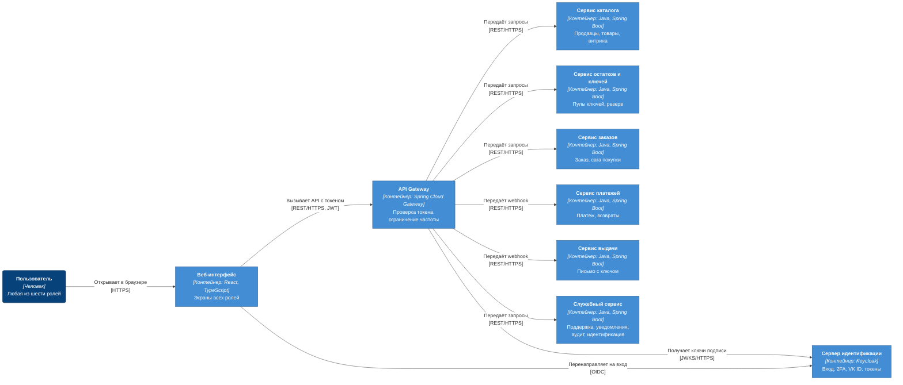
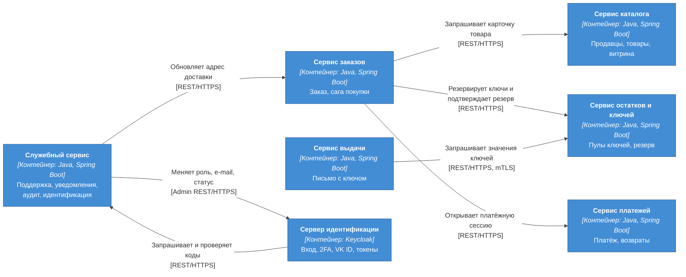
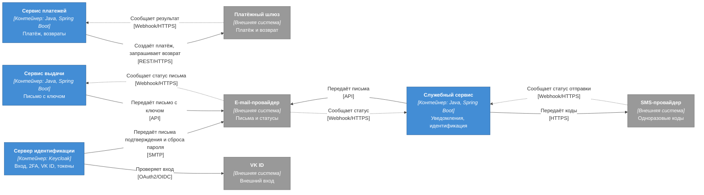
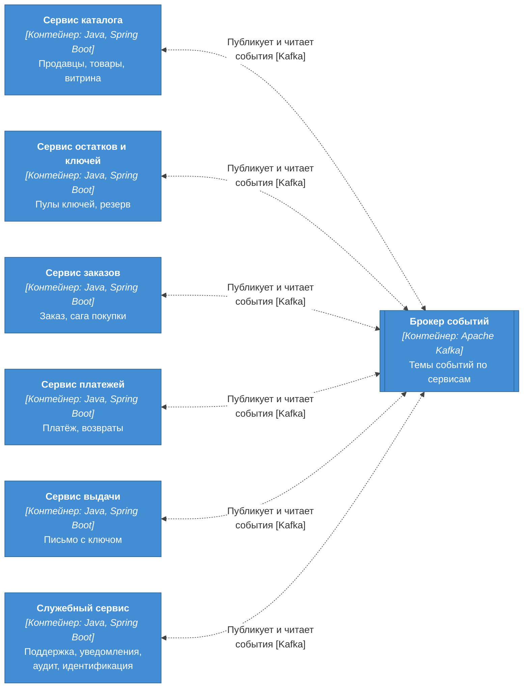
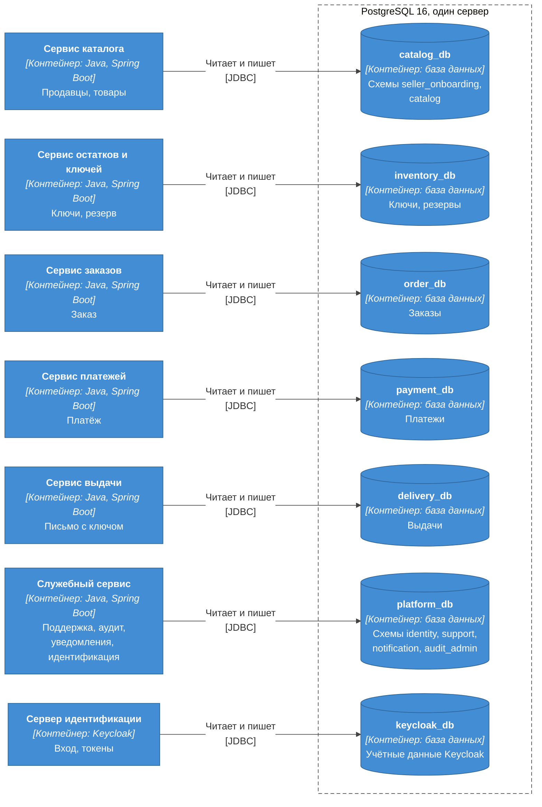
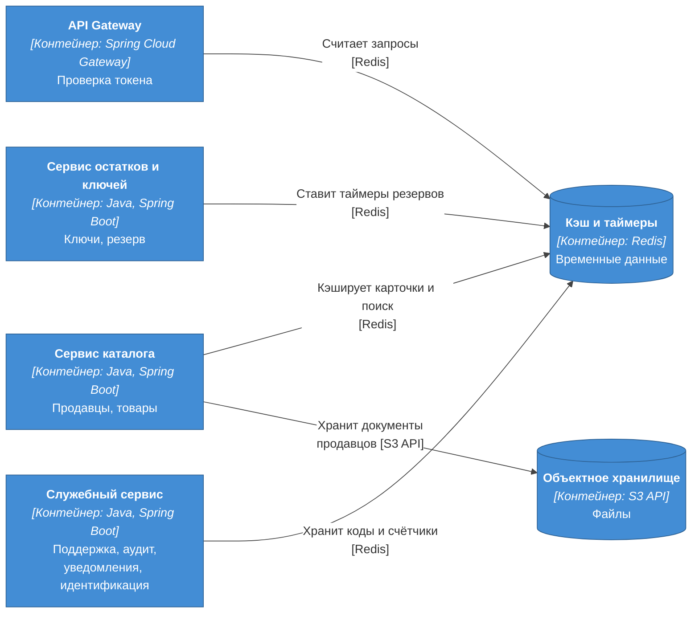
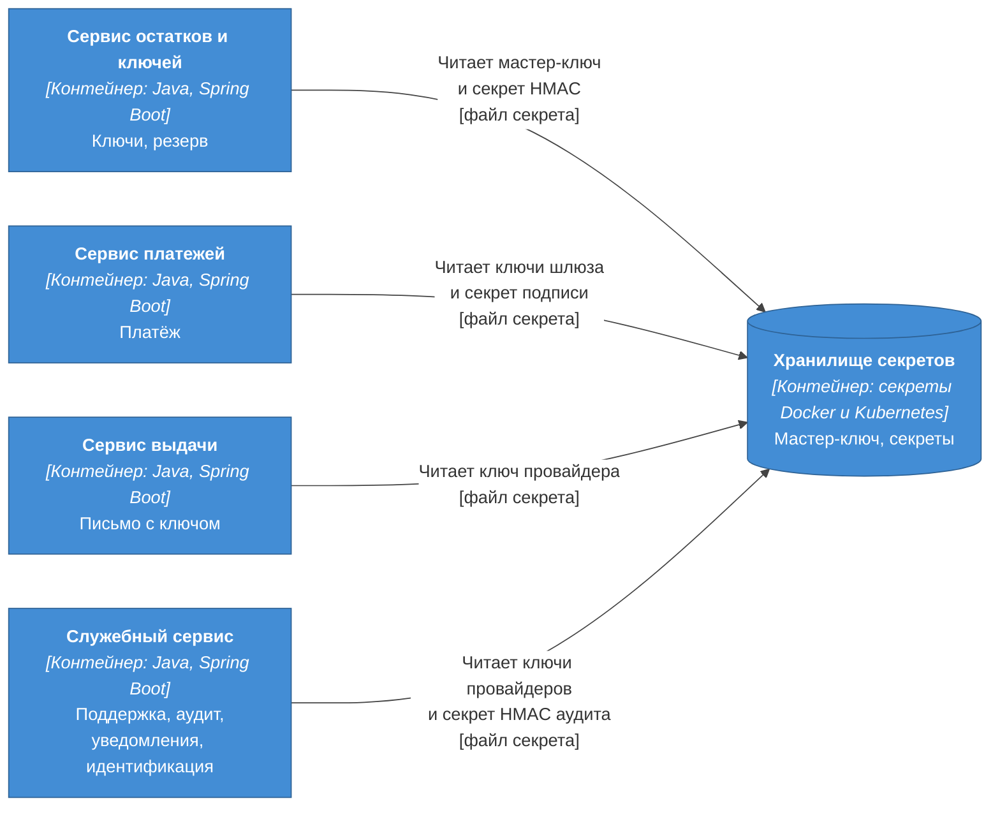
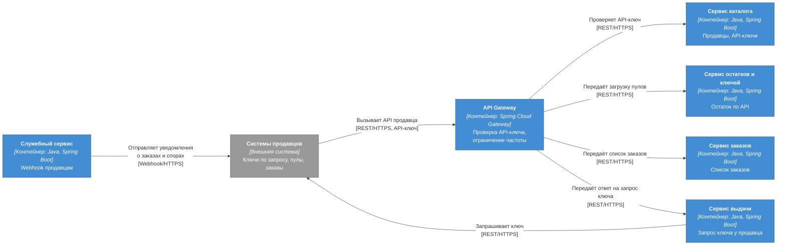
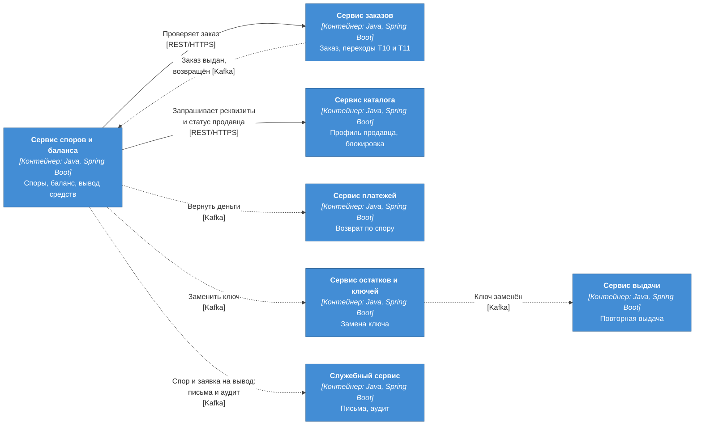

# C4, уровень 2: контейнеры

| Поле | Содержание |
| --- | --- |
| Документ | C4 Container: запускаемые части системы и хранилища, их связи |
| Фаза | Ф2, шаг 2 |
| Нотация | [c4-notation.md](c4-notation.md) |
| Основание | [decomposition.md](decomposition.md), [ADR-002](adr/ADR-002-microservices-consolidation.md), [bounded-contexts.md](../04-domain/bounded-contexts.md) |
| Предыдущий уровень | [c4-context.md](c4-context.md) |
| Следующий уровень | [c4-components.md](c4-components.md) (шаг 6), c4-deployment.md (шаг 8) |

Контейнер в C4 это отдельно запускаемое приложение или хранилище данных. Не путать с контейнером Docker: один контейнер C4 может быть несколькими экземплярами Docker, а в одном Docker может работать несколько контейнеров C4.

**Как читать.** Все контейнеры системы не помещаются на одну диаграмму с читаемыми подписями (больше 15 элементов и около 60 связей). Поэтому система показана семью диаграммами релиза R1 и двумя диаграммами расширений R2, каждая отвечает на один вопрос. Алиасы у всех диаграмм одни и те же. Полный перечень контейнеров дан в разделе 1, перечень событий в разделе 8.

## 1. Контейнеры релиза R1

| Элемент | Алиас | Тип | Технология | Ответственность | Владелец данных | Релиз |
| --- | --- | --- | --- | --- | --- | --- |
| Веб-интерфейс | `web-app` | Одностраничное приложение | React, TypeScript | Экраны всех ролей: каталог, заказ, кабинеты, очереди, параметры | Нет | R1 |
| API Gateway | `api-gateway` | Шлюз | Spring Cloud Gateway | Проверка токена, ограничение частоты, маршрутизация. Бизнес-логики нет | Нет | R1 |
| Сервер идентификации | `keycloak` | Сервер | Keycloak | Вход, 2FA, VK ID, токены OAuth2 и JWT | Учётные данные, роли, 2FA | R1 |
| Сервис каталога | `catalog-service` | Прикладной сервис | Java, Spring Boot | Подключение продавцов, товары, модерация, витрина, поиск | Профиль продавца, Товар | R1 |
| Сервис остатков и ключей | `inventory-service` | Прикладной сервис | Java, Spring Boot | Пулы ключей, шифрование, защита от дублей, резерв, значения ключей для выдачи | Ключ, Резерв | R1 |
| Сервис заказов | `order-service` | Прикладной сервис | Java, Spring Boot | Заказ, сага покупки, история заказов | Заказ | R1 |
| Сервис платежей | `payment-service` | Прикладной сервис | Java, Spring Boot | Платёжная сессия, уведомления шлюза, возвраты, ручные возвраты | Платёж | R1 |
| Сервис выдачи | `delivery-service` | Прикладной сервис | Java, Spring Boot | Письмо с ключом, повторы, статус письма, контроль 30 минут | Выдача | R1 |
| Служебный сервис | `platform-service` | Прикладной сервис | Java, Spring Boot | Идентификация (прикладной слой), поддержка, уведомления, журнал аудита, параметры | Пользователь (расширение), Обращение в поддержку, Уведомление, Одноразовый код, Параметры платформы, Журнал аудита | R1 |
| Брокер событий | `kafka` | Брокер | Apache Kafka | Доставка событий между сервисами | Нет (журнал событий) | R1 |
| Реляционные базы | `postgres` | Хранилище | PostgreSQL 16 | По базе на сервис: `catalog_db`, `inventory_db`, `order_db`, `payment_db`, `delivery_db`, `platform_db`, `keycloak_db` | Данные своих сервисов | R1 |
| Кэш и таймеры | `redis` | Хранилище | Redis | Кэш каталога, ограничение частоты, таймеры резервов, одноразовые коды | Нет (временные данные) | R1 |
| Объектное хранилище | `object-storage` | Хранилище | S3 API ([ADR-024](adr/ADR-024-object-storage.md)) | Документы продавцов | Нет (файлы по ссылкам) | R1 |
| Хранилище секретов | `secret-store` | Хранилище | Секреты Docker и Kubernetes | Мастер-ключ, секрет HMAC, ключи внешних провайдеров | Секреты | R1 |
| Заглушки внешних систем | `external-stubs` | Заглушка | Node.js, JavaScript без внешних пакетов | В проекте играет платёжный шлюз, e-mail-провайдер, SMS-провайдер и VK ID | Нет | R1 |

Внешние системы (`payment-gateway`, `email-provider`, `sms-provider`, `vk-id`) описаны в [c4-context.md](c4-context.md). На стенде их роль выполняет контейнер `external-stubs`, и для платформы граница та же, что с настоящими провайдерами.

## 2. Путь запроса пользователя

Отвечает на вопрос «как запрос пользователя доходит до сервиса».

| № | От | К | Что передаётся | Протокол | Основание |
| --- | --- | --- | --- | --- | --- |
| 1 | `user` | `web-app` | Страницы и действия пользователя | HTTPS | NFT-3.3 |
| 2 | `web-app` | `keycloak` | Вход: перенаправление, возврат с кодом, получение токена. Авторизационный код с PKCE | OIDC | FT-1.0, FT-1.1, FT-1.3 |
| 3 | `web-app` | `api-gateway` | Все вызовы API с access-токеном | REST/HTTPS, JWT | раздел 8.2 требований |
| 4 | `api-gateway` | `keycloak` | Публичные ключи для проверки подписи токенов | JWKS/HTTPS | NFT-3.0 |
| 5 | `api-gateway` | `catalog-service` | Каталог, поиск, карточки, заявки и товары продавцов, решения модератора | REST/HTTPS | FT-2.0 – FT-3.4 |
| 6 | `api-gateway` | `inventory-service` | Загрузка пулов ключей продавцом | REST/HTTPS | FT-4.1 |
| 7 | `api-gateway` | `order-service` | Оформление заказа, история заказов | REST/HTTPS | FT-5.0, FT-5.4 |
| 8 | `api-gateway` | `payment-service` | Уведомления платёжного шлюза без токена, с проверкой подписи. Операции администратора с ручными возвратами | REST/HTTPS | FT-6.2, FT-6.4 |
| 9 | `api-gateway` | `delivery-service` | Статусы писем от e-mail-провайдера без токена, с проверкой подписи | REST/HTTPS | FT-7.3 |
| 10 | `api-gateway` | `platform-service` | Подтверждение телефона, обращения и очередь поддержки, роли, параметры, журнал аудита | REST/HTTPS | FT-1.4, FT-1.5, FT-7.2, FT-7.5, FT-11.1, FT-11.2 |

Бизнес-логики в `api-gateway` нет (ADR-021): он проверяет токен и ограничивает частоту, а права на конкретную операцию проверяет сервис ([roles-permissions.md](roles-permissions.md), шаг 9).

## 3. Синхронные вызовы между сервисами

Отвечает на вопрос «кто кого вызывает и ждёт ответа». Синхронный вызов применяется там, где бизнес не может продолжить без ответа (принцип 3 bounded-contexts).

| № | От | К | Что передаётся | Протокол | Основание |
| --- | --- | --- | --- | --- | --- |
| 1 | `order-service` | `catalog-service` | «Карточка товара»: статус, цена, продавец, способ выдачи. При оформлении заказа | REST/HTTPS | BPMN-01, SM-01/T1, bounded-contexts 4.5 |
| 2 | `order-service` | `inventory-service` | «Зарезервировать ключи» при оформлении и «подтвердить резерв» после оплаты (закрепить ключи за заказом, при снятом резерве повторно зарезервировать, [ADR-004](adr/ADR-004-saga-purchase.md)). Ответ: резерв активен на 15 минут или ключей не хватает. Сравнение с gRPC в ADR-016 (Ф5) | REST/HTTPS | FT-5.2, FT-6.5, NFT-1.2 |
| 3 | `order-service` | `payment-service` | «Открыть платёжную сессию» на 12 минут | REST/HTTPS | FT-5.2, FT-6.1 |
| 4 | `delivery-service` | `inventory-service` | «Значения ключей по заказу» для письма. Значения не пишутся в логи | REST/HTTPS, mTLS | NFT-3.2, решение 11 доменной модели |
| 5 | `platform-service` | `order-service` | «Обновить адрес доставки» из учётной записи. Вызывает модуль `support` при повторной отправке | REST/HTTPS | FT-7.5, решение 3 раздела 6 bounded-contexts |
| 6 | `platform-service` | `keycloak` | Назначить роль, сменить e-mail, деактивировать. Вызывает модуль `identity` | Admin REST/HTTPS | FT-1.4, FT-7.5, решение 2 доменной модели |
| 7 | `keycloak` | `platform-service` | «Отправить код» и «проверить код» для входа по SMS и подтверждения телефона. Вызывает расширение Keycloak (граница в ADR-010) | REST/HTTPS | FT-1.5, FT-1.7, NFT-3.7 |

Внутри `platform-service` модуль `support` вызывает модули `identity` и `notification` через интерфейсы модулей, не по сети: на диаграмме контейнеров этих вызовов нет.

## 4. Внешние системы

Отвечает на вопрос «кто разговаривает с внешним миром». Внешняя система доступна только через переводчик (anti-corruption layer) своего сервиса: `payment-service` для шлюза, `delivery-service` и `platform-service` для e-mail, `platform-service` для SMS.

| № | От | К | Что передаётся | Протокол | Основание |
| --- | --- | --- | --- | --- | --- |
| 1 | `payment-service` | `payment-gateway` | Данные заказа и сумма, запрос возврата | REST/HTTPS | FT-6.0, FT-6.4 |
| 2 | `payment-gateway` | `payment-service` | Результат платежа и возврата. Приходит через `api-gateway` с подписью | Webhook/HTTPS | FT-6.2, FT-6.5 |
| 3 | `delivery-service` | `email-provider` | Письмо с ключом. Напрямую, мимо Kafka и `platform-service` | API | FT-7.0, NFT-3.2 |
| 4 | `email-provider` | `delivery-service` | Статус письма: принято, доставлено, отказ. Приходит через `api-gateway` | Webhook/HTTPS | FT-7.3 |
| 5 | `platform-service` | `email-provider` | Остальные письма: заказ создан, оплачен, возврат, решения по заявкам и товарам | API | FT-11.0, FT-11.4 |
| 6 | `email-provider` | `platform-service` | Статус этих писем, недоставленные идут в очередь повторов | Webhook/HTTPS | FT-11.0 |
| 7 | `platform-service` | `sms-provider` | Одноразовые коды | HTTPS | FT-1.5, FT-1.7, NFT-3.7 |
| 8 | `sms-provider` | `platform-service` | Статус отправки кода | Webhook/HTTPS | раздел 1.3 требований |
| 9 | `keycloak` | `vk-id` | Вход через внешнего провайдера, Keycloak выступает брокером | OAuth2/OIDC | FT-1.1 |
| 10 | `keycloak` | `email-provider` | Письма самого Keycloak: подтверждение почты, сброс пароля. У заглушки e-mail-провайдера есть интерфейс SMTP | SMTP | FT-1.0, FT-1.2 |

Связь 10 новая для Ф2: она не видна на карте контекстов Ф1, но следует из FT-1.0 и FT-1.2 (подтверждение почты и восстановление пароля делает Keycloak). Заглушка e-mail-провайдера поэтому принимает и API, и SMTP.

## 5. События через Kafka

Отвечает на вопрос «кто с кем общается без ожидания ответа». Сервисы публикуют события через Transactional Outbox (ADR-005) и читают их с идемпотентной обработкой (ADR-006). Какое событие кто публикует и читает, показано в разделе 8, на диаграмме только направление.

Брокер нарисован одним узлом с прямоугольником «двойные границы» (`[[…]]`), как очередь. Шесть стрелок означают, что каждый сервис и публикует, и читает. Темы, ключи партиционирования и схемы событий задаются в соглашениях и в AsyncAPI (шаг 10).

## 6. Базы данных

Отвечает на вопрос «чьи данные где лежат». Один сервер PostgreSQL 16, на нём по базе на каждый сервис. Общих баз и обращений одного сервиса к базе другого нет.

| База | Владелец | Схемы | Что хранит |
| --- | --- | --- | --- |
| `catalog_db` | `catalog-service` | `seller_onboarding`, `catalog` | Профили продавцов, ссылки на документы, товары, модель чтения витрины |
| `inventory_db` | `inventory-service` | одна | Ключи (шифртекст, HMAC), резервы, копия данных товара, `outbox`, `processed_events` |
| `order_db` | `order-service` | одна | Заказы со снимками, модель чтения истории, `outbox`, `processed_events` |
| `payment_db` | `payment-service` | одна | Платежи, попытки возврата, очередь ручных возвратов, дедупликация уведомлений |
| `delivery_db` | `delivery-service` | одна | Выдачи, попытки отправки, статусы писем |
| `platform_db` | `platform-service` | `identity`, `support`, `notification`, `audit_admin` | Телефоны и привязки, обращения и очередь, уведомления и коды, параметры, журнал аудита |
| `keycloak_db` | `keycloak` | собственные таблицы Keycloak | Учётные данные, роли, сессии. Схему ведёт Keycloak |

Физические модели и DDL появятся на шаге 12 в [07-data](../07-data/README.md).

## 7. Кэш и объектное хранилище

Отвечает на вопрос «где лежат временные данные и файлы».

| № | От | К | Что | Основание |
| --- | --- | --- | --- | --- |
| 1 | `api-gateway` | `redis` | Счётчики ограничения частоты запросов. R2: кэш проверки API-ключа | NFT-3.5 |
| 2 | `catalog-service` | `redis` | Кэш карточек и результатов поиска | NFT-1.0, NFT-1.1 |
| 3 | `inventory-service` | `redis` | Таймеры резервов. Источник истины остаётся в PostgreSQL ([ADR-012](adr/ADR-012-reservation-redis-timer.md)) | FT-5.2 |
| 4 | `platform-service` | `redis` | Одноразовые коды с временем жизни 5 минут, счётчики попыток и запросов. Хранение кодов в Redis решено в [ADR-010](adr/ADR-010-keycloak-sms-codes.md) | NFT-3.5, NFT-3.7 |
| 5 | `catalog-service` | `object-storage` | Документы продавцов, бакет закрытый, хранилище в РФ | NFT-5.0 |

Файлы CSV с пулами ключей в объектном хранилище не хранятся: сервис читает их потоком и сразу шифрует, иначе копия с открытыми значениями жила бы вне шифрования ([ADR-009](adr/ADR-009-key-encryption-hmac.md)). Остальные сервисы Redis не используют: срок платёжной сессии закрывает шлюз, контроль 30 минут и повторы выдачи живут в базе `delivery-service` ([ADR-011](adr/ADR-011-guaranteed-delivery.md)), таймер резерва только у `inventory-service` ([ADR-012](adr/ADR-012-reservation-redis-timer.md)).

### 7.1. Секреты

Отвечает на вопрос «кто читает секреты». Секреты лежат вне базы данных (NFT-3.2) и монтируются в контейнер файлами.

| № | От | К | Что | Основание |
| --- | --- | --- | --- | --- |
| 1 | `inventory-service` | `secret-store` | Мастер-ключ AES-256 и секрет HMAC для проверки дублей | NFT-3.2 |
| 2 | `payment-service` | `secret-store` | Ключ доступа к шлюзу, секрет проверки подписи уведомлений | FT-6.0 |
| 3 | `delivery-service` | `secret-store` | Ключ доступа к e-mail-провайдеру | FT-7.0 |
| 4 | `platform-service` | `secret-store` | Ключи e-mail- и SMS-провайдеров, секрет HMAC для журнала аудита | NFT-5.3 |

Секреты Keycloak (пароль администратора, ключи подписи токенов) хранит сам Keycloak в своей базе и конфигурации. Диаграмма показывает секреты прикладных сервисов.

## 8. Какие события кто публикует и читает

Названия событий даны по смыслу, как в Ф1. Технические имена, схемы и темы фиксирует [asyncapi.yaml](../06-api/asyncapi/asyncapi.yaml), сводка в [каталоге событий](../06-api/events/README.md).

| Событие | Издатель | Подписчики | Зачем |
| --- | --- | --- | --- |
| Профиль одобрен | `catalog-service` | `platform-service` | Модуль `identity` назначает роль «Продавец», `notification` пишет продавцу |
| Профиль отклонён, возвращён на доработку | `catalog-service` | `platform-service` | Письмо продавцу (FT-2.2, FT-11.4) |
| Товар создан, изменён | `catalog-service` | `inventory-service` | Копия идентификатора товара, продавца и способа выдачи для проверки прав |
| Товар опубликован, отклонён, заблокирован | `catalog-service` | `platform-service` | Письмо продавцу о решении (FT-11.4) |
| Остаток изменился | `inventory-service` | `catalog-service` | Остаток на витрине |
| Резерв истёк, резерв снят | `inventory-service` | `order-service` | Отмена заказа по сроку |
| Заказ оплачен | `order-service` | `delivery-service`, `platform-service` | Создать выдачу и запустить контроль 30 минут, письмо «Заказ оплачен». Ключи к этому моменту уже закреплены синхронным подтверждением резерва |
| Заказ создан, возвращён | `order-service` | `platform-service` | Письма покупателю «Заказ создан» и «Возврат» (FT-11.0). R2: «возвращён» читает и `finance-service` |
| Заказ выдан | `order-service` | `platform-service` (`support`). R2: `finance-service` | Модель чтения поддержки: заказ, покупатель и время первичной выдачи для окна 72 часа (INV-22). R2: начисление продавцу и комиссия. Отдельного письма нет: письмом «Ключ выдан» служит письмо с ключом, которое отправляет `delivery-service` (SM-01, «Уведомления покупателю») |
| Заказ отменён | `order-service` | `inventory-service` | Снять резерв. Письма нет: причину отмены показывает интерфейс (SM-01, «Уведомления покупателю») |
| Адрес доставки обновлён | `order-service` | `delivery-service` | Повторная выдача по новому адресу |
| Вернуть деньги | `order-service` | `payment-service` | Автовозврат при поздней оплате |
| Платёж подтверждён, отклонён, возвращён | `payment-service` | `order-service` | Сага: оплачен, отменён, возвращён |
| Возврат ждёт администратора | `payment-service` | `platform-service` | Оповещение администратора, запись в журнал (FT-6.4) |
| Письмо принято | `delivery-service` | `order-service`, `platform-service` | Заказ становится «выдан». Статус выдачи в модели чтения поддержки |
| Выдача доставлена | `delivery-service` | `platform-service` | Закрыть обращение системы, обновить статус выдачи в модели чтения поддержки |
| Выдача не удалась, 30 минут без доставки | `delivery-service` | `platform-service` | Обращение системы, оповещение администратора (NFT-2.4) |
| E-mail изменён, пользователь деактивирован | `platform-service` (`identity`) | `platform-service` (`notification`) | Письма о смене e-mail и деактивации (FT-11.0) |
| Пользователь зарегистрирован, роль назначена, телефон подтверждён | `platform-service` (`identity`) | Потребителей в R1 нет | Факт для метрик и расширения. Журнал аудита ведут события `audit.recorded`, а не эти |
| Пользователь анонимизирован | `platform-service` (`identity`) | `order-service`, `delivery-service` | Очистить снимок e-mail в заказах и снимок адреса в выдачах (INV-44, [ADR-014](adr/ADR-014-audit-log-no-pii.md)) |
| Обращение создано, решено | `platform-service` (`support`) | Потребителей в R1 нет | Метрики очереди. Журнал действий оператора ведут события `audit.recorded` |
| Письмо не доставлено | `platform-service` (`notification`) | Метрика и оповещение | NFT-6.1 |
| Параметры изменены | `platform-service` (`audit_admin`) | Все сервисы R1 | Каждый хранит копию значений (решение 7 раздела 6 bounded-contexts) |
| События аудита | Все сервисы | `platform-service` (`audit_admin`) | Журнал аудита действий сотрудников (FT-11.2) |

Событие «пользователь зарегистрирован» и остальные идентификационные события публикует модуль `identity`. Они нужны только внутри `platform-service` (кроме «пользователь анонимизирован», которое читают `order-service` и `delivery-service`), но публикуются тем же способом, что и между сервисами (правило 4 раздела 7 decomposition.md), поэтому выделение модуля потом не меняет контракт.

### 8.1. События релиза R2

| Событие | Издатель | Подписчики | Зачем |
| --- | --- | --- | --- |
| Продавец заблокирован, блокировка снята | `catalog-service` (`seller_onboarding`) | `catalog-service` (`catalog`) | Товары продавца блокируются и возвращаются. Внутри сервиса, поэтому на диаграммах нет |
| API-ключ выпущен, API-ключ отозван | `catalog-service` (`seller_onboarding`) | `platform-service` | Запись в журнал. Шлюз события не читает: кэш проверки ключа живёт 30 секунд, отзыв действует не позже ([ADR-021](adr/ADR-021-api-gateway.md)) |
| Ключ аннулирован, ключ заменён, замена ключа не удалась | `inventory-service` | `delivery-service`, `finance-service` | Повторная выдача, результат исполнения решения по спору |
| Продавец не ответил | `delivery-service` | `order-service` | Тайм-аут API продавца: заказ отменяется, автовозврат (SM-01/T10) |
| Спор открыт, спор решён, спор возвращён модератору | `finance-service` (`disputes`) | `finance-service` (`balance`), `platform-service` | Заморозка и разморозка денег, письма, журнал решений модератора |
| Вернуть деньги, заменить ключ (события-команды по решению спора) | `finance-service` (`disputes`) | `payment-service`, `inventory-service` | Исполнение решения: возврат тем же путём, что автовозврат, и замена ключа |
| Деньги доступны, заявка на вывод создана, заявка выплачена, заявка отклонена | `finance-service` (`balance`) | `platform-service` | Письмо продавцу о результате заявки (FT-11.4), журнал решений администратора |

## 9. Расширения релиза R2

Две диаграммы показывают только то, что R2 добавляет или меняет. Связи R1 остаются. Новый контейнер: `finance-service`, база `finance_db` со схемами `disputes` и `balance`.

### 9.1. API продавца и webhook

| № | От | К | Что передаётся | Протокол | Основание |
| --- | --- | --- | --- | --- | --- |
| 1 | `seller-systems` | `api-gateway` | API продавца: пулы, заказы, ответы на запросы ключа | REST/HTTPS, API-ключ | FT-10.1, FT-10.2 |
| 2 | `api-gateway` | `catalog-service` | Проверка API-ключа с кэшем в Redis | REST/HTTPS | FT-10.0, NFT-3.4 |
| 3 | `api-gateway` | `inventory-service` | Загрузка пулов ключей | REST/HTTPS | FT-10.1 |
| 4 | `api-gateway` | `order-service` | Список заказов продавца | REST/HTTPS | FT-10.1 |
| 5 | `api-gateway` | `delivery-service` | Ответ продавца на запрос ключа | REST/HTTPS | FT-10.2 |
| 6 | `delivery-service` | `seller-systems` | «Запросить ключ», ответ ждём 10 минут | REST/HTTPS | FT-7.4, FT-8.6 |
| 7 | `platform-service` | `seller-systems` | Уведомления о заказах и спорах | Webhook/HTTPS | FT-10.3 |

### 9.2. Споры, баланс и вывод средств

| № | От | К | Что передаётся | Протокол | Основание |
| --- | --- | --- | --- | --- | --- |
| 1 | `finance-service` | `order-service` | «Проверить заказ и дату первичной выдачи» при открытии спора | REST/HTTPS | FT-8.0, bounded-contexts 4.9 |
| 2 | `finance-service` | `catalog-service` | «Реквизиты и статус продавца» при заявке на вывод | REST/HTTPS | FT-9.3 |
| 3 | `order-service` | `finance-service` | Заказ выдан (начисление и комиссия), заказ возвращён (сторно) | Kafka | FT-9.2, FT-9.5 |
| 4 | `finance-service` | `payment-service` | Вернуть деньги по решению спора | Kafka | FT-8.4 |
| 5 | `finance-service` | `inventory-service` | Заменить ключ по решению спора | Kafka | FT-8.6 |
| 6 | `inventory-service` | `delivery-service` | Ключ заменён: повторная выдача | Kafka | FT-8.6 |
| 7 | `finance-service` | `platform-service` | События споров и заявок: письма и журнал | Kafka | FT-11.4 |

Блокировка продавца внутри `catalog-service` (модуль `seller_onboarding` сообщает модулю `catalog`) на диаграммах не показана: она не выходит за границу контейнера. Банк для выплат связи с платформой не имеет (FT-9.3), поэтому в R2 его тоже нет на диаграммах контейнеров.

## 10. Проверка

| Проверка | Результат |
| --- | --- |
| Каждый сервис из [decomposition.md](decomposition.md) есть в таблице контейнеров и на диаграммах | Выполнено, алиасы сверены скриптом |
| Каждый синхронный вызов из bounded-contexts.md присутствует на диаграмме 3 | Выполнено: карточка товара, резерв и подтверждение резерва, платёжная сессия, значения ключей, адрес доставки, смена e-mail, SMS-код (в модель контейнеров переложены на Keycloak и `platform-service`) |
| Нет связей, которых нет в bounded-contexts.md | Три связи новые, и они объяснены: Keycloak → e-mail-провайдер по SMTP (раздел 4, связь 10), `platform-service` → Keycloak по Admin REST и Keycloak → `platform-service` для кодов (следствие решения об идентификации в decomposition.md, раздел 3.1) |
| События из bounded-contexts.md присутствуют в разделе 8 | Выполнено |
| Нет общей базы данных | Выполнено: 7 баз на одном сервере, у каждого сервиса своя |
| Ни один контейнер не владеет чужой сущностью | Выполнено, владельцы в таблице раздела 1 и в decomposition.md 10.1 |
| Ключи не попадают в Kafka и в `platform-service` | Выполнено: значения идут только от `inventory-service` к `delivery-service` по mTLS, письмо уходит прямо провайдеру |
| На диаграмме не больше 15 элементов | Выполнено, максимум 14 (диаграмма баз данных) |

## 11. Решения

| № | Вопрос | Решение | Причина |
| --- | --- | --- | --- |
| 1 | Как показать систему | Семь диаграмм R1 по вопросам, две диаграммы R2 | Одна диаграмма всех контейнеров превышает 15 элементов и нечитаема |
| 2 | Показывать ли пользователей | Одним элементом «Пользователь» с шестью ролями | Роли подробно на [контексте](c4-context.md), здесь важен путь запроса |
| 3 | Как показать Kafka | Узлом с двойной стрелкой от каждого сервиса, события в таблице | Прямые стрелки между сервисами уже нарисованы на карте контекстов Ф1, здесь нужна роль брокера |
| 4 | Как показать внутренние вызовы модулей `platform-service` | Не показывать | Они не пересекают границу контейнера, их место на диаграмме компонентов |
| 5 | Webhook шлюза и e-mail-провайдера | Приходят через `api-gateway` | Одна точка входа из интернета, один набор правил ограничения частоты, подпись проверяет сервис |
| 6 | Событие «пользователь анонимизирован» | Добавлено в Ф2 (шаг 6) для `order-service` и `delivery-service` | Без него INV-44 нечем обеспечить: снимки e-mail и адреса лежат в двух сервисах ([c4-components.md](c4-components.md)) |
| 7 | Письма об отмене заказа и о выдаче | Не отправляются: `platform-service` не читает `order.cancelled`, а `order.issued` читает только для модели чтения поддержки | SM-01 («Уведомления покупателю»): при отмене письма нет, а письмом «Ключ выдан» служит само письмо с ключом. Окно обращения 72 часа считается от первичной выдачи, поэтому поддержке нужно время `order.issued`. Поправка найдена при проектировании sequence-диаграмм (шаг 7) |
