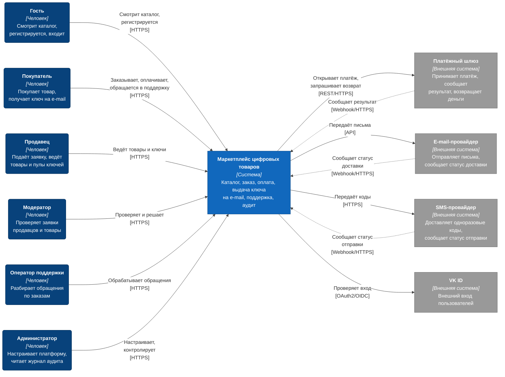
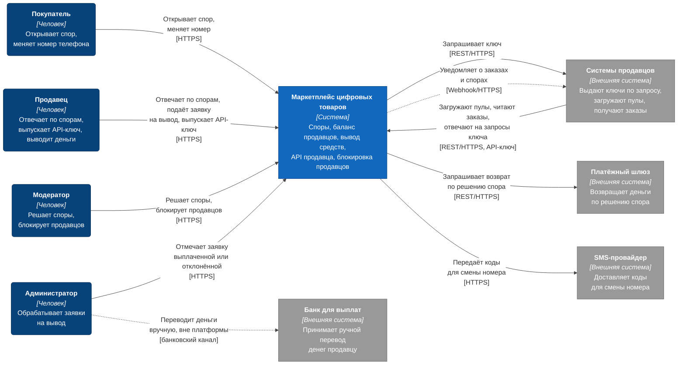

# C4, уровень 1: контекст системы

| Поле | Содержание |
| --- | --- |
| Документ | C4 Context: система, люди, внешние системы |
| Фаза | Ф2, шаг 1 |
| Нотация | [c4-notation.md](c4-notation.md) |
| Требования | Разделы 1.3 «Границы системы», 2.2 «Допущения» (эмуляция) и 3 «Ролевая модель» [требований v1.6](../02-requirements/requirements_v1.6.md), FT-1.1, FT-6.0, FT-7.0, FT-7.3 |
| Следующий уровень | [c4-containers.md](c4-containers.md) |

Контекст отвечает на вопрос «что это за система, кто ей пользуется и с чем она связана». Внутреннее устройство здесь не показано: система изображена одним блоком.

## 1. Релиз R1

### 1.1. Люди

| Элемент | Алиас | Что делает на платформе | Роль в [требованиях](../02-requirements/requirements_v1.6.md), раздел 3 | Релиз |
| --- | --- | --- | --- | --- |
| Гость | `guest` | Смотрит каталог, ищет и фильтрует товары, регистрируется по e-mail или через VK ID, входит | Гость | R1 |
| Покупатель | `buyer` | Подтверждает телефон, оформляет заказ без корзины, оплачивает, видит историю заказов, обращается в поддержку | Покупатель | R1 |
| Продавец | `seller` | Подаёт заявку на статус продавца, ведёт товары и пулы ключей, видит заказы. Вход только со вторым фактором | Продавец | R1 |
| Модератор | `moderator` | Решает по заявкам продавцов и по товарам. Вход только со вторым фактором | Модератор | R1 |
| Оператор поддержки | `support-operator` | Обрабатывает обращения, повторно отправляет ключ, меняет e-mail покупателя. Вход только со вторым фактором | Оператор поддержки | R1 |
| Администратор | `admin` | Управляет ролями и параметрами, смотрит журнал аудита и зависшие заказы. Вход только со вторым фактором | Администратор | R1 |

Роль «Система» из раздела 3 требований на диаграмме не рисуется: это сама платформа (резервирование, выдача, повторы выполняются внутри). Её работа видна на диаграммах следующих уровней.

### 1.2. Системы

| Элемент | Алиас | Назначение | Граница ответственности | В проекте | Релиз |
| --- | --- | --- | --- | --- | --- |
| Маркетплейс цифровых товаров | `marketplace` | Каталог, заказ, оплата, выдача ключа на e-mail, поддержка, уведомления, журнал аудита | Всё, что входит в раздел 1.3 требований | Разрабатывается | R1 |
| Платёжный шлюз | `payment-gateway` | Принимает платёж, возвращает результат, выполняет возврат, хранит данные карт | Мы передаём данные заказа, инициируем возврат и получаем уведомления. Данные карт не храним (FT-6.0) | Заглушка | R1 |
| E-mail-провайдер | `email-provider` | Отправляет письма покупателям и продавцам, сообщает статус отправки и доставки | Мы передаём письмо и получаем статус. «Принято провайдером» открывает статус заказа «выдан», «доставлено» измеряет цель по выдаче (раздел 4 требований, FT-7.0) | Заглушка | R1 |
| SMS-провайдер | `sms-provider` | Доставляет одноразовые коды подтверждения | Мы передаём код и получаем статус отправки | Заглушка | R1 |
| VK ID | `vk-id` | Внешний вход пользователей | Подключается через единый сервис аутентификации (FT-1.1) | Заглушка | R1 |

**Заглушки.** В проекте оплата, e-mail, SMS и VK ID реализуются заглушками (раздел 2.2 требований). Все четыре играет один контейнер «Заглушки внешних систем» (`external-stubs`, см. [c4-containers.md](c4-containers.md)). На этой диаграмме они остаются внешними системами: для платформы граница та же, что с настоящими провайдерами. Заглушка платёжного шлюза умеет имитировать позднее подтверждение платежа, повторные уведомления и отказ в возврате, это нужно для проверки поздней оплаты и идемпотентности.

### 1.3. Связи

| № | От | К | Что передаётся | Канал | Требования | Релиз |
| --- | --- | --- | --- | --- | --- | --- |
| 1 | `guest` | `marketplace` | Поиск и просмотр каталога, регистрация, вход | HTTPS | FT-1.0, FT-1.1, FT-3.3, FT-3.4 | R1 |
| 2 | `buyer` | `marketplace` | Подтверждение телефона, заказ, оплата, обращения в поддержку | HTTPS | FT-1.5, FT-5.0, FT-5.4, FT-7.2 | R1 |
| 3 | `seller` | `marketplace` | Заявка на подключение, товары, пулы ключей | HTTPS | FT-2.0, FT-3.0, FT-4.1 | R1 |
| 4 | `moderator` | `marketplace` | Решения по заявкам и товарам | HTTPS | FT-2.1, FT-3.2 | R1 |
| 5 | `support-operator` | `marketplace` | Работа с обращениями, повторная отправка ключа, смена e-mail | HTTPS | FT-7.5 | R1 |
| 6 | `admin` | `marketplace` | Роли, параметры, просмотр журнала | HTTPS | FT-1.4, FT-11.1, FT-11.2 | R1 |
| 7 | `marketplace` | `payment-gateway` | Данные заказа и сумма для платёжной сессии, запрос возврата | REST/HTTPS | FT-6.0, FT-6.4 | R1 |
| 8 | `payment-gateway` | `marketplace` | Результат платежа и возврата (в том числе повторные и поздние уведомления) | Webhook/HTTPS | FT-6.2, FT-6.5 | R1 |
| 9 | `marketplace` | `email-provider` | Письма: ключ, подтверждение, оповещения | API провайдера | FT-7.0, FT-11.0 | R1 |
| 10 | `email-provider` | `marketplace` | Статус письма: принято, доставлено, отказ | Webhook/HTTPS | FT-7.3 | R1 |
| 11 | `marketplace` | `sms-provider` | Одноразовые коды подтверждения | HTTPS | FT-1.5, FT-1.7 | R1 |
| 12 | `sms-provider` | `marketplace` | Статус отправки кода | Webhook/HTTPS | раздел 1.3 требований, строка «SMS-провайдер» | R1 |
| 13 | `marketplace` | `vk-id` | Проверка входа через внешнего провайдера | OAuth2/OIDC | FT-1.1 | R1 |

Каналы между платформой и внешними системами указаны так, как они записаны в контрактах интеграции (ADR-015 для шлюза). Уточнение конкретных протоколов на уровне сервисов происходит на диаграмме контейнеров.

## 2. Расширения релиза R2

Диаграмма показывает только то, что R2 добавляет или меняет. Связи R1 остаются.

### 2.1. Что нового

| Элемент или связь | Алиас | Что добавляет R2 | Требования |
| --- | --- | --- | --- |
| Системы продавцов | `seller-systems` | Платформа запрашивает у них ключ и ждёт ответ не дольше 10 минут. Они загружают пулы ключей, читают список заказов, отвечают на запросы выдачи. Платформа отправляет им уведомления о заказах и спорах | FT-4.0, FT-7.4, FT-8.6, FT-10.0, FT-10.1, FT-10.2, FT-10.3 |
| Банк для выплат | `bank` | Платформа деньги не переводит. Администратор переводит их вне платформы и отмечает заявку выплаченной. Связи между платформой и банком нет, поэтому она не нарисована. В проекте банк эмулируется: перевод фиксируется только отметкой администратора | FT-9.3, BPMN-06 |
| Связь `admin` → `bank` | | Ручной перевод вне платформы (пунктир, потому что не часть системы) | FT-9.3 |
| Связь `marketplace` → `payment-gateway` | | Возврат по решению спора добавляется к автовозврату R1 тем же механизмом, возврат всегда полный | FT-8.4 |
| Связь `marketplace` → `sms-provider` | | Коды для смены номера телефона | FT-1.6 |
| Покупатель, продавец, модератор, администратор | | Новые действия: споры, баланс и вывод, блокировка продавцов, API-ключ | FT-8.0, FT-9.2, FT-9.3, FT-2.3, FT-10.0 |

Для интеграции с системами продавцов платформа выступает в роли Open Host Service: контракт публикуется один раз (OpenAPI, версии), продавцы подстраиваются под него. В обратную сторону, при вызове API продавца, действует слой защиты от чужой модели (Anti-corruption layer), раздел 5 «Отношения между контекстами» в [bounded-contexts.md](../04-domain/bounded-contexts.md).

### 2.2. Релиз R3

Новых людей и внешних систем R3 не добавляет: динамическая шкала комиссии, отчёты с экспортом и автоматизация модерации выполняются внутри платформы. Отдельная диаграмма не нужна.

## 3. Что не показано

| Что | Почему |
| --- | --- |
| Роль «Система» | Это сама платформа, показана блоком `marketplace` |
| Внутренние сервисы, брокер, базы | Это уровень контейнеров, [следующий документ](c4-containers.md) |
| Хранилище документов продавцов (S3-совместимое в РФ) | Хранилище входит в состав платформы и размещается в РФ (152-ФЗ), на контексте это внутренняя часть системы |
| Внешняя платёжная форма шлюза, на которую покупатель попадает при оплате | Данные карты вводятся на стороне шлюза, а не в платформе. Покупатель при этом остаётся пользователем платформы. Подробности в ADR-015 |

## 4. Решения

| Вопрос | Решение | Причина |
| --- | --- | --- |
| Рисовать ли заглушки отдельными системами | Да, как внешние системы, с пометкой «Заглушка» в таблице | Для платформы граница та же, что с настоящими провайдерами: сменяемость провайдера проверяется при смене заглушки на настоящий шлюз |
| Рисовать ли банк в R1 | Нет | Банк связан с выводом средств, это R2 (FT-9.3). В R1 ни одной связи с банком нет |
| Связь `marketplace` → `bank` | Не рисуем | По FT-9.3 платформа деньги не переводит, это делает администратор вручную |
| Как показать SMS-провайдера в R1 | Одна исходящая связь для кодов и одна входящая для статуса отправки | Раздел 1.3 требований: «передаём код и получаем статус отправки» |
