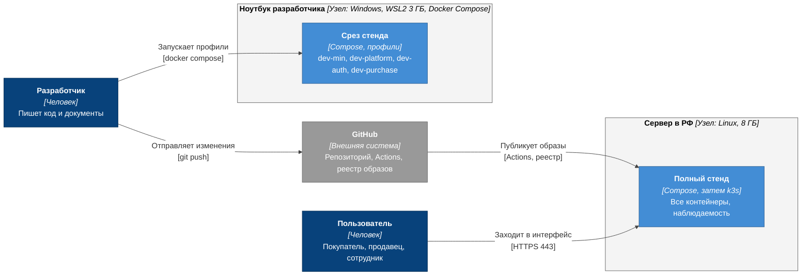
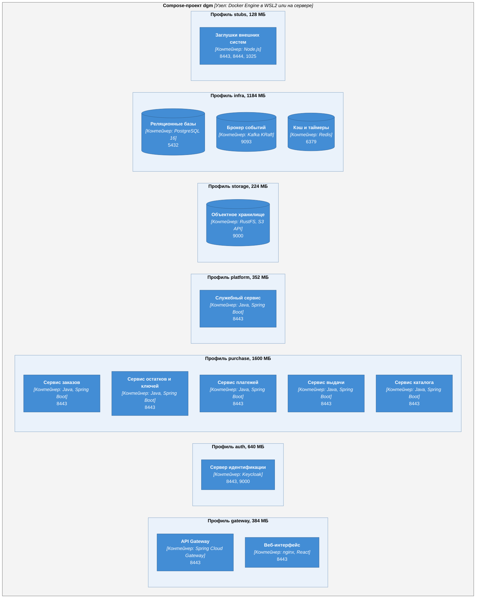
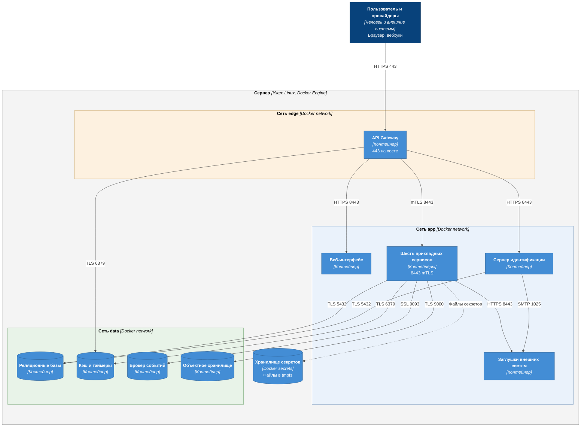
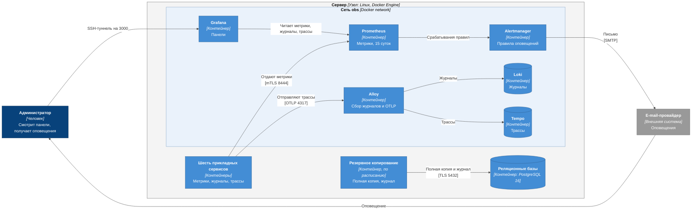
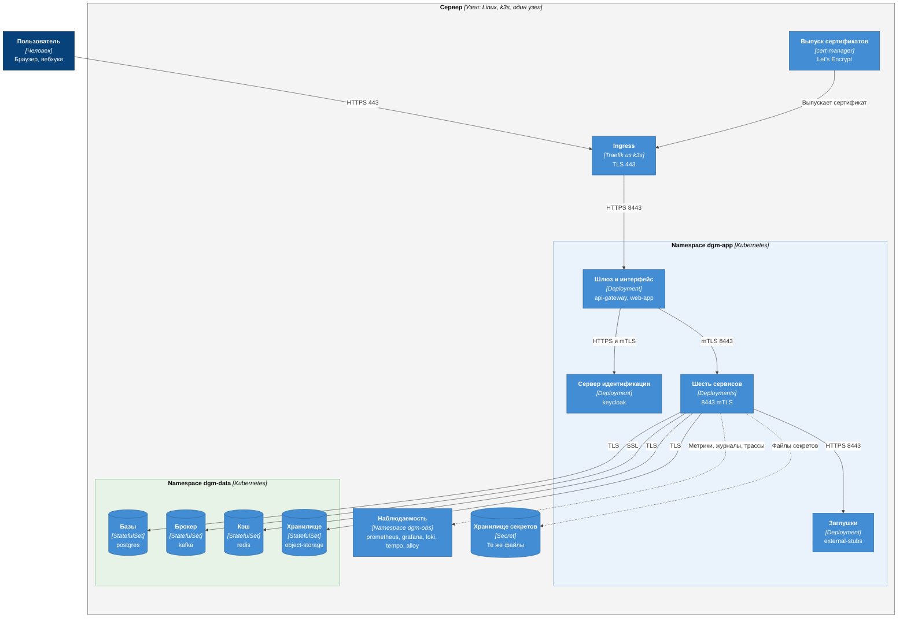

# C4: диаграммы развёртывания

| Поле | Содержание |
| --- | --- |
| Документ | Где и как запускаются контейнеры системы: среды, профили Docker Compose, сети, порты, тома, секреты, наблюдаемость, переход на k3s |
| Фаза | Ф2, шаг 8 |
| Основание | [c4-containers.md](c4-containers.md) (список контейнеров), [ADR-002](adr/ADR-002-microservices-consolidation.md) (профили Compose), [ADR-003](adr/ADR-003-kafka-events.md), [ADR-012](adr/ADR-012-reservation-redis-timer.md), [ADR-021](adr/ADR-021-api-gateway.md), [ADR-022](adr/ADR-022-internal-traffic-encryption.md) (TLS во всех профилях), NFT-3.3, NFT-4.1, NFT-4.2, NFT-5.0, NFT-6.0, NFT-6.1 |
| Нотация | [c4-notation.md](c4-notation.md), раздел 9 (вложенные узлы развёртывания) |
| Числа | Лимиты памяти и профили: [memory-budget.md](../09-operations/memory-budget.md). Сроки и тайм-ауты: [time-budgets.md](time-budgets.md) |
| Предыдущий уровень | [c4-containers.md](c4-containers.md) |
| Проверка | Скрипт `check_budgets.py`: каждый контейнер из c4-containers.md есть на диаграмме, не больше 15 элементов, суммы по профилям на диаграмме равны [memory-budget.md](../09-operations/memory-budget.md) |

Диаграмма развёртывания отвечает на вопрос «на чём это работает». Контейнеры C4 из [c4-containers.md](c4-containers.md) здесь расставлены по узлам: ноутбук разработчика, сервер, сети и профили. Один контейнер C4 соответствует одному контейнеру Docker (экземпляров по одному, масштабирование по NFT-1.3 добавляется на сервере позже), поэтому названия и алиасы те же.

Что добавилось по сравнению с c4-containers.md: инфраструктурные контейнеры, которых нет в логической архитектуре, потому что они не решают задач предметной области, но нужны для работы и проверки (наблюдаемость, резервное копирование, выпуск сертификата). Они помечены в таблице раздела 2 столбцом «Откуда».

## 1. Среды

| Среда | Для чего | Ресурсы | Как запускается | Что работает |
| --- | --- | --- | --- | --- |
| Ноутбук разработчика | Ежедневная разработка и отладка, интеграционные тесты через Testcontainers | Ноутбук 8 ГБ, у WSL2 лимит 3 ГБ | `docker compose --profile ... up`, готовые наборы профилей описаны в разделе 3 | Срез системы по профилям. Полный набор не помещается ([memory-budget.md](../09-operations/memory-budget.md)) |
| CI (GitHub Actions) | Сборка, тесты, публикация образов | Стандартный раннер 7 ГБ памяти | Workflow, Testcontainers на каждый сервис | Один сервис с базой, Kafka и Redis, полный набор профилей `full` помещается и годится для сквозных тестов |
| Сервер, Compose | Полный стенд, демо для резюме, нагрузочные тесты k6, замеры NFT | Один арендованный сервер в РФ, не меньше 8 ГБ памяти (допущение, уточняется в ADR-020) | Compose со всеми профилями плюс `obs` и `ops` | Всё из c4-containers.md, наблюдаемость, резервное копирование, публичный сертификат |
| Сервер, k3s | Развёртывание Helm и опыт работы с Kubernetes, Ф6 | Тот же сервер | k3s и Helm-чарты, [ADR-020](adr/README.md) (запланирован в Ф6) | То же, что в Compose, переносится без изменения образов |

Расположение сервера в РФ нужно для NFT-5.0: персональные данные граждан РФ хранятся на серверах в РФ. Выбор арендодателя это решение Ф6.

### 1.1. Диаграмма D1: среды и конвейер

| Элемент | Алиас | Что это |
| --- | --- | --- |
| Разработчик | `developer` | Владелец проекта, работает на ноутбуке |
| Пользователь | `user` | Обобщение ролей из [c4-context.md](c4-context.md): покупатель, продавец, сотрудники |
| GitHub | `github` | Репозиторий, сборка и тесты (GitHub Actions), реестр образов |
| Ноутбук | `laptop` | Узел разработки. Содержит срез стенда `laptop-stand` |
| Сервер | `server` | Узел полного стенда. Содержит `server-stand` |

Образы собираются в CI один раз и разворачиваются на сервере без пересборки. На ноутбуке образы собираются локально для сервисов, которые разработчик правит.

## 2. Контейнеры по узлам

Все контейнеры работают в сети Docker, внутри неё весь трафик шифруется (TLS, mTLS между сервисами, [ADR-022](adr/ADR-022-internal-traffic-encryption.md)). Профиль шифрования без TLS не вводится.

### 2.1. Диаграмма D2: профили Compose

На диаграмме все контейнеры R1 сгруппированы по профилям Compose. Число в заголовке группы это сумма лимитов памяти контейнеров группы ([memory-budget.md](../09-operations/memory-budget.md)). Связи между контейнерами показаны на диаграммах [c4-containers.md](c4-containers.md) и здесь не повторяются. Хранилище секретов `secret-store` на диаграмме не показано: процесса у него нет, секреты монтируются в контейнеры файлами (раздел 6).

### 2.2. Контейнеры, профили, порты, тома

Порты внутри сети Docker. Публикуются на хост только порты из раздела 4. Единица памяти МБ, значение это лимит контейнера, расчёт в [memory-budget.md](../09-operations/memory-budget.md).

| Контейнер | Алиас | Откуда | Профиль | Порты внутри сети | Тома | Проверка готовности |
| --- | --- | --- | --- | --- | --- | --- |
| Веб-интерфейс | `web-app` | c4-containers | `gateway` | 8443 (HTTPS, статические файлы) | Нет | HTTP-запрос к `/` |
| API Gateway | `api-gateway` | c4-containers | `gateway` | 8443 (пользовательский вход), 8444 (метрики и здоровье, mTLS) | Нет | `/actuator/health/readiness` на 8444 |
| Сервер идентификации | `keycloak` | c4-containers | `auth` | 8443 (HTTPS), 9000 (метрики и здоровье) | Realm как код из репозитория (файл копируется при запуске в каталог в памяти), только чтение | `curl` к `/health/ready` на 9000 по TLS |
| Сервис каталога | `catalog-service` | c4-containers | `purchase` | 8443 (mTLS), 8444 (метрики) | Нет | `/actuator/health/readiness` |
| Сервис остатков и ключей | `inventory-service` | c4-containers | `purchase` | 8443 (mTLS), 8444 | Нет | то же |
| Сервис заказов | `order-service` | c4-containers | `purchase` | 8443 (mTLS), 8444 | Нет | то же |
| Сервис платежей | `payment-service` | c4-containers | `purchase` | 8443 (mTLS), 8444 | Нет | то же |
| Сервис выдачи | `delivery-service` | c4-containers | `purchase` | 8443 (mTLS), 8444 | Нет | то же |
| Служебный сервис | `platform-service` | c4-containers | `platform` | 8443 (mTLS), 8444 | Нет | то же |
| Объектное хранилище | `object-storage` | c4-containers | `storage` | 9000 (S3 API, TLS), консоль отключена | `objectdata` | `curl` к `/health` по TLS |
| Реляционные базы | `postgres` | c4-containers | `infra` | 5432 (TLS) | `pgdata`, `pgarchive` (журнал транзакций) | `pg_isready` |
| Брокер событий | `kafka` | c4-containers | `infra` | 9093 (SSL, клиенты), 19093 (SSL, для отладки с хоста), 9094 (контроллер, SSL, внутри контейнера) | `kafkadata` | `kafka-broker-api-versions` |
| Кэш и таймеры | `redis` | c4-containers | `infra` | 6379 (TLS) | Нет, данные временные ([ADR-012](adr/ADR-012-reservation-redis-timer.md)) | `redis-cli --tls ping` |
| Заглушки внешних систем | `external-stubs` | c4-containers | `stubs` | 8443 (шлюз, e-mail, SMS, VK ID, просмотр писем, TLS), 8444 (команды управления, TLS, только внутри сети `app`), 1025 (SMTP для Keycloak) | Нет | `/health` по TLS |
| Инициализация Kafka | `kafka-init` | Развёртывание | `infra` | Нет (разовое задание) | Нет | Завершается с кодом 0 |
| Инициализация хранилища | `storage-init` | Развёртывание | `storage` | Нет (разовое задание) | Нет | Завершается с кодом 0 |
| Prometheus | `prometheus` | Развёртывание | `obs` | 9090 | `promdata` | `/-/ready` |
| Alertmanager | `alertmanager` | Развёртывание | `obs` | 9093 | Нет | `/-/ready` |
| Grafana | `grafana` | Развёртывание | `obs` | 3000 | `grafanadata` | `/api/health` |
| Loki | `loki` | Развёртывание | `obs` | 3100 | `lokidata` | `/ready` |
| Tempo | `tempo` | Развёртывание | `obs` | 3200 (запросы), 4317 (OTLP от `alloy`) | `tempodata` | `/ready` |
| Alloy | `alloy` | Развёртывание | `obs` | 4317, 4318 (OTLP от сервисов), 12345 (состояние) | Нет, читает журналы контейнеров через сокет Docker только для чтения | `/-/ready` |
| Резервное копирование | `backup-job` | Развёртывание | `ops` | Нет | `pgarchive`, `objectdata` (чтение), `backups` | Метрика возраста копии |
| Выпуск сертификата | `certbot` | Развёртывание | `ops` | 80 (только во время выпуска и обновления) | `letsencrypt` | Срок сертификата в метрике |

`kafka-init`, `storage-init`, `prometheus`, `alertmanager`, `grafana`, `loki`, `tempo`, `alloy`, `backup-job` и `certbot` не входят в архитектуру R1 из [c4-containers.md](c4-containers.md): у них нет бизнес-обязанностей, они нужны для работы, наблюдения и восстановления (NFT-4.2, NFT-6.0, NFT-6.1, NFT-3.3).

Именованные тома живут на диске хоста. Значения секретов не хранятся в томах: они монтируются как файлы Docker secrets (раздел 6). Том `pgarchive` и архивирование журнала транзакций подключаются в Ф6 вместе с `backup-job` (решение 11 раздела 9).

## 3. Профили Compose и готовые наборы

Профиль это метка у контейнера. Несколько профилей собираются в набор одной командой. Набор подбирается так, чтобы сумма лимитов не превышала предел среды ([memory-budget.md](../09-operations/memory-budget.md), раздел 3).

| Профиль | Контейнеры | Назначение |
| --- | --- | --- |
| `infra` | `postgres`, `redis`, `kafka`, `kafka-init` | Основа для любого запуска |
| `stubs` | `external-stubs` | Платёжный шлюз, e-mail, SMS, VK ID и SMTP для Keycloak |
| `auth` | `keycloak` | Вход, токены, 2FA |
| `gateway` | `api-gateway`, `web-app` | Единая точка входа и интерфейс |
| `purchase` | `order-service`, `inventory-service`, `payment-service`, `delivery-service`, `catalog-service` | Критический путь покупки и выдачи, плюс карточка товара |
| `platform` | `platform-service` | Поддержка, уведомления, журнал аудита, параметры, прикладной слой идентификации |
| `storage` | `object-storage`, `storage-init` | Документы продавцов |
| `obs` | `prometheus`, `alertmanager`, `grafana`, `loki`, `tempo`, `alloy` | Метрики, журналы, трассировка, оповещения |
| `ops` | `backup-job`, `certbot` | Резервные копии и сертификат, только сервер |

| Набор | Профили | Когда нужен |
| --- | --- | --- |
| `dev-min` | `infra`, `stubs` | Основной режим разработки: сервисы запускаются из Gradle и IDE, инфраструктура в Compose |
| `dev-platform` | `dev-min`, `platform`, `storage` | Разработка служебного сервиса и модерации |
| `dev-auth` | `dev-min`, `auth`, `gateway` | Проверка входа, ролей, 2FA и интерфейса, сервисы из Gradle |
| `dev-purchase` | `dev-min`, `purchase` | Сквозная покупка без шлюза и входа, токены тестовые |
| `full` | все профили R1 | Полный стенд на сервере и в CI |
| `full-obs` | `full`, `obs` | Нагрузочные тесты и демонстрация наблюдаемости |
| `server` | `full-obs`, `ops` | Рабочий стенд на сервере |

Набор это имя цели в `Makefile` (`make up SET=dev-purchase`), которая раскрывает его в список профилей Compose (`COMPOSE_PROFILES`). Имена наборов не совпадают с именами профилей, чтобы не путать «набор» и «профиль».

Какие наборы помещаются в 3 ГБ: `dev-min`, `dev-platform`, `dev-auth` помещаются, `dev-purchase` на пределе, `full`, `full-obs` и `server` только на сервере ([memory-budget.md](../09-operations/memory-budget.md), раздел 3).

Профили Compose это не окружения. Конфигурация (адреса, секреты, сертификаты) одна и та же во всех наборах, меняется только состав контейнеров. Так ошибки конфигурации находятся на ноутбуке, а не на сервере.

## 4. Сети и порты на хосте

### 4.1. Диаграмма D3: сети Docker и входящий трафик

Вебхуки платёжного шлюза и провайдеров приходят на ту же точку входа (`api-gateway`, порт 443): отдельных открытых портов для них нет ([ADR-021](adr/ADR-021-api-gateway.md)).

### 4.2. Сети

| Сеть | Контейнеры | Что запрещено |
| --- | --- | --- |
| `edge` | `api-gateway` | Остальные контейнеры в `edge` не входят: из интернета можно достучаться только до шлюза |
| `app` | `api-gateway`, `web-app`, `keycloak`, шесть сервисов, `external-stubs` | Базы, брокер, кэш и хранилище в этой сети отсутствуют |
| `data` | `postgres`, `redis`, `kafka`, `object-storage`, а также сервисы, которые к ним обращаются (по списку ниже), `keycloak` (только PostgreSQL), `api-gateway` (только Redis) | Выход в интернет закрыт (`internal: true`) |
| `obs` | `prometheus`, `alertmanager`, `grafana`, `loki`, `tempo`, `alloy`, а также сервисы (метрики и OTLP) | Только внутренний трафик |

Принадлежность сервисов к сети `data`: `catalog-service` (PostgreSQL, Redis, объектное хранилище), `inventory-service` (PostgreSQL, Redis, Kafka), `order-service` (PostgreSQL, Kafka), `payment-service` (PostgreSQL, Kafka), `delivery-service` (PostgreSQL, Kafka), `platform-service` (PostgreSQL, Redis, Kafka), `keycloak` (PostgreSQL). Права на темы Kafka и ключи Redis ограничены по сервисам (ACL по сертификату и пользователю Redis, [ADR-022](adr/ADR-022-internal-traffic-encryption.md)), поэтому доступ к сети `data` не равен доступу ко всем данным.

### 4.3. Порты, публикуемые на хост

| Среда | Порт хоста | Контейнер | Кто может подключиться |
| --- | --- | --- | --- |
| Ноутбук | 8443 | `api-gateway` | Браузер разработчика (`https://localhost:8443`, сертификат частного центра) |
| Ноутбук, только с отладочным файлом `compose.debug.yaml` (`make up DEBUG=1`) и только на 127.0.0.1 | 15432, 19093, 16379, 19000, 18443, 18444, 11025, 18445 | `postgres`, `kafka`, `redis`, `object-storage` (S3 API, TLS), `external-stubs` (18443 API и просмотр писем, 18444 команды управления, 11025 SMTP), `keycloak` (18445, вход и Admin API напрямую, минуя шлюз) | Инструменты разработчика и тесты |
| Ноутбук, только в профиле `obs` на 127.0.0.1 | 3000, 9090 | `grafana`, `prometheus` | Браузер разработчика |
| Сервер | 443 | `api-gateway` | Весь интернет (TLS 1.2 и выше) |
| Сервер | 80 | `certbot` | Интернет, только запросы проверки сертификата во время выпуска и обновления |
| Сервер, только на 127.0.0.1, доступ через SSH-туннель | 3000 | `grafana` | Администратор по SSH |

Базы данных, Kafka, Redis, Prometheus и остальные внутренние контейнеры на сервере наружу не публикуются.

## 5. Наблюдаемость и резервное копирование

### 5.1. Диаграмма D4: контуры наблюдения и копирования

### 5.2. Что собирается и куда

| Что | Откуда | Куда | Срок хранения | Требование |
| --- | --- | --- | --- | --- |
| Метрики (время выдачи, очередь поддержки, ошибки платежей, поздние оплаты и автовозвраты, сроки модерации, возраст Outbox, размеры очередей недоставленных) | Порт 8444 сервисов и шлюза | `prometheus` | 15 суток | NFT-6.1 |
| Правила оповещений | Метрики `prometheus` | `alertmanager`, затем e-mail администратору | Нет | NFT-6.1 |
| Журналы с `correlation-id` и `traceparent` | Стандартный вывод контейнеров | `alloy`, затем `loki` | 7 суток | NFT-6.0 |
| Трассы (OTLP) | Сервисы и шлюз | `alloy`, затем `tempo` | 3 суток | NFT-6.0 |
| Полная копия базы | `backup-job`, ежедневно | `backups`, затем вторая копия вне сервера (Ф6) | 7 суток | NFT-4.2 |
| Журнал транзакций (WAL) | `postgres` через `archive_command` на `pgarchive` | `pgarchive`, `archive_timeout` 5 минут | 7 суток | NFT-4.2, NFT-4.1 |
| Документы продавцов | `object-storage` | `backups` (зеркало, ежедневно) | 7 суток | NFT-4.2 |

Оповещения администратору приходят по e-mail: в проекте их принимает `external-stubs`, в рабочей версии настоящий e-mail-провайдер. Из правил к реализации в Ф6 относятся: возраст самой старой записи Outbox больше 60 с, размер очереди недоставленных больше нуля, просрочка модерации, заказ в очереди поддержки, сертификат истекает через 14 дней, возраст последней полной копии больше 26 часов, кончается место на диске, контейнер остановлен по нехватке памяти (OOM), Redis занял больше 75 процентов `maxmemory`.

## 6. Секреты и сертификаты

Секреты монтируются в контейнеры как файлы `/run/secrets/<имя>` (Docker secrets в Compose, Secret в Kubernetes). Каждый контейнер получает только свои секреты. В образах, Git и переменных окружения секретов нет (NFT-3.2). Состав и владельцы из [c4-containers.md](c4-containers.md), раздел 7.1, расширены ниже.

| Секрет (файл) | Кто читает | Что защищает | Ротация |
| --- | --- | --- | --- |
| `inventory_kek` | `inventory-service` | Мастер-ключ шифрования ключей AES-256 ([ADR-009](adr/ADR-009-key-encryption-hmac.md)) | По плану, с перешифровкой DEK |
| `inventory_hmac` | `inventory-service` | Проверка дублей ключей | Только при компрометации |
| `payment_gateway_key`, `payment_webhook_secret` | `payment-service` | Доступ к шлюзу, проверка подписи вебхуков | По плану, вместе со шлюзом |
| `delivery_email_key`, `delivery_webhook_secret` | `delivery-service` | Отправка писем с ключом, подпись статусов письма | По плану |
| `platform_email_key`, `platform_sms_key`, `platform_webhook_secret` | `platform-service` | Отправка писем и SMS, подпись статусов | По плану |
| `platform_audit_hmac` | `platform-service` | Хеши персональных полей в журнале аудита ([ADR-014](adr/ADR-014-audit-log-no-pii.md)) | Нет без перехеширования, хранится отдельно |
| `platform_otp_pepper` | `platform-service` | HMAC кодов подтверждения в Redis ([ADR-010](adr/ADR-010-keycloak-sms-codes.md)) | При компрометации, коды живут 5 минут |
| `db_postgres_admin`, `db_migrator_<сервис>`, `db_app_<роль>`, `db_keycloak` | `postgres` (все, создаёт роли), сервис (свои), `keycloak` | Пароли ролей базы: администратор (только инициализация), роль миграций Flyway на каждую базу, рабочая роль каждого модуля (11 ролей, у `platform-service` пять), роль базы Keycloak | По плану |
| `redis_admin`, `redis_<сервис>` (`catalog`, `inventory`, `platform`, `gateway`) | `redis`, соответствующий сервис или шлюз | Пароли пользователей Redis: служебный и по одному на сервис с ограничением по ключам | По плану |
| `storage_admin` | `object-storage`, `storage-init` | Пароль корневой записи хранилища (имя `dgm-storage-admin` в `infra/storage/root_user`), нужен для запуска и инициализации, сервисы его не получают | По плану: замена файла и перезапуск `object-storage` |
| `storage_catalog` | `catalog-service`, `storage-init` | Пароль учётной записи `catalog-service` только на бакет документов продавцов ([ADR-024](adr/ADR-024-object-storage.md)) | Замена файла и `make storage-init` ставят новый пароль, сервис каталога перезапускается |
| `tls_<контейнер>` (ключ и сертификат), `tls_ca` | Каждый контейнер | mTLS и TLS к хранилищам ([ADR-022](adr/ADR-022-internal-traffic-encryption.md)) | Сертификаты 90 дней, перевыпуск раз в 60 дней |
| `letsencrypt` (том, не секрет Docker) | `certbot`, `api-gateway` (чтение) | Публичный сертификат на 443 | Автоматически, обновление раз в 60 дней |
| `keycloak_admin`, `keycloak_client_platform`, `keycloak_vkid_client` | `keycloak`, `platform-service` (второй) | Начальный администратор, секрет клиента `platform-service` для Admin API (назначение ролей по событиям), секрет клиента Keycloak у VK ID (читает только `keycloak`; на стенде заглушка его не проверяет). Пароль базы Keycloak это `db_keycloak` | По плану |

Закрытый ключ центра сертификации на сервере не хранится в контейнерах: он лежит в каталоге `.pki/` (права 0400) у администратора вне Git и образов, скрипт `infra/pki/dgm_pki.py` использует его только при выпуске. Полный перечень файлов секретов с читателями: `infra/pki/inventory.json`. Файлы секретов лежат в каталоге `secrets/` (права 0700, сами файлы 0444): Compose монтирует их с правами хоста, а процессы в контейнерах работают под другими пользователями, поэтому чтение ограничивается каталогом и тем, какие файлы смонтированы в контейнер ([README](../../infra/pki/README.md)).

## 7. Порядок запуска и устойчивость

| Правило | Как реализовано |
| --- | --- |
| Сервисы не стартуют без базы и брокера | `depends_on` с условием `service_healthy` для `postgres`, `kafka`, `redis` |
| Топики Kafka создаются до сервисов | `kafka-init` выполняется после `kafka` и завершается, сервисы зависят от `service_completed_successfully` |
| Сервисы не зависят от Keycloak при старте | Ключи подписи токенов запрашиваются лениво и кэшируются, недоступность Keycloak не останавливает запуск ([ADR-021](adr/ADR-021-api-gateway.md)) |
| Схему базы создаёт сам сервис | Миграции Flyway при старте под ролью-мигратором своей базы (папки `db/migration/<модуль>` сервиса), `infra/postgres/init` создаёт только базы и роли (решения 14 и 15) |
| Перезапуск | На сервере `unless-stopped`, на ноутбуке не перезапускаются |
| Остановка | Корректное завершение 30 с: сервис дочитывает транзакции, Outbox докармливается после запуска ([ADR-005](adr/ADR-005-transactional-outbox.md)) |

## 8. Переход на k3s

k3s это лёгкий дистрибутив Kubernetes из одного бинарного файла. Образы и конфигурация переносятся без изменений, меняется то, чем всё это запускается.

### 8.1. Диаграмма D5: сервер с k3s

### 8.2. Соответствие Compose и k3s

| Compose | k3s | Примечание |
| --- | --- | --- |
| Сервис Compose | Deployment (без состояния) или StatefulSet (`postgres`, `kafka`, `redis`, `object-storage`) | Образы те же |
| Профили | Параметры Helm (`values-min.yaml`, `values-full.yaml`) и отдельные namespace | Состав включается флагами чарта |
| Сети `edge`, `app`, `data`, `obs` | Namespace и NetworkPolicy | Тот же запрет путей, что в разделе 4.2 |
| `ports` на хост | Service и Ingress (Traefik) | Один вход 443, как в Compose |
| Секреты Docker | Secret, позднее внешний хранитель | Те же имена файлов |
| Сертификат Let's Encrypt через `certbot` | cert-manager | `certbot` и `ops` уходят |
| Именованные тома | PersistentVolumeClaim, `local-path` | Один узел, диски локальные |
| `healthcheck` | `readinessProbe` и `livenessProbe` | Те же адреса |
| `depends_on` | `initContainers` и повторные запуски | Порядок запуска поддерживает сам планировщик |
| `restart: unless-stopped` | Политика перезапуска пода | |

### 8.3. Когда переходить

| Признак | Что даёт k3s | Почему в Compose это уже неудобно |
| --- | --- | --- |
| Нужно обновление без простоя (NFT-4.0) | Rolling update с проверкой готовности | В Compose перезапуск контейнера прерывает запросы |
| Нужно больше одного экземпляра сервиса (NFT-1.3) | Реплики и HPA для сервисов без состояния | В Compose масштабирование ручное и без балансировки между репликами |
| Нужно несколько серверов | Планировщик по узлам | Compose работает на одном хосте |
| Нужна ротация секретов без ручной работы | Secret и внешний хранитель, cert-manager | В Compose перевыпуск вручную скриптом |

Пока сервер один, нагрузка скромная ([ADR-003](adr/ADR-003-kafka-events.md)), а простой при обновлении допустим для демо, Compose достаточен. Переход оправдан целью проекта (опыт Kubernetes и Helm, Ф6), а не нагрузкой. Все 14 контейнеров R1 и дополнительные служебные переносятся без изменения образов.

## 9. Решения и замечания

| № | Вопрос | Решение | Причина |
| --- | --- | --- | --- |
| 1 | Нужны ли профили на сервере | Да, `server` включает всё, но структура профилей одна | Одна конфигурация везде, ошибки находятся на ноутбуке |
| 2 | Единственная точка входа | Порт 443 на `api-gateway`, статические файлы интерфейса и документы продавцов через его маршруты | Один сертификат и один набор правил ограничения частоты. Маршруты `/` (интерфейс) и `/files/**` (документы по подписанным ссылкам) добавлены в таблицу маршрутов [ADR-021](adr/ADR-021-api-gateway.md) |
| 3 | Публичный сертификат | `certbot` в режиме standalone, порт 80 только на время выпуска | Шлюз не умеет ACME. Обновление файла подхватывается без перезапуска ([ADR-022](adr/ADR-022-internal-traffic-encryption.md), SSL-пакеты Spring Boot) |
| 4 | Наблюдаемость | Prometheus, Alertmanager, Grafana, Loki, Tempo, Alloy | Стек из плана проекта. Alloy заменяет отдельный OpenTelemetry Collector и сборщик журналов |
| 5 | Где резервные копии | Том `backups` на сервере и вторая копия вне сервера (Ф6) | NFT-4.2, RPO 15 минут требует копии вне диска с базой, выбор хранилища в Ф6 |
| 6 | Redis без тома | Данные временные | [ADR-012](adr/ADR-012-reservation-redis-timer.md): потеря Redis допустима, сверка восстанавливает таймеры |
| 7 | Размер сервера | Не меньше 8 ГБ памяти | Сумма лимитов набора `server` около 5,6 ГБ плюс система, [memory-budget.md](../09-operations/memory-budget.md). Допущение, проверяется замером в Ф3 и фиксируется в ADR-020 |
| 8 | Каталог `deploy/pki` | Переименован в `infra/pki` в [ADR-022](adr/ADR-022-internal-traffic-encryption.md) | Каталог `infra` уже есть в репозитории |
| 9 | Kafka без репликации | Один брокер, ACL по сертификату | [ADR-003](adr/ADR-003-kafka-events.md). Потеря диска означает потерю журнала событий: восстановление из Outbox и сверок, данные остаются в базах |
| 10 | Отладочные порты | Отдельный файл `compose.debug.yaml`, ключ `DEBUG=1`, привязка к 127.0.0.1. Контейнерам хранилищ добавляется сеть `debug` | Сеть `data` закрыта для выхода (`internal: true`), а в такой сети порт на хост не публикуется. Файл не входит в наборы сервера. Kafka объявляет второй адрес `localhost:19093` для клиентов с хоста (слушатель `HOST`), иначе клиент после первого запроса уйдёт на адрес `kafka:9093`, который с хоста недоступен |
| 11 | Архив журнала транзакций PostgreSQL | В Ф3 не включён, том `pgarchive` не подключён | Архивирование без `backup-job` копит сегменты по 16 МБ без очистки на ноутбуке разработчика. Включается в Ф6 вместе с резервным копированием (NFT-4.2), срок 7 суток и `archive_timeout` 5 минут остаются прежними |
| 12 | Клиентский сертификат к PostgreSQL и Redis | Не требуется, обязателен только у Kafka | [ADR-022](adr/ADR-022-internal-traffic-encryption.md): к PostgreSQL и Redis подключение по TLS с проверкой сертификата сервера и паролем роли (scram-sha-256, пользователь ACL), личность сервиса задают роль и пользователь. Личность по сертификату нужна там, где прав по паролю нет, то есть в Kafka и между сервисами. Усиление (`clientcert=verify-ca`, `tls-auth-clients yes`) это одна строка настройки, но драйвер PostgreSQL принимает ключ только в DER, поэтому оно потребует преобразования ключей в сервисах (риск Ф4) |
| 13 | Инициализация Kafka | Задание `kafka-init` с лимитом 128 МБ, метка `dgm-init-<хеш>` | Инструменты Kafka это JVM, в 32 МБ она не запускается. Метка в виде темы позволяет повторному запуску пропустить готовое за секунды, а изменение AsyncAPI меняет хеш и запускает создание заново |
| 14 | Базы и роли PostgreSQL | `infra/postgres/init/10-databases-and-roles.sql` читает `infra/postgres/roles.json`: 7 баз, 6 ролей-миграторов (владельцы баз), 11 рабочих ролей модулей, роль `keycloak`. Пароли из секретов, подключение к базе только у её владельца и её ролей, у всех пределы соединений. Повтор: `make db-roles` | У сервиса нет суперпользователя, а у модуля права только на свою схему (правило модульности 2). Пределы равны пулам из [memory-budget.md](../09-operations/memory-budget.md) (сервис 8, Keycloak 10), миграторам 2 на время запуска. Сверяет `check_db_roles.py` |
| 15 | Миграции Flyway | Файлы создаёт `tools/docs-checks/db/gen_migrations.py` из тех же частей, что и DDL: `V1` служебные таблицы, затем по миграции на схему модуля, последней роли и права. Номера сквозные внутри сервиса, подпапка на модуль | Документ и миграции не расходятся: склейка миграций равна `docs/07-data/ddl/<сервис>.sql` по SHA-256. Пока выпуск R1 не вышел, базовые миграции пересобираются, затем изменения идут новыми номерами. Применяет Flyway из Spring Boot при старте сервиса, проверка на стенде идёт образом Flyway ([versions.md](../09-operations/versions.md), раздел 6) |
| 16 | Объектное хранилище | RustFS 1.0.1 вместо архивного MinIO ([ADR-024](adr/ADR-024-object-storage.md)): один контейнер `object-storage` (192 МБ, порт 9000 по TLS, консоль отключена, том `objectdata`) и разовое задание `storage-init` (32 МБ, клиент `rc`), которое создаёт бакет `seller-documents`, политику и учётную запись `catalog-service` | Выбор подтверждён спайком на раннере CI, а не обзорами: из трёх кандидатов один выполняет TLS, учётную запись на один бакет и один открытый порт без дополнительных контейнеров, пик памяти около 100 МБ. Корневая запись и запись сервиса разделены, пароли только файлами (`storage_admin`, `storage_catalog`). Инициализация идемпотентна, правка политики и смена пароля выполняются повторным `make storage-init`. Проект молодой (1.0 от 16 сентября 2026), поэтому поведение проверяет `tools/stand-checks/storage_checks.sh` в каждом запуске CI, запасной вариант SeaweedFS 4.48 описан в ADR |
| 17 | Заглушки внешних систем | Один процесс Node.js 24 (`tools/external-stubs`), образ собирается Compose из `docker/Dockerfile.stubs` при `make up`, 128 МБ, куча 64 МБ, сеть `app`. Порт 8443 по TLS: платёжный шлюз, e-mail, SMS, VK ID, просмотр писем. Порт 8444 по TLS: команды управления. Порт 1025: SMTP для Keycloak. Вебхуки идут на `api-gateway` по путям из OpenAPI с клиентским сертификатом заглушки | Команды управления отделены портом от прикладного интерфейса ([ADR-015](adr/ADR-015-payment-gateway-integration.md)): на сервере порт 8444 не публикуется, а на ноутбуке доступен только на 127.0.0.1 с отладочным файлом. Внешних пакетов нет, поэтому нет и цепочки поставок (T-42). Состояние в памяти, перезапуск возвращает режимы по умолчанию. Контракт вебхуков сверяется с OpenAPI (`check_stub_contract.py`), поведение проверяют 100 с лишним модульных тестов (`make stubs-test`) и `tools/stand-checks/stubs_checks.sh` в CI |
| 18 | Сервер идентификации | Образ `dgm/keycloak` собирается Compose из `docker/Dockerfile.keycloak`: Keycloak 26.8.0, расширение `sms-otp` (заготовка: отказывает с кодом 501 до Ф4), `kc.sh build`, curl. Лимит 640 МБ, куча 384 МБ, сети `app` и `data`, база PostgreSQL по TLS с проверкой имени (`verify-full`). Realm как код: `infra/keycloak/gen_realm.py` создаёт `infra/keycloak/realm/dgm-realm.json`, `tools/docs-checks/check_realm.py` сверяет его с [roles-permissions.md](roles-permissions.md). Адрес для браузера `https://localhost:8443/auth` через шлюз (маршруты `/auth` и `/vkid`), он же издатель `iss` токенов; секреты подставляются из файлов в `infra/keycloak/entrypoint.sh` | Один realm `dgm` в файле даёт воспроизводимый стенд и проверяемые настройки (NFT-3.0, NFT-3.1). Известные ограничения: realm применяется только при первом запуске на пустой базе, изменения требуют удаления realm и перезапуска (порядок в руководстве разработчика); `KC_PROXY_HEADERS=xforwarded` требует, чтобы шлюз перезаписывал `X-Forwarded-*`; вход по SMS создаёт обычную сессию Keycloak, и без мер Ф4 (уровни аутентификации) браузер мог бы получить из неё токен `dgm-web` без пароля; у сотрудника при первой настройке TOTP в `amr` может не быть `otp`, поведение проверяется в Ф4 |

## 10. Связанные документы

- [c4-containers.md](c4-containers.md): логические контейнеры и связи
- [memory-budget.md](../09-operations/memory-budget.md): лимиты памяти и профили
- [time-budgets.md](time-budgets.md): сроки и тайм-ауты
- [ADR-002](adr/ADR-002-microservices-consolidation.md), [ADR-021](adr/ADR-021-api-gateway.md), [ADR-022](adr/ADR-022-internal-traffic-encryption.md)
