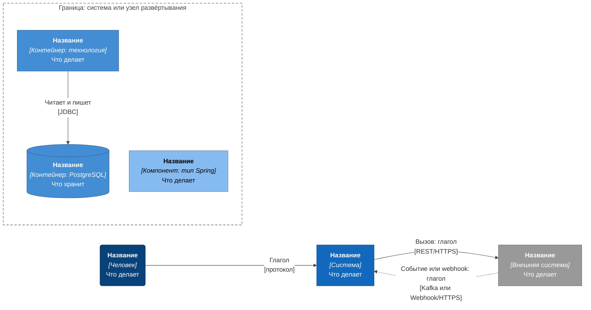

# Нотация C4: правила рисования архитектурных схем

| Поле | Содержание |
| --- | --- |
| Документ | Правила для всех архитектурных схем проекта |
| Фаза | Ф2, шаг 1 |
| Где применяется | [c4-context.md](c4-context.md), c4-containers.md, c4-components-*.md, sequence-*.md (раздел 8), [c4-deployment.md](c4-deployment.md) (раздел 9) |
| Связанные документы | [план фазы Ф2](../00-phase2-guide.md), [bounded-contexts.md](../04-domain/bounded-contexts.md) |

C4 это способ описывать архитектуру на четырёх уровнях приближения, как карту: сначала страна, потом город, улица, дом. Один и тот же набор элементов и связей показывается с разной подробностью для разных читателей. Автор модели C4 Саймон Браун.

## 1. Уровни

| Уровень | Вопрос, на который отвечает | Кто читает | Что на схеме | Файл проекта |
| --- | --- | --- | --- | --- |
| 1. Контекст | Что это за система, кто ей пользуется, с чем она связана? | Все: бизнес, аналитики, разработчики, проверяющие | Люди, наша система одним блоком, внешние системы | `c4-context.md` |
| 2. Контейнеры | Из каких запускаемых частей система состоит и как они общаются? | Разработчики, DevOps, архитекторы | Приложения и хранилища: сервисы, базы, брокер, кэш, интерфейс | `c4-containers.md` |
| 3. Компоненты | Как устроен один контейнер внутри? | Разработчики этого контейнера | Модули внутри сервиса: контроллеры, сервисы, репозитории, планировщики | `c4-components-<service>.md` |
| 4. Код | Какие классы и таблицы? | Разработчик, пишущий код | Не рисуем: класс-диаграммы устаревают быстрее, чем их читают. Роль L4 играют OpenAPI, AsyncAPI и DDL | нет |

К четырём уровням добавляются два вида диаграмм:

| Вид | Для чего | Как рисуется в проекте |
| --- | --- | --- |
| Развёртывание | На каких узлах и в каких сетях запускаются контейнеры | Flowchart в нотации C4 с вложенными узлами, `c4-deployment.md`, раздел 9 |
| Динамика | Порядок взаимодействий в одном сценарии | Sequence-диаграмма Mermaid, SEQ-NN. C4 Dynamic не умеет ветвлений и повторов, а исключения процессов именно в них |

**Почему на уровне контекста нет технологий и сервисов.** Контекст отвечает на вопрос «зачем и с кем», а не «как». Читатель без технической подготовки должен понять его за минуту. Появление сервисов на этой схеме означало бы смешение уровней: тогда после каждого изменения внутри системы пришлось бы править схему для людей, которые внутрь не смотрят.

## 2. Как C4 рисуется в Mermaid

### 2.1. Решение

Все схемы C4 рисуются как Mermaid `flowchart` с оформлением по правилам C4: у каждого элемента название, тип и назначение, у каждой связи глагол и протокол, цвета и формы по таблице ниже. Схемы лежат в репозитории рядом с текстом как код, GitHub рисует их без плагинов, изменения видны в обычном diff.

### 2.2. Почему не встроенный синтаксис `C4Context` и `C4Container`

В Mermaid есть собственные блоки `C4Context`, `C4Container`, `C4Component`, `C4Dynamic`, `C4Deployment`. Они проверены на версии 11.16 (той же, что рисует GitHub) и отвергнуты:

| Проблема | Что видно |
| --- | --- |
| Нет автоматической раскладки | Элементы ставятся в порядке объявления, параметр `$c4ShapeInRow` и `UpdateLayoutConfig` на практике игнорируются: в строку попадает 1–2 блока |
| Связи пересекают чужие блоки | Стрелка идёт напрямую по прямой и проходит поверх несвязанных элементов, подписи налезают на блоки |
| Нет вложенных границ с настраиваемой формой | Граница системы или узла развёртывания рисуется неровно |
| Нет ветвлений в динамике | `C4Dynamic` показывает только пронумерованные связи |

Для диаграммы из 12–15 элементов результат нельзя прочитать без ручной правки координат, а координат в синтаксисе нет.

### 2.3. Что делает flowchart

- Автоматическая раскладка (алгоритм dagre) разводит элементы и обводит чужие блоки.
- Вложенные `subgraph` дают границы системы, узла развёртывания, контейнера.
- Подписи элементов и связей поддерживают разметку: название жирным, технологию курсивом, переводы строк.
- Стили `classDef` дают цвета C4.

### 2.4. Рассмотренные альтернативы

| Вариант | Плюсы | Минусы | Решение |
| --- | --- | --- | --- |
| Встроенный `C4Context` в Mermaid | Родной синтаксис C4, короткий код | Раскладка непригодна, см. 2.2 | Отклонён |
| Structurizr DSL | Единая модель, из которой получаются все уровни, лучшая раскладка | Нужен исполняемый инструмент и экспорт картинок, GitHub не рисует DSL | Отклонён: схемы должны читаться прямо в репозитории |
| PlantUML с библиотекой C4 | Зрелая библиотека, хорошая раскладка через Graphviz | Нужны Java и Graphviz, включение библиотеки по сети, GitHub не рисует PlantUML | Отклонён по той же причине |
| Flowchart Mermaid в нотации C4 | Рисуется на GitHub, раскладка автоматическая, код читается | Нет единой модели: имя элемента повторяется в нескольких диаграммах, связность держится на дисциплине и скриптах проверки | **Принят** |

### 2.5. Ограничения и как с ними работаем

| Ограничение | Что делаем |
| --- | --- |
| Нет единой модели: один и тот же сервис нарисован на нескольких диаграммах | Алиас (код сервиса) один на весь проект. Скрипт сверяет алиасы диаграмм с таблицей в `decomposition.md` и с участниками SEQ-диаграмм |
| Раскладка зависит от порядка объявления элементов и от направления (`TB` или `LR`) | Для схем с людьми слева и внешними системами справа берём `LR`. Элементы одной группы объявляем подряд |
| `subgraph` игнорирует свой `direction`, если связи выходят из него наружу | Внутри границы направление не задаём. Группировку используем только для границы, а порядок задаём порядком объявления |
| Длинные подписи делают блоки неравными | Название не длиннее трёх слов, назначение не длиннее двух строк по 30 символов, переносы `<br/>` ставим сами |
| Читаемость падает после 15 элементов | Диаграмму делим, см. правило 2 ниже |

## 3. Легенда



| Элемент | Форма в Mermaid | Цвет заливки | Подпись |
| --- | --- | --- | --- |
| Человек (роль) | Скруглённый блок `("…")` | Тёмно-синий `#08427b` | Название, `[Человек]`, что делает |
| Наша система | Прямоугольник `["…"]` | Синий `#1168bd` | Название, `[Система]`, что делает |
| Внешняя система | Прямоугольник | Серый `#999999` | Название, `[Внешняя система]`, что делает |
| Контейнер | Прямоугольник | Голубой `#438dd5` | Название, `[Контейнер: технология]`, что делает |
| База данных, хранилище | Цилиндр `[("…")]` | Голубой `#438dd5` | Название, `[Контейнер: PostgreSQL]`, что хранит |
| Компонент | Прямоугольник | Светло-голубой `#85bbf0`, чёрный текст | Название, `[Компонент: тип]`, что делает |
| Граница (система, узел) | Вложенный `subgraph` | Без заливки, пунктир | Название и тип границы |
| Синхронный вызов | Сплошная стрелка `-->` | | Глагол и `[протокол]` |
| Событие, webhook, обратный вызов | Пунктирная стрелка `-.->` | | Глагол и `[протокол]` |

Расширения R2 и R3 на отдельных диаграммах получают тот же набор цветов. Элементы, которые на диаграмме R2 новые, выделяются в таблице под диаграммой, а не цветом.

## 4. Правила

1. **Один уровень на диаграмме.** На контексте нет сервисов, на контейнерах нет классов, на компонентах нет соседних контейнеров, кроме тех, с кем есть связь.
2. **Не больше 12–15 элементов.** Если больше, диаграмму делим по областям (как карта контекстов в Ф1) или показываем часть связей таблицей.
3. **Название по-русски, технология латиницей, назначение одним предложением.** Шаблон подписи элемента: `<b>Название</b><br/><i>[Тип: технология]</i><br/>Что делает`. Круглые и квадратные скобки внутри подписей не используем, кавычки только в виде «ёлочек», иначе Mermaid не разберёт строку.
4. **У каждой связи глагол и протокол.** Подпись связи: `Глагол<br/>[протокол]`. Примеры: «Передаёт заказ [REST/HTTPS]», «Публикует событие [Kafka]». Глагол в третьем лице настоящего времени, подлежащее это источник стрелки.
5. **Стрелка идёт от инициатора.** Если сервис вызывает другой сервис, стрелка от вызывающего. Если событие, стрелка от издателя к подписчику, пунктиром. Обратный вызов (webhook) рисуется отдельной пунктирной стрелкой от того, кто сообщает.
6. **Алиасы это коды сервисов.** Идентификатор узла в Mermaid и код сервиса одинаковые, латиницей, через дефис, например `order-service`. Те же коды в OpenAPI, AsyncAPI, SQL и именах каталогов в `services/`. Для людей и внешних систем алиасы короткие: `buyer`, `payment-gateway`.
7. **Под диаграммой таблица элементов.** Колонки: элемент, алиас, тип, технология, ответственность, владелец данных, релиз. Диаграмма даёт картину, таблица даёт точные значения. Расхождение между ними считается ошибкой.
8. **R1 и R2 не смешиваются.** Расширения R2 рисуются отдельной диаграммой с теми же алиасами и показывают только добавленные и изменённые связи.
9. **Динамика отдельно.** Время, ветвление и повторы показывают sequence-диаграммы SEQ-NN. Участники диаграммы это контейнеры из `c4-containers.md` с теми же алиасами.
10. **Уровень кода не рисуем.** Модель данных описывает DDL, контракты описывают OpenAPI и AsyncAPI.

## 5. Стандартная директива раскладки

В начале каждой диаграммы стоит строка настроек. Она задаёт спокойные цвета линий, белый фон подписей связей и расстояния, при которых подписи не налезают друг на друга.

```text
%%{init: {"theme":"base","themeVariables":{"edgeLabelBackground":"#ffffff","lineColor":"#444444"},"flowchart": {"nodeSpacing": 80, "rankSpacing": 230, "curve": "basis"}}}%%
```

Значения `nodeSpacing` и `rankSpacing` подбираются под диаграмму: для плотных схем 50 и 110, для схем с длинными подписями связей 80 и 230.

## 6. Как проверяем

| Что | Как |
| --- | --- |
| Диаграмма рисуется | `mmdc` (Mermaid 11.16) рендерит каждый блок в PNG без ошибок, картинка просматривается глазами: нет наложений подписей, текст читается без увеличения |
| Алиасы согласованы | Скрипт сверяет множество алиасов диаграмм и таблицы элементов, участников SEQ и коды в контрактах |
| Таблица под диаграммой полная | Каждый узел диаграммы есть в таблице и наоборот |
| Sequence-диаграммы согласованы | Скрипт `check_seq.py`: единая директива, участники из контейнеров и из раздела 2 файла, нумерация шагов совпадает с таблицей «Шаги диаграммы», переходы SM существуют в матрицах, E1 – E12 и T1 – T12 покрыты |
| Диаграммы развёртывания согласованы | Скрипт `check_budgets.py`: на диаграмме профилей есть все контейнеры из c4-containers.md, подписанные суммы групп равны [memory-budget.md](../09-operations/memory-budget.md), в каждой диаграмме не больше 15 элементов, связи указывают на объявленные узлы |
| Нет лишних элементов | Каждый элемент и связь прослеживаются до [требований](../02-requirements/requirements_v1.6.md) или [bounded-contexts.md](../04-domain/bounded-contexts.md) |

## 7. Решения

| Вопрос | Решение | Причина |
| --- | --- | --- |
| Какой синтаксис Mermaid | `flowchart` с оформлением C4, не встроенные `C4*` | Читаемая раскладка на GitHub без внешних инструментов, см. 2.2 |
| Рисовать ли C4 Dynamic | Только как обзор одного сценария: `flowchart` с пронумерованными стрелками (диаграмма 01.0 в SEQ-01). Подробная динамика, ветви и исключения только в SEQ-NN | В динамике нужны `alt`, `opt`, `loop` для исключений процессов, а во `flowchart` они не рисуются |
| Нужен ли уровень кода | Нет | Контракты и DDL точнее и проверяются скриптами |
| Как держать связность без единой модели | Алиасы и таблицы элементов, проверка скриптом | Для 6 сервисов R1 дисциплины достаточно, при росте проекта модель переносится в Structurizr |

## 8. Sequence-диаграммы SEQ-NN

Sequence-диаграмма показывает один сценарий во времени: кто кого вызывает, в каком порядке, где ветви исключений. Она дополняет C4 уровня 2 и 3, а не заменяет их. Диаграмма рисуется Mermaid-блоком `sequenceDiagram`.

### 8.1. Участники

| Правило | Как выглядит |
| --- | --- |
| Участник это контейнер | Алиас и название из [c4-containers.md](c4-containers.md): `order-service` «Сервис заказов», `kafka` «Брокер событий». Компонент внутри сервиса в участники не попадает, его называет таблица «Шаги диаграммы» |
| Человек это `actor` | `buyer`, `seller`, `moderator`, `support-operator`, `admin`. У стилизованной фигуры подпись под значком |
| `api-gateway` не рисуется | Все запросы людей и вебхуки проходят через шлюз (ADR-021), его присутствие подразумевается. Исключение: сценарий, где шлюз принимает решение само по себе |
| Внешние системы в отдельной рамке | `box rgb(232,232,232) Внешние системы`, остальные контейнеры в `box rgb(222,235,247) Платформа` |
| Не больше 10 участников | Больше не помещается в ширину читаемой страницы. Сценарий делится на несколько диаграмм (01.1, 01.2, 01.3) |

### 8.2. Стрелки и блоки

| Элемент | Значение |
| --- | --- |
| `->>` сплошная | Синхронный вызов: запрос и ожидание ответа |
| `-->>` пунктирная | Ответ на синхронный вызов, а также письмо или SMS покупателю (результат внешней отправки) |
| `--)` пунктирная с открытым концом | Событие Kafka или вебхук: отправитель не ждёт ответа |
| `--x` | Обрыв или отказ без ответа (тайм-аут, недоступность) |
| `Note over` | Что делает участник внутри: транзакция (TX), проверка, статусы сущностей. Запись в Outbox указывается внутри `TX` |
| `break` | Исключение, которое **заканчивает** сценарий. После блока основной путь продолжается только для случая «без исключения» |
| `alt` и `else` | Ветви, обе из которых идут дальше |
| `opt` | Необязательный шаг |
| `loop` | Повтор |

Заголовок блока начинается с номера исключения процесса: `E3. Шлюз отклонил платёж`. Исключение без номера процесса (технический сбой) разбирается в таблице «Что произойдёт при сбое» и на диаграмму не выносится.

### 8.3. Нумерация и подписи

| Правило | Пример |
| --- | --- |
| Каждая стрелка и каждый `Note` с действием начинается с номера шага и точки | `7. Зарезервировать ключи` |
| Ветвь получает букву у номера основного шага | `3a`, `10b`, `20a` |
| Номера уникальны в пределах диаграммы и совпадают с первой колонкой таблицы «Шаги диаграммы» | Диапазоны записываются так: `1 – 3`, `8a – 8c`, `18a – 22a` |
| В тексте нет символов `;` и `#`, кавычки только «ёлочки», длинного тире нет | Mermaid воспринимает `;` и `#` как служебные |
| Пометка статуса без номера допускается только в виде `Note` | `Note over order-service: Заказ «создан»` |

### 8.4. Состав файла `sequence-<сценарий>.md`

| Раздел | Содержание |
| --- | --- |
| Заголовок | Таблица: ID, релиз, фаза, источники, решения, предыдущий и связанный сценарии |
| 1. Цель и границы | Что показано, что не показано, таблица диаграмм |
| 2. Участники | Алиас и роль в сценарии. Скрипт сверяет алиасы с диаграммой |
| 3. Предусловия и постусловия | Что должно быть до, что получится при успехе и при неудаче |
| Диаграмма | Блок Mermaid, маркированный список «Что видно на диаграмме», таблица «Шаги диаграммы» (шаг, что происходит, компонент, статусы после шага, переход SM), таблица «Времена и повторы» |
| Покрытие | Исключения и переходы SM, нарисованные в файле, и те, что не показаны, с причиной |
| Что произойдёт при сбое | Точка падения, что происходит, чем закрыто |
| Решения и замечания | Что решено при рисовании и почему |
| Связанные документы | Соседние сценарии, компоненты, процессы |

### 8.5. Директива и цвета

Все sequence-диаграммы начинаются с одной и той же директивы. Эталон хранится в `tools/docs-checks/seq_init.txt`, скрипт проверяет совпадение каждой диаграммы с ним.

```text
%%{init: {"theme":"base","themeVariables":{"actorBkg":"#6fa8dc","actorTextColor":"#000000","actorBorder":"#2e6295","actorLineColor":"#888888","signalColor":"#444444","signalTextColor":"#000000","noteBkgColor":"#fff8d6","noteTextColor":"#000000","noteBorderColor":"#c9b458","loopTextColor":"#000000","labelBoxBkgColor":"#438dd5","labelTextColor":"#ffffff","labelBoxBorderColor":"#2e6295","activationBkgColor":"#d9e8f7","activationBorderColor":"#2e6295"},"sequence":{"mirrorActors":true,"wrap":true,"width":190,"messageMargin":32,"boxMargin":8,"noteMargin":8}}}%%
```

| Параметр | Зачем |
| --- | --- |
| `actorTextColor` чёрный, `actorBkg` светло-синий | Подпись стилизованного человека лежит на белом фоне, белый текст пропадал. Чёрный текст читается и в блоках участников |
| `mirrorActors: true` | Участники повторяются внизу, линии жизни не обрываются до последнего сообщения |
| `wrap: true`, `width: 190` | Длинные подписи переносятся, диаграмма остаётся шириной в экран |
| `loopTextColor`, `labelBoxBkgColor` | Подписи `alt`, `break`, `opt` читаются на светлом фоне |
| `noteBkgColor` светло-жёлтый | Пометки внутри участника отличаются от сообщений |

### 8.6. C4 Dynamic для обзора

Обзор одного сценария на уровне контейнеров рисуется как `flowchart TB` с пронумерованными стрелками (диаграмма 01.0 в [SEQ-01](sequence-purchase.md)): `nodeSpacing` 40, `rankSpacing` 90, цвета и классы как на диаграммах контейнеров, стрелки с номерами шагов. Исключения на нём не рисуются, они на sequence-диаграммах.

## 9. Диаграммы развёртывания

Диаграмма развёртывания отвечает на вопрос «на чём это работает»: показывает узлы, сети, профили и размещение контейнеров из [c4-containers.md](c4-containers.md). Рисуется `flowchart` с вложенными `subgraph`. Встроенный `C4Deployment` не используется по той же причине, что и остальные `C4*`: раскладку нельзя настроить (раздел 2).

### 9.1. Что чем изображается

| Что | Как рисуется | Цвета |
| --- | --- | --- |
| Узел (сервер, ноутбук, Compose-проект) | `subgraph`, самый внешний | Заливка `#f4f4f4`, рамка `#666666` |
| Профиль Compose, сеть Docker, namespace | `subgraph` внутри узла | Профиль и прикладной слой: `#eaf2fb` и `#7a9cc0`. Сети данных: `#e8f3e8` и `#7fae7f`. Внешняя сеть (`edge`): `#fdf1e0` и `#c9a05a` |
| Контейнер | Узел с тем же алиасом и подписью, что на уровне контейнеров | Как на диаграммах контейнеров: `#438dd5` |
| Человек и внешняя система | Как на других уровнях | `#08427b` и `#999999` |

Цвета подграфов задаются командой `style <алиас> fill:...,stroke:...,color:#000000`, потому что у `subgraph` нет `classDef`.

### 9.2. Правила

1. **Заголовок подграфа в одной строке:** `<b>Сеть data</b> <i>[Docker network]</i>`. Если разбить заголовок на две строки, первый вложенный узел налезает на вторую строку.
2. **Не больше 15 элементов.** Считаются узлы, не подграфы. Группа однотипных контейнеров может быть одним узлом («Шесть прикладных сервисов»), если диаграмма не отвечает на вопрос о каждом из них.
3. **Связи только по теме диаграммы.** На диаграмме профилей связей нет: они на [c4-containers.md](c4-containers.md). На диаграмме сетей только пути, различающиеся сетью или протоколом.
4. **Подписи связей** по общему правилу: протокол и порт, например «mTLS 8443».
5. **В заголовке профиля сумма лимитов памяти группы**, в мегабайтах, из [memory-budget.md](../09-operations/memory-budget.md). Скрипт сверяет эти числа.
6. **Направление.** Вложенные диаграммы рисуются `flowchart TB`: сети идут горизонтальными полосами, контейнеры в полосе стоят в ряд. Конвейер между средами (D1) рисуется `flowchart LR`.
7. **Невидимые связи (`~~~`) не используются.** Раскладка между подграфами без связей зависит от версии Mermaid, ряды получались непредсказуемыми.
8. **Служебные контейнеры**, которых нет в c4-containers.md (наблюдаемость, резервное копирование), допускаются только на диаграммах развёртывания и помечаются столбцом «Откуда» в таблице контейнеров.
