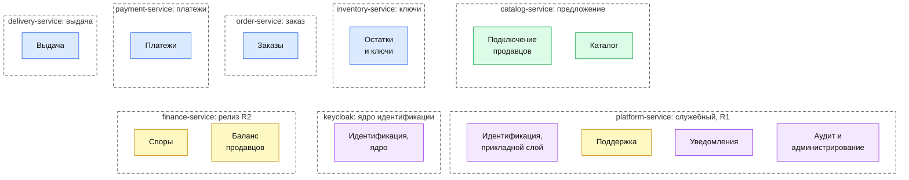

# Декомпозиция на сервисы

| Поле | Содержание |
| --- | --- |
| Документ | Как 12 контекстов Ф1 раскладываются по сервисам релиза R1 и что добавляют R2 и R3 |
| Фаза | Ф2, шаг 2 |
| Решение | [ADR-002](adr/ADR-002-microservices-consolidation.md) |
| Входные данные | [bounded-contexts.md](../04-domain/bounded-contexts.md), [domain-model.md](../04-domain/domain-model.md), [требования v1.5](../02-requirements/requirements_v1.5.md): разделы 2.1, 2.2, 5, 8.1 и 8.2 |
| Следующий документ | [c4-containers.md](c4-containers.md): диаграммы контейнеров |

## 1. Что решаем

Ф1 выделила 12 контекстов. Каждый контекст это граница терминов, данных и ответственности. Требования (раздел 8.1) допускают на релизе R1 объединять сервисы при условии, что границы сохраняются в коде, а схемы данных остаются раздельными. Здесь решается, какие контексты запускаются вместе, какие отдельно и почему.

Результат: 6 прикладных сервисов R1 плюс Keycloak, API Gateway, веб-интерфейс и заглушки внешних систем. В релизе R2 добавляется седьмой сервис.

## 2. Критерии

| № | Критерий | Вопрос | Источник |
| --- | --- | --- | --- |
| К1 | Общие данные и согласованность | Нужна ли одна транзакция базы данных на два контекста? Есть ли отношение «один к одному» с общим жизненным циклом? | Агрегаты, раздел 3 доменной модели |
| К2 | Критический путь покупки | Остановит ли отказ контекста оформление заказа, оплату или выдачу оплаченного ключа? | NFT-4.3, NFT-2.0, NFT-2.1 |
| К3 | Скорость и причина изменений | Меняются ли они по разным причинам и в разное время? | Раздел 8.1 требований |
| К4 | Нагрузка и масштабирование | Нужно ли масштабировать независимо? | Раздел 2.2 требований, NFT-1.0 – NFT-1.3 |
| К5 | Безопасность и секреты | Есть ли секрет (ключи, мастер-ключ, документы продавцов, персональные данные), который должен видеть минимум кода? | NFT-3.2, NFT-3.4, NFT-5.0, NFT-5.3 |
| К6 | Внешняя интеграция | Есть ли внешняя система, чьи сбои и сроки нельзя пускать внутрь других контекстов? | NFT-4.3, раздел 5 bounded-contexts |
| К7 | Команда и ресурсы | Сколько контейнеров потянет одна небольшая команда и ноутбук с 8 ГБ памяти (3 ГБ у WSL)? | Раздел 2.1 требований, [план проекта](../00-project-plan.md) |

### 2.1. Какая нагрузка на самом деле

Допущения раздела 2.2 требований: 1 000 заказов в сутки к шестому месяцу, пик 20% суточных заказов за час, запас на акции 10 раз, около 50 просмотров карточек на заказ.

| Величина | Расчёт | Значение |
| --- | --- | --- |
| Пик заказов | 1 000 × 20% за 1 час | 200 заказов в час, около 0,06 заказа в секунду |
| Пик с запасом на акции | × 10 | около 0,6 заказа в секунду |
| Просмотры карточек | 1 000 × 50 в сутки | 50 000 в сутки |
| Пик просмотров | 50 000 × 20% за 1 час | около 10 000 в час, 2,8 в секунду |
| Пик просмотров с запасом | × 10 | около 28 в секунду. NFT-1.0 проверяется при 50 запросах в секунду |
| Размер пула ключей | 100 000 ключей по 1 КБ | до 100 МБ на товар |

**Вывод.** Один экземпляр каждого сервиса выдержит такую нагрузку с запасом, и сама по себе нагрузка не требует микросервисов (К4 слабый довод). Деление опирается на К2, К5, К6 (изоляция отказов, секретов и интеграций) и на цель проекта: показать работающие распределённые шаблоны (сага, Outbox, идемпотентность). Цель проекта названа в [ADR-002](adr/ADR-002-microservices-consolidation.md) прямо, а не спрятана за нагрузкой.

## 3. Результат

Три правила дали раскладку:

1. **Критический путь покупки не объединяем.** Заказы, остатки и ключи, платежи, выдача: каждый сервис отдельно. Сбой, перегрузка или медленный внешний вызов в одном из них не должен тянуть остальные (К2, К5, К6).
2. **Сторона предложения объединяем.** Подключение продавцов и каталог связаны одним владельцем (продавец), одним модератором и одним ритмом изменений (К1, К3).
3. **Всё, что вне критического пути, объединяем в один служебный сервис.** Поддержка, уведомления, аудит с администрированием и прикладной слой идентификации: малая нагрузка, события на входе, нет влияния на оплату и выдачу (К2, К4, К7).

Цвета те же, что на [карте контекстов](../04-domain/bounded-contexts.md): синий ядро покупки, зелёный предложение, жёлтый сопровождение после покупки, фиолетовый платформенные функции.

### 3.1. Карта «контекст → сервис»

| № | Контекст (Ф1) | Сервис | Модуль внутри | База данных и схема | Релиз |
| --- | --- | --- | --- | --- | --- |
| 1 | Идентификация | `keycloak` (ядро) и `platform-service` (прикладной слой) | `identity` | `platform_db`, схема `identity`. Учётные данные, роли и 2FA хранит база Keycloak | R1, смена номера R2 |
| 2 | Подключение продавцов | `catalog-service` | `seller_onboarding` | `catalog_db`, схема `seller_onboarding` | R1, блокировка и API-ключи R2 |
| 3 | Каталог | `catalog-service` | `catalog` | `catalog_db`, схема `catalog` | R1 |
| 4 | Остатки и ключи | `inventory-service` | `inventory` | `inventory_db` | R1, остаток по API и замена ключа R2 |
| 5 | Заказы | `order-service` | `orders` | `order_db` | R1 |
| 6 | Платежи | `payment-service` | `payments` | `payment_db` | R1 |
| 7 | Выдача | `delivery-service` | `delivery` | `delivery_db` | R1, запросы к API продавца R2 |
| 8 | Поддержка | `platform-service` | `support` | `platform_db`, схема `support` | R1 |
| 9 | Споры | `finance-service` | `disputes` | `finance_db`, схема `disputes` | R2 |
| 10 | Баланс продавцов | `finance-service` | `balance` | `finance_db`, схема `balance` | R2 |
| 11 | Уведомления | `platform-service` | `notification` | `platform_db`, схема `notification` | R1, webhook продавцам R2 |
| 12 | Аудит и администрирование | `platform-service` | `audit_admin` | `platform_db`, схема `audit_admin` | R1, отчёты R3 |

**Единственное исключение из правила «один контекст в одном сервисе» это «Идентификация».** Её ядро это Keycloak: учётные данные, роли, 2FA, VK ID, токены. Прикладной слой (номер телефона и его уникальность, смена e-mail по команде поддержки, назначение роли по событию «профиль одобрен», деактивация и анонимизация) это код платформы, потому что Keycloak не читает Kafka и не умеет этих операций из коробки. Доменная модель с самого начала записывает владельца сущности «Пользователь» как «Keycloak и расширение платформы». Код слоя живёт в модуле `identity`, а не внутри Keycloak: так он тестируется и выпускается вместе с платформой, а не вместе с Keycloak. Выбор между этим и расширением внутри Keycloak закрепляет [ADR-010](adr/README.md) (шаг 5).

## 4. Сервисы релиза R1

Сервисы названы по коду, который используется везде: в диаграммах, OpenAPI, AsyncAPI, SQL и каталогах `services/`. События названы по смыслу, как в Ф1. Точные имена и схемы фиксирует AsyncAPI (шаг 10).

### 4.1. `catalog-service`

| Поле | Содержание |
| --- | --- |
| Назначение | Заявки продавцов и модерация, товары и их модерация, витрина, поиск и фильтры |
| Модули | `seller_onboarding`, `catalog` |
| Владеет сущностями | Профиль продавца, Товар. R2: API-ключ продавца |
| База данных | `catalog_db`: схемы `seller_onboarding`, `catalog` |
| Принимает вызовы | От `order-service`: «карточка товара» (статус, цена, продавец, способ выдачи). От покупателей и гостей: каталог и поиск. От продавцов и модераторов: заявки, товары, решения. R2: «проверить API-ключ» от API Gateway, «реквизиты и статус продавца» от `finance-service` |
| Вызывает | Никого синхронно |
| Публикует | «Профиль одобрен», «профиль отклонён», «профиль возвращён на доработку», «товар создан», «товар изменён», «товар опубликован», «товар отклонён», «товар заблокирован», события аудита решений модератора. R2: «продавец заблокирован», «блокировка снята», «API-ключ выпущен», «API-ключ отозван» |
| Принимает события | «Остаток изменился» (для витрины), «параметры изменены» |
| Внешние системы и хранилища | Объектное хранилище (документы продавцов), Redis (кэш карточек и поиска) |
| Нагрузка | Самая высокая по чтению: около 28 карточек в секунду на пике с запасом, проверка при 50 в секунду (NFT-1.0), поиск за 500 мс (NFT-1.1). Масштабируется добавлением экземпляров (NFT-1.3) |
| Безопасность | Публичное чтение каталога и закрытые документы продавцов находятся в одном процессе. Документы не попадают в запросы витрины, лежат в закрытом бакете, отдаются только модератору и самому продавцу |
| Релиз | R1 |

### 4.2. `inventory-service`

| Поле | Содержание |
| --- | --- |
| Назначение | Пулы ключей, шифрование, защита от дублей, резервирование, выдача значений ключей `delivery-service` |
| Модули | `inventory` |
| Владеет сущностями | Ключ, Резерв. R2: Остаток по API |
| База данных | `inventory_db` |
| Принимает вызовы | От `order-service`: «зарезервировать ключи» и «подтвердить резерв». От `delivery-service`: «значения ключей по заказу» (только по mTLS). От продавцов: загрузка пулов (вручную и CSV) |
| Вызывает | Никого синхронно |
| Публикует | «Резерв истёк» (по таймеру и по сверке), «резерв снят», «остаток изменился». R2: «ключ аннулирован», «ключ заменён» |
| Принимает события | «Заказ отменён», «товар создан», «товар изменён» (копия идентификатора товара, продавца и способа выдачи для проверки прав), «параметры изменены». R2: команда «заменить ключ» |
| Внешние системы и хранилища | Объектное хранилище (файлы CSV), Redis (таймеры резервов), хранилище секретов (мастер-ключ AES и секрет HMAC) |
| Нагрузка | Низкая по числу запросов, но каждый заказ блокирует строки ключей (NFT-1.2: создание заказа и резерв за 1 с) |
| Безопасность | Единственный сервис, который расшифровывает ключи. Мастер-ключ и секрет HMAC вне базы данных (NFT-3.2). Значения не попадают в логи, трассировку и события |
| Релиз | R1 |

### 4.3. `order-service`

| Поле | Содержание |
| --- | --- |
| Назначение | Жизненный цикл заказа, оркестрация сценария покупки (сага с компенсациями), история заказов покупателя |
| Модули | `orders` |
| Владеет сущностями | Заказ |
| База данных | `order_db` |
| Принимает вызовы | От покупателей: оформление заказа, история заказов. От `platform-service` (модуль `support`): «обновить адрес доставки» |
| Вызывает | `catalog-service` («карточка товара»), `inventory-service` («зарезервировать ключи» и «подтвердить резерв», при поздней оплате подтверждение делает повторный резерв), `payment-service` («открыть платёжную сессию») |
| Публикует | «Заказ создан», «заказ оплачен», «заказ отменён», «заказ выдан», «заказ возвращён», «адрес доставки обновлён», «вернуть деньги», события аудита |
| Принимает события | «Платёж подтверждён», «платёж отклонён», «платёж возвращён», «резерв истёк», «письмо принято», «параметры изменены» |
| Внешние системы и хранилища | Нет |
| Нагрузка | Низкая: около 0,6 заказа в секунду на пике с запасом. История заказов читается с отдельной модели чтения (упрощённый CQRS, ADR-017) |
| Безопасность | Хранит снимок e-mail покупателя в заказе (персональные данные, решение 5 доменной модели) |
| Релиз | R1, переходы T10 и T11 R2 |

### 4.4. `payment-service`

| Поле | Содержание |
| --- | --- |
| Назначение | Взаимодействие с платёжным шлюзом: платёжная сессия, уведомления шлюза, возвраты, идемпотентность, очередь ручных возвратов администратора |
| Модули | `payments` |
| Владеет сущностями | Платёж |
| База данных | `payment_db` |
| Принимает вызовы | От `order-service`: «открыть платёжную сессию». От платёжного шлюза: уведомления (webhook). От администратора: отметка о ручном возврате |
| Вызывает | Платёжный шлюз (создать платёж, вернуть деньги) |
| Публикует | «Платёж подтверждён», «платёж отклонён», «платёж возвращён», «возврат ждёт администратора», события аудита ручных возвратов |
| Принимает события | «Вернуть деньги» от `order-service`. R2: то же от `finance-service` |
| Внешние системы и хранилища | Платёжный шлюз (эмуляция). Переводчик (anti-corruption layer) превращает статусы и ошибки шлюза в статусы платежа SM-02 |
| Нагрузка | Низкая. Уведомления шлюза повторяются, поэтому обработка идемпотентна (FT-6.2, NFT-2.3) |
| Безопасность | Данные карт не обрабатываются (NFT-5.1). Принимает вызовы из интернета: проверка подписи уведомления обязательна ([ADR-015](adr/README.md)). Принимает уведомление и при недоступном `order-service`: запись в свою базу и событие через Outbox |
| Релиз | R1 |

### 4.5. `delivery-service`

| Поле | Содержание |
| --- | --- |
| Назначение | Письмо с ключом покупателю, повторы отправки, отслеживание статуса письма, контроль 30 минут, повторная выдача. R2: запросы ключа у API продавца |
| Модули | `delivery` |
| Владеет сущностями | Выдача |
| База данных | `delivery_db` |
| Принимает вызовы | От e-mail-провайдера: статусы письма (webhook) |
| Вызывает | `inventory-service`: «значения ключей по заказу» (по mTLS), e-mail-провайдер: «передать письмо». R2: API продавца: «запросить ключ» |
| Публикует | «Письмо принято», «выдача доставлена», «выдача не удалась», «30 минут без доставки». R2: «продавец не ответил» |
| Принимает события | «Заказ оплачен» (создать выдачу и запустить контроль 30 минут), «адрес доставки обновлён», «параметры изменены». R2: «ключ заменён» |
| Внешние системы и хранилища | E-mail-провайдер (эмуляция), R2: API продавца. Для каждой внешней системы свой переводчик (anti-corruption layer) |
| Нагрузка | Низкая по числу заказов. Внешние вызовы медленные и с повторами: поэтому изолированы от резерва и оплаты (NFT-4.3) |
| Безопасность | Открытое значение ключа существует только в памяти на время формирования письма. Через Kafka, `platform-service` и логи ключ не проходит (решение 11 доменной модели, NFT-3.2) |
| Релиз | R1, запросы к API продавца R2 |

### 4.6. `platform-service`

| Поле | Содержание |
| --- | --- |
| Назначение | Всё, что не лежит на критическом пути покупки: прикладной слой идентификации, поддержка, уведомления, журнал аудита и параметры платформы |
| Модули | `identity`, `support`, `notification`, `audit_admin` |
| Владеет сущностями | Пользователь (расширение: номер телефона, признак подтверждения, анонимизация), Обращение в поддержку, Уведомление и Одноразовый код (служебные записи), Параметры платформы, Журнал аудита |
| База данных | `platform_db`: схемы `identity`, `support`, `notification`, `audit_admin`. У каждого модуля своя роль базы данных, прав на чужую схему нет |
| Принимает вызовы | От Keycloak: «отправить код», «проверить код». От покупателей: подтверждение телефона. От операторов: обращения, повторная отправка, смена e-mail. От администраторов: роли, параметры, журнал. От провайдеров: статусы писем и SMS (webhook) |
| Вызывает | `order-service`: «обновить адрес доставки» (модуль `support`). Keycloak (Admin REST): роль, e-mail, деактивация (модуль `identity`). Внутри сервиса модуль `support` вызывает `identity` и `notification` через интерфейсы модулей |
| Публикует | Идентификация: «пользователь зарегистрирован», «роль назначена», «e-mail изменён», «телефон подтверждён», «пользователь деактивирован». Поддержка: «обращение создано», «обращение решено». Уведомления: «письмо не доставлено». Администрирование: «параметры изменены». R2: «телефон изменён» |
| Принимает события | «Профиль одобрен» (назначить роль «Продавец»), «выдача не удалась», «30 минут без доставки», «выдача доставлена», события заказов, подключения продавцов и каталога для писем, события аудита от всех сервисов |
| Внешние системы и хранилища | E-mail-провайдер, SMS-провайдер (эмуляция), Redis (одноразовые коды и счётчики ограничения частоты, [ADR-010](adr/README.md)). R2: webhook продавцам |
| Нагрузка | Низкая. Единственное чувствительное место: SMS-код при входе и подтверждении телефона (до первой покупки), ограничение 3 запроса за 10 минут (NFT-3.5) |
| Безопасность | Журнал аудита только добавляется (NFT-5.2): у роли базы нет прав на изменение и удаление. Журнал без персональных данных в открытом виде (NFT-5.3). Ключей покупок сервис не видит никогда |
| Релиз | R1, смена номера и webhook R2, отчёты R3 |

## 5. Остальные контейнеры

| Контейнер | Алиас | Технология | Роль | Релиз |
| --- | --- | --- | --- | --- |
| Веб-интерфейс | `web-app` | React, TypeScript | Адаптивные экраны всех ролей, один интерфейс | R1 |
| API Gateway | `api-gateway` | Spring Cloud Gateway ([ADR-021](adr/README.md)) | Единая точка входа: проверка токена, ограничение частоты, маршрутизация. Бизнес-логики нет | R1 |
| Сервер идентификации | `keycloak` | Keycloak | Вход, 2FA, VK ID, токены OAuth2 и JWT. Ядро контекста «Идентификация» | R1 |
| Заглушки внешних систем | `external-stubs` | Node.js, TypeScript | Платёжный шлюз (поздние и повторные уведомления, отказ в возврате), e-mail-провайдер (API, SMTP, статусы), SMS-провайдер, VK ID (OIDC). R2: система продавца, страница ручного перевода банка. Технологию подтверждает замер памяти в Ф3 | R1 |
| Брокер событий | `kafka` | Apache Kafka | События между сервисами ([ADR-003](adr/README.md)) | R1 |
| Реляционные базы | `postgres` | PostgreSQL 16 | Один сервер, отдельная база и роль на каждый сервис | R1 |
| Кэш и таймеры | `redis` | Redis | Кэш каталога, ограничение частоты, таймеры резервов, одноразовые коды | R1 |
| Объектное хранилище | `object-storage` | MinIO (S3 API) | Документы продавцов, файлы CSV с пулами | R1 |
| Хранилище секретов | `secret-store` | Секреты Docker и Kubernetes | Мастер-ключ, секрет HMAC, ключи провайдеров. Вне базы данных (NFT-3.2) | R1 |

## 6. Обоснование объединений и разделений

| Решение | Критерии | Довод | Цена решения |
| --- | --- | --- | --- |
| Объединить подключение продавцов и каталог | К1, К3, К7 за. К5 против | Товар существует только у одобренного продавца, блокировка продавца (R2) скрывает его товары: в одном сервисе это одна транзакция, а не событие и временное расхождение. Один модератор, одни экраны, одна скорость изменений | Публичная витрина и закрытые документы в одном процессе. Снижаем так: отдельный бакет, отдельный модуль, запросы витрины документов не касаются |
| Не объединять заказы и платежи | К2, К5, К6 | Платёж обращается к внешнему шлюзу и принимает вызовы из интернета. Уведомление нужно принять и сохранить, даже если `order-service` недоступен. Смена шлюза не должна затрагивать заказ | Лишний переход на пути «оплачено» (платёж, событие, заказ): входит в бюджет NFT-2.0, см. шаг 8. Согласованность через сагу и идемпотентность, а не одну транзакцию |
| Не объединять остатки и ключи с выдачей | К2, К5, К6 | Остатки блокируют строки на горячем пути заказа (NFT-1.2). Выдача ждёт внешний e-mail-провайдер и в R2 API продавца до 10 минут. Разные таймауты, повторы, причины изменений | Открытое значение ключа пересекает сеть между двумя сервисами: только по mTLS, только по запросу выдачи, в памяти, без записи |
| Не объединять остатки и ключи с заказами | К1, К2, К5 | Заказ и ключи это разные агрегаты (раздел 3 доменной модели). Расшифровку ключей должен вести минимум кода | Резерв остаётся синхронным вызовом на горячем пути |
| Объединить поддержку, уведомления, аудит с администрированием и прикладной слой идентификации | К2, К4, К7 за. К3, К5 против | Вне критического пути, малая нагрузка, на входе в основном события. Группа общая: поддержке нужны коды (уведомления) и смена e-mail (идентификация) без сетевого вызова, действия администратора над ролями и параметрами пишутся в журнал аудита той же транзакцией | Четыре контекста в одном процессе. Снижаем жёсткими границами модулей (раздел 7) и заранее названными условиями разделения (раздел 9) |
| Оставить Keycloak отдельным контейнером | К5, К7 | Готовый продукт с собственной базой и циклом выпуска | Прикладной слой идентификации живёт отдельно, см. 3.1 |

## 7. Правила модульности

Эти правила делают объединение обратимым: любой модуль можно вынести в отдельный сервис, не переписывая соседей.

| № | Правило | Как проверяется |
| --- | --- | --- |
| 1 | Один модуль равен одному контексту. Верхний пакет модуля называется так же, как модуль в карте выше. Публичны только интерфейс модуля и его DTO в подпакете `api`, остальное скрыто | ArchUnit-тест в CI |
| 2 | Модуль не читает и не пишет таблицы другого модуля. У модуля своя схема базы данных и своя роль с правами только на эту схему. Запросов между схемами нет | Права ролей в миграциях, интеграционный тест |
| 3 | Модуль вызывает соседа только через интерфейс с DTO, как вызвал бы по сети: идентификаторы вместо ссылок на объекты, нет общих сущностей JPA | ArchUnit-тест |
| 4 | События, которые интересны другим модулям и сервисам, публикуются одним способом: Outbox в Kafka. Модуль-потребитель не знает, свой это сервис или чужой | Обзор кода, контракт AsyncAPI |
| 5 | Общий код между сервисами только каркас: Outbox, обработка повторов событий, сквозной идентификатор, формат ошибок. Бизнес-классов и общих jar с DTO нет, контракты общие через OpenAPI и AsyncAPI | Структура каталога `services/` |
| 6 | У модуля своя конфигурация и свои параметры. Параметры платформы модуль получает событием и хранит копию, чужие настройки не читает | Обзор кода |
| 7 | Миграции Flyway по схеме: у каждого модуля своя папка миграций | Структура репозитория |

## 8. Нет общей базы данных

| Что | Решение |
| --- | --- |
| Серверы | Один сервер PostgreSQL на стенде, отдельная база на каждый сервис: `catalog_db`, `inventory_db`, `order_db`, `payment_db`, `delivery_db`, `platform_db`. Для Keycloak `keycloak_db`. R2: `finance_db` |
| Доступ | Одна роль базы на сервис, у `platform_db` роль на каждый модуль. Роль видит только свою базу или схему |
| Между сервисами | Внешних ключей и запросов между базами нет. Ссылки только по идентификатору (UUID). Целостность ссылок обеспечивает порядок событий и проверка при вызове |
| Копии данных | Разрешены только там, где их называет доменная модель (решение 5 и раздел 6 bounded-contexts) |
| Переезд | Перенос базы сервиса на отдельный сервер меняет только строку подключения |

## 9. Релизы R2 и R3

### 9.1. Релиз R2

| Что добавляется | Как |
| --- | --- |
| Новый сервис `finance-service` | Споры и баланс продавцов в одном сервисе. Причина: заморозка денег по спору и баланс это одна согласованность: открыть спор и заморозить операцию одной транзакцией проще и надёжнее, чем событием в обе стороны (К1). Окончательное решение подтверждается перед Ф5 |
| `catalog-service` | Блокировка продавца (скрывает товары в той же транзакции), выпуск и отзыв API-ключей, проверка ключа для API Gateway |
| `inventory-service` | Остаток по API с оптимистичной блокировкой (ADR-008), замена и аннулирование ключа |
| `delivery-service` | Запрос ключа у API продавца, ожидание ответа 10 минут, переводчик для формата продавца |
| `order-service` | Переходы T10 и T11 (SM-01) |
| `platform-service` | Webhook продавцам из модуля `notification`, смена номера телефона в модуле `identity` |
| `api-gateway` | Маршруты API продавца, проверка API-ключа, ограничение частоты по ключу |
| Внешние системы | Системы продавцов (API и webhook), банк для выплат (ручной перевод, связи с платформой нет) |

### 9.2. Релиз R3

Новых сервисов R3 не добавляет. Динамическая шкала комиссии появляется в `order-service` (расчёт при создании заказа) и `finance-service`, отчёты и экспорт в модуле `audit_admin`, автоматизация модерации в `catalog-service`. Поиск переезжает на OpenSearch ([ADR-019](adr/README.md)).

### 9.3. Когда придётся разделить объединённые сервисы

| Сервис | Что выделяется | Условие |
| --- | --- | --- |
| `platform-service` | `notification` | Webhook продавцам (R2) или SMS-коды начинают влиять на другие модули: задержки, нагрузка на потоки, очередь недоставленных |
| `platform-service` | `audit_admin` | Отчёты R3 и экспорт нагружают базу журнала, или появляется требование отдельного режима доступа и срока хранения журнала |
| `platform-service` | `support` | Рост очереди и числа операторов, отдельная команда |
| `platform-service` | `identity` | Прикладной слой идентификации растёт (смена номера, анонимизация, несколько провайдеров) и выпускается чаще остального |
| `catalog-service` | `seller_onboarding` и `catalog` | Поиск переезжает на OpenSearch (R3), или нагрузка на витрину требует масштабировать её отдельно от заявок |
| `finance-service` | `disputes` и `balance` | Появляется самостоятельная автоматизация споров или выплат |

## 10. Проверки

Проверки выполняет скрипт `check_decomposition.py` по этому документу и документам Ф1.

| Проверка | Результат |
| --- | --- |
| Каждый из 12 контекстов Ф1 есть в карте ровно один раз | Выполнено: 12 строк, у «Идентификации» два контейнера по решению 3.1 |
| У каждой из 16 сущностей один сервис-владелец, и он совпадает с контекстом-владельцем из доменной модели | Выполнено, см. 10.1 |
| Служебные записи «Уведомления» (Уведомление, Одноразовый код) принадлежат модулю `notification` | Выполнено |
| Сервисов R1 от 5 до 6 | Выполнено: 6 |
| У каждого сервиса своя база данных, общих баз нет | Выполнено: 6 баз R1, одна база Keycloak |
| Значения ключей знают два сервиса: `inventory-service` расшифровывает, `delivery-service` вкладывает в письмо | Выполнено, см. решение 6 раздела 11 |
| Все события и вызовы из bounded-contexts.md присутствуют у владельцев | Проверяется на диаграммах контейнеров ([c4-containers.md](c4-containers.md)) |

### 10.1. Владельцы сущностей

| Сущность | Контекст-владелец (доменная модель) | Сервис и модуль |
| --- | --- | --- |
| Пользователь | Идентификация | `keycloak` (учётные данные) и `platform-service`, `identity` (расширение) |
| Профиль продавца | Подключение продавцов | `catalog-service`, `seller_onboarding` |
| API-ключ продавца (R2) | Подключение продавцов | `catalog-service`, `seller_onboarding` |
| Товар | Каталог | `catalog-service`, `catalog` |
| Ключ | Остатки и ключи | `inventory-service`, `inventory` |
| Резерв | Остатки и ключи | `inventory-service`, `inventory` |
| Остаток по API (R2) | Остатки и ключи | `inventory-service`, `inventory` |
| Заказ | Заказы | `order-service`, `orders` |
| Платёж | Платежи | `payment-service`, `payments` |
| Выдача | Выдача | `delivery-service`, `delivery` |
| Обращение в поддержку | Поддержка | `platform-service`, `support` |
| Спор (R2) | Споры | `finance-service`, `disputes` |
| Операция по балансу (R2) | Баланс продавцов | `finance-service`, `balance` |
| Заявка на вывод (R2) | Баланс продавцов | `finance-service`, `balance` |
| Параметры платформы | Аудит и администрирование | `platform-service`, `audit_admin` |
| Журнал аудита | Аудит и администрирование | `platform-service`, `audit_admin` |

## 11. Решения

| № | Вопрос | Решение | Причина |
| --- | --- | --- | --- |
| 1 | Сколько сервисов на R1 | Шесть прикладных: `catalog-service`, `inventory-service`, `order-service`, `payment-service`, `delivery-service`, `platform-service` | Критерии раздела 2, три правила раздела 3 |
| 2 | Где поддержка | В `platform-service`, модуль `support` | Она не на критическом пути, ей нужны коды и смена e-mail без сетевых вызовов. Объединение с выдачей отклонено: оно ввело бы интерфейсы операторов в сервис, который держит открытые значения ключей (К5) |
| 3 | Где проходит граница контекста «Идентификация» | Ядро в Keycloak, прикладной слой в модуле `identity` | Раздел 3.1 |
| 4 | Где живёт «Параметры платформы» | В модуле `audit_admin`, сервисы получают копию событием «параметры изменены» | Раздел 8.2 требований и решение 7 раздела 6 bounded-contexts |
| 5 | Что в R2 | Один новый сервис `finance-service` (споры и баланс) | Раздел 9.1 |
| 6 | Принцип «ключи видит только один сервис» | Уточнён: значение ключа в открытом виде знают два сервиса. `inventory-service` расшифровывает (мастер-ключ только у него), `delivery-service` получает значение по mTLS и держит в памяти на время формирования письма. Ни один другой сервис, Kafka, логи и трассировка значения не получают | Расшифровка у владельца ключей, письмо у владельца выдачи. Формулировка «видит только Выдача» в решении 11 доменной модели неточна. Правка отмечена для отчёта Ф2 и вносится вместе с [ADR-009](adr/README.md) |
| 7 | Технология заглушек | Node.js и TypeScript | Лёгкий процесс, помещается в профиль `stubs`. Подтверждается замером в Ф3 |
| 8 | Один интерфейс или несколько | Один `web-app` на все роли | Один код и один сборочный конвейер, роли различаются маршрутами и правами. Разделение допустимо, если интерфейс сотрудников начнёт выпускаться отдельно |

## 12. Что уточняется дальше

| Вопрос | Где решается |
| --- | --- |
| Хранение одноразовых кодов, границы расширения Keycloak, уникальность номера | ADR-010, шаг 5 |
| Реализация API Gateway | ADR-021, шаг 5 |
| Шифрование трафика внутри стенда | ADR-022, шаг 5 |
| Таймеры, повторы, DLQ | ADR-004, ADR-005, ADR-011, шаги 3 и 4 |
| Бюджет памяти по контейнерам и профилям | Шаг 8, `docs/09-operations/memory-budget.md` |
