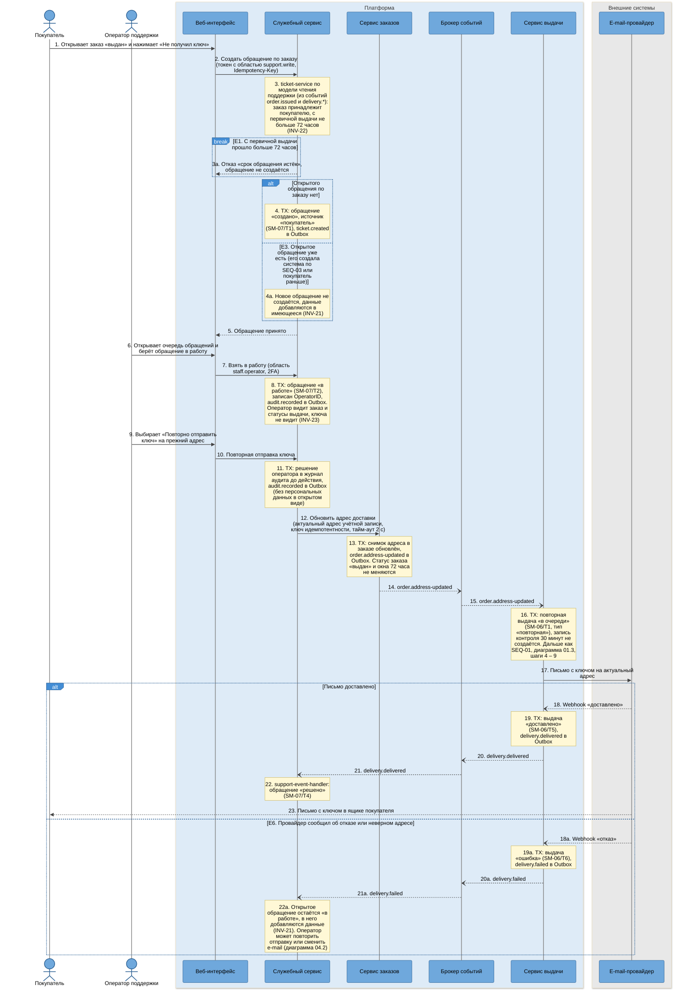
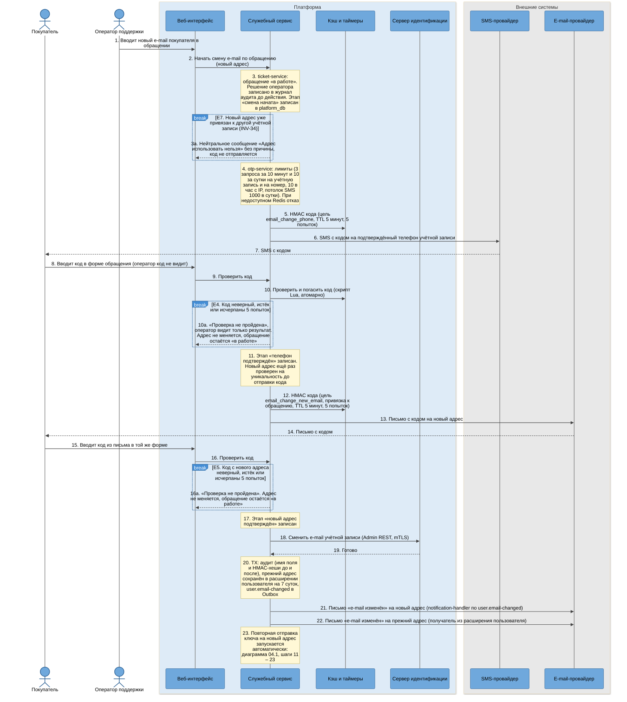

# SEQ-04. Обращение в поддержку и смена e-mail через поддержку

| Поле | Содержание |
| --- | --- |
| ID | SEQ-04 (диаграммы 04.1 и 04.2) |
| Релиз | R1 |
| Фаза | Ф2, шаг 7 |
| Источники | [BPMN-04](../03-processes/BPMN-04-support-request.md) (основной путь, смена e-mail, E1, E3 – E7), [UC-04](../02-requirements/UC-04-support-request.md), [SM-07](../03-processes/SM-07-support-ticket.md) (T1, T2, T4), [SM-06](../03-processes/SM-06-delivery.md) (T1, T5, T6) |
| Решения | [ADR-010](adr/ADR-010-keycloak-sms-codes.md) (коды, лимиты, этапы смены e-mail), [ADR-014](adr/ADR-014-audit-log-no-pii.md) (журнал аудита без персональных данных), [ADR-005](adr/ADR-005-transactional-outbox.md), [ADR-006](adr/ADR-006-idempotency.md), [ADR-022](adr/ADR-022-internal-traffic-encryption.md) |
| Нотация | [c4-notation.md](c4-notation.md), раздел 8 |
| Предыдущий сценарий | [SEQ-03](sequence-guaranteed-delivery.md): оттуда приходят обращения системы (E3 BPMN-04) |
| Связанный сценарий | [SEQ-05](sequence-phone-sms-login.md): как покупатель входит в кабинет без доступа к почте |

## 1. Цель и границы

Показать, как заказ из очереди поддержки получает ключ повторно: на прежний адрес (диаграмма 04.1) или, если покупатель потерял почту, на новый после двух подтверждений кодами (диаграмма 04.2). Оператор принимает решения, но не видит ни ключа, ни кодов: коды вводит сам покупатель.

| Диаграмма | Что показывает | Переходы | Исключения BPMN-04 |
| --- | --- | --- | --- |
| 04.1 | Создание обращения покупателем, взятие в работу, повторная отправка ключа на прежний адрес | SM-07/T1, T2, T4, SM-06/T1, T5 или T6 | E1, E3, E6 |
| 04.2 | Смена e-mail: код в SMS, код на новый адрес, смена в Keycloak, повторная отправка на новый адрес | SM-06/T1, T5, SM-07/T4 | E4, E5, E7 |

## 2. Участники

| Алиас | Роль в сценарии |
| --- | --- |
| `buyer` | Покупатель |
| `support-operator` | Оператор поддержки (с 2FA) |
| `web-app` | Форма обращения, очередь оператора, ввод кодов |
| `platform-service` | Модуль `support` (обращение), модуль `identity` (коды, смена e-mail), модуль `notification` (письма и SMS), модуль `audit_admin` (журнал) |
| `order-service` | Хранит снимок адреса доставки, публикует `order.address-updated` |
| `delivery-service` | Создаёт повторную выдачу и отправляет письмо |
| `keycloak` | Хранит e-mail учётной записи, меняет его по Admin REST |
| `redis` | Одноразовые коды и счётчики лимитов |
| `sms-provider`, `email-provider` | Внешние провайдеры (в проекте их играет `external-stubs`) |
| `kafka` | События `order.address-updated`, `delivery.delivered`, `delivery.failed` |

## 3. Предусловия и постусловия

| | Содержание |
| --- | --- |
| Предусловия | Заказ «выдан». Для обращения покупателя с первичной выдачи прошло не более 72 часов, открытого обращения по заказу нет. Телефон учётной записи подтверждён (для смены e-mail). Покупатель вошёл по паролю, через VK ID или по коду из SMS (последний случай в [SEQ-05](sequence-phone-sms-login.md)) |
| Постусловия, успех | Ключ повторно отправлен и доставлен: выдача «повторная» «доставлено» (SM-06/T5), обращение «решено» (SM-07/T4). При смене e-mail адрес в Keycloak изменён, покупатель получил письма о смене на новый и на прежний адрес |
| Постусловия, неудача | Обращение остаётся «в работе» (E4, E5, E6, E7) или не создано (E1). Адрес не меняется |
| Что оператор не видит | Значение ключа, значения кодов. Только результат проверки кода (FT-7.5, INV-23) |

## 4. Диаграмма 04.1. Обращение покупателя и повторная отправка ключа

**Что видно на диаграмме.**

- `platform-service` не ходит в `order-service` и `delivery-service` за данными заказа при создании обращения: окно 72 часа и принадлежность заказа проверяются по модели чтения, которую `support-event-handler` ведёт из событий `order.issued` и `delivery.*`. Единственный синхронный вызов к заказам это «обновить адрес доставки» (шаг 12).
- Решение оператора записывается в журнал **до** действия (шаг 11). Если действие не удастся, запись о решении всё равно останется, а сбой виден по обращению «в работе».
- Адрес доставки обновляется всегда, даже если он не менялся: это запись «адрес актуален на момент решения оператора», а событие `order.address-updated` запускает повторную выдачу. Отдельной команды «повторить выдачу» нет.
- Окна 72 часа, окно спора и удержание не сдвигаются: повторная выдача не создаёт запись контроля и не переводит заказ из «выдан» (SM-06, SM-01/T9 «один раз за жизнь заказа»).
- Сбой повторного письма (E6) не теряется: выдача «ошибка», обращение остаётся «в работе», оператор видит его в очереди. Ограничения по времени у ожидания нет (BPMN-04, решение 6).

### 4.1. Шаги диаграммы 04.1

| № | Что происходит | Компонент | Статусы после шага | Переход SM |
| --- | --- | --- | --- | --- |
| 1 – 2 | Покупатель создаёт обращение | `ticket-controller` | Заказ: «выдан». Обращения нет | нет |
| 3 | Проверка заказа и окна 72 часа | `ticket-service`, `ticket-repository` | Без изменений | нет |
| 3a | E1: окно истекло | `ticket-controller` | Обращения нет | нет |
| 4 | Обращение создано | `ticket-service` | Обращение: «создано» | SM-07/T1 |
| 4a | E3: открытое обращение уже есть | `ticket-service` | Обращение: прежнее («создано» или «в работе») | нет |
| 5 | Ответ покупателю | `ticket-controller` | Без изменений | нет |
| 6 – 8 | Оператор взял в работу | `ticket-controller`, `ticket-service` | Обращение: «в работе» | SM-07/T2 |
| 9 – 11 | Решение оператора записано | `ticket-controller`, `ticket-service` | Без изменений | нет |
| 12 – 13 | Адрес доставки обновлён | `order-client` → `order-controller`, `order-domain` | Заказ: «выдан». Обращение: «в работе» | нет (статус заказа не меняется) |
| 14 – 15 | Событие дошло до выдачи | `outbox-relay` → `kafka` → `event-consumer` | Без изменений | нет |
| 16 | Повторная выдача создана | `delivery-domain`, `delivery-repository` | Выдача (повторная): «в очереди». Первичная выдача без изменений | SM-06/T1 |
| 17 | Письмо передано провайдеру | `delivery-dispatcher`, `key-client`, `letter-builder`, `email-client` | Выдача (повторная): «отправлено» | SM-06/T2 |
| 18 – 19 | Доставка подтверждена | `webhook-controller`, `delivery-domain` | Выдача (повторная): «доставлено» | SM-06/T5 |
| 20 – 22 | Обращение закрыто | `outbox-relay`, `event-consumer`, `support-event-handler`, `ticket-service` | Обращение: «решено» | SM-07/T4 |
| 23 | Покупатель получил ключ | Внешняя система | Без изменений | нет |
| 18a – 19a | E6: отказ провайдера | `webhook-controller`, `delivery-domain` | Выдача (повторная): «ошибка» | SM-06/T6 |
| 20a – 22a | Обращение остаётся «в работе» | `outbox-relay`, `event-consumer`, `support-event-handler` | Обращение: «в работе» | нет |

### 4.2. Времена и повторы диаграммы 04.1

| Параметр | Значение | Источник |
| --- | --- | --- |
| Окно обращения | 72 часа от первичной выдачи, параметр платформы, повторная отправка не сдвигает | FT-7.2 |
| Вызов `order-service` из поддержки | Тайм-аут 2 секунды, ключ идемпотентности | c4-components-platform-service.md |
| Повторная выдача | Те же повторы, что у первичной (6 попыток за 17 минут 40 секунд, [SEQ-03](sequence-guaranteed-delivery.md)) | ADR-011 |
| Ожидание статуса повторного письма | Не ограничено таймером, обращение «в работе» видно в очереди | BPMN-04, решение 6 |
| Эскалация, если обращение не взяли в работу | Заказ не остаётся без обработки дольше часа | SM-07, NFT-2.4 |

## 5. Диаграмма 04.2. Смена e-mail: два подтверждения и повторная отправка

Оператор уже взял обращение в работу (диаграмма 04.1, шаг 8), выяснил, что повторная отправка на прежний адрес не поможет, и выбрал «Сменить e-mail».

**Что видно на диаграмме.**

- Два независимых подтверждения: телефон отвечает на вопрос «это тот человек, у которого есть учётная запись», новый адрес отвечает на вопрос «на этот адрес доходят письма». Опечатка оператора или чужой адрес не приводят к отправке ключа постороннему ([BPMN-04](../03-processes/BPMN-04-support-request.md), решение вопроса 2 приложения C).
- Оператор не участвует ни в одном из двух подтверждений: он вводит только новый адрес и видит только результат. Коды лежат в Redis как HMAC с секретом `otp_pepper` вне Redis, значения кодов нигде не пишутся.
- Проверка уникальности нового адреса идёт до отправки кода (шаг 3a): код никогда не уходит на чужой адрес. Нейтральное сообщение одно и то же для занятого адреса и для занятого номера, чтобы по ответу нельзя было узнать, есть ли у адреса учётная запись.
- Смена e-mail всегда заканчивается повторной отправкой ключа (шаг 23, BPMN-04, решение 3), иначе смена не решала бы исходную проблему.
- Письмо о смене уходит и на новый, и на прежний адрес (UC-04, 6a.6): владелец, не терявший почту, узнаёт о смене. Прежний адрес поэтому хранится в расширении пользователя до 7 суток, а не в очереди писем.
- Подмена SIM-карты остаётся главным остаточным риском этого сценария: злоумышленник с SIM жертвы и своим почтовым ящиком проходит оба подтверждения. Меры (ограниченная сессия по SMS, лимиты, письмо на прежний адрес, участие оператора) уменьшают ущерб, но не устраняют риск. Разбор в модели угроз (шаг 9).

### 5.1. Шаги диаграммы 04.2

| № | Что происходит | Компонент | Статусы после шага | Переход SM |
| --- | --- | --- | --- | --- |
| 1 – 3 | Оператор начал смену, проверка уникальности | `ticket-controller`, `ticket-service`, `user-service` | Обращение: «в работе». Этап смены: «начата» | нет |
| 3a | E7: адрес занят | `user-service`, `ticket-controller` | Этап смены: «отклонена». Обращение: «в работе» | нет |
| 4 – 7 | Код в SMS | `otp-service`, `sms-client` | Код: активен 5 минут | нет |
| 8 – 10 | Покупатель ввёл код, код проверен | `ticket-controller`, `otp-service` | Код: погашен | нет |
| 10a | E4: проверка не пройдена | `otp-service`, `ticket-controller` | Этап смены: «не пройдена». Обращение: «в работе» | нет |
| 11 – 14 | Код на новый адрес | `user-service`, `otp-service`, `notification-service`, `email-sender` | Этап смены: «телефон подтверждён». Код: активен 5 минут | нет |
| 15 – 16 | Покупатель ввёл код из письма | `ticket-controller`, `otp-service` | Код: погашен | нет |
| 16a | E5: проверка не пройдена | `otp-service`, `ticket-controller` | Этап смены: «не пройдена». Обращение: «в работе» | нет |
| 17 – 19 | Новый адрес подтверждён, e-mail в Keycloak изменён | `user-service`, `keycloak-admin-client` | Этап смены: «выполнена». Учётная запись: новый e-mail | нет |
| 20 | Аудит и событие | `user-service`, `audit-service` (через `audit.recorded`) | Без изменений | нет |
| 21 – 22 | Письма о смене | `notification-handler`, `notification-service`, `email-sender` | Без изменений | нет |
| 23 | Повторная отправка ключа | `ticket-service`, `order-client`, затем диаграмма 04.1 | Выдача (повторная): «в очереди», затем «доставлено». Обращение: «в работе», затем «решено» | SM-06/T1, SM-06/T5, SM-07/T4 |

### 5.2. Времена и повторы диаграммы 04.2

| Параметр | Значение | Источник |
| --- | --- | --- |
| Срок жизни кода | 5 минут, для каждого из двух кодов | NFT-3.7 |
| Попытки ввода | 5 на код, после пятой неудачи код погашен | NFT-3.7 |
| Запросы кода | 3 за 10 минут и 10 за сутки на учётную запись и на номер, 10 в час с IP | NFT-3.5, ADR-010 |
| Потолок SMS | 1000 в сутки (параметр платформы), оповещение при 80 процентах | ADR-010 |
| Блокировка перебора | После 3 погашенных из-за попыток кодов за час вход по SMS для номера закрыт на час | ADR-010 |
| Прежний адрес в расширении пользователя | 7 суток, затем очистка. Очищается и анонимизацией | Решение 3 раздела 8 |

## 6. Исключения и переходы: покрытие

| Что | Где нарисовано |
| --- | --- |
| E1 | 04.1, шаг 3a |
| E2 (вход по SMS не удался) | [SEQ-05](sequence-phone-sms-login.md), диаграмма 05.2, шаги 13a – 13b |
| E3 | 04.1, шаг 4a (обращение системы описано в [SEQ-03](sequence-guaranteed-delivery.md)) |
| E4 | 04.2, шаг 10a |
| E5 | 04.2, шаг 16a |
| E6 | 04.1, шаги 18a – 22a |
| E7 | 04.2, шаг 3a |
| SM-07/T1 | 04.1, шаг 4 |
| SM-07/T2 | 04.1, шаг 8 |
| SM-07/T3 (возврат в очередь) | Не показано: оператор возвращает обращение в очередь по окончании смены, не связано с доставкой |
| SM-07/T4 | 04.1, шаг 22 |
| SM-06/T1, T5, T6 | 04.1, шаги 16, 19 и 19a |

## 7. Что произойдёт при сбое

| Точка падения | Что происходит | Чем закрыто |
| --- | --- | --- |
| `platform-service` упал между сменой e-mail в Keycloak (шаг 19) и записью аудита (шаг 20) | Адрес изменён, аудит и событие не записаны | Шаг 18 идемпотентен (установка того же значения). Этап смены хранится в `platform_db`: при повторе этап «новый адрес подтверждён» выполнит шаги 18 – 20 заново, не запрашивая коды. Записанная в Keycloak смена без аудита не остаётся: сверка этапов находит этап не «выполнена» |
| `order-service` недоступен на шаге 12 | Повторная отправка не запущена | Тайм-аут 2 секунды, повтор с тем же ключом идемпотентности. Обращение остаётся «в работе», оператор видит ошибку и повторяет действие |
| Redis недоступен | Коды не выдаются и не проверяются | Отказ закрыт (fail-closed): безопаснее, чем неограниченная отправка SMS. Покупатель видит сообщение, что код отправить сейчас нельзя |
| SMS не дошла | Код действует 5 минут, покупатель ждёт | Новый запрос кода гасит предыдущий, в пределах лимита 3 за 10 минут. Вебхук статуса SMS идёт в метрику |
| Письмо о смене не дошло | Письмо не отправлено | `notification-service` повторяет отправку, недоставленное даёт `notification.failed` (NFT-6.1). Смена e-mail от письма не зависит |

## 8. Решения и замечания

| № | Вопрос | Решение | Причина |
| --- | --- | --- | --- |
| 1 | Откуда `ticket-service` знает, что заказ «выдан», и когда это случилось | Модель чтения в `platform_db`, которую ведёт `support-event-handler` из событий `order.issued`, `delivery.accepted`, `delivery.delivered`, `delivery.failed`, `delivery.overdue` | Нет синхронной зависимости от заказов при каждом обращении, нет нового контейнерного вызова. Поправка Ф2 внесена в [c4-containers.md](c4-containers.md), раздел 8 |
| 2 | Что в событии `order.issued` | Заказ, покупатель, номер заказа, время первичной выдачи | Из этого строится окно 72 часа. Поля фиксирует AsyncAPI (шаг 10) |
| 3 | Где хранится прежний e-mail для письма о смене | В расширении пользователя (`identity`), 7 суток, затем очистка | UC-04, 6a.6 требует письма на прежний адрес. Очередь писем адрес не хранит (c4-components-platform-service.md), поэтому владелец адреса остаётся одним: «Пользователь». Поле добавляется в физическую модель (шаг 12) |
| 4 | Журнал аудита и смена e-mail | Запись до действия, затем аудит самой смены (имя поля и HMAC-хеши до и после) | BPMN-04, решение 2, NFT-5.3, [ADR-014](adr/ADR-014-audit-log-no-pii.md) |
| 5 | Показывать ли оператору результат проверки кода | Только «пройдена» или «не пройдена» | FT-7.5, NFT-3.7 |
| 6 | Нужен ли отдельный запрос «повторить выдачу» | Нет, достаточно `order.address-updated` | Одно событие и для смены адреса, и для повторной отправки на прежний. Лишний контракт не нужен |

## 9. Связанные документы

- [SEQ-03](sequence-guaranteed-delivery.md): обращения системы
- [SEQ-05](sequence-phone-sms-login.md): вход по коду из SMS и подтверждение телефона
- [c4-components-platform-service.md](c4-components-platform-service.md), [c4-components-order-service.md](c4-components-order-service.md), [c4-components-delivery-service.md](c4-components-delivery-service.md): компоненты из столбцов «Компонент»
- [UC-04](../02-requirements/UC-04-support-request.md), [BPMN-04](../03-processes/BPMN-04-support-request.md)
