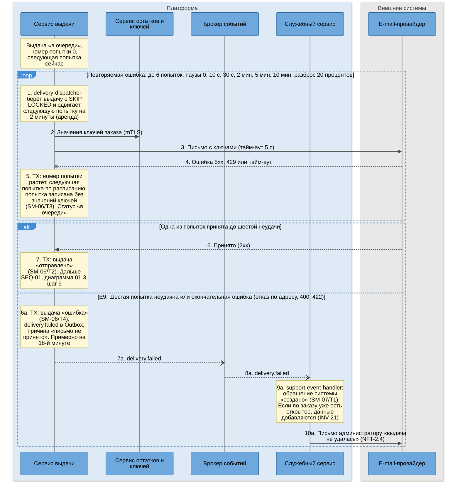
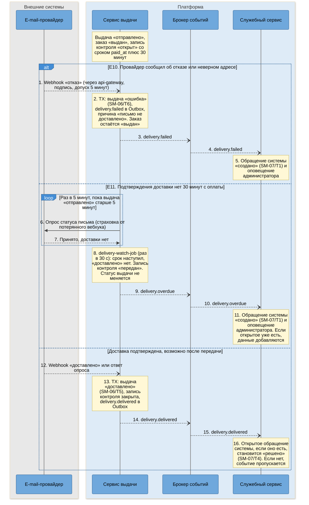
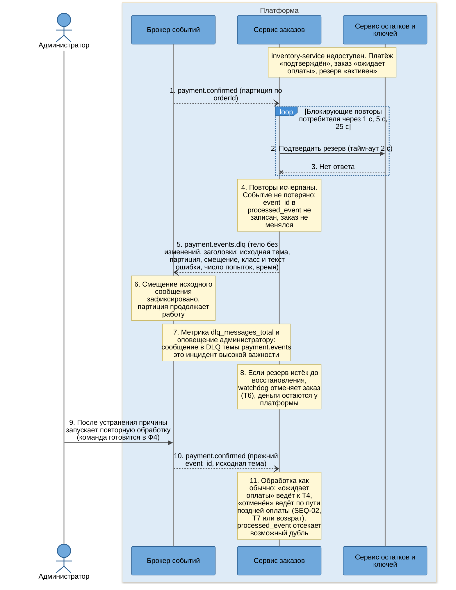

# SEQ-03. Гарантированная доставка: повторы, DLQ, передача в поддержку

| Поле | Содержание |
| --- | --- |
| ID | SEQ-03 (диаграммы 03.1, 03.2, 03.3) |
| Релиз | R1 |
| Фаза | Ф2, шаг 7 |
| Источники | [BPMN-01](../03-processes/BPMN-01-purchase.md) (E9, E10, E11), [UC-03](../02-requirements/UC-03-key-issuance.md), [SM-06](../03-processes/SM-06-delivery.md) (T3, T4, T5, T6), [SM-07](../03-processes/SM-07-support-ticket.md) (T1, T4), [SM-01](../03-processes/SM-01-order.md) (T9) |
| Решения | [ADR-011](adr/ADR-011-guaranteed-delivery.md) (повторы, контроль 30 минут, передача в поддержку, DLQ), [ADR-003](adr/ADR-003-kafka-events.md) (Kafka), [ADR-005](adr/ADR-005-transactional-outbox.md), [ADR-006](adr/ADR-006-idempotency.md), [ADR-004](adr/ADR-004-saga-purchase.md) (риск DLQ у `payment.confirmed`) |
| Нотация | [c4-notation.md](c4-notation.md), раздел 8 |
| Предыдущий сценарий | [SEQ-01](sequence-purchase.md), диаграмма 01.3 (выдача без сбоев) |
| Продолжение | [SEQ-04](sequence-email-change.md): оператор поддержки решает обращение |

## 1. Цель и границы

Показать три уровня защиты оплаченного заказа от потери: повторы отправки письма с растущей паузой (E9), контроль по времени и по статусу письма (E10, E11) и очередь недоставленных сообщений Kafka (DLQ). Под «очередью недоставленных» в проекте понимаются два артефакта: выдача со статусом «ошибка» вместе с обращением в очереди поддержки (для писем) и темы `<тема>.dlq` (для событий) (ADR-011).

| Диаграмма | Что показывает | Переходы | Исключения BPMN-01 |
| --- | --- | --- | --- |
| 03.1 | Шесть попыток отправки за 17 минут 40 секунд, затем выдача «ошибка» и обращение системы | SM-06/T3, T4, SM-07/T1 | E9 |
| 03.2 | Письмо принято, но провайдер сообщил об отказе или подтверждения доставки нет 30 минут | SM-06/T6, T5, SM-07/T1, T4 | E10, E11 |
| 03.3 | Событие `payment.confirmed` не обработано: повторы потребителя, тема `.dlq`, повторная обработка | нет (путь к SM-01/T4, T6, T7) | нет (риск ADR-004) |

## 2. Участники

| Алиас | Роль в сценарии |
| --- | --- |
| `delivery-service` | Очередь выдач, повторы, контроль 30 минут, вебхук статуса письма |
| `inventory-service` | Отдаёт значения ключей на время одной попытки, подтверждает резерв (03.3) |
| `email-provider` | Внешний e-mail-провайдер |
| `kafka` | События `delivery.failed`, `delivery.overdue`, `delivery.delivered`, темы `.dlq` |
| `platform-service` | Модуль `support`: обращение системы. Модуль `notification`: оповещение администратора |
| `order-service` | Потребитель `payment.confirmed` (03.3) |
| `admin` | Администратор: разбор DLQ (03.3) |

## 3. Предусловия и постусловия

| | Содержание |
| --- | --- |
| Предусловия | Заказ «оплачен» (T4 или T7), выдача «в очереди», запись контроля `delivery_watch` «открыт» со сроком `paid_at` плюс 30 минут |
| Постусловия | Письмо доставлено (выдача «доставлено», SM-06/T5), либо в очереди поддержки есть обращение системы «создано» и администратор оповещён. Заказ остаётся в «оплачен» (E9) или «выдан» (E10, E11): статус заказа от сбоя доставки не откатывается, потому что ключи уже закреплены |
| Гарантии | Принятая оплата не теряется: заказ «оплачен», выдача создана тем же событием, письмо повторяется до 6 раз за 18 минут, обращение в поддержке не позднее 30 минут с оплаты (ADR-011). Одна первичная выдача на заказ (INV-18), одно открытое обращение на заказ (INV-21) |

## 4. Диаграмма 03.1. Повторы отправки и передача в поддержку (E9)

**Что видно на диаграмме.**

- Состояние повторов хранится в таблице `delivery` (номер попытки, `next_attempt_at`), а не в памяти: перезапуск сервиса не обнуляет расписание. Аренда в 2 минуты возвращает выдачу в очередь, если процесс упал посреди попытки.
- Три первые попытки (в моменты 0 с, 10 с и 40 с) укладываются в 60 секунд из NFT-2.0. Шестая неудача наступает примерно на 18-й минуте, раньше срока 30 минут из NFT-2.4.
- Статус заказа в этой ветви не меняется: заказ остаётся «оплачен», а `delivery-service` не знает, что в заказе происходит. Передачей в поддержку владеет `platform-service`, который реагирует на `delivery.failed`.
- Каждая попытка снова запрашивает значения ключей: ключи нигде не хранятся вне `inventory_db`. Недоступность `inventory-service` тоже тратит попытки. Допустимо, сервис находится на критическом пути, а попыток растянуты на 18 минут.

### 4.1. Шаги диаграммы 03.1

| № | Что происходит | Компонент | Статусы после шага | Переход SM |
| --- | --- | --- | --- | --- |
| 1 | Захват выдачи с арендой | `delivery-dispatcher` | Выдача: «в очереди». Заказ: «оплачен» | нет |
| 2 | Значения ключей | `key-client` → `inventory-controller`, `key-value-reader` | Без изменений | нет |
| 3 – 4 | Письмо не принято провайдером | `letter-builder`, `email-client` | Без изменений | нет |
| 5 | Попытка записана, расписание сдвинуто | `retry-policy`, `delivery-domain` | Выдача: «в очереди» (попытка растёт) | SM-06/T3 |
| 6 – 7 | Одна из попыток принята | `email-client`, `delivery-domain` | Выдача: «отправлено». Заказ: «оплачен», затем «выдан» по SEQ-01 | SM-06/T2, SM-01/T9 |
| 6a | Попытки исчерпаны | `delivery-domain` | Выдача: «ошибка». Заказ: «оплачен» | SM-06/T4 |
| 7a – 8a | Событие передано поддержке | `outbox-relay` → `kafka` → `event-consumer` | Без изменений | нет |
| 9a | Обращение системы | `support-event-handler`, `ticket-service` | Обращение: «создано». Выдача: «ошибка». Заказ: «оплачен» | SM-07/T1 |
| 10a | Оповещение администратора | `notification-handler`, `notification-service`, `email-sender` | Без изменений | нет |

### 4.2. Времена и повторы диаграммы 03.1

| Параметр | Значение | Источник |
| --- | --- | --- |
| Расписание повторов | Попытка 1 сразу, 2 через 10 с, 3 через 30 с, 4 через 2 мин, 5 через 5 мин, 6 через 10 мин. Накопительно 17 минут 40 секунд | ADR-011 |
| Разброс | Плюс или минус 20 процентов на паузу. Максимум по расписанию около 21 минуты, меньше 30 минут | ADR-011 |
| Тайм-аут запроса к провайдеру | 5 секунд | ADR-011 |
| Аренда выдачи | 2 минуты | ADR-011, c4-components-delivery-service.md |
| Опрос очереди выдач | Раз в секунду, до 20 за раз | ADR-011 |
| Что повторяется | Тайм-аут, 5xx, 429. Окончательная ошибка (400, 422) повторов не имеет | ADR-011 |

## 5. Диаграмма 03.2. Недоставка и контроль 30 минут (E10, E11)

Письмо принято провайдером (выдача «отправлено», заказ «выдан»), но покупатель его не получил. Дальше наступает один из трёх исходов.

**Что видно на диаграмме.**

- Контроль 30 минут стартует от `order.paid`, а не от момента принятия письма (ADR-011). Поэтому он срабатывает и тогда, когда ошибка случилась до отправки, и когда письмо принято, но не дошло.
- Нарушение срока не меняет статус выдачи: она остаётся «отправлено». Передача в поддержку это сообщение (`delivery.overdue`), а не смена состояния (SM-06, раздел про контроль 30 минут).
- Если «доставлено» пришло уже после передачи, обращение системы закрывается без участия оператора (SM-07/T4): письмо всё же дошло, оператору разбирать нечего.
- Опрос провайдера раз в 5 минут закрывает случай потерянного вебхука: без него «доставлено» могло не прийти никогда, и каждый такой заказ попадал бы в поддержку.

### 5.1. Шаги диаграммы 03.2

| № | Что происходит | Компонент | Статусы после шага | Переход SM |
| --- | --- | --- | --- | --- |
| 1 – 2 | E10: отказ провайдера | `webhook-controller`, `delivery-domain` | Выдача: «ошибка». Заказ: «выдан» | SM-06/T6 |
| 3 – 4 | Событие передано поддержке | `outbox-relay` → `kafka` → `event-consumer` | Без изменений | нет |
| 5 | Обращение системы и оповещение | `support-event-handler`, `ticket-service`, `notification-handler` | Обращение: «создано». Выдача: «ошибка». Заказ: «выдан» | SM-07/T1 |
| 6 – 7 | E11: опрос статуса письма | `status-poller`, `email-client` | Выдача: «отправлено». Заказ: «выдан» | нет |
| 8 | Срок контроля наступил | `delivery-watch-job` | Выдача: «отправлено». Контроль: «передан» | нет |
| 9 – 10 | Событие `delivery.overdue` передано | `outbox-relay` → `kafka` → `event-consumer` | Без изменений | нет |
| 11 | Обращение системы и оповещение | `support-event-handler`, `ticket-service`, `notification-handler` | Обращение: «создано». Выдача: «отправлено». Заказ: «выдан» | SM-07/T1 |
| 12 – 13 | Доставка подтверждена | `webhook-controller` или `status-poller`, `delivery-domain` | Выдача: «доставлено». Контроль: закрыт | SM-06/T5 |
| 14 – 15 | Событие о доставке | `outbox-relay` → `kafka` → `event-consumer` | Без изменений | нет |
| 16 | Обращение системы закрыто | `support-event-handler`, `ticket-service` | Обращение: «решено» (если было открыто) | SM-07/T4 |

### 5.2. Времена и повторы диаграммы 03.2

| Параметр | Значение | Источник |
| --- | --- | --- |
| Контроль доставки | 30 минут от `paid_at`, проверка раз в 30 секунд, передача в пределах 30 секунд после срока | ADR-011, NFT-2.4 |
| Опрос статуса письма | Раз в 5 минут, для выдач «отправлено» старше 5 минут, до прохождения контроля | ADR-011 |
| Цель доставки | 95% заказов за 30 минут | NFT-2.1 |
| Окна повторной выдачи | Считаются от первичной выдачи, повторная выдача новой записи контроля не создаёт | ADR-011 |

## 6. Диаграмма 03.3. Событие не обработано: повторы потребителя и DLQ

Отдельный механизм для событий Kafka. Показан на самом чувствительном событии: деньги от покупателя уже у платформы (`payment.confirmed`), а сервис остатков недоступен ([ADR-004](adr/ADR-004-saga-purchase.md), риск «после выхода сообщения в DLQ платёж подтверждён, а заказ ещё ожидает оплаты»).

**Что видно на диаграмме.**

- Повторы потребителя блокирующие, внутри обработчика: партиция стоит до 31 секунды. Для темы, где один заказ равен одному сообщению, это приемлемо. Если нагрузка вырастет, повторы переносятся в отдельные темы ([ADR-011](adr/ADR-011-guaranteed-delivery.md), «Когда пересмотреть»).
- Различаются временный и неисправимый сбой. Временный (недоступна база, сбой синхронного вызова, обработка раньше нужного статуса) повторяют. Неисправимый (невалидное сообщение, нарушение схемы) идёт в DLQ сразу, без повторов.
- Сообщение в DLQ не теряется и не меняется: возврат в исходную тему с прежним `event_id` безопасен благодаря идемпотентной обработке ([ADR-006](adr/ADR-006-idempotency.md)).
- DLQ без процесса реагирования становится кладбищем. Поэтому оповещение обязательно для тем `payment.events`, `order.events`, `inventory.events` и `delivery.events`, а руководство эксплуатации (Ф3) описывает разбор.
- Параллельно работает сверка платежей ([ADR-015](adr/ADR-015-payment-gateway-integration.md)): она повторно пошлёт результат платежа в обработку и без администратора, если шлюз подтвердил платёж, а событие ушло в DLQ.

### 6.1. Шаги диаграммы 03.3

| № | Что происходит | Компонент | Статусы после шага | Переход SM |
| --- | --- | --- | --- | --- |
| 1 | Событие доставлено потребителю | `event-consumer` | Платёж: «подтверждён». Заказ: «ожидает оплаты» | нет |
| 2 – 3 | Вызов остатков не удался, повтор | `inventory-client`, `event-consumer` | Без изменений | нет |
| 4 | Повторы исчерпаны | `event-consumer` | Без изменений | нет |
| 5 | Сообщение отправлено в тему `.dlq` | `event-consumer` | Без изменений | нет |
| 6 – 7 | Смещение зафиксировано, оповещение | `event-consumer` | Без изменений | нет |
| 8 | Резерв мог истечь, заказ отменяется сторожем | `watchdog`, `order-domain` | Заказ: «отменён» (если срок прошёл). Платёж: «подтверждён» | SM-01/T6 |
| 9 – 11 | Повторная обработка | `event-consumer`, `saga-orchestrator`, `order-domain` | Заказ: «оплачен» (T4) или «отменён» с поздней оплатой (T7 или T8) | SM-01/T4, T7 или T8 |

### 6.2. Времена и повторы диаграммы 03.3

| Параметр | Значение | Источник |
| --- | --- | --- |
| Повторы потребителя | 1, 5 и 25 с (блокирующие), всего до 31 секунды | ADR-003, ADR-011 |
| Хранение DLQ | 14 суток | ADR-003, ADR-011 |
| Оповещение | Для тем `payment.events`, `order.events`, `inventory.events`, `delivery.events` инцидент высокой важности, для остальных предупреждение | ADR-011 |
| Страховка по платежам | Сверка раз в 5 минут для платежей моложе 2 часов, раз в час до 24 часов | ADR-015 |
| Страховка по заказам | `watchdog` раз в минуту | ADR-004 |

## 7. Что диаграммы не показывают

| Ситуация | Что происходит | Почему не нарисовано |
| --- | --- | --- |
| Число ключей от `inventory-service` не равно количеству в заказе (INV-19) | Попытка считается неудачной, пишется оповещение о нарушении согласованности | Это ошибка данных, а не штатный сбой, ведёт по тому же пути повторов |
| Недоступен `inventory-service` при отправке | Попытка неудачна, попытки тратятся | Совпадает с шагами 2 – 5 диаграммы 03.1, отличается причиной |
| Окончательная ошибка провайдера (400, 422) | Выдача сразу «ошибка» без повторов | Входит в ветвь E9 диаграммы 03.1 |
| Потерян вебхук «отказ» | Опрос статуса раз в 5 минут находит отказ | Совпадает с шагами 6 – 7 диаграммы 03.2 |
| Повторное письмо по обращению дошло или не дошло | Выдача «повторная»: «доставлено» закрывает обращение (SM-07/T4), «ошибка» оставляет обращение «в работе» (BPMN-04, E6) | Относится к работе оператора, см. [SEQ-04](sequence-email-change.md) |
| Вебхук провайдера с неверной подписью | 401, тело не обрабатывается | Общая проверка подписи, [ADR-015](adr/ADR-015-payment-gateway-integration.md) и ADR-011 |

## 8. Покрытие исключений и переходов

| Что | Где нарисовано |
| --- | --- |
| E9 | 03.1, шаги 1 – 10a |
| E10 | 03.2, шаги 1 – 5 |
| E11 | 03.2, шаги 6 – 11 |
| SM-06/T3, T4 | 03.1, шаги 5 и 6a |
| SM-06/T5, T6 | 03.2, шаги 13 и 2 |
| SM-07/T1, T4 | 03.1, шаг 9a, 03.2, шаги 5, 11 и 16 |
| DLQ | 03.3, шаги 1 – 11 |

## 9. Что произойдёт при сбое

| Точка падения | Что происходит | Чем закрыто |
| --- | --- | --- |
| `delivery-service` после приёма письма провайдером, до записи «отправлено» | Письмо ушло, выдача «в очереди» | Аренда истекает через 2 минуты, попытка повторяется с тем же идентификатором сообщения. Редкое повторное письмо с теми же ключами допустимо (ADR-006) |
| `delivery-service` после записи «ошибка» (шаг 6a), до публикации `delivery.failed` | Выдача «ошибка», события ещё нет | Запись в Outbox, `outbox-relay` опубликует после перезапуска. Если этого не случилось, контроль 30 минут всё равно передаст заказ в поддержку |
| `platform-service` упал при обработке `delivery.failed` | Обращение не создано | Сообщение не подтверждено, повторяется, затем DLQ с оповещением. `processed_event` и уникальное открытое обращение (INV-21) не дают создать два обращения |
| Весь `delivery-service` недоступен 30 минут | Выдача не идёт, контроль не работает | Сверка платформы и мониторинг: оплаченный заказ без выдачи и без возврата дольше 30 минут это аварийное оповещение (NFT-2.4, BG-06 через 1 час) |
| Kafka недоступна | События копятся в Outbox | После восстановления `outbox-relay` публикует накопленное по порядку |

## 10. Решения и замечания

| № | Вопрос | Решение | Причина |
| --- | --- | --- | --- |
| 1 | Кто создаёт обращение в поддержке | `platform-service` по событиям `delivery.*`, а не `delivery-service` | Поддержка принадлежит своему контексту, `delivery-service` не зависит от неё |
| 2 | Откатывается ли заказ при сбое выдачи | Нет | Ключи закреплены и деньги получены, откат невозможен. Заказ остаётся «оплачен» или «выдан» (ADR-004, принцип 5) |
| 3 | Можно ли считать DLQ единственной «очередью недоставленных» | Нет, их две: выдача «ошибка» с обращением и темы `.dlq` | ADR-011, разные механизмы для писем и событий |
| 4 | Кто оповещает при DLQ | Стек наблюдаемости по метрике `dlq_messages_total` | Не контейнер R1 из [c4-containers.md](c4-containers.md): место в диаграмме развёртывания (шаг 8 Ф2), настройка в Ф3 |

## 11. Связанные документы

- [SEQ-01](sequence-purchase.md): выдача без сбоев, диаграмма 01.3
- [SEQ-02](sequence-late-payment.md): путь повторно обработанного `payment.confirmed` по отменённому заказу
- [SEQ-04](sequence-email-change.md): что делает оператор с обращением
- [c4-components-delivery-service.md](c4-components-delivery-service.md), [c4-components-platform-service.md](c4-components-platform-service.md), [c4-components-order-service.md](c4-components-order-service.md): компоненты из столбцов «Компонент»
- [UC-03](../02-requirements/UC-03-key-issuance.md), [BPMN-01](../03-processes/BPMN-01-purchase.md)
