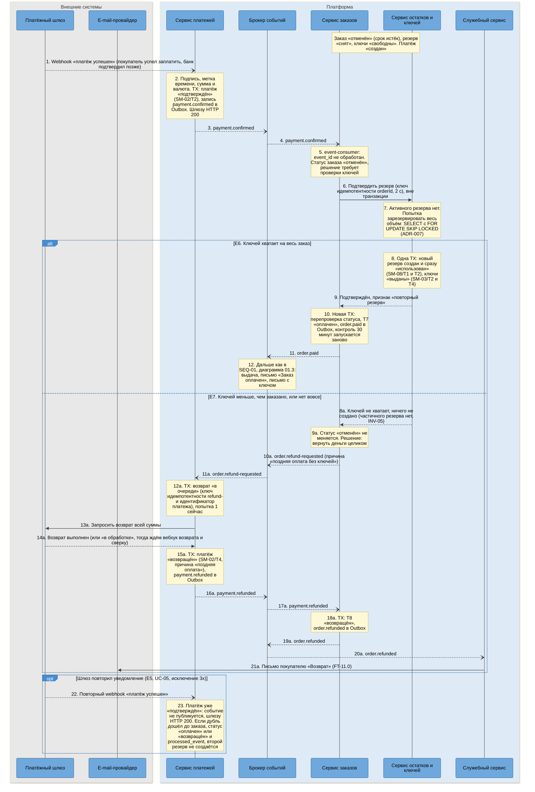
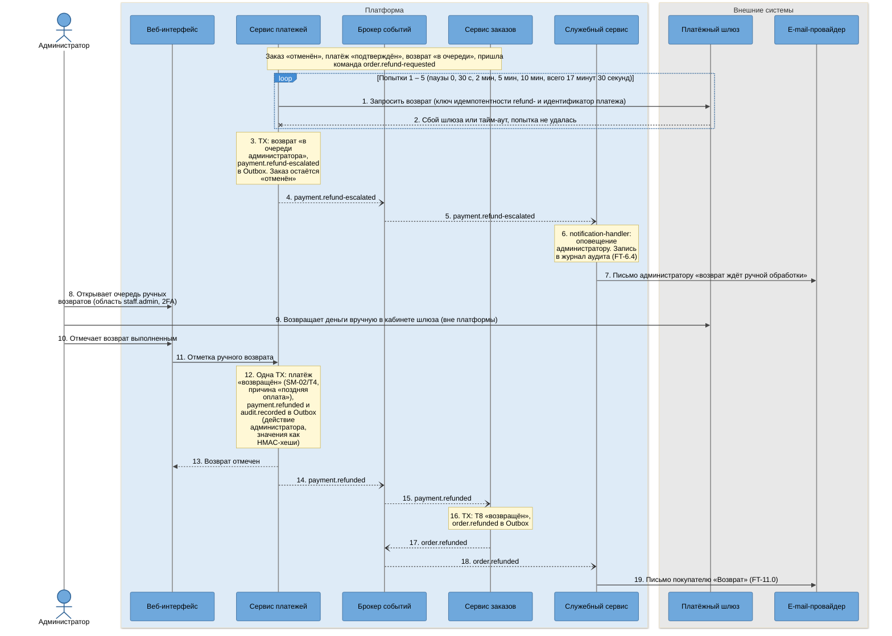

# SEQ-02. Поздняя оплата: перерезервирование и автовозврат

| Поле | Содержание |
| --- | --- |
| ID | SEQ-02 (диаграммы 02.1 и 02.2) |
| Релиз | R1 |
| Фаза | Ф2, шаг 7 |
| Источники | [BPMN-01](../03-processes/BPMN-01-purchase.md) (E6, E7, E8), [UC-05](../02-requirements/UC-05-late-payment.md), [SM-01](../03-processes/SM-01-order.md) (T6, T7, T8), [SM-02](../03-processes/SM-02-payment.md) (T2, T4), [SM-03](../03-processes/SM-03-key.md), [SM-08](../03-processes/SM-08-reservation.md) |
| Решения | [ADR-013](adr/ADR-013-late-payment.md) (поздняя оплата), [ADR-004](adr/ADR-004-saga-purchase.md) (шаг 5 и шаг 7 саги), [ADR-007](adr/ADR-007-double-issue-protection.md), [ADR-015](adr/ADR-015-payment-gateway-integration.md) (возврат), [ADR-006](adr/ADR-006-idempotency.md) |
| Нотация | [c4-notation.md](c4-notation.md), раздел 8 |
| Предыдущий сценарий | [SEQ-01](sequence-purchase.md), диаграмма 01.2, ветвь E4 (резерв истёк) |

## 1. Цель и границы

Показать, как подтверждение платежа, пришедшее после снятия резерва, без участия человека превращается в успешную выдачу (E6) или в возврат всей суммы (E7), и что происходит, когда шлюз не принимает автовозврат (E8). Платформа не может запретить шлюзу принять деньги после окончания нашей сессии, поэтому ветка обязана быть штатной.

| Диаграмма | Что показывает | Переходы | Исключения BPMN-01 |
| --- | --- | --- | --- |
| 02.1 | Позднее подтверждение, повторный резерв. Ключи есть: выдача. Ключей нет: автовозврат | SM-01/T7 или T8, SM-02/T2 и T4, SM-08/T1 и T2 | E6, E7 |
| 02.2 | Автовозврат не удался, передача администратору, ручной возврат | SM-02/T4, SM-01/T8 | E8 |

## 2. Участники

| Алиас | Роль в сценарии |
| --- | --- |
| `payment-gateway` | Внешний шлюз: присылает позднее подтверждение, исполняет возврат |
| `payment-service` | Принимает вебхук, исполняет возврат, ведёт очередь ручных возвратов |
| `kafka` | События `payment.confirmed`, `order.refund-requested`, `payment.refunded`, `payment.refund-escalated` |
| `order-service` | Оркестратор: решает, что делать с оплатой по отменённому заказу |
| `inventory-service` | Единая операция «подтвердить резерв» с повторным резервированием |
| `platform-service` | Письма покупателю и оповещение администратора, журнал аудита |
| `email-provider` | Внешний e-mail-провайдер |
| `admin`, `web-app` | Администратор и веб-интерфейс (только 02.2) |

## 3. Предусловия и постусловия

| | Содержание |
| --- | --- |
| Предусловия | Заказ «отменён» с причиной «срок истёк» (SM-01/T6) или «платёжная сессия не открыта» (T12). Резерв «снят» или не создавался, ключи «свободны». Платёж «создан» (запись есть, у шлюза платёж мог остаться открытым) |
| Постусловия, E6 | Заказ «оплачен» (T7), платёж «подтверждён», резерв «использован» (создан заново и сразу использован), ключи «выданы», выдача «в очереди», контроль 30 минут запущен заново. Дальше [SEQ-01](sequence-purchase.md), диаграмма 01.3 |
| Постусловия, E7 | Платёж «возвращён» (причина «поздняя оплата без ключей»), заказ «возвращён» (T8), ключи «свободны», покупатель получил письмо о возврате. Либо, если автовозврат не удался (E8), возврат у администратора, заказ «отменён» до его отметки |
| Инварианты | INV-05 (весь заказ или ничего), INV-14, INV-15, INV-16 (заказ «возвращён» только при платеже «возвращён»), INV-11 (один платёж на заказ) |

## 4. Диаграмма 02.1. Позднее подтверждение: перерезервирование или автовозврат

**Что видно на диаграмме.**

- Одна и та же операция «подтвердить резерв» (шаг 6) обслуживает и обычную, и позднюю оплату. Её ответ решает судьбу заказа, поэтому между «деньги пришли» и «ключи закреплены» нет окна, а двух разных путей в коде нет ([ADR-013](adr/ADR-013-late-payment.md)).
- В ветви E6 новый резерв проходит `активен` и `использован` в одной транзакции (SM-08/T1 и T2), поэтому у позднего платежа нет момента, когда ключи зарезервированы, но могут истечь.
- В ветви E7 заказ остаётся «отменён» до подтверждения возврата. «Возвращён» (T8) наступает только по событию `payment.refunded` (INV-16): заказ не бывает «возвращён» при платеже «подтверждён».
- Поздняя оплата может «отнять» ключи у нового покупателя: при нехватке выигрывает тот, чей резерв зафиксировался первым, очерёдность по моменту подтверждения резерва, не по моменту оплаты.

### 4.1. Шаги диаграммы 02.1

| № | Что происходит | Компонент | Статусы после шага | Переход SM |
| --- | --- | --- | --- | --- |
| 1 – 2 | Вебхук принят, платёж подтверждён | `webhook-controller`, `signature-verifier`, `payment-domain` | Платёж: «подтверждён». Заказ: «отменён». Резерв: «снят» | SM-02/T2 |
| 3 – 4 | Событие доставлено сервису заказов | `outbox-relay` → `kafka` → `event-consumer` | Без изменений | нет |
| 5 | Решение по статусу заказа | `saga-orchestrator`, `order-domain` | Без изменений | нет |
| 6 – 7 | Подтверждение резерва: резерва нет, попытка нового | `inventory-client` → `inventory-controller`, `reservation-service` | Без изменений | нет |
| 8 | E6: новый резерв создан и использован | `reservation-service` | Резерв: «использован» (новая запись). Ключи: «выданы» | SM-08/T1 и T2, SM-03/T2 и T4 |
| 9 – 10 | E6: заказ оплачен | `order-domain` | Заказ: «оплачен». Платёж: «подтверждён». Резерв: «использован». Ключи: «выданы» | SM-01/T7 |
| 11 – 12 | E6: событие для выдачи | `outbox-relay` | Выдача создаётся по SEQ-01, 01.3: «в очереди» | SM-06/T1 |
| 8a | E7: ключей не хватает | `reservation-service` | Резерв: нет записи. Ключи: «свободен». Заказ: «отменён» | нет |
| 9a – 11a | E7: команда возврата | `saga-orchestrator`, `order-domain`, `outbox-relay`, `event-consumer` → `refund-service` | Без изменений. Заказ остаётся «отменён» | нет |
| 12a – 14a | E7: запрос возврата у шлюза | `refund-service`, `refund-worker`, `gateway-client` | Возврат: «в очереди» → выполнен. Платёж: «подтверждён» | нет |
| 15a | E7: платёж возвращён | `payment-domain` | Платёж: «возвращён» | SM-02/T4 |
| 16a – 18a | E7: заказ возвращён | `outbox-relay`, `event-consumer`, `saga-orchestrator`, `order-domain` | Заказ: «возвращён» | SM-01/T8 |
| 19a – 21a | E7: письмо о возврате | `outbox-relay`, `notification-handler`, `email-sender` | Без изменений | нет |
| 22 – 23 | E5: повторный вебхук игнорируется | `webhook-controller`, `payment-repository` | Без изменений | нет |

### 4.2. Времена и повторы диаграммы 02.1

| Параметр | Значение | Источник |
| --- | --- | --- |
| Запас между сессией и резервом | 12 минут сессии, 15 минут резерва, запас 3 минуты (не меньше 2 минут 53 секунд с учётом шага открытия сессии) | ADR-013, INV-07 |
| Подтверждение резерва | 2 с, при недоступности остатков обработка события повторяется (1, 5, 25 с, затем DLQ) | ADR-004, ADR-011 |
| Автовозврат, попытки | 0, 30 с, 2 мин, 5 мин, 10 мин (накопительно 17 минут 30 секунд) | ADR-015 |
| Ответ шлюза | «Выполнен» или «в обработке», в последнем случае ждём вебхук возврата, сверка проверяет статус | ADR-015 |
| Контроль выдачи после T7 | 30 минут от нового `paid_at` | ADR-011, SM-01 |

## 5. Диаграмма 02.2. Автовозврат не удался: очередь администратора

Продолжает ветвь E7, когда шлюз не принимает возврат во всех пяти попытках (E8, UC-05, исключения 3z и 3w).

**Что видно на диаграмме.**

- Горизонт автоматических попыток 17 минут 30 секунд укладывается в 30 минут из NFT-2.4: к моменту, когда заказ мог бы «потеряться», он уже в очереди администратора.
- Администратор вне платформы выполняет единственное действие, возврат в кабинете шлюза. Всё остальное (отметка, статус заказа, письмо) платформа делает сама после его отметки, как после обычного подтверждения шлюза.
- Отметка администратора и вебхук возврата проходят через один обработчик «результат платежа» и общий дедуп, поэтому если шлюз всё же исполнил возврат раньше отметки, повторный результат не создаст второй переход ([ADR-015](adr/ADR-015-payment-gateway-integration.md), три источника результата).
- Для заглушки шлюза отметка администратора это та же команда управления на отдельном административном порту.

### 5.1. Шаги диаграммы 02.2

| № | Что происходит | Компонент | Статусы после шага | Переход SM |
| --- | --- | --- | --- | --- |
| 1 – 2 | Попытки возврата не принимаются шлюзом | `refund-worker`, `refund-service`, `gateway-client` | Платёж: «подтверждён». Возврат: «в очереди». Заказ: «отменён» | нет |
| 3 | Возврат передан администратору | `refund-service` | Возврат: «в очереди администратора». Платёж: «подтверждён». Заказ: «отменён» | нет |
| 4 – 7 | Оповещение администратора и запись в журнал | `outbox-relay`, `notification-handler`, `audit-consumer`, `email-sender` | Без изменений | нет |
| 8 – 11 | Администратор вернул деньги в кабинете шлюза и отметил возврат | `payment-controller` | Без изменений | нет |
| 12 | Платёж возвращён | `payment-domain`, `refund-service` | Платёж: «возвращён» | SM-02/T4 |
| 13 | Ответ администратору | `payment-controller` | Без изменений | нет |
| 14 – 16 | Заказ возвращён | `outbox-relay`, `event-consumer`, `saga-orchestrator`, `order-domain` | Заказ: «возвращён» | SM-01/T8 |
| 17 – 19 | Письмо о возврате | `outbox-relay`, `notification-handler`, `email-sender` | Без изменений | нет |

### 5.2. Времена и повторы диаграммы 02.2

| Параметр | Значение | Источник |
| --- | --- | --- |
| Попытки автовозврата | 5, паузы 0, 30 с, 2 мин, 5 мин, 10 мин | ADR-015 |
| Горизонт до передачи администратору | 17 минут 30 секунд, меньше 30 минут NFT-2.4 | ADR-013, NFT-2.4 |
| Метрики | `late_payments_total`, `autorefund_total{result="ok" или "escalated"}`, `payment_anomalies_total` | ADR-013 (NFT-6.1) |

## 6. Статусы заказа, которые диаграммы не показывают

Таблица решений оркестратора по событию `payment.confirmed` ([ADR-013](adr/ADR-013-late-payment.md), решение 3) полнее диаграммы. Остальные строки:

| Статус заказа при подтверждении | Что происходит | Почему не нарисовано |
| --- | --- | --- |
| «ожидает оплаты», резерв уже снят, но `reservation.expired` ещё не обработан | Тот же вызов «подтвердить резерв». Ключи есть: T4 «оплачен», ключей нет: T6 и возврат | Это обычная оплата на границе срока, путь совпадает с 02.1 с другим переходом (T4 вместо T7) |
| «оплачен» или «выдан» | Событие игнорируется (E5) | Показано как ветвь «шлюз повторил уведомление» |
| «отменён» после отказа шлюза (платёж «отклонён») | Аномалия SM-02: статусы не меняются, метрика `payment_anomalies_total`, разбор администратором (UC-05, исключение 3y) | Ошибка шлюза, не штатный сценарий |
| «возвращён» | Аномалия: событие не меняет заказ, метрика, разбор администратором | То же |
| «создан» | Подтверждение обогнало ответ о сессии: повторить обработку позже | Редкая гонка, заглушка отвечает мгновенно (ADR-004) |
| Заказ «отменён» по E12, платёж у шлюза всё же создан | Подтверждение сопоставляется по заказу, дальше как 02.1 | Совпадает с 02.1, запись платежа остаётся «создан» без внешнего идентификатора ([SEQ-01](sequence-purchase.md), шаг 13a) |

## 7. Покрытие исключений и переходов

| Что | Где нарисовано |
| --- | --- |
| E5 (повторный вебхук) | 02.1, шаги 22 – 23 (основное описание в [SEQ-01](sequence-purchase.md), 01.2) |
| E6 | 02.1, шаги 8 – 12 |
| E7 | 02.1, шаги 8a – 21a |
| E8 | 02.2, шаги 1 – 19 |
| SM-01/T7 | 02.1, шаг 10 |
| SM-01/T8 | 02.1, шаг 18a и 02.2, шаг 16 |
| SM-02/T2, SM-02/T4 | 02.1, шаги 2 и 15a, 02.2, шаг 12 |

## 8. Что произойдёт при сбое

| Точка падения | Что происходит | Чем закрыто |
| --- | --- | --- |
| `order-service` после шага 6, до шага 10 (E6) | Ключи уже закреплены новым резервом, заказ ещё «отменён» | Событие придёт повторно, подтверждение идемпотентно: вернёт «подтверждён» без нового резерва, T7 запишется |
| `inventory-service` недоступен на шаге 6 | Платёж подтверждён, заказ «отменён» | Обработка события повторяется (1, 5, 25 с), затем `payment.events.dlq` с оповещением ([SEQ-03](sequence-guaranteed-delivery.md), 03.3). После устранения причины администратор запускает повторную обработку |
| `payment-service` упал после шага 12a, до шага 13a | Возврат «в очереди», запрос шлюзу не ушёл | `refund-worker` берёт возврат по `next_attempt_at` после перезапуска. Повторный запрос с тем же ключом идемпотентности не вернёт деньги дважды |
| Шлюз выполнил возврат, а ответ потерян | Платёж «подтверждён», возврат «в очереди» | Повторный запрос с тем же ключом вернёт тот же результат, либо сверка и вебхук возврата закроют платёж «возвращён» |
| Администратор отметил возврат, шлюз потом присылает вебхук возврата | Платёж уже «возвращён» | Дедуп результата платежа: переход не повторяется |

## 9. Решения и замечания

| № | Вопрос | Решение | Причина |
| --- | --- | --- | --- |
| 1 | Где проверять наличие ключей при поздней оплате | В `inventory-service`, одной операцией «подтвердить резерв» | Атомарность и один путь для T4 и T7 (ADR-013, часть 2) |
| 2 | Что делать, если свободна часть ключей | Ничего не резервировать, вернуть деньги целиком | FT-6.5: частичной выдачи нет |
| 3 | Статус заказа во время автовозврата | «отменён» до `payment.refunded` | SM-01: «возвращён» только при платеже «возвращён» (INV-16) |
| 4 | Письмо при E7 | Только письмо о возврате (T8). Письма об отмене заказа нет | SM-01, «Уведомления покупателю» |
| 5 | Запись платежа при E12 | Остаётся «создан» без внешнего идентификатора | Шлюз мог создать платёж, ответ которого потерян. Строка «отменён, платёжная сессия не открыта» в SM-01 «Согласованность статусов» («платёж: нет записи») описывает вид с точки зрения заказа, уточнение в отчёте Ф2 |

## 10. Связанные документы

- [SEQ-01](sequence-purchase.md): основной путь, ветвь E4, из которой вырастает поздняя оплата
- [SEQ-03](sequence-guaranteed-delivery.md): сбои выдачи после T7
- [c4-components-payment-service.md](c4-components-payment-service.md), [c4-components-order-service.md](c4-components-order-service.md), [c4-components-inventory-service.md](c4-components-inventory-service.md): компоненты из столбцов «Компонент»
- [UC-05](../02-requirements/UC-05-late-payment.md), [BPMN-01](../03-processes/BPMN-01-purchase.md)
