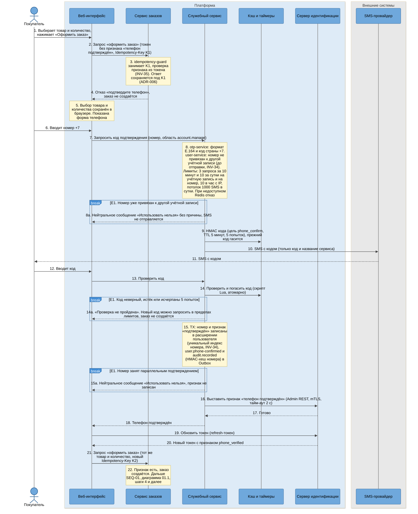
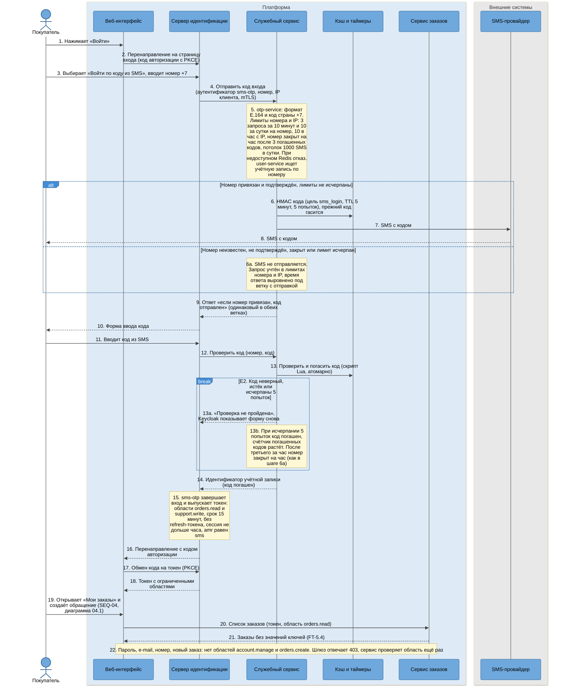

# SEQ-05. Подтверждение телефона и вход по коду из SMS

| Поле | Содержание |
| --- | --- |
| ID | SEQ-05 (диаграммы 05.1 и 05.2) |
| Релиз | R1 |
| Фаза | Ф2, шаг 7 |
| Источники | [BPMN-01](../03-processes/BPMN-01-purchase.md) (подпроцесс «Подтвердить телефон», E1), [BPMN-04](../03-processes/BPMN-04-support-request.md) (подпроцесс «Войти по коду из SMS», E2), [US-1.6](../02-requirements/US-01-accounts.md), [US-1.7](../02-requirements/US-01-accounts.md) |
| Решения | [ADR-010](adr/ADR-010-keycloak-sms-codes.md) (владелец кодов, Redis, лимиты, ограниченная сессия), [ADR-006](adr/ADR-006-idempotency.md) (повтор после отказа с новым ключом), [ADR-014](adr/ADR-014-audit-log-no-pii.md), [ADR-021](adr/ADR-021-api-gateway.md) (области токена), [ADR-022](adr/ADR-022-internal-traffic-encryption.md) |
| Нотация | [c4-notation.md](c4-notation.md), раздел 8 |
| Предыдущий сценарий | [SEQ-04](sequence-email-change.md): смена e-mail использует тот же механизм кодов |
| Связанный сценарий | [SEQ-01](sequence-purchase.md): диаграмма 01.1 возвращает покупателя к подтверждению телефона (шаги 3a и 3b) |

## 1. Цель и границы

Показать два места, где платформа проверяет владение телефоном: единственное подтверждение перед первой покупкой (диаграмма 05.1) и вход по одноразовому коду, когда покупатель потерял доступ к почте (диаграмма 05.2). Общее у них одно: коды выдаёт и проверяет `platform-service`, хранит Redis, а Keycloak выпускает токен и не знает бизнес-правил кодов.

| Диаграмма | Что показывает | Исключения процессов | Инварианты |
| --- | --- | --- | --- |
| 05.1 | Отказ при оформлении заказа, SMS с кодом, проверка, запись номера, признак для токена, повтор покупки | E1 BPMN-01 (три причины: номер занят, код неверный, параллельная привязка) | INV-34, INV-35 |
| 05.2 | Номер, нейтральный ответ, код, токен с ограниченными областями, запрет остальных действий | E2 BPMN-04 | INV-35 (по токену нельзя оформить заказ), NFT-3.5, NFT-3.7 |

Не показано: смена номера (R2, [BPMN-07](../03-processes/BPMN-07-phone-change.md), те же компоненты и коды с другими назначениями) и смена e-mail ([SEQ-04](sequence-email-change.md)).

## 2. Участники

| Алиас | Роль в сценарии |
| --- | --- |
| `buyer` | Покупатель (в 05.1 вошёл по паролю или через VK ID, в 05.2 не вошёл) |
| `web-app` | Форма телефона, форма кода, перенаправление на вход, хранение выбора товара до подтверждения |
| `keycloak` | Токены, обновление токена с признаком из атрибута, аутентификатор `sms-otp` (SPI) для 05.2 |
| `platform-service` | Модуль `identity`: `identity-controller`, `otp-controller`, `otp-service`, `user-service`, `sms-client`, `keycloak-admin-client` |
| `order-service` | Проверка признака «телефон подтверждён» из токена (INV-35), сервис для запретных действий в 05.2 |
| `redis` | Коды (HMAC), счётчики попыток и лимитов |
| `sms-provider` | Внешний провайдер SMS (в проекте его играет `external-stubs`) |

## 3. Предусловия и постусловия

| | 05.1. Подтверждение телефона | 05.2. Вход по коду из SMS |
| --- | --- | --- |
| Предусловия | Покупатель вошёл в систему, выбрал товар и количество от 1 до 10. Телефон не подтверждён | Телефон подтверждён раньше (05.1). Покупатель не вошёл и не может войти по e-mail (потерян доступ к почте или пароль) |
| Постусловия, успех | Номер привязан и уникален, признак «подтверждён» в `platform_db` и в токене. Заказ создаётся повтором запроса с новым ключом идемпотентности | Открыта ограниченная сессия: заказы и обращения. Токен на 15 минут без refresh-токена |
| Постусловия, неудача | Заказ не создан, номер не привязан (E1). Покупатель может запросить код снова в пределах лимитов | Сессия не открыта (E2). Обращение не создано |
| Что не меняется | Номер привязывается один раз. Сменить его по этому сценарию нельзя | Пароль, e-mail и номер по такой сессии менять нельзя |

## 4. Диаграмма 05.1. Подтверждение телефона перед первой покупкой

**Что видно на диаграмме.**

- Проверка идёт по признаку из токена, а не по запросу в `platform-service` (INV-35): заказ не зависит от доступности служебного сервиса на каждой покупке. Цена этого решения: после подтверждения нужен новый токен (шаги 19 – 20).
- Отказ сохраняется под ключом K1 (ADR-006: хранятся все завершённые ответы, в том числе 4xx). Повтор с K1 вернул бы тот же отказ, поэтому интерфейс берёт K2 (шаг 21). Это же правило записано в SEQ-01, шаг 3b.
- Номер проверяется на занятость дважды. Первая проверка (шаг 8) закрывает типичный случай до траты SMS. Вторая это уникальный индекс в момент записи (шаг 15): он единственный закрывает гонку двух учётных записей, которые подтверждают один номер одновременно.
- Нейтральное сообщение одно для всех причин отказа в привязке номера (шаги 8a и 15a), чтобы вошедший пользователь не мог перебором узнавать занятые номера. Остаточный риск (раскрытие занятости в пределах дневного лимита) разобран в модели угроз (шаг 9).
- Код живёт только в Redis как HMAC с секретом `otp_pepper`. Потеря Redis означает «запросите код заново», долговечно только то, что записано в шаге 15.

### 4.1. Шаги диаграммы 05.1

| № | Что происходит | Компонент | Статусы после шага | Переход SM |
| --- | --- | --- | --- | --- |
| 1 – 4 | Оформление отклонено: телефон не подтверждён | `order-controller`, `idempotency-guard`, `order-domain` | Заказа нет. Телефон: «не подтверждён». K1: занят, ответ 403 сохранён | нет |
| 5 – 6 | Выбор сохранён, номер введён | `web-app` | Без изменений | нет |
| 7 – 8 | Запрос кода, проверки до отправки | `identity-controller`, `otp-service`, `user-service` | Без изменений | нет |
| 8a | E1: номер занят | `identity-controller` | Телефон: «не подтверждён». Кода нет | нет |
| 9 – 11 | Код отправлен | `otp-service`, `sms-client` | Код: активен 5 минут | нет |
| 12 – 14 | Код введён и проверен | `identity-controller`, `otp-service` | Код: погашен | нет |
| 14a | E1: проверка не пройдена | `otp-service`, `identity-controller` | Телефон: «не подтверждён». Код: погашен или осталось попыток | нет |
| 15 | Номер и признак записаны | `user-service`, `identity-repository` | Телефон: «подтверждён» | нет (у пользователя нет статусной модели) |
| 15a | E1: параллельная привязка | `user-service`, `identity-repository` | Телефон: «не подтверждён» | нет |
| 16 – 18 | Признак передан в Keycloak | `keycloak-admin-client` | Атрибут пользователя в Keycloak: `phone_verified` | нет |
| 19 – 20 | Токен обновлён | `web-app`, `keycloak` | Токен: с признаком | нет |
| 21 – 22 | Повторное оформление | `order-controller`, затем SEQ-01 | Заказ: «создан» (SEQ-01, шаг 6) | SM-01/T1 (в SEQ-01) |

### 4.2. Времена и повторы диаграммы 05.1

| Параметр | Значение | Источник |
| --- | --- | --- |
| Срок жизни кода | 5 минут | NFT-3.7 |
| Попытки ввода | 5 на код, после пятой неудачи код погашен | NFT-3.7 |
| Запросы кода | 3 за 10 минут и 10 за сутки на учётную запись и на номер, 10 в час с IP | NFT-3.5, ADR-010 |
| Потолок SMS | 1000 в сутки (параметр платформы), оповещение при 80 процентах | ADR-010 |
| Вызов Keycloak Admin REST | Тайм-аут 2 секунды, значение закрепляет `time-budgets.md` | ADR-010 |
| Сверка признака | Компонент `identity-reconciler` раз в минуту повторяет передачу признака для записей, где она не удалась | Решение 2 раздела 8 |

## 5. Диаграмма 05.2. Вход по коду из SMS

Покупатель не может войти по e-mail и паролю. Вход по SMS идёт через стандартный поток Keycloak (код авторизации с PKCE): страницу входа показывает Keycloak, а аутентификатор `sms-otp` вызывает `platform-service`.

**Что видно на диаграмме.**

- Ответ на запрос кода не зависит от того, привязан ли номер (шаг 9): злоумышленник не узнаёт по ответу, есть ли у номера учётная запись. Неизвестные номера не стоят SMS (шаг 6a), но стоят лимитов и времени, поэтому перебор номеров упирается в лимит IP и в выравнивание времени.
- Код проверяет `platform-service`, а не Keycloak: правила (срок, попытки, лимиты) в одном месте для всех сценариев кодов. Keycloak получает только «да» с идентификатором учётной записи (шаг 14) и выпускает токен сам, в обход Keycloak токена нет (ADR-010, вариант 4).
- Ограничения сессии заданы **областями токена**, а не признаком: `account.manage` нет, `orders.create` нет (шаг 15). Проверка идёт на шлюзе и ещё раз в сервисе. Из-за этого по SMS нельзя ни сменить e-mail, ни оформить заказ, ни зайти на `/account/**`.
- Токен живёт 15 минут и не продлевается (шаг 15): украденная сессия живёт недолго, а покупателю для обращения хватает времени. Значения ключей в кабинете не показываются (FT-5.4), красть из сессии нечего.
- Подмена SIM-карты остаётся остаточным риском (шаг 7 и шаг 11): злоумышленник получает доступ к списку заказов и может создать обращение, но не к ключам и не к данным учётной записи. Письмо владельцу о входе по SMS в требованиях не предусмотрено, рекомендация вынесена в замечания к требованиям v1.6 (отчёт Ф2) и в модель угроз.

### 5.1. Шаги диаграммы 05.2

| № | Что происходит | Компонент | Статусы после шага | Переход SM |
| --- | --- | --- | --- | --- |
| 1 – 3 | Покупатель на странице входа, ввёл номер | `web-app`, `keycloak` | Сессии нет | нет |
| 4 – 5 | Запрос кода, проверки лимитов, поиск по номеру | `otp-controller`, `otp-service`, `user-service` | Без изменений | нет |
| 6 – 8 | Код отправлен | `otp-service`, `sms-client` | Код: активен 5 минут | нет |
| 6a | Номер неизвестен, закрыт или лимит исчерпан | `otp-service` | Кода нет, счётчики номера и IP выросли | нет |
| 9 – 10 | Нейтральный ответ, форма кода | `otp-controller`, `keycloak` | Без изменений | нет |
| 11 – 13 | Код введён и проверен | `otp-controller`, `otp-service` | Код: погашен | нет |
| 13a – 13b | E2: проверка не пройдена | `otp-service`, `otp-controller` | Код: погашен или осталось попыток. Сессии нет | нет |
| 14 – 15 | Токен выпущен | `keycloak` (`sms-otp`) | Сессия: открыта, области `orders.read`, `support.write` | нет |
| 16 – 18 | Токен получен интерфейсом | `web-app`, `keycloak` | Без изменений | нет |
| 19 – 21 | Заказы и обращение | `order-controller`, затем SEQ-04 | Без изменений | нет |
| 22 | Запрещённые действия | `api-gateway`, контроллеры сервисов | Без изменений | нет |

### 5.2. Времена и повторы диаграммы 05.2

| Параметр | Значение | Источник |
| --- | --- | --- |
| Срок жизни кода, попытки | 5 минут, 5 попыток | NFT-3.7 |
| Лимиты запросов | 3 за 10 минут и 10 за сутки на номер, 10 в час с IP | NFT-3.5, ADR-010 |
| Закрытие номера | На час после 3 погашенных из-за попыток кодов за час | ADR-010 |
| Токен SMS-сессии | 15 минут, без refresh-токена, сессия не дольше часа | ADR-010 |
| Выравнивание времени ответа | Ответ на запрос кода идёт не быстрее нижней границы времени ветки с отправкой SMS. Значение задаётся в `time-budgets.md` | Решение 4 раздела 8 |

## 6. Исключения и переходы: покрытие

| Что | Где нарисовано |
| --- | --- |
| E1 BPMN-01 (телефон не подтверждён) | 05.1: шаги 8a (номер занят), 14a (код), 15a (гонка) |
| E2 BPMN-04 (вход по SMS не удался) | 05.2, шаги 13a – 13b |
| Номер закрыт на час, лимит исчерпан | 05.2, шаг 6a (внешне неотличим от неизвестного номера) |
| Redis недоступен | Не нарисовано: отказ закрыт, см. раздел 7 |
| Смена номера (R2) | Не показано: R2, [BPMN-07](../03-processes/BPMN-07-phone-change.md) |
| Переходы SM | Нет: у пользователя и кода статусной модели нет, коды описаны в [domain-model.md](../04-domain/domain-model.md), раздел 5 |

## 7. Что произойдёт при сбое

| Точка падения | Что происходит | Чем закрыто |
| --- | --- | --- |
| `platform-service` упал между записью номера (шаг 15) и вызовом Keycloak (шаг 16) | Номер привязан, признака в токене нет, покупатель видит отказ «подтвердите телефон» | Запись содержит признак «передан в Keycloak: нет». Сверка `identity-reconciler` раз в минуту повторяет шаг 16 (идемпотентно), покупатель повторяет покупку через минуту |
| Keycloak недоступен на шаге 16 | Покупатель получает ответ «телефон подтверждён, обновление может занять минуту» | Один повтор с тайм-аутом 2 секунды, затем сверка. Номер не теряется |
| Redis недоступен | Коды не выдаются и не проверяются | Отказ закрыт (fail-closed, ADR-010): безопаснее, чем отправка SMS без лимитов. Покупатель видит, что код отправить сейчас нельзя |
| SMS не дошла | Код действует 5 минут | Новый запрос гасит прежний код в пределах лимита 3 за 10 минут. Статус SMS от провайдера идёт в метрику |
| `platform-service` недоступен при входе по SMS | Вход по SMS невозможен | Вход по паролю и VK ID не зависит от `platform-service`. Это принятый минус ADR-010 |
| Токен SMS-сессии истёк за 15 минут | Покупатель вынужден войти снова | Новый код в пределах лимитов. Обращение, начатое до истечения, сохранено |

## 8. Решения и замечания

| № | Вопрос | Решение | Причина |
| --- | --- | --- | --- |
| 1 | Где проверяется «телефон подтверждён» при заказе | По признаку из токена, не запросом к `platform-service` | INV-35, критический путь покупки не зависит от служебного сервиса. Цена: новый токен после подтверждения |
| 2 | Порядок записи номера и признака в Keycloak | Сначала запись в `platform_db`, затем Admin REST, сверка раз в минуту при сбое | Номер принадлежит платформе, атрибут Keycloak производный. Обратный порядок мог бы отметить учётную запись подтверждённой, не привязав номер (нарушение INV-35) |
| 3 | Повторный заказ после отказа | Новый Idempotency-Key | ADR-006 хранит и отказы. Правило единое для SEQ-01 и SEQ-05 |
| 4 | Выравнивание времени ответа при входе по SMS | Ветка без отправки ждёт нижней границы времени ветки с отправкой | Иначе по времени ответа различим привязанный номер. Значение границы фиксирует `time-budgets.md` |
| 5 | Письмо владельцу о входе по SMS | Не вводится в R1, рекомендовано | Требований нет. Смягчает подмену SIM, отражено в замечаниях к требованиям v1.6 и в модели угроз |
| 6 | Может ли SMS-сессия создавать новые заказы | Нет, области `orders.create` нет | ADR-010. Формулировка FT-1.7 «только заказы и обращения» читается как просмотр заказов, уточнение внесено в замечания к требованиям v1.6 |
| 7 | Аудит входа по SMS | Записи в журнале аудита платформы нет: журнал ведёт действия сотрудников (NFT-3.6). События входа есть в журнале Keycloak, способ входа виден по `amr` | Объём журнала аудита и его назначение. Решение 5 снижает риск |

## 9. Связанные документы

- [SEQ-01](sequence-purchase.md): диаграмма 01.1 ведёт сюда при отказе по E1
- [SEQ-04](sequence-email-change.md): использование тех же кодов при смене e-mail
- [ADR-010](adr/ADR-010-keycloak-sms-codes.md), [ADR-006](adr/ADR-006-idempotency.md)
- [c4-components-platform-service.md](c4-components-platform-service.md), [c4-components-order-service.md](c4-components-order-service.md): компоненты из столбцов «Компонент»
- [BPMN-01](../03-processes/BPMN-01-purchase.md), [BPMN-04](../03-processes/BPMN-04-support-request.md), [US-01-accounts.md](../02-requirements/US-01-accounts.md)
