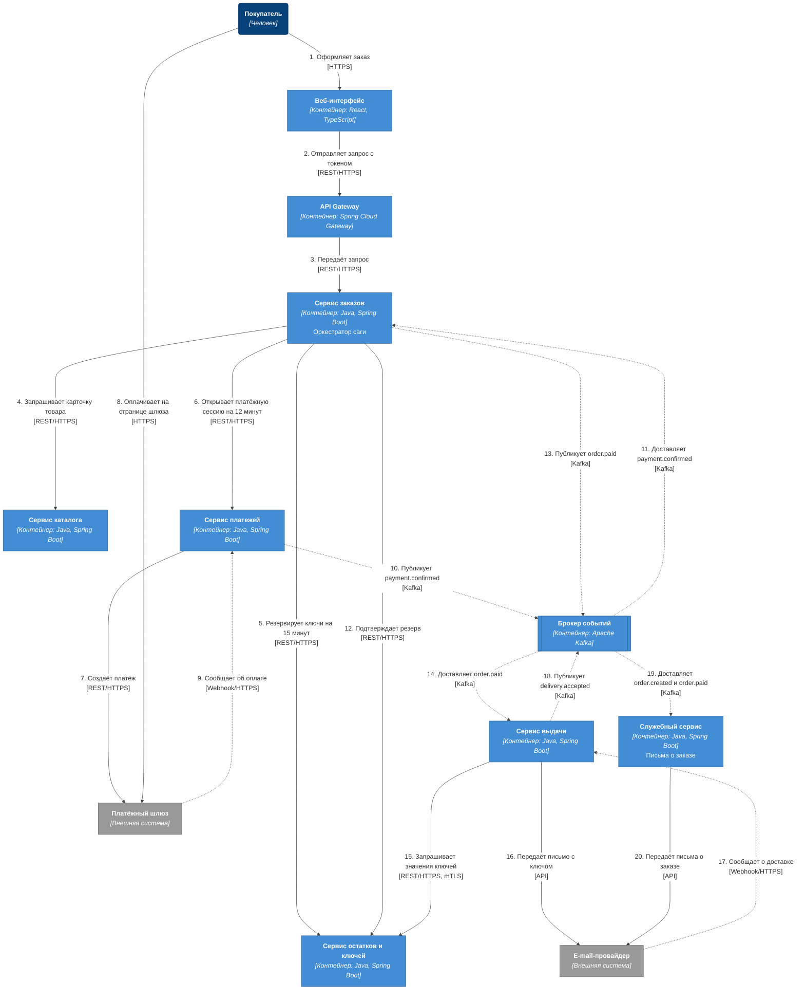
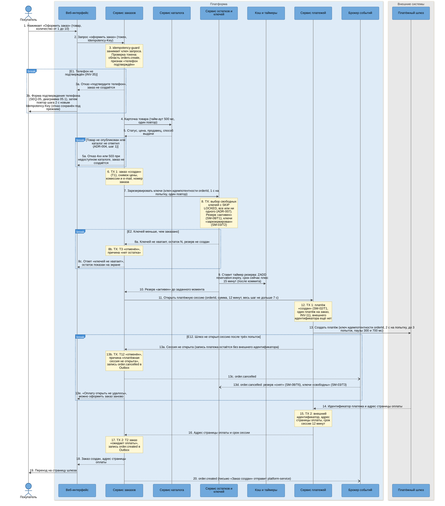
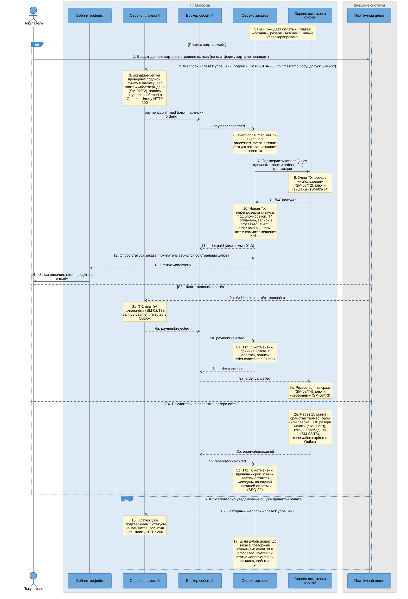
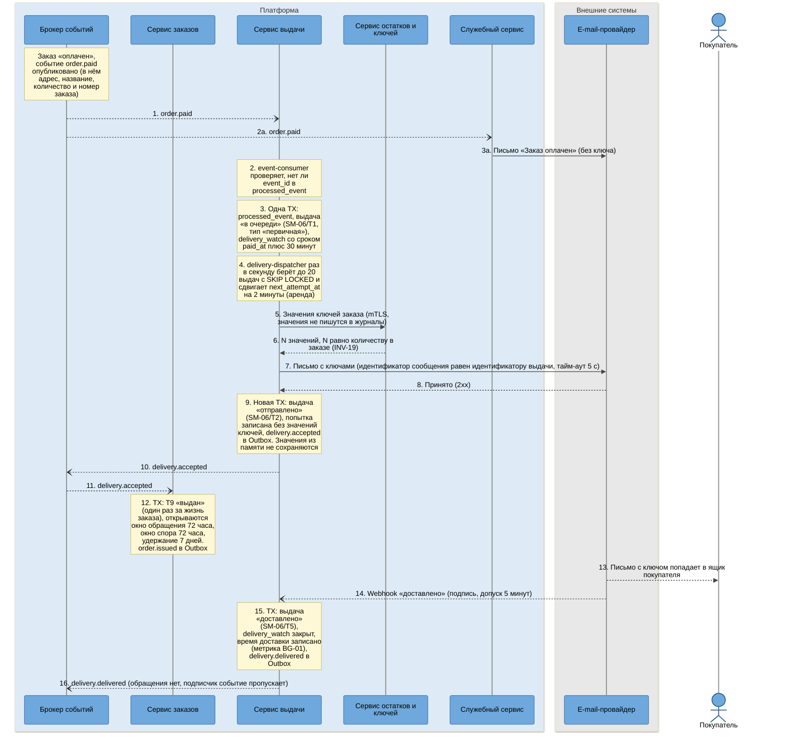

# SEQ-01. Покупка: основной путь и исключения до оплаты

| Поле | Содержание |
| --- | --- |
| ID | SEQ-01 (диаграммы 01.0 – 01.3) |
| Релиз | R1 |
| Фаза | Ф2, шаг 7 |
| Источники | [BPMN-01](../03-processes/BPMN-01-purchase.md) (основной путь, E1 – E5, E12), [UC-01](../02-requirements/UC-01-purchase.md), [UC-03](../02-requirements/UC-03-key-issuance.md), [SM-01](../03-processes/SM-01-order.md), [SM-02](../03-processes/SM-02-payment.md), [SM-03](../03-processes/SM-03-key.md), [SM-06](../03-processes/SM-06-delivery.md), [SM-08](../03-processes/SM-08-reservation.md) |
| Решения | [ADR-004](adr/ADR-004-saga-purchase.md) (сага), [ADR-005](adr/ADR-005-transactional-outbox.md) (Outbox), [ADR-006](adr/ADR-006-idempotency.md) (идемпотентность), [ADR-007](adr/ADR-007-double-issue-protection.md) (защита от двойной выдачи), [ADR-011](adr/ADR-011-guaranteed-delivery.md) (выдача), [ADR-012](adr/ADR-012-reservation-redis-timer.md) (таймер резерва), [ADR-015](adr/ADR-015-payment-gateway-integration.md) (шлюз) |
| Нотация | [c4-notation.md](c4-notation.md), раздел 8 |
| Продолжение | [SEQ-02](sequence-late-payment.md) (поздняя оплата, E6 – E8), [SEQ-03](sequence-guaranteed-delivery.md) (сбои выдачи, E9 – E11), [SEQ-05](sequence-phone-sms-login.md) (подтверждение телефона, E1) |

## 1. Цель и границы

Показать, как покупка проходит через шесть участников платформы и две внешние системы, где вызовы синхронные, где события, и в каких точках сценарий может свернуть в отмену. Сценарий разрезан на четыре диаграммы:

| Диаграмма | Что показывает | Переходы SM-01 | Исключения BPMN-01 |
| --- | --- | --- | --- |
| 01.0 | Динамика C4 основного пути целиком, без ветвлений | T1, T2, T4, T9 | нет |
| 01.1 | Оформление заказа, резерв ключей, платёжная сессия | T1, T2, T3, T12 | E1, E2, E12 |
| 01.2 | Оплата, подтверждение резерва, ожидание: три исхода | T4, T5, T6 | E3, E4, E5 |
| 01.3 | Выдача ключа и подтверждение доставки | T9 | нет (сбои выдачи в SEQ-03) |

## 2. Участники

Участники это контейнеры из [c4-containers.md](c4-containers.md) с теми же алиасами. Запросы пользователя и вебхуки внешних систем проходят через `api-gateway` (проверка токена или подписи, ограничение частоты, [ADR-021](adr/ADR-021-api-gateway.md)), на sequence-диаграммах он не показан, чтобы не удваивать число стрелок.

| Алиас | Роль в сценарии |
| --- | --- |
| `buyer` | Покупатель |
| `web-app` | Показывает экраны, опрашивает статус заказа |
| `order-service` | Оркестратор саги, владелец заказа (SM-01) |
| `catalog-service` | Отдаёт карточку товара (статус, цена, продавец, способ выдачи) |
| `inventory-service` | Резерв и выдача ключей (SM-03, SM-08) |
| `redis` | Таймер резерва, ZSET `reservation:expiry` ([ADR-012](adr/ADR-012-reservation-redis-timer.md)) |
| `payment-service` | Платёж (SM-02), общение со шлюзом |
| `payment-gateway` | Внешний платёжный шлюз (в проекте его играет `external-stubs`) |
| `kafka` | Доставка событий между сервисами |
| `delivery-service` | Выдача (SM-06): очередь, письмо, повторы, статус письма |
| `email-provider` | Внешний e-mail-провайдер (в проекте его играет `external-stubs`) |
| `platform-service` | Письма «Заказ создан» и «Заказ оплачен» (модуль `notification`) |

## 3. Предусловия и постусловия

| | Содержание |
| --- | --- |
| Предусловия | Покупатель вошёл в систему, роль «Покупатель», токен с областью `orders.create` и признаком «телефон подтверждён» (при его отсутствии действует E1). Товар опубликован. Свободных ключей не меньше заказанного количества (от 1 до 10). Платёжный шлюз и e-mail-провайдер доступны |
| Постусловия, успех | Заказ «выдан» (T9), платёж «подтверждён», резерв «использован», ключи «выданы», выдача «доставлено». Покупатель получил письмо с ключом. Окно обращения 72 часа, окно спора 72 часа и удержание 7 дней открыты |
| Постусловия, отмена | Заказ «отменён» с причиной, ключи «свободны», резерв «снят» или не создавался. Данные карты на платформу не попадали. Письма об отмене нет, причину показывает интерфейс (SM-01) |

## 4. Диаграмма 01.0. Динамика C4: основной путь

Номера на стрелках это порядок взаимодействий. Сплошная стрелка это вызов с ожиданием ответа, пунктирная это событие или вебхук. Ветви исключений здесь не показаны, они на диаграммах 01.1 – 01.3.

| № | Участники по порядку стрелок | Что передаётся | Где подробно |
| --- | --- | --- | --- |
| 1 – 3 | `buyer` → `web-app` → `api-gateway` → `order-service` | Запрос «оформить заказ» с токеном и `Idempotency-Key` | 01.1, шаги 1 – 3 |
| 4 | `order-service` → `catalog-service` | Карточка товара | 01.1, шаги 4 – 5 |
| 5 | `order-service` → `inventory-service` | Зарезервировать ключи | 01.1, шаги 7 – 10 |
| 6, 7 | `order-service` → `payment-service` → `payment-gateway` | Открыть платёжную сессию, создать платёж | 01.1, шаги 11 – 16 |
| 8, 9 | `buyer` → `payment-gateway`, затем `payment-gateway` → `payment-service` | Оплата на странице шлюза, вебхук с результатом | 01.2, шаги 1 – 3 |
| 10, 11 | `payment-service` → `kafka` → `order-service` | Событие `payment.confirmed` | 01.2, шаги 4 – 5 |
| 12 | `order-service` → `inventory-service` | Подтвердить резерв | 01.2, шаги 7 – 9 |
| 13, 14 | `order-service` → `kafka` → `delivery-service` | Событие `order.paid` | 01.2, шаг 11, 01.3, шаги 1 – 3 |
| 15, 16 | `delivery-service` → `inventory-service`, `delivery-service` → `email-provider` | Значения ключей, письмо с ключом | 01.3, шаги 4 – 9 |
| 17, 18 | `email-provider` → `delivery-service`, `delivery-service` → `kafka` | Статус письма, событие `delivery.accepted` | 01.3, шаги 10 – 15 |
| 19, 20 | `kafka` → `platform-service` → `email-provider` | Письма «Заказ создан» и «Заказ оплачен» | 01.1, шаг 20, 01.3, шаги 2a – 3a |

Синхронных вызовов в основном пути три (каталог, резерв и платёжная сессия при оформлении) плюс «подтвердить резерв» после оплаты. Остальное идёт событиями. Почему так:

- Решение о заказе нельзя принять без ответа каталога, остатков и платежей: покупатель ждёт на экране, а ответ определяет, создавать ли заказ.
- Подтверждение резерва после оплаты тоже синхронное, чтобы между «оплачен» и «ключи закреплены» не было окна, в котором резерв истечёт (ADR-004, шаг 5).
- Всё, что не меняет решение о заказе (письма, выдача, статус письма), идёт событиями: сбой получателя не ломает покупку, а потерянное событие восстанавливается Outbox и повторами.

## 5. Диаграмма 01.1. Оформление заказа, резерв и платёжная сессия

**Что видно на диаграмме.**

- Транзакция базы заказа не держится во время сетевых вызовов. Заказ «создан» фиксируется до вызова остатков (шаг 6), результат записывается новой транзакцией с перепроверкой статуса (шаг 17). Если процесс упадёт между ними, заказ «создан» останется без резерва или без сессии, и `watchdog` отменит его через 60 секунд с причиной «системная ошибка» ([ADR-004](adr/ADR-004-saga-purchase.md), таймеры оркестратора).
- Ответ остатков может потеряться после того, как резерв уже создан. Повтор вызова (шаг 7) идемпотентен по `orderId`: вернётся тот же резерв. Если оба вызова не получили ответа, заказ отменяется с причиной «системная ошибка», а `order.cancelled` снимет резерв.
- Таймер Redis ставится после коммита (шаг 9). Если процесс упал между коммитом и таймером, сверяющая задача `reservation-reconciler` найдёт резерв с истёкшим сроком не позже чем через 90 секунд ([ADR-012](adr/ADR-012-reservation-redis-timer.md)).
- Запись платежа «создан» делается до запроса к шлюзу (шаг 12), а внешний идентификатор записывается после ответа (шаг 15). Платёж у шлюза создаётся с ключом идемпотентности `orderId`: повтор после потерянного ответа не создаёт второй платёж (шаг 13). Если шлюз всё же создал платёж, а ответ потерялся (E12), запись без внешнего идентификатора позволяет сопоставить позднее подтверждение с заказом ([SEQ-02](sequence-late-payment.md)).

### 5.1. Шаги диаграммы 01.1

| № | Что происходит | Компонент | Статусы после шага | Переход SM |
| --- | --- | --- | --- | --- |
| 1 – 2 | Покупатель оформляет заказ, запрос идёт с токеном и `Idempotency-Key` | `order-controller` | Нет записей | нет |
| 3 | Занят ключ идемпотентности, проверены область токена и признак телефона | `idempotency-guard`, `order-controller` | Нет записей | нет |
| 3a – 3b | E1: отказ, покупателя ведут к подтверждению телефона | `order-controller` | Заказ не создан | нет (SM-01/T1 не наступает) |
| 4 – 5 | Запрос карточки товара | `catalog-client` → `product-card-controller` | Нет записей | нет |
| 5a | Товар недоступен или каталог не ответил | `saga-orchestrator` | Заказ не создан | нет |
| 6 | Заказ записан | `order-domain`, `order-repository` | Заказ: «создан». Резерв, платёж, ключи: нет записей или «свободен» | SM-01/T1 |
| 7 – 8 | Резервирование: блокировка свободных ключей, резерв | `inventory-client` → `inventory-controller`, `reservation-service` | Резерв: «активен». Ключи: «зарезервирован». Заказ: «создан» | SM-08/T1, SM-03/T2 |
| 8a – 8c | E2: ключей мало, заказ отменяется, платёж не создаётся | `reservation-service`, `order-domain` | Заказ: «отменён» (причина «нет остатка»). Резерв: нет записи. Ключи: «свободен» | SM-01/T3 |
| 9 | Таймер резерва | `reservation-service` → `redis` | Без изменений | нет |
| 10 | Ответ остатков | `inventory-client` | Без изменений | нет |
| 11 | Запрос открыть платёжную сессию | `payment-client` → `payment-controller` | Без изменений | нет |
| 12 | Запись платежа до обращения к шлюзу | `payment-session-service`, `payment-domain` | Платёж: «создан» (без внешнего идентификатора) | SM-02/T1 |
| 13 | Запрос к шлюзу | `gateway-client` | Без изменений | нет |
| 13a – 13e | E12: сессия не открыта, заказ отменяется, резерв снимается событием | `payment-session-service`, `order-domain`, `outbox-relay`, `event-consumer`, `reservation-service` | Заказ: «отменён» (причина «платёжная сессия не открыта»). Резерв: «снят». Ключи: «свободен». Платёж: запись без внешнего идентификатора, с точки зрения заказа платёж не открыт | SM-01/T12, SM-08/T6, SM-03/T3 |
| 14 – 15 | Ответ шлюза записан | `gateway-client`, `payment-domain` | Платёж: «создан» (с внешним идентификатором, адресом и сроком сессии) | нет (SM-02/T1 уже выполнен на шаге 12) |
| 16 – 17 | Результат записан в заказ | `saga-orchestrator`, `order-domain` | Заказ: «ожидает оплаты». Платёж: «создан». Резерв: «активен». Ключи: «зарезервирован» | SM-01/T2 |
| 18 – 19 | Покупатель направлен на страницу оплаты | `order-controller`, `web-app` | Без изменений | нет |
| 20 | Событие для письма | `outbox-relay` → `kafka` → `notification-handler` | Без изменений | нет |

### 5.2. Времена и повторы диаграммы 01.1

| Параметр | Значение | Источник |
| --- | --- | --- |
| Вызов каталога | 500 мс, один повтор | ADR-004, шаг 1 |
| Вызов остатков | 1 с на попытку, один повтор | ADR-004, шаг 2 |
| Шаг «открыть платёжную сессию» | 7 с всего, шлюз 2 с на попытку, до 3 попыток, паузы 300 и 700 мс | ADR-004, шаг 3 |
| Резерв | 15 минут | FT-5.2 |
| Платёжная сессия | 12 минут, всегда короче резерва (INV-07) | FT-5.2, ADR-013 |
| Сторож заказов | Раз в минуту, заказ «создан» старше 60 секунд отменяется | ADR-004 |
| Создание заказа и резерв (шаги 2 – 10) | 95-й перцентиль не более 1 с (NFT-1.2). Тайм-ауты в таблице выше это верхние границы при сбоях, при исправной работе ответ приходит за десятки миллисекунд | [Требования v1.5](../02-requirements/requirements_v1.5.md) |
| Открытие платёжной сессии (шаги 11 – 16) | В NFT-1.2 не входит, у шага свой предел 7 с | ADR-004 |

## 6. Диаграмма 01.2. Оплата, подтверждение резерва и три исхода ожидания

Заказ «ожидает оплаты». Дальше наступает ровно одно из трёх событий: платёж подтверждён, платёж отклонён, резерв истёк. Первое побеждает, если оно зафиксировалось раньше других ([ADR-004](adr/ADR-004-saga-purchase.md), параллельные события разрешает блокировка строки заказа).

**Что видно на диаграмме.**

- Точка невозврата это шаг 3: после подтверждения платежа деньги у платформы, и сценарий идёт только вперёд (ключи закрепить, выдать) либо деньги возвращаются целиком ([SEQ-02](sequence-late-payment.md)).
- Подтверждение резерва (шаги 7 – 9) синхронное и идемпотентное. Если процесс упадёт после шага 9 и до шага 10, событие придёт снова, а повторный вызов вернёт «подтверждён» без изменений ([ADR-013](adr/ADR-013-late-payment.md)).
- Ветвь E4 запускается не сообщением, а таймером в `inventory-service`: заказ узнаёт о сроке из события. Если событие потеряно, `watchdog` заказа отменит заказ с истёкшим резервом через 5 минут сам.
- Webhook принимается с ответом 200 даже для дубля и для неизвестного платежа, чтобы шлюз не слал его бесконечно. Неверная подпись получает 401 ([ADR-015](adr/ADR-015-payment-gateway-integration.md)).

### 6.1. Шаги диаграммы 01.2

| № | Что происходит | Компонент | Статусы после шага | Переход SM |
| --- | --- | --- | --- | --- |
| 1 | Оплата на странице шлюза | Внешняя система | Без изменений | нет |
| 2 – 3 | Вебхук принят, подпись проверена, платёж подтверждён | `webhook-controller`, `signature-verifier`, `payment-domain` | Платёж: «подтверждён». Заказ: «ожидает оплаты» | SM-02/T2 |
| 4 – 5 | Событие доставлено сервису заказов | `outbox-relay` → `kafka` → `event-consumer` | Без изменений | нет |
| 6 | Проверка повтора и статуса | `event-consumer`, `saga-orchestrator`, `order-domain` | Без изменений | нет |
| 7 – 9 | Подтверждение резерва | `inventory-client` → `inventory-controller`, `reservation-service` | Резерв: «использован». Ключи: «выданы». Заказ: «ожидает оплаты» | SM-08/T2, SM-03/T4 |
| 10 | Заказ оплачен | `order-domain` | Заказ: «оплачен». Платёж: «подтверждён». Резерв: «использован». Ключи: «выданы» | SM-01/T4 |
| 11 | Событие для выдачи и письма | `outbox-relay` | Без изменений | нет |
| 12 – 14 | Покупатель видит статус | `order-controller`, `web-app` | Без изменений | нет |
| 2a – 3a | E3: отказ шлюза | `webhook-controller`, `payment-domain` | Платёж: «отклонён» | SM-02/T3 |
| 4a – 6a | Заказ отменяется | `event-consumer`, `saga-orchestrator`, `order-domain` | Заказ: «отменён» (причина «отказ в оплате») | SM-01/T5 |
| 7a – 9a | Резерв снимается сразу | `event-consumer`, `reservation-service` | Резерв: «снят» (причина «отказ в оплате»). Ключи: «свободен» | SM-08/T4, SM-03/T3 |
| 2b – 3b | E4: срок резерва истёк | `reservation-timer`, `reservation-service` | Резерв: «снят» (причина «срок истёк»). Ключи: «свободен» | SM-08/T3, SM-03/T3 |
| 4b – 5b | Заказ отменяется по сроку | `event-consumer`, `saga-orchestrator`, `order-domain` | Заказ: «отменён» (причина «срок истёк»). Платёж: «создан» | SM-01/T6 |
| 15 – 17 | E5: повторное уведомление игнорируется | `webhook-controller`, `payment-repository`, `event-consumer` | Без изменений | нет (SM-02 недопустимых переходов не нарушает) |

### 6.2. Времена и повторы диаграммы 01.2

| Параметр | Значение | Источник |
| --- | --- | --- |
| Допуск подписи вебхука | 5 минут, два активных секрета | ADR-015 |
| Подтверждение резерва | 2 с, повтор вместе с повтором обработки события | ADR-004, шаг 5 |
| Повторы потребителя Kafka | 1, 5 и 25 с, затем тема `.dlq` ([SEQ-03](sequence-guaranteed-delivery.md), диаграмма 03.3) | ADR-003, ADR-011 |
| Таймер резерва | 15 минут, максимальная задержка срабатывания 90 секунд | ADR-012 |
| Сверка заказов `watchdog` | Заказ «ожидает оплаты» с истёкшим резервом больше 5 минут отменяется сам | ADR-004 |
| Сверка платежей | Раз в 5 минут для платежей моложе 2 часов, потерянный вебхук не оставляет оплату без внимания | ADR-015 |

## 7. Диаграмма 01.3. Выдача ключа и подтверждение доставки

Начинается с события `order.paid` (шаг 11 диаграммы 01.2). Сбои на этом участке (E9, E10, E11) разобраны в [SEQ-03](sequence-guaranteed-delivery.md).

**Что видно на диаграмме.**

- Ключи нигде не сохраняются вне `inventory_db`: `delivery-service` берёт значения по сети на время одной попытки, собирает письмо в памяти и забывает (INV-20, INV-23). Повтор попытки снова запрашивает значения.
- Заказ «выдан» наступает по приёму письма провайдером (шаг 12), а не по доставке: цель NFT-2.0 (60 секунд для 95% заказов) измеряется до шага 9, цель BG-01 (30 минут) после шага 15.
- Выдача создаётся тем же событием, которое запускает контроль 30 минут. Если письмо не уйдёт, контроль сработает сам ([SEQ-03](sequence-guaranteed-delivery.md)).
- Номера 2a и 3a это независимая ветвь для письма «Заказ оплачен», её отправляет `platform-service` параллельно выдаче и никак не влияет на неё.

### 7.1. Шаги диаграммы 01.3

| № | Что происходит | Компонент | Статусы после шага | Переход SM |
| --- | --- | --- | --- | --- |
| 1 | Событие дошло до `delivery-service` | `event-consumer` | Заказ: «оплачен». Выдача: нет записи | нет |
| 2a – 3a | Письмо «Заказ оплачен» | `notification-handler`, `notification-service`, `email-sender` | Без изменений | нет |
| 2 – 3 | Выдача и контроль 30 минут созданы одной транзакцией | `event-consumer`, `delivery-domain`, `delivery-repository` | Выдача: «в очереди». Заказ: «оплачен» | SM-06/T1 |
| 4 | Захват выдачи | `delivery-dispatcher` | Без изменений | нет |
| 5 – 6 | Значения ключей | `key-client` → `inventory-controller`, `key-value-reader` | Без изменений | нет |
| 7 – 8 | Письмо принято провайдером | `letter-builder`, `email-client` | Без изменений | нет |
| 9 | Выдача отмечена | `delivery-domain` | Выдача: «отправлено» | SM-06/T2 |
| 10 – 12 | Заказ выдан | `outbox-relay`, `event-consumer`, `saga-orchestrator`, `order-domain` | Заказ: «выдан». Платёж: «подтверждён». Ключи: «выданы». Резерв: «использован». Выдача: «отправлено» | SM-01/T9 |
| 13 – 14 | Письмо доставлено, провайдер сообщил | `webhook-controller` | Без изменений | нет |
| 15 | Доставка зафиксирована | `delivery-domain`, `delivery-watch-job` | Выдача: «доставлено». Контроль закрыт | SM-06/T5 |
| 16 | Событие о доставке | `outbox-relay` | Без изменений | нет |

### 7.2. Времена и повторы диаграммы 01.3

| Параметр | Значение | Источник |
| --- | --- | --- |
| Приём письма провайдером | Для 95% заказов не позднее 60 секунд с подтверждения оплаты | NFT-2.0 |
| Тайм-аут запроса к провайдеру | 5 секунд | ADR-011 |
| Опрос очереди выдач | Раз в секунду, до 20 за раз, аренда 2 минуты | ADR-011 |
| Доставка письма | Не позднее 30 минут для 95% заказов | NFT-2.1 |
| Контроль 30 минут | От `paid_at`, проверка раз в 30 секунд | ADR-011, NFT-2.4 |

Разбивка 60 секунд на участки (оплата, подтверждение, Kafka, выдача, провайдер) сведена в `time-budgets.md` (шаг 8 Ф2).

## 8. Покрытие исключений BPMN-01 и переходов SM-01

| Исключение | Где нарисовано |
| --- | --- |
| E1 | 01.1, шаги 3a – 3b, подробно [SEQ-05](sequence-phone-sms-login.md) |
| E2 | 01.1, шаги 8a – 8c |
| E3 | 01.2, шаги 2a – 9a |
| E4 | 01.2, шаги 2b – 5b |
| E5 | 01.2, шаги 15 – 17 |
| E6, E7, E8 | [SEQ-02](sequence-late-payment.md) |
| E9, E10, E11 | [SEQ-03](sequence-guaranteed-delivery.md) |
| E12 | 01.1, шаги 13a – 13e |

| Переход SM-01 | Где нарисован |
| --- | --- |
| T1 | 01.1, шаг 6 |
| T2 | 01.1, шаг 17 |
| T3 | 01.1, шаг 8b |
| T4 | 01.2, шаг 10 |
| T5 | 01.2, шаг 6a |
| T6 | 01.2, шаг 5b |
| T7, T8 | [SEQ-02](sequence-late-payment.md) |
| T9 | 01.3, шаг 12 |
| T10, T11 | R2, на диаграммах R1 нет |
| T12 | 01.1, шаг 13b |

## 9. Что может пойти не так между записью в базу и событием

Вопрос из плана Ф2: «Что произойдёт, если сервис упадёт между записью в базу и публикацией события».

| Точка падения | Что происходит | Чем закрыто |
| --- | --- | --- |
| `payment-service` после TX шага 3 диаграммы 01.2, до публикации `payment.confirmed` | Платёж «подтверждён», события в Kafka ещё нет. Запись лежит в Outbox | `outbox-relay` после перезапуска публикует запись. Заказ не теряется ([ADR-005](adr/ADR-005-transactional-outbox.md)). Если база Outbox недоступна, сверка платежей найдёт подтверждённый у шлюза платёж |
| `order-service` после шага 9 и до TX шага 10 | Резерв «использован», заказ ещё «ожидает оплаты» | Событие придёт повторно, подтверждение резерва идемпотентно, T4 записывается ([ADR-013](adr/ADR-013-late-payment.md)) |
| `order-service` после TX шага 10, до коммита смещения Kafka | Заказ «оплачен», смещение не зафиксировано | Событие придёт повторно, `processed_event` отсекает дубль ([ADR-006](adr/ADR-006-idempotency.md)) |
| `delivery-service` после приёма письма провайдером, до TX шага 9 | Письмо ушло, выдача ещё «в очереди» | Аренда 2 минуты истечёт, попытка повторится с тем же идентификатором сообщения, провайдер отсечёт дубль. Редкий повтор письма с теми же ключами допустим ([ADR-006](adr/ADR-006-idempotency.md)) |
| `order-service` между TX 1 (шаг 6) и TX 2 (шаг 17) диаграммы 01.1 | Заказ «создан», нет резерва или сессии | `watchdog` отменяет заказ старше 60 секунд, события `order.cancelled` снимут резерв, если он был создан |

## 10. Решения и замечания

| № | Вопрос | Решение | Причина |
| --- | --- | --- | --- |
| 1 | Показывать ли `api-gateway` на sequence-диаграммах | Нет, он описан в разделе 2 и на диаграмме 01.0 | Он не меняет порядок шагов, а стрелки к нему удвоили бы число сообщений |
| 2 | Как показать ветви, которые заканчивают сценарий | Фрагмент `break` | Основной путь остаётся плоским и читается сверху вниз |
| 3 | Что публикует `order-service` при отмене по E2 | События `order.cancelled` нет, резерва не было | При T3 снимать нечего (SM-08, нет записи резерва) |
| 4 | Письмо «Заказ создан» | Уходит по `order.created` на T2 (шаг 20) | SM-01, «Уведомления покупателю»: при T3 и T12 заказа по сути нет |
| 5 | Что должно быть в событии `order.paid` | Номер заказа, название товара, количество, адрес доставки, `paid_at` | `delivery-service` и `notification` не ходят в `order-service` за данными письма. Точные поля фиксирует AsyncAPI (шаг 10) |
| 6 | Что должно быть в событии `order.issued` | Заказ, покупатель, время первичной выдачи | Из него `platform-service` строит модель чтения поддержки для окна 72 часа ([SEQ-04](sequence-email-change.md)). Поля фиксирует AsyncAPI (шаг 10) |

## 11. Связанные документы

- [c4-containers.md](c4-containers.md): контейнеры и события, раздел 8
- [c4-components-order-service.md](c4-components-order-service.md), [c4-components-inventory-service.md](c4-components-inventory-service.md), [c4-components-payment-service.md](c4-components-payment-service.md), [c4-components-delivery-service.md](c4-components-delivery-service.md): компоненты из столбцов «Компонент»
- [BPMN-01](../03-processes/BPMN-01-purchase.md), [UC-01](../02-requirements/UC-01-purchase.md), [UC-03](../02-requirements/UC-03-key-issuance.md)
