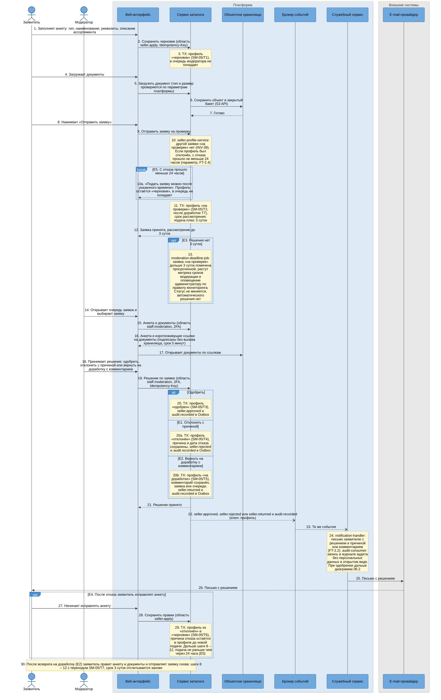
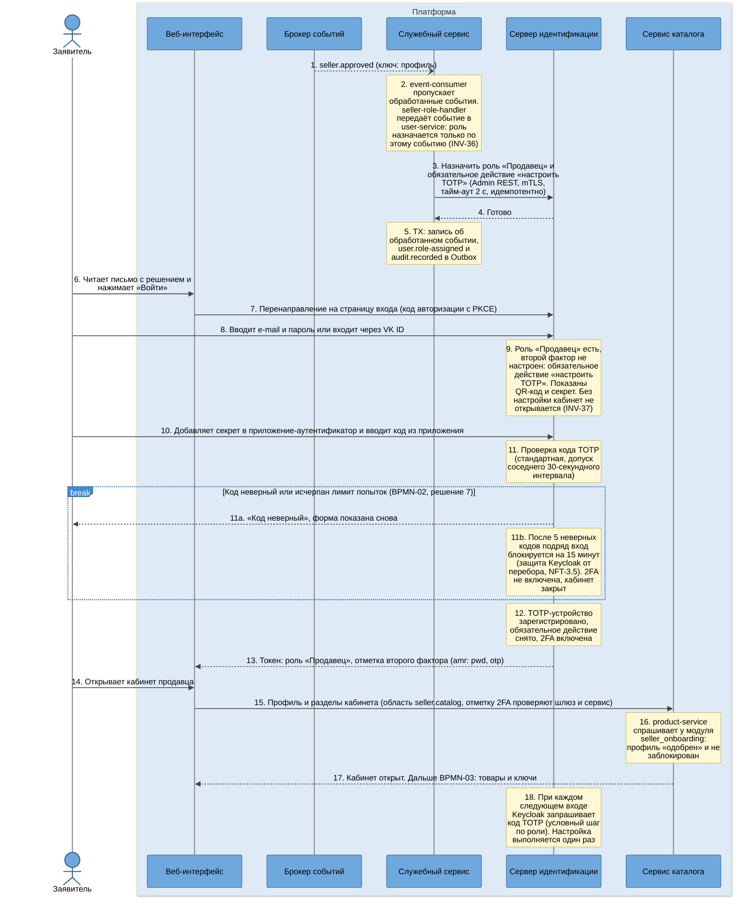

# SEQ-06. Одобрение продавца: роль и двухфакторная аутентификация

| Поле | Содержание |
| --- | --- |
| ID | SEQ-06 (диаграммы 06.1 и 06.2) |
| Релиз | R1 |
| Фаза | Ф2, шаг 7 |
| Источники | [BPMN-02](../03-processes/BPMN-02-seller-onboarding.md) (основной путь, E1 – E5, решения 4 и 7), [UC-02](../02-requirements/UC-02-seller-application.md), [SM-05](../03-processes/SM-05-seller-profile.md) (T1 – T7), [US-1.5](../02-requirements/US-01-accounts.md) |
| Решения | [ADR-003](adr/ADR-003-kafka-events.md) (события), [ADR-005](adr/ADR-005-transactional-outbox.md), [ADR-010](adr/ADR-010-keycloak-sms-codes.md) (границы Keycloak и платформы), [ADR-014](adr/ADR-014-audit-log-no-pii.md), [ADR-021](adr/ADR-021-api-gateway.md) (области токена) |
| Нотация | [c4-notation.md](c4-notation.md), раздел 8 |
| Предыдущий сценарий | [SEQ-05](sequence-phone-sms-login.md): вход и коды |
| Что дальше | [BPMN-03](../03-processes/BPMN-03-product-moderation.md): продавец создаёт товары |

## 1. Цель и границы

Показать путь заявки от анкеты до открытого кабинета продавца: кто и в каком порядке меняет статус профиля, как решение модератора превращается в роль «Продавец» и обязательный второй фактор, и почему роль нельзя получить мимо решения модератора (BG-05, INV-36).

| Диаграмма | Что показывает | Переходы SM-05 | Исключения BPMN-02 |
| --- | --- | --- | --- |
| 06.1 | Анкета, документы, отправка, решение модератора, письмо, исправление после отказа | T1, T2, T3, T4, T5, T6, T7 | E1, E2, E3, E4, E5 |
| 06.2 | Событие одобрения, назначение роли в Keycloak, первый вход, настройка TOTP, открытие кабинета | Нет (статус профиля уже «одобрен») | Решение 7: ошибки кода 2FA |

Не показано: блокировка и снятие блокировки продавца (SM-05/T8, T9, R2).

## 2. Участники

| Алиас | Роль в сценарии |
| --- | --- |
| `seller` | Заявитель, будущий продавец. Зарегистрированный пользователь без роли «Продавец» |
| `moderator` | Модератор (с 2FA) |
| `web-app` | Анкета, загрузка документов, очередь модератора, кабинет продавца |
| `catalog-service` | Модуль `seller_onboarding`: `seller-controller`, `seller-profile-service`, `document-store`, `moderation-deadline-job`, `seller-repository`. Модуль `catalog`: `product-service` |
| `object-storage` | Закрытый бакет с документами продавцов, хранилище в РФ |
| `kafka` | События `seller.approved`, `seller.rejected`, `seller.returned`, `audit.recorded` |
| `platform-service` | Модули `identity` (`seller-role-handler`, `user-service`, `keycloak-admin-client`), `notification` (`notification-handler`, `email-sender`) и `audit_admin` (`audit-consumer`) |
| `keycloak` | Роль, обязательное действие «настроить TOTP», проверка кода, токен |
| `email-provider` | Внешний провайдер e-mail (в проекте его играет `external-stubs`) |

## 3. Предусловия и постусловия

| | Содержание |
| --- | --- |
| Предусловия | Заявитель зарегистрирован и вошёл. Профиль в статусе «черновик» (или «отклонён» либо «на доработке» при повторной подаче). Роли «Продавец» нет |
| Постусловия, успех | Профиль «одобрен» (SM-05/T3), роль «Продавец» назначена по событию, 2FA включена, кабинет открыт. Решение в журнале аудита, заявитель получил письмо |
| Постусловия, отказ | Профиль «отклонён» (T4) или «на доработке» (T5), роли нет, письмо с причиной или комментарием, решение в журнале аудита |
| Что не меняется | Автоматического решения по таймеру нет. Роль не выдаётся вручную |

## 4. Диаграмма 06.1. Заявка и решение модератора

**Что видно на диаграмме.**

- Решение, событие и запись аудита пишутся **одной транзакцией** (шаги 20, 20a, 20b, INV-43): решение без следа в журнале и след без решения невозможны. Публикует их `outbox-relay` (ADR-005), доставка «минимум один раз».
- Подача заявки не публикует события: очередь модератора читается из базы каталога, а другим сервисам о черновиках и подачах знать не нужно. Публикуются только итоги модерации (шаги 22 – 23).
- Таймер срока (шаг 13) ничего не решает. По BG-05 каждого продавца проверяет человек, поэтому просрочка даёт метрику и оповещение, статус не меняется (SM-05, раздел «Недопустимые переходы»). Оповещение идёт по правилу мониторинга, письмо или событие платформы для него не нужны.
- Документы не проходят через браузер заявителя в обратную сторону: модератор открывает их по подписанным ссылкам с коротким сроком (шаги 16 – 17). Ссылку получает только модератор и сам продавец.
- Причина отказа обязательна. Если модератор отправил «отклонить» без причины, `seller-profile-service` возвращает ошибку проверки и профиль остаётся «на проверке» (SM-05/T4, [FT-2.1](../02-requirements/requirements_v1.6.md)). Отдельной ветки на диаграмме нет: это ошибка ввода.
- Повторная подача после доработки (шаг 30) и после отказа (шаги 27 – 29) использует одни и те же шаги отправки, различаются только переход SM и пауза 24 часа.

### 4.1. Шаги диаграммы 06.1

| № | Что происходит | Компонент | Статусы после шага | Переход SM |
| --- | --- | --- | --- | --- |
| 1 – 3 | Анкета сохранена | `seller-controller`, `seller-profile-service` | Профиль: «черновик» | SM-05/T1 |
| 4 – 7 | Документ загружен | `seller-controller`, `document-store` | Профиль: «черновик». Документ: в хранилище | нет |
| 8 – 10 | Отправка, проверки подачи | `seller-controller`, `seller-profile-service` | Без изменений | нет |
| 10a | E5: пауза 24 часа не прошла | `seller-profile-service` | Профиль: «черновик» | нет |
| 11 – 12 | Заявка принята | `seller-profile-service`, `seller-repository` | Профиль: «на проверке». Срок: подача плюс 3 суток | SM-05/T2 (после доработки T7) |
| 13 | E3: срок истёк | `moderation-deadline-job` | Профиль: «на проверке», помечен просроченным | нет |
| 14 – 17 | Модератор смотрит анкету и документы | `seller-controller`, `document-store` | Без изменений | нет |
| 18 – 20 | Одобрение | `seller-controller`, `seller-profile-service` | Профиль: «одобрен» | SM-05/T3 |
| 20a | E1: отказ | `seller-profile-service` | Профиль: «отклонён», дата отказа записана | SM-05/T4 |
| 20b | E2: возврат на доработку | `seller-profile-service` | Профиль: «на доработке» | SM-05/T5 |
| 21 – 23 | Ответ и события | `outbox-relay`, `kafka`, `event-consumer` | Без изменений | нет |
| 24 – 26 | Письмо и запись в журнале | `notification-handler`, `notification-service`, `email-sender`, `audit-consumer`, `audit-service` | Без изменений | нет |
| 27 – 29 | E4: исправление после отказа | `seller-controller`, `seller-profile-service` | Профиль: «черновик» | SM-05/T6 |
| 30 | E2: повторная подача после доработки | `seller-profile-service` | Профиль: «на проверке», срок заново | SM-05/T7 |

### 4.2. Времена и повторы диаграммы 06.1

| Параметр | Значение | Источник |
| --- | --- | --- |
| Срок рассмотрения заявки | 3 суток, отсчёт с каждой подачи | FT-2.1 |
| Проверка просрочки | Задача `moderation-deadline-job` раз в 5 минут. Просроченная заявка помечается один раз | Решение 5 раздела 8 |
| Пауза после отказа | 24 часа, параметр платформы | FT-2.4, FT-11.1 |
| Срок на доработку | Не ограничен | FT-2.4 |
| Срок ссылки на документ | 5 минут, параметр `document_link_ttl` | Решение 6 раздела 8 |
| Доставка события | Повторы потребителя 1, 5, 25 секунд, затем `catalog.events.dlq` | ADR-003, ADR-005 |

## 5. Диаграмма 06.2. Роль «Продавец» и обязательная 2FA

Начинается с события одобрения (шаг 22 диаграммы 06.1). Письмо заявителю (шаги 24 – 26 диаграммы 06.1) уходит независимо: заявитель может прочитать его раньше, чем назначится роль.

**Что видно на диаграмме.**

- Роль назначает не `catalog-service` и не администратор вручную, а обработчик события (шаги 1 – 5, INV-36). Keycloak не читает Kafka, а каталог не знает Keycloak, поэтому связующее звено это `platform-service` (граница из ADR-010 и [decomposition.md](decomposition.md), раздел 4.6).
- Роль и требование настроить TOTP выставляются **вместе** (шаг 3). Это закрывает окно, в котором продавец с ролью мог бы войти без второго фактора: первый же вход после одобрения заканчивается обязательным действием (шаг 9, INV-37).
- Проверку второго фактора выполняет Keycloak стандартными средствами (обязательное действие и условный OTP по роли), собственного потока входа нет. Проверка отметки в токене на шлюзе и в сервисе (шаг 15) страхует от токена, выпущенного без второго фактора, например при ошибке настройки realm.
- Задержка между одобрением и ролью ограничена повторами потребителя (до 31 секунды) и обычно незаметна: пока заявитель прочитает письмо, роль уже назначена.
- Потеря устройства с приложением-аутентификатором на диаграмме не показана: процедура введена требованиями v1.6 (FT-1.4): администратор сбрасывает второй фактор, заявитель настраивает его заново, действие пишется в журнал аудита (решение 7 раздела 8).

### 5.1. Шаги диаграммы 06.2

| № | Что происходит | Компонент | Статусы после шага | Переход SM |
| --- | --- | --- | --- | --- |
| 1 – 2 | Событие получено | `event-consumer`, `seller-role-handler` | Профиль: «одобрен» (без изменений) | нет |
| 3 – 4 | Роль и требование TOTP выставлены | `user-service`, `keycloak-admin-client` | Пользователь: роль «Продавец», обязательное действие TOTP | нет |
| 5 | Событие аудита и роли | `user-service`, `identity-repository` | Без изменений | нет |
| 6 – 8 | Первый вход после одобрения | `web-app`, `keycloak` | Сессии ещё нет | нет |
| 9 – 12 | Настройка TOTP | `keycloak` | Пользователь: 2FA включена | нет |
| 11a – 11b | Ошибка кода, блокировка на 15 минут | `keycloak` | 2FA не включена, кабинет закрыт | нет |
| 13 | Токен выпущен | `keycloak` | Сессия: открыта, роль «Продавец», 2FA | нет |
| 14 – 17 | Кабинет открыт | `seller-controller`, `product-service` | Профиль: «одобрен» | нет |
| 18 | Следующие входы | `keycloak` | Без изменений | нет |

### 5.2. Времена и повторы диаграммы 06.2

| Параметр | Значение | Источник |
| --- | --- | --- |
| Повторы потребителя события | 1, 5, 25 секунд, затем `catalog.events.dlq` | ADR-003 |
| Вызов Keycloak Admin REST | Тайм-аут 2 секунды, один повтор | ADR-010 |
| Допуск кода TOTP | Один соседний 30-секундный интервал | Стандартная настройка Keycloak |
| Защита от перебора кода | 5 неверных подряд, блокировка на 15 минут. Параметры realm в коде realm (Ф3) | NFT-3.5, BPMN-02, решение 7 |

## 6. Исключения и переходы: покрытие

| Что | Где нарисовано |
| --- | --- |
| E1 BPMN-02 (отказ) | 06.1, шаг 20a |
| E2 BPMN-02 (возврат на доработку) | 06.1, шаги 20b и 30 |
| E3 BPMN-02 (просрочка 3 суток) | 06.1, шаг 13 |
| E4 BPMN-02 (исправление после отказа) | 06.1, шаги 27 – 29 |
| E5 BPMN-02 (подача раньше 24 часов) | 06.1, шаг 10a |
| Решение 7 BPMN-02 (ошибки кода 2FA) | 06.2, шаги 11a – 11b |
| SM-05/T1 | 06.1, шаг 3 |
| SM-05/T2 | 06.1, шаг 11 |
| SM-05/T3 | 06.1, шаг 20 |
| SM-05/T4 | 06.1, шаг 20a |
| SM-05/T5 | 06.1, шаг 20b |
| SM-05/T6 | 06.1, шаг 29 |
| SM-05/T7 | 06.1, шаги 11 и 30 |
| SM-05/T8, T9 | Не показано: R2, блокировка продавца |

## 7. Что произойдёт при сбое

| Точка падения | Что происходит | Чем закрыто |
| --- | --- | --- |
| Keycloak недоступен на шаге 3 | Роль не назначена, обработчик получает ошибку | Повторы потребителя 1, 5, 25 секунд (до 31 секунды), затем сообщение уходит в `catalog.events.dlq`. Размер DLQ даёт оповещение (NFT-6.1). Администратор запускает повторную обработку командой из Ф4. Назначать роль вручную нельзя (INV-36) |
| `platform-service` упал после шага 4, до шага 5 | Роль назначена, записи об обработке и событий роли нет | Событие доставится повторно, шаг 3 идемпотентен (та же роль, то же действие), шаг 5 выполнится. Дубль события исключает запись об обработанных |
| Заявитель вошёл раньше, чем назначилась роль | Токен выпущен без роли «Продавец», кабинет закрыт | Интерфейс сообщает, что кабинет откроется после назначения роли. После повторного входа роль уже есть. Обязательное действие TOTP выставлено вместе с ролью, поэтому второй фактор не обойти |
| Модератор не принял решение за 3 суток | Заявка ждёт | Метрика и оповещение (шаг 13), статус не меняется (SM-05, BG-05) |
| `catalog-service` упал между шагами 20 и 22 | Решение записано, событие ещё не в Kafka | Запись Outbox и решение в одной транзакции, `outbox-relay` опубликует после перезапуска (ADR-005) |
| Письмо с решением не дошло | Заявитель не знает о решении | Повторы отправки, недоставленное даёт `notification.failed` (NFT-6.1). Решение и причина видны в кабинете заявителя. Роль письмом не определяется |
| Заявитель потерял устройство с TOTP | Вход закрыт после настройки | Администратор сбрасывает TOTP (FT-1.4, версия 1.6), заявитель настраивает заново, действие в журнале аудита |

## 8. Решения и замечания

| № | Вопрос | Решение | Причина |
| --- | --- | --- | --- |
| 1 | Кто назначает роль «Продавец» | `seller-role-handler` по событию `seller.approved` | Keycloak не читает Kafka, каталог не знает Keycloak. Единственный путь к роли, INV-36 |
| 2 | Когда выставляется требование TOTP | Вместе с ролью (шаг 3) | Нет окна «роль есть, второго фактора нет», INV-37 |
| 3 | Реализация 2FA в Keycloak (решение 4 BPMN-02) | Стандартное обязательное действие «настроить TOTP» плюс условный шаг OTP по роли, собственного потока нет | Меньше кода, меньше поверхность атаки (ADR-010) |
| 4 | Ошибки кода 2FA (решение 7 BPMN-02) | Защита Keycloak от перебора: 5 неверных кодов подряд, блокировка на 15 минут | NFT-3.5, не требует своего кода. Параметры задаются в коде realm (Ф3) |
| 5 | Как реализуется оповещение о просрочке модерации | `moderation-deadline-job` раз в 5 минут, метрика и правило мониторинга, события и письма нет | BPMN-02 E3, BPMN-03 E5, NFT-6.1. Компонент добавлен в [c4-components-catalog-service.md](c4-components-catalog-service.md). Стек наблюдаемости описан в `c4-deployment.md` |
| 6 | Доступ к документам | Подписанная ссылка со сроком 5 минут, только модератору и заявителю | NFT-5.0, документы остаются в закрытом бакете. Параметр `document_link_ttl` |
| 7 | Потеря устройства 2FA | Сброс второго фактора администратором, действие в журнале аудита; сброс самого единственного администратора выполняется процедурой из руководства эксплуатации | FT-1.4 в версии 1.6 |
| 8 | Событие о подаче заявки | Не публикуется | Очередь модератора внутри каталога, потребителей нет. При появлении потребителя добавляется `seller.submitted` |

## 9. Связанные документы

- [SEQ-05](sequence-phone-sms-login.md): вход и коды, общие границы Keycloak и платформы
- [c4-components-catalog-service.md](c4-components-catalog-service.md), [c4-components-platform-service.md](c4-components-platform-service.md): компоненты из столбцов «Компонент»
- [BPMN-02](../03-processes/BPMN-02-seller-onboarding.md), [BPMN-03](../03-processes/BPMN-03-product-moderation.md), [SM-05](../03-processes/SM-05-seller-profile.md), [UC-02](../02-requirements/UC-02-seller-application.md)
