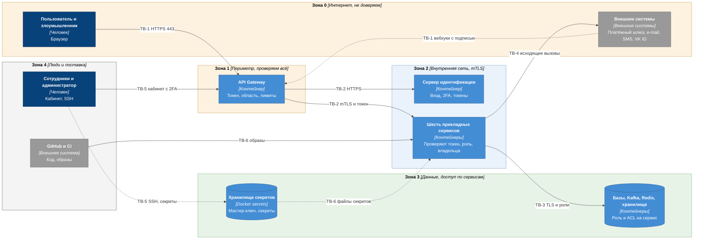

# Модель угроз

| Поле | Содержание |
| --- | --- |
| Документ | Какие угрозы есть у системы, какими мерами они закрыты и что остаётся незакрытым. Метод STRIDE по границам доверия |
| Фаза | Ф2, шаг 9 |
| Основание | [roles-permissions.md](roles-permissions.md), [c4-containers.md](c4-containers.md), [c4-deployment.md](c4-deployment.md), [ADR-009](adr/ADR-009-key-encryption-hmac.md), [ADR-010](adr/ADR-010-keycloak-sms-codes.md), [ADR-014](adr/ADR-014-audit-log-no-pii.md), [ADR-015](adr/ADR-015-payment-gateway-integration.md), [ADR-021](adr/ADR-021-api-gateway.md), [ADR-022](adr/ADR-022-internal-traffic-encryption.md), NFT-3.0 – NFT-3.7, NFT-5.0 – NFT-5.3 |
| Находка Ф1 | Находка 11: подмена SIM-карты (угрозы T-01 и T-02) |
| Потребители | Тесты безопасности Ф3 (раздел 7), требования v1.6 (раздел 8), руководство эксплуатации Ф3 (раздел 6) |
| Проверка | Скрипт `check_security.py`: у каждой угрозы есть граница, актив, мера, ссылка на требование, ADR или инвариант, остаточный риск из словаря, покрыты все границы, активы и все шесть категорий STRIDE, присутствуют обязательные угрозы шага 9 |

Модель угроз отвечает на вопрос «что может пойти не так и что мы с этим сделали». Каждая угроза в реестре (раздел 4) привязана к границе доверия, к ценности, которую она затрагивает, к мере и к тому, где мера описана. Угрозы без меры или без остаточного риска считаются ошибкой документа.

## 1. Метод и допущения

STRIDE разбирает каждую границу доверия по шести категориям нарушений.

| Буква | Категория | Что нарушается | Вопрос |
| --- | --- | --- | --- |
| S | Spoofing, подмена | Подлинность | Может ли кто-то выдать себя за другого человека или сервис? |
| T | Tampering, искажение | Целостность | Может ли кто-то изменить данные или код? |
| R | Repudiation, отрицание | Неотказуемость | Может ли кто-то отрицать своё действие, и можем ли мы это доказать? |
| I | Information disclosure, раскрытие | Конфиденциальность | Может ли кто-то увидеть то, что ему не положено? |
| D | Denial of service, отказ | Доступность | Может ли кто-то остановить работу? |
| E | Elevation of privilege, повышение прав | Авторизация | Может ли кто-то получить больше прав, чем ему выдали? |

**Нарушители.** Анонимный пользователь интернета. Зарегистрированный покупатель. Недобросовестный продавец. Сотрудник с законным доступом (оператор, модератор, администратор). Скомпрометированный контейнер внутри сети. Внешний провайдер, которому мы доверяем частично. Человек с доступом к серверу.

**Остаточный риск** это то, что остаётся после мер. Отсутствие остаточного риска не бывает: низкий риск означает, что вероятность или ущерб малы настолько, что отдельных действий не требуется, средний означает, что мера уменьшает ущерб или вероятность, но не убирает их, и за ним следим метриками и тестами, высокий означает, что риск принят осознанно (для демонстрационного стенда или до решения владельца требований), и условия его пересмотра записаны.

| Остаточный риск | Как считается | Что делаем |
| --- | --- | --- |
| низкий | Малая вероятность и ограниченный ущерб, мера проверяется тестом | Тест в Ф3, дальше не возвращаемся |
| средний | Мера уменьшает ущерб, но не исключает событие | Метрика и оповещение, пересмотр при росте нагрузки |
| высокий | Событие возможно, ущерб заметен, мера усилена только в будущем | Принят владельцем, условия пересмотра в разделе 5 |

**Статус меры:** «В архитектуре» (мера уже описана в ADR, SEQ или компонентах), «К реализации Ф3» (нужны код, конфигурация или тест), «Ф6» (эксплуатация и перенос на рабочий сервер), «Рекомендация v1.6» (мера требует решения по требованиям, в R1 не вводится).

**Что не разбирается.** Физический доступ к серверу провайдера аренды, атаки на сам Docker и ядро, компрометация браузера пользователя целиком, атаки на сами внешние сервисы (платёжный шлюз, VK ID). Они вне границы проекта, мы учитываем только то, как система ведёт себя, когда внешняя сторона недоступна или недоверена.

## 2. Границы доверия

Граница доверия это место, где данные или команды переходят из зоны с одним уровнем доверия в зону с другим. Угрозы ищутся именно на этих переходах.

| ID | Граница | Что пересекает | Контроли на границе |
| --- | --- | --- | --- |
| TB-1 | Интернет и шлюз | Запросы браузера, вебхуки провайдеров | TLS 1.2 и выше, проверка токена, лимиты частоты, размер тела, подпись вебхуков ([ADR-021](adr/ADR-021-api-gateway.md)) |
| TB-2 | Шлюз, Keycloak и сервисы | Запросы с токеном, внутренние вызовы | mTLS, токен проверяется ещё раз в сервисе, список вызывающих ([ADR-022](adr/ADR-022-internal-traffic-encryption.md), [roles-permissions.md](roles-permissions.md)) |
| TB-3 | Сервисы и данные | SQL, события, кэш, файлы | Отдельная роль базы на сервис, ACL Kafka и Redis, TLS, сеть `data` без выхода наружу |
| TB-4 | Платформа и внешние системы | Исходящие вызовы, ответы, статусы | Тайм-ауты, прерыватель, повторы, переводчик внешней системы (anti-corruption layer), подпись входящих ответов |
| TB-5 | Люди с привилегиями | Кабинеты сотрудников, SSH на сервер, сброс второго фактора | 2FA, журнал аудита, SSH только по ключу и через туннель, минимум прав |
| TB-6 | Поставка и секреты | Код, зависимости, образы, секреты | Сканирование секретов и зависимостей, образы по хешу, секреты файлами, не в Git и не в образах |

## 3. Активы

| ID | Актив | Где хранится | Чем ценен | Что случится при потере |
| --- | --- | --- | --- | --- |
| A-01 | Значения ключей | `inventory_db` в виде шифртекста AES-256-GCM, открыто только в памяти `inventory-service` и `delivery-service` | Это товар. Утечка означает прямой ущерб продавцам и платформе | Потеря репутации, претензии продавцов, прекращение продаж |
| A-02 | Учётные записи и сессии | Keycloak, токены в браузере, привязка телефона и e-mail в `platform_db` | Контроль над учётной записью даёт доступ к заказам и действиям | Захват учётной записи, получение чужих ключей по обращению |
| A-03 | Персональные данные | E-mail, телефон, имя в Keycloak и `platform_db`, снимки адреса доставки в заказе и выдаче | Закон о персональных данных (NFT-5.0), доверие | Утечка, штрафы, обязанность уведомить надзорный орган |
| A-04 | Деньги и платёжные данные | Платежи и возвраты в `payment_db`, ключи доступа к шлюзу. Данных карт нет | Прямые деньги покупателей | Бесплатная выдача, ложные возвраты, расхождения со шлюзом |
| A-05 | Журнал аудита и журнал безопасности | `audit_log` в `platform_db`, журналы контейнеров | Доказательство действий сотрудников (NFT-3.6) | Невозможно расследовать инцидент, неотказуемость теряется |
| A-06 | Секреты | Docker secrets, закрытый ключ центра сертификации у администратора | Мастер-ключ, HMAC, ключи провайдеров, TLS: ключи ко всему остальному | Компрометация всех остальных активов |
| A-07 | Документы продавцов | `object-storage`, закрытый бакет | Паспортные и регистрационные данные продавцов | Утечка персональных данных, ущерб продавцам |
| A-08 | Каталог и результаты модерации | `catalog_db`, витрина | Доверие покупателей к витрине | Запрещённый контент и мошеннические товары на витрине |
| A-09 | Доступность покупки и выдачи | Всё на критическом пути | Цель BG-01, NFT-2.0, NFT-4.0 | Потеря продаж, зависшие заказы |
| A-10 | Бюджет SMS и репутация отправителя | Счёт у SMS-провайдера | Деньги и возможность вообще слать коды | Прямые потери, блокировка отправителя |
| A-11 | API-ключи продавцов (R2) | `catalog_db`, хеши | Доступ продавца к загрузке пулов и заказам | Подмена остатков и чтение заказов |
| A-12 | Целостность остатков, резервов и платежей | `inventory_db`, `order_db`, `payment_db` | Правильные остатки и суммы | Двойная выдача, оплаченные заказы без ключей, неверные возвраты |

## 4. Реестр угроз

Столбцы: ID, категория STRIDE, граница, актив, сценарий, мера, ссылки (требования, ADR, инварианты, операции матрицы), остаточный риск, статус меры.

| ID | S | Граница | Актив | Сценарий | Мера | Ссылки | Остаточный риск | Статус |
| --- | --- | --- | --- | --- | --- | --- | --- | --- |
| T-01 | S | TB-1 | A-02 | Подмена SIM при входе по SMS: злоумышленник с SIM жертвы входит по коду из SMS, видит статусы заказов и открывает обращение | Сессия ограничена областями `orders.read` и `support.write`, 15 минут, без refresh-токена, значение `amr` равно `sms`. Лимиты кодов 3 за 10 минут и 10 за сутки, 5 попыток на код. Ключи в кабинете не показываются. Письмо владельцу уходит при каждом входе по SMS (FT-1.7, решение v1.6) | FT-1.7, NFT-3.5, NFT-3.7, ADR-010, SEQ-05, OP-07 | средний, ущерб ограничен просмотром статусов и обращением | Письмо при входе: К реализации Ф4 (срез 1). Остальное: В архитектуре |
| T-02 | S | TB-1 | A-02 | Подмена SIM при смене e-mail: злоумышленник с SIM жертвы и своим ящиком проходит оба кода, меняет e-mail учётной записи, перехватывает повторную отправку ключа и сброс пароля | Смена только по обращению, с участием оператора. Коды вводит сам покупатель. Письмо о смене уходит на прежний адрес сразу, адрес хранится 7 суток (FT-7.5, решение v1.6). Журнал аудита. Лимиты кодов. Задержка вступления смены на 24 часа рассматривалась и не введена | FT-7.5, NFT-3.5, ADR-010, SEQ-04, OP-73, OP-74 | высокий, принят для MVP, пересмотр при реальных случаях подмены SIM | Задержка вступления смены не введена (решение v1.6). Остальное: В архитектуре |
| T-03 | I | TB-1 | A-02 | Раскрытие существования учётной записи: перебор регистрации, восстановления пароля, входа по SMS, подтверждения телефона и e-mail выявляет занятые адреса и номера | Нейтральные ответы во всех сценариях, одинаковые тексты. Для неизвестного номера SMS не отправляется, время ответа выравнивается до нижней границы 800 мс. Лимиты запросов на номер и IP. Занятость номера видит только вошедший пользователь в пределах дневного лимита | FT-1.0, FT-1.5, FT-1.7, ADR-010, SEQ-05, OP-01 | низкий | В архитектуре, тест времени ответа в Ф3 |
| T-04 | S | TB-1 | A-02 | Перебор кодов подтверждения (SMS и e-mail) | Код 6 цифр, срок 5 минут, 5 попыток на код, после трёх погашенных кодов за час вход по SMS для номера закрыт на час. Максимум 10 кодов в сутки: 50 попыток на миллион вариантов, вероятность успеха 0,005 процента в сутки на цель. Код хранится как HMAC | NFT-3.5, NFT-3.7, ADR-010, OP-06, OP-74 | низкий | В архитектуре, тест перебора в Ф3 |
| T-05 | S | TB-1 | A-02 | Подбор и подстановка паролей (утёкшие пары из других сервисов) | Защита Keycloak от подбора: 5 неудач закрывают вход на 15 минут. Лимит шлюза 30 запросов в минуту с IP на маршруты входа. Для продавцов и сотрудников второй фактор. Пароли хранятся в виде хеша Argon2 или bcrypt | FT-1.3, NFT-3.0, NFT-3.1, NFT-3.5, ADR-021, OP-03 | средний, покупатели без второго фактора, распределённый подбор с разных IP обходит лимит по IP | К реализации Ф3 |
| T-06 | S | TB-1 | A-02 | Подделка JWT: алгоритм none, смена алгоритма, подмена ключа, чужой адресат | Разрешён один алгоритм (RS256), проверка подписи по JWKS Keycloak, `iss`, `aud`, `exp`. Проверка выполняется на шлюзе и повторно в каждом сервисе | NFT-3.0, ADR-021, roles-permissions.md | низкий | В архитектуре, негативные тесты токена в Ф3 |
| T-07 | I | TB-1 | A-02 | Кража токена через XSS или CSRF в веб-интерфейсе | Токен доступа живёт 5 минут и хранится только в памяти страницы. Код с PKCE. Строгая политика CSP без встроенных скриптов, заголовки безопасности, HSTS. Refresh-токен с ротацией и обнаружением повторного использования. Токены в заголовке `Authorization`, не в cookie, поэтому CSRF к API неприменим | NFT-3.3, ADR-021, SEQ-05 | средний, XSS в интерфейсе даёт доступ на время жизни токена | К реализации Ф5 |
| T-08 | T | TB-2 | A-03 | Доступ к чужому объекту по идентификатору (заказ, обращение, платёжная сессия) | Условие U1 в каждом запросе (фильтр по владельцу в базе), чужой объект отвечает 404, идентификаторы не угадываются (UUID) | FT-5.4, OP-52, OP-58, OP-70 | низкий | К реализации Ф3, тест на каждую операцию с U1 |
| T-09 | E | TB-2 | A-02 | Повышение привилегий: самоназначение роли, подмена полей токена, назначение «Продавца» вручную, назначение роли после деактивации | Регистрация создаёт только роль «Покупатель». Роль «Продавец» только по событию одобрения (INV-36). Назначение ролей только у администратора, Admin REST только у `platform-identity`. Проверка последнего администратора (INV-38) | FT-1.4, INV-36, INV-37, INV-38, OP-15, OP-80 | низкий | В архитектуре |
| T-10 | T | TB-2 | A-08 | Обход модерации: публикация без проверки, правка опубликованного товара без возврата на модерацию, смена статуса прямым запросом, автоматическое решение по просрочке | Статус «опубликован» ставит только решение модератора по SM-04, продавец переходов в «опубликован» не имеет. Изменение названия, описания, типа возвращает товар на модерацию. На витрине только «опубликован» (INV-40). Просрочка модерации даёт оповещение, но не решение (BG-05) | FT-2.1, FT-3.1, FT-3.2, INV-40, OP-23, OP-25 | средний, модерация проверяет описание, но не содержимое ключей | В архитектуре. Нерабочие ключи закрывает спор R2 |
| T-11 | D | TB-1 | A-09 | Перегрузка шлюза и критического пути запросами | Лимиты частоты по пользователю и IP, `POST /orders` 10 в минуту, тело до 2 МБ, тайм-ауты, прерыватель к платёжному шлюзу, сервис остатков отдельно от витрины | NFT-1.0, NFT-3.5, ADR-021, ADR-015 | средний, распределённая атака на один сервер без CDN и WAF не исключена | В архитектуре, WAF и защита сети: Ф6 |
| T-12 | D | TB-2 | A-12 | Исчерпание остатков резервами без оплаты: злоумышленник с несколькими учётными записями резервирует все ключи на 15 минут и повторяет | Подтверждённый телефон до первого заказа, лимит `POST /orders`, не больше 10 штук в заказе, автоснятие резерва через 15 минут. Лимит одновременных неоплаченных заказов на пользователя: параметр `orders.max-unpaid`, по умолчанию 3, ответ 409 `unpaid-orders-limit` (FT-5.1, решение v1.6) | FT-1.5, FT-5.2, INV-10, INV-35, ADR-012, OP-50 | средний, у популярного товара с малым остатком атака возможна | Лимит неоплаченных заказов: К реализации Ф4 (срез 2) |
| T-13 | T | TB-2 | A-04 | Подмена цены, суммы, количества или продавца клиентом | Клиент передаёт только товар и количество. Цена и продавец берутся из карточки товара на сервере и фиксируются снимком. Сумма платежа считается на сервере, уведомление шлюза проверяется на равенство суммы и валюты | FT-5.1, INV-10, INV-12, ADR-015, OP-50 | низкий | В архитектуре |
| T-14 | T | TB-3 | A-12 | Двойная выдача: два заказа получают один ключ при одновременном оформлении, повторной обработке события или повторном вебхуке | Блокировка строк с пропуском занятых при резерве, привязка ключа к заказу, уникальные ограничения, идемпотентность, дедупликация событий. Проверяется тестом на гонку | FT-7.1, FT-6.2, NFT-2.2, INV-01, INV-06, INV-18, ADR-007, ADR-006 | низкий | В архитектуре, тест гонки в Ф3 (шаг 12) |
| T-15 | S | TB-1 | A-04 | Подмена уведомления платёжного шлюза: поддельный вебхук «оплачено» даёт бесплатную выдачу | Подпись HMAC-SHA-256 от строки `timestamp.тело` секретом из хранилища, сравнение за постоянное время, метка времени не старше 5 минут, проверка суммы и валюты, неизвестный платёж не меняет заказ. Каждое уведомление подтверждается запросом статуса у шлюза до смены статуса, сумма и валюта сверяются (FT-6.2, решение v1.6) | FT-6.0, FT-6.2, INV-14, ADR-015, OP-54 | низкий, при утечке секрета подписи нужен запрос к шлюзу | Запрос к шлюзу: К реализации Ф4 (срез 2), контракт и бюджет времени F3-18. Остальное: В архитектуре |
| T-16 | T | TB-1 | A-04 | Повтор перехваченного уведомления шлюза или повторный запрос возврата | Окно метки времени 5 минут, дедупликация по внешнему идентификатору платежа и типу события, один возврат на платёж, ключ идемпотентности возврата | FT-6.2, FT-6.4, INV-14, INV-15, ADR-015, ADR-006 | низкий | В архитектуре |
| T-17 | R | TB-5 | A-05 | Сотрудник отрицает своё действие (повторная отправка ключа, решение модерации, смена e-mail, изменение параметров) | Журнал аудита: кто, что, когда, хеши персональных полей. Действие и запись в одной транзакции (Outbox): действия без записи нет. Операции сотрудников идут по токену со вторым фактором | FT-11.2, NFT-3.6, INV-42, INV-43, ADR-014, OP-85 | низкий | В архитектуре |
| T-18 | T | TB-3 | A-05 | Изменение или удаление записей журнала аудита (администратор базы, ошибка кода, злонамеренный сотрудник) | Роль приложения только `INSERT` и `SELECT`, триггеры запрещают `UPDATE`, `DELETE`, `TRUNCATE`, секции по месяцам без удаления. Рекомендована цепочка хешей записей и внешняя подпись суточной сводки | NFT-3.6, NFT-5.2, INV-42, ADR-014, OP-87 | средний, суперпользователь базы остаётся | Цепочка: Ф6. Остальное: В архитектуре |
| T-19 | S | TB-2 | A-01 | Подмена сервиса: процесс в сети называет себя `delivery-service` и запрашивает значения ключей | mTLS с собственным центром сертификации, имя сервиса в сертификате (CN), у операции чтения значений единственный разрешённый вызывающий, чужой сертификат отвергается при установке соединения | NFT-3.2, ADR-022, ADR-009, OP-38 | низкий | В архитектуре, тест чужого сертификата в Ф3 |
| T-20 | I | TB-2 | A-01 | Перехват внутреннего трафика на хосте: значения ключей, токены, персональные данные | TLS и mTLS между всеми контейнерами во всех профилях, включая ноутбук. Запрос значений ключей с `Cache-Control: no-store` | NFT-3.2, NFT-3.3, ADR-022 | средний, компрометация самого хоста (память процессов) мерой не закрыта | В архитектуре |
| T-21 | E | TB-2 | A-03 | Доступ к сервису в обход шлюза изнутри сети (скомпрометированный контейнер) | Сервис сам проверяет подпись токена, область и роль, а не доверяет шлюзу. Сеть `app` отделена от `data`. Права и ACL по сервисам | NFT-3.0, ADR-021, ADR-022, roles-permissions.md | средний | В архитектуре |
| T-22 | E | TB-2 | A-01 | Взлом `delivery-service` или `inventory-service` даёт чтение значений ключей многих заказов | Контейнеры без root, файловая система только для чтения, без дополнительных привилегий, лишние возможности отключены. Значения отдаются только по заказу в статусе «выдан». Метрика числа прочитанных значений сверяется с числом выдач, расхождение вызывает оповещение | NFT-3.2, ADR-009, ADR-022, OP-38 | средний, взлом процесса, который расшифровывает, неизбежно раскрывает значения | К реализации Ф3 (метрика), Ф6 (усиление контейнеров) |
| T-23 | T | TB-3 | A-03 | SQL-инъекция | Параметризованные запросы, роль базы с минимальными правами на свою схему, проверка зависимостей и статический анализ в CI | NFT-3.2, ADR-002, decomposition.md | низкий | К реализации Ф3 |
| T-24 | I | TB-3 | A-01 | Утечка значений ключей из базы, дампа или резервной копии | AES-256-GCM, ключ данных зашифрован мастер-ключом, мастер-ключ и секрет HMAC вне базы и вне копий базы, копия мастер-ключа хранится отдельно. Процедура при компрометации ключей в разделе 6 | NFT-3.2, FT-4.2, INV-20, ADR-009 | низкий, при компрометации мастер-ключа действует процедура раздела 6 | В архитектуре |
| T-25 | I | TB-3 | A-01 | Утечка значений ключей и персональных данных через журналы, события Kafka, трассы, сообщения об ошибках | Тип `SecretValue` без сериализации, фильтр тел запросов на маршрутах загрузки и выдачи, значений нет в событиях и обращениях, персональные данные в журнале аудита только хешами. Тест «канарейка»: известные значения не должны встретиться ни в журналах, ни в событиях, ни в дампе базы выдачи | NFT-3.2, NFT-5.3, INV-20, INV-42, ADR-009, ADR-014 | низкий | В архитектуре, тест в Ф3 |
| T-26 | T | TB-3 | A-12 | Подмена, повтор или отравление сообщений Kafka: чужой сервис публикует событие, не принадлежащее ему | ACL по сертификату: публиковать в тему может только её владелец. Схема сообщения проверяется потребителем, повтор безопасен (дедупликация), непонятное сообщение уходит в очередь недоставленных | ADR-003, ADR-005, ADR-006, ADR-022 | низкий | В архитектуре |
| T-27 | D | TB-3 | A-09 | Тихие сбои: растущая очередь недоставленных, застрявший Outbox, зависший заказ остаются незамеченными | Оповещения: возраст старейшей записи Outbox больше 60 секунд, размер очереди недоставленных больше нуля, заказ без доставки 30 минут, заказ в очереди поддержки, просрочка модерации. Порядок разбора очереди недоставленных описывается в руководстве эксплуатации | NFT-2.1, NFT-4.3, NFT-6.1, ADR-005, ADR-011 | средний, оповещение приходит на e-mail одного администратора | К реализации Ф6 |
| T-28 | I | TB-3 | A-03 | Утечка персональных данных из базы и копий, неполная анонимизация, возврат анонимизированных данных при восстановлении из копии | Хранение минимально необходимого, анонимизация затрагивает пользователя, снимки адреса в заказе и выдаче одновременно (INV-44), журнал аудита без открытых персональных данных. После восстановления из копии анонимизация повторяется по списку обработанных идентификаторов, который хранится отдельно. Снимок адреса в `order.paid` и `order.address-updated` стереть из Kafka нельзя: он живёт в теме 7 суток и в DLQ 14 суток, срок хранения ограничивает риск ([conventions.md](conventions.md), раздел 11.7) | NFT-5.0, NFT-5.2, NFT-5.3, INV-44, ADR-014, OP-82 | средний, копии хранят данные до 7 суток, снимок адреса в событии до 14 суток | Список и процедура: Ф6 |
| T-29 | D | TB-3 | A-09 | Потеря единственного сервера или диска: потеря баз, брокера, хранилища | Ежедневная полная копия, журнал транзакций каждые 5 минут (RPO 15 минут), вторая копия вне сервера, восстановление проверяется, RTO 60 минут. Потеря Redis и Kafka восстанавливается из баз (сверки, Outbox) | NFT-4.0, NFT-4.1, NFT-4.2, ADR-012, c4-deployment.md | средний, один сервер, вторая копия появится в Ф6 | Ф6 |
| T-30 | D | TB-4 | A-10 | Накрутка SMS (SMS pumping): массовые запросы кодов на дорогие номера | Только номера +7, лимиты на номер, учётную запись и IP, общий потолок в сутки 1000 с оповещением при 80 процентах, для неизвестного номера SMS не отправляется, при недоступности Redis отправка запрещена | NFT-3.5, ADR-010 | низкий | В архитектуре |
| T-31 | I | TB-4 | A-02 | Код из SMS видят оператор связи и SMS-провайдер, SMS перехватывается в сети | Текст SMS содержит только код и предупреждение, срок 5 минут, код одноразовый. Канал SMS слабее приложения-аутентификатора, это принятое свойство FT-1.5 и FT-1.7 | FT-1.5, FT-1.7, NFT-3.7, ADR-010 | средний, принят, пересмотр в ADR-010 при реальных случаях | В архитектуре |
| T-32 | S | TB-1 | A-09 | Подмена статуса от e-mail или SMS-провайдера: ложное «доставлено» скрывает недоставку письма с ключом | Подпись вебхука секретом провайдера, метка времени, статус применяется один раз. Контроль 30 минут идёт по факту, заказ без доставки попадает в поддержку | FT-7.3, NFT-2.4, ADR-011, OP-62 | низкий | В архитектуре |
| T-33 | D | TB-4 | A-09 | Недоступность или замедление внешних систем (платёжный шлюз, e-mail, SMS) | Прерыватель и повторы с нарастающей паузой, тайм-ауты, очередь выдачи в базе, сверка платежей, автовозврат. Бюджет 60 секунд разбит по звеньям | NFT-2.0, NFT-4.3, ADR-011, ADR-015, time-budgets.md | средний, у e-mail-провайдера один канал | В архитектуре |
| T-34 | S | TB-1 | A-11 | Злоупотребление API продавца (R2): утечка ключа, массовая загрузка мусора, подмена ответов на запрос выдачи, внутренняя сеть через адрес webhook | В базе только хеш ключа, показывается один раз, отзыв действует не позднее 30 секунд. Лимит 600 запросов в минуту на ключ. Права ключа ограничены, ответ на запрос выдачи принимается один раз. Адрес webhook только HTTPS, частные адреса и адреса внутренней сети запрещены, исходящие уведомления подписываются | FT-10.0, FT-10.3, NFT-3.4, NFT-3.5, INV-41, ADR-021 | средний, R2 | К реализации в R2 |
| T-35 | I | TB-3 | A-07 | Доступ к документам продавцов: подбор ссылки, утечка ссылки, выгрузка модератором | Бакет закрытый, доступ по подписанным ссылкам на 5 минут, ссылку получают только модератор и сам продавец, подпись в адресе не пишется в журналы шлюза, хранение в РФ. Каждое открытие документов модератором фиксируется в журнале аудита | NFT-5.0, NFT-3.6, SEQ-06, OP-11 | средний, чужие доступа не получают, законный модератор может выгрузить документы | Запись об открытии (FT-11.2): К реализации Ф4 (срез 3), остальное: В архитектуре |
| T-36 | E | TB-1 | A-07 | Вредоносный файл вместо документа (HTML, SVG, исполняемый) выполняется в сеансе модератора через адрес `/files/**` на том же домене | Разрешены только PDF, JPEG, PNG, проверка типа по содержимому, не больше 10 файлов по 2 МБ (FT-2.0), заголовки `Content-Disposition: attachment` и `X-Content-Type-Options: nosniff`, политика CSP для файловых ответов `sandbox` | NFT-5.0, ADR-021, SEQ-06 | средний, антивирусной проверки в R1 нет | К реализации Ф3 |
| T-37 | I | TB-5 | A-01 | Оператор, модератор или администратор читает значение ключа | Значение существует в памяти двух сервисов и нигде больше, у людей нет маршрута, повторная отправка выполняется системой, оператор получает только статусы | FT-7.5, INV-23, ADR-009, OP-38 | низкий, доступ к хосту разобран в T-39 | В архитектуре |
| T-38 | E | TB-5 | A-04 | Администратор злоупотребляет параметрами (комиссия, сроки) или отмечает ручной возврат выполненным без возврата | Все изменения параметров и отметки возвратов в журнале аудита, проверка инвариантов параметров, оповещение администратору при изменении, ручной возврат сверяется с отчётом шлюза в ежедневной сверке | FT-11.1, FT-11.2, FT-6.4, INV-07, INV-26, OP-57, OP-83 | средний, один администратор не контролируется вторым | В архитектуре. Подтверждение вторым администратором: требование R3 (FT-11.5) |
| T-39 | I | TB-6 | A-06 | Человек с доступом к хосту (root) читает секреты и память процессов | SSH только по ключу, доступ через туннель, секреты в файлах только для своего контейнера, закрытый ключ центра сертификации вне контейнеров и образов. Шифрование трафика внутри узла не защищает от компрометации самого узла | NFT-3.2, ADR-022, c4-deployment.md | высокий, принят для демонстрационного стенда, пересмотр при переходе на внешнее хранилище секретов | Ф6 |
| T-40 | S | TB-5 | A-02 | Потеря второго фактора сотрудника и социальная инженерия при его сбросе | Сброс делает только администратор после подтверждения личности по другому каналу, сброс обнуляет сессии и пишется в журнал аудита. Если фактор потерял единственный администратор, действует аварийная учётная запись в консоли Keycloak: пароль запечатан и хранится оффлайн, вход возможен только через SSH-туннель, использование даёт оповещение | FT-1.3, FT-1.4, INV-37, INV-38, OP-05, OP-80 | средний, аварийный путь остаётся единственной точкой обхода | Процедура: Ф3, оповещение: Ф6 |
| T-41 | T | TB-6 | A-06 | Секреты в Git, образах, журналах CI, переменных окружения | Секреты только файлами из хранилища, в Git и образах не хранятся, перед коммитом и в CI запущено сканирование секретов, переменные окружения секретов не содержат | NFT-3.2, ADR-009, c4-deployment.md | низкий | К реализации Ф3 |
| T-42 | T | TB-6 | A-09 | Компрометация цепочки поставки: вредоносная зависимость, подменённый базовый образ, захваченный CI | Фиксация версий зависимостей, регулярное сканирование, минимальные базовые образы, развёртывание по хешу образа, права CI минимальны, подпись образов рекомендована | NFT-3.2, ADR-002, c4-deployment.md | средний | К реализации Ф3, подпись образов: Ф6 |
| T-43 | S | TB-1 | A-03 | Фишинг: покупателям рассылают поддельные письма от имени платформы, письмо с ключом подделано | Настройка SPF, DKIM и DMARC у отправляющего домена, письма платформы не просят вводить пароль и не ведут на страницы входа, ключ приходит только на адрес из снимка заказа | FT-7.0, FT-11.0, NFT-3.3 | средний, влияние на пользователя вне нашего контроля | Ф6 |
| T-44 | T | TB-4 | A-04 | Оплата краденой картой и возвратный платёж (chargeback): ключ выдан, деньги отозваны | Платёж принимает шлюз (3-D Secure на его стороне), в R2 деньги продавцу доступны через 7 дней, подтверждённый телефон до первой покупки. Возвратный платёж обрабатывается вне платформы | FT-6.0, FT-9.2, FT-1.5 | средний, в R1 удержания нет | В архитектуре для R2 |

## 5. Остаточные риски

Здесь собраны риски со значением «высокий» и «средний», чтобы владелец проекта видел одним списком, что принято и когда пересматривать. Низкие риски закрыты мерами и тестами и в список не входят.

### 5.1. Высокие (приняты)

| Угроза | Почему принят | Условие пересмотра |
| --- | --- | --- |
| T-02 Подмена SIM при смене e-mail | Следствие FT-7.5: подтверждение телефоном и участие оператора, других каналов в MVP нет. Ущерб ограничен одним заказом в окне 72 часа и возможностью сброса пароля | Первый реальный случай подмены SIM, или внедрение приложения-аутентификатора или passkey, или решение вернуться к задержке вступления смены на 24 часа с отменой по ссылке из письма (в v1.6 отклонено как лишнее для MVP) |
| T-39 Администратор хоста читает секреты | Демонстрационный стенд, один сервер, один владелец. Шифрование внутри узла не защищает от компрометации узла | Переход на внешнее хранилище секретов или аппаратный модуль (Ф6 и позже) |

### 5.2. Средние

| Угроза | Что остаётся | Чем следим |
| --- | --- | --- |
| T-01 | Подмена SIM даёт просмотр статусов и обращение | Метрика входов по SMS, оповещение при росте |
| T-05 | Подстановка паролей с разных IP | Метрика неудачных входов, блокировки Keycloak |
| T-07 | XSS даёт доступ на 5 минут жизни токена | Политика CSP, проверка в Ф5 |
| T-10 | Модерация не проверяет работоспособность ключей | Метрики обращений по продавцу, спор в R2 |
| T-11 | Распределённая атака на один сервер | Метрики шлюза, WAF в Ф6 |
| T-12 | Резервы без оплаты у малого остатка | Метрика доли неоплаченных заказов и активных резервов на пользователя |
| T-18 | Суперпользователь базы | Внешняя подпись сводки журнала (Ф6) |
| T-20, T-21 | Компрометация хоста и контейнера | Сегментация сетей, метрики подозрительных вызовов |
| T-22 | Взлом расшифровывающего процесса | Сверка числа прочтений значений и выдач |
| T-27 | Один адрес для оповещений | Второй получатель оповещений (Ф6) |
| T-28 | Копии хранят данные до 7 суток | Процедура повторной анонимизации |
| T-29, T-33 | Один сервер и один канал провайдера | Сверки, вторая копия вне сервера, проверка восстановления |
| T-31 | Канал SMS слабее приложения | См. T-01 и T-02 |
| T-34 | Злоупотребление API продавца, R2 | Метрики API по ключам |
| T-35 | Законный модератор может выгрузить документы | Запись об открытии документов |
| T-36 | Нет антивирусной проверки файлов | Ограничение типов и размер, пересмотр при росте |
| T-38 | Один администратор | Подтверждение вторым администратором (R3, FT-11.5) |
| T-40 | Аварийная учётная запись | Оповещение при использовании |
| T-42, T-43, T-44 | Внешние и поставочные факторы | Сканирование, DMARC, удержание в R2 |

## 6. Процедуры при компрометации

Руководство эксплуатации (Ф3) разворачивает эти процедуры по шагам. Здесь зафиксированы состав и сроки.

| Ситуация | Действия | Кто | Срок |
| --- | --- | --- | --- |
| Подозрение на утечку мастер-ключа или ключей данных ([ADR-009](adr/ADR-009-key-encryption-hmac.md)) | Остановить загрузки пулов и выдачу, сменить мастер-ключ и ключи данных, перешифровать все значения, оценить, какие ключи могли раскрыться, и сообщить затронутым продавцам | Администратор | Остановка сразу, смена ключей до 24 часов |
| Утечка секрета HMAC для проверки дублей | Новый секрет, фоновая миграция HMAC, на время миграции проверка по паре версий | Администратор | До 24 часов |
| Утечка секрета подписи вебхуков шлюза или провайдера | Выпустить новый секрет, пересоздать у провайдера, действует окно двух секретов, проверить платежи за период по сверке | Администратор | До 4 часов |
| Утечка закрытого ключа центра сертификации | Перевыпустить центр и все сертификаты, перезапустить контейнеры. Закрытый ключ хранится вне контейнеров | Администратор | До 24 часов |
| Компрометация ключей подписи токенов Keycloak | Выпустить новую пару ключей, отозвать старую, завершить все сессии | Администратор | До 2 часов |
| Захват учётной записи сотрудника или продавца | Деактивировать учётную запись, завершить сессии, сбросить второй фактор после проверки личности, выгрузить действия из журнала аудита за период | Администратор | До 1 часа |
| Подмена SIM у покупателя (обращение пострадавшего) | Вернуть e-mail по обращению, завершить сессии, письмо на прежний адрес, пометка учётной записи для повышенного внимания оператора | Оператор, администратор | В течение рабочего дня |
| Массовая утечка персональных данных | Изолировать причину, оценить состав данных, уведомить надзорный орган и пострадавших в срок, установленный законом (по 152-ФЗ первичное уведомление в течение суток, итоги расследования в течение трёх суток, конкретику уточняет юрист) | Владелец проекта | Сразу |
| API-ключ продавца утёк (R2) | Продавец или администратор отзывает ключ, действует не позднее 30 секунд, выпускается новый, проверка журнала запросов по ключу | Продавец, администратор | Сразу |

## 7. Проверки безопасности для Ф3

Меры из реестра превращаются в автоматические тесты. Номера тестов используются в [test-strategy.md](../08-testing/test-strategy.md), раздел 9: там они привязаны к срезам Ф4.

| Тест | Что проверяет | Угрозы |
| --- | --- | --- |
| ST-01 | «Канарейка» значений ключей: после загрузки, покупки и выдачи значений нет в журналах, событиях и дампе базы выдачи | T-24, T-25 |
| ST-02 | Матрица прав: для каждой операции матрицы запрос от запрещённой роли даёт 403, чужой объект 404 | T-08, T-09, T-21 |
| ST-03 | Токены: алгоритм none, чужой издатель и адресат, просроченный токен, изменённая область | T-06, T-21 |
| ST-04 | Вебхуки: неверная подпись, старая метка времени, несовпадение суммы, повтор, неизвестный платёж | T-15, T-16, T-32 |
| ST-05 | Перебор кода: шестая попытка отклонена, четвёртый запрос кода за 10 минут отклонён, закрытие на час после трёх погашенных кодов | T-04 |
| ST-06 | Раскрытие существования: ответы и время ответа для известного и неизвестного номера и e-mail не различаются | T-03 |
| ST-07 | Сессия по SMS: не получает `orders.create` и `account.manage`, срок 15 минут, без refresh-токена | T-01 |
| ST-08 | mTLS: клиент с чужим сертификатом или без него отвергается, `delivery-service` читает значения ключей, остальные нет | T-19, T-20 |
| ST-09 | Журнал аудита: `UPDATE`, `DELETE`, `TRUNCATE` отклоняются, роль приложения не имеет других прав | T-18 |
| ST-10 | Двойная выдача: два одновременных заказа на последний ключ дают ровно одну выдачу | T-14 |
| ST-11 | Лимиты частоты: превышение даёт 429 с `Retry-After`, потолок SMS в сутки останавливает отправку | T-11, T-30 |
| ST-12 | Загрузка документов: разрешены только PDF, JPEG, PNG, заголовки ответа, размер | T-36 |
| ST-13 | Роли: «Продавец» вручную не назначается, роль без второго фактора не открывает кабинет | T-09, T-40 |
| ST-14 | Сканирование секретов и зависимостей в CI проходит без находок | T-41, T-42 |

## 8. Находки шага 9 для требований и архитектуры

Рекомендации, которые меняли требования. Они разобраны при выпуске требований v1.6 (решение D-12, отчёт Ф3, раздел 5.3): ниже решение по каждой.

| № | Находка | Где возникла | Решение в v1.6 |
| --- | --- | --- | --- |
| F9-1 | Письмо владельцу о входе по SMS отсутствует | T-01, SEQ-05 решение 5 | Принято: письмо владельцу при каждом входе по SMS (FT-1.7). Реализация в срезе 1 Ф4: событие и шаблон письма |
| F9-2 | Смена e-mail вступает в силу немедленно | T-02 | Принято в смягчённом виде: письмо на прежний адрес уходит сразу при смене (FT-7.5). Задержка вступления на 24 часа не вводится |
| F9-3 | Нет лимита одновременных неоплаченных заказов на пользователя | T-12 | Принято: параметр платформы `orders.max-unpaid`, по умолчанию 3, ответ 409 `unpaid-orders-limit` (FT-5.1, FT-11.1) |
| F9-4 | Открытие документов продавцов модератором не записывается | T-35 | Принято: запись «открытие документа» в журнале аудита (FT-11.2, NFT-3.6) |
| F9-5 | Чтение журнала аудита не записывается | roles-permissions.md, решение 4 | Принято: запись «просмотр журнала» без параметров поиска (FT-11.2) |
| F9-6 | Нет подтверждения вторым администратором для опасных операций | T-38 | Требование релиза R3 (FT-11.5), в R1 не вводится: администратор один |
| F9-7 | Вебхук шлюза подтверждается только подписью | T-15 | Принято: запрос статуса у шлюза и сверка суммы и валюты перед сменой статуса (FT-6.2). Контракт запроса и бюджет времени уточняются в срезе 2 Ф4 (F3-18) |
| F9-8 | У продавца после одобрения пропадают права покупателя | roles-permissions.md, решение 1 | Закреплено: одна роль на учётную запись (раздел 3 требований), покупки с учётной записи продавца запрещены, прежняя история остаётся в базе и доступна поддержке, кабинет её не показывает |
| F9-9 | Нет требования к устойчивости файлов документов | T-36 | Принято: PDF, JPEG, PNG по содержимому, не больше 10 файлов по 2 МБ (FT-2.0). Антивирус в R1 не вводится, пересмотр при росте |

## 9. Связанные документы

- [roles-permissions.md](roles-permissions.md): роли, области, условия
- [c4-containers.md](c4-containers.md), [c4-deployment.md](c4-deployment.md): границы и среда
- [ADR-009](adr/ADR-009-key-encryption-hmac.md), [ADR-010](adr/ADR-010-keycloak-sms-codes.md), [ADR-014](adr/ADR-014-audit-log-no-pii.md), [ADR-015](adr/ADR-015-payment-gateway-integration.md), [ADR-021](adr/ADR-021-api-gateway.md), [ADR-022](adr/ADR-022-internal-traffic-encryption.md)
- [SEQ-04](sequence-email-change.md), [SEQ-05](sequence-phone-sms-login.md), [SEQ-06](sequence-seller-approval.md)
- [time-budgets.md](time-budgets.md): бюджет 60 секунд и повторы
