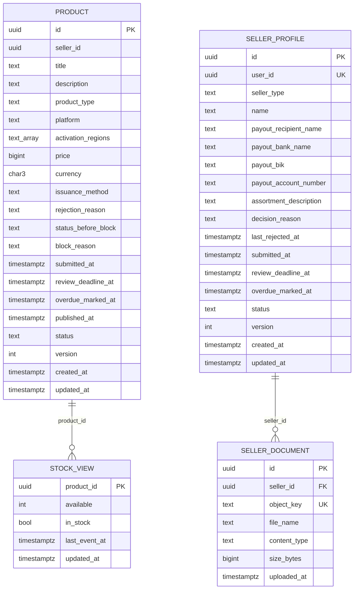

# catalog-service: физическая модель данных

Файл создан скриптом `gen_schema_docs.py` из живой базы PostgreSQL 16, созданной из [ddl/catalog-service.sql](ddl/catalog-service.sql), вручную не правится. Общие решения, таблица инвариантов и находки шага лежат в [README](README.md).

| Поле | Содержание |
| --- | --- |
| Сервис | Каталог и подключение продавцов ([компоненты](../05-architecture/c4-components-catalog-service.md)) |
| База | `catalog_db` |
| Таблиц предметной области | 4, служебных (`outbox`, `processed_event`, `idempotency_key`) 3 |
| Роли приложения | `app_seller_onboarding` (схема `seller_onboarding`), `app_catalog` (схема `catalog`) |
| Назначение | Сервис владеет профилями продавцов с документами заявки и каталогом товаров. Модуль `seller_onboarding` ведёт заявку продавца ([SM-05](../03-processes/SM-05-seller-profile.md)), модуль `catalog` ведёт товары ([SM-04](../03-processes/SM-04-product.md)) и копию остатка для витрины, которую обновляет событие `stock.changed` из «Остатков и ключей». |

## Диаграмма связей

Связи показаны только внутри базы. Ссылки на сущности других сервисов и модулей хранятся идентификаторами без внешних ключей ([README, раздел 6](README.md)).

## Инварианты этой базы

Инварианты, для которых в этой базе есть ограничение, индекс или триггер. Способ обеспечения и пояснения лежат в таблице [README, раздел 5](README.md).

| ID | Инвариант | Объекты базы |
| --- | --- | --- |
| INV-09 | Товар с нулевым остатком недоступен для оформления заказа | `ck_stock_view_available` |
| INV-39 | У пользователя один профиль продавца, пока профиль «на проверке», вторая заявка не принимается | `uq_seller_profile_user_id` |
| INV-40 | На витрине показываются только товары «опубликован». У блокированного товара заполнены «статус до блокировки» и «причина блокировки», у остальных они пусты | `ck_product_block_state`, `ix_product_published`, `ix_product_published_type`, `ix_product_published_platform`, `ix_product_published_price`, `ix_product_published_title_trgm`, `ck_product_published_state` |
| INV-43 | Действие сотрудника и событие аудита записываются в одной транзакции (Outbox): действия без записи в журнале не бывает | `uq_outbox_event_id`, `ck_outbox_published_or_failed`, `ix_outbox_unpublished` |

## Таблицы

### catalog.product

Товар. На витрине только published (INV-40). Цена в заказе фиксируется снимком.

**Столбцы**

| Столбец | Тип | Обязателен | По умолчанию | Описание |
| --- | --- | --- | --- | --- |
| `id` | `uuid` | да |  | ProductID |
| `seller_id` | `uuid` | да |  | SellerID (профиль продавца). Внешнего ключа на seller_onboarding нет: модули связаны только идентификатором |
| `title` | `text` | да |  | Название. Правка опубликованного товара возвращает его на модерацию (SM-04/T6) |
| `description` | `text` | да |  | Описание |
| `product_type` | `text` | да |  | game_key, software_license, gift_card, subscription (conventions 7.3) |
| `platform` | `text` | да |  | Платформа или сервис активации |
| `activation_regions` | `text[]` | да | `'{}'::text[]` | Регионы активации, коды ISO 3166-1 alpha-2. Пустой массив значит «без ограничений». Фильтр витрины «с этим регионом и без ограничений» читается по порядку публикации: отдельный индекс по регионам планировщик не выбирает, потому что товары без ограничений составляют заметную долю выборки (проверка EXPLAIN) |
| `price` | `bigint` | да |  | Цена за единицу в копейках, положительная |
| `currency` | `character(3)` | да | `'RUB'::bpchar` | Валюта, в R1 только RUB (conventions 4.3) |
| `issuance_method` | `text` | да | `'key_pool'::text` | key_pool в R1, seller_api в R2 |
| `rejection_reason` | `text` | нет |  | Причина отклонения, видна продавцу (FT-11.4) |
| `status_before_block` | `text` | нет |  | Статус до блокировки: нужен, чтобы вернуть товар после снятия блокировки продавца (SM-04, решение 1) |
| `block_reason` | `text` | нет |  | moderator_decision или seller_blocked (SM-04, решение 1) |
| `submitted_at` | `timestamp with time zone` | нет |  | Когда товар поставлен в очередь модерации |
| `review_deadline_at` | `timestamp with time zone` | нет |  | Срок рассмотрения: постановка в очередь плюс 3 суток (FT-3.2) |
| `overdue_marked_at` | `timestamp with time zone` | нет |  | Когда задание контроля сроков пометило просрочку, один раз (US-8.8) |
| `published_at` | `timestamp with time zone` | нет |  | Последняя публикация: порядок витрины «новые выше» |
| `status` | `text` | да | `'draft'::text` | SM-04: draft, on_moderation, published, rejected, blocked, archived |
| `version` | `integer` | да | `1` | Версия для ETag и If-Match при правке (PUT) |
| `created_at` | `timestamp with time zone` | да | `now()` | Время создания: порядок списка товаров продавца (US-3.1) |
| `updated_at` | `timestamp with time zone` | да | `now()` | Время последнего изменения строки |

**Ограничения**

| Имя | Вид | Определение |
| --- | --- | --- |
| `pk_product` | первичный ключ | `PRIMARY KEY (id)` |
| `ck_product_activation_regions` | проверка | `CHECK (((cardinality(activation_regions) <= 250) AND (array_to_string(activation_regions, ','::text) ~ '^([A-Z]{2}(,[A-Z]{2})*)?$'::text)))` |
| `ck_product_block_reason` | проверка | `CHECK ((block_reason = ANY (ARRAY['moderator_decision'::text, 'seller_blocked'::text])))` |
| `ck_product_block_state` | проверка | `CHECK ((((status = 'blocked'::text) AND (status_before_block IS NOT NULL) AND (block_reason IS NOT NULL)) OR ((status <> 'blocked'::text) AND (status_before_block IS NULL) AND (block_reason IS NULL))))` |
| `ck_product_currency` | проверка | `CHECK ((currency = 'RUB'::bpchar))` |
| `ck_product_description_len` | проверка | `CHECK (((char_length(description) >= 1) AND (char_length(description) <= 5000)))` |
| `ck_product_issuance_method` | проверка | `CHECK ((issuance_method = ANY (ARRAY['key_pool'::text, 'seller_api'::text])))` |
| `ck_product_moderation_state` | проверка | `CHECK (((status <> 'on_moderation'::text) OR ((submitted_at IS NOT NULL) AND (review_deadline_at IS NOT NULL))))` |
| `ck_product_platform_len` | проверка | `CHECK (((char_length(platform) >= 1) AND (char_length(platform) <= 64)))` |
| `ck_product_price` | проверка | `CHECK (((price > 0) AND (price <= '9007199254740991'::bigint)))` |
| `ck_product_product_type` | проверка | `CHECK ((product_type = ANY (ARRAY['game_key'::text, 'software_license'::text, 'gift_card'::text, 'subscription'::text])))` |
| `ck_product_published_state` | проверка | `CHECK (((status <> 'published'::text) OR (published_at IS NOT NULL)))` |
| `ck_product_rejection_reason` | проверка | `CHECK (((status <> 'rejected'::text) OR (char_length(btrim(COALESCE(rejection_reason, ''::text))) > 0)))` |
| `ck_product_review_deadline` | проверка | `CHECK (((review_deadline_at IS NULL) OR (submitted_at IS NULL) OR (review_deadline_at > submitted_at)))` |
| `ck_product_status` | проверка | `CHECK ((status = ANY (ARRAY['draft'::text, 'on_moderation'::text, 'published'::text, 'rejected'::text, 'blocked'::text, 'archived'::text])))` |
| `ck_product_status_before_block` | проверка | `CHECK ((status_before_block = ANY (ARRAY['published'::text, 'on_moderation'::text])))` |
| `ck_product_title_len` | проверка | `CHECK (((char_length(title) >= 1) AND (char_length(title) <= 200)))` |
| `ck_product_version` | проверка | `CHECK ((version >= 1))` |

**Индексы**

| Имя | Определение | Для чего |
| --- | --- | --- |
| `ix_product_moderation_queue` | `ix_product_moderation_queue ON catalog.product USING btree (submitted_at, id) WHERE (status = 'on_moderation'::text)` | GET /api/v1/staff/products (US-3.3): очередь on_moderation, старые выше |
| `ix_product_overdue` | `ix_product_overdue ON catalog.product USING btree (review_deadline_at) WHERE ((status = 'on_moderation'::text) AND (overdue_marked_at IS NULL))` | Задание контроля сроков раз в 5 минут (US-8.8): товары on_moderation с наступившим сроком без пометки |
| `ix_product_published` | `ix_product_published ON catalog.product USING btree (published_at DESC, id DESC) WHERE (status = 'published'::text)` | GET /api/v1/products без фильтров (US-3.9): порядок «новые публикации выше», курсор по (published_at, id) |
| `ix_product_published_platform` | `ix_product_published_platform ON catalog.product USING btree (platform, published_at DESC, id DESC) WHERE (status = 'published'::text)` | GET /api/v1/products?platform= (US-3.10): фильтр по платформе с тем же порядком |
| `ix_product_published_price` | `ix_product_published_price ON catalog.product USING btree (price, id) WHERE (status = 'published'::text)` | GET /api/v1/products?priceFrom=&priceTo= (US-3.11): диапазон цены |
| `ix_product_published_title_trgm` | `ix_product_published_title_trgm ON catalog.product USING gin (lower(title) gin_trgm_ops) WHERE (status = 'published'::text)` | GET /api/v1/products?q= (US-3.9): часть названия без учёта регистра, триграммы |
| `ix_product_published_type` | `ix_product_published_type ON catalog.product USING btree (product_type, published_at DESC, id DESC) WHERE (status = 'published'::text)` | GET /api/v1/products?productType= (US-3.10): фильтр по типу с тем же порядком |
| `ix_product_seller_id` | `ix_product_seller_id ON catalog.product USING btree (seller_id, created_at DESC, id DESC)` | GET /api/v1/seller/products (US-3.1): товары продавца, новые выше, фильтр status поверх |

**Триггеры**

| Имя | Когда | Назначение |
| --- | --- | --- |
| `trg_product_status_initial` | до: вставка | Начальный статус при вставке: draft |
| `trg_product_status_transition` | до: изменение статуса | Допустимые переходы статуса: draft → on_moderation; on_moderation → published; on_moderation → rejected; rejected → on_moderation; published → on_moderation; published → blocked; blocked → on_moderation; draft → archived; on_moderation → archived; published → archived; rejected → archived; archived → draft |

### catalog.stock_view

Копия остатка для витрины и карточки товара. Источник истины: inventory-service (INV-09).

**Столбцы**

| Столбец | Тип | Обязателен | По умолчанию | Описание |
| --- | --- | --- | --- | --- |
| `product_id` | `uuid` | да |  | Товар, к которому относится остаток. Связь внутри модуля, одна строка на товар |
| `available` | `integer` | да |  | Число свободных ключей из последнего применённого события stock.changed |
| `in_stock` | `boolean` | нет | `вычисляется: (available > 0)` | Признак наличия: available больше нуля |
| `last_event_at` | `timestamp with time zone` | да |  | Время последнего применённого события: более раннее событие после сбоя порядка игнорируется |
| `updated_at` | `timestamp with time zone` | да | `now()` | Время последнего изменения строки |

**Ограничения**

| Имя | Вид | Определение |
| --- | --- | --- |
| `pk_stock_view` | первичный ключ | `PRIMARY KEY (product_id)` |
| `fk_stock_view_product_id` | внешний ключ | `FOREIGN KEY (product_id) REFERENCES catalog.product(id)` |
| `ck_stock_view_available` | проверка | `CHECK ((available >= 0))` |

### seller_onboarding.seller_document

Ссылка на документ заявки. Сам файл лежит в S3-хранилище в РФ (NFT-5.0), в базе только ключ объекта.

**Столбцы**

| Столбец | Тип | Обязателен | По умолчанию | Описание |
| --- | --- | --- | --- | --- |
| `id` | `uuid` | да |  | Идентификатор документа |
| `seller_id` | `uuid` | да |  | Профиль продавца, которому принадлежит документ |
| `object_key` | `text` | да |  | Ключ объекта в бакете объектного хранилища, ссылка выдаётся подписанной на 5 минут |
| `file_name` | `text` | да |  | Имя файла для показа модератору, не путь в хранилище |
| `content_type` | `text` | да |  | Тип содержимого файла, проверяется при загрузке |
| `size_bytes` | `bigint` | да |  | Размер файла в байтах, лимит проверяется при загрузке |
| `uploaded_at` | `timestamp with time zone` | да | `now()` | Время загрузки документа |

**Ограничения**

| Имя | Вид | Определение |
| --- | --- | --- |
| `pk_seller_document` | первичный ключ | `PRIMARY KEY (id)` |
| `uq_seller_document_object_key` | уникальность | `UNIQUE (object_key)` |
| `fk_seller_document_seller_id` | внешний ключ | `FOREIGN KEY (seller_id) REFERENCES seller_onboarding.seller_profile(id)` |
| `ck_seller_document_content_type` | проверка | `CHECK ((content_type = ANY (ARRAY['application/pdf'::text, 'image/jpeg'::text, 'image/png'::text])))` |
| `ck_seller_document_file_name_len` | проверка | `CHECK (((char_length(file_name) >= 1) AND (char_length(file_name) <= 255)))` |
| `ck_seller_document_size` | проверка | `CHECK (((size_bytes > 0) AND (size_bytes <= 10485760)))` |

**Индексы**

| Имя | Определение | Для чего |
| --- | --- | --- |
| `ix_seller_document_seller_id` | `ix_seller_document_seller_id ON seller_onboarding.seller_document USING btree (seller_id, uploaded_at)` | Документы заявки продавца: карточка заявки и список документов (US-2.1, US-2.2), а также проверка внешнего ключа |

### seller_onboarding.seller_profile

Профиль продавца, один на пользователя (INV-39). Идентификатор профиля это SellerID во всех контекстах.

**Столбцы**

| Столбец | Тип | Обязателен | По умолчанию | Описание |
| --- | --- | --- | --- | --- |
| `id` | `uuid` | да |  | SellerID |
| `user_id` | `uuid` | да |  | Владелец профиля (sub из Keycloak), чужая база, внешнего ключа нет |
| `seller_type` | `text` | нет |  | ИП, самозанятый или юрлицо (conventions 7.3). Пусто, пока черновик не заполнен |
| `name` | `text` | нет |  | Наименование продавца |
| `payout_recipient_name` | `text` | нет |  | Реквизиты выплат: получатель платежа (часть атрибута «Реквизиты») |
| `payout_bank_name` | `text` | нет |  | Реквизиты выплат: банк |
| `payout_bik` | `text` | нет |  | Реквизиты выплат: БИК, 9 цифр |
| `payout_account_number` | `text` | нет |  | Реквизиты выплат: расчётный счёт, 20 цифр |
| `assortment_description` | `text` | нет |  | Что продавец собирается продавать |
| `decision_reason` | `text` | нет |  | Причина отказа или комментарий доработки, в R2 причина блокировки |
| `last_rejected_at` | `timestamp with time zone` | нет |  | Дата последнего отказа: от неё считается пауза перед новой заявкой (FT-2.4) |
| `submitted_at` | `timestamp with time zone` | нет |  | Когда заявка поставлена в очередь модератора |
| `review_deadline_at` | `timestamp with time zone` | нет |  | Срок рассмотрения: постановка в очередь плюс 3 суток (FT-2.1) |
| `overdue_marked_at` | `timestamp with time zone` | нет |  | Когда задание контроля сроков пометило просрочку, помечается один раз (US-8.8) |
| `status` | `text` | да | `'draft'::text` | SM-05: draft, on_review, returned, approved, rejected, blocked |
| `version` | `integer` | да | `1` | Версия для ETag и If-Match при правке анкеты |
| `created_at` | `timestamp with time zone` | да | `now()` | Время создания строки |
| `updated_at` | `timestamp with time zone` | да | `now()` | Время последнего изменения строки |

**Ограничения**

| Имя | Вид | Определение |
| --- | --- | --- |
| `pk_seller_profile` | первичный ключ | `PRIMARY KEY (id)` |
| `uq_seller_profile_user_id` | уникальность | `UNIQUE (user_id)` |
| `ck_seller_profile_assortment_len` | проверка | `CHECK (((char_length(assortment_description) >= 1) AND (char_length(assortment_description) <= 2000)))` |
| `ck_seller_profile_complete` | проверка | `CHECK (((status = 'draft'::text) OR ((seller_type IS NOT NULL) AND (name IS NOT NULL) AND (payout_recipient_name IS NOT NULL) AND (payout_bank_name IS NOT NULL) AND (payout_bik IS NOT NULL) AND (payout_account_number IS NOT NULL) AND (assortment_description IS NOT NULL))))` |
| `ck_seller_profile_decision_reason` | проверка | `CHECK (((status <> ALL (ARRAY['rejected'::text, 'returned'::text])) OR (char_length(btrim(COALESCE(decision_reason, ''::text))) > 0)))` |
| `ck_seller_profile_name_len` | проверка | `CHECK (((char_length(name) >= 1) AND (char_length(name) <= 200)))` |
| `ck_seller_profile_payout_account_number` | проверка | `CHECK ((payout_account_number ~ '^[0-9]{20}$'::text))` |
| `ck_seller_profile_payout_bank_name_len` | проверка | `CHECK (((char_length(payout_bank_name) >= 1) AND (char_length(payout_bank_name) <= 200)))` |
| `ck_seller_profile_payout_bik` | проверка | `CHECK ((payout_bik ~ '^[0-9]{9}$'::text))` |
| `ck_seller_profile_payout_recipient_name_len` | проверка | `CHECK (((char_length(payout_recipient_name) >= 1) AND (char_length(payout_recipient_name) <= 200)))` |
| `ck_seller_profile_rejected_at` | проверка | `CHECK (((status <> 'rejected'::text) OR (last_rejected_at IS NOT NULL)))` |
| `ck_seller_profile_review_deadline` | проверка | `CHECK (((review_deadline_at IS NULL) OR (submitted_at IS NULL) OR (review_deadline_at > submitted_at)))` |
| `ck_seller_profile_review_state` | проверка | `CHECK (((status <> 'on_review'::text) OR ((submitted_at IS NOT NULL) AND (review_deadline_at IS NOT NULL))))` |
| `ck_seller_profile_seller_type` | проверка | `CHECK ((seller_type = ANY (ARRAY['sole_proprietor'::text, 'self_employed'::text, 'legal_entity'::text])))` |
| `ck_seller_profile_status` | проверка | `CHECK ((status = ANY (ARRAY['draft'::text, 'on_review'::text, 'returned'::text, 'approved'::text, 'rejected'::text, 'blocked'::text])))` |
| `ck_seller_profile_version` | проверка | `CHECK ((version >= 1))` |

**Индексы**

| Имя | Определение | Для чего |
| --- | --- | --- |
| `ix_seller_profile_overdue` | `ix_seller_profile_overdue ON seller_onboarding.seller_profile USING btree (review_deadline_at) WHERE ((status = 'on_review'::text) AND (overdue_marked_at IS NULL))` | Задание контроля сроков раз в 5 минут (US-8.8): заявки on_review с наступившим сроком без пометки |
| `ix_seller_profile_review_queue` | `ix_seller_profile_review_queue ON seller_onboarding.seller_profile USING btree (submitted_at, id) WHERE (status = 'on_review'::text)` | GET /api/v1/staff/seller-applications (US-2.2): заявки on_review, старые выше |

**Триггеры**

| Имя | Когда | Назначение |
| --- | --- | --- |
| `trg_seller_profile_status_initial` | до: вставка | Начальный статус при вставке: draft |
| `trg_seller_profile_status_transition` | до: изменение статуса | Допустимые переходы статуса: draft → on_review; on_review → approved; on_review → rejected; on_review → returned; rejected → draft; returned → on_review |

## Функции

| Функция | Назначение |
| --- | --- |
| `public.enforce_status_transition()` | Допустимые переходы статуса по диаграммам SM. Аргументы триггера: initial:<статус> для вставки и <из>><в> для изменения. Нарушение даёт ошибку 23514 с ограничением ck_<таблица>_status_transition |

## Права ролей

Каждая роль работает только со своей схемой. Роли создаются как `nologin`, пароли и вход задаёт окружение развёртывания, в SQL секретов нет.

| Роль | Таблица | Права |
| --- | --- | --- |
| `app_catalog` | `catalog.product` | INSERT, SELECT, UPDATE |
| `app_catalog` | `catalog.stock_view` | INSERT, SELECT, UPDATE |
| `app_catalog` | `public.idempotency_key` | DELETE, INSERT, SELECT, UPDATE |
| `app_catalog` | `public.outbox` | DELETE, INSERT, SELECT, UPDATE |
| `app_catalog` | `public.processed_event` | DELETE, INSERT, SELECT, UPDATE |
| `app_seller_onboarding` | `public.idempotency_key` | DELETE, INSERT, SELECT, UPDATE |
| `app_seller_onboarding` | `public.outbox` | DELETE, INSERT, SELECT, UPDATE |
| `app_seller_onboarding` | `public.processed_event` | DELETE, INSERT, SELECT, UPDATE |
| `app_seller_onboarding` | `seller_onboarding.seller_document` | DELETE, INSERT, SELECT, UPDATE |
| `app_seller_onboarding` | `seller_onboarding.seller_profile` | INSERT, SELECT, UPDATE |
