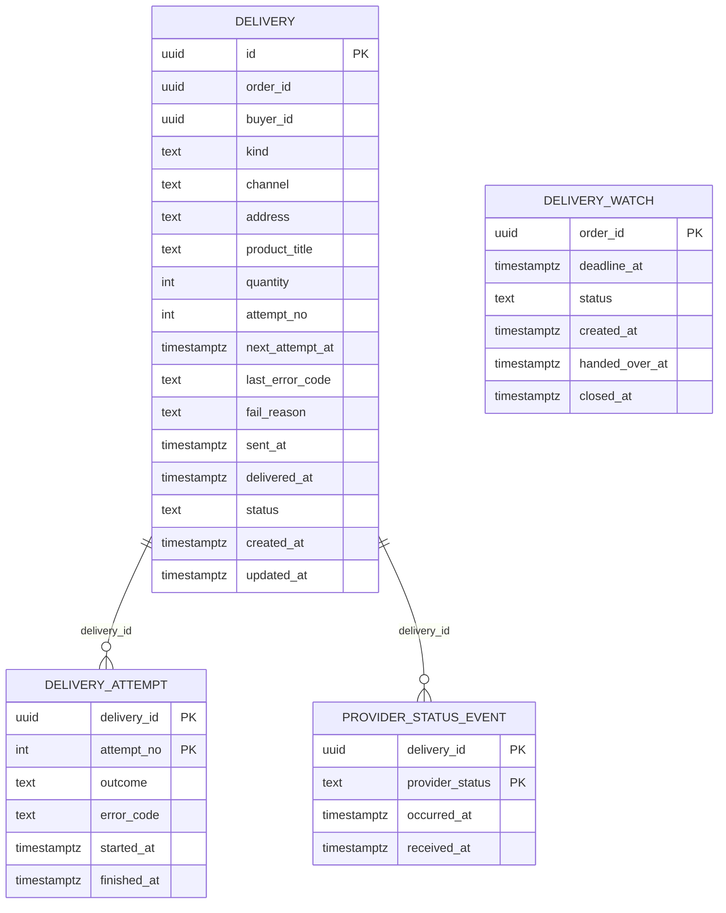

# delivery-service: физическая модель данных

Файл создан скриптом `gen_schema_docs.py` из живой базы PostgreSQL 16, созданной из [ddl/delivery-service.sql](ddl/delivery-service.sql), вручную не правится. Общие решения, таблица инвариантов и находки шага лежат в [README](README.md).

| Поле | Содержание |
| --- | --- |
| Сервис | Выдача ([компоненты](../05-architecture/c4-components-delivery-service.md)) |
| База | `delivery_db` |
| Таблиц предметной области | 4, служебных (`outbox`, `processed_event`, `idempotency_key`) 3 |
| Роли приложения | `app_delivery` (схема `delivery`) |
| Назначение | Сервис владеет выдачей ([SM-06](../03-processes/SM-06-delivery.md)): очередь отправки писем с ключами, история попыток без значений ключей, контроль доставки в течение 30 минут и дедупликация статусов провайдера ([ADR-011](../05-architecture/adr/ADR-011-guaranteed-delivery.md)). |

## Диаграмма связей

Связи показаны только внутри базы. Ссылки на сущности других сервисов и модулей хранятся идентификаторами без внешних ключей ([README, раздел 6](README.md)).

## Инварианты этой базы

Инварианты, для которых в этой базе есть ограничение, индекс или триггер. Способ обеспечения и пояснения лежат в таблице [README, раздел 5](README.md).

| ID | Инвариант | Объекты базы |
| --- | --- | --- |
| INV-10 | Количество в заказе от 1 до 10 | `ck_delivery_quantity` |
| INV-18 | Первичная выдача по заказу одна, повторное событие «заказ оплачен» второй не создаёт | `uq_delivery_order_id_primary`, `uq_delivery_order_id_queued`, `pk_processed_event` |
| INV-19 | В письме ровно столько ключей, сколько в заказе, и они отправляются на адрес из снимка заказа | `ck_delivery_quantity`, `ck_delivery_address_len` |
| INV-20 | Значения ключей не попадают в логи, события Kafka и базу «Выдачи» | `ck_delivery_last_error_code`, `ck_delivery_attempt_error_code` |
| INV-43 | Действие сотрудника и событие аудита записываются в одной транзакции (Outbox): действия без записи в журнале не бывает | `uq_outbox_event_id`, `ck_outbox_published_or_failed`, `ix_outbox_unpublished` |
| INV-44 | Персональные данные (e-mail, телефон, имя) лежат в «Пользователе» и в снимках адреса доставки в заказе и выдаче. Анонимизация затрагивает все эти места одновременно | `ix_delivery_buyer_id` |

## Таблицы

### delivery.delivery

Одна доставка ключей по заказу: письмо на адрес из снимка. Ключи не хранятся, значения берутся у inventory-service в момент отправки (INV-20).

**Столбцы**

| Столбец | Тип | Обязателен | По умолчанию | Описание |
| --- | --- | --- | --- | --- |
| `id` | `uuid` | да |  | DeliveryID. Он же идентификатор сообщения у e-mail-провайдера (ADR-006) |
| `order_id` | `uuid` | да |  | OrderID. У заказа несколько выдач, первичная одна (INV-18). Чужая база, внешнего ключа нет |
| `buyer_id` | `uuid` | да |  | BuyerID из order.paid: по нему анонимизация находит выдачи пользователя (INV-44) |
| `kind` | `text` | да |  | primary (первичная, одна на заказ) или repeat (повторная по обращению) |
| `channel` | `text` | да | `'email'::text` | Канал выдачи, в R1 только email |
| `address` | `text` | да |  | Снимок адреса доставки из заказа на момент создания выдачи (персональные данные, INV-44) |
| `product_title` | `text` | да |  | Название товара для письма. Приходит в order.paid (находка F12-6), ключей не содержит |
| `quantity` | `integer` | да |  | Сколько ключей должно быть в письме: сверка с ответом inventory-service (INV-19) |
| `attempt_no` | `integer` | да | `0` | Число выполненных попыток отправки, от 0 до 6. Автоповторы меняют только его |
| `next_attempt_at` | `timestamp with time zone` | нет |  | Срок следующей попытки. У занятой выдачи сдвигается на аренду 2 минуты, чтобы упавший процесс не терял выдачу |
| `last_error_code` | `text` | нет |  | Код последней ошибки отправки: короткий идентификатор без свободного текста, значения ключей сюда попасть не могут |
| `fail_reason` | `text` | нет |  | attempts_exhausted или address_rejected, только у статуса failed |
| `sent_at` | `timestamp with time zone` | нет |  | Когда провайдер принял письмо |
| `delivered_at` | `timestamp with time zone` | нет |  | Когда провайдер подтвердил доставку (метрика BG-01) |
| `status` | `text` | да | `'queued'::text` | SM-06: queued, sent, delivered, failed |
| `created_at` | `timestamp with time zone` | да | `now()` | Когда выдача создана |
| `updated_at` | `timestamp with time zone` | да | `now()` | Последнее изменение |

**Ограничения**

| Имя | Вид | Определение |
| --- | --- | --- |
| `pk_delivery` | первичный ключ | `PRIMARY KEY (id)` |
| `ck_delivery_address_len` | проверка | `CHECK (((char_length(address) >= 3) AND (char_length(address) <= 254)))` |
| `ck_delivery_attempt_no` | проверка | `CHECK (((attempt_no >= 0) AND (attempt_no <= 6)))` |
| `ck_delivery_channel` | проверка | `CHECK ((channel = 'email'::text))` |
| `ck_delivery_delivered_at` | проверка | `CHECK (((status = 'delivered'::text) = (delivered_at IS NOT NULL)))` |
| `ck_delivery_fail_reason` | проверка | `CHECK ((fail_reason = ANY (ARRAY['attempts_exhausted'::text, 'address_rejected'::text])))` |
| `ck_delivery_fail_state` | проверка | `CHECK (((status = 'failed'::text) = (fail_reason IS NOT NULL)))` |
| `ck_delivery_kind` | проверка | `CHECK ((kind = ANY (ARRAY['primary'::text, 'repeat'::text])))` |
| `ck_delivery_last_error_code` | проверка | `CHECK ((last_error_code ~ '^[a-z0-9_.-]{1,64}$'::text))` |
| `ck_delivery_next_attempt` | проверка | `CHECK (((status = 'queued'::text) = (next_attempt_at IS NOT NULL)))` |
| `ck_delivery_product_title_len` | проверка | `CHECK (((char_length(product_title) >= 1) AND (char_length(product_title) <= 200)))` |
| `ck_delivery_quantity` | проверка | `CHECK (((quantity >= 1) AND (quantity <= 10)))` |
| `ck_delivery_sent_at` | проверка | `CHECK (((status <> ALL (ARRAY['sent'::text, 'delivered'::text])) OR (sent_at IS NOT NULL)))` |
| `ck_delivery_status` | проверка | `CHECK ((status = ANY (ARRAY['queued'::text, 'sent'::text, 'delivered'::text, 'failed'::text])))` |

**Индексы**

| Имя | Определение | Для чего |
| --- | --- | --- |
| `ix_delivery_buyer_id` | `ix_delivery_buyer_id ON delivery.delivery USING btree (buyer_id)` | user.anonymized: замена адресов выдач покупателя служебным значением (INV-44) |
| `ix_delivery_dispatch` | `ix_delivery_dispatch ON delivery.delivery USING btree (next_attempt_at, id) WHERE (status = 'queued'::text)` | Диспетчер раз в секунду: WHERE status = 'queued' AND next_attempt_at <= now() ORDER BY next_attempt_at LIMIT 20 FOR UPDATE SKIP LOCKED |
| `ix_delivery_order_id` | `ix_delivery_order_id ON delivery.delivery USING btree (order_id, created_at)` | Выдачи заказа: приём order.address-updated, статус для поддержки, поиск по сообщению провайдера |
| `ix_delivery_sent_poll` | `ix_delivery_sent_poll ON delivery.delivery USING btree (sent_at) WHERE (status = 'sent'::text)` | Опрос статусов раз в 5 минут: выдачи sent старше 5 минут без статуса от провайдера |
| `uq_delivery_order_id_primary` | `UNIQUE uq_delivery_order_id_primary ON delivery.delivery USING btree (order_id) WHERE (kind = 'primary'::text)` | INV-18: вторая первичная выдача заказа невозможна, повторное order.paid её не создаст |
| `uq_delivery_order_id_queued` | `UNIQUE uq_delivery_order_id_queued ON delivery.delivery USING btree (order_id) WHERE (status = 'queued'::text)` | Не больше одной выдачи в очереди на заказ (ADR-011): повторная отправка не накладывается на ещё не отправленную |

**Триггеры**

| Имя | Когда | Назначение |
| --- | --- | --- |
| `trg_delivery_immutable` | до: изменение | Заказ, покупатель, тип, количество и название товара выдачи неизменны, время изменения обновляется |
| `trg_delivery_status_initial` | до: вставка | Начальный статус при вставке: queued |
| `trg_delivery_status_transition` | до: изменение статуса | Допустимые переходы статуса: queued → sent; queued → failed; sent → delivered; sent → failed |

### delivery.delivery_attempt

Попытки отправки письма: результат и код ошибки. Значений ключей и тела письма нет (INV-20).

**Столбцы**

| Столбец | Тип | Обязателен | По умолчанию | Описание |
| --- | --- | --- | --- | --- |
| `delivery_id` | `uuid` | да |  | Выдача |
| `attempt_no` | `integer` | да |  | Номер попытки от 1 до 6 (расписание 10 с, 30 с, 2, 5, 10 минут) |
| `outcome` | `text` | да |  | accepted (провайдер принял), retryable_error (тайм-аут, 5xx, 429), permanent_error (отказ по адресу, 400, 422) |
| `error_code` | `text` | нет |  | Короткий код ошибки провайдера или проверки (например key_count_mismatch), без свободного текста |
| `started_at` | `timestamp with time zone` | да |  | Начало попытки |
| `finished_at` | `timestamp with time zone` | да |  | Конец попытки |

**Ограничения**

| Имя | Вид | Определение |
| --- | --- | --- |
| `pk_delivery_attempt` | первичный ключ | `PRIMARY KEY (delivery_id, attempt_no)` |
| `fk_delivery_attempt_delivery_id` | внешний ключ | `FOREIGN KEY (delivery_id) REFERENCES delivery.delivery(id)` |
| `ck_delivery_attempt_attempt_no` | проверка | `CHECK (((attempt_no >= 1) AND (attempt_no <= 6)))` |
| `ck_delivery_attempt_error_code` | проверка | `CHECK ((error_code ~ '^[a-z0-9_.-]{1,64}$'::text))` |
| `ck_delivery_attempt_outcome` | проверка | `CHECK ((outcome = ANY (ARRAY['accepted'::text, 'retryable_error'::text, 'permanent_error'::text])))` |
| `ck_delivery_attempt_outcome_error` | проверка | `CHECK (((outcome = 'accepted'::text) = (error_code IS NULL)))` |
| `ck_delivery_attempt_time` | проверка | `CHECK ((finished_at >= started_at))` |

### delivery.delivery_watch

Контроль доставки: срок равен paid_at плюс 30 минут. Повторная выдача новой записи не создаёт, окна считаются от первичной.

**Столбцы**

| Столбец | Тип | Обязателен | По умолчанию | Описание |
| --- | --- | --- | --- | --- |
| `order_id` | `uuid` | да |  | OrderID, один контроль на заказ |
| `deadline_at` | `timestamp with time zone` | да |  | paid_at плюс окно контроля (по умолчанию 30 минут) |
| `status` | `text` | да | `'open'::text` | open (ждём доставку), handed_over (передан в поддержку, событие delivery.overdue), closed |
| `created_at` | `timestamp with time zone` | да | `now()` | Когда контроль открыт (по order.paid) |
| `handed_over_at` | `timestamp with time zone` | нет |  | Когда передан в поддержку |
| `closed_at` | `timestamp with time zone` | нет |  | Когда закрыт доставкой |

**Ограничения**

| Имя | Вид | Определение |
| --- | --- | --- |
| `pk_delivery_watch` | первичный ключ | `PRIMARY KEY (order_id)` |
| `ck_delivery_watch_closed` | проверка | `CHECK (((status = 'closed'::text) = (closed_at IS NOT NULL)))` |
| `ck_delivery_watch_handed_over` | проверка | `CHECK (((status <> 'handed_over'::text) OR (handed_over_at IS NOT NULL)))` |
| `ck_delivery_watch_handed_over_state` | проверка | `CHECK (((status = ANY (ARRAY['handed_over'::text, 'closed'::text])) OR (handed_over_at IS NULL)))` |
| `ck_delivery_watch_status` | проверка | `CHECK ((status = ANY (ARRAY['open'::text, 'handed_over'::text, 'closed'::text])))` |

**Индексы**

| Имя | Определение | Для чего |
| --- | --- | --- |
| `ix_delivery_watch_due` | `ix_delivery_watch_due ON delivery.delivery_watch USING btree (deadline_at) WHERE (status = 'open'::text)` | Задание контроля раз в 30 секунд: WHERE status = 'open' AND deadline_at <= now() FOR UPDATE SKIP LOCKED |

**Триггеры**

| Имя | Когда | Назначение |
| --- | --- | --- |
| `trg_delivery_watch_status_initial` | до: вставка | Начальный статус при вставке: open |
| `trg_delivery_watch_status_transition` | до: изменение статуса | Допустимые переходы статуса: open → handed_over; open → closed; handed_over → closed |

### delivery.provider_status_event

Принятые статусы писем провайдера. Идентификатор сообщения у провайдера равен DeliveryID. Повтор пары не меняет ничего (ADR-006).

**Столбцы**

| Столбец | Тип | Обязателен | По умолчанию | Описание |
| --- | --- | --- | --- | --- |
| `delivery_id` | `uuid` | да |  | Выдача, она же сообщение у провайдера |
| `provider_status` | `text` | да |  | Статус от провайдера: доставлено или отказ (непрозрачная строка) |
| `occurred_at` | `timestamp with time zone` | да |  | Время события по данным провайдера |
| `received_at` | `timestamp with time zone` | да | `now()` | Когда статус принят |

**Ограничения**

| Имя | Вид | Определение |
| --- | --- | --- |
| `pk_provider_status_event` | первичный ключ | `PRIMARY KEY (delivery_id, provider_status)` |
| `fk_provider_status_event_delivery_id` | внешний ключ | `FOREIGN KEY (delivery_id) REFERENCES delivery.delivery(id)` |
| `ck_provider_status_event_status_len` | проверка | `CHECK (((char_length(provider_status) >= 1) AND (char_length(provider_status) <= 64)))` |

**Индексы**

| Имя | Определение | Для чего |
| --- | --- | --- |
| `ix_provider_status_event_received_at` | `ix_provider_status_event_received_at ON delivery.provider_status_event USING btree (received_at)` | Очистка записей старше срока хранения (14 суток) |

## Функции

| Функция | Назначение |
| --- | --- |
| `delivery.delivery_immutable()` | Заказ, покупатель, тип, количество и название товара выдачи неизменны, время изменения обновляется |
| `public.enforce_status_transition()` | Допустимые переходы статуса по диаграммам SM. Аргументы триггера: initial:<статус> для вставки и <из>><в> для изменения. Нарушение даёт ошибку 23514 с ограничением ck_<таблица>_status_transition |

## Права ролей

Каждая роль работает только со своей схемой. Роли создаются как `nologin`, пароли и вход задаёт окружение развёртывания, в SQL секретов нет.

| Роль | Таблица | Права |
| --- | --- | --- |
| `app_delivery` | `delivery.delivery` | INSERT, SELECT, UPDATE |
| `app_delivery` | `delivery.delivery_attempt` | INSERT, SELECT |
| `app_delivery` | `delivery.delivery_watch` | INSERT, SELECT, UPDATE |
| `app_delivery` | `delivery.provider_status_event` | DELETE, INSERT, SELECT |
| `app_delivery` | `public.idempotency_key` | DELETE, INSERT, SELECT, UPDATE |
| `app_delivery` | `public.outbox` | DELETE, INSERT, SELECT, UPDATE |
| `app_delivery` | `public.processed_event` | DELETE, INSERT, SELECT, UPDATE |
