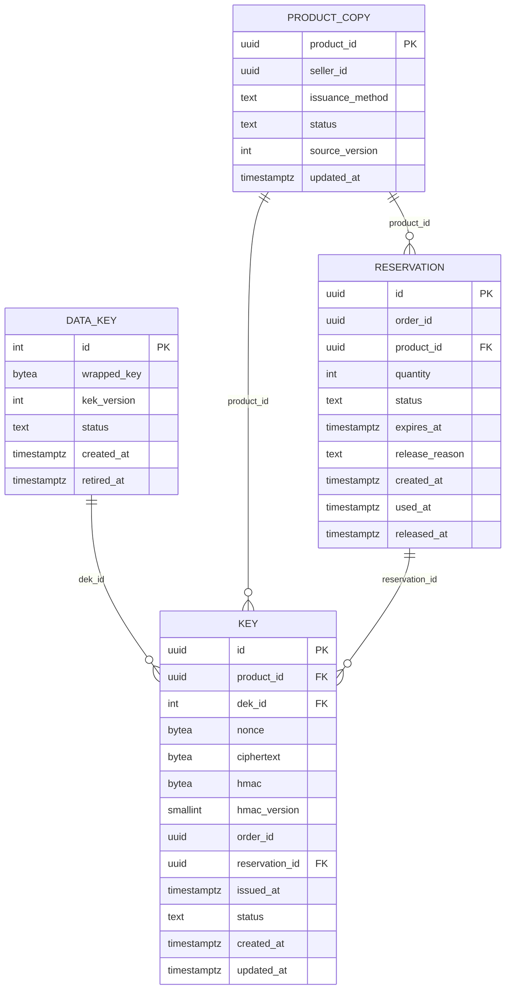

# inventory-service: физическая модель данных

Файл создан скриптом `gen_schema_docs.py` из живой базы PostgreSQL 16, созданной из [ddl/inventory-service.sql](ddl/inventory-service.sql), вручную не правится. Общие решения, таблица инвариантов и находки шага лежат в [README](README.md).

| Поле | Содержание |
| --- | --- |
| Сервис | Остатки и ключи ([компоненты](../05-architecture/c4-components-inventory-service.md)) |
| База | `inventory_db` |
| Таблиц предметной области | 4, служебных (`outbox`, `processed_event`, `idempotency_key`) 3 |
| Роли приложения | `app_inventory` (схема `inventory`), без права `DELETE` на таблицу ключей |
| Назначение | Сервис владеет резервами ([SM-08](../03-processes/SM-08-reservation.md)), зашифрованными ключами ([SM-03](../03-processes/SM-03-key.md)), версиями ключа данных шифрования и копией владельца и способа выдачи товара из событий каталога. Открытого значения ключа в базе нет нигде ([ADR-009](../05-architecture/adr/ADR-009-key-encryption-hmac.md)). |

## Диаграмма связей

Связи показаны только внутри базы. Ссылки на сущности других сервисов и модулей хранятся идентификаторами без внешних ключей ([README, раздел 6](README.md)).

## Инварианты этой базы

Инварианты, для которых в этой базе есть ограничение, индекс или триггер. Способ обеспечения и пояснения лежат в таблице [README, раздел 5](README.md).

| ID | Инвариант | Объекты базы |
| --- | --- | --- |
| INV-01 | Один ключ принадлежит не более чем одному заказу, в том числе при одновременных заказах | `ix_key_product_id_free`, `trg_key_immutable` |
| INV-02 | Ключ в статусах «зарезервирован» и «выдан» всегда привязан к заказу, свободный ключ не привязан ни к какому | `ck_key_binding`, `ck_key_issued_at` |
| INV-03 | Значения ключей уникальны в пределах товара | `uq_key_product_id_hmac` |
| INV-04 | Выданный ключ не возвращается в «свободен», ключ «аннулирован» не используется снова | `trg_key_status_transition` |
| INV-05 | Резерв охватывает всё заказанное количество, частичного резерва нет. Заказ получает все ключи или отменяется | `ck_reservation_quantity` |
| INV-06 | У заказа в любой момент не больше одного резерва в статусе «активен» | `uq_reservation_order_id_active` |
| INV-10 | Количество в заказе от 1 до 10 | `ck_reservation_quantity` |
| INV-20 | Значения ключей не попадают в логи, события Kafka и базу «Выдачи» | `ck_key_ciphertext`, `ck_key_hmac` |
| INV-43 | Действие сотрудника и событие аудита записываются в одной транзакции (Outbox): действия без записи в журнале не бывает | `uq_outbox_event_id`, `ck_outbox_published_or_failed`, `ix_outbox_unpublished` |

## Таблицы

### inventory.data_key

Версии ключа данных (DEK), зашифрованы мастер-ключом AES-256-GCM. Мастер-ключ в базе не хранится (ADR-009).

**Столбцы**

| Столбец | Тип | Обязателен | По умолчанию | Описание |
| --- | --- | --- | --- | --- |
| `id` | `integer` | да | `автонумерация` | Номер версии DEK. Числовая последовательность, а не UUID: это справочник шифрования, а не бизнес-сущность (исключение из conventions 3.1) |
| `wrapped_key` | `bytea` | да |  | DEK, зашифрованный KEK: nonce 12 байт, шифртекст 32 байта, тег 16 байт |
| `kek_version` | `integer` | да |  | Версия мастер-ключа, которым зашифрован DEK: нужна при ротации KEK |
| `status` | `text` | да | `'active'::text` | active: шифрует новые значения, retired: только читается. Активный один |
| `created_at` | `timestamp with time zone` | да | `now()` | Время создания версии ключа данных |
| `retired_at` | `timestamp with time zone` | нет |  | Когда версия выведена из использования |

**Ограничения**

| Имя | Вид | Определение |
| --- | --- | --- |
| `pk_data_key` | первичный ключ | `PRIMARY KEY (id)` |
| `ck_data_key_kek_version` | проверка | `CHECK ((kek_version >= 1))` |
| `ck_data_key_retired_at` | проверка | `CHECK (((status = 'retired'::text) = (retired_at IS NOT NULL)))` |
| `ck_data_key_status` | проверка | `CHECK ((status = ANY (ARRAY['active'::text, 'retired'::text])))` |
| `ck_data_key_wrapped_key` | проверка | `CHECK (((octet_length(wrapped_key) >= 60) AND (octet_length(wrapped_key) <= 128)))` |

**Индексы**

| Имя | Определение | Для чего |
| --- | --- | --- |
| `uq_data_key_active` | `UNIQUE uq_data_key_active ON inventory.data_key USING btree ((true)) WHERE (status = 'active'::text)` | Одна активная версия DEK: константное выражение в частичном уникальном индексе, вторая активная запись невозможна |

### inventory.key

Ключи товаров. Открытого значения нет нигде: шифртекст AES-256-GCM и HMAC для проверки дублей (INV-20). DELETE роли приложения запрещён.

**Столбцы**

| Столбец | Тип | Обязателен | По умолчанию | Описание |
| --- | --- | --- | --- | --- |
| `id` | `uuid` | да |  | KeyID. Входит в дополнительные аутентифицируемые данные шифрования, поэтому не меняется |
| `product_id` | `uuid` | да |  | ProductID пула. Входит в AAD шифрования и в HMAC, поэтому не меняется |
| `dek_id` | `integer` | да |  | Версия ключа данных, которым зашифровано значение |
| `nonce` | `bytea` | да |  | Одноразовое значение AES-GCM, 96 бит, случайное на каждое шифрование |
| `ciphertext` | `bytea` | да |  | Шифртекст значения вместе с тегом проверки целостности (16 байт). Значение до 1024 символов UTF-8 |
| `hmac` | `bytea` | да |  | HMAC-SHA-256 от «ProductID, 0x00, нормализованное значение» с секретом вне базы. Пара с product_id уникальна (INV-03) |
| `hmac_version` | `smallint` | да | `1` | Версия секрета HMAC: нужна при миграции после компрометации секрета (ADR-009) |
| `order_id` | `uuid` | нет |  | OrderID. Пуст у свободного ключа (INV-02), чужая база, внешнего ключа нет |
| `reservation_id` | `uuid` | нет |  | Резерв, который держит ключ. Пуст у свободного ключа (INV-02) |
| `issued_at` | `timestamp with time zone` | нет |  | Дата перехода в issued (подтверждение оплаты) |
| `status` | `text` | да | `'free'::text` | SM-03: free, reserved, issued, voided (voided появляется в R2) |
| `created_at` | `timestamp with time zone` | да | `now()` | Когда ключ загружен |
| `updated_at` | `timestamp with time zone` | да | `now()` | Последнее изменение статуса |

**Ограничения**

| Имя | Вид | Определение |
| --- | --- | --- |
| `pk_key` | первичный ключ | `PRIMARY KEY (id)` |
| `uq_key_product_id_hmac` | уникальность | `UNIQUE (product_id, hmac)` |
| `fk_key_dek_id` | внешний ключ | `FOREIGN KEY (dek_id) REFERENCES inventory.data_key(id)` |
| `fk_key_product_id` | внешний ключ | `FOREIGN KEY (product_id) REFERENCES inventory.product_copy(product_id)` |
| `fk_key_reservation_id` | внешний ключ | `FOREIGN KEY (reservation_id) REFERENCES inventory.reservation(id)` |
| `ck_key_binding` | проверка | `CHECK ((((status = 'free'::text) AND (order_id IS NULL) AND (reservation_id IS NULL)) OR ((status = ANY (ARRAY['reserved'::text, 'issued'::text])) AND (order_id IS NOT NULL) AND (reservation_id IS NOT NULL)) OR (status = 'voided'::text)))` |
| `ck_key_ciphertext` | проверка | `CHECK (((octet_length(ciphertext) >= 17) AND (octet_length(ciphertext) <= 4112)))` |
| `ck_key_hmac` | проверка | `CHECK ((octet_length(hmac) = 32))` |
| `ck_key_hmac_version` | проверка | `CHECK ((hmac_version >= 1))` |
| `ck_key_issued_at` | проверка | `CHECK ((((status = ANY (ARRAY['free'::text, 'reserved'::text])) AND (issued_at IS NULL)) OR ((status = ANY (ARRAY['issued'::text, 'voided'::text])) AND (issued_at IS NOT NULL))))` |
| `ck_key_nonce` | проверка | `CHECK ((octet_length(nonce) = 12))` |
| `ck_key_status` | проверка | `CHECK ((status = ANY (ARRAY['free'::text, 'reserved'::text, 'issued'::text, 'voided'::text])))` |

**Индексы**

| Имя | Определение | Для чего |
| --- | --- | --- |
| `ix_key_dek_id` | `ix_key_dek_id ON inventory.key USING btree (dek_id)` | Фоновая перешифровка: поиск значений старой версии DEK, и проверка внешнего ключа |
| `ix_key_order_id` | `ix_key_order_id ON inventory.key USING btree (order_id) WHERE (order_id IS NOT NULL)` | Ключи заказа: getKeyValues (статус issued) и подтверждение резерва |
| `ix_key_product_id_free` | `ix_key_product_id_free ON inventory.key USING btree (product_id, id) WHERE (status = 'free'::text)` | ADR-007: SELECT ... WHERE product_id = :p AND status = 'free' ORDER BY id LIMIT :n FOR UPDATE SKIP LOCKED без сортировки, и счёт свободных для stock.changed |
| `ix_key_product_id_status` | `ix_key_product_id_status ON inventory.key USING btree (product_id, status)` | GET /api/v1/seller/products/{id}/stock (US-4.4): число ключей по статусам одного товара |
| `ix_key_reservation_id` | `ix_key_reservation_id ON inventory.key USING btree (reservation_id) WHERE (reservation_id IS NOT NULL)` | Ключи резерва: возврат в free при снятии и перевод в issued при подтверждении, а также проверка внешнего ключа |

**Триггеры**

| Имя | Когда | Назначение |
| --- | --- | --- |
| `trg_key_immutable` | до: изменение | Идентификатор и товар ключа неизменны (на них опирается шифрование), закреплённый за заказом ключ не перепривязывается (INV-01, второй рубеж) |
| `trg_key_status_initial` | до: вставка | Начальный статус при вставке: free |
| `trg_key_status_transition` | до: изменение статуса | Допустимые переходы статуса: free → reserved; reserved → free; reserved → issued |

### inventory.product_copy

Копия товара из событий каталога: владелец и способ выдачи. Источник истины: catalog-service.

**Столбцы**

| Столбец | Тип | Обязателен | По умолчанию | Описание |
| --- | --- | --- | --- | --- |
| `product_id` | `uuid` | да |  | ProductID (чужая база, внешнего ключа нет) |
| `seller_id` | `uuid` | да |  | SellerID владельца товара |
| `issuance_method` | `text` | да |  | key_pool или seller_api. Загрузка пула разрешена только для key_pool |
| `status` | `text` | да |  | Статус товара по SM-04 из последнего применённого события |
| `source_version` | `integer` | да |  | Версия товара из события: более старое событие после сбоя порядка игнорируется |
| `updated_at` | `timestamp with time zone` | да | `now()` | Когда копия обновлена |

**Ограничения**

| Имя | Вид | Определение |
| --- | --- | --- |
| `pk_product_copy` | первичный ключ | `PRIMARY KEY (product_id)` |
| `ck_product_copy_issuance_method` | проверка | `CHECK ((issuance_method = ANY (ARRAY['key_pool'::text, 'seller_api'::text])))` |
| `ck_product_copy_source_version` | проверка | `CHECK ((source_version >= 1))` |
| `ck_product_copy_status` | проверка | `CHECK ((status = ANY (ARRAY['draft'::text, 'on_moderation'::text, 'published'::text, 'rejected'::text, 'blocked'::text, 'archived'::text])))` |

### inventory.reservation

Резерв ключей за заказом. Источник истины о сроке: эта таблица, Redis лишь запускает снятие по таймеру (ADR-012).

**Столбцы**

| Столбец | Тип | Обязателен | По умолчанию | Описание |
| --- | --- | --- | --- | --- |
| `id` | `uuid` | да |  | ReservationID |
| `order_id` | `uuid` | да |  | OrderID. У заказа за жизнь несколько резервов (поздняя оплата создаёт новый), активный не больше одного (INV-06) |
| `product_id` | `uuid` | да |  | ProductID резервируемого товара |
| `quantity` | `integer` | да |  | Количество равно количеству в заказе, частичного резерва нет (INV-05) |
| `status` | `text` | да | `'active'::text` | SM-08: active, used, released |
| `expires_at` | `timestamp with time zone` | да |  | Срок резерва: создание плюс значение параметра reservation.ttl-seconds |
| `release_reason` | `text` | нет |  | expired (срок истёк), payment_declined (отказ в оплате), order_cancelled (заказ отменён). В conventions 7.3 первое значение отсутствует: срок истёк там отдельное событие, в таблице нужна причина |
| `created_at` | `timestamp with time zone` | да | `now()` | Время создания резерва, от него считается срок |
| `used_at` | `timestamp with time zone` | нет |  | Когда резерв перешёл в used (подтверждение оплаты) |
| `released_at` | `timestamp with time zone` | нет |  | Когда резерв снят |

**Ограничения**

| Имя | Вид | Определение |
| --- | --- | --- |
| `pk_reservation` | первичный ключ | `PRIMARY KEY (id)` |
| `fk_reservation_product_id` | внешний ключ | `FOREIGN KEY (product_id) REFERENCES inventory.product_copy(product_id)` |
| `ck_reservation_expires_at` | проверка | `CHECK ((expires_at > created_at))` |
| `ck_reservation_quantity` | проверка | `CHECK (((quantity >= 1) AND (quantity <= 10)))` |
| `ck_reservation_release_reason` | проверка | `CHECK ((release_reason = ANY (ARRAY['expired'::text, 'payment_declined'::text, 'order_cancelled'::text])))` |
| `ck_reservation_released_state` | проверка | `CHECK ((((status = 'released'::text) = ((release_reason IS NOT NULL) AND (released_at IS NOT NULL))) AND ((release_reason IS NULL) = (released_at IS NULL))))` |
| `ck_reservation_status` | проверка | `CHECK ((status = ANY (ARRAY['active'::text, 'used'::text, 'released'::text])))` |
| `ck_reservation_used_state` | проверка | `CHECK (((status = 'used'::text) = (used_at IS NOT NULL)))` |

**Индексы**

| Имя | Определение | Для чего |
| --- | --- | --- |
| `ix_reservation_expires_at_active` | `ix_reservation_expires_at_active ON inventory.reservation USING btree (expires_at) WHERE (status = 'active'::text)` | Сверка раз в минуту (reservation-reconciler): активные резервы с прошедшим сроком, и загрузка таймера Redis при старте |
| `ix_reservation_order_id` | `ix_reservation_order_id ON inventory.reservation USING btree (order_id, created_at DESC)` | Последний резерв заказа: поздняя оплата (ADR-013) и снятие по order.cancelled |
| `uq_reservation_order_id_active` | `UNIQUE uq_reservation_order_id_active ON inventory.reservation USING btree (order_id) WHERE (status = 'active'::text)` | INV-06: второй активный резерв заказа невозможен. Тот же индекс отвечает на запрос подтверждения UPDATE ... WHERE order_id = :o AND status = 'active' |

**Триггеры**

| Имя | Когда | Назначение |
| --- | --- | --- |
| `trg_reservation_status_initial` | до: вставка | Начальный статус при вставке: active |
| `trg_reservation_status_transition` | до: изменение статуса | Допустимые переходы статуса: active → used; active → released |

## Функции

| Функция | Назначение |
| --- | --- |
| `inventory.key_immutable()` | Идентификатор и товар ключа неизменны (на них опирается шифрование), закреплённый за заказом ключ не перепривязывается (INV-01, второй рубеж) |
| `public.enforce_status_transition()` | Допустимые переходы статуса по диаграммам SM. Аргументы триггера: initial:<статус> для вставки и <из>><в> для изменения. Нарушение даёт ошибку 23514 с ограничением ck_<таблица>_status_transition |

## Права ролей

Каждая роль работает только со своей схемой. Роли создаются как `nologin`, пароли и вход задаёт окружение развёртывания, в SQL секретов нет.

| Роль | Таблица | Права |
| --- | --- | --- |
| `app_inventory` | `inventory.data_key` | INSERT, SELECT, UPDATE |
| `app_inventory` | `inventory.key` | INSERT, SELECT, UPDATE |
| `app_inventory` | `inventory.product_copy` | INSERT, SELECT, UPDATE |
| `app_inventory` | `inventory.reservation` | INSERT, SELECT, UPDATE |
| `app_inventory` | `public.idempotency_key` | DELETE, INSERT, SELECT, UPDATE |
| `app_inventory` | `public.outbox` | DELETE, INSERT, SELECT, UPDATE |
| `app_inventory` | `public.processed_event` | DELETE, INSERT, SELECT, UPDATE |
