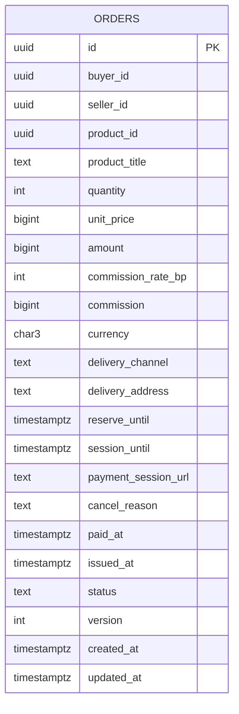

# order-service: физическая модель данных

Файл создан скриптом `gen_schema_docs.py` из живой базы PostgreSQL 16, созданной из [ddl/order-service.sql](ddl/order-service.sql), вручную не правится. Общие решения, таблица инвариантов и находки шага лежат в [README](README.md).

| Поле | Содержание |
| --- | --- |
| Сервис | Заказы ([компоненты](../05-architecture/c4-components-order-service.md)) |
| База | `order_db` |
| Таблиц предметной области | 1, служебных (`outbox`, `processed_event`, `idempotency_key`) 3 |
| Роли приложения | `app_orders` (схема `orders`) |
| Назначение | Сервис владеет заказом ([SM-01](../03-processes/SM-01-order.md)) и ведёт сагу оформления: резерв, платёжная сессия, оплата, выдача ([ADR-004](../05-architecture/adr/ADR-004-saga-purchase.md)). Снимки товара, цены, комиссии и адреса записываются при создании и не меняются. |

## Диаграмма связей

Связи показаны только внутри базы. Ссылки на сущности других сервисов и модулей хранятся идентификаторами без внешних ключей ([README, раздел 6](README.md)).

## Инварианты этой базы

Инварианты, для которых в этой базе есть ограничение, индекс или триггер. Способ обеспечения и пояснения лежат в таблице [README, раздел 5](README.md).

| ID | Инвариант | Объекты базы |
| --- | --- | --- |
| INV-07 | Срок платёжной сессии строго короче срока резерва | `ck_orders_deadlines` |
| INV-10 | Количество в заказе от 1 до 10 | `ck_orders_quantity` |
| INV-12 | Сумма заказа равна цене, умноженной на количество. Цена это снимок на момент оформления | `ck_orders_amount`, `ck_orders_unit_price`, `trg_orders_immutable` |
| INV-13 | Комиссия равна сумме заказа, умноженной на ставку на момент оформления, считается в копейках с математическим округлением и после создания не меняется | `ck_orders_commission`, `ck_orders_commission_rate_bp`, `trg_orders_immutable` |
| INV-16 | Заказ «оплачен» только при платеже «подтверждён», «возвращён» только при платеже «возвращён» | `trg_orders_status_transition`, `pk_processed_event` |
| INV-17 | Заказ «выдан» только когда ключи привязаны и провайдер принял письмо. Первый переход в «выдан» один раз за жизнь заказа, от него считаются окна и удержание, повторная отправка их не сдвигает | `trg_orders_status_transition`, `ck_orders_issued_at`, `trg_orders_immutable` |
| INV-43 | Действие сотрудника и событие аудита записываются в одной транзакции (Outbox): действия без записи в журнале не бывает | `uq_outbox_event_id`, `ck_outbox_published_or_failed`, `ix_outbox_unpublished` |
| INV-44 | Персональные данные (e-mail, телефон, имя) лежат в «Пользователе» и в снимках адреса доставки в заказе и выдаче. Анонимизация затрагивает все эти места одновременно | `ix_orders_buyer_id` |

## Таблицы

### orders.orders

Заказ: покупка одного товара одного продавца в количестве 1..10, оплачивается одним платежом (INV-11). Хранит снимки цены, комиссии, названия, адреса.

**Столбцы**

| Столбец | Тип | Обязателен | По умолчанию | Описание |
| --- | --- | --- | --- | --- |
| `id` | `uuid` | да |  | OrderID |
| `buyer_id` | `uuid` | да |  | BuyerID (пользователь, sub из Keycloak), чужая база, внешнего ключа нет |
| `seller_id` | `uuid` | да |  | SellerID (профиль продавца) |
| `product_id` | `uuid` | да |  | ProductID |
| `product_title` | `text` | да |  | Название товара на момент оформления (снимок, F11-3): нужно истории и письмам, пока товар могут переименовать или архивировать |
| `quantity` | `integer` | да |  | Количество от 1 до 10 (INV-10) |
| `unit_price` | `bigint` | да |  | Цена за единицу в копейках на момент оформления (снимок) |
| `amount` | `bigint` | да |  | Сумма заказа в копейках: цена, умноженная на количество (INV-12) |
| `commission_rate_bp` | `integer` | да |  | Ставка комиссии в базисных пунктах на момент оформления (200 это 2%). Техническая колонка для проверки INV-13, в событиях и API не передаётся |
| `commission` | `bigint` | да |  | Сумма комиссии в копейках: (amount * rate + 5000) / 10000, фиксируется при создании (INV-13) |
| `currency` | `character(3)` | да | `'RUB'::bpchar` | Валюта, в R1 только RUB |
| `delivery_channel` | `text` | да | `'email'::text` | Канал доставки, в R1 только email |
| `delivery_address` | `text` | да |  | Снимок e-mail покупателя на момент оформления (персональные данные, INV-44). Меняется только повторной отправкой по обращению и анонимизацией |
| `reserve_until` | `timestamp with time zone` | нет |  | Срок резерва: копия из резерва для показа покупателю и сверки, источник истины inventory-service |
| `session_until` | `timestamp with time zone` | нет |  | Срок платёжной сессии, строго короче срока резерва (INV-07) |
| `payment_session_url` | `text` | нет |  | Адрес страницы оплаты у шлюза: хранится в заказе, чтобы покупатель мог вернуться к оплате (getOrderPaymentSession). Ссылка не содержит данных карты |
| `cancel_reason` | `text` | нет |  | Причина отмены, объясняет покупателю, что произошло (SM-01, решение 4) |
| `paid_at` | `timestamp with time zone` | нет |  | Когда платёж подтверждён и заказ стал paid |
| `issued_at` | `timestamp with time zone` | нет |  | Первый переход в issued, один раз за жизнь заказа (INV-17): от него окна 72 часа и удержание 7 дней |
| `status` | `text` | да | `'created'::text` | SM-01: created, awaiting_payment, paid, issued, cancelled, refunded |
| `version` | `integer` | да | `1` | Версия строки, увеличивается при каждом изменении |
| `created_at` | `timestamp with time zone` | да | `now()` | Дата создания заказа |
| `updated_at` | `timestamp with time zone` | да | `now()` | Последнее изменение |

**Ограничения**

| Имя | Вид | Определение |
| --- | --- | --- |
| `pk_orders` | первичный ключ | `PRIMARY KEY (id)` |
| `ck_orders_amount` | проверка | `CHECK (((amount = (unit_price * quantity)) AND (amount <= '9007199254740991'::bigint)))` |
| `ck_orders_awaiting_payment` | проверка | `CHECK (((status <> 'awaiting_payment'::text) OR ((reserve_until IS NOT NULL) AND (session_until IS NOT NULL) AND (payment_session_url IS NOT NULL))))` |
| `ck_orders_cancel_reason` | проверка | `CHECK ((cancel_reason = ANY (ARRAY['out_of_stock'::text, 'payment_declined'::text, 'reservation_expired'::text, 'payment_session_failed'::text, 'system_error'::text, 'seller_api_timeout'::text])))` |
| `ck_orders_cancelled` | проверка | `CHECK (((status <> 'cancelled'::text) OR (cancel_reason IS NOT NULL)))` |
| `ck_orders_commission` | проверка | `CHECK ((((commission)::numeric = div((((amount)::numeric * (commission_rate_bp)::numeric) + (5000)::numeric), (10000)::numeric)) AND (commission >= 0)))` |
| `ck_orders_commission_rate_bp` | проверка | `CHECK (((commission_rate_bp >= 0) AND (commission_rate_bp <= 10000)))` |
| `ck_orders_currency` | проверка | `CHECK ((currency = 'RUB'::bpchar))` |
| `ck_orders_deadlines` | проверка | `CHECK ((((reserve_until IS NULL) = (session_until IS NULL)) AND ((reserve_until IS NULL) OR ((session_until < reserve_until) AND (reserve_until > created_at)))))` |
| `ck_orders_delivery_address_len` | проверка | `CHECK (((char_length(delivery_address) >= 3) AND (char_length(delivery_address) <= 254)))` |
| `ck_orders_delivery_channel` | проверка | `CHECK ((delivery_channel = 'email'::text))` |
| `ck_orders_early_state` | проверка | `CHECK (((status <> ALL (ARRAY['created'::text, 'awaiting_payment'::text])) OR ((paid_at IS NULL) AND (issued_at IS NULL) AND (cancel_reason IS NULL))))` |
| `ck_orders_issued_at` | проверка | `CHECK (((status <> 'issued'::text) OR (issued_at IS NOT NULL)))` |
| `ck_orders_paid_at` | проверка | `CHECK (((status <> ALL (ARRAY['paid'::text, 'issued'::text])) OR (paid_at IS NOT NULL)))` |
| `ck_orders_payment_session_url_len` | проверка | `CHECK (((char_length(payment_session_url) >= 1) AND (char_length(payment_session_url) <= 2048)))` |
| `ck_orders_product_title_len` | проверка | `CHECK (((char_length(product_title) >= 1) AND (char_length(product_title) <= 200)))` |
| `ck_orders_quantity` | проверка | `CHECK (((quantity >= 1) AND (quantity <= 10)))` |
| `ck_orders_status` | проверка | `CHECK ((status = ANY (ARRAY['created'::text, 'awaiting_payment'::text, 'paid'::text, 'issued'::text, 'cancelled'::text, 'refunded'::text])))` |
| `ck_orders_unit_price` | проверка | `CHECK (((unit_price > 0) AND (unit_price <= '9007199254740991'::bigint)))` |
| `ck_orders_version` | проверка | `CHECK ((version >= 1))` |

**Индексы**

| Имя | Определение | Для чего |
| --- | --- | --- |
| `ix_orders_awaiting_reserve_until` | `ix_orders_awaiting_reserve_until ON orders.orders USING btree (reserve_until) WHERE (status = 'awaiting_payment'::text)` | Сторож раз в минуту: заказы awaiting_payment с резервом, истёкшим больше 5 минут назад (SM-01/T6) |
| `ix_orders_buyer_id` | `ix_orders_buyer_id ON orders.orders USING btree (buyer_id, created_at DESC, id DESC)` | GET /api/v1/orders (US-5.9): заказы покупателя, новые выше, курсор по (created_at, id). Фильтр status поверх. Он же находит заказы покупателя при user.anonymized (INV-44) |
| `ix_orders_created_watchdog` | `ix_orders_created_watchdog ON orders.orders USING btree (created_at) WHERE (status = 'created'::text)` | Сторож раз в минуту: заказы created старше 60 секунд (потеряно событие или ответ) |

**Триггеры**

| Имя | Когда | Назначение |
| --- | --- | --- |
| `trg_orders_immutable` | до: изменение | Снимки заказа неизменны (INV-12, INV-13), дата первой выдачи записывается один раз (INV-17), версия растёт на единицу при каждом изменении |
| `trg_orders_status_initial` | до: вставка | Начальный статус при вставке: created |
| `trg_orders_status_transition` | до: изменение статуса | Допустимые переходы статуса: created → awaiting_payment; created → cancelled; awaiting_payment → paid; awaiting_payment → cancelled; cancelled → paid; cancelled → refunded; paid → issued |

## Функции

| Функция | Назначение |
| --- | --- |
| `orders.orders_immutable()` | Снимки заказа неизменны (INV-12, INV-13), дата первой выдачи записывается один раз (INV-17), версия растёт на единицу при каждом изменении |
| `public.enforce_status_transition()` | Допустимые переходы статуса по диаграммам SM. Аргументы триггера: initial:<статус> для вставки и <из>><в> для изменения. Нарушение даёт ошибку 23514 с ограничением ck_<таблица>_status_transition |

## Права ролей

Каждая роль работает только со своей схемой. Роли создаются как `nologin`, пароли и вход задаёт окружение развёртывания, в SQL секретов нет.

| Роль | Таблица | Права |
| --- | --- | --- |
| `app_orders` | `orders.orders` | INSERT, SELECT, UPDATE |
| `app_orders` | `public.idempotency_key` | DELETE, INSERT, SELECT, UPDATE |
| `app_orders` | `public.outbox` | DELETE, INSERT, SELECT, UPDATE |
| `app_orders` | `public.processed_event` | DELETE, INSERT, SELECT, UPDATE |
