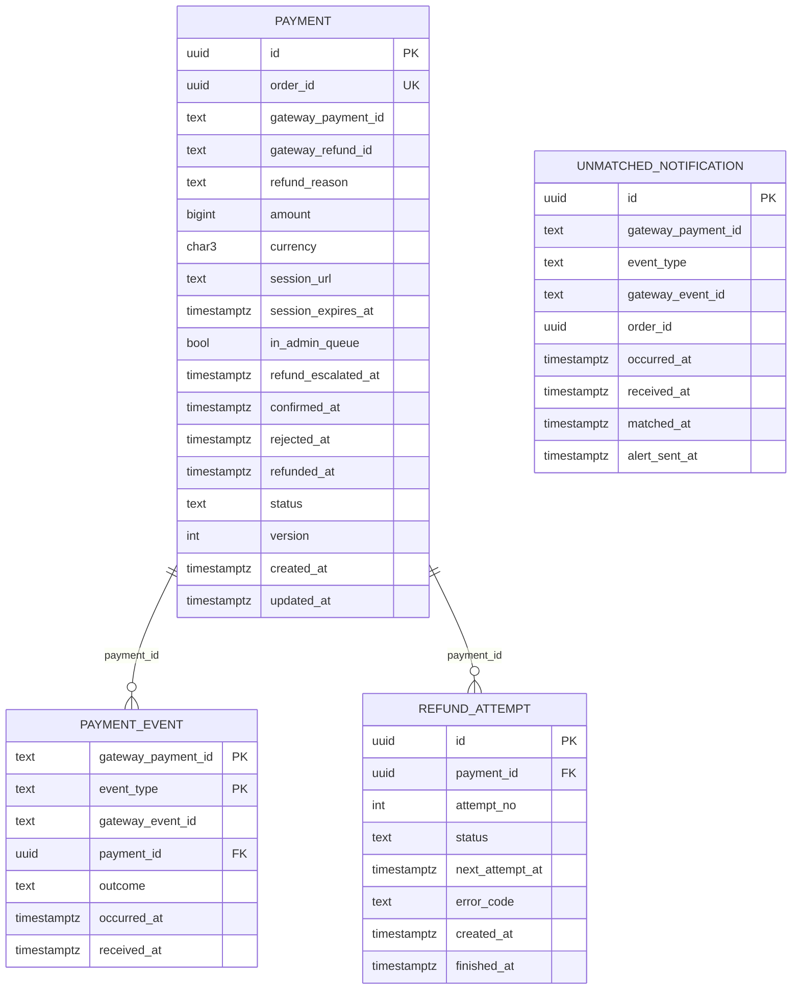

# payment-service: физическая модель данных

Файл создан скриптом `gen_schema_docs.py` из живой базы PostgreSQL 16, созданной из [ddl/payment-service.sql](ddl/payment-service.sql), вручную не правится. Общие решения, таблица инвариантов и находки шага лежат в [README](README.md).

| Поле | Содержание |
| --- | --- |
| Сервис | Платежи ([компоненты](../05-architecture/c4-components-payment-service.md)) |
| База | `payment_db` |
| Таблиц предметной области | 4, служебных (`outbox`, `processed_event`, `idempotency_key`) 3 |
| Роли приложения | `app_payments` (схема `payments`) |
| Назначение | Сервис владеет платежом ([SM-02](../03-processes/SM-02-payment.md)), журналом уведомлений платёжного шлюза, попытками возврата и несопоставленными уведомлениями ([ADR-013](../05-architecture/adr/ADR-013-late-payment.md), [ADR-015](../05-architecture/adr/ADR-015-payment-gateway-integration.md)). Данных банковских карт на платформе нет (NFT-5.1). |

## Диаграмма связей

Связи показаны только внутри базы. Ссылки на сущности других сервисов и модулей хранятся идентификаторами без внешних ключей ([README, раздел 6](README.md)).

## Инварианты этой базы

Инварианты, для которых в этой базе есть ограничение, индекс или триггер. Способ обеспечения и пояснения лежат в таблице [README, раздел 5](README.md).

| ID | Инвариант | Объекты базы |
| --- | --- | --- |
| INV-11 | Заказ относится к одному товару одного продавца и оплачивается одним платежом | `uq_payment_order_id` |
| INV-14 | Платёж меняет статус только по ответу или уведомлению шлюза, либо по отметке администратора о ручном возврате. Повторное уведомление ничего не меняет | `pk_payment_event`, `trg_payment_status_transition`, `ck_payment_confirmed`, `uq_unmatched_notification_payment_event` |
| INV-15 | Возврат полный и единственный на платёж, повторный запрос возврата не создаёт второй возврат | `uq_payment_gateway_refund_id`, `uq_refund_attempt_payment_id_succeeded`, `uq_refund_attempt_payment_id_open`, `ck_payment_refunded`, `trg_refund_attempt_guard` |
| INV-43 | Действие сотрудника и событие аудита записываются в одной транзакции (Outbox): действия без записи в журнале не бывает | `uq_outbox_event_id`, `ck_outbox_published_or_failed`, `ix_outbox_unpublished` |

## Таблицы

### payments.payment

Платёж по заказу и возврат по нему. Статус меняется только по ответу или уведомлению шлюза либо отметкой администратора (INV-14).

**Столбцы**

| Столбец | Тип | Обязателен | По умолчанию | Описание |
| --- | --- | --- | --- | --- |
| `id` | `uuid` | да |  | PaymentID |
| `order_id` | `uuid` | да |  | OrderID. Уникален: один платёж на заказ (INV-11). Чужая база, внешнего ключа нет |
| `gateway_payment_id` | `text` | нет |  | Внешний идентификатор платежа у шлюза, непрозрачная строка. Пуст, пока шлюз не ответил |
| `gateway_refund_id` | `text` | нет |  | Внешний идентификатор возврата, один на платёж (INV-15) |
| `refund_reason` | `text` | нет |  | Причина возврата: late_payment, seller_api_timeout (R2), dispute_decision (R2) |
| `amount` | `bigint` | да |  | Сумма платежа в копейках, равна сумме заказа. Возврат всегда полный |
| `currency` | `character(3)` | да | `'RUB'::bpchar` | Валюта, в R1 только RUB |
| `session_url` | `text` | нет |  | Адрес страницы оплаты у шлюза, ссылка без данных карты |
| `session_expires_at` | `timestamp with time zone` | нет |  | Срок платёжной сессии (12 минут от создания, INV-07). Платёж остаётся created и после него: шлюз может подтвердить позже (поздняя оплата) |
| `in_admin_queue` | `boolean` | да | `false` | Возврат после исчерпания попыток ждёт ручного исполнения администратором (FT-6.4) |
| `refund_escalated_at` | `timestamp with time zone` | нет |  | Когда возврат попал в очередь администратора |
| `confirmed_at` | `timestamp with time zone` | нет |  | Когда шлюз подтвердил платёж |
| `rejected_at` | `timestamp with time zone` | нет |  | Когда шлюз сообщил об отказе |
| `refunded_at` | `timestamp with time zone` | нет |  | Когда возврат подтверждён шлюзом или отмечен администратором |
| `status` | `text` | да | `'created'::text` | SM-02: created, confirmed, rejected, refunded |
| `version` | `integer` | да | `1` | Версия строки, увеличивается при каждом изменении |
| `created_at` | `timestamp with time zone` | да | `now()` | Дата создания платежа |
| `updated_at` | `timestamp with time zone` | да | `now()` | Последнее изменение |

**Ограничения**

| Имя | Вид | Определение |
| --- | --- | --- |
| `pk_payment` | первичный ключ | `PRIMARY KEY (id)` |
| `uq_payment_order_id` | уникальность | `UNIQUE (order_id)` |
| `ck_payment_admin_queue` | проверка | `CHECK (((in_admin_queue AND (status = 'confirmed'::text) AND (refund_escalated_at IS NOT NULL)) OR (NOT in_admin_queue)))` |
| `ck_payment_amount` | проверка | `CHECK (((amount > 0) AND (amount <= '9007199254740991'::bigint)))` |
| `ck_payment_confirmed` | проверка | `CHECK (((status <> ALL (ARRAY['confirmed'::text, 'refunded'::text])) OR ((gateway_payment_id IS NOT NULL) AND (confirmed_at IS NOT NULL))))` |
| `ck_payment_currency` | проверка | `CHECK ((currency = 'RUB'::bpchar))` |
| `ck_payment_gateway_payment_id_len` | проверка | `CHECK (((char_length(gateway_payment_id) >= 1) AND (char_length(gateway_payment_id) <= 128)))` |
| `ck_payment_gateway_refund_id_len` | проверка | `CHECK (((char_length(gateway_refund_id) >= 1) AND (char_length(gateway_refund_id) <= 128)))` |
| `ck_payment_gateway_refund_state` | проверка | `CHECK (((gateway_refund_id IS NULL) OR (status = ANY (ARRAY['confirmed'::text, 'refunded'::text]))))` |
| `ck_payment_refund_reason` | проверка | `CHECK ((refund_reason = ANY (ARRAY['late_payment'::text, 'seller_api_timeout'::text, 'dispute_decision'::text])))` |
| `ck_payment_refunded` | проверка | `CHECK ((((status = 'refunded'::text) = (refunded_at IS NOT NULL)) AND ((status <> 'refunded'::text) OR (refund_reason IS NOT NULL))))` |
| `ck_payment_rejected` | проверка | `CHECK (((status = 'rejected'::text) = (rejected_at IS NOT NULL)))` |
| `ck_payment_session_url_len` | проверка | `CHECK (((char_length(session_url) >= 1) AND (char_length(session_url) <= 2048)))` |
| `ck_payment_status` | проверка | `CHECK ((status = ANY (ARRAY['created'::text, 'confirmed'::text, 'rejected'::text, 'refunded'::text])))` |
| `ck_payment_version` | проверка | `CHECK ((version >= 1))` |

**Индексы**

| Имя | Определение | Для чего |
| --- | --- | --- |
| `ix_payment_created_open` | `ix_payment_created_open ON payments.payment USING btree (created_at) WHERE (status = 'created'::text)` | Сверка (reconciler): платежи created моложе 2 часов раз в 5 минут, до 24 часов раз в час, старше 24 часов в ежедневный отчёт |
| `ix_payment_manual_refund_queue` | `ix_payment_manual_refund_queue ON payments.payment USING btree (refund_escalated_at, id) WHERE in_admin_queue` | GET /api/v1/staff/payments/manual-refunds (FT-6.4): очередь ручных возвратов, старые выше |
| `uq_payment_gateway_payment_id` | `UNIQUE uq_payment_gateway_payment_id ON payments.payment USING btree (gateway_payment_id) WHERE (gateway_payment_id IS NOT NULL)` | INV-14: один внешний платёж соответствует одному нашему. Поиск платежа по идентификатору из уведомления шлюза |
| `uq_payment_gateway_refund_id` | `UNIQUE uq_payment_gateway_refund_id ON payments.payment USING btree (gateway_refund_id) WHERE (gateway_refund_id IS NOT NULL)` | INV-15: один внешний возврат соответствует одному платежу. Поиск по идентификатору возврата из уведомления шлюза |

**Триггеры**

| Имя | Когда | Назначение |
| --- | --- | --- |
| `trg_payment_immutable` | до: изменение | Заказ, сумма и валюта платежа неизменны, внешние идентификаторы платежа и возврата записываются один раз (INV-14, INV-15), версия растёт на единицу |
| `trg_payment_status_initial` | до: вставка | Начальный статус при вставке: created |
| `trg_payment_status_transition` | до: изменение статуса | Допустимые переходы статуса: created → confirmed; created → rejected; confirmed → refunded |

### payments.payment_event

Обработанные уведомления шлюза. Повтор той же пары даёт нарушение первичного ключа: второй раз статус не меняется (INV-14, FT-6.2).

**Столбцы**

| Столбец | Тип | Обязателен | По умолчанию | Описание |
| --- | --- | --- | --- | --- |
| `gateway_payment_id` | `text` | да |  | Внешний идентификатор платежа из уведомления |
| `event_type` | `text` | да |  | Тип события шлюза: подтверждение, отказ, возврат (непрозрачная строка) |
| `gateway_event_id` | `text` | да |  | Идентификатор уведомления у шлюза: для разбора, ключом дедупликации не служит |
| `payment_id` | `uuid` | да |  | Платёж, к которому применено уведомление |
| `outcome` | `text` | да |  | applied (статус изменён), amount_mismatch (сумма не совпала, статус не менялся), anomaly (подтверждение после отказа, разбор вручную) |
| `occurred_at` | `timestamp with time zone` | да |  | Время события по данным шлюза |
| `received_at` | `timestamp with time zone` | да | `now()` | Когда уведомление принято |

**Ограничения**

| Имя | Вид | Определение |
| --- | --- | --- |
| `pk_payment_event` | первичный ключ | `PRIMARY KEY (gateway_payment_id, event_type)` |
| `fk_payment_event_payment_id` | внешний ключ | `FOREIGN KEY (payment_id) REFERENCES payments.payment(id)` |
| `ck_payment_event_event_type_len` | проверка | `CHECK (((char_length(event_type) >= 1) AND (char_length(event_type) <= 64)))` |
| `ck_payment_event_ids_len` | проверка | `CHECK ((((char_length(gateway_payment_id) >= 1) AND (char_length(gateway_payment_id) <= 128)) AND ((char_length(gateway_event_id) >= 1) AND (char_length(gateway_event_id) <= 128))))` |
| `ck_payment_event_outcome` | проверка | `CHECK ((outcome = ANY (ARRAY['applied'::text, 'amount_mismatch'::text, 'anomaly'::text])))` |

**Индексы**

| Имя | Определение | Для чего |
| --- | --- | --- |
| `ix_payment_event_payment_id` | `ix_payment_event_payment_id ON payments.payment_event USING btree (payment_id)` | История уведомлений платежа для разбора администратором и проверка внешнего ключа |
| `ix_payment_event_received_at` | `ix_payment_event_received_at ON payments.payment_event USING btree (received_at)` | Очистка записей старше срока хранения (14 суток, как processed_event) |

### payments.refund_attempt

Попытки возврата по расписанию 0, 30 с, 2, 5, 10 минут (до 5 попыток). Исполнитель занимает попытку короткой транзакцией с арендой (FOR UPDATE SKIP LOCKED).

**Столбцы**

| Столбец | Тип | Обязателен | По умолчанию | Описание |
| --- | --- | --- | --- | --- |
| `id` | `uuid` | да |  | Идентификатор попытки |
| `payment_id` | `uuid` | да |  | Платёж, по которому выполняется возврат |
| `attempt_no` | `integer` | да |  | Номер попытки от 1 до 5. Сумма завершённых попыток это «число попыток возврата» из доменной модели |
| `status` | `text` | да | `'pending'::text` | pending (ждёт срока), in_progress (занята исполнителем, аренда), processing (шлюз принял, ждём подтверждение), succeeded, failed |
| `next_attempt_at` | `timestamp with time zone` | нет |  | Когда попытку можно выполнить. У занятой попытки сдвигается на время аренды. Это «время следующей попытки возврата» из доменной модели |
| `error_code` | `text` | нет |  | Код ошибки шлюза: короткий идентификатор без свободного текста |
| `created_at` | `timestamp with time zone` | да | `now()` | Когда попытка запланирована |
| `finished_at` | `timestamp with time zone` | нет |  | Когда попытка завершена |

**Ограничения**

| Имя | Вид | Определение |
| --- | --- | --- |
| `pk_refund_attempt` | первичный ключ | `PRIMARY KEY (id)` |
| `uq_refund_attempt_payment_id_attempt_no` | уникальность | `UNIQUE (payment_id, attempt_no)` |
| `fk_refund_attempt_payment_id` | внешний ключ | `FOREIGN KEY (payment_id) REFERENCES payments.payment(id)` |
| `ck_refund_attempt_attempt_no` | проверка | `CHECK (((attempt_no >= 1) AND (attempt_no <= 5)))` |
| `ck_refund_attempt_error_code` | проверка | `CHECK ((error_code ~ '^[a-z0-9_.-]{1,64}$'::text))` |
| `ck_refund_attempt_finished` | проверка | `CHECK (((status = ANY (ARRAY['succeeded'::text, 'failed'::text, 'processing'::text])) = (finished_at IS NOT NULL)))` |
| `ck_refund_attempt_open` | проверка | `CHECK (((status = ANY (ARRAY['pending'::text, 'in_progress'::text])) = (next_attempt_at IS NOT NULL)))` |
| `ck_refund_attempt_status` | проверка | `CHECK ((status = ANY (ARRAY['pending'::text, 'in_progress'::text, 'processing'::text, 'succeeded'::text, 'failed'::text])))` |

**Индексы**

| Имя | Определение | Для чего |
| --- | --- | --- |
| `ix_refund_attempt_due` | `ix_refund_attempt_due ON payments.refund_attempt USING btree (next_attempt_at) WHERE (status = ANY (ARRAY['pending'::text, 'in_progress'::text]))` | Исполнитель раз в 5 секунд: попытки со сроком, который подошёл, FOR UPDATE SKIP LOCKED. Занятые, у которых аренда истекла, берутся повторно |
| `uq_refund_attempt_payment_id_open` | `UNIQUE uq_refund_attempt_payment_id_open ON payments.refund_attempt USING btree (payment_id) WHERE (status = ANY (ARRAY['pending'::text, 'in_progress'::text]))` | Открытая попытка по платежу одна: повторная команда возврата не создаст вторую параллельную |
| `uq_refund_attempt_payment_id_succeeded` | `UNIQUE uq_refund_attempt_payment_id_succeeded ON payments.refund_attempt USING btree (payment_id) WHERE (status = ANY (ARRAY['succeeded'::text, 'processing'::text]))` | INV-15: у платежа не больше одной принятой шлюзом попытки возврата, второй возврат невозможен |

**Триггеры**

| Имя | Когда | Назначение |
| --- | --- | --- |
| `trg_refund_attempt_guard` | до: изменение | Завершённая попытка возврата не меняется, платёж и номер попытки неизменны (INV-15) |

### payments.unmatched_notification

Уведомления шлюза о неизвестных платежах. Тело уведомления не хранится: идентификаторы достаточно для сопоставления и разбора.

**Столбцы**

| Столбец | Тип | Обязателен | По умолчанию | Описание |
| --- | --- | --- | --- | --- |
| `id` | `uuid` | да |  | Идентификатор записи |
| `gateway_payment_id` | `text` | да |  | Внешний идентификатор платежа из уведомления |
| `event_type` | `text` | да |  | Тип события шлюза |
| `gateway_event_id` | `text` | да |  | Идентификатор уведомления у шлюза |
| `order_id` | `uuid` | нет |  | OrderID из метаданных уведомления, если шлюз его передал |
| `occurred_at` | `timestamp with time zone` | да |  | Время события по данным шлюза |
| `received_at` | `timestamp with time zone` | да | `now()` | Когда уведомление принято |
| `matched_at` | `timestamp with time zone` | нет |  | Когда сопоставлено и применено |
| `alert_sent_at` | `timestamp with time zone` | нет |  | Когда отправлено оповещение (через час без сопоставления) |

**Ограничения**

| Имя | Вид | Определение |
| --- | --- | --- |
| `pk_unmatched_notification` | первичный ключ | `PRIMARY KEY (id)` |
| `uq_unmatched_notification_payment_event` | уникальность | `UNIQUE (gateway_payment_id, event_type)` |
| `ck_unmatched_notification_alert` | проверка | `CHECK (((alert_sent_at IS NULL) OR (matched_at IS NULL)))` |
| `ck_unmatched_notification_ids_len` | проверка | `CHECK ((((char_length(gateway_payment_id) >= 1) AND (char_length(gateway_payment_id) <= 128)) AND ((char_length(gateway_event_id) >= 1) AND (char_length(gateway_event_id) <= 128))))` |

**Индексы**

| Имя | Определение | Для чего |
| --- | --- | --- |
| `ix_unmatched_notification_pending` | `ix_unmatched_notification_pending ON payments.unmatched_notification USING btree (received_at) WHERE (matched_at IS NULL)` | Планировщик раз в 10 секунд: несопоставленные уведомления, старые первыми. Оповещение через час: те же строки без alert_sent_at |

## Функции

| Функция | Назначение |
| --- | --- |
| `payments.payment_immutable()` | Заказ, сумма и валюта платежа неизменны, внешние идентификаторы платежа и возврата записываются один раз (INV-14, INV-15), версия растёт на единицу |
| `payments.refund_attempt_guard()` | Завершённая попытка возврата не меняется, платёж и номер попытки неизменны (INV-15) |
| `public.enforce_status_transition()` | Допустимые переходы статуса по диаграммам SM. Аргументы триггера: initial:<статус> для вставки и <из>><в> для изменения. Нарушение даёт ошибку 23514 с ограничением ck_<таблица>_status_transition |

## Права ролей

Каждая роль работает только со своей схемой. Роли создаются как `nologin`, пароли и вход задаёт окружение развёртывания, в SQL секретов нет.

| Роль | Таблица | Права |
| --- | --- | --- |
| `app_payments` | `payments.payment` | INSERT, SELECT, UPDATE |
| `app_payments` | `payments.payment_event` | DELETE, INSERT, SELECT |
| `app_payments` | `payments.refund_attempt` | INSERT, SELECT, UPDATE |
| `app_payments` | `payments.unmatched_notification` | INSERT, SELECT, UPDATE |
| `app_payments` | `public.idempotency_key` | DELETE, INSERT, SELECT, UPDATE |
| `app_payments` | `public.outbox` | DELETE, INSERT, SELECT, UPDATE |
| `app_payments` | `public.processed_event` | DELETE, INSERT, SELECT, UPDATE |
