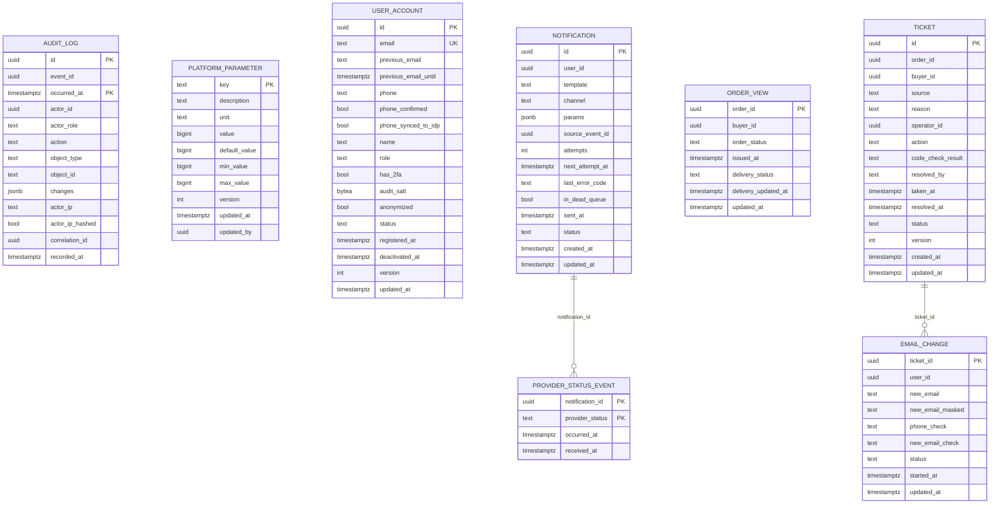

# platform-service: физическая модель данных

Файл создан скриптом `gen_schema_docs.py` из живой базы PostgreSQL 16, созданной из [ddl/platform-service.sql](ddl/platform-service.sql), вручную не правится. Общие решения, таблица инвариантов и находки шага лежат в [README](README.md).

| Поле | Содержание |
| --- | --- |
| Сервис | Платформа: идентификация, поддержка, уведомления, аудит и администрирование ([компоненты](../05-architecture/c4-components-platform-service.md)) |
| База | `platform_db` |
| Таблиц предметной области | 8, служебных (`outbox`, `processed_event`, `idempotency_key`) 3 |
| Роли приложения | `app_identity`, `app_support`, `app_notification`, `app_audit_admin` и `app_audit_writer` (только `INSERT` и `SELECT` в журнал аудита) |
| Назначение | Четыре модуля в одной базе, у каждого своя схема и роль: `identity` (расширение учётной записи Keycloak: телефон, роль, признаки), `support` (обращения по [SM-07](../03-processes/SM-07-support-ticket.md), смена e-mail, модель чтения заказов), `notification` (очередь писем), `audit_admin` (параметры платформы и журнал аудита, секционированный по месяцам). Правила модульности: между схемами нет внешних ключей и запросов. |

## Диаграмма связей

Связи показаны только внутри базы. Ссылки на сущности других сервисов и модулей хранятся идентификаторами без внешних ключей ([README, раздел 6](README.md)).

## Инварианты этой базы

Инварианты, для которых в этой базе есть ограничение, индекс или триггер. Способ обеспечения и пояснения лежат в таблице [README, раздел 5](README.md).

| ID | Инвариант | Объекты базы |
| --- | --- | --- |
| INV-07 | Срок платёжной сессии строго короче срока резерва | `trg_platform_parameter_session_vs_reserve` |
| INV-21 | По заказу не больше одного открытого обращения (создано или в работе) | `uq_ticket_order_id_open` |
| INV-22 | Обращение покупателя возможно только в течение 72 часов после первичной выдачи, обращение системы окну не подчиняется | `ck_ticket_source_reason` |
| INV-23 | Оператор не видит значение ключа ни в каком виде | `ck_order_view_order_status`, `ck_order_view_delivery_status`, `ck_notification_params` |
| INV-34 | E-mail и номер телефона уникальны среди учётных записей, уникальность номера обеспечена индексом в базе | `uq_user_account_email`, `uq_user_account_phone`, `ck_user_account_phone` |
| INV-35 | Первый заказ создаётся только пользователем с подтверждённым телефоном | `ck_user_account_phone_confirmed` |
| INV-36 | Роль «Продавец» есть только у пользователя с профилем «одобрен», вручную она не назначается | `ck_user_account_role` |
| INV-38 | В системе всегда есть хотя бы один активный администратор | `trg_user_account_last_admin` |
| INV-42 | Журнал аудита только добавляется. Персональные данные в нём в открытом виде не хранятся: ID, имена полей и HMAC-хеши | `trg_audit_log_no_update`, `trg_audit_log_no_delete`, `trg_audit_log_no_truncate`, `ck_audit_log_changes`, `uq_audit_log_event_id` |
| INV-43 | Действие сотрудника и событие аудита записываются в одной транзакции (Outbox): действия без записи в журнале не бывает | `uq_outbox_event_id`, `ck_outbox_published_or_failed`, `ix_outbox_unpublished` |
| INV-44 | Персональные данные (e-mail, телефон, имя) лежат в «Пользователе» и в снимках адреса доставки в заказе и выдаче. Анонимизация затрагивает все эти места одновременно | `ck_user_account_anonymized`, `ck_user_account_salt_state`, `trg_user_account_touch`, `ck_email_change_pii_cleanup`, `ck_notification_params` |

## Таблицы

### audit_admin.audit_log

Журнал аудита: только добавление. Персональные поля только HMAC-хешем (INV-42). Секции по месяцам, без удаления, срок хранения не менее 3 лет.

Таблица секционирована по месяцам `occurred_at`. Секции: `audit_log_2026_10`, `audit_log_2026_11`, `audit_log_2026_12`, `audit_log_2027_01`, `audit_log_2027_02`, `audit_log_2027_03`, `audit_log_default`. Секцию на новый месяц создаёт функция `audit_admin.create_audit_log_partition(date)`.

**Столбцы**

| Столбец | Тип | Обязателен | По умолчанию | Описание |
| --- | --- | --- | --- | --- |
| `id` | `uuid` | да |  | RecordID (UUID 7). Идентификатор по времени, а не последовательный номер (ADR-014 уточнён, F12-3) |
| `event_id` | `uuid` | да |  | Идентификатор события audit.recorded: ключ защиты от дубля вместе с occurred_at |
| `occurred_at` | `timestamp with time zone` | да |  | Время действия из события. Ключ секционирования |
| `actor_id` | `uuid` | да |  | ActorID: кто выполнил действие (идентификатор, не имя) |
| `actor_role` | `text` | да |  | Роль исполнителя на момент действия: buyer, seller, moderator, support-operator, admin, system |
| `action` | `text` | да |  | Код действия, например product.rejected, parameter.changed |
| `object_type` | `text` | да |  | Тип объекта действия |
| `object_id` | `text` | да |  | Идентификатор объекта строкой: объектом бывает и параметр с ключом вида reservation.ttl-seconds (F11-8) |
| `changes` | `jsonb` | да | `'[]'::jsonb` | Массив {field, personal, before, after}. Для персональных полей before и after только 64 hex-символа HMAC или null |
| `actor_ip` | `text` | нет |  | IP исполнителя: у сотрудника как есть, у обычного пользователя HMAC-хеш |
| `actor_ip_hashed` | `boolean` | да | `false` | true, если actor_ip хеш |
| `correlation_id` | `uuid` | нет |  | Сквозной идентификатор действия (NFT-6.0) |
| `recorded_at` | `timestamp with time zone` | да | `now()` | Когда запись вставлена в журнал |

**Ограничения**

| Имя | Вид | Определение |
| --- | --- | --- |
| `pk_audit_log` | первичный ключ | `PRIMARY KEY (id, occurred_at)` |
| `uq_audit_log_event_id` | уникальность | `UNIQUE (event_id, occurred_at)` |
| `ck_audit_log_action` | проверка | `CHECK ((action ~ '^[a-z0-9_.-]{1,128}$'::text))` |
| `ck_audit_log_actor_ip` | проверка | `CHECK (((actor_ip IS NULL) OR ((char_length(actor_ip) <= 128) AND ((NOT actor_ip_hashed) OR (actor_ip ~ '^[0-9a-f]{64}$'::text)))))` |
| `ck_audit_log_actor_role` | проверка | `CHECK ((actor_role = ANY (ARRAY['buyer'::text, 'seller'::text, 'moderator'::text, 'support-operator'::text, 'admin'::text, 'system'::text])))` |
| `ck_audit_log_changes` | проверка | `CHECK (audit_admin.audit_changes_valid(changes))` |
| `ck_audit_log_object_id_len` | проверка | `CHECK (((char_length(object_id) >= 1) AND (char_length(object_id) <= 128)))` |
| `ck_audit_log_object_type` | проверка | `CHECK ((object_type ~ '^[a-z0-9_.-]{1,64}$'::text))` |

**Индексы**

| Имя | Определение | Для чего |
| --- | --- | --- |
| `ix_audit_log_action` | `ix_audit_log_action ON ONLY audit_admin.audit_log USING btree (action, occurred_at DESC, id DESC)` | Фильтр action журнала: все действия одного вида |
| `ix_audit_log_actor_id` | `ix_audit_log_actor_id ON ONLY audit_admin.audit_log USING btree (actor_id, occurred_at DESC, id DESC)` | Фильтр actorId журнала аудита: действия одного сотрудника, новые выше |
| `ix_audit_log_object` | `ix_audit_log_object ON ONLY audit_admin.audit_log USING btree (object_type, object_id, occurred_at DESC, id DESC)` | Фильтр objectType и objectId журнала: история одного объекта |
| `ix_audit_log_occurred_at` | `ix_audit_log_occurred_at ON ONLY audit_admin.audit_log USING btree (occurred_at DESC, id DESC)` | GET /api/v1/staff/audit-records (US-8.7) без фильтров и по периоду: новые выше, курсор по (occurred_at, id) |

**Триггеры**

| Имя | Когда | Назначение |
| --- | --- | --- |
| `trg_audit_log_no_delete` | до: удаление | Запрещает изменение, удаление и очистку записей журнала аудита для всех ролей, в том числе владельца (INV-42) |
| `trg_audit_log_no_truncate` | до: очистка | Запрещает изменение, удаление и очистку записей журнала аудита для всех ролей, в том числе владельца (INV-42) |
| `trg_audit_log_no_update` | до: изменение | Запрещает изменение, удаление и очистку записей журнала аудита для всех ролей, в том числе владельца (INV-42) |

### audit_admin.platform_parameter

Параметры платформы, которые администратор меняет без выпуска версии (US-8.3). Раздаются событием config.changed в сжатую тему platform.config.

**Столбцы**

| Столбец | Тип | Обязателен | По умолчанию | Описание |
| --- | --- | --- | --- | --- |
| `key` | `text` | да |  | Ключ параметра, совпадает с ключом записи Kafka platform.config, например reservation.ttl-seconds |
| `description` | `text` | да |  | Назначение параметра |
| `unit` | `text` | да |  | Единица значения: seconds, count, basis_points, kopecks, text, flag |
| `value` | `bigint` | да |  | Текущее значение, целое положительное в границах параметра |
| `default_value` | `bigint` | да |  | Значение по умолчанию |
| `min_value` | `bigint` | да |  | Нижняя граница, не меньше 1 |
| `max_value` | `bigint` | да |  | Верхняя граница |
| `version` | `integer` | да | `1` | Номер версии, он же ETag при правке (If-Match) |
| `updated_at` | `timestamp with time zone` | да | `now()` | Когда изменён |
| `updated_by` | `uuid` | нет |  | ActorID администратора, пусто у начального значения |

**Ограничения**

| Имя | Вид | Определение |
| --- | --- | --- |
| `pk_platform_parameter` | первичный ключ | `PRIMARY KEY (key)` |
| `ck_platform_parameter_bounds` | проверка | `CHECK (((min_value >= 1) AND (min_value <= max_value)))` |
| `ck_platform_parameter_default` | проверка | `CHECK (((default_value >= min_value) AND (default_value <= max_value)))` |
| `ck_platform_parameter_key` | проверка | `CHECK (((key ~ '^[a-z0-9]+([.-][a-z0-9]+)*$'::text) AND (char_length(key) <= 128)))` |
| `ck_platform_parameter_unit` | проверка | `CHECK ((unit = ANY (ARRAY['seconds'::text, 'count'::text, 'basis_points'::text, 'kopecks'::text, 'text'::text, 'flag'::text])))` |
| `ck_platform_parameter_value` | проверка | `CHECK (((value >= min_value) AND (value <= max_value)))` |
| `ck_platform_parameter_version` | проверка | `CHECK ((version >= 1))` |

**Триггеры**

| Имя | Когда | Назначение |
| --- | --- | --- |
| `trg_platform_parameter_guard` | до: вставка, изменение | Ключ параметра неизменен, версия растёт на единицу при каждой правке (ETag) |
| `trg_platform_parameter_session_vs_reserve` | после: вставка, изменение OF value | Срок платёжной сессии строго короче срока резерва (INV-07): проверка под консультативной блокировкой при правке любого из двух параметров |

### identity.user_account

Учётная запись платформы. Идентификатор равен sub из Keycloak (conventions 3.3). Деактивация сохраняет запись, анонимизация убирает персональные значения и соль аудита.

**Столбцы**

| Столбец | Тип | Обязателен | По умолчанию | Описание |
| --- | --- | --- | --- | --- |
| `id` | `uuid` | да |  | UserID, он же BuyerID и ActorID в других контекстах. Создаётся Keycloak (UUID 4) |
| `email` | `text` | да |  | E-mail в нормализованном виде (нижний регистр, без пробелов по краям, до 254 символов). После анонимизации служебное значение anonymized-<id>@invalid |
| `previous_email` | `text` | нет |  | Прежний адрес после смены e-mail: нужен, чтобы отправить письмо о смене и на него. Очищается через 7 суток |
| `previous_email_until` | `timestamp with time zone` | нет |  | Когда прежний адрес нужно очистить: смена плюс 7 суток |
| `phone` | `text` | нет |  | Номер в формате E.164. Пуст, пока не подтверждён, и после анонимизации. Уникален (FT-1.5) |
| `phone_confirmed` | `boolean` | да | `false` | Признак подтверждения телефона: без него первый заказ не оформляется (INV-35) |
| `phone_synced_to_idp` | `boolean` | да | `false` | Признак «передан в Keycloak»: атрибут phone_verified для токена. Сверка раз в минуту повторяет передачу, если false (ADR-010) |
| `name` | `text` | да |  | Отображаемое имя. После анонимизации «Удалён» |
| `role` | `text` | да | `'buyer'::text` | Роль: buyer, seller, moderator, support-operator, admin. «Гость» не хранится. Роль seller появляется только по событию seller.approved (INV-36) |
| `has_2fa` | `boolean` | да | `false` | Признак включённой 2FA. Для ролей кроме buyer обязателен для входа в кабинет (INV-37), контроль на стороне Keycloak и кода: роль можно назначить до настройки второго фактора |
| `audit_salt` | `bytea` | нет |  | Соль пользователя для ключа хеширования аудита, 16 байт случайных. Удаляется при анонимизации: хеши в журнале становятся несопоставимыми (ADR-014) |
| `anonymized` | `boolean` | да | `false` | Персональные данные заменены обезличенными значениями (FT-1.4, INV-44) |
| `status` | `text` | да | `'active'::text` | active или deactivated. Значение «заблокирован» из раздела 6.1 требований не используется (решение 3 доменной модели) |
| `registered_at` | `timestamp with time zone` | да | `now()` | Дата регистрации |
| `deactivated_at` | `timestamp with time zone` | нет |  | Дата деактивации |
| `version` | `integer` | да | `1` | Версия строки, увеличивается при каждом изменении |
| `updated_at` | `timestamp with time zone` | да | `now()` | Последнее изменение |

**Ограничения**

| Имя | Вид | Определение |
| --- | --- | --- |
| `pk_user_account` | первичный ключ | `PRIMARY KEY (id)` |
| `uq_user_account_email` | уникальность | `UNIQUE (email)` |
| `ck_user_account_anonymized` | проверка | `CHECK (((NOT anonymized) OR ((status = 'deactivated'::text) AND (phone IS NULL) AND (audit_salt IS NULL) AND (previous_email IS NULL) AND (email ~ '^anonymized-[0-9a-f-]{36}@invalid$'::text) AND (name = 'Удалён'::text))))` |
| `ck_user_account_audit_salt` | проверка | `CHECK (((audit_salt IS NULL) OR (octet_length(audit_salt) = 16)))` |
| `ck_user_account_deactivated` | проверка | `CHECK (((status = 'deactivated'::text) = (deactivated_at IS NOT NULL)))` |
| `ck_user_account_email` | проверка | `CHECK (((email = lower(btrim(email))) AND ((char_length(email) >= 3) AND (char_length(email) <= 254)) AND (POSITION(('@'::text) IN (email)) > 1)))` |
| `ck_user_account_name_len` | проверка | `CHECK (((char_length(name) >= 1) AND (char_length(name) <= 200)))` |
| `ck_user_account_phone` | проверка | `CHECK ((phone ~ '^\+[1-9][0-9]{6,14}$'::text))` |
| `ck_user_account_phone_confirmed` | проверка | `CHECK (((NOT phone_confirmed) OR (phone IS NOT NULL)))` |
| `ck_user_account_phone_synced` | проверка | `CHECK (((NOT phone_synced_to_idp) OR phone_confirmed))` |
| `ck_user_account_previous_email` | проверка | `CHECK ((((previous_email IS NULL) = (previous_email_until IS NULL)) AND ((previous_email IS NULL) OR ((previous_email = lower(btrim(previous_email))) AND ((char_length(previous_email) >= 3) AND (char_length(previous_email) <= 254))))))` |
| `ck_user_account_role` | проверка | `CHECK ((role = ANY (ARRAY['buyer'::text, 'seller'::text, 'moderator'::text, 'support-operator'::text, 'admin'::text])))` |
| `ck_user_account_salt_state` | проверка | `CHECK ((anonymized OR (audit_salt IS NOT NULL)))` |
| `ck_user_account_status` | проверка | `CHECK ((status = ANY (ARRAY['active'::text, 'deactivated'::text])))` |
| `ck_user_account_version` | проверка | `CHECK ((version >= 1))` |

**Индексы**

| Имя | Определение | Для чего |
| --- | --- | --- |
| `ix_user_account_phone_unsynced` | `ix_user_account_phone_unsynced ON identity.user_account USING btree (id) WHERE (phone_confirmed AND (NOT phone_synced_to_idp))` | Сверка identity-reconciler раз в минуту: подтверждённые телефоны, не переданные в Keycloak |
| `ix_user_account_previous_email_until` | `ix_user_account_previous_email_until ON identity.user_account USING btree (previous_email_until) WHERE (previous_email IS NOT NULL)` | Очистка прежних адресов e-mail через 7 суток после смены (identity-reconciler) |
| `ix_user_account_registered_at` | `ix_user_account_registered_at ON identity.user_account USING btree (registered_at DESC, id DESC)` | GET /api/v1/staff/users (US-8.1) без фильтров и только со status: новые выше, курсор по (registered_at, id). Поиск по точному e-mail идёт уникальным индексом uq_user_account_email |
| `ix_user_account_role` | `ix_user_account_role ON identity.user_account USING btree (role, registered_at DESC, id DESC)` | GET /api/v1/staff/users?role= (US-8.1): новые выше, фильтр status накладывается поверх, роль «покупатель» не читает весь список |
| `uq_user_account_phone` | `UNIQUE uq_user_account_phone ON identity.user_account USING btree (phone) WHERE (phone IS NOT NULL)` | INV-34: один номер привязан только к одной учётной записи (FT-1.5), проверка идёт индексом базы и закрывает гонку двух подтверждений |

**Триггеры**

| Имя | Когда | Назначение |
| --- | --- | --- |
| `trg_user_account_last_admin` | до: удаление, изменение OF role, status | В системе остаётся хотя бы один активный администратор (INV-38): проверка под консультативной блокировкой, два одновременных снятия не пройдут оба |
| `trg_user_account_status_initial` | до: вставка | Начальный статус при вставке: active |
| `trg_user_account_status_transition` | до: изменение статуса | Допустимые переходы статуса: active → deactivated |
| `trg_user_account_touch` | до: изменение | Идентификатор и дата регистрации неизменны, анонимизация необратима (INV-44), версия растёт на единицу |

### notification.notification

Письмо, SMS или webhook в очереди отправки. Получатель только по идентификатору пользователя (INV-44).

**Столбцы**

| Столбец | Тип | Обязателен | По умолчанию | Описание |
| --- | --- | --- | --- | --- |
| `id` | `uuid` | да |  | NotificationID, он же идентификатор сообщения у провайдера |
| `user_id` | `uuid` | да |  | UserID получателя, адрес берётся у identity.api в момент отправки |
| `template` | `text` | да |  | Код шаблона письма, например order.paid |
| `channel` | `text` | да | `'email'::text` | email, sms или webhook (в R1 письма) |
| `params` | `jsonb` | да | `'{}'::jsonb` | Параметры шаблона без персональных данных: идентификаторы, суммы, статусы |
| `source_event_id` | `uuid` | нет |  | Событие, из которого создано уведомление: повторная обработка события не создаёт второе письмо по тому же шаблону |
| `attempts` | `integer` | да | `0` | Число выполненных попыток отправки |
| `next_attempt_at` | `timestamp with time zone` | нет |  | Срок следующей попытки, есть только у уведомления в очереди |
| `last_error_code` | `text` | нет |  | Код последней ошибки без свободного текста |
| `in_dead_queue` | `boolean` | да | `false` | Признак «в очереди недоставленных»: письмо не доставлено после повторов (FT-7.3), даёт notification.failed |
| `sent_at` | `timestamp with time zone` | нет |  | Когда провайдер принял сообщение |
| `status` | `text` | да | `'queued'::text` | queued, sent, delivered, failed (статусной модели SM нет, значения служебные) |
| `created_at` | `timestamp with time zone` | да | `now()` | Когда поставлено в очередь |
| `updated_at` | `timestamp with time zone` | да | `now()` | Последнее изменение |

**Ограничения**

| Имя | Вид | Определение |
| --- | --- | --- |
| `pk_notification` | первичный ключ | `PRIMARY KEY (id)` |
| `ck_notification_attempts` | проверка | `CHECK (((attempts >= 0) AND (attempts <= 10)))` |
| `ck_notification_channel` | проверка | `CHECK ((channel = ANY (ARRAY['email'::text, 'sms'::text, 'webhook'::text])))` |
| `ck_notification_dead_queue` | проверка | `CHECK (((NOT in_dead_queue) OR (status = 'failed'::text)))` |
| `ck_notification_last_error_code` | проверка | `CHECK ((last_error_code ~ '^[a-z0-9_.-]{1,64}$'::text))` |
| `ck_notification_params` | проверка | `CHECK (((jsonb_typeof(params) = 'object'::text) AND (NOT (params ?\| ARRAY['email'::text, 'phone'::text, 'name'::text, 'address'::text, 'recipient'::text]))))` |
| `ck_notification_queue` | проверка | `CHECK (((status = 'queued'::text) = (next_attempt_at IS NOT NULL)))` |
| `ck_notification_sent_at` | проверка | `CHECK (((status <> ALL (ARRAY['sent'::text, 'delivered'::text])) OR (sent_at IS NOT NULL)))` |
| `ck_notification_status` | проверка | `CHECK ((status = ANY (ARRAY['queued'::text, 'sent'::text, 'delivered'::text, 'failed'::text])))` |
| `ck_notification_template` | проверка | `CHECK ((template ~ '^[a-z0-9_.-]{1,64}$'::text))` |

**Индексы**

| Имя | Определение | Для чего |
| --- | --- | --- |
| `ix_notification_dead_queue` | `ix_notification_dead_queue ON notification.notification USING btree (updated_at) WHERE in_dead_queue` | Разбор недоставленных писем администратором и оповещение |
| `ix_notification_dispatch` | `ix_notification_dispatch ON notification.notification USING btree (next_attempt_at, id) WHERE (status = 'queued'::text)` | Отправитель: WHERE status = 'queued' AND next_attempt_at <= now() ORDER BY next_attempt_at FOR UPDATE SKIP LOCKED |
| `ix_notification_user_id` | `ix_notification_user_id ON notification.notification USING btree (user_id, created_at DESC)` | Уведомления пользователя для разбора обращений и обезличивания по идентификатору |
| `uq_notification_source_event_id_template` | `UNIQUE uq_notification_source_event_id_template ON notification.notification USING btree (source_event_id, template) WHERE (source_event_id IS NOT NULL)` | Одно событие даёт одно письмо по шаблону, повторная обработка события безопасна (ADR-006) |

**Триггеры**

| Имя | Когда | Назначение |
| --- | --- | --- |
| `trg_notification_status_initial` | до: вставка | Начальный статус при вставке: queued |
| `trg_notification_status_transition` | до: изменение статуса | Допустимые переходы статуса: queued → sent; queued → failed; sent → delivered; sent → failed |

### notification.provider_status_event

Принятые статусы писем от провайдера: дедупликация по паре «сообщение, статус».

**Столбцы**

| Столбец | Тип | Обязателен | По умолчанию | Описание |
| --- | --- | --- | --- | --- |
| `notification_id` | `uuid` | да |  | Уведомление, оно же сообщение у провайдера |
| `provider_status` | `text` | да |  | Статус от провайдера (непрозрачная строка) |
| `occurred_at` | `timestamp with time zone` | да |  | Время события по данным провайдера |
| `received_at` | `timestamp with time zone` | да | `now()` | Когда статус принят |

**Ограничения**

| Имя | Вид | Определение |
| --- | --- | --- |
| `pk_provider_status_event` | первичный ключ | `PRIMARY KEY (notification_id, provider_status)` |
| `fk_provider_status_event_notification_id` | внешний ключ | `FOREIGN KEY (notification_id) REFERENCES notification.notification(id)` |
| `ck_provider_status_event_status_len` | проверка | `CHECK (((char_length(provider_status) >= 1) AND (char_length(provider_status) <= 64)))` |

**Индексы**

| Имя | Определение | Для чего |
| --- | --- | --- |
| `ix_provider_status_event_received_at` | `ix_provider_status_event_received_at ON notification.provider_status_event USING btree (received_at)` | Очистка записей старше срока хранения (14 суток) |

### support.email_change

Этап смены e-mail по обращению: проверка телефона, затем нового адреса. Результат проверки, не код (коды лежат в Redis как HMAC).

**Столбцы**

| Столбец | Тип | Обязателен | По умолчанию | Описание |
| --- | --- | --- | --- | --- |
| `ticket_id` | `uuid` | да |  | Обращение, по которому идёт смена. Одна запись на обращение, повторная попытка меняет её |
| `user_id` | `uuid` | да |  | Пользователь, чей адрес меняется (покупатель заказа) |
| `new_email` | `text` | нет |  | Новый адрес в нормализованном виде (персональные данные). Очищается при завершении или отказе (INV-44) |
| `new_email_masked` | `text` | да |  | Новый адрес с маской для показа оператору, например n***@mail.example |
| `phone_check` | `text` | да | `'pending'::text` | Проверка кода из SMS: pending, passed, failed |
| `new_email_check` | `text` | да | `'not_started'::text` | Проверка кода из письма на новый адрес: not_started, pending, passed, failed |
| `status` | `text` | да | `'awaiting_phone_code'::text` | awaiting_phone_code, awaiting_email_code, completed, failed |
| `started_at` | `timestamp with time zone` | да | `now()` | Когда смена начата |
| `updated_at` | `timestamp with time zone` | да | `now()` | Последнее изменение этапа |

**Ограничения**

| Имя | Вид | Определение |
| --- | --- | --- |
| `pk_email_change` | первичный ключ | `PRIMARY KEY (ticket_id)` |
| `fk_email_change_ticket_id` | внешний ключ | `FOREIGN KEY (ticket_id) REFERENCES support.ticket(id)` |
| `ck_email_change_completed` | проверка | `CHECK (((status <> 'completed'::text) OR ((phone_check = 'passed'::text) AND (new_email_check = 'passed'::text))))` |
| `ck_email_change_new_email` | проверка | `CHECK (((new_email = lower(btrim(new_email))) AND ((char_length(new_email) >= 3) AND (char_length(new_email) <= 254))))` |
| `ck_email_change_new_email_check` | проверка | `CHECK ((new_email_check = ANY (ARRAY['not_started'::text, 'pending'::text, 'passed'::text, 'failed'::text])))` |
| `ck_email_change_order_of_checks` | проверка | `CHECK (((new_email_check = 'not_started'::text) OR (phone_check = 'passed'::text)))` |
| `ck_email_change_phone_check` | проверка | `CHECK ((phone_check = ANY (ARRAY['pending'::text, 'passed'::text, 'failed'::text])))` |
| `ck_email_change_pii_cleanup` | проверка | `CHECK (((status = ANY (ARRAY['awaiting_phone_code'::text, 'awaiting_email_code'::text])) OR (new_email IS NULL)))` |
| `ck_email_change_status` | проверка | `CHECK ((status = ANY (ARRAY['awaiting_phone_code'::text, 'awaiting_email_code'::text, 'completed'::text, 'failed'::text])))` |

### support.order_view

Копия данных заказа для поддержки: покупатель, время первичной выдачи (окно 72 часа, INV-22) и статус выдачи. Источник истины: order-service и delivery-service.

**Столбцы**

| Столбец | Тип | Обязателен | По умолчанию | Описание |
| --- | --- | --- | --- | --- |
| `order_id` | `uuid` | да |  | OrderID |
| `buyer_id` | `uuid` | да |  | BuyerID: обращение создаёт только покупатель заказа |
| `order_status` | `text` | да |  | Статус заказа по SM-01 из последнего события |
| `issued_at` | `timestamp with time zone` | нет |  | Время первичной выдачи из order.issued: от него считается окно 72 часа |
| `delivery_status` | `text` | нет |  | Статус выдачи по SM-06, который видит оператор |
| `delivery_updated_at` | `timestamp with time zone` | нет |  | Время последнего применённого события выдачи: более раннее событие игнорируется |
| `updated_at` | `timestamp with time zone` | да | `now()` | Когда запись обновлена |

**Ограничения**

| Имя | Вид | Определение |
| --- | --- | --- |
| `pk_order_view` | первичный ключ | `PRIMARY KEY (order_id)` |
| `ck_order_view_delivery_status` | проверка | `CHECK ((delivery_status = ANY (ARRAY['queued'::text, 'sent'::text, 'delivered'::text, 'failed'::text])))` |
| `ck_order_view_order_status` | проверка | `CHECK ((order_status = ANY (ARRAY['created'::text, 'awaiting_payment'::text, 'paid'::text, 'issued'::text, 'cancelled'::text, 'refunded'::text])))` |

### support.ticket

Обращение в поддержку по одному заказу. Значения ключей и коды проверки не хранятся (INV-23, FT-7.5).

**Столбцы**

| Столбец | Тип | Обязателен | По умолчанию | Описание |
| --- | --- | --- | --- | --- |
| `id` | `uuid` | да |  | TicketID |
| `order_id` | `uuid` | да |  | OrderID. Открытое обращение по заказу не больше одного (INV-21) |
| `buyer_id` | `uuid` | да |  | BuyerID заказа |
| `source` | `text` | да |  | buyer или system. Окно 72 часа действует только для buyer (INV-22) |
| `reason` | `text` | да |  | key_not_received (покупатель), not_delivered, attempts_exhausted, delivery_overdue (система) |
| `operator_id` | `uuid` | нет |  | Оператор, взявший обращение. При возврате в очередь сбрасывается (SM-07/T3) |
| `action` | `text` | нет |  | resend (повторная отправка) или email_change (смена e-mail) |
| `code_check_result` | `text` | нет |  | Результат проверки кода покупателя: passed или failed. Сам код оператору не виден (FT-7.5) |
| `resolved_by` | `text` | нет |  | operator или system (решено по факту доставки, SM-07/T4) |
| `taken_at` | `timestamp with time zone` | нет |  | Когда оператор взял обращение в работу |
| `resolved_at` | `timestamp with time zone` | нет |  | Когда обращение решено |
| `status` | `text` | да | `'created'::text` | SM-07: created, in_progress, resolved |
| `version` | `integer` | да | `1` | Версия строки, увеличивается при каждом изменении |
| `created_at` | `timestamp with time zone` | да | `now()` | Дата создания обращения |
| `updated_at` | `timestamp with time zone` | да | `now()` | Последнее изменение |

**Ограничения**

| Имя | Вид | Определение |
| --- | --- | --- |
| `pk_ticket` | первичный ключ | `PRIMARY KEY (id)` |
| `ck_ticket_action` | проверка | `CHECK ((action = ANY (ARRAY['resend'::text, 'email_change'::text])))` |
| `ck_ticket_code_check_result` | проверка | `CHECK ((code_check_result = ANY (ARRAY['passed'::text, 'failed'::text])))` |
| `ck_ticket_created_state` | проверка | `CHECK (((status <> 'created'::text) OR ((operator_id IS NULL) AND (taken_at IS NULL))))` |
| `ck_ticket_in_progress_state` | проверка | `CHECK (((status <> 'in_progress'::text) OR ((operator_id IS NOT NULL) AND (taken_at IS NOT NULL))))` |
| `ck_ticket_reason` | проверка | `CHECK ((reason = ANY (ARRAY['key_not_received'::text, 'not_delivered'::text, 'attempts_exhausted'::text, 'delivery_overdue'::text])))` |
| `ck_ticket_resolved_by` | проверка | `CHECK ((resolved_by = ANY (ARRAY['operator'::text, 'system'::text])))` |
| `ck_ticket_resolved_state` | проверка | `CHECK (((status = 'resolved'::text) = ((resolved_at IS NOT NULL) AND (resolved_by IS NOT NULL))))` |
| `ck_ticket_source` | проверка | `CHECK ((source = ANY (ARRAY['buyer'::text, 'system'::text])))` |
| `ck_ticket_source_reason` | проверка | `CHECK (((source = 'buyer'::text) = (reason = 'key_not_received'::text)))` |
| `ck_ticket_status` | проверка | `CHECK ((status = ANY (ARRAY['created'::text, 'in_progress'::text, 'resolved'::text])))` |
| `ck_ticket_version` | проверка | `CHECK ((version >= 1))` |

**Индексы**

| Имя | Определение | Для чего |
| --- | --- | --- |
| `ix_ticket_buyer_id` | `ix_ticket_buyer_id ON support.ticket USING btree (buyer_id, created_at DESC, id DESC)` | GET /api/v1/support-tickets (US-7.1): обращения покупателя, новые выше, фильтры orderId и status поверх |
| `ix_ticket_operator_id` | `ix_ticket_operator_id ON support.ticket USING btree (operator_id, status, created_at) WHERE (operator_id IS NOT NULL)` | GET /api/v1/staff/support-tickets?operatorId=: обращения оператора |
| `ix_ticket_order_id` | `ix_ticket_order_id ON support.ticket USING btree (order_id, created_at DESC)` | Обращения заказа: фильтр orderId, закрытие обращения системы по delivery.delivered |
| `ix_ticket_status_created_at` | `ix_ticket_status_created_at ON support.ticket USING btree (status, created_at, id)` | GET /api/v1/staff/support-tickets (US-7.2): очередь по статусу, старые выше. Контроль NFT-2.4: created старше часа |
| `uq_ticket_order_id_open` | `UNIQUE uq_ticket_order_id_open ON support.ticket USING btree (order_id) WHERE (status = ANY (ARRAY['created'::text, 'in_progress'::text]))` | INV-21: открытое обращение по заказу одно, второе (создано или в работе) невозможно, в том числе при гонке события системы и обращения покупателя |

**Триггеры**

| Имя | Когда | Назначение |
| --- | --- | --- |
| `trg_ticket_status_initial` | до: вставка | Начальный статус при вставке: created |
| `trg_ticket_status_transition` | до: изменение статуса | Допустимые переходы статуса: created → in_progress; in_progress → created; created → resolved; in_progress → resolved |
| `trg_ticket_touch` | до: изменение | Заказ, покупатель, источник и причина обращения неизменны, версия растёт на единицу |

## Функции

| Функция | Назначение |
| --- | --- |
| `audit_admin.audit_changes_valid(changes jsonb)` | Форма поля changes журнала аудита: массив записей «поле, признак персональных данных, до, после», у персональных полей значения только HMAC-хеши (INV-42) |
| `audit_admin.audit_log_deny()` | Запрещает изменение, удаление и очистку записей журнала аудита для всех ролей, в том числе владельца (INV-42) |
| `audit_admin.check_session_shorter_than_reserve()` | Срок платёжной сессии строго короче срока резерва (INV-07): проверка под консультативной блокировкой при правке любого из двух параметров |
| `audit_admin.create_audit_log_partition(month_start date)` | Создаёт месячную секцию журнала аудита. Вызывается миграцией и ежемесячным заданием за 3 месяца вперёд |
| `audit_admin.platform_parameter_guard()` | Ключ параметра неизменен, версия растёт на единицу при каждой правке (ETag) |
| `identity.keep_last_admin()` | В системе остаётся хотя бы один активный администратор (INV-38): проверка под консультативной блокировкой, два одновременных снятия не пройдут оба |
| `identity.user_account_touch()` | Идентификатор и дата регистрации неизменны, анонимизация необратима (INV-44), версия растёт на единицу |
| `support.ticket_touch()` | Заказ, покупатель, источник и причина обращения неизменны, версия растёт на единицу |
| `public.enforce_status_transition()` | Допустимые переходы статуса по диаграммам SM. Аргументы триггера: initial:<статус> для вставки и <из>><в> для изменения. Нарушение даёт ошибку 23514 с ограничением ck_<таблица>_status_transition |

## Права ролей

Каждая роль работает только со своей схемой. Роли создаются как `nologin`, пароли и вход задаёт окружение развёртывания, в SQL секретов нет.

| Роль | Таблица | Права |
| --- | --- | --- |
| `app_audit_admin` | `audit_admin.platform_parameter` | INSERT, SELECT, UPDATE |
| `app_audit_admin` | `public.idempotency_key` | DELETE, INSERT, SELECT, UPDATE |
| `app_audit_admin` | `public.outbox` | DELETE, INSERT, SELECT, UPDATE |
| `app_audit_admin` | `public.processed_event` | DELETE, INSERT, SELECT, UPDATE |
| `app_audit_writer` | `audit_admin.audit_log` | INSERT, SELECT |
| `app_audit_writer` | `public.processed_event` | INSERT, SELECT |
| `app_identity` | `identity.user_account` | INSERT, SELECT, UPDATE |
| `app_identity` | `public.idempotency_key` | DELETE, INSERT, SELECT, UPDATE |
| `app_identity` | `public.outbox` | DELETE, INSERT, SELECT, UPDATE |
| `app_identity` | `public.processed_event` | DELETE, INSERT, SELECT, UPDATE |
| `app_notification` | `notification.notification` | INSERT, SELECT, UPDATE |
| `app_notification` | `notification.provider_status_event` | DELETE, INSERT, SELECT |
| `app_notification` | `public.idempotency_key` | DELETE, INSERT, SELECT, UPDATE |
| `app_notification` | `public.outbox` | DELETE, INSERT, SELECT, UPDATE |
| `app_notification` | `public.processed_event` | DELETE, INSERT, SELECT, UPDATE |
| `app_support` | `public.idempotency_key` | DELETE, INSERT, SELECT, UPDATE |
| `app_support` | `public.outbox` | DELETE, INSERT, SELECT, UPDATE |
| `app_support` | `public.processed_event` | DELETE, INSERT, SELECT, UPDATE |
| `app_support` | `support.email_change` | INSERT, SELECT, UPDATE |
| `app_support` | `support.order_view` | INSERT, SELECT, UPDATE |
| `app_support` | `support.ticket` | INSERT, SELECT, UPDATE |
