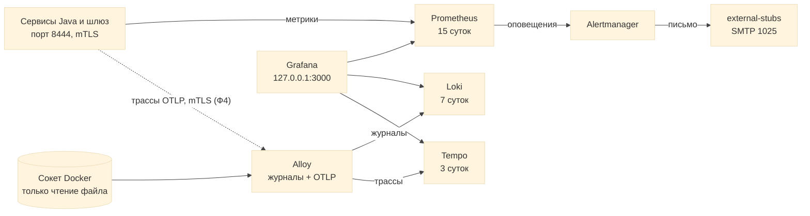

# infra/obs

Конфигурация стека наблюдения (профиль Compose `obs`, шаг 16 Ф3). Три сигнала: **метрики** (Prometheus), **журналы** (Loki), **трассы** (Tempo); собирает Alloy, показывает Grafana, о неполадках сообщает Alertmanager. Архитектура: [c4-deployment.md](../../docs/05-architecture/c4-deployment.md), разделы 2, 4.2, 5 и решение 22; память: [memory-budget.md](../../docs/09-operations/memory-budget.md) (1120 МБ на шесть контейнеров); версии: [versions.md](../../docs/09-operations/versions.md).



## Что где лежит

| Путь | Что | Проверяется |
| --- | --- | --- |
| `prometheus/prometheus.yml` | Цели: семь процессов Java по `https://<имя>:8444/actuator/prometheus` с клиентским сертификатом `tls_prometheus`, шесть компонентов стека по HTTP внутри сети `obs` | `promtool check config`, `check_obs.py` |
| `prometheus/rules/dgm.yml` | Правила: `ServiceDown`, `ObsComponentDown`, `HighServerErrorRate`, `GatewayRateLimiterFailOpen`, `BackupTooOld` (метрику отдаст `backup-job` в Ф6) | `promtool check rules` |
| `tests/rules_test.yml` | Модульные тесты правил: каждое оповещение срабатывает при условии и молчит без него | `promtool test rules` (`make obs-validate`) |
| `alertmanager/alertmanager.yml` | Приёмник: письмо `admin@dgm.local` через `external-stubs:1025`; быстрый маршрут для проверочных оповещений (`severity="test"`) | `amtool check-config` |
| `loki/loki.yaml` | Один процесс, файлы на диске, хранение 168 часов, схема v13 | `loki -verify-config` |
| `tempo/tempo.yaml` | Один процесс, блоки на диске, хранение 72 часа, приём OTLP gRPC на 4317 | `tempo -config.verify` |
| `alloy/config.alloy` | Журналы контейнеров проекта `dgm` через сокет Docker в Loki с метками `service`, `container`, `level`; OTLP по mTLS в Tempo | `alloy validate`, запуск стенда |
| `grafana/provisioning/**` | Источники данных Prometheus, Loki, Tempo и подключение панелей из файлов, правка в интерфейсе запрещена | `check_obs.py`, `make obs-check` |
| `grafana/dashboards/*.json` | Панели «Сервисы: доступность, запросы, ошибки, память» (7 панелей) и «Шлюз и журналы» (9 панелей, поиск по идентификатору запроса) | `check_obs.py`, `make obs-check` |

## Запуск

```bash
make up SET=full-obs DEBUG=1       # весь стенд и стек наблюдения (на ноутбуке с 8 ГБ не помещается, см. ниже)
make obs-check                     # цели Prometheus, Grafana, журнал в Loki, трасса в Tempo, оповещение письмом
make obs-validate                  # только файлы конфигурации: promtool, amtool, Loki, Tempo, Alloy (нужен Docker, стенд не нужен)
```

| Адрес на 127.0.0.1 (только с `DEBUG=1`) | Что |
| --- | --- |
| `http://127.0.0.1:3000` | Grafana, пользователь `admin`, пароль в файле `secrets/grafana_admin` |
| `http://127.0.0.1:9090` | Prometheus: цели `/targets`, правила `/rules` |
| `http://127.0.0.1:19094` | Alertmanager |
| `http://127.0.0.1:13100`, `13200` | Loki, Tempo (запросы по HTTP; Grafana ходит к ним по имени контейнера) |
| `https://127.0.0.1:14318` | Приём OTLP/HTTP в Alloy по взаимному TLS (клиентский сертификат из `secrets/`) |

На ноутбуке с 8 ГБ и пределом Docker 3 ГБ набор `full-obs` не помещается (сумма лимитов 5632 МБ, [memory-budget.md](../../docs/09-operations/memory-budget.md)): стек поднимается отдельно от сервисов, например `COMPOSE_PROFILES=stubs,obs docker compose -f compose.yaml -f compose.debug.yaml up -d` (1,2 ГБ), а полный набор проверяется в CI и на сервере.

## Решения и ограничения

| Что | Решение |
| --- | --- |
| Связь сигналов | Идентификатор запроса (`X-Correlation-Id`, `traceparent`) один на запрос от шлюза до сервиса: строки журнала находятся запросом `{service=~".+"} \|= "<идентификатор>"` на панели «Шлюз и журналы»; поле `traceId` в строке JSON становится ссылкой на трассу в Tempo, как только сервисы начнут отправлять трассы (Ф4) |
| Метки Loki | Только `service`, `container`, `level` (несколько десятков потоков). Идентификатор запроса остаётся в строке: метка с ним создала бы поток на каждый запрос |
| TLS | Prometheus (клиент mTLS к сервисам) и Alloy (приём OTLP из сети `obs`) имеют сертификаты. Между Prometheus, Alertmanager, Grafana, Loki и Tempo внутри закрытой сети `obs` TLS нет (решение 22): сеть `internal`, снаружи недостижима, порты публикует только отладочный файл на 127.0.0.1 |
| Сокет Docker | `:ro` защищает файл сокета, но не программный интерфейс Docker: Alloy с доступом к сокету может управлять контейнерами. Принято на стенде; прокси сокета только для чтения журналов добавляется в Ф6. Alloy работает не от root, в группе сокета (`DOCKER_GID`, `make up` подставляет её сам; в Docker Desktop `DOCKER_GID=0`) |
| Loki и Tempo без проверки Docker | В образах нет оболочки (distroless), поэтому `healthcheck` задать нечем. Готовность проверяют `make obs-check` (по `/ready`) и Prometheus (цель `up`, правило `ObsComponentDown`) |
| Память | Процессы Go ограничены `GOMEMLIMIT` около 85% лимита контейнера: сборщик мусора успевает до того, как контейнер убьют по памяти |
| Выборка трасс | В Ф3 сохраняются все трассы (синтетическая трасса `make obs-check`); выборка по доле запросов появится вместе с трассировкой сервисов в Ф4 |
| Секреты | Пароль и ключ шифрования Grafana только файлами `grafana_admin`, `grafana_secret_key` (переменные `GF_..__FILE`), в окружении и журналах их нет (проверяет `make stand-check`) |
